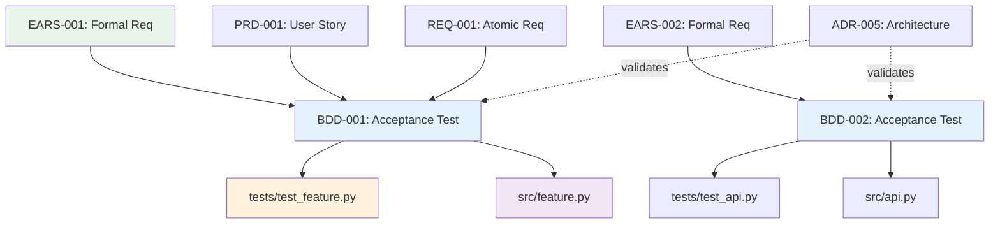

# Traceability Matrix: BDD-001 through BDD-NNN

## Document Control

| Item | Details |
|------|---------|
| Document ID | TRACEABILITY_MATRIX_BDD |
| Title | Comprehensive BDD Test Scenarios Traceability Matrix |
| Status | [Active/Draft] |
| Version | 1.0.0 |
| Date Created | YYYY-MM-DD |
| Author | [Team Name] |
| Purpose | Track bidirectional traceability for all Behavior-Driven Development (BDD) test scenarios |


---

**⚠️ TAG-BASED AUTO-GENERATION AVAILABLE**

This traceability matrix can be automatically generated by scanning code files for @bdd:, @spec:, @test: tags.

**Recommended Approach:** Use tag-based auto-discovery instead of manual maintenance.

**Generate automatically using:**
```bash
# Extract tags from all files
python scripts/extract_tags.py --source src/ docs/ tests/ --output docs/generated/tags.json

# Validate tags against documents
python scripts/validate_tags_against_docs.py --tags docs/generated/tags.json --strict

# Generate BDD traceability matrix
python scripts/generate_traceability_matrices.py --type BDD --output docs/BDD/BDD-000_TRACEABILITY_MATRIX.md
```

**Benefits:**
- ✅ Single source of truth: Tags embedded in code
- ✅ Always up-to-date: Generated from current codebase
- ✅ No manual sync: Automated validation prevents drift
- ✅ Coverage metrics: Automatically calculated

**Tag Format:** `@bdd: BDD-001:NNN` (for multi-requirement docs) or `@bdd: BDD-001` (for single-doc refs)

See: [TRACEABILITY.md](../TRACEABILITY.md#tag-based-auto-discovery-alternative) for complete tag-based workflow.

---

## 1. Overview

### 1.1 Document Type Description
BDD documents define acceptance criteria using Gherkin syntax (Given-When-Then), providing executable specifications that validate requirements through automated testing.

### 1.2 Coverage Scope
This matrix tracks all BDD feature files, mapping upstream requirements (EARS, PRD, REQ) to downstream test implementations and code artifacts.

### 1.3 Statistics
- **Total BDD Files Tracked**: [X] documents
- **Total Scenarios**: [Y] test scenarios
- **Total Steps**: [Z] test steps
- **Coverage Period**: [Start Date] to [End Date]
- **Last Updated**: YYYY-MM-DD

---

## 2. Required Tags (Cumulative Tagging Hierarchy - Layer 4)

### 2.1 Tag Requirements for BDD Artifacts

**Layer**: 4
**Artifact Type**: BDD (Behavior-Driven Development Test Scenarios)
**Required Tags**: `@brd`, `@prd`, `@ears`
**Tag Count**: 3+ (minimum 3, may include additional scenario-specific references)

### 2.2 Tag Format

**Gherkin Feature File Format**:
```gherkin
@brd: BRD-NNN:NNN
@prd: PRD-NNN:NNN
@ears: EARS-NNN:NNN
Feature: Feature Name
```

**Markdown Documentation Format**:
```markdown
@brd: BRD-NNN:NNN
@prd: PRD-NNN:NNN
@ears: EARS-NNN:NNN
```

**Format Rules**:
- Prefix: `@` symbol
- Artifact Type: lowercase (`brd`, `prd`, `ears`)
- Separator: colon `:` after artifact type, `:` between document ID and requirement ID
- Document ID: Standard format (e.g., `BRD-009`, `PRD-016`, `EARS-012`)
- Requirement ID: Specific requirement/section identifier
- Multiple Values: comma-separated `@brd: BRD-001:030, BRD-001:006`
- Gherkin: Use tag-per-line format before Feature declaration

### 2.3 Example: BDD Feature File with Required Tags

```gherkin
# BDD-015: Place Limit Order Acceptance Tests
# File: features/order_placement/place_limit_order.feature

@brd: BRD-009:015
@brd: BRD-009:006
@prd: PRD-016:003
@ears: EARS-012:002
@ears: EARS-012:001
Feature: Place Limit Order
  As a trader
  I want to place limit orders with specified price and quantity
  So that I can control my operation execution price

  Background:
    Given the service system is connected to Interactive providers
    And I have sufficient buying power

  @scenario-place-order
  Scenario: Successfully place a limit order for ITEM-001 item
    Given I am authenticated as an active trader
    When I submit a limit order to BUY 100 shares of ITEM-001 at $150.00
    Then the order should be accepted by the provider
    And the order status should be "Submitted"
    And I should receive an order confirmation with order ID
```

**Tag Analysis**:
- `@brd: BRD-009:015` - Business requirement for request submission
- `@brd: BRD-009:006` - Non-functional requirement (performance)
- `@prd: PRD-016:003` - Product feature specification
- `@ears: EARS-012:002` - EARS "WHEN trader submits order" event
- `@ears: EARS-012:001` - EARS "THE system SHALL validate order" state

### 2.4 Example: BDD Documentation with Upstream Tags

```markdown
# BDD-015: Place Limit Order Test Scenarios

## 8. Traceability

### 8.1 Upstream Sources

**Required Tags** (Cumulative Tagging Hierarchy - Layer 4):
```markdown
@brd: BRD-009:015, BRD-009:006
@prd: PRD-016:003
@ears: EARS-012:002, EARS-012:001
```

### 8.2 Downstream Artifacts
- **Test Implementation**: `tests/test_order_placement.py`
- **Code Under Test**: `src/services/order_service.py`
- **Test Data**: `fixtures/order_test_data.json`
```

### 2.5 Validation Rules

1. **Required**: Each BDD artifact MUST include at least one tag for each required layer: `@brd`, `@prd`, `@ears`
2. **Format Compliance**: All tags must follow `@artifact-type: DOC-ID:NNN` format
3. **Valid References**: All referenced documents and requirements must exist
4. **No Gaps**: Cannot skip any required upstream layer (BRD, PRD, EARS)
5. **Gherkin Placement**: In feature files, tags must appear before Feature declaration
6. **Scenario-Level Tags**: Additional tags can be added at scenario level for granular traceability

### 2.6 Tag Discovery

BDD tags can be discovered automatically:
```bash
# Find all BDDs and their upstream tags
python scripts/extract_tags.py --type BDD --show-all-upstream

# Validate BDD-015 has required tags
python scripts/validate_tags_against_docs.py \
  --artifact BDD-015 \
  --expected-layers brd,prd,ears \
  --strict

# Generate BDD traceability report
python scripts/generate_traceability_matrices.py \
  --type BDD \
  --show-coverage
```

### 2.7 BDD Traceability Pattern

```
Strategy (Layer 0)
    ↓
BRD (Layer 1) ← Business Requirements
    ↓
PRD (Layer 2) ← Product Features
    ↓
EARS (Layer 3) ← Formal Requirements
    ↓
[BDD (Layer 4)] ← YOU ARE HERE - Acceptance Tests
    ↓
ADR (Layer 5) ← Architecture Decisions
    ↓
Test Implementation & Code (Layers 13-14)
```

**Key Role**: BDD bridges formal requirements (EARS) and technical implementation, providing executable acceptance criteria that validate product behavior against business needs.

---

## 4. Complete BDD Inventory

| BDD ID | Title | Feature Category | Scenarios | Steps | Status | Date | Upstream Sources | Downstream Artifacts |
|--------|-------|------------------|-----------|-------|--------|------|------------------|---------------------|
| BDD-001 | [Feature file title] | [Category] | 5 | 25 | Passing | YYYY-MM-DD | EARS-001, PRD-001, REQ-001 | tests/test_feature.py, src/module.py |
| BDD-002 | [Feature file title] | [Category] | 3 | 15 | Failing | YYYY-MM-DD | EARS-002, REQ-002 | tests/test_api.py |
| BDD-NNN | ... | ... | ... | ... | ... | ... | ... | ... |

**Status Legend**:
- **Passing**: All scenarios pass
- **Failing**: One or more scenarios fail
- **Pending**: Not yet implemented
- **Skipped**: Temporarily disabled

---

## 5. Upstream Traceability (REQUIRED)

> **Traceability Rule**: Upstream traceability is REQUIRED for BDD documents. All BDD test scenarios MUST reference existing BRD, PRD, and EARS documents.

### 5.1 EARS → BDD Traceability

| EARS ID | EARS Title | BDD IDs | BDD Scenarios | Relationship |
|---------|------------|---------|---------------|--------------|
| EARS-001 | [Formal requirement] | BDD-001 | Scenarios 1-3 | EARS statements validated through BDD |
| EARS-002 | [Formal requirement] | BDD-002, BDD-003 | Scenarios 1-2, 1 | Multiple BDD files test requirement |
| EARS-NNN | ... | ... | ... | ... |

### 5.2 PRD → BDD Traceability

| PRD ID | PRD User Story | BDD IDs | BDD Scenarios | Relationship |
|--------|----------------|---------|---------------|--------------|
| PRD-001 | [User story] | BDD-001 | Scenarios 1-5 | Acceptance criteria defined in BDD |
| PRD-NNN | ... | ... | ... | ... |

### 5.3 REQ → BDD Traceability

| REQ ID | REQ Title | BDD IDs | BDD Scenarios | Relationship |
|--------|-----------|---------|---------------|--------------|
| REQ-001 | [Atomic requirement] | BDD-001 | Scenario 3 | Requirement verified through test |
| REQ-NNN | ... | ... | ... | ... |

### 5.4 Upstream Source Summary

| Source Category | Total Sources | BDD Files | Scenarios | Coverage % |
|-----------------|---------------|-----------|-----------|------------|
| EARS | [X] | [Y] | [Z] | XX% |
| PRD | [X] | [Y] | [Z] | XX% |
| REQ | [X] | [Y] | [Z] | XX% |
| ADR | [X] | [Y] | [Z] | XX% |

---

## 6. Downstream Traceability (OPTIONAL)

> **Traceability Rule**: Downstream traceability is OPTIONAL. Only add links to documents that already exist. Do NOT use placeholder IDs (TBD, XXX, NNN).

### 6.1 BDD → Test Implementation Traceability

| BDD ID | BDD Scenarios | Test Files | Test Functions | Implementation Status |
|--------|---------------|------------|----------------|----------------------|
| BDD-001 | 5 scenarios | tests/test_feature.py | test_scenario_1(), test_scenario_2(), ... | ✅ Complete |
| BDD-002 | 3 scenarios | tests/test_api.py | test_api_scenario_1(), ... | 🟡 Partial (2/3) |
| BDD-NNN | ... | ... | ... | ... |

### 6.2 BDD → Code Implementation Traceability

| BDD ID | BDD Scenarios | Source Files | Functions/Classes | Relationship |
|--------|---------------|--------------|-------------------|--------------|
| BDD-001 | Scenarios 1-3 | src/module.py | FeatureClass, method_1() | Tests validate implementation |
| BDD-002 | Scenarios 1-2 | src/api.py | APIHandler.endpoint() | Tests verify API behavior |
| BDD-NNN | ... | ... | ... | ... |

### 6.3 BDD → ADR Traceability (Architecture Verification)

| BDD ID | ADR IDs | ADR Titles | Relationship |
|--------|---------|------------|--------------|
| BDD-001 | ADR-005 | [Architecture decision] | Tests verify architectural decision |
| BDD-NNN | ... | ... | ... |

### 6.4 Downstream Artifact Summary

| Artifact Type | Total Artifacts | BDD Files | Coverage % |
|---------------|-----------------|-----------|------------|
| Test Files | [X] | [Y] BDD | XX% |
| Source Files | [X] | [Y] BDD | XX% |
| ADR Validations | [X] | [Y] BDD | XX% |

---

## 7. BDD Test Coverage Analysis

### 7.1 Scenario Execution Status

| BDD ID | Total Scenarios | Passing | Failing | Pending | Skipped | Pass Rate |
|--------|-----------------|---------|---------|---------|---------|-----------|
| BDD-001 | 5 | 5 | 0 | 0 | 0 | 100% |
| BDD-002 | 3 | 2 | 1 | 0 | 0 | 67% |
| BDD-003 | 4 | 0 | 0 | 4 | 0 | 0% |
| BDD-NNN | ... | ... | ... | ... | ... | ... |
| **Total** | **[X]** | **[Y]** | **[Z]** | **[A]** | **[B]** | **XX%** |

### 7.2 Feature Category Coverage

| Feature Category | BDD Files | Scenarios | Pass Rate | Status |
|------------------|-----------|-----------|-----------|--------|
| [Authentication] | 3 | 15 | 100% | ✅ Complete |
| [API Integration] | 5 | 25 | 85% | 🟡 Issues |
| [Data Processing] | 2 | 10 | 100% | ✅ Complete |
| [User Interface] | 4 | 20 | 60% | 🔴 Failing |

### 7.3 Requirements Coverage

| Requirement Type | Total Requirements | BDD Coverage | Coverage % | Status |
|------------------|-------------------|--------------|------------|--------|
| Functional | [X] | [Y] | XX% | [Status] |
| Non-Functional | [X] | [Y] | XX% | [Status] |
| security | [X] | [Y] | XX% | [Status] |
| Performance | [X] | [Y] | XX% | [Status] |

---

## 8. Cross-BDD Dependencies

### 8.1 BDD Relationship Map



> **Note on Diagram Labels**: The above flowchart shows the sequential workflow. For formal layer numbers used in cumulative tagging, always reference the 16-layer architecture (Layers 0-15) defined in README.md. Diagram groupings are for visual clarity only.

### 8.2 Inter-BDD Dependencies

| Source BDD | Target BDD | Dependency Type | Description |
|------------|------------|-----------------|-------------|
| BDD-001 | BDD-005 | Prerequisite | Authentication tests must pass before authorization |
| BDD-002 | BDD-003 | Setup | Data setup scenarios required |
| BDD-NNN | ... | ... | ... |

---

## 9. Test Execution Metrics

### 9.1 Execution Performance

| BDD ID | Scenarios | Avg Duration | Total Duration | Performance Status |
|--------|-----------|--------------|----------------|-------------------|
| BDD-001 | 5 | 2.3s | 11.5s | ✅ Good |
| BDD-002 | 3 | 5.7s | 17.1s | 🟡 Slow |
| BDD-003 | 4 | 1.2s | 4.8s | ✅ Good |
| BDD-NNN | ... | ... | ... | ... |

### 9.2 Flakiness Analysis

| BDD ID | Executions | Flaky Runs | Flakiness % | Stability |
|--------|------------|------------|-------------|-----------|
| BDD-001 | 100 | 0 | 0% | ✅ Stable |
| BDD-002 | 100 | 5 | 5% | 🟡 Unstable |
| BDD-003 | 100 | 0 | 0% | ✅ Stable |
| BDD-NNN | ... | ... | ... | ... |

---

## 10. Implementation Status

### 10.1 BDD Implementation Progress

| BDD ID | Scenarios Defined | Scenarios Implemented | Scenarios Passing | Completion % |
|--------|-------------------|----------------------|-------------------|--------------|
| BDD-001 | 5 | 5 | 5 | 100% |
| BDD-002 | 3 | 3 | 2 | 67% |
| BDD-003 | 4 | 0 | 0 | 0% |
| BDD-NNN | ... | ... | ... | ... |

### 10.2 Gap Analysis

**Missing BDD Coverage**:
- EARS-XXX: Formal requirement with no BDD validation
- REQ-YYY: Atomic requirement not tested
- PRD-ZZZ: User story without acceptance criteria

**Failing Tests**:
- BDD-002, Scenario 3: API timeout issue
- BDD-005, Scenario 1: Data validation failure

**Pending Implementation**:
- BDD-003: All scenarios awaiting implementation
- BDD-007: Integration test scenarios defined but not coded

---

## 11. Immediate Next Steps

### 11.1 Priority Actions

1. **Fix Failing Tests**: [X] scenarios failing
2. **Implement Pending Scenarios**: [Y] scenarios not implemented
3. **Add Missing BDD Coverage**: [Z] requirements need tests
4. **Resolve Flaky Tests**: [N] unstable scenarios

### 11.2 Test Quality Improvements

| Improvement Area | BDD Affected | Target Date | Owner |
|------------------|--------------|-------------|-------|
| Fix failing API tests | BDD-002 | YYYY-MM-DD | [Owner] |
| Implement pending scenarios | BDD-003, BDD-007 | YYYY-MM-DD | [Owner] |
| Reduce test execution time | BDD-002, BDD-008 | YYYY-MM-DD | [Owner] |
| Stabilize flaky tests | BDD-002, BDD-009 | YYYY-MM-DD | [Owner] |

---

## 12. Revision History

| Version | Date | Changes | Author |
|---------|------|---------|--------|
| 1.0.0 | YYYY-MM-DD | Initial traceability matrix creation | [Author Name] |

---

## 13. References

### 13.1 Internal Documentation
- **BDD Index**: [BDD-000_index.md](BDD-000_index.md)
- **BDD Template**: [BDD-TEMPLATE.feature](BDD-TEMPLATE.feature)
- **Complete Traceability Matrix**: [../TRACEABILITY_MATRIX_COMPLETE-TEMPLATE.md](../TRACEABILITY_MATRIX_COMPLETE-TEMPLATE.md)
- **Traceability Standards**: [../TRACEABILITY.md](../TRACEABILITY.md)

### 13.2 BDD Standards
- Gherkin Reference Documentation
- Cucumber Best Practices
- BDD Testing Patterns

### 13.3 Related Matrices
- [EARS Traceability Matrix](../EARS/EARS-000_TRACEABILITY_MATRIX-TEMPLATE.md)
- [PRD Traceability Matrix](../PRD/PRD-000_TRACEABILITY_MATRIX-TEMPLATE.md)
- [REQ Traceability Matrix](../REQ/REQ-000_TRACEABILITY_MATRIX-TEMPLATE.md)

---

## 14. Appendix A: Matrix Maintenance Guidelines

### 14.1 Automated Generation
```bash
# Generate matrix from BDD directory
python ../scripts/generate_traceability_matrix.py \
  --type BDD \
  --input ../BDD/ \
  --template BDD-000_TRACEABILITY_MATRIX-TEMPLATE.md \
  --output TRACEABILITY_MATRIX_BDD.md

# Validate matrix
python ../scripts/validate_traceability_matrix.py \
  --matrix TRACEABILITY_MATRIX_BDD.md \
  --check-test-status

# Update incrementally
python ../scripts/update_traceability_matrix.py \
  --matrix TRACEABILITY_MATRIX_BDD.md \
  --sync-test-results
```

### 14.2 Quality Checklist
- [ ] All BDD files included in inventory
- [ ] Upstream sources documented (EARS, PRD, REQ)
- [ ] Downstream test implementations mapped
- [ ] Scenario execution status current
- [ ] Coverage metrics calculated
- [ ] Flakiness analysis complete
- [ ] All @requirement and @adr tags resolve
- [ ] Test performance metrics included
- [ ] Gap analysis identifies missing tests
