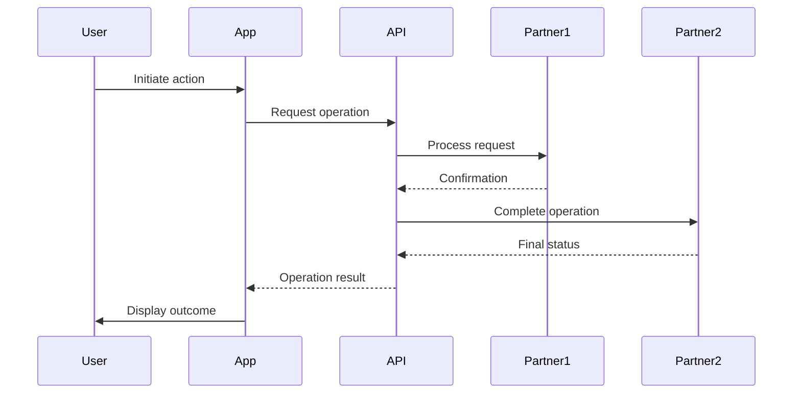
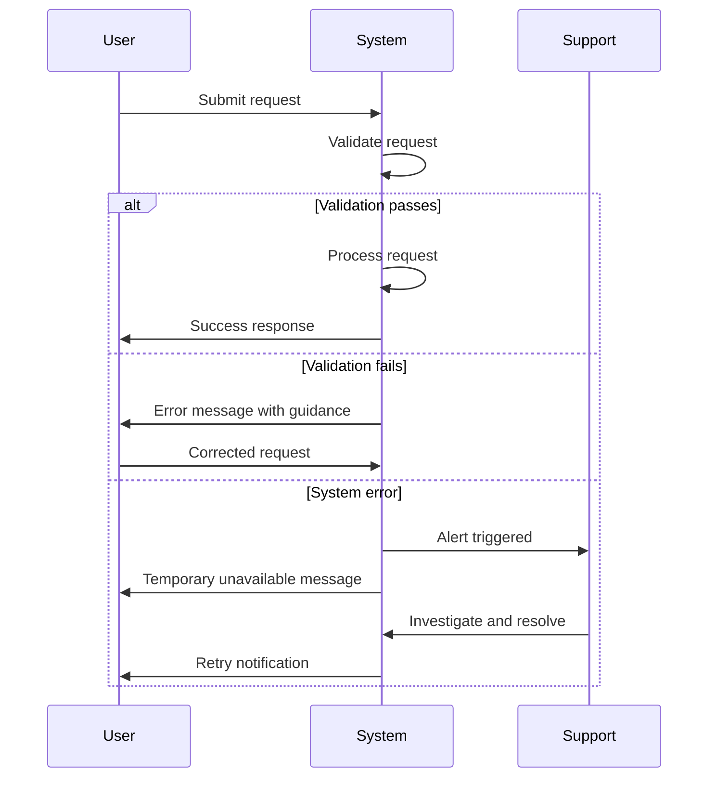

# =============================================================================
# 📋 Document Authority: This is the PRIMARY STANDARD for BRD structure.
# All other documents (Schema, Creation Rules, Validation Rules) DERIVE from this template.
# - In case of conflict, this template is the single source of truth
# - Schema: None (Layer 1 entry point, human-authored)
# - Creation Rules: BRD_CREATION_RULES.md - AI guidance for document creation (derivative)
# - Validation Rules: BRD_VALIDATION_RULES.md - AI checklist after document creation (derivative)
#   NOTE: VALIDATION_RULES includes all CREATION_RULES and may be extended for validation
# =============================================================================
---
title: "BRD-TEMPLATE: Business Requirements Document"
tags:
  - brd-template
  - layer-1-artifact
  - shared-architecture
  - document-template
custom_fields:
  document_type: template
  artifact_type: BRD
  layer: 1
  architecture_approaches: [ai-agent-based, traditional-8layer]
  priority: shared
  development_status: active
  template_for: business-requirements-document
  schema_reference: "none"
  schema_version: "n/a"
---

> **📋 Document Authority**: This is the **PRIMARY STANDARD** for BRD structure.
> - **Schema**: None (Layer 1 entry point, human-authored)
> - **Creation Rules**: `BRD_CREATION_RULES.md` - Usage guidance
> - **Validation Rules**: `BRD_VALIDATION_RULES.md` - Post-creation checks

# Business Requirements Document (BRD)

## Document Control

| Item | Details |
|------|---------|
| **Project Name** | [Enter project name] |
| **Document Version** | [e.g., 1.0] |
| **Date** | [Current date] |
| **Document Owner** | [Name and title] |
| **Prepared By** | [Business Analyst name] |
| **Status** | [Draft / In Review / Approved] |
| **PRD-Ready Score** | [Score]/100 (Target: ≥90/100) |

### Document Revision History

| Version | Date | Author | Changes Made | Approver |
|---------|------|--------|--------------|----------|
| 1.0 | [Date] | [Name] | Initial draft | |
| | | | | |

---

> **⚠️ UPSTREAM ARTIFACT REQUIREMENT**: Before completing traceability tags:
> 1. **Check existing artifacts**: List what upstream documents actually exist in `docs/`
> 2. **Reference only existing documents**: Use actual document IDs, not placeholders
> 3. **Use `null` appropriately**: Only when upstream artifact type genuinely doesn't exist for this feature
> 4. **Do NOT create phantom references**: Never reference documents that don't exist
> 5. **Do NOT create missing upstream artifacts**: If upstream artifacts are missing, skip that functionality. Only create functionality for existing upstream artifacts.


## 1. Introduction

### 1.1 Purpose
This Business Requirements Document (BRD) defines the business requirements for [Project Name]. The document serves as the foundation for project planning, design, development, and validation activities. It provides a clear understanding of business needs, objectives, scope, and success criteria for all stakeholders.

### 1.2 Document Scope
This document covers the business perspective of the project requirements. It includes business objectives, functional and non-functional requirements, stakeholder information, constraints, assumptions, dependencies, acceptance criteria, and Architecture Decision Requirements (section 6.2). Technical specifications and detailed design documents are maintained separately and referenced where applicable. Architecture Decision Records (ADRs) are created AFTER this BRD based on the Architecture Decision Requirements section.

### 1.3 Intended Audience
This document is intended for the following stakeholders:
- Executive sponsors and business leaders
- Project managers and business analysts
- Technical teams (development, testing, operations)
- End users and process owners
- Vendors and third-party partners (if applicable)

### 1.4 Document Conventions
- **Must/Shall:** Indicates mandatory requirements (Priority 1)
- **Should:** Indicates important but not critical requirements (Priority 2)
- **May/Could:** Indicates desirable requirements (Priority 3)
- **[Bracketed text]:** Indicates placeholder content to be completed

### 1.5 References
[List any reference documents, standards, policies, or related documentation]

**Note**: Do NOT list ADRs here. Architecture decisions will be documented in separate ADRs created AFTER this BRD is approved. See section 6.2 for Architecture Decision Requirements.

| Document Name | Version | Location/URL |
|---------------|---------|--------------|
| [Document] | [Version] | [Location] |

---

## 2. Business Objectives

### 2.1 Background and Context
[Provide comprehensive background information explaining the business context, market conditions, organizational drivers, and events that led to this initiative. Describe the current business environment and why action is needed at this time.]

### 2.2 Business Problem Statement
[Clearly articulate the specific business problem this project will address. Define the root cause of the problem, its impact on the organization, and the consequences of inaction. Use concrete examples and quantifiable data where possible.]

**Problem Summary:**
- **Issue:** [Description of the business problem]
- **Impact:** [Quantifiable impact on business - revenue loss, cost increase, time waste, quality issues]
- **Affected Stakeholders:** [Who is impacted by this problem]
- **Current Workarounds:** [Temporary solutions currently in place and their limitations]

### 2.3 Business Goals
[Define the high-level business goals that this project aims to achieve. These should be strategic, outcome-focused statements that align with organizational objectives.]

1. [Business Goal 1]
2. [Business Goal 2]
3. [Business Goal 3]

### 2.4 Business Objectives
[List specific, measurable business objectives using SMART criteria: Specific, Measurable, Achievable, Relevant, Time-bound]

| Objective ID | Objective Statement | Success Metric | Target Value | Target Date |
|--------------|---------------------|----------------|--------------|-------------|
| BO-001 | [Specific objective] | [How measured] | [Quantifiable target] | [Completion date] |
| BO-002 | [Specific objective] | [How measured] | [Quantifiable target] | [Completion date] |
| BO-003 | [Specific objective] | [How measured] | [Quantifiable target] | [Completion date] |

### 2.5 Strategic Alignment
[Explain how this project aligns with the organization's mission, vision, strategic plan, and long-term objectives.]

- **Organizational Strategy:** [How project supports corporate strategy]
- **Department Goals:** [How project supports department objectives]
- **Industry Positioning:** [How project affects competitive resource]

### 2.6 Expected Business Benefits
[Describe the anticipated business value and benefits]

**Quantifiable Benefits:**
- Cost reduction: [Specific amount or percentage]
- Revenue increase: [Specific amount or percentage]
- Productivity improvement: [Specific metrics]
- Time savings: [Hours/days saved per month]
- Error reduction: [Percentage improvement]

**Qualitative Benefits:**
- [Improved customer satisfaction]
- [Enhanced employee experience]
- [Better regulatory compliance]
- [Improved decision-making capabilities]
- [Increased operational agility]

---

## 3. Project Scope

### 3.1 Scope Statement
[Provide a clear, concise statement defining the boundaries of the project. Describe what the project will deliver at a high level.]

### 3.2 In-Scope Items
[Explicitly list all features, functions, processes, systems, departments, and deliverables that are included within the project boundaries]

1. [In-scope item 1 with brief description]
2. [In-scope item 2 with brief description]
3. [In-scope item 3 with brief description]
4. [In-scope item 4 with brief description]
5. [In-scope item 5 with brief description]

### 3.3 Out-of-Scope Items
[Explicitly list items that are NOT included to prevent scope creep and manage stakeholder expectations]

1. [Out-of-scope item 1 with rationale]
2. [Out-of-scope item 2 with rationale]
3. [Out-of-scope item 3 with rationale]
4. [Out-of-scope item 4 with rationale]

### 3.4 Future Considerations
[Items that are out of scope for the current phase but may be considered in future phases]

- [Future consideration 1]
- [Future consideration 2]

### 3.5 Business Process Scope

#### 3.5.1 Current State Process
[Describe the current business process, workflow, or system that will be impacted. Include process flow diagrams in Appendix B if applicable.]

#### 3.5.2 Future State Process
[Describe the desired future state business process after project implementation. Highlight key changes and improvements.]

#### 3.5.3 Impacted Business Areas
[List all business units, departments, or functional areas affected by this project]

| Business Area | Type of Impact | Change Magnitude |
|---------------|----------------|------------------|
| [Department/Area] | [Process/System/Organizational] | [High/Medium/Low] |

#### 3.5.4 End-to-End Workflow Diagram

[Include a high-level workflow diagram showing the end-to-end business process. Use Mermaid sequence diagrams for complex multi-participant flows.]

**Diagram Guidelines:**
- Show all key participants (users, systems, partners)
- Focus on business-level interactions, not technical implementation
- Highlight decision points and branching paths
- Include happy path and key exception paths

**Example Mermaid Sequence Diagram:**



**Workflow Summary Table:**

| Step | Actor | Action | System | Business Rule | Success Criteria |
|------|-------|--------|--------|---------------|------------------|
| 1 | [Actor] | [Action description] | [System] | [Business rule applied] | [Success criteria] |
| 2 | [Actor] | [Action description] | [System] | [Business rule applied] | [Success criteria] |
| 3 | [Actor] | [Action description] | [System] | [Business rule applied] | [Success criteria] |

#### 3.5.5 Error and Exception Handling Workflows

[Document how business processes handle errors, failures, and exception scenarios.]

**Exception Categories:**

| Category | Trigger Condition | Business Response | Customer Impact | Recovery Path |
|----------|-------------------|-------------------|-----------------|---------------|
| Validation Failure | [When this occurs] | [How business responds] | [Impact to customer] | [How to recover] |
| Partner Error | [When this occurs] | [How business responds] | [Impact to customer] | [How to recover] |
| Timeout/Unavailable | [When this occurs] | [How business responds] | [Impact to customer] | [How to recover] |
| Business Rule Violation | [When this occurs] | [How business responds] | [Impact to customer] | [How to recover] |

**Refund/Reversal Workflow** (if applicable):

[For financial processes, document the refund or reversal workflow]

| Trigger | Refund Policy | Processing Time | Customer Notification | Ledger Impact |
|---------|---------------|-----------------|----------------------|---------------|
| [Trigger scenario] | [What is refunded] | [SLA for completion] | [How customer notified] | [Accounting treatment] |

**Example Exception Handling Diagram:**



### 3.6 Technology Stack Prerequisites

**MANDATORY for ALL Feature BRDs (006+); Platform BRDs (001-005) define foundational prerequisites**

**For Platform BRDs (001-005)**:

List technology choices, infrastructure components, or platform capabilities that must exist before this platform can be implemented. These prerequisites establish the foundational technology stack upon which all platform features depend.

**Structure**: Organize prerequisites into logical categories (Core Platform Technologies, Partner Integrations, Infrastructure, etc.)

**Format for Each Prerequisite**:
- **Requirement**: Specific technology/component with version requirements
- **Rationale**: Why this prerequisite is needed (link to ADR if decision documented)
- **Business Impact**: Consequence if prerequisite not available

<!-- WARNING: Do NOT reference specific ADR numbers (e.g., ADR-002, ADR-033) in BRD content.
     Per traceability rules: BRDs identify architecture decision TOPICS in section 9, not specific ADR IDs.
     Use: "architecture decision required" or "see section 9 Architecture Decision Requirements" -->

**Example Entry** (Platform BRD):
```markdown
1. **PostgreSQL 14+ Database**
   - **Requirement**: PostgreSQL 14 or later with ACID compliance, replication configured
   - **Rationale**: Required for transactional consistency in user profiles, transaction state, audit logs (architecture decision required)
   - **Business Impact**: Without PostgreSQL, data integrity guarantees for financial transactions not possible
```

**For Feature BRDs (006+)**:

Document which Platform BRDs provide required infrastructure for this Feature BRD. This section MUST reference Platform BRDs and explain relevance.

**Structure**: List Platform BRD dependencies (which BRDs 001-005 are required) with relevance explanation

**Format Options**:
- **Full sections** (Use for first 3 BRDs in category or critical workflows): Complete list with detailed relevance explanations
- **Abbreviated sections** (Use for token efficiency): Concise bullet list referencing Platform BRDs

**Example Entry** (Feature BRD - Full):
```markdown
### 3.6 Technology Stack Prerequisites

This Feature BRD depends on the following Platform BRDs:

1. **Platform BRD (e.g., BRD-001): Platform Architecture & Technology Stack**
   - **Required Foundation**: Node.js 18+, PostgreSQL 14+, Redis 7+, Python 3.11+
   - **Relevance to BRD-XXX**: [Explain why these technologies are needed for this feature]
   - **Specific Prerequisites**: See BRD-NNN section 3.6 items 1-10

2. **Platform BRD (e.g., BRD-001): Multi-Agent AI System Architecture**
   - **Required AI Infrastructure**: Google ADK, A2A Protocol, shared context store
   - **Relevance to BRD-XXX**: [Explain why AI infrastructure is needed]
   - **Specific Prerequisites**: See BRD-NNN section 3.6 items 1-8
```

**Example Entry** (Feature BRD - Abbreviated):
```markdown
### 3.6 Technology Stack Prerequisites

**Feature BRDs** - *This section references Platform BRDs for infrastructure dependencies*

This Feature BRD depends on the following Platform BRDs:

1. **Platform BRD (e.g., BRD-001)**: Node.js 18+, PostgreSQL 14+, Redis 7+, Python 3.11+, n8n (See BRD-NNN section 3.6)
2. **Platform BRD (e.g., BRD-001)**: Partner integrations (See BRD-NNN section 3.6, 3.7)
3. **Platform BRD (e.g., BRD-001)**: security, compliance, audit retention (See BRD-NNN section 3.6, 3.7)
4. **Platform BRD (e.g., BRD-001)**: PostgreSQL schema, data model (See BRD-NNN section 3.6)
5. **Platform BRD (e.g., BRD-001)**: Google ADK, A2A Protocol, shared context store (See BRD-NNN section 3.6)
```

**Guidelines**:
- Platform BRDs: Only include true prerequisites (not nice-to-haves)
- Feature BRDs: MUST reference at least BRD-NNN; typically BRD-NNN through BRD-NNN
- Specify version requirements and configuration needs
- Link to relevant ADRs using format (ADR-NNN)
- Document business impact of missing prerequisite
- Feature BRDs may also reference other Feature BRDs for workflow dependencies

### 3.7 Mandatory Technology Conditions

**MANDATORY for ALL Feature BRDs (006+); Platform BRDs (001-005) define foundational constraints**

**For Platform BRDs (001-005)**:

Document non-negotiable technical constraints that cannot be changed without fundamentally altering the platform architecture. These conditions are driven by regulatory requirements, business model economics, or partner dependencies.

**Structure**: Organize conditions into logical categories (Regulatory & Compliance Constraints, Business Model Constraints, Partner Dependencies, Performance & Scalability Constraints, etc.)

**Format for Each Condition**:
- **Condition**: The mandatory requirement stated as MUST/SHALL constraint
- **Rationale**: Why this condition is non-negotiable (regulatory, business, technical reason)
- **Business Impact**: Consequence of violating this condition
- **Exception Path**: Conditions under which exception allowed (or "None" if truly non-negotiable)

**Example Entry** (Platform BRD):
```markdown
1. **Double-Entry Accounting Ledger**
   - **Condition**: All financial transactions MUST use double-entry accounting with immutable journal entries
   - **Rationale**: Required for SOC 2 Type II compliance, regulatory audit trails, proof-of-reserves validation
   - **Business Impact**: Without double-entry accounting, platform fails financial audits; regulatory penalties apply
   - **Exception Path**: Alternative ledger system allowed if meets same compliance requirements (requires ADR)
```

**For Feature BRDs (006+)**:

Document both platform-inherited mandatory conditions and feature-specific technical requirements. All Feature BRDs MUST include 4 platform-inherited conditions plus 6-12 feature-specific conditions.

**Structure**:
- **Platform-Inherited Mandatory Conditions** (4 core conditions from Platform BRDs)
- **Feature-Specific Mandatory Conditions** (6-12 conditions unique to this workflow)

**Format Options**:
- **Full sections** (Use for first 3 BRDs in category or critical workflows): Complete list with detailed impact analysis
- **Abbreviated sections** (Use for token efficiency): 4 platform conditions + pointer to functional requirements

**Example Entry** (Feature BRD - Full):
```markdown
### 3.7 Mandatory Technology Conditions

**Platform-Inherited Mandatory Conditions**:

1. **PostgreSQL High Availability** (from BRD-NNN)
   - **Condition**: Multi-AZ deployment with ≤60s failover
   - **Relevance**: [Explain why this platform condition applies to this feature]
   - **Business Impact**: DB outage → feature blocked → business losses

2. **Audit Trail Retention** (from BRD-NNN)
   - **Condition**: All actions logged with 7-year retention
   - **Relevance**: [Explain compliance requirements for this feature]
   - **Business Impact**: Missing audit trails → compliance violations

3. **Google ADK Agent Framework OR n8n Workflow Engine** (from BRD-NNN or BRD-NNN)
   - **Condition**: Workflow implemented using Platform-approved orchestration
   - **Relevance**: [Explain which orchestration approach applies]
   - **Business Impact**: Custom orchestration → platform inconsistency

4. **Field-Level PII Encryption** (from BRD-NNN)
   - **Condition**: All PII encrypted at field level using Platform encryption service
   - **Relevance**: [Explain PII handling in this feature]
   - **Business Impact**: Unencrypted PII → data breach risk

**Feature-Specific Mandatory Conditions for BRD-XXX**:

5. **[Feature-Specific Condition 1]**
   - **Condition**: [Precise technical requirement]
   - **Rationale**: [Why this condition is mandatory]
   - **Business Impact**: [What happens if condition not met]
   - **Exception Path**: [Fallback or "None"]

6. **[Feature-Specific Condition 2]**
   - **Condition**: [Precise technical requirement]
   - **Rationale**: [Why this condition is mandatory]
   - **Business Impact**: [What happens if condition not met]
   - **Exception Path**: [Fallback or "None"]
```

**Example Entry** (Feature BRD - Abbreviated):
```markdown
### 3.7 Mandatory Technology Conditions

**Platform-Inherited Mandatory Conditions**:

1. **PostgreSQL High Availability** (from BRD-NNN): Multi-AZ deployment with ≤60s failover
2. **Audit Trail Retention** (from BRD-NNN): All actions logged with 7-year retention
3. **Google ADK Agent Framework OR n8n Workflow Engine** (from BRD-NNN or BRD-NNN)
4. **Field-Level PII Encryption** (from BRD-NNN): Platform encryption service required

**Feature-Specific Mandatory Conditions**: See section 5 (Functional Requirements) for workflow-specific SLAs, performance targets, and technical constraints.
```

**Guidelines**:
- Platform BRDs: Only include truly mandatory conditions (test: "Can platform function without this?")
- Feature BRDs: MUST include 4 platform-inherited conditions
- Feature BRDs: Add 6-12 feature-specific conditions (performance SLAs, ML thresholds, workflow requirements)
- Use MUST/SHALL language for regulatory/compliance constraints
- Explain business or regulatory rationale clearly
- Document exception paths or state "None" if no exceptions permitted

---

## 4. Stakeholders (High-Level)

**📚 Complete Stakeholder Details**: For detailed stakeholder analysis, communication plans, and team structure, see:
- **[PRD Template - Stakeholders & Communication section](../PRD/PRD-TEMPLATE.md#stakeholders--communication)** - Full stakeholder matrix and engagement strategy

**Purpose**: Identify key business stakeholders who approve/sponsor this initiative. Detailed communication plans belong in PRD (Layer 2).

### Primary Stakeholders

[List 3-5 key decision-makers and approvers]

- **Executive Sponsor**: [Name/Title] - Final approval authority, business case owner
- **Business Owner**: [Name/Department] - Subject matter expert, requirements validation
- **Compliance/Legal**: [Department] - Regulatory approval authority (if applicable)
- **[Additional Key Stakeholder]**: [Role] - [Responsibility]

---

## 5. User Stories (High-Level Summary)

**📚 Complete User Stories**: For detailed user stories with acceptance criteria, permissions, and user roles, see:
- **[PRD Template - User Stories & User Roles section](../PRD/PRD-TEMPLATE.md#user-stories--user-roles)** - Full user story tables and role definitions

**Purpose**: This section provides a high-level summary of key user stories to demonstrate business value and user needs. Detailed user stories belong in the PRD (Layer 2).

### Key User Story Categories

[Summarize the main categories of users and their primary needs - 3-5 bullet points per category]

#### Primary Users (End Customers)
- As a **[primary user role]**, I want to **[key capability 1]**, so that **[business value]**
- As a **[primary user role]**, I want to **[key capability 2]**, so that **[business value]**
- As a **[primary user role]**, I want to **[key capability 3]**, so that **[business value]**

#### Internal Operations Users
- As a **[operations role]**, I want to **[key capability]**, so that **[operational efficiency]**
- As a **[compliance role]**, I want to **[key capability]**, so that **[regulatory compliance]**
- As a **[support role]**, I want to **[key capability]**, so that **[customer service]**

### User Story Summary Statistics

[Provide aggregate counts only - no detailed tables]

- **Primary User Stories**: [XX] total ([YY] P1, [ZZ] P2, [AA] P3)
- **Operational User Stories**: [XX] total ([YY] P1, [ZZ] P2, [AA] P3)
- **Total User Stories**: [XXX] (See PRD for complete breakdown)

### Business Objective Alignment

[High-level mapping only - detailed mapping in PRD]

- **Business Objective 1**: Supported by [XX] user stories (See PRD section: User Story to Business Objective Mapping)
- **Business Objective 2**: Supported by [YY] user stories (See PRD section: User Story to Business Objective Mapping)
- **Business Objective 3**: Supported by [ZZ] user stories (See PRD section: User Story to Business Objective Mapping)

---

## 6. Functional Requirements

### 6.1 Requirements Overview
[Provide an introduction to the functional requirements section, explaining how requirements are organized and prioritized. For complex projects, detailed requirements may be documented in appendices rather than inline tables.]

**Priority Definitions:**
- **P1 (Critical/Must Have):** Essential for project success; project cannot proceed without these
- **P2 (High/Should Have):** Important requirements that significantly enhance value but workarounds exist
- **P3 (Medium/Nice to Have):** Desirable features that improve user experience but are not essential

### 6.2 Functional Requirements by Category

**NOTE**: Functional requirements must be written at business level, NOT technical/implementation level. See Appendix B for PRD-level content exclusions and Appendix C for reference examples.

#### FR-XXX: [Requirement Title - Business Capability Name]

**Business Capability**: [One-sentence high-level description of what business capability this requirement enables]

**Business Requirements**:
- [Business need 1 - what must be accomplished from business perspective]
- [Business need 2 - include partner dependencies at business level]
- [Business need 3 - regulatory or compliance requirements]
- [Business need 4 - business constraints or policies]
- [Business need 5 - integration with platform BRDs if applicable]

**Business Rules**:
- [Policy constraint 1 - business rules that govern behavior]
- [Policy constraint 2 - regulatory limits or thresholds]
- [Policy constraint 3 - business logic that must be enforced]
- [Policy constraint 4 - partner SLA requirements at business level]

**Business Acceptance Criteria**:
- [Measurable success criterion 1 with target: e.g., "Process completion time <X seconds for Y% of transactions"]
- [Measurable success criterion 2 with business impact: e.g., "Fee transparency displayed before authorization (100% of transactions)"]
- [Measurable success criterion 3 with quantifiable target: e.g., "Regulatory compliance rate ≥99.9%"]
- [Measurable success criterion 4 with business outcome: e.g., "Customer satisfaction score ≥4.5/5"]

**Related Requirements**:
- Platform BRDs: [e.g., BRD-NNN (Platform Architecture), BRD-NNN (Partner Ecosystem)]
- Partner Integration BRDs: [e.g., BRD-XXX (Partner Name)]
- Related Feature BRDs: [e.g., BRD-YYY (Related Feature)]
- Compliance BRDs: [e.g., BRD-NNN (security & Compliance)]

**Complexity**: X/5 ([Business-level rationale: number of partners involved, regulatory scope, business constraints, cross-BRD dependencies])

---

#### FR-YYY: [Next Requirement Title]

**Business Capability**: [One-sentence description]

**Business Requirements**:
- [Requirement 1]
- [Requirement 2]

**Business Rules**:
- [Rule 1]
- [Rule 2]

**Business Acceptance Criteria**:
- [Criterion 1]
- [Criterion 2]

**Related Requirements**:
- [Cross-references to related BRDs]

**Complexity**: X/5 ([Rationale])

---

**Additional FR Template Guidance**:

1. **REMOVE from FRs** (PRD-level content - see Appendix B):
   - UI interaction flows, screen layouts, button placements
   - API endpoint specifications, request/response formats
   - Technical implementation details, algorithms, code logic
   - State machine transitions, workflow sequences
   - Database schemas, table structures
   - Specific timeout values, retry logic, error codes
   - Technology stack prescriptions

2. **KEEP in FRs** (Business-level content):
   - Business capabilities and outcomes
   - Regulatory and compliance requirements
   - Fee structures and pricing models
   - Business rules and policies
   - Partner dependencies (business-level SLAs)
   - Measurable business acceptance criteria
   - Business process states (names only, not transitions)

3. **Complexity Rating Scale**:
   - 1/5: Single partner, no regulatory constraints, straightforward business logic
   - 2/5: 2-3 partners, standard compliance requirements, moderate business complexity
   - 3/5: 3-4 partners, regulatorytor-specific regulations, complex fee structures or multi-tier logic
   - 4/5: 4+ partners, multi-jurisdiction compliance, cross-border requirements, high integration complexity
   - 5/5: Extensive partner ecosystem, complex regulatory framework, multi-currency/multi-corridor, AI/ML business outcomes

4. **Cross-References**: Always reference related Platform BRDs (BRD-NNN through BRD-NNN), Partner Integration BRDs, and Feature BRDs for traceability

### 6.3 Business Rules

[Document business rules that govern how the system must behave under specific conditions]

| Rule ID | Business Rule Description | Conditions | Actions | Exception Handling |
|---------|--------------------------|------------|---------|-------------------|
| BR-001 | [Rule statement] | [When this condition exists] | [System must do this] | [What happens if rule cannot be applied] |
| BR-002 | [Rule statement] | [When this condition exists] | [System must do this] | [What happens if rule cannot be applied] |

### 6.4 User Roles and Permissions (High-Level)

**📚 Complete User Roles**: For detailed user roles with permissions and responsibilities, see:
- **[PRD Template - User Roles and Permissions section](../PRD/PRD-TEMPLATE.md#user-roles-and-permissions)** - Full role definitions with permissions matrix

**Purpose**: Provide high-level identification of user roles. Detailed permissions belong in PRD (Layer 2).

[List primary user role categories - 3-5 roles maximum]

- **[Primary User Role]**: [1-sentence description of who they are and primary responsibility]
- **[Operations Role]**: [1-sentence description]
- **[Admin/Support Role]**: [1-sentence description]

---

## 7. Non-Functional Requirements

### 7.1 Non-Functional Requirements Overview
[Explain that non-functional requirements define system qualities and characteristics rather than specific behaviors. These quality attributes are critical success factors for the system.]

### 7.2 Architecture Decision Requirements

The following architectural topics require formal Architecture Decision Records (ADRs) to be created in the ADR phase of the SDD workflow:

| Topic Area | Decision Needed | Business Driver (BRD Reference) | Key Considerations |
|------------|-----------------|--------------------------------|-------------------|
| [Topic 1] | [What architectural decision is needed] | [Which business objectives/requirements drive this] | [Technologies, patterns, or approaches to evaluate] |
| [Topic 2] | [What architectural decision is needed] | [Which business objectives/requirements drive this] | [Technologies, patterns, or approaches to evaluate] |

**Example Topics**:
- **Authentication/Authorization**: Select authentication mechanism (driven by BRD.XXX.961: security requirements)
- **Data Storage**: Choose database technology for operational data (driven by BRD.XXX.NNN: Data persistence requirements)
- **Integration Architecture**: Define API integration pattern (driven by BRD.XXX.NNN: System integration)
- **Caching Strategy**: Choose caching approach (driven by BRD.XXX.901: Performance requirements)
- **Deployment Model**: Select deployment architecture (driven by BRD.XXX.941: Scalability requirements)
- **Messaging/Communication**: Choose inter-system communication pattern (driven by FR-XXX: Integration requirements)

**Purpose**: This section identifies architectural topics requiring decisions. Specific ADRs will be created AFTER this BRD during the ADR phase of the SDD workflow.

**ADR Creation Timing**: ADRs are created after BRD → PRD → SYS → EARS → REQ in the SDD workflow. Do NOT reference specific ADR numbers in this document.

---

### 7.3 Performance Requirements (901-920)

| Req ID | Requirement Description | Metric | Target | Priority | Rationale |
|--------|------------------------|--------|--------|----------|-----------|
| BRD.XXX.901 | System response time for [action] | Response time | [X] seconds | P1 | [Business reason] |
| BRD.XXX.902 | System throughput capacity | Transactions/second | [X] TPS | P1 | [Business reason] |
| BRD.XXX.903 | Concurrent user support | Number of users | [X] users | P1 | [Business reason] |
| BRD.XXX.904 | Page load time | Load time | [X] seconds | P2 | [Business reason] |
| BRD.XXX.905 | Report generation time | Processing time | [X] minutes | P2 | [Business reason] |

### 7.4 Security Requirements (961-980)

| Req ID | Requirement Description | Standard/Framework | Priority | Validation Method |
|--------|------------------------|-------------------|----------|-------------------|
| BRD.XXX.961 | Authentication mechanism | [e.g., Multi-factor authentication] | P1 | [How to verify] |
| BRD.XXX.962 | Data encryption at rest | [e.g., AES-256] | P1 | [How to verify] |
| BRD.XXX.963 | Data encryption in transit | [e.g., TLS 1.3] | P1 | [How to verify] |
| BRD.XXX.964 | Access control | [e.g., Role-based access control] | P1 | [How to verify] |
| BRD.XXX.965 | Audit logging | [Requirements for audit trails] | P1 | [How to verify] |
| BRD.XXX.966 | Password complexity | [Password policy requirements] | P2 | [How to verify] |
| BRD.XXX.967 | Session timeout | [e.g., 15 minutes of inactivity] | P2 | [How to verify] |
| BRD.XXX.968 | Compliance: GDPR | [Specific compliance requirement] | P1 | [Audit method] |
| BRD.XXX.969 | Compliance: HIPAA | [Specific compliance requirement] | P1 | [Audit method] |
| BRD.XXX.970 | Compliance: PCI-DSS | [Specific compliance requirement] | P1 | [Audit method] |

### 7.5 Reliability Requirements (921-940)

| Req ID | Requirement Description | Target | Priority | Measurement Period |
|--------|------------------------|--------|----------|-------------------|
| BRD.XXX.921 | System uptime | [e.g., 99.9%] | P1 | [Monthly/Annually] |
| BRD.XXX.922 | Planned maintenance window | [e.g., 4 hours/month] | P1 | [Monthly] |
| BRD.XXX.923 | Mean Time Between Failures (MTBF) | [X hours/days] | P2 | [Annually] |
| BRD.XXX.924 | Mean Time To Repair (MTTR) | [X hours] | P1 | [Per incident] |
| BRD.XXX.925 | Backup frequency | [Daily/Weekly] | P1 | [Per policy] |
| BRD.XXX.926 | Recovery Time Objective (RTO) | [X hours] | P1 | [Per incident] |
| BRD.XXX.927 | Recovery Point Objective (RPO) | [X hours] | P1 | [Per incident] |
| BRD.XXX.928 | Disaster recovery plan | [Plan requirements] | P1 | [Annual/Biannual] |
| BRD.XXX.929 | Backup and restore procedures | [Specific procedures] | P1 | [Quarterly] |
| BRD.XXX.930 | Failover capability | [Automatic/Manual, timeframe] | P1 | [Biannual] |
| BRD.XXX.931 | Geographic redundancy | [Requirements] | P2 | [Annual] |

### 7.6 Scalability Requirements (941-960)

| Req ID | Requirement Description | Current | Year 1 | Year 3 | Priority |
|--------|------------------------|---------|--------|--------|----------|
| BRD.XXX.941 | User growth capacity | [X users] | [X users] | [X users] | P1 |
| BRD.XXX.942 | Data volume growth | [X GB/TB] | [X GB/TB] | [X GB/TB] | P1 |
| BRD.XXX.943 | Transaction volume growth | [X per day] | [X per day] | [X per day] | P2 |
| BRD.XXX.944 | Storage expansion capability | [Description] | [Target] | [Target] | P2 |

### 7.7 Observability Requirements (981-990)

| Req ID | Requirement Description | Target | Priority | Measurement |
|--------|------------------------|--------|----------|-------------|
| BRD.XXX.981 | System monitoring capabilities | [Required monitoring] | P1 | [Monitoring dashboard] |
| BRD.XXX.982 | Error logging and reporting | [Logging requirements] | P1 | [Log analysis] |
| BRD.XXX.983 | Alerting thresholds | [Alert conditions] | P1 | [Alert review] |
| BRD.XXX.984 | Distributed tracing | [Tracing requirements] | P2 | [Trace analysis] |

### 7.8 Maintainability Requirements (991-999)

| Req ID | Requirement Description | Target | Priority | Measurement |
|--------|------------------------|--------|----------|-------------|
| BRD.XXX.991 | Code documentation standards | [Standard to follow] | P2 | [Review process] |
| BRD.XXX.992 | Version control | [Version control system] | P1 | [Repository review] |
| BRD.XXX.993 | User interface design standards | [e.g., WCAG 2.1 AA] | P1 | [Usability testing] |
| BRD.XXX.994 | Accessibility compliance | [e.g., section 508, ADA] | P1 | [Accessibility audit] |
| BRD.XXX.995 | Browser compatibility | [List supported browsers/versions] | P1 | [Cross-browser testing] |
| BRD.XXX.996 | Mobile device support | [iOS/Android versions] | P2 | [Device testing] |
| BRD.XXX.997 | User training requirements | [Maximum training time: X hours] | P2 | [User feedback] |
| BRD.XXX.998 | Online help availability | [Context-sensitive help] | P2 | [Documentation review] |
| BRD.XXX.999 | Multilingual support | [Languages required] | P3 | [Translation verification] |

---

## 8. Business Constraints and Assumptions

This section documents business-level constraints that limit solution design and assumptions that underpin business requirements. Each constraint and assumption uses standardized ID format for traceability.

### 8.1 Business Constraints

Business constraints are external limitations that restrict how business requirements can be fulfilled. These are non-negotiable factors that the solution must accommodate.

**ID Format**: `BC-XXX` (Business Constraint)

#### 7.1.1 Regulatory Constraints

Constraints imposed by laws, regulations, and compliance requirements.

| ID | Constraint | Impact on Requirements | Source |
|----|-----------|----------------------|--------|
| BC-001 | [Regulatory constraint statement] | [How this affects business requirements] | [Regulation/Law reference] |
| BC-002 | [Regulatory constraint statement] | [How this affects business requirements] | [Regulation/Law reference] |

**Examples**:
- BC-001: FinCEN recordkeeping requires 5-year transaction audit trail retention
- BC-002: OFAC compliance requires real-time sanctions screening for all transactions
- BC-003: State MTL licensing restricts operations to approved jurisdictions

#### 7.1.2 Partner SLA Constraints

Constraints imposed by partner agreements and service level commitments.

| ID | Constraint | Partner | Impact on Requirements |
|----|-----------|---------|----------------------|
| BC-0XX | [Partner SLA constraint] | [Partner name] | [How this affects business requirements] |

**Examples**:
- BC-010: Bridge custody settlement requires T+1 for ACH deposits
- BC-011: Paynet delivery confirmation SLA is 24-48 hours for bank transfers
- BC-012: Partner API rate limits cap at 1,000 requests per minute

#### 7.1.3 Technical Platform Constraints

Constraints from existing technical infrastructure and platform capabilities.

| ID | Constraint | Platform Component | Impact on Requirements |
|----|-----------|-------------------|----------------------|
| BC-0XX | [Technical constraint] | [Component] | [How this affects business requirements] |

**Examples**:
- BC-020: Platform wallet architecture requires single-currency (USD) balance
- BC-021: Mobile app deployment requires App Store/Play Store approval cycles
- BC-022: API gateway timeout limits maximum transaction processing to 30 seconds

#### 7.1.4 Operational Constraints

Constraints from business operations, support capacity, and organizational policies.

| ID | Constraint | Operational Area | Impact on Requirements |
|----|-----------|-----------------|----------------------|
| BC-0XX | [Operational constraint] | [Area] | [How this affects business requirements] |

**Examples**:
- BC-030: Compliance team capacity limits manual review queue to 500 cases/day
- BC-031: Customer support hours (9 AM - 9 PM EST) limit real-time escalation availability
- BC-032: Quarterly compliance audits require feature freeze periods

#### 7.1.5 Budget Constraints

Constraints from approved budget allocations and cost limitations.

| ID | Constraint | Budget Category | Impact on Requirements |
|----|-----------|----------------|----------------------|
| BC-0XX | [Budget constraint] | [Category] | [How this affects business requirements] |

**Examples**:
- BC-040: Partner integration budget limits initial corridors to 3 countries
- BC-041: Marketing budget caps launch promotions at 90-day fee waiver period
- BC-042: Infrastructure budget requires shared hosting for non-production environments

#### 7.1.6 Timeline Constraints

Constraints from business deadlines, market windows, and regulatory dates.

| ID | Constraint | Timeline Driver | Impact on Requirements |
|----|-----------|----------------|----------------------|
| BC-0XX | [Timeline constraint] | [Driver] | [How this affects business requirements] |

**Examples**:
- BC-050: Ramadan corridor launch requires completion before religious calendar dates
- BC-051: Regulatory filing deadline requires compliance features by Q4
- BC-052: Partner contract renewal requires integration completion within 6 months

---

### 8.2 Business Assumptions

Business assumptions are conditions believed to be true for planning purposes. Each assumption must be validated and has defined impact if proven false.

**ID Format**: `BA-XXX` (Business Assumption)

#### 8.2.1 Market Assumptions

Assumptions about market conditions, customer demand, and competitive landscape.

| ID | Assumption | Validation Method | Impact if Invalid |
|----|-----------|------------------|-------------------|
| BA-001 | [Market assumption] | [How to validate] | [Business impact] |

**Examples**:
- BA-001: US-Uzbekistan remittance corridor has sufficient demand (>10,000 monthly transactions)
- BA-002: Target customers prefer mobile-first remittance experience
- BA-003: Competitive pricing at 3% all-in cost will drive customer acquisition

#### 8.2.2 Partner Assumptions

Assumptions about partner capabilities, availability, and performance.

| ID | Assumption | Partner | Validation Method | Impact if Invalid |
|----|-----------|---------|------------------|-------------------|
| BA-0XX | [Partner assumption] | [Partner] | [How to validate] | [Business impact] |

**Examples**:
- BA-010: Bridge custody provider will maintain 99.9% API availability
- BA-011: Paynet delivery network covers 95% of Uzbekistan banking infrastructure
- BA-012: Partner onboarding will complete within 30 days of contract signing

#### 8.2.3 User Behavior Assumptions

Assumptions about how customers will interact with the solution.

| ID | Assumption | User Segment | Validation Method | Impact if Invalid |
|----|-----------|-------------|------------------|-------------------|
| BA-0XX | [User behavior assumption] | [Segment] | [How to validate] | [Business impact] |

**Examples**:
- BA-020: Users will complete KYC within single session (no drop-off mid-process)
- BA-021: Repeat senders will use saved recipient feature (80% reuse rate)
- BA-022: Users accept mobile-only experience (no desktop requirement)

#### 8.2.4 Technical Assumptions

Assumptions about technical capabilities, integrations, and system behavior.

| ID | Assumption | Technical Area | Validation Method | Impact if Invalid |
|----|-----------|---------------|------------------|-------------------|
| BA-0XX | [Technical assumption] | [Area] | [How to validate] | [Business impact] |

**Examples**:
- BA-030: Partner APIs will support required transaction volumes (10,000 TPS peak)
- BA-031: Existing fraud detection model will achieve ≤3% false positive rate
- BA-032: Mobile app can achieve <3 second transaction initiation time

#### 8.2.5 Financial Assumptions

Assumptions about pricing, costs, and financial viability.

| ID | Assumption | Financial Area | Validation Method | Impact if Invalid |
|----|-----------|---------------|------------------|-------------------|
| BA-0XX | [Financial assumption] | [Area] | [How to validate] | [Business impact] |

**Examples**:
- BA-040: FX spread of 1.5-2% will be competitive in target market
- BA-041: Customer acquisition cost will be <$50 per active customer
- BA-042: Break-even achievable at 5,000 monthly active users

#### 8.2.6 Regulatory Assumptions

Assumptions about regulatory environment, licensing, and compliance requirements.

| ID | Assumption | Regulatory Area | Validation Method | Impact if Invalid |
|----|-----------|----------------|------------------|-------------------|
| BA-0XX | [Regulatory assumption] | [Area] | [How to validate] | [Business impact] |

**Examples**:
- BA-050: MTL licensing will be maintained in all operating states
- BA-051: Uzbekistan regulatory environment will remain stable for remittance services
- BA-052: KYC requirements will not significantly change during development period

---

### 8.3 Dependency Clarifications

This section clarifies dependency types and their impact on requirement prioritization.

| Dependency ID | Description | Dependency Type | Upstream BRD | Impact if Delayed | Mitigation |
|---------------|-------------|-----------------|--------------|-------------------|------------|
| DEP-001 | [Dependency description] | Hard/Medium/Soft | BRD-XXX | [Business impact] | [Alternative approach] |
| DEP-002 | [Dependency description] | Hard/Medium/Soft | BRD-XXX | [Business impact] | [Alternative approach] |

**Dependency Type Definitions**:
| Type | Definition | Example |
|------|-----------|---------|
| **Hard** | Blocker - requirement cannot be implemented without this | KYC system required before transaction processing |
| **Medium** | Degrades functionality - can proceed with reduced capability | ML fraud detection; can use rule-based fallback |
| **Soft** | Nice-to-have - affects user experience but not core functionality | Push notifications; email fallback acceptable |

**Example Dependency Clarifications**:
| Dependency ID | Description | Dependency Type | Upstream BRD | Impact if Delayed | Mitigation |
|---------------|-------------|-----------------|--------------|-------------------|------------|
| DEP-001 | Wallet funding via custody provider | Hard | BRD-NNN | Cannot process transactions | No alternative - hard blocker |
| DEP-002 | ML-based fraud detection scoring | Medium | BRD-022 | Higher false positive rate | Rule-based screening as fallback |
| DEP-003 | Push notification delivery | Soft | BRD-015 | Reduced user engagement | Email/SMS notification fallback |
| DEP-004 | Real-time FX rate display | Medium | BRD-010 | Slightly stale rates (1-min cache) | Cached rates with staleness indicator |

---

## 9. Acceptance Criteria

### 9.1 Acceptance Criteria Overview

[Explain the purpose of acceptance criteria and how they will be used to validate project success]

Acceptance criteria define the conditions that must be satisfied for the project deliverables to be accepted by stakeholders. These criteria provide objective measures to determine when requirements have been successfully met.

### 9.2 Business Acceptance Criteria

[Define high-level business criteria that must be met for business stakeholders to accept the solution]

| Criteria ID | Acceptance Criterion | Measurement Method | Target | Verification Approach | Responsible Party |
|-------------|---------------------|-------------------|--------|----------------------|------------------|
| AC-001 | [Specific measurable criterion] | [How it will be measured] | [Target value] | [How verified] | [Name/Role] |
| AC-002 | [Specific measurable criterion] | [How it will be measured] | [Target value] | [How verified] | [Name/Role] |
| AC-003 | [Specific measurable criterion] | [How it will be measured] | [Target value] | [How verified] | [Name/Role] |

**Examples:**
- System processes X transactions per minute without errors
- 95% of users can complete core tasks without assistance
- System achieves 99.9% uptime over 30-day period
- Data migration completes with 100% accuracy
- All P1 requirements are implemented and tested

### 9.3 Functional Acceptance Criteria

[Map acceptance criteria to specific functional requirements]

| Requirement ID | Acceptance Criterion | Test Scenario | Expected Result | Pass/Fail Criteria |
|----------------|---------------------|---------------|-----------------|-------------------|
| FR-XXX | [Criterion for this requirement] | [How to test] | [What should happen] | [How to determine pass/fail] |
| FR-YYY | [Criterion for this requirement] | [How to test] | [What should happen] | [How to determine pass/fail] |
| FR-ZZZ | [Criterion for this requirement] | [How to test] | [What should happen] | [How to determine pass/fail] |

### 9.4 Non-Functional Acceptance Criteria

[Define acceptance criteria for non-functional requirements]

| Requirement ID | Acceptance Criterion | Measurement Method | Target | Test Approach | Pass Threshold |
|----------------|---------------------|-------------------|--------|---------------|----------------|
| BRD.XXX.901 | [Performance criterion] | [Load testing] | [X seconds] | [Test scenario] | [95% within target] |
| BRD.XXX.961 | [Security criterion] | [Security audit] | [Standard compliance] | [Audit process] | [100% compliance] |
| BRD.XXX.921 | [Availability criterion] | [Monitoring logs] | [99.9% uptime] | [30-day monitoring] | [Meets or exceeds target] |

### 9.5 User Acceptance Testing (UAT) Criteria

[Define the UAT approach and success criteria]

#### 9.5.1 UAT Scope
[Describe what will be tested during UAT]

- [Scope item 1]
- [Scope item 2]
- [Scope item 3]

#### 9.5.2 UAT Participants

| Role | Department | Number of Users | Responsibilities |
|------|------------|-----------------|------------------|
| [Role] | [Department] | [#] | [What they will do] |

#### 9.5.3 UAT Test Scenarios

[List key business scenarios that will be tested]

| Scenario ID | Scenario Description | Prerequisites | Expected Outcome | Success Criteria |
|-------------|---------------------|---------------|------------------|------------------|
| UAT-001 | [End-to-end business scenario] | [Setup required] | [What should happen] | [How to measure success] |
| UAT-002 | [End-to-end business scenario] | [Setup required] | [What should happen] | [How to measure success] |

#### 9.5.4 UAT Schedule

- **UAT Start Date:** [Date]
- **UAT Duration:** [Number of days/weeks]
- **UAT End Date:** [Date]
- **Sign-off Date:** [Date]

#### 9.5.5 UAT Success Criteria

[Define what constitutes successful UAT completion]

- [Criterion 1: e.g., 100% of critical test scenarios pass]
- [Criterion 2: e.g., No Severity 1 or 2 defects remain open]
- [Criterion 3: e.g., 95% user satisfaction rating]
- [Criterion 4: e.g., All required documentation delivered]

### 9.6 Go-Live Readiness Criteria

[Define criteria that must be met before production deployment]

| Criteria Category | Specific Criteria | Status Required | Verification Method | Responsible Party |
|-------------------|-------------------|-----------------|---------------------|-------------------|
| Testing | All UAT test scenarios completed | 100% pass rate | UAT report | [QA Manager] |
| Testing | All critical defects resolved | Zero open | Defect tracking system | [QA Manager] |
| Training | User training completed | 100% of users | Training attendance records | [Training Manager] |
| Documentation | User documentation delivered | Complete and approved | Documentation review | [Business Analyst] |
| Documentation | Technical documentation delivered | Complete and approved | Documentation review | [Technical Lead] |
| Infrastructure | Production environment ready | Fully configured | Environment checklist | [IT Operations] |
| security | security assessment completed | Approved | security report | [security Team] |
| Data | Data migration validated | 100% accuracy | Data validation report | [Data Team] |
| Support | Support team trained | 100% of team | Training records | [Support Manager] |
| Approvals | Business sponsor sign-off | Approved | Sign-off document | [Project Sponsor] |

### 9.7 Success Metrics and KPIs

[Define how project success will be measured post-implementation]

| KPI | Baseline | Target | Measurement Frequency | Measurement Method | Owner |
|-----|----------|--------|----------------------|-------------------|-------|
| [Key performance indicator] | [Current value] | [Goal] | [Daily/Weekly/Monthly] | [How measured] | [Name] |
| [Key performance indicator] | [Current value] | [Goal] | [Daily/Weekly/Monthly] | [How measured] | [Name] |
| [Key performance indicator] | [Current value] | [Goal] | [Daily/Weekly/Monthly] | [How measured] | [Name] |

### 9.8 Acceptance Sign-Off Process

#### 9.8.1 Sign-Off Requirements

[Define who must sign off and what they are approving]

| Sign-Off Level | Approver Role | Scope of Approval | Prerequisites | Target Date |
|----------------|---------------|-------------------|---------------|-------------|
| Business Acceptance | [Business Sponsor] | Business requirements met | UAT completed successfully | [Date] |
| Technical Acceptance | [Technical Lead] | Technical requirements met | System testing completed | [Date] |
| User Acceptance | [User Representative] | Solution meets user needs | UAT completed | [Date] |
| security Acceptance | [security Officer] | security requirements met | security assessment passed | [Date] |
| Final Acceptance | [Project Director] | All criteria met | All other sign-offs completed | [Date] |

#### 9.8.2 Acceptance Criteria Not Met

[Define the process if acceptance criteria are not met]

If acceptance criteria are not met:
1. Document specific criteria that were not satisfied
2. Conduct root cause analysis
3. Develop remediation plan with timeline
4. Implement corrective actions
5. Re-test and re-submit for acceptance
6. Obtain formal sign-off on remediation

---

## 10. Business Risk Management

This section documents business-level risks that could impact requirement delivery or business outcomes. Each risk uses standardized scoring methodology for prioritization.

### 10.1 Risk Scoring Methodology

**Risk Score Formula**: Likelihood (1-3) × Impact (3-15) = Risk Score (maximum 15)

**Likelihood Scale**:
| Level | Score | Definition | Probability |
|-------|-------|-----------|-------------|
| Low | 1 | Unlikely to occur based on current conditions | <20% |
| Medium | 2 | Possible given known factors | 20-60% |
| High | 3 | Likely based on current trajectory | >60% |

**Impact Scale** (Business-Focused):
| Level | Score | Definition | Business Examples |
|-------|-------|-----------|-------------------|
| Minor | 3 | Limited business impact | Delayed feature, minor UX degradation |
| Moderate | 5 | Noticeable business impact | Reduced functionality, increased costs |
| Significant | 8 | Substantial business impact | Competitive disadvantage, customer churn |
| Major | 10 | Severe business impact | Regulatory action, significant revenue loss |
| Critical | 15 | Existential business impact | License revocation, market exit |

**Risk Priority Matrix**:
| Risk Score | Priority | Action Required |
|------------|----------|-----------------|
| 1-5 | Low | Monitor quarterly |
| 6-15 | Medium | Monthly review, mitigation plan required |
| 16-30 | High | Weekly review, active mitigation |
| 31-45 | Critical | Immediate escalation, executive attention |

---

### 10.2 Risk Register by Category

**ID Format**: `RISK-XXX` (Business Risk)

#### 10.2.1 Market & Competitive Risks

Risks from market conditions, competitive pressure, and demand uncertainty.

| ID | Risk | Likelihood | Impact | Score | Mitigation | Contingency | Owner |
|----|------|-----------|--------|-------|------------|-------------|-------|
| RISK-001 | [Market/competitive risk] | [1-3] | [3-15] | [Score] | [Preventive action] | [If occurs] | [Role] |

**Examples**:
- RISK-001: Competitor launches similar corridor with lower fees (L:2 × I:8 = 16)
- RISK-002: Target market demand lower than projected (L:2 × I:10 = 20)
- RISK-003: Exchange rate volatility reduces margin competitiveness (L:3 × I:5 = 15)

#### 10.2.2 Regulatory & Compliance Risks

Risks from regulatory changes, licensing requirements, and compliance obligations.

| ID | Risk | Likelihood | Impact | Score | Mitigation | Contingency | Owner |
|----|------|-----------|--------|-------|------------|-------------|-------|
| RISK-0XX | [Regulatory risk] | [1-3] | [3-15] | [Score] | [Preventive action] | [If occurs] | [Role] |

**Examples**:
- RISK-010: MTL license renewal delayed or denied (L:1 × I:15 = 15)
- RISK-011: New AML regulations require system modifications (L:2 × I:8 = 16)
- RISK-012: Destination country restricts inbound remittances (L:1 × I:15 = 15)

#### 10.2.3 Partner & Operational Risks

Risks from partner dependencies, SLA failures, and operational disruptions.

| ID | Risk | Likelihood | Impact | Score | Mitigation | Contingency | Owner |
|----|------|-----------|--------|-------|------------|-------------|-------|
| RISK-0XX | [Partner/operational risk] | [1-3] | [3-15] | [Score] | [Preventive action] | [If occurs] | [Role] |

**Examples**:
- RISK-020: Custody provider experiences extended outage (L:1 × I:10 = 10)
- RISK-021: Delivery partner fails to meet SLA commitments (L:2 × I:8 = 16)
- RISK-022: Partner API changes require emergency integration updates (L:2 × I:5 = 10)

#### 10.2.4 Financial & Economic Risks

Risks from pricing, costs, profitability, and economic conditions.

| ID | Risk | Likelihood | Impact | Score | Mitigation | Contingency | Owner |
|----|------|-----------|--------|-------|------------|-------------|-------|
| RISK-0XX | [Financial risk] | [1-3] | [3-15] | [Score] | [Preventive action] | [If occurs] | [Role] |

**Examples**:
- RISK-030: Partner fee increases erode transaction margins (L:2 × I:8 = 16)
- RISK-031: Customer acquisition costs exceed projections (L:2 × I:5 = 10)
- RISK-032: Economic downturn reduces remittance volumes (L:2 × I:10 = 20)

#### 10.2.5 Customer Experience & Reputation Risks

Risks affecting customer satisfaction, brand perception, and trust.

| ID | Risk | Likelihood | Impact | Score | Mitigation | Contingency | Owner |
|----|------|-----------|--------|-------|------------|-------------|-------|
| RISK-0XX | [CX/reputation risk] | [1-3] | [3-15] | [Score] | [Preventive action] | [If occurs] | [Role] |

**Examples**:
- RISK-040: High false positive rate blocks legitimate customers (L:2 × I:8 = 16)
- RISK-041: Transaction delivery delays exceed customer expectations (L:2 × I:8 = 16)
- RISK-042: Negative reviews impact App Store rating below 4.0 (L:2 × I:5 = 10)

#### 10.2.6 Technology & Platform Risks

Risks from technical failures, scalability, and system dependencies.

| ID | Risk | Likelihood | Impact | Score | Mitigation | Contingency | Owner |
|----|------|-----------|--------|-------|------------|-------------|-------|
| RISK-0XX | [Technology risk] | [1-3] | [3-15] | [Score] | [Preventive action] | [If occurs] | [Role] |

**Examples**:
- RISK-050: Platform cannot scale to handle transaction volume (L:1 × I:10 = 10)
- RISK-051: security breach compromises customer data (L:1 × I:15 = 15)
- RISK-052: Third-party dependency vulnerability requires emergency patching (L:2 × I:5 = 10)

#### 10.2.7 Strategic & Business Model Risks

Risks to business strategy, market positioning, and long-term viability.

| ID | Risk | Likelihood | Impact | Score | Mitigation | Contingency | Owner |
|----|------|-----------|--------|-------|------------|-------------|-------|
| RISK-0XX | [Strategic risk] | [1-3] | [3-15] | [Score] | [Preventive action] | [If occurs] | [Role] |

**Examples**:
- RISK-060: Single-corridor dependency limits growth options (L:2 × I:8 = 16)
- RISK-061: Business model disrupted by new payment rail technology (L:1 × I:10 = 10)
- RISK-062: Key partnership exclusivity limits competitive positioning (L:2 × I:5 = 10)

---

### 10.3 Risk Summary Dashboard

| Category | High Risks (>15) | Medium Risks (6-15) | Low Risks (1-5) | Total |
|----------|-----------------|---------------------|-----------------|-------|
| Market & Competitive | [Count] | [Count] | [Count] | [Total] |
| Regulatory & Compliance | [Count] | [Count] | [Count] | [Total] |
| Partner & Operational | [Count] | [Count] | [Count] | [Total] |
| Financial & Economic | [Count] | [Count] | [Count] | [Total] |
| Customer Experience | [Count] | [Count] | [Count] | [Total] |
| Technology & Platform | [Count] | [Count] | [Count] | [Total] |
| Strategic & Business Model | [Count] | [Count] | [Count] | [Total] |
| **Total** | [Total High] | [Total Medium] | [Total Low] | [Grand Total] |

### 10.4 Risk Monitoring and Review

- **Risk Review Frequency**: [Weekly for High/Critical, Monthly for Medium, Quarterly for Low]
- **Risk Review Forum**: [Steering committee, Project team meeting]
- **Escalation Criteria**: Score increase >5 points, new High/Critical risks
- **Risk Register Owner**: [Name/Role]

---

## 11. Implementation Approach

### 11.1 Implementation Strategy

[Describe the high-level approach to implementing the solution]

**Implementation Method:** [e.g., Phased rollout, Big bang, Pilot program, Parallel run]

**Rationale:** [Why this approach was selected]

### 11.2 Implementation Phases

| Phase | Description | Key Activities | Duration | Start Date | End Date | Deliverables |
|-------|-------------|----------------|----------|------------|----------|--------------|
| Phase 1 | [Phase name] | [Key activities] | [Weeks] | [Date] | [Date] | [What's delivered] |
| Phase 2 | [Phase name] | [Key activities] | [Weeks] | [Date] | [Date] | [What's delivered] |
| Phase 3 | [Phase name] | [Key activities] | [Weeks] | [Date] | [Date] | [What's delivered] |

### 11.3 Rollout Plan

[Describe how the solution will be deployed to users]

| Rollout Stage | Target Users | Number of Users | Date | Success Criteria | Rollback Plan |
|---------------|-------------|-----------------|------|------------------|---------------|
| [Stage 1] | [User group] | [#] | [Date] | [Criteria] | [If problems occur] |
| [Stage 2] | [User group] | [#] | [Date] | [Criteria] | [If problems occur] |

### 11.4 Data Migration Plan

[If applicable, describe how existing data will be migrated]

**Migration Approach:** [Description]

| Migration Phase | Data Category | Volume | Source System | Target System | Migration Date | Validation Method |
|-----------------|---------------|--------|---------------|---------------|----------------|-------------------|
| [Phase] | [Type of data] | [Records/GB] | [System] | [System] | [Date] | [How validated] |

### 11.5 Integration Plan

[Describe how the solution will integrate with existing systems]

| Integration Point | Source System | Target System | Integration Method | Data Flow | Frequency | Responsible Team |
|-------------------|---------------|---------------|-------------------|-----------|-----------|------------------|
| [Integration] | [System] | [System] | [API/File/Real-time] | [Direction] | [When] | [Team] |

---

## 12. Training and Change Management

### 12.1 Training Strategy

[Describe the overall approach to training users]

**Training Objectives:**
- [Objective 1]
- [Objective 2]
- [Objective 3]

### 12.2 Training Plan

| User Group | Number of Users | Training Type | Duration | Delivery Method | Schedule | Materials Needed | Trainer |
|------------|-----------------|---------------|----------|-----------------|----------|------------------|---------|
| [Group] | [#] | [Type] | [Hours] | [In-person/Online/Hybrid] | [Dates] | [List] | [Name] |

### 12.3 Training Materials

[List all training materials that will be developed]

- User manuals
- Quick reference guides
- Video tutorials
- Hands-on exercises
- FAQs
- Job aids

### 12.4 Change Management Strategy

[Describe how organizational change will be managed]

#### 12.4.1 Change Impact Assessment

| Stakeholder Group | Current State | Future State | Impact Level | Change Type | Resistance Level |
|-------------------|---------------|--------------|--------------|-------------|------------------|
| [Group] | [How they work now] | [How they will work] | [High/Med/Low] | [Process/System/Role] | [High/Med/Low] |

#### 12.4.2 Communication Plan

| Audience | Message | Communication Method | Frequency | Sender | Timing |
|----------|---------|---------------------|-----------|--------|--------|
| [Group] | [Key messages] | [Email/Meeting/Newsletter] | [When] | [Who sends] | [When] |

#### 12.4.3 Change Readiness Activities

- [Activity 1: e.g., Town hall meetings]
- [Activity 2: e.g., Champions program]
- [Activity 3: e.g., Feedback sessions]
- [Activity 4: e.g., Early adopter program]

---

## 13. Support and Maintenance

### 13.1 Support Model

[Define how users will be supported after implementation]

**Support Structure:**
- **Tier 1 Support:** [Who provides, what they handle]
- **Tier 2 Support:** [Who provides, what they handle]
- **Tier 3 Support:** [Who provides, what they handle]

### 13.2 Support Services

| Support Element | Description | Availability | Contact Method | Response Time SLA |
|-----------------|-------------|--------------|----------------|-------------------|
| Help Desk | [Description] | [Hours] | [Phone/Email/Portal] | [Timeframe] |
| Self-Service | [Description] | [24/7] | [Knowledge base/Portal] | [Immediate] |
| On-Site Support | [Description] | [By appointment] | [Request process] | [Timeframe] |

### 13.3 Service Level Agreements (SLAs)

| Priority Level | Definition | Response Time | Resolution Time | Escalation |
|----------------|------------|---------------|-----------------|------------|
| Critical (P1) | [System down, major impact] | [X minutes] | [X hours] | [Immediate] |
| High (P2) | [Significant impact, workaround exists] | [X hours] | [X hours] | [After X hours] |
| Medium (P3) | [Moderate impact] | [X hours] | [X days] | [After X days] |
| Low (P4) | [Minor issue, cosmetic] | [X days] | [X days] | [As needed] |

### 13.4 Maintenance Plan

**Planned Maintenance:**
- **Frequency:** [Weekly/Monthly/Quarterly]
- **Maintenance Window:** [Day and time]
- **Duration:** [Expected hours]
- **Communication:** [How users are notified]

**Update Management:**
- **Patch Schedule:** [How often patches applied]
- **Version Upgrades:** [Approach to major upgrades]
- **Testing Process:** [How updates are tested]

---

## 14. Cost-Benefit Analysis

### 14.1 Cost Summary

#### 14.1.1 One-Time Costs

| Cost Category | Description | Estimated Cost | Actual Cost | Variance |
|---------------|-------------|----------------|-------------|----------|
| Software Licenses | [Details] | $[Amount] | $[Amount] | $[Amount] |
| Hardware/Infrastructure | [Details] | $[Amount] | $[Amount] | $[Amount] |
| Development/Implementation | [Details] | $[Amount] | $[Amount] | $[Amount] |
| Consulting Services | [Details] | $[Amount] | $[Amount] | $[Amount] |
| Training | [Details] | $[Amount] | $[Amount] | $[Amount] |
| Change Management | [Details] | $[Amount] | $[Amount] | $[Amount] |
| Data Migration | [Details] | $[Amount] | $[Amount] | $[Amount] |
| Testing | [Details] | $[Amount] | $[Amount] | $[Amount] |
| Project Management | [Details] | $[Amount] | $[Amount] | $[Amount] |
| Contingency (10-15%) | [Buffer for unknowns] | $[Amount] | $[Amount] | $[Amount] |
| **Total One-Time Costs** | | **$[Amount]** | **$[Amount]** | **$[Amount]** |

#### 14.1.2 Recurring Annual Costs

| Cost Category | Description | Year 1 | Year 2 | Year 3 |
|---------------|-------------|--------|--------|--------|
| Software Maintenance | [Annual fees] | $[Amount] | $[Amount] | $[Amount] |
| Support Services | [Ongoing support] | $[Amount] | $[Amount] | $[Amount] |
| Hosting/Infrastructure | [Cloud/hosting costs] | $[Amount] | $[Amount] | $[Amount] |
| Staff/Personnel | [FTEs required] | $[Amount] | $[Amount] | $[Amount] |
| Training (ongoing) | [Refresher training] | $[Amount] | $[Amount] | $[Amount] |
| Upgrades/Enhancements | [Planned improvements] | $[Amount] | $[Amount] | $[Amount] |
| **Total Annual Costs** | | **$[Amount]** | **$[Amount]** | **$[Amount]** |

#### 14.1.3 Total Cost of Ownership (3 Years)

| Cost Type | Amount |
|-----------|--------|
| One-Time Costs | $[Amount] |
| Year 1 Recurring | $[Amount] |
| Year 2 Recurring | $[Amount] |
| Year 3 Recurring | $[Amount] |
| **Total 3-Year TCO** | **$[Amount]** |

### 14.2 Benefit Summary

#### 14.2.1 Quantifiable Benefits

| Benefit Category | Description | Year 1 | Year 2 | Year 3 | 3-Year Total | Calculation Method |
|------------------|-------------|--------|--------|--------|--------------|-------------------|
| Cost Savings | [Reduced operational costs] | $[Amount] | $[Amount] | $[Amount] | $[Amount] | [How calculated] |
| Labor Savings | [Time saved × hourly rate] | $[Amount] | $[Amount] | $[Amount] | $[Amount] | [How calculated] |
| Revenue Increase | [New revenue opportunities] | $[Amount] | $[Amount] | $[Amount] | $[Amount] | [How calculated] |
| Error Reduction | [Cost of errors avoided] | $[Amount] | $[Amount] | $[Amount] | $[Amount] | [How calculated] |
| Efficiency Gains | [Productivity improvements] | $[Amount] | $[Amount] | $[Amount] | $[Amount] | [How calculated] |
| **Total Quantifiable Benefits** | | **$[Amount]** | **$[Amount]** | **$[Amount]** | **$[Amount]** | |

#### 14.2.2 Qualitative Benefits

[List benefits that cannot be easily quantified but provide significant value]

- **Customer Satisfaction:** [Description of improvement]
- **Employee Satisfaction:** [Description of improvement]
- **Competitive Advantage:** [Description of strategic value]
- **Risk Reduction:** [Description of risk mitigation]
- **Compliance:** [Description of compliance improvements]
- **Strategic Alignment:** [Description of strategic benefits]
- **Innovation:** [Description of innovation enablement]
- **Scalability:** [Description of growth support]

### 14.3 Financial Analysis

#### 14.3.1 Return on Investment (ROI)

| Metric | Formula | Year 1 | Year 2 | Year 3 | 3-Year |
|--------|---------|--------|--------|--------|--------|
| Net Benefit | Benefits - Costs | $[Amount] | $[Amount] | $[Amount] | $[Amount] |
| ROI % | (Net Benefit / Total Cost) × 100 | [%] | [%] | [%] | [%] |
| Cumulative ROI | | [%] | [%] | [%] | [%] |

#### 14.3.2 Payback Period

**Payback Period:** [Number of months/years until investment is recovered]

**Breakeven Point:** [Date when cumulative benefits equal cumulative costs]

#### 14.3.3 Net Present Value (NPV)

[If applicable, calculate NPV using appropriate discount rate]

- **Discount Rate:** [%]
- **NPV:** $[Amount]

### 14.4 Sensitivity Analysis

[Analyze how changes in key assumptions affect ROI]

| Scenario | Description | Impact on ROI | Probability |
|----------|-------------|---------------|-------------|
| Best Case | [Optimistic assumptions] | [ROI] | [%] |
| Expected Case | [Most likely scenario] | [ROI] | [%] |
| Worst Case | [Conservative assumptions] | [ROI] | [%] |

---

## 15. Project Governance

### 15.1 Governance Structure

[Define the decision-making and oversight structure]

#### 15.1.1 Steering Committee

**Purpose:** Provide strategic oversight and make major decisions

**Members:**
- [Name, Title] - Chair
- [Name, Title] - Member
- [Name, Title] - Member

**Meeting Frequency:** [Monthly/Quarterly]

**Responsibilities:**
- Approve scope changes
- Resolve escalated issues
- Review project status
- Approve phase gate transitions
- Ensure resource availability

#### 15.1.2 Project Team

**Core Team Members:**

| Name | Role | Department | Allocation | Responsibilities |
|------|------|------------|------------|------------------|
| [Name] | Project Manager | [Dept] | [%] | [Responsibilities] |
| [Name] | Business Analyst | [Dept] | [%] | [Responsibilities] |
| [Name] | Technical Lead | [Dept] | [%] | [Responsibilities] |
| [Name] | Subject Matter Expert | [Dept] | [%] | [Responsibilities] |

### 15.2 Decision-Making Authority

| Decision Type | Authority Level | Approver(s) | Delegation Allowed |
|---------------|----------------|-------------|-------------------|
| Budget changes < $[X] | Project Manager | [Name] | No |
| Budget changes > $[X] | Steering Committee | [Committee] | No |
| Scope changes (P1/P2) | Steering Committee | [Committee] | No |
| Scope changes (P3) | Project Manager | [Name] | Yes |
| Schedule changes < [X] days | Project Manager | [Name] | No |
| Schedule changes > [X] days | Steering Committee | [Committee] | No |
| Resource allocation | Functional Manager | [Name] | Yes |

### 15.3 Status Reporting

| Report Type | Audience | Frequency | Content | Owner |
|-------------|----------|-----------|---------|-------|
| Project Status Report | Steering Committee | [Weekly/Monthly] | [Status, risks, issues, budget] | Project Manager |
| Executive Dashboard | Executive Sponsors | [Monthly] | [High-level KPIs, milestones] | Project Director |
| Team Status | Project Team | [Weekly] | [Detailed progress, blockers] | Project Manager |
| Stakeholder Update | All Stakeholders | [Biweekly] | [Progress, upcoming activities] | Project Manager |

### 15.4 Change Control Process

[Define how changes to scope, schedule, or budget are managed]

**Change Request Process:**
1. Change request submitted using standard template
2. Business analyst assesses impact on requirements
3. Project manager assesses impact on schedule, cost, resources
4. Change advisory board reviews and makes recommendation
5. Appropriate authority approves or rejects
6. If approved, update project documents and communicate
7. Implement change

**Change Request Template Elements:**
- Change description
- Business justification
- Impact analysis (scope, schedule, cost, quality)
- Alternatives considered
- Recommendation
- Approval signatures

### 15.5 Approval and Sign-off

This section documents the formal approval process for the BRD and criteria for acceptance.

#### 15.5.1 Document Approval

| Role | Name | Title | Approval Date | Signature |
|------|------|-------|---------------|-----------|
| Executive Sponsor | [TBD] | [Title] | [Pending] | |
| Product Owner | [TBD] | [Title] | [Pending] | |
| Business Lead | [TBD] | [Title] | [Pending] | |
| Technology Lead | [TBD] | [Title] | [Pending] | |
| Compliance Lead | [TBD] | [Title] | [Pending] | |
| Finance Lead | [TBD] | [Title] | [Pending] | |

#### 15.5.2 Approval Criteria

This BRD is considered approved when:

1. All stakeholders listed in section 15.5.1 have provided written approval
2. All critical business risks (section 10) with risk score ≥12 have documented mitigation strategies
3. Regulatory compliance requirements have been validated by legal counsel (if applicable)
4. Required dependencies (section 17.2) are confirmed available or have mitigation plans
5. Budget allocation has been approved by appropriate financial authority

#### 15.5.3 Change Control Process for Approved BRD

Changes to this approved BRD must follow this process:

| Change Type | Approval Required | Process | Version Impact |
|-------------|------------------|---------|----------------|
| Minor (clarifications, typos) | Product Owner | Update document + review | Increment patch (e.g., 1.2.1) |
| Moderate (new requirements, scope changes) | Product Owner + Tech Lead | Impact assessment + stakeholder review | Increment minor (e.g., 1.3) |
| Major (business model changes, new partners) | All stakeholders | Full BRD review cycle | Increment major (e.g., 2.0) |

#### 15.5.4 Approval Status Tracking

| Approver | Review Status | Review Date | Comments | Approval Status |
|----------|--------------|-------------|----------|-----------------|
| [Executive Sponsor] | Not Started / In Review / Complete | [Date] | [Comments] | Pending / Approved / Rejected |
| [Product Owner] | Not Started / In Review / Complete | [Date] | [Comments] | Pending / Approved / Rejected |
| [Business Lead] | Not Started / In Review / Complete | [Date] | [Comments] | Pending / Approved / Rejected |
| [Technology Lead] | Not Started / In Review / Complete | [Date] | [Comments] | Pending / Approved / Rejected |

**Overall Approval Status:** [Not Started / In Progress / Approved / Conditional Approval]

**Conditional Approval Notes:** [If conditionally approved, list conditions that must be met]

---

## 16. Quality Assurance

### 16.1 Quality Standards

[Define quality standards and criteria for deliverables]

| Deliverable Type | Quality Standard | Review Process | Approval Required |
|------------------|------------------|----------------|-------------------|
| Requirements Document | [Standard] | [Review method] | [Who approves] |
| Design Documents | [Standard] | [Review method] | [Who approves] |
| Code | [Standard] | [Review method] | [Who approves] |
| Test Cases | [Standard] | [Review method] | [Who approves] |
| User Documentation | [Standard] | [Review method] | [Who approves] |

### 16.2 Testing Strategy

#### 16.2.1 Testing Types

| Test Type | Purpose | Responsibility | Schedule | Exit Criteria |
|-----------|---------|----------------|----------|---------------|
| Unit Testing | [Purpose] | [Developer] | [Phase] | [Criteria] |
| Integration Testing | [Purpose] | [QA Team] | [Phase] | [Criteria] |
| System Testing | [Purpose] | [QA Team] | [Phase] | [Criteria] |
| Performance Testing | [Purpose] | [QA Team] | [Phase] | [Criteria] |
| security Testing | [Purpose] | [security Team] | [Phase] | [Criteria] |
| User Acceptance Testing | [Purpose] | [Business Users] | [Phase] | [Criteria] |

#### 16.2.2 Defect Management

**Defect Severity Definitions:**
- **Critical:** System unavailable or data loss
- **High:** Major functionality broken, no workaround
- **Medium:** Functionality broken, workaround exists
- **Low:** Minor issue, cosmetic

**Defect Resolution Targets:**

| Severity | Response Time | Resolution Target | Escalation |
|----------|---------------|-------------------|------------|
| Critical | [X hours] | [X hours] | [Immediate] |
| High | [X hours] | [X days] | [After X hours] |
| Medium | [X days] | [X days] | [After X days] |
| Low | [X days] | [X weeks] | [As needed] |

---

## 17. Traceability

This section maps BRD requirements to upstream business objectives and downstream technical artifacts, ensuring complete requirements coverage and enabling impact analysis.

### 17.1 Requirements Traceability Matrix

[Map functional requirements to business objectives and downstream deliverables]

#### 17.1.1 Business Objectives → Functional Requirements

| Business Objective | Related Functional Requirements | Related User Stories | Coverage Status |
|--------------------|--------------------------------|----------------------|-----------------|
| [BO-N: Objective description] | FR-XXX, FR-YYY, FR-XXX | US-001, US-003, US-008 | Complete/Partial/Gap |
| [BO-N: Objective description] | FR-ZZZ, FR-XXX, FR-XXX | US-002, US-005, US-012 | Complete/Partial/Gap |
| [BO-N: Objective description] | FR-XXX, FR-XXX, FR-XXX | US-004, US-009, US-015 | Complete/Partial/Gap |

#### 17.1.2 Functional Requirements → Technical Specifications

[Map functional requirements to downstream technical artifacts (planned)]

| Functional Requirement | Downstream SPEC (Planned) | Downstream IMPL (Planned) | Status |
|------------------------|---------------------------|---------------------------|--------|
| FR-XXX: [Requirement title] | SPEC-XXX-001: [Specification name] | IMPL-XXX-001: [Implementation name] | Planned |
| FR-YYY: [Requirement title] | SPEC-XXX-002: [Specification name] | IMPL-XXX-002: [Implementation name] | Planned |
| FR-ZZZ: [Requirement title] | SPEC-XXX-003: [Specification name] | IMPL-XXX-003: [Implementation name] | Planned |

#### 17.1.3 Non-Functional Requirements → Technical Specifications

| NFR Category | ID Range | Downstream SPEC (Planned) | Validation Method |
|--------------|----------|---------------------------|-------------------|
| Performance | 901-920 | SPEC-XXX-NFR-P: Performance Testing | Load testing |
| Reliability | 921-940 | SPEC-XXX-NFR-A: Deployment Architecture | Uptime monitoring |
| Scalability | 941-960 | SPEC-XXX-NFR-SC: Scaling Infrastructure | Capacity testing |
| Security & Compliance | 961-980 | SPEC-XXX-NFR-S: Security Controls | Security audit |
| Observability | 981-990 | SPEC-XXX-NFR-O: Monitoring Stack | Dashboard review |
| Maintainability | 991-999 | SPEC-XXX-NFR-M: DevOps Pipeline | CI/CD metrics |

### 17.2 Same-Type References (Conditional)

**Include this section only if same-type relationships exist between BRDs.**

#### Cross-BRD Dependencies

[Document dependencies on other BRDs in the system]

| Relationship | Document ID | Document Title | Purpose |
|--------------|-------------|----------------|---------|
| Related | [BRD-NNN](./BRD-NNN_...md) | [Related BRD title] | Shared domain context |
| Depends | [BRD-NNN](./BRD-NNN_...md) | [Prerequisite BRD title] | Must complete before this |

**Detailed Dependency Table:**

| This BRD | Depends On | Dependency Type | Impact if Missing | Status |
|----------|------------|-----------------|-------------------|--------|
| BRD-XXX | BRD-NNN (Platform) | Hard | [Impact description] | Required |
| BRD-XXX | BRD-NNN (Partners) | Hard | [Impact description] | Required |
| BRD-XXX | BRD-YYY (Feature) | Medium | [Impact description] | Optional |

**Dependency Types:**
- **Hard**: Blocking dependency - this BRD cannot proceed without the dependency
- **Medium**: Important dependency - workarounds possible but not ideal
- **Soft**: Nice-to-have dependency - enhances functionality but not required

**Tags:**
```markdown
@related-brd: BRD-NNN
@depends-brd: BRD-NNN
```

### 17.3 Test Coverage Traceability

[Map requirements to test artifacts]

| Requirement Category | Test Type Required | Planned Test Specification | Coverage Target |
|----------------------|-------------------|---------------------------|-----------------|
| FR-XXX through FR-XXX | Unit Tests | TEST-XXX-UNIT: FR Unit Test Suite | 95% |
| FR-XXX through FR-XXX | Integration Tests | TEST-XXX-INT: Integration Test Suite | 85% |
| User Stories (US-001 through US-XXX) | Acceptance Tests | TEST-XXX-ACC: Acceptance Test Suite | 100% |
| NFR Performance | Load Tests | TEST-XXX-LOAD: Performance Tests | All SLAs |
| NFR security | security Tests | TEST-XXX-regulatory: security Audit | All controls |

### 17.4 Traceability Summary

| Category | Total Items | Traced Forward | Traced Backward | Coverage % |
|----------|-------------|----------------|-----------------|------------|
| Business Objectives | [Count] | [Count with FR links] | N/A | [%] |
| Functional Requirements | [Count] | [Count with SPEC links] | [Count with BO links] | [%] |
| Non-Functional Requirements | [Count] | [Count with SPEC links] | [Count with BO links] | [%] |
| User Stories | [Count] | [Count with FR links] | [Count with BO links] | [%] |

**Traceability Health Score:** [X]% (Target: ≥90%)

---

## 18. Glossary

📚 **Master Glossary Reference**: For common terminology used across all BRDs, see [BRD-000_GLOSSARY.md](BRD-000_GLOSSARY.md). This section defines **project-specific terms** not covered in the master glossary.

### Glossary Guidelines for BRD Authors

**Step 1: Check the Master Glossary First**
- Review [BRD-000_GLOSSARY.md](BRD-000_GLOSSARY.md) before defining any term
- Reference master glossary entries instead of duplicating definitions
- Use format: "See BRD-000_GLOSSARY.md section X for definition"

**Step 2: Define Project-Specific Terms Only**
- Add terms unique to THIS project that don't appear in master glossary
- Examples: Project-specific partner names, custom workflow terms, unique domain concepts
- Use same table format as master glossary for consistency

**Step 3: Validation Requirements**
- Ensure all 6 subsections present (18.1-18.6)
- Minimum 1 entry per subsection OR note "See BRD-000_GLOSSARY.md"
- All acronyms used in document must be defined (here or in master glossary)
- All cross-references must link to existing documents

**Step 4: Propose Master Glossary Additions**
- When term is used across 3+ BRDs, propose addition to master glossary
- Submit to Business Analyst Team per BRD-000_GLOSSARY.md contribution guidelines

---

### 18.1 Business Terms

[Define project-specific business terminology NOT in master glossary]

| Term | Definition | Context |
|------|------------|---------|
| [Project_Business_Term_1] | [Clear, concise definition accessible to all stakeholders] | [Where/how used in this BRD] |
| [Project_Business_Term_2] | [Clear, concise definition accessible to all stakeholders] | [Where/how used in this BRD] |

**Note**: For standard business terms (KPI, ROI, stakeholder, etc.), see [BRD-000_GLOSSARY.md section 1](BRD-000_GLOSSARY.md#1-business-terms)

---

### 18.2 Technical Terms

[Define project-specific technical terminology NOT in master glossary]

| Term | Definition | Context |
|------|------------|---------|
| [Project_Technical_Term_1] | [Business-accessible explanation of technical concept] | [Where/how used in this BRD] |
| [Project_Technical_Term_2] | [Business-accessible explanation of technical concept] | [Where/how used in this BRD] |

**Note**: For standard technical terms (API, webhook, SLA, etc.), see [BRD-000_GLOSSARY.md section 2](BRD-000_GLOSSARY.md#2-technical-terms)

---

### 18.3 Domain-Specific Terms

[Define industry/domain terminology unique to this project NOT in master glossary]

| Term | Definition | Domain | Context |
|------|------------|--------|---------|
| [Project_Domain_Term_1] | [Clear definition with domain context] | [Industry/Domain] | [Where/how used in this BRD] |
| [Project_Domain_Term_2] | [Clear definition with domain context] | [Industry/Domain] | [Where/how used in this BRD] |

**Note**: For standard regulatory/compliance terms (KYC, AML, etc.), see [BRD-000_GLOSSARY.md section 3](BRD-000_GLOSSARY.md#3-domain-specific-terms)

---

### 18.4 Acronyms

[Define project-specific acronyms NOT in master glossary]

| Acronym | Full Form | Category |
|---------|-----------|----------|
| [Project_Acronym_1] | [Full term] | [Business/Technical/Domain] |
| [Project_Acronym_2] | [Full term] | [Business/Technical/Domain] |

**Note**: For standard BRD framework acronyms (FR, NFR, BO, AC, etc.), see [BRD-000_GLOSSARY.md section 4](BRD-000_GLOSSARY.md#4-acronyms)

---

### 18.5 Cross-References

[Link to related BRDs, external documents, and dependencies for this project]

| Term/Concept | Referenced Document | section | Relationship |
|--------------|---------------------|---------|--------------|
| [Concept_1] | [Document ID or path] | [section #] | [Dependency/Related/Prerequisite] |
| [Concept_2] | [Document ID or path] | [section #] | [Dependency/Related/Prerequisite] |

**Example entries:**
- Platform Architecture | BRD-001_platform_architecture.md | N/A | Foundational dependency
- Partner Integration | BRD-002_partner_ecosystem.md | section 6 | Related requirements
- Authentication System | REQ-005_user_authentication.md | All | Upstream dependency

**Note**: For framework-level cross-references, see [BRD-000_GLOSSARY.md section 5](BRD-000_GLOSSARY.md#5-cross-references)

---

### 18.6 External Standards

[Define regulatory, industry, or technical standards specific to this project NOT in master glossary]

| Standard | Organization | Relevance | section |
|----------|--------------|-----------|---------|
| [Project_Standard_1] | [Standards body/org] | [Why relevant to this project] | [Where used in BRD] |
| [Project_Standard_2] | [Standards body/org] | [Why relevant to this project] | [Where used in BRD] |

**Note**: For common standards (PCI-DSS, GDPR, ISO 27001, etc.), see [BRD-000_GLOSSARY.md section 6](BRD-000_GLOSSARY.md#6-external-standards)

---

## 19. Appendices

### Appendix A: Supporting Documentation

[List or attach supporting documents]

| Document Name | Description | Version | Location | Date |
|---------------|-------------|---------|----------|------|
| [Document] | [Brief description] | [Version] | [URL/Path] | [Date] |

### Appendix B: PRD-Level Content Exclusions (Critical Reference)

**Purpose**: This appendix defines the boundary between Business Requirements (BRD-level) and Product/Technical Requirements (PRD-level). Use this guide to ensure Functional Requirements stay at business level and achieve PRD-Ready Score ≥90/100.

**📚 Complete Reference**: For detailed guidance with examples, edge cases, and self-check questions, see:
- **[EARS Template - section 5.6: Business vs Technical Requirements Boundary](../EARS/EARS-TEMPLATE.md#56-business-vs-technical-requirements-boundary)** - Full guidance for requirements writers
- **[BDD Template - Header: Quick Self-Check Questions](../BDD/BDD-TEMPLATE.feature)** - Fast validation checklist

**Quick Summary**:

#### ❌ REMOVE from Functional Requirements (PRD-Level Content)
1. UI interaction flows ("User clicks X button")
2. API endpoint specifications (POST /quotes, JSON payloads)
3. Technical implementation details (WebSocket, caching strategies)
4. State machine transitions (event handlers, technical coordination)
5. Specific timeout values (500ms debounce delay)
6. UI element specifications (countdown timers, progress bars)
7. Detailed workflow sequences (Step 1: Call API, Step 2: Update DB)
8. Code-level logic (idempotency key generation, retry algorithms)
9. Technical error handling (rollback logic, circuit breakers)
10. Code blocks (Python, JSON, SQL, algorithms)

#### ✅ KEEP in Functional Requirements (Business-Level Content)
1. Business capability required (WHAT the system must do)
2. Business rules and policies (transaction limits, KYC tiers)
3. Regulatory/compliance requirements (OFAC screening, SAR filing)
4. Business acceptance criteria with measurable targets (≤3 seconds for 95%)
5. Business outcomes and metrics (≥95% delivery success)
6. Partner dependencies (business-level SLAs, not API specs)
7. Business constraints (minimum transaction $10 for economic viability)
8. Fee structures and pricing models (as tables, competitive benchmarks)
9. Business process states (names only: INITIATED → FUNDED → COMPLETED)

**Self-Check Questions**:
1. Could this FR be implemented in multiple ways? (✅ Business-level)
2. Does this describe WHAT (capability) vs HOW (implementation)? (✅ Business-level)
3. Would a non-technical stakeholder understand this? (✅ Business-level)
4. Does this reference business rules vs APIs/databases? (✅ Business-level)
5. Are there code blocks? (❌ PRD-level - remove ALL)

---

### Appendix C: FR Reference Examples (Gold Standard)

**Purpose**: Concrete examples of properly structured business-level Functional Requirements, demonstrating what achieves PRD-Ready Score ≥90/100.

**📚 Complete Examples**: For detailed gold standard FR examples with patterns and anti-patterns, see:
- **[FR Examples Guide](FR_EXAMPLES_GUIDE.md)** - Comprehensive reference with 5 detailed examples covering Simple (2/5), Complex (4/5), AI/ML (3/5) FRs, Before/After refactoring, and 4-subsection detailed guidance

**Quick Overview**: The FR Examples Guide contains:
1. **Example 1**: Simple FR (Complexity 2/5) - Recipient Selection
2. **Example 2**: Complex FR (Complexity 4/5) - Multi-Region Wallet Funding with partner dependencies
3. **Example 3**: AI/ML FR (Complexity 3/5) - Risk and Compliance Screening
4. **Example 4**: Before/After Refactoring - Converting technical FRs to business-level
5. **Detailed 4-Subsection Guidance**: Pattern tables, anti-patterns, format rules for each subsection

**Reference: BRD-NNN Gold Standard (100/100 Score)**

See `/opt/data/blocal_n8n/docs/BRD/BRD-NNN_remittance_transaction_us_to_uzbekistan.md` for examples of business-level FRs that achieved perfect PRD-Ready Score.

**Key Success Factors from BRD-NNN**:
- Zero code blocks in entire document
- FRs structured with Business Capability → Business Requirements → Business Rules → Business Acceptance Criteria
- All technical implementation details deferred to PRD references
- Complexity ratings include business-level rationale (partner count, regulatory scope)
- Cross-references to Platform BRDs (BRD-NNN through BRD-NNN) for traceability

---

### Appendix D: Process Flow Diagrams

| Integration | Source | Target | Protocol | Data Format | Frequency | Error Handling |
|-------------|--------|--------|----------|-------------|-----------|----------------|
| [Name] | [System] | [System] | [API/File] | [Format] | [Timing] | [Approach] |

### Appendix H: Stakeholder Interview Notes

[Summary of key findings from stakeholder interviews]

| Date | Stakeholder | Key Points | Requirements Identified | Issues/Concerns |
|------|-------------|------------|------------------------|-----------------|
| [Date] | [Name] | [Summary] | [Requirements] | [Issues] |

### Appendix I: References

[List all reference materials, standards, regulations, and best practices cited in this document]

**Note**: Architecture Decision Records (ADRs) are created AFTER BRD approval. Do NOT list ADR numbers here. See section 6.2 Architecture Decision Requirements for topics requiring architectural decisions.

1. [Reference 1 - Full citation]
2. [Reference 2 - Full citation]
3. [Reference 3 - Full citation]

### Appendix J: Compliance Documentation

[Include relevant compliance certifications, audit reports, or regulatory documentation]

---

### Appendix K: Fee Schedule Template [Required for Financial BRDs]

**Purpose**: Document all customer-facing fees and internal cost structures for financial transactions.

#### K.1 Customer-Facing Fee Structure

| Fee Type | Amount | Trigger | Calculation Basis | Customer Communication |
|----------|--------|---------|-------------------|----------------------|
| Service Fee | [Amount or formula] | [When charged] | [How calculated] | [How displayed to customer] |
| FX Spread | [Percentage range] | [On FX conversion] | [Mid-market rate + spread] | [Disclosed as "Exchange rate includes..."] |
| Delivery Fee | [Amount or formula] | [On payout] | [Based on method] | [Shown in fee breakdown] |

**Example (Remittance):**
| Fee Type | Amount | Trigger | Calculation Basis | Customer Communication |
|----------|--------|---------|-------------------|----------------------|
| Service Fee | $3.00 flat | Per transaction | Fixed regardless of amount | "BeeLocal service fee: $3.00" |
| FX Spread | 1.5-2.0% | USD→UZS conversion | Mid-market rate + 1.5-2% | "Rate includes ~1.5% exchange margin" |
| Delivery Fee | $0.00 | Standard delivery | Absorbed in FX spread | "No additional delivery fee" |

#### K.2 Partner Cost Structure (Internal Reference)

| Partner | Cost Type | Rate | Settlement Terms | Volume Tiers |
|---------|-----------|------|------------------|--------------|
| [Partner] | [Fee type] | [Rate/amount] | [Payment terms] | [Volume discounts] |

#### K.3 Margin Analysis

| Transaction Size | Total Customer Cost | Partner Costs | Gross Margin | Target Margin |
|-----------------|--------------------| --------------|--------------|---------------|
| $100 | [Total] | [Costs] | [Margin %] | [Target %] |
| $500 | [Total] | [Costs] | [Margin %] | [Target %] |
| $1,000 | [Total] | [Costs] | [Margin %] | [Target %] |

---

### Appendix L: Partner SLA Summary [Required for Partner Integration BRDs]

**Purpose**: Consolidate partner service level agreements relevant to business requirements.

#### L.1 Partner SLA Matrix

| Partner | Service | Availability SLA | Response Time SLA | Error Rate SLA | Escalation Contact |
|---------|---------|-----------------|-------------------|----------------|-------------------|
| [Partner] | [Service] | [%] | [Time] | [%] | [Contact] |

**Example:**
| Partner | Service | Availability SLA | Response Time SLA | Error Rate SLA | Escalation Contact |
|---------|---------|-----------------|-------------------|----------------|-------------------|
| Bridge | Custody API | 99.9% | <2 seconds (95th) | <0.1% | bridge-support@example.com |
| Paynet | Delivery API | 99.5% | <5 seconds (95th) | <0.5% | paynet-ops@example.com |
| Sardine | Risk Screening | 99.9% | <3 seconds (95th) | <0.01% | sardine-sla@example.com |

#### L.2 SLA Impact on Business Requirements

| SLA Metric | Business Requirement Impact | Mitigation if SLA Missed |
|------------|----------------------------|-------------------------|
| [SLA] | [Impact on FR/NFR] | [Fallback/contingency] |

---

### Appendix M: Regulatory Reference Matrix [Required for Compliance BRDs]

**Purpose**: Map regulatory requirements to business requirements for compliance traceability.

#### M.1 Regulatory Requirements Mapping

| Regulation | section/Rule | Requirement Summary | BRD section | FR Reference | Compliance Approach |
|------------|--------------|---------------------|-------------|--------------|---------------------|
| [Regulation] | [section] | [Summary] | [section #] | [FR-XXX] | [How complied] |

**Example:**
| Regulation | section/Rule | Requirement Summary | BRD section | FR Reference | Compliance Approach |
|------------|--------------|---------------------|-------------|--------------|---------------------|
| FinCEN MSB | 31 CFR 1010.410 | Recordkeeping for 5 years | section 6 | FR-012 | Transaction audit trail with 5-year retention |
| OFAC SDN | 31 CFR 501.603 | Sanctions screening | section 5 | FR-XXX | Real-time OFAC screening before authorization |
| Travel Rule | 31 CFR 1010.410(f) | Identity for ≥$3,000 | section 5 | FR-XXX | Sender/recipient identity capture above threshold |

#### M.2 Regulatory Calendar

| Regulation | Reporting Requirement | Frequency | Due Date | Owner | Source System |
|------------|----------------------|-----------|----------|-------|---------------|
| [Regulation] | [Report name] | [Frequency] | [Date/deadline] | [Role] | [System] |

---

### Appendix N: Customer Communication Templates [Required for Customer-Facing BRDs]

**📚 Complete Customer-Facing Content Guidance**: For detailed messaging templates, error messages, promotional content, tooltips, and compliance disclosures, see:

- **[PRD Template - Customer-Facing Content & Messaging section](../PRD/PRD-TEMPLATE.md#customer-facing-content--messaging)** - Product-level messaging templates and examples

**Purpose**: At the BRD level, identify that customer-facing messaging is required and document high-level business approval requirements. Detailed message templates belong in the PRD (Layer 2).

**Business-Level Requirements for Customer Communications:**

- Business stakeholder approval authority for messaging (who approves what)
- Regulatory/compliance review requirements (which messages need legal review)
- Brand voice guidelines reference (link to brand standards document)
- Translation/localization requirements (which languages, regional variations)
- A/B testing approval process (if promotional messaging requires testing)

---

### Appendix O: Business Metrics Dashboard [Required for All BRDs]

**Purpose**: Define key business metrics for monitoring requirement success and ongoing performance.

#### O.1 Success Metrics

| Metric | Definition | Target | Baseline | Data Source | Review Frequency |
|--------|-----------|--------|----------|-------------|-----------------|
| [Metric name] | [How measured] | [Target value] | [Current/starting value] | [System/report] | [Daily/Weekly/Monthly] |

**Example:**

| Metric | Definition | Target | Baseline | Data Source | Review Frequency |
|--------|-----------|--------|----------|-------------|-----------------|
| Transaction Success Rate | Successful deliveries / Total transactions | ≥98% | N/A (new) | Transaction logs | Daily |
| Average Delivery Time | Time from initiation to delivery confirmation | <15 min (95th) | N/A (new) | Timestamp delta | Daily |
| Customer Satisfaction | Post-transaction NPS score | ≥50 | N/A (new) | Survey responses | Monthly |
| False Positive Rate | Legitimate transactions blocked / Total transactions | ≤3% | N/A (new) | Screening logs | Weekly |

#### O.2 Operational Metrics

| Metric | Definition | Alert Threshold | Escalation |
|--------|-----------|----------------|------------|
| [Metric] | [Definition] | [When to alert] | [Who to notify] |

#### O.3 Business Health Indicators

| Indicator | Formula | Green | Yellow | Red |
|-----------|---------|-------|--------|-----|
| [Indicator] | [Calculation] | [Good range] | [Warning range] | [Critical range] |

---

## Document Control Notes

**Version Management:**

- This document is maintained under version control
- All changes must be tracked in the revision history
- Only the latest approved version is valid for project execution

**Distribution:**

- This document should be distributed to all project stakeholders
- Access to this document may be restricted based on confidentiality requirements
- Recipients are responsible for ensuring they reference the latest version

**Review and Updates:**

- This BRD is a living document and should be reviewed at key project milestones
- Updates require change control process approval
- Major revisions require re-approval from all signatories

**Document Retention:**

- This document must be retained according to organizational document retention policies
- Typically retained for [X] years after project completion
- Archives should include all approved versions

**Confidentiality:**

- This document may contain proprietary or confidential information
- Distribution should be limited to authorized personnel
- Recipients must comply with organizational information security policies

---
