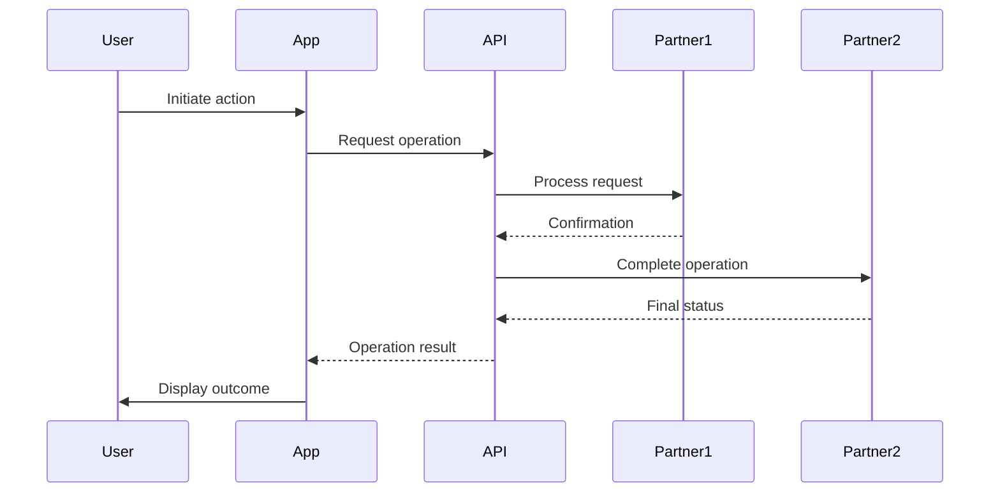
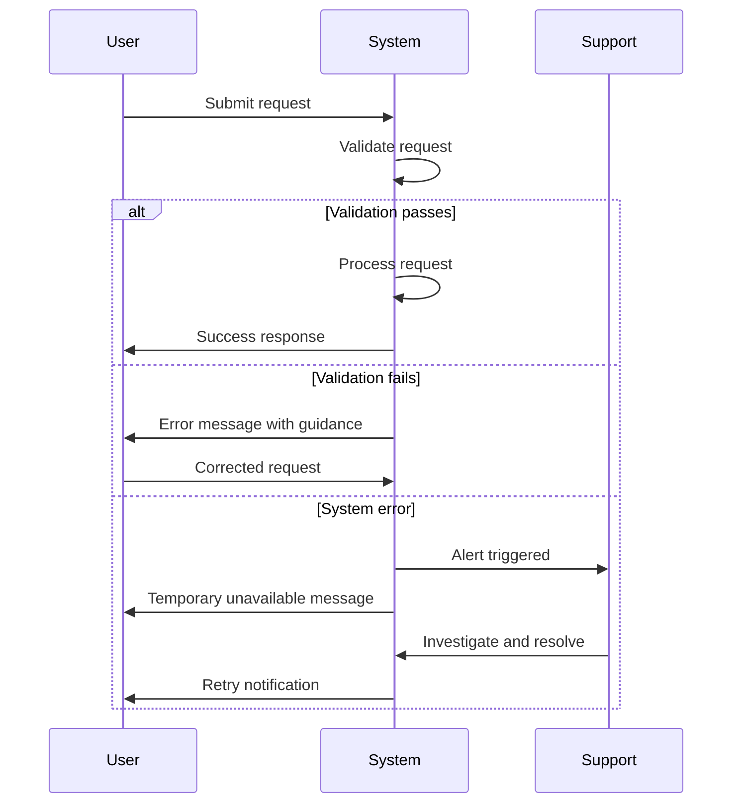

# Business Requirements Document (BRD)

## Document Control

| Item | Details |
|------|---------|
| **Project Name** | [Enter project name] |
| **Document Version** | [e.g., 1.0] |
| **Date** | [Current date] |
| **Document Owner** | [Name and title] |
| **Prepared By** | [Business Analyst name] |
| **Status** | [Draft / In Review / Approved] |
| **PRD-Ready Score** | [Score]/100 (Target: ≥90/100) |

### Document Revision History

| Version | Date | Author | Changes Made | Approver |
|---------|------|--------|--------------|----------|
| 1.0 | [Date] | [Name] | Initial draft | |
| | | | | |

---

## 1. Introduction

### 1.1 Purpose
This Business Requirements Document (BRD) defines the business requirements for [Project Name]. The document serves as the foundation for project planning, design, development, and validation activities. It provides a clear understanding of business needs, objectives, scope, and success criteria for all stakeholders.

### 1.2 Document Scope
This document covers the business perspective of the project requirements. It includes business objectives, functional and non-functional requirements, stakeholder information, constraints, assumptions, dependencies, acceptance criteria, and Architecture Decision Requirements (Section 6.2). Technical specifications and detailed design documents are maintained separately and referenced where applicable. Architecture Decision Records (ADRs) are created AFTER this BRD based on the Architecture Decision Requirements section.

### 1.3 Intended Audience
This document is intended for the following stakeholders:
- Executive sponsors and business leaders
- Project managers and business analysts
- Technical teams (development, testing, operations)
- End users and process owners
- Vendors and third-party partners (if applicable)

### 1.4 Document Conventions
- **Must/Shall:** Indicates mandatory requirements (Priority 1)
- **Should:** Indicates important but not critical requirements (Priority 2)
- **May/Could:** Indicates desirable requirements (Priority 3)
- **[Bracketed text]:** Indicates placeholder content to be completed

### 1.5 References
[List any reference documents, standards, policies, or related documentation]

**Note**: Do NOT list ADRs here. Architecture decisions will be documented in separate ADRs created AFTER this BRD is approved. See Section 6.2 for Architecture Decision Requirements.

| Document Name | Version | Location/URL |
|---------------|---------|--------------|
| [Document] | [Version] | [Location] |

---

## 2. Business Objectives

### 2.1 Background and Context
[Provide comprehensive background information explaining the business context, market conditions, organizational drivers, and events that led to this initiative. Describe the current business environment and why action is needed at this time.]

### 2.2 Business Problem Statement
[Clearly articulate the specific business problem this project will address. Define the root cause of the problem, its impact on the organization, and the consequences of inaction. Use concrete examples and quantifiable data where possible.]

**Problem Summary:**
- **Issue:** [Description of the business problem]
- **Impact:** [Quantifiable impact on business - revenue loss, cost increase, time waste, quality issues]
- **Affected Stakeholders:** [Who is impacted by this problem]
- **Current Workarounds:** [Temporary solutions currently in place and their limitations]

### 2.3 Business Goals
[Define the high-level business goals that this project aims to achieve. These should be strategic, outcome-focused statements that align with organizational objectives.]

1. [Business Goal 1]
2. [Business Goal 2]
3. [Business Goal 3]

### 2.4 Business Objectives
[List specific, measurable business objectives using SMART criteria: Specific, Measurable, Achievable, Relevant, Time-bound]

| Objective ID | Objective Statement | Success Metric | Target Value | Target Date |
|--------------|---------------------|----------------|--------------|-------------|
| BO-001 | [Specific objective] | [How measured] | [Quantifiable target] | [Completion date] |
| BO-002 | [Specific objective] | [How measured] | [Quantifiable target] | [Completion date] |
| BO-003 | [Specific objective] | [How measured] | [Quantifiable target] | [Completion date] |

### 2.5 Strategic Alignment
[Explain how this project aligns with the organization's mission, vision, strategic plan, and long-term objectives.]

- **Organizational Strategy:** [How project supports corporate strategy]
- **Department Goals:** [How project supports department objectives]
- **Industry Positioning:** [How project affects competitive [RESOURCE_INSTANCE - e.g., database connection, workflow instance]]

### 2.6 Expected Business Benefits
[Describe the anticipated business value and benefits]

**Quantifiable Benefits:**
- Cost reduction: [Specific amount or percentage]
- Revenue increase: [Specific amount or percentage]
- Productivity improvement: [Specific metrics]
- Time savings: [Hours/days saved per month]
- Error reduction: [Percentage improvement]

**Qualitative Benefits:**
- [Improved customer satisfaction]
- [Enhanced employee experience]
- [Better regulatory compliance]
- [Improved decision-making capabilities]
- [Increased operational agility]

---

## 3. Project Scope

### 3.1 Scope Statement
[Provide a clear, concise statement defining the boundaries of the project. Describe what the project will deliver at a high level.]

### 3.2 In-Scope Items
[Explicitly list all features, functions, processes, systems, departments, and deliverables that are included within the project boundaries]

1. [In-scope item 1 with brief description]
2. [In-scope item 2 with brief description]
3. [In-scope item 3 with brief description]
4. [In-scope item 4 with brief description]
5. [In-scope item 5 with brief description]

### 3.3 Out-of-Scope Items
[Explicitly list items that are NOT included to prevent scope creep and manage stakeholder expectations]

1. [Out-of-scope item 1 with rationale]
2. [Out-of-scope item 2 with rationale]
3. [Out-of-scope item 3 with rationale]
4. [Out-of-scope item 4 with rationale]

### 3.4 Future Considerations
[Items that are out of scope for the current phase but may be considered in future phases]

- [Future consideration 1]
- [Future consideration 2]

### 3.5 Business Process Scope

#### 3.5.1 Current State Process
[Describe the current business process, workflow, or system that will be impacted. Include process flow diagrams in Appendix B if applicable.]

#### 3.5.2 Future State Process
[Describe the desired future state business process after project implementation. Highlight key changes and improvements.]

#### 3.5.3 Impacted Business Areas
[List all business units, departments, or functional areas affected by this project]

| Business Area | Type of Impact | Change Magnitude |
|---------------|----------------|------------------|
| [Department/Area] | [Process/System/Organizational] | [High/Medium/Low] |

#### 3.5.4 End-to-End Workflow Diagram

[Include a high-level workflow diagram showing the end-to-end business process. Use Mermaid sequence diagrams for complex multi-participant flows.]

**Diagram Guidelines:**
- Show all key participants (users, systems, partners)
- Focus on business-level interactions, not technical implementation
- Highlight decision points and branching paths
- Include happy path and key exception paths

**Example Mermaid Sequence Diagram:**



**Workflow Summary Table:**

| Step | Actor | Action | System | Business Rule | Success Criteria |
|------|-------|--------|--------|---------------|------------------|
| 1 | [Actor] | [Action description] | [System] | [Business rule applied] | [Success criteria] |
| 2 | [Actor] | [Action description] | [System] | [Business rule applied] | [Success criteria] |
| 3 | [Actor] | [Action description] | [System] | [Business rule applied] | [Success criteria] |

#### 3.5.5 Error and Exception Handling Workflows

[Document how business processes handle errors, failures, and exception scenarios.]

**Exception Categories:**

| Category | Trigger Condition | Business Response | Customer Impact | Recovery Path |
|----------|-------------------|-------------------|-----------------|---------------|
| Validation Failure | [When this occurs] | [How business responds] | [Impact to customer] | [How to recover] |
| Partner Error | [When this occurs] | [How business responds] | [Impact to customer] | [How to recover] |
| Timeout/Unavailable | [When this occurs] | [How business responds] | [Impact to customer] | [How to recover] |
| Business Rule Violation | [When this occurs] | [How business responds] | [Impact to customer] | [How to recover] |

**Refund/Reversal Workflow** (if applicable):

[For financial processes, document the refund or reversal workflow]

| Trigger | Refund Policy | Processing Time | Customer Notification | Ledger Impact |
|---------|---------------|-----------------|----------------------|---------------|
| [Trigger scenario] | [What is refunded] | [SLA for completion] | [How customer notified] | [Accounting treatment] |

**Example Exception Handling Diagram:**



### 3.6 Technology Stack Prerequisites

**MANDATORY for ALL Feature BRDs (006+); Platform BRDs (001-005) define foundational prerequisites**

**For Platform BRDs (001-005)**:

List technology choices, infrastructure components, or platform capabilities that must exist before this platform can be implemented. These prerequisites establish the foundational technology stack upon which all platform features depend.

**Structure**: Organize prerequisites into logical categories (Core Platform Technologies, Partner Integrations, Infrastructure, etc.)

**Format for Each Prerequisite**:
- **Requirement**: Specific technology/component with version requirements
- **Rationale**: Why this prerequisite is needed (link to ADR if decision documented)
- **Business Impact**: Consequence if prerequisite not available

<!-- WARNING: Do NOT reference specific ADR numbers (e.g., ADR-002, ADR-033) in BRD content.
     Per traceability rules: BRDs identify architecture decision TOPICS in Section 9, not specific ADR IDs.
     Use: "architecture decision required" or "see Section 9 Architecture Decision Requirements" -->

**Example Entry** (Platform BRD):
```markdown
1. **PostgreSQL 14+ Database**
   - **Requirement**: PostgreSQL 14 or later with ACID compliance, replication configured
   - **Rationale**: Required for transactional consistency in user profiles, transaction state, audit logs (architecture decision required)
   - **Business Impact**: Without PostgreSQL, data integrity guarantees for financial transactions not possible
```

**For Feature BRDs (006+)**:

Document which Platform BRDs provide required infrastructure for this Feature BRD. This section MUST reference Platform BRDs and explain relevance.

**Structure**: List Platform BRD dependencies (which BRDs 001-005 are required) with relevance explanation

**Format Options**:
- **Full Sections** (Use for first 3 BRDs in category or critical workflows): Complete list with detailed relevance explanations
- **Abbreviated Sections** (Use for token efficiency): Concise bullet list referencing Platform BRDs

**Example Entry** (Feature BRD - Full):
```markdown
### 3.6 Technology Stack Prerequisites

This Feature BRD depends on the following Platform BRDs:

1. **Platform BRD-001: Platform Architecture & Technology Stack**
   - **Required Foundation**: Node.js 18+, PostgreSQL 14+, Redis 7+, Python 3.11+
   - **Relevance to BRD-XXX**: [Explain why these technologies are needed for this feature]
   - **Specific Prerequisites**: See BRD-001 Section 3.6 items 1-10

2. **Platform BRD-005: Multi-Agent AI System Architecture**
   - **Required AI Infrastructure**: Google ADK, A2A Protocol, shared context store
   - **Relevance to BRD-XXX**: [Explain why AI infrastructure is needed]
   - **Specific Prerequisites**: See BRD-005 Section 3.6 items 1-8
```

**Example Entry** (Feature BRD - Abbreviated):
```markdown
### 3.6 Technology Stack Prerequisites

**Feature BRDs** - *This section references Platform BRDs for infrastructure dependencies*

This Feature BRD depends on the following Platform BRDs:

1. **Platform BRD-001**: Node.js 18+, PostgreSQL 14+, Redis 7+, Python 3.11+, n8n (See BRD-001 Section 3.6)
2. **Platform BRD-002**: Partner integrations (See BRD-002 Section 3.6, 3.7)
3. **Platform BRD-003**: Security, compliance, audit retention (See BRD-003 Section 3.6, 3.7)
4. **Platform BRD-004**: PostgreSQL schema, data model (See BRD-004 Section 3.6)
5. **Platform BRD-005**: Google ADK, A2A Protocol, shared context store (See BRD-005 Section 3.6)
```

**Guidelines**:
- Platform BRDs: Only include true prerequisites (not nice-to-haves)
- Feature BRDs: MUST reference at least BRD-001; typically BRD-001 through BRD-005
- Specify version requirements and configuration needs
- Link to relevant ADRs using format (ADR-NNN)
- Document business impact of missing prerequisite
- Feature BRDs may also reference other Feature BRDs for workflow dependencies

### 3.7 Mandatory Technology Conditions

**MANDATORY for ALL Feature BRDs (006+); Platform BRDs (001-005) define foundational constraints**

**For Platform BRDs (001-005)**:

Document non-negotiable technical constraints that cannot be changed without fundamentally altering the platform architecture. These conditions are driven by regulatory requirements, business model economics, or partner dependencies.

**Structure**: Organize conditions into logical categories (Regulatory & Compliance Constraints, Business Model Constraints, Partner Dependencies, Performance & Scalability Constraints, etc.)

**Format for Each Condition**:
- **Condition**: The mandatory requirement stated as MUST/SHALL constraint
- **Rationale**: Why this condition is non-negotiable (regulatory, business, technical reason)
- **Business Impact**: Consequence of violating this condition
- **Exception Path**: Conditions under which exception allowed (or "None" if truly non-negotiable)

**Example Entry** (Platform BRD):
```markdown
1. **Double-Entry Accounting Ledger**
   - **Condition**: All financial transactions MUST use double-entry accounting with immutable journal entries
   - **Rationale**: Required for SOC 2 Type II compliance, regulatory audit trails, proof-of-reserves validation
   - **Business Impact**: Without double-entry accounting, platform fails financial audits; regulatory penalties apply
   - **Exception Path**: Alternative ledger system allowed if meets same compliance requirements (requires ADR)
```

**For Feature BRDs (006+)**:

Document both platform-inherited mandatory conditions and feature-specific technical requirements. All Feature BRDs MUST include 4 platform-inherited conditions plus 6-12 feature-specific conditions.

**Structure**:
- **Platform-Inherited Mandatory Conditions** (4 core conditions from Platform BRDs)
- **Feature-Specific Mandatory Conditions** (6-12 conditions unique to this workflow)

**Format Options**:
- **Full Sections** (Use for first 3 BRDs in category or critical workflows): Complete list with detailed impact analysis
- **Abbreviated Sections** (Use for token efficiency): 4 platform conditions + pointer to functional requirements

**Example Entry** (Feature BRD - Full):
```markdown
### 3.7 Mandatory Technology Conditions

**Platform-Inherited Mandatory Conditions**:

1. **PostgreSQL High Availability** (from BRD-001)
   - **Condition**: Multi-AZ deployment with ≤60s failover
   - **Relevance**: [Explain why this platform condition applies to this feature]
   - **Business Impact**: DB outage → feature blocked → business losses

2. **Audit Trail Retention** (from BRD-003)
   - **Condition**: All actions logged with 7-year retention
   - **Relevance**: [Explain compliance requirements for this feature]
   - **Business Impact**: Missing audit trails → compliance violations

3. **Google ADK Agent Framework OR n8n Workflow Engine** (from BRD-005 or BRD-001)
   - **Condition**: Workflow implemented using Platform-approved orchestration
   - **Relevance**: [Explain which orchestration approach applies]
   - **Business Impact**: Custom orchestration → platform inconsistency

4. **Field-Level PII Encryption** (from BRD-003)
   - **Condition**: All PII encrypted at field level using Platform encryption service
   - **Relevance**: [Explain PII handling in this feature]
   - **Business Impact**: Unencrypted PII → data breach risk

**Feature-Specific Mandatory Conditions for BRD-XXX**:

5. **[Feature-Specific Condition 1]**
   - **Condition**: [Precise technical requirement]
   - **Rationale**: [Why this condition is mandatory]
   - **Business Impact**: [What happens if condition not met]
   - **Exception Path**: [Fallback or "None"]

6. **[Feature-Specific Condition 2]**
   - **Condition**: [Precise technical requirement]
   - **Rationale**: [Why this condition is mandatory]
   - **Business Impact**: [What happens if condition not met]
   - **Exception Path**: [Fallback or "None"]
```

**Example Entry** (Feature BRD - Abbreviated):
```markdown
### 3.7 Mandatory Technology Conditions

**Platform-Inherited Mandatory Conditions**:

1. **PostgreSQL High Availability** (from BRD-001): Multi-AZ deployment with ≤60s failover
2. **Audit Trail Retention** (from BRD-003): All actions logged with 7-year retention
3. **Google ADK Agent Framework OR n8n Workflow Engine** (from BRD-005 or BRD-001)
4. **Field-Level PII Encryption** (from BRD-003): Platform encryption service required

**Feature-Specific Mandatory Conditions**: See Section 5 (Functional Requirements) for workflow-specific SLAs, performance targets, and technical constraints.
```

**Guidelines**:
- Platform BRDs: Only include truly mandatory conditions (test: "Can platform function without this?")
- Feature BRDs: MUST include 4 platform-inherited conditions
- Feature BRDs: Add 6-12 feature-specific conditions (performance SLAs, ML thresholds, workflow requirements)
- Use MUST/SHALL language for regulatory/compliance constraints
- Explain business or regulatory rationale clearly
- Document exception paths or state "None" if no exceptions permitted

---

## 4. Stakeholders

### 4.1 Stakeholder Identification

[Identify all individuals, groups, and organizations that have an interest in or will be affected by the project]

| Stakeholder Name/Group | Title/Role | Organization/Department | Contact Information |
|------------------------|------------|-------------------------|---------------------|
| [Name] | [Title] | [Department] | [Email/Phone] |

### 4.2 Stakeholder Analysis

| Stakeholder | Role in Project | Interest Level | Influence Level | Key Expectations | Potential Concerns | Engagement Strategy |
|-------------|-----------------|----------------|-----------------|------------------|-------------------|---------------------|
| [Name/Group] | [Sponsor/User/Approver] | [High/Med/Low] | [High/Med/Low] | [What they expect] | [What they're worried about] | [How to engage] |

---

## 5. User Stories

This section documents user stories that capture who benefits from the system, what they need to accomplish, and why it matters to them. User stories provide a user-centric view of requirements and help ensure the solution meets actual user needs.

### 5.1 User Story Format

User stories follow the standard format:
**As a** [user type/persona], **I want to** [goal/action], **so that** [business value/benefit].

### 5.2 Primary User Stories

[Document user stories for the primary personas identified in the stakeholder analysis]

#### 5.2.1 [Primary Persona Name - e.g., End User, Customer, Admin]

| Story ID | User Story | Priority | Acceptance Criteria | Related FR |
|----------|------------|----------|---------------------|------------|
| US-001 | As a [persona], I want to [action], so that [benefit] | P1/P2/P3 | [Measurable criteria for story completion] | FR-XXX |
| US-002 | As a [persona], I want to [action], so that [benefit] | P1/P2/P3 | [Measurable criteria for story completion] | FR-XXX |
| US-003 | As a [persona], I want to [action], so that [benefit] | P1/P2/P3 | [Measurable criteria for story completion] | FR-XXX |

**Example User Stories**:
- US-001: As a **sender**, I want to **view transparent fee breakdown before confirming transaction**, so that **I understand total cost with no surprises**.
- US-002: As a **sender**, I want to **save recipient details for future transactions**, so that **repeat sends are faster and more convenient**.
- US-003: As a **recipient**, I want to **receive SMS notification when money arrives**, so that **I know funds are available immediately**.

#### 5.2.2 [Secondary Persona Name - e.g., Support Agent, Compliance Officer]

| Story ID | User Story | Priority | Acceptance Criteria | Related FR |
|----------|------------|----------|---------------------|------------|
| US-0XX | As a [persona], I want to [action], so that [benefit] | P1/P2/P3 | [Measurable criteria for story completion] | FR-XXX |

### 5.3 Operational User Stories

[Document user stories for internal operations, support, and administrative personas]

| Story ID | User Story | Priority | Acceptance Criteria | Related FR |
|----------|------------|----------|---------------------|------------|
| US-0XX | As a **compliance officer**, I want to [action], so that [benefit] | P1/P2/P3 | [Criteria] | FR-XXX |
| US-0XX | As a **support agent**, I want to [action], so that [benefit] | P1/P2/P3 | [Criteria] | FR-XXX |
| US-0XX | As an **operations manager**, I want to [action], so that [benefit] | P1/P2/P3 | [Criteria] | FR-XXX |

### 5.4 User Story Summary

| Category | P1 Stories | P2 Stories | P3 Stories | Total |
|----------|------------|------------|------------|-------|
| [Primary Persona 1] | [Count] | [Count] | [Count] | [Total] |
| [Primary Persona 2] | [Count] | [Count] | [Count] | [Total] |
| Operational | [Count] | [Count] | [Count] | [Total] |
| **Total** | [Total P1] | [Total P2] | [Total P3] | [Grand Total] |

### 5.5 User Story to Business Objective Mapping

[Map user stories to business objectives to demonstrate alignment]

| Business Objective | Related User Stories | Coverage Notes |
|--------------------|---------------------|----------------|
| [BO-1: Objective description] | US-001, US-003, US-008 | [How stories address objective] |
| [BO-2: Objective description] | US-002, US-005, US-012 | [How stories address objective] |
| [BO-3: Objective description] | US-004, US-009, US-015 | [How stories address objective] |

---

## 6. Functional Requirements

### 6.1 Requirements Overview
[Provide an introduction to the functional requirements section, explaining how requirements are organized and prioritized. For complex projects, detailed requirements may be documented in appendices rather than inline tables.]

**Priority Definitions:**
- **P1 (Critical/Must Have):** Essential for project success; project cannot proceed without these
- **P2 (High/Should Have):** Important requirements that significantly enhance value but workarounds exist
- **P3 (Medium/Nice to Have):** Desirable features that improve user experience but are not essential

### 6.2 Functional Requirements by Category

**NOTE**: Functional requirements must be written at business level, NOT technical/implementation level. See Appendix B for PRD-level content exclusions and Appendix C for reference examples.

#### FR-001: [Requirement Title - Business Capability Name]

**Business Capability**: [One-sentence high-level description of what business capability this requirement enables]

**Business Requirements**:
- [Business need 1 - what must be accomplished from business perspective]
- [Business need 2 - include partner dependencies at business level]
- [Business need 3 - regulatory or compliance requirements]
- [Business need 4 - business constraints or policies]
- [Business need 5 - integration with platform BRDs if applicable]

**Business Rules**:
- [Policy constraint 1 - business rules that govern behavior]
- [Policy constraint 2 - regulatory limits or thresholds]
- [Policy constraint 3 - business logic that must be enforced]
- [Policy constraint 4 - partner SLA requirements at business level]

**Business Acceptance Criteria**:
- [Measurable success criterion 1 with target: e.g., "Process completion time <X seconds for Y% of transactions"]
- [Measurable success criterion 2 with business impact: e.g., "Fee transparency displayed before authorization (100% of transactions)"]
- [Measurable success criterion 3 with quantifiable target: e.g., "Regulatory compliance rate ≥99.9%"]
- [Measurable success criterion 4 with business outcome: e.g., "Customer satisfaction score ≥4.5/5"]

**Related Requirements**:
- Platform BRDs: [e.g., BRD-001 (Platform Architecture), BRD-002 (Partner Ecosystem)]
- Partner Integration BRDs: [e.g., BRD-XXX (Partner Name)]
- Related Feature BRDs: [e.g., BRD-YYY (Related Feature)]
- Compliance BRDs: [e.g., BRD-003 (Security & Compliance)]

**Complexity**: X/5 ([Business-level rationale: number of partners involved, regulatory scope, business constraints, cross-BRD dependencies])

---

#### FR-002: [Next Requirement Title]

**Business Capability**: [One-sentence description]

**Business Requirements**:
- [Requirement 1]
- [Requirement 2]

**Business Rules**:
- [Rule 1]
- [Rule 2]

**Business Acceptance Criteria**:
- [Criterion 1]
- [Criterion 2]

**Related Requirements**:
- [Cross-references to related BRDs]

**Complexity**: X/5 ([Rationale])

---

**Additional FR Template Guidance**:

1. **REMOVE from FRs** (PRD-level content - see Appendix B):
   - UI interaction flows, screen layouts, button placements
   - API endpoint specifications, request/response formats
   - Technical implementation details, algorithms, code logic
   - State machine transitions, workflow sequences
   - Database schemas, table structures
   - Specific timeout values, retry logic, error codes
   - Technology stack prescriptions

2. **KEEP in FRs** (Business-level content):
   - Business capabilities and outcomes
   - Regulatory and compliance requirements
   - Fee structures and pricing models
   - Business rules and policies
   - Partner dependencies (business-level SLAs)
   - Measurable business acceptance criteria
   - Business process states (names only, not transitions)

3. **Complexity Rating Scale**:
   - 1/5: Single partner, no regulatory constraints, straightforward business logic
   - 2/5: 2-3 partners, standard compliance requirements, moderate business complexity
   - 3/5: 3-4 partners, sector-specific regulations, complex fee structures or multi-tier logic
   - 4/5: 4+ partners, multi-jurisdiction compliance, cross-border requirements, high integration complexity
   - 5/5: Extensive partner ecosystem, complex regulatory framework, multi-currency/multi-corridor, AI/ML business outcomes

4. **Cross-References**: Always reference related Platform BRDs (BRD-001 through BRD-005), Partner Integration BRDs, and Feature BRDs for traceability

### 6.3 Business Rules

[Document business rules that govern how the system must behave under specific conditions]

| Rule ID | Business Rule Description | Conditions | Actions | Exception Handling |
|---------|--------------------------|------------|---------|-------------------|
| BR-001 | [Rule statement] | [When this condition exists] | [System must do this] | [What happens if rule cannot be applied] |
| BR-002 | [Rule statement] | [When this condition exists] | [System must do this] | [What happens if rule cannot be applied] |

### 6.4 User Roles and Permissions

[Define different user types and their access rights]

| Role Name | Description | Key Responsibilities | Access Level | System Permissions |
|-----------|-------------|---------------------|--------------|-------------------|
| [Role 1] | [Description] | [What they do] | [View/Edit/Admin] | [Specific permissions] |
| [Role 2] | [Description] | [What they do] | [View/Edit/Admin] | [Specific permissions] |

---

## 7. Non-Functional Requirements

### 7.1 Non-Functional Requirements Overview
[Explain that non-functional requirements define system qualities and characteristics rather than specific behaviors. These quality attributes are critical success factors for the system.]

### 7.2 Architecture Decision Requirements

The following architectural topics require formal Architecture Decision Records (ADRs) to be created in the ADR phase of the SDD workflow:

| Topic Area | Decision Needed | Business Driver (BRD Reference) | Key Considerations |
|------------|-----------------|--------------------------------|-------------------|
| [Topic 1] | [What architectural decision is needed] | [Which business objectives/requirements drive this] | [Technologies, patterns, or approaches to evaluate] |
| [Topic 2] | [What architectural decision is needed] | [Which business objectives/requirements drive this] | [Technologies, patterns, or approaches to evaluate] |

**Example Topics**:
- **Authentication/Authorization**: Select authentication mechanism (driven by NFR-XXX: Security requirements)
- **Data Storage**: Choose database technology for operational data (driven by FR-XXX: Data persistence requirements)
- **Integration Architecture**: Define API integration pattern (driven by FR-XXX: System integration)
- **Caching Strategy**: Choose caching approach (driven by NFR-XXX: Performance requirements)
- **Deployment Model**: Select deployment architecture (driven by NFR-XXX: Scalability requirements)
- **Messaging/Communication**: Choose inter-system communication pattern (driven by FR-XXX: Integration requirements)

**Purpose**: This section identifies architectural topics requiring decisions. Specific ADRs will be created AFTER this BRD during the ADR phase of the SDD workflow.

**ADR Creation Timing**: ADRs are created after BRD → PRD → SYS → EARS → REQ in the SDD workflow. Do NOT reference specific ADR numbers in this document.

---

### 7.3 Performance Requirements

| Req ID | Requirement Description | Metric | Target | Priority | Rationale |
|--------|------------------------|--------|--------|----------|-----------|
| NFR-001 | System response time for [action] | Response time | [X] seconds | P1 | [Business reason] |
| NFR-002 | System throughput capacity | Transactions/second | [X] TPS | P1 | [Business reason] |
| NFR-003 | Concurrent user support | Number of users | [X] users | P1 | [Business reason] |
| NFR-004 | Page load time | Load time | [X] seconds | P2 | [Business reason] |
| NFR-005 | Report generation time | Processing time | [X] minutes | P2 | [Business reason] |

### 7.4 Security Requirements

| Req ID | Requirement Description | Standard/Framework | Priority | Validation Method |
|--------|------------------------|-------------------|----------|-------------------|
| NFR-006 | Authentication mechanism | [e.g., Multi-factor authentication] | P1 | [How to verify] |
| NFR-007 | Data encryption at rest | [e.g., AES-256] | P1 | [How to verify] |
| NFR-008 | Data encryption in transit | [e.g., TLS 1.3] | P1 | [How to verify] |
| NFR-009 | Access control | [e.g., Role-based access control] | P1 | [How to verify] |
| NFR-010 | Audit logging | [Requirements for audit trails] | P1 | [How to verify] |
| NFR-011 | Password complexity | [Password policy requirements] | P2 | [How to verify] |
| NFR-012 | Session timeout | [e.g., 15 minutes of inactivity] | P2 | [How to verify] |

### 7.5 Availability and Reliability Requirements

| Req ID | Requirement Description | Target | Priority | Measurement Period |
|--------|------------------------|--------|----------|-------------------|
| NFR-013 | System uptime | [e.g., 99.9%] | P1 | [Monthly/Annually] |
| NFR-014 | Planned maintenance window | [e.g., 4 hours/month] | P1 | [Monthly] |
| NFR-015 | Mean Time Between Failures (MTBF) | [X hours/days] | P2 | [Annually] |
| NFR-016 | Mean Time To Repair (MTTR) | [X hours] | P1 | [Per incident] |
| NFR-017 | Backup frequency | [Daily/Weekly] | P1 | [Per policy] |
| NFR-018 | Recovery Time Objective (RTO) | [X hours] | P1 | [Per incident] |
| NFR-019 | Recovery Point Objective (RPO) | [X hours] | P1 | [Per incident] |

### 7.6 Scalability Requirements

| Req ID | Requirement Description | Current | Year 1 | Year 3 | Priority |
|--------|------------------------|---------|--------|--------|----------|
| NFR-020 | User growth capacity | [X users] | [X users] | [X users] | P1 |
| NFR-021 | Data volume growth | [X GB/TB] | [X GB/TB] | [X GB/TB] | P1 |
| NFR-022 | Transaction volume growth | [X per day] | [X per day] | [X per day] | P2 |
| NFR-023 | Storage expansion capability | [Description] | [Target] | [Target] | P2 |

### 7.7 Usability Requirements

| Req ID | Requirement Description | Standard/Guideline | Priority | Validation Method |
|--------|------------------------|-------------------|----------|-------------------|
| NFR-024 | User interface design standards | [e.g., WCAG 2.1 AA] | P1 | [Usability testing] |
| NFR-025 | Accessibility compliance | [e.g., Section 508, ADA] | P1 | [Accessibility audit] |
| NFR-026 | Browser compatibility | [List supported browsers/versions] | P1 | [Cross-browser testing] |
| NFR-027 | Mobile device support | [iOS/Android versions] | P2 | [Device testing] |
| NFR-028 | User training requirements | [Maximum training time: X hours] | P2 | [User feedback] |
| NFR-029 | Online help availability | [Context-sensitive help] | P2 | [Documentation review] |
| NFR-030 | Multilingual support | [Languages required] | P3 | [Translation verification] |

### 7.8 Compatibility Requirements

| Req ID | Requirement Description | Specification | Priority | Notes |
|--------|------------------------|---------------|----------|-------|
| NFR-031 | Operating system compatibility | [e.g., Windows 10+, macOS 12+] | P1 | [Additional details] |
| NFR-032 | Database compatibility | [e.g., PostgreSQL 13+] | P1 | [Additional details] |
| NFR-033 | Integration standards | [e.g., REST API, SOAP] | P1 | [Additional details] |
| NFR-034 | Legacy system integration | [Systems to integrate with] | P2 | [Additional details] |

### 7.9 Compliance and Regulatory Requirements

| Req ID | Regulation/Standard | Requirement Description | Applicability | Priority | Validation |
|--------|---------------------|------------------------|---------------|----------|------------|
| NFR-035 | [e.g., GDPR] | [Specific compliance requirement] | [Region/Department] | P1 | [Audit method] |
| NFR-036 | [e.g., HIPAA] | [Specific compliance requirement] | [Region/Department] | P1 | [Audit method] |
| NFR-037 | [e.g., [COMPLIANCE_STANDARD - e.g., PCI-DSS, ISO27001]] | [Specific compliance requirement] | [Region/Department] | P1 | [Audit method] |
| NFR-038 | [e.g., PCI-DSS] | [Specific compliance requirement] | [Region/Department] | P1 | [Audit method] |

### 7.10 Maintainability Requirements

| Req ID | Requirement Description | Target | Priority | Measurement |
|--------|------------------------|--------|----------|-------------|
| NFR-039 | Code documentation standards | [Standard to follow] | P2 | [Review process] |
| NFR-040 | System monitoring capabilities | [Required monitoring] | P1 | [Monitoring dashboard] |
| NFR-041 | Error logging and reporting | [Logging requirements] | P1 | [Log analysis] |
| NFR-042 | Version control | [Version control system] | P1 | [Repository review] |

### 6.10 Disaster Recovery Requirements

| Req ID | Requirement Description | Target | Priority | Testing Frequency |
|--------|------------------------|--------|----------|------------------|
| NFR-043 | Disaster recovery plan | [Plan requirements] | P1 | [Annual/Biannual] |
| NFR-044 | Backup and restore procedures | [Specific procedures] | P1 | [Quarterly] |
| NFR-045 | Failover capability | [Automatic/Manual, timeframe] | P1 | [Biannual] |
| NFR-046 | Geographic redundancy | [Requirements] | P2 | [Annual] |

---

## 8. Business Constraints and Assumptions

This section documents business-level constraints that limit solution design and assumptions that underpin business requirements. Each constraint and assumption uses standardized ID format for traceability.

### 8.1 Business Constraints

Business constraints are external limitations that restrict how business requirements can be fulfilled. These are non-negotiable factors that the solution must accommodate.

**ID Format**: `BC-XXX` (Business Constraint)

#### 7.1.1 Regulatory Constraints

Constraints imposed by laws, regulations, and compliance requirements.

| ID | Constraint | Impact on Requirements | Source |
|----|-----------|----------------------|--------|
| BC-001 | [Regulatory constraint statement] | [How this affects business requirements] | [Regulation/Law reference] |
| BC-002 | [Regulatory constraint statement] | [How this affects business requirements] | [Regulation/Law reference] |

**Examples**:
- BC-001: FinCEN recordkeeping requires 5-year transaction audit trail retention
- BC-002: OFAC compliance requires real-time sanctions screening for all transactions
- BC-003: State MTL licensing restricts operations to approved jurisdictions

#### 7.1.2 Partner SLA Constraints

Constraints imposed by partner agreements and service level commitments.

| ID | Constraint | Partner | Impact on Requirements |
|----|-----------|---------|----------------------|
| BC-0XX | [Partner SLA constraint] | [Partner name] | [How this affects business requirements] |

**Examples**:
- BC-010: Bridge custody settlement requires T+1 for ACH deposits
- BC-011: Paynet delivery confirmation SLA is 24-48 hours for bank transfers
- BC-012: Partner API rate limits cap at 1,000 requests per minute

#### 7.1.3 Technical Platform Constraints

Constraints from existing technical infrastructure and platform capabilities.

| ID | Constraint | Platform Component | Impact on Requirements |
|----|-----------|-------------------|----------------------|
| BC-0XX | [Technical constraint] | [Component] | [How this affects business requirements] |

**Examples**:
- BC-020: Platform wallet architecture requires single-currency (USD) balance
- BC-021: Mobile app deployment requires App Store/Play Store approval cycles
- BC-022: API gateway timeout limits maximum transaction processing to 30 seconds

#### 7.1.4 Operational Constraints

Constraints from business operations, support capacity, and organizational policies.

| ID | Constraint | Operational Area | Impact on Requirements |
|----|-----------|-----------------|----------------------|
| BC-0XX | [Operational constraint] | [Area] | [How this affects business requirements] |

**Examples**:
- BC-030: Compliance team capacity limits manual review queue to 500 cases/day
- BC-031: Customer support hours (9 AM - 9 PM EST) limit real-time escalation availability
- BC-032: Quarterly compliance audits require feature freeze periods

#### 7.1.5 Budget Constraints

Constraints from approved budget allocations and cost limitations.

| ID | Constraint | Budget Category | Impact on Requirements |
|----|-----------|----------------|----------------------|
| BC-0XX | [Budget constraint] | [Category] | [How this affects business requirements] |

**Examples**:
- BC-040: Partner integration budget limits initial corridors to 3 countries
- BC-041: Marketing budget caps launch promotions at 90-day fee waiver period
- BC-042: Infrastructure budget requires shared hosting for non-production environments

#### 7.1.6 Timeline Constraints

Constraints from business deadlines, market windows, and regulatory dates.

| ID | Constraint | Timeline Driver | Impact on Requirements |
|----|-----------|----------------|----------------------|
| BC-0XX | [Timeline constraint] | [Driver] | [How this affects business requirements] |

**Examples**:
- BC-050: Ramadan corridor launch requires completion before religious calendar dates
- BC-051: Regulatory filing deadline requires compliance features by Q4
- BC-052: Partner contract renewal requires integration completion within 6 months

---

### 8.2 Business Assumptions

Business assumptions are conditions believed to be true for planning purposes. Each assumption must be validated and has defined impact if proven false.

**ID Format**: `BA-XXX` (Business Assumption)

#### 8.2.1 Market Assumptions

Assumptions about market conditions, customer demand, and competitive landscape.

| ID | Assumption | Validation Method | Impact if Invalid |
|----|-----------|------------------|-------------------|
| BA-001 | [Market assumption] | [How to validate] | [Business impact] |

**Examples**:
- BA-001: US-Uzbekistan remittance corridor has sufficient demand (>10,000 monthly transactions)
- BA-002: Target customers prefer mobile-first remittance experience
- BA-003: Competitive pricing at 3% all-in cost will drive customer acquisition

#### 8.2.2 Partner Assumptions

Assumptions about partner capabilities, availability, and performance.

| ID | Assumption | Partner | Validation Method | Impact if Invalid |
|----|-----------|---------|------------------|-------------------|
| BA-0XX | [Partner assumption] | [Partner] | [How to validate] | [Business impact] |

**Examples**:
- BA-010: Bridge custody provider will maintain 99.9% API availability
- BA-011: Paynet delivery network covers 95% of Uzbekistan banking infrastructure
- BA-012: Partner onboarding will complete within 30 days of contract signing

#### 8.2.3 User Behavior Assumptions

Assumptions about how customers will interact with the solution.

| ID | Assumption | User Segment | Validation Method | Impact if Invalid |
|----|-----------|-------------|------------------|-------------------|
| BA-0XX | [User behavior assumption] | [Segment] | [How to validate] | [Business impact] |

**Examples**:
- BA-020: Users will complete KYC within single session (no drop-off mid-process)
- BA-021: Repeat senders will use saved recipient feature (80% reuse rate)
- BA-022: Users accept mobile-only experience (no desktop requirement)

#### 8.2.4 Technical Assumptions

Assumptions about technical capabilities, integrations, and system behavior.

| ID | Assumption | Technical Area | Validation Method | Impact if Invalid |
|----|-----------|---------------|------------------|-------------------|
| BA-0XX | [Technical assumption] | [Area] | [How to validate] | [Business impact] |

**Examples**:
- BA-030: Partner APIs will support required transaction volumes (10,000 TPS peak)
- BA-031: Existing fraud detection model will achieve ≤3% false positive rate
- BA-032: Mobile app can achieve <3 second transaction initiation time

#### 8.2.5 Financial Assumptions

Assumptions about pricing, costs, and financial viability.

| ID | Assumption | Financial Area | Validation Method | Impact if Invalid |
|----|-----------|---------------|------------------|-------------------|
| BA-0XX | [Financial assumption] | [Area] | [How to validate] | [Business impact] |

**Examples**:
- BA-040: FX spread of 1.5-2% will be competitive in target market
- BA-041: Customer acquisition cost will be <$50 per active customer
- BA-042: Break-even achievable at 5,000 monthly active users

#### 8.2.6 Regulatory Assumptions

Assumptions about regulatory environment, licensing, and compliance requirements.

| ID | Assumption | Regulatory Area | Validation Method | Impact if Invalid |
|----|-----------|----------------|------------------|-------------------|
| BA-0XX | [Regulatory assumption] | [Area] | [How to validate] | [Business impact] |

**Examples**:
- BA-050: MTL licensing will be maintained in all operating states
- BA-051: Uzbekistan regulatory environment will remain stable for remittance services
- BA-052: KYC requirements will not significantly change during development period

---

### 8.3 Dependency Clarifications

This section clarifies dependency types and their impact on requirement prioritization.

| Dependency ID | Description | Dependency Type | Upstream BRD | Impact if Delayed | Mitigation |
|---------------|-------------|-----------------|--------------|-------------------|------------|
| DEP-001 | [Dependency description] | Hard/Medium/Soft | BRD-XXX | [Business impact] | [Alternative approach] |
| DEP-002 | [Dependency description] | Hard/Medium/Soft | BRD-XXX | [Business impact] | [Alternative approach] |

**Dependency Type Definitions**:
| Type | Definition | Example |
|------|-----------|---------|
| **Hard** | Blocker - requirement cannot be implemented without this | KYC system required before transaction processing |
| **Medium** | Degrades functionality - can proceed with reduced capability | ML fraud detection; can use rule-based fallback |
| **Soft** | Nice-to-have - affects user experience but not core functionality | Push notifications; email fallback acceptable |

**Example Dependency Clarifications**:
| Dependency ID | Description | Dependency Type | Upstream BRD | Impact if Delayed | Mitigation |
|---------------|-------------|-----------------|--------------|-------------------|------------|
| DEP-001 | Wallet funding via custody provider | Hard | BRD-008 | Cannot process transactions | No alternative - hard blocker |
| DEP-002 | ML-based fraud detection scoring | Medium | BRD-022 | Higher false positive rate | Rule-based screening as fallback |
| DEP-003 | Push notification delivery | Soft | BRD-015 | Reduced user engagement | Email/SMS notification fallback |
| DEP-004 | Real-time FX rate display | Medium | BRD-010 | Slightly stale rates (1-min cache) | Cached rates with staleness indicator |

---

## 9. Acceptance Criteria

### 9.1 Acceptance Criteria Overview

[Explain the purpose of acceptance criteria and how they will be used to validate project success]

Acceptance criteria define the conditions that must be satisfied for the project deliverables to be accepted by stakeholders. These criteria provide objective measures to determine when requirements have been successfully met.

### 9.2 Business Acceptance Criteria

[Define high-level business criteria that must be met for business stakeholders to accept the solution]

| Criteria ID | Acceptance Criterion | Measurement Method | Target | Verification Approach | Responsible Party |
|-------------|---------------------|-------------------|--------|----------------------|------------------|
| AC-001 | [Specific measurable criterion] | [How it will be measured] | [Target value] | [How verified] | [Name/Role] |
| AC-002 | [Specific measurable criterion] | [How it will be measured] | [Target value] | [How verified] | [Name/Role] |
| AC-003 | [Specific measurable criterion] | [How it will be measured] | [Target value] | [How verified] | [Name/Role] |

**Examples:**
- System processes X transactions per minute without errors
- 95% of users can complete core tasks without assistance
- System achieves 99.9% uptime over 30-day period
- Data migration completes with 100% accuracy
- All P1 requirements are implemented and tested

### 9.3 Functional Acceptance Criteria

[Map acceptance criteria to specific functional requirements]

| Requirement ID | Acceptance Criterion | Test Scenario | Expected Result | Pass/Fail Criteria |
|----------------|---------------------|---------------|-----------------|-------------------|
| FR-001 | [Criterion for this requirement] | [How to test] | [What should happen] | [How to determine pass/fail] |
| FR-002 | [Criterion for this requirement] | [How to test] | [What should happen] | [How to determine pass/fail] |
| FR-003 | [Criterion for this requirement] | [How to test] | [What should happen] | [How to determine pass/fail] |

### 9.4 Non-Functional Acceptance Criteria

[Define acceptance criteria for non-functional requirements]

| Requirement ID | Acceptance Criterion | Measurement Method | Target | Test Approach | Pass Threshold |
|----------------|---------------------|-------------------|--------|---------------|----------------|
| NFR-001 | [Performance criterion] | [Load testing] | [X seconds] | [Test scenario] | [95% within target] |
| NFR-006 | [Security criterion] | [Security audit] | [Standard compliance] | [Audit process] | [100% compliance] |
| NFR-013 | [Availability criterion] | [Monitoring logs] | [99.9% uptime] | [30-day monitoring] | [Meets or exceeds target] |

### 9.5 User Acceptance Testing (UAT) Criteria

[Define the UAT approach and success criteria]

#### 9.5.1 UAT Scope
[Describe what will be tested during UAT]

- [Scope item 1]
- [Scope item 2]
- [Scope item 3]

#### 9.5.2 UAT Participants

| Role | Department | Number of Users | Responsibilities |
|------|------------|-----------------|------------------|
| [Role] | [Department] | [#] | [What they will do] |

#### 9.5.3 UAT Test Scenarios

[List key business scenarios that will be tested]

| Scenario ID | Scenario Description | Prerequisites | Expected Outcome | Success Criteria |
|-------------|---------------------|---------------|------------------|------------------|
| UAT-001 | [End-to-end business scenario] | [Setup required] | [What should happen] | [How to measure success] |
| UAT-002 | [End-to-end business scenario] | [Setup required] | [What should happen] | [How to measure success] |

#### 9.5.4 UAT Schedule

- **UAT Start Date:** [Date]
- **UAT Duration:** [Number of days/weeks]
- **UAT End Date:** [Date]
- **Sign-off Date:** [Date]

#### 9.5.5 UAT Success Criteria

[Define what constitutes successful UAT completion]

- [Criterion 1: e.g., 100% of critical test scenarios pass]
- [Criterion 2: e.g., No Severity 1 or 2 defects remain open]
- [Criterion 3: e.g., 95% user satisfaction rating]
- [Criterion 4: e.g., All required documentation delivered]

### 9.6 Go-Live Readiness Criteria

[Define criteria that must be met before production deployment]

| Criteria Category | Specific Criteria | Status Required | Verification Method | Responsible Party |
|-------------------|-------------------|-----------------|---------------------|-------------------|
| Testing | All UAT test scenarios completed | 100% pass rate | UAT report | [QA Manager] |
| Testing | All critical defects resolved | Zero open | Defect tracking system | [QA Manager] |
| Training | User training completed | 100% of users | Training attendance records | [Training Manager] |
| Documentation | User documentation delivered | Complete and approved | Documentation review | [Business Analyst] |
| Documentation | Technical documentation delivered | Complete and approved | Documentation review | [Technical Lead] |
| Infrastructure | Production environment ready | Fully configured | Environment checklist | [IT Operations] |
| Security | Security assessment completed | Approved | Security report | [Security Team] |
| Data | Data migration validated | 100% accuracy | Data validation report | [Data Team] |
| Support | Support team trained | 100% of team | Training records | [Support Manager] |
| Approvals | Business sponsor sign-off | Approved | Sign-off document | [Project Sponsor] |

### 9.7 Success Metrics and KPIs

[Define how project success will be measured post-implementation]

| KPI | Baseline | Target | Measurement Frequency | Measurement Method | Owner |
|-----|----------|--------|----------------------|-------------------|-------|
| [Key performance indicator] | [Current value] | [Goal] | [Daily/Weekly/Monthly] | [How measured] | [Name] |
| [Key performance indicator] | [Current value] | [Goal] | [Daily/Weekly/Monthly] | [How measured] | [Name] |
| [Key performance indicator] | [Current value] | [Goal] | [Daily/Weekly/Monthly] | [How measured] | [Name] |

### 9.8 Acceptance Sign-Off Process

#### 9.8.1 Sign-Off Requirements

[Define who must sign off and what they are approving]

| Sign-Off Level | Approver Role | Scope of Approval | Prerequisites | Target Date |
|----------------|---------------|-------------------|---------------|-------------|
| Business Acceptance | [Business Sponsor] | Business requirements met | UAT completed successfully | [Date] |
| Technical Acceptance | [Technical Lead] | Technical requirements met | System testing completed | [Date] |
| User Acceptance | [User Representative] | Solution meets user needs | UAT completed | [Date] |
| Security Acceptance | [Security Officer] | Security requirements met | Security assessment passed | [Date] |
| Final Acceptance | [Project Director] | All criteria met | All other sign-offs completed | [Date] |

#### 9.8.2 Acceptance Criteria Not Met

[Define the process if acceptance criteria are not met]

If acceptance criteria are not met:
1. Document specific criteria that were not satisfied
2. Conduct root cause analysis
3. Develop remediation plan with timeline
4. Implement corrective actions
5. Re-test and re-submit for acceptance
6. Obtain formal sign-off on remediation

---

## 10. Business Risk Management

This section documents business-level risks that could impact requirement delivery or business outcomes. Each risk uses standardized scoring methodology for prioritization.

### 10.1 Risk Scoring Methodology

**Risk Score Formula**: Likelihood (1-3) × Impact (3-15) = Risk Score (maximum 15)

**Likelihood Scale**:
| Level | Score | Definition | Probability |
|-------|-------|-----------|-------------|
| Low | 1 | Unlikely to occur based on current conditions | <20% |
| Medium | 2 | Possible given known factors | 20-60% |
| High | 3 | Likely based on current trajectory | >60% |

**Impact Scale** (Business-Focused):
| Level | Score | Definition | Business Examples |
|-------|-------|-----------|-------------------|
| Minor | 3 | Limited business impact | Delayed feature, minor UX degradation |
| Moderate | 5 | Noticeable business impact | Reduced functionality, increased costs |
| Significant | 8 | Substantial business impact | Competitive disadvantage, customer churn |
| Major | 10 | Severe business impact | Regulatory action, significant revenue loss |
| Critical | 15 | Existential business impact | License revocation, market exit |

**Risk Priority Matrix**:
| Risk Score | Priority | Action Required |
|------------|----------|-----------------|
| 1-5 | Low | Monitor quarterly |
| 6-15 | Medium | Monthly review, mitigation plan required |
| 16-30 | High | Weekly review, active mitigation |
| 31-45 | Critical | Immediate escalation, executive attention |

---

### 10.2 Risk Register by Category

**ID Format**: `RISK-XXX` (Business Risk)

#### 10.2.1 Market & Competitive Risks

Risks from market conditions, competitive pressure, and demand uncertainty.

| ID | Risk | Likelihood | Impact | Score | Mitigation | Contingency | Owner |
|----|------|-----------|--------|-------|------------|-------------|-------|
| RISK-001 | [Market/competitive risk] | [1-3] | [3-15] | [Score] | [Preventive action] | [If occurs] | [Role] |

**Examples**:
- RISK-001: Competitor launches similar corridor with lower fees (L:2 × I:8 = 16)
- RISK-002: Target market demand lower than projected (L:2 × I:10 = 20)
- RISK-003: Exchange rate volatility reduces margin competitiveness (L:3 × I:5 = 15)

#### 10.2.2 Regulatory & Compliance Risks

Risks from regulatory changes, licensing requirements, and compliance obligations.

| ID | Risk | Likelihood | Impact | Score | Mitigation | Contingency | Owner |
|----|------|-----------|--------|-------|------------|-------------|-------|
| RISK-0XX | [Regulatory risk] | [1-3] | [3-15] | [Score] | [Preventive action] | [If occurs] | [Role] |

**Examples**:
- RISK-010: MTL license renewal delayed or denied (L:1 × I:15 = 15)
- RISK-011: New AML regulations require system modifications (L:2 × I:8 = 16)
- RISK-012: Destination country restricts inbound remittances (L:1 × I:15 = 15)

#### 10.2.3 Partner & Operational Risks

Risks from partner dependencies, SLA failures, and operational disruptions.

| ID | Risk | Likelihood | Impact | Score | Mitigation | Contingency | Owner |
|----|------|-----------|--------|-------|------------|-------------|-------|
| RISK-0XX | [Partner/operational risk] | [1-3] | [3-15] | [Score] | [Preventive action] | [If occurs] | [Role] |

**Examples**:
- RISK-020: Custody provider experiences extended outage (L:1 × I:10 = 10)
- RISK-021: Delivery partner fails to meet SLA commitments (L:2 × I:8 = 16)
- RISK-022: Partner API changes require emergency integration updates (L:2 × I:5 = 10)

#### 10.2.4 Financial & Economic Risks

Risks from pricing, costs, profitability, and economic conditions.

| ID | Risk | Likelihood | Impact | Score | Mitigation | Contingency | Owner |
|----|------|-----------|--------|-------|------------|-------------|-------|
| RISK-0XX | [Financial risk] | [1-3] | [3-15] | [Score] | [Preventive action] | [If occurs] | [Role] |

**Examples**:
- RISK-030: Partner fee increases erode transaction margins (L:2 × I:8 = 16)
- RISK-031: Customer acquisition costs exceed projections (L:2 × I:5 = 10)
- RISK-032: Economic downturn reduces remittance volumes (L:2 × I:10 = 20)

#### 10.2.5 Customer Experience & Reputation Risks

Risks affecting customer satisfaction, brand perception, and trust.

| ID | Risk | Likelihood | Impact | Score | Mitigation | Contingency | Owner |
|----|------|-----------|--------|-------|------------|-------------|-------|
| RISK-0XX | [CX/reputation risk] | [1-3] | [3-15] | [Score] | [Preventive action] | [If occurs] | [Role] |

**Examples**:
- RISK-040: High false positive rate blocks legitimate customers (L:2 × I:8 = 16)
- RISK-041: Transaction delivery delays exceed customer expectations (L:2 × I:8 = 16)
- RISK-042: Negative reviews impact App Store rating below 4.0 (L:2 × I:5 = 10)

#### 10.2.6 Technology & Platform Risks

Risks from technical failures, scalability, and system dependencies.

| ID | Risk | Likelihood | Impact | Score | Mitigation | Contingency | Owner |
|----|------|-----------|--------|-------|------------|-------------|-------|
| RISK-0XX | [Technology risk] | [1-3] | [3-15] | [Score] | [Preventive action] | [If occurs] | [Role] |

**Examples**:
- RISK-050: Platform cannot scale to handle transaction volume (L:1 × I:10 = 10)
- RISK-051: Security breach compromises customer data (L:1 × I:15 = 15)
- RISK-052: Third-party dependency vulnerability requires emergency patching (L:2 × I:5 = 10)

#### 10.2.7 Strategic & Business Model Risks

Risks to business strategy, market positioning, and long-term viability.

| ID | Risk | Likelihood | Impact | Score | Mitigation | Contingency | Owner |
|----|------|-----------|--------|-------|------------|-------------|-------|
| RISK-0XX | [Strategic risk] | [1-3] | [3-15] | [Score] | [Preventive action] | [If occurs] | [Role] |

**Examples**:
- RISK-060: Single-corridor dependency limits growth options (L:2 × I:8 = 16)
- RISK-061: Business model disrupted by new payment rail technology (L:1 × I:10 = 10)
- RISK-062: Key partnership exclusivity limits competitive positioning (L:2 × I:5 = 10)

---

### 10.3 Risk Summary Dashboard

| Category | High Risks (>15) | Medium Risks (6-15) | Low Risks (1-5) | Total |
|----------|-----------------|---------------------|-----------------|-------|
| Market & Competitive | [Count] | [Count] | [Count] | [Total] |
| Regulatory & Compliance | [Count] | [Count] | [Count] | [Total] |
| Partner & Operational | [Count] | [Count] | [Count] | [Total] |
| Financial & Economic | [Count] | [Count] | [Count] | [Total] |
| Customer Experience | [Count] | [Count] | [Count] | [Total] |
| Technology & Platform | [Count] | [Count] | [Count] | [Total] |
| Strategic & Business Model | [Count] | [Count] | [Count] | [Total] |
| **Total** | [Total High] | [Total Medium] | [Total Low] | [Grand Total] |

### 10.4 Risk Monitoring and Review

- **Risk Review Frequency**: [Weekly for High/Critical, Monthly for Medium, Quarterly for Low]
- **Risk Review Forum**: [Steering committee, Project team meeting]
- **Escalation Criteria**: Score increase >5 points, new High/Critical risks
- **Risk Register Owner**: [Name/Role]

---

## 11. Implementation Approach

### 11.1 Implementation Strategy

[Describe the high-level approach to implementing the solution]

**Implementation Method:** [e.g., Phased rollout, Big bang, Pilot program, Parallel run]

**Rationale:** [Why this approach was selected]

### 11.2 Implementation Phases

| Phase | Description | Key Activities | Duration | Start Date | End Date | Deliverables |
|-------|-------------|----------------|----------|------------|----------|--------------|
| Phase 1 | [Phase name] | [Key activities] | [Weeks] | [Date] | [Date] | [What's delivered] |
| Phase 2 | [Phase name] | [Key activities] | [Weeks] | [Date] | [Date] | [What's delivered] |
| Phase 3 | [Phase name] | [Key activities] | [Weeks] | [Date] | [Date] | [What's delivered] |

### 11.3 Rollout Plan

[Describe how the solution will be deployed to users]

| Rollout Stage | Target Users | Number of Users | Date | Success Criteria | Rollback Plan |
|---------------|-------------|-----------------|------|------------------|---------------|
| [Stage 1] | [User group] | [#] | [Date] | [Criteria] | [If problems occur] |
| [Stage 2] | [User group] | [#] | [Date] | [Criteria] | [If problems occur] |

### 11.4 Data Migration Plan

[If applicable, describe how existing data will be migrated]

**Migration Approach:** [Description]

| Migration Phase | Data Category | Volume | Source System | Target System | Migration Date | Validation Method |
|-----------------|---------------|--------|---------------|---------------|----------------|-------------------|
| [Phase] | [Type of data] | [Records/GB] | [System] | [System] | [Date] | [How validated] |

### 11.5 Integration Plan

[Describe how the solution will integrate with existing systems]

| Integration Point | Source System | Target System | Integration Method | Data Flow | Frequency | Responsible Team |
|-------------------|---------------|---------------|-------------------|-----------|-----------|------------------|
| [Integration] | [System] | [System] | [API/File/Real-time] | [Direction] | [When] | [Team] |

---

## 12. Training and Change Management

### 12.1 Training Strategy

[Describe the overall approach to training users]

**Training Objectives:**
- [Objective 1]
- [Objective 2]
- [Objective 3]

### 12.2 Training Plan

| User Group | Number of Users | Training Type | Duration | Delivery Method | Schedule | Materials Needed | Trainer |
|------------|-----------------|---------------|----------|-----------------|----------|------------------|---------|
| [Group] | [#] | [Type] | [Hours] | [In-person/Online/Hybrid] | [Dates] | [List] | [Name] |

### 12.3 Training Materials

[List all training materials that will be developed]

- User manuals
- Quick reference guides
- Video tutorials
- Hands-on exercises
- FAQs
- Job aids

### 12.4 Change Management Strategy

[Describe how organizational change will be managed]

#### 12.4.1 Change Impact Assessment

| Stakeholder Group | Current State | Future State | Impact Level | Change Type | Resistance Level |
|-------------------|---------------|--------------|--------------|-------------|------------------|
| [Group] | [How they work now] | [How they will work] | [High/Med/Low] | [Process/System/Role] | [High/Med/Low] |

#### 12.4.2 Communication Plan

| Audience | Message | Communication Method | Frequency | Sender | Timing |
|----------|---------|---------------------|-----------|--------|--------|
| [Group] | [Key messages] | [Email/Meeting/Newsletter] | [When] | [Who sends] | [When] |

#### 12.4.3 Change Readiness Activities

- [Activity 1: e.g., Town hall meetings]
- [Activity 2: e.g., Champions program]
- [Activity 3: e.g., Feedback sessions]
- [Activity 4: e.g., Early adopter program]

---

## 13. Support and Maintenance

### 13.1 Support Model

[Define how users will be supported after implementation]

**Support Structure:**
- **Tier 1 Support:** [Who provides, what they handle]
- **Tier 2 Support:** [Who provides, what they handle]
- **Tier 3 Support:** [Who provides, what they handle]

### 13.2 Support Services

| Support Element | Description | Availability | Contact Method | Response Time SLA |
|-----------------|-------------|--------------|----------------|-------------------|
| Help Desk | [Description] | [Hours] | [Phone/Email/Portal] | [Timeframe] |
| Self-Service | [Description] | [24/7] | [Knowledge base/Portal] | [Immediate] |
| On-Site Support | [Description] | [By appointment] | [Request process] | [Timeframe] |

### 13.3 Service Level Agreements (SLAs)

| Priority Level | Definition | Response Time | Resolution Time | Escalation |
|----------------|------------|---------------|-----------------|------------|
| Critical (P1) | [System down, major impact] | [X minutes] | [X hours] | [Immediate] |
| High (P2) | [Significant impact, workaround exists] | [X hours] | [X hours] | [After X hours] |
| Medium (P3) | [Moderate impact] | [X hours] | [X days] | [After X days] |
| Low (P4) | [Minor issue, cosmetic] | [X days] | [X days] | [As needed] |

### 13.4 Maintenance Plan

**Planned Maintenance:**
- **Frequency:** [Weekly/Monthly/Quarterly]
- **Maintenance Window:** [Day and time]
- **Duration:** [Expected hours]
- **Communication:** [How users are notified]

**Update Management:**
- **Patch Schedule:** [How often patches applied]
- **Version Upgrades:** [Approach to major upgrades]
- **Testing Process:** [How updates are tested]

---

## 14. Cost-Benefit Analysis

### 14.1 Cost Summary

#### 14.1.1 One-Time Costs

| Cost Category | Description | Estimated Cost | Actual Cost | Variance |
|---------------|-------------|----------------|-------------|----------|
| Software Licenses | [Details] | $[Amount] | $[Amount] | $[Amount] |
| Hardware/Infrastructure | [Details] | $[Amount] | $[Amount] | $[Amount] |
| Development/Implementation | [Details] | $[Amount] | $[Amount] | $[Amount] |
| Consulting Services | [Details] | $[Amount] | $[Amount] | $[Amount] |
| Training | [Details] | $[Amount] | $[Amount] | $[Amount] |
| Change Management | [Details] | $[Amount] | $[Amount] | $[Amount] |
| Data Migration | [Details] | $[Amount] | $[Amount] | $[Amount] |
| Testing | [Details] | $[Amount] | $[Amount] | $[Amount] |
| Project Management | [Details] | $[Amount] | $[Amount] | $[Amount] |
| Contingency (10-15%) | [Buffer for unknowns] | $[Amount] | $[Amount] | $[Amount] |
| **Total One-Time Costs** | | **$[Amount]** | **$[Amount]** | **$[Amount]** |

#### 14.1.2 Recurring Annual Costs

| Cost Category | Description | Year 1 | Year 2 | Year 3 |
|---------------|-------------|--------|--------|--------|
| Software Maintenance | [Annual fees] | $[Amount] | $[Amount] | $[Amount] |
| Support Services | [Ongoing support] | $[Amount] | $[Amount] | $[Amount] |
| Hosting/Infrastructure | [Cloud/hosting costs] | $[Amount] | $[Amount] | $[Amount] |
| Staff/Personnel | [FTEs required] | $[Amount] | $[Amount] | $[Amount] |
| Training (ongoing) | [Refresher training] | $[Amount] | $[Amount] | $[Amount] |
| Upgrades/Enhancements | [Planned improvements] | $[Amount] | $[Amount] | $[Amount] |
| **Total Annual Costs** | | **$[Amount]** | **$[Amount]** | **$[Amount]** |

#### 14.1.3 Total Cost of Ownership (3 Years)

| Cost Type | Amount |
|-----------|--------|
| One-Time Costs | $[Amount] |
| Year 1 Recurring | $[Amount] |
| Year 2 Recurring | $[Amount] |
| Year 3 Recurring | $[Amount] |
| **Total 3-Year TCO** | **$[Amount]** |

### 14.2 Benefit Summary

#### 14.2.1 Quantifiable Benefits

| Benefit Category | Description | Year 1 | Year 2 | Year 3 | 3-Year Total | Calculation Method |
|------------------|-------------|--------|--------|--------|--------------|-------------------|
| Cost Savings | [Reduced operational costs] | $[Amount] | $[Amount] | $[Amount] | $[Amount] | [How calculated] |
| Labor Savings | [Time saved × hourly rate] | $[Amount] | $[Amount] | $[Amount] | $[Amount] | [How calculated] |
| Revenue Increase | [New revenue opportunities] | $[Amount] | $[Amount] | $[Amount] | $[Amount] | [How calculated] |
| Error Reduction | [Cost of errors avoided] | $[Amount] | $[Amount] | $[Amount] | $[Amount] | [How calculated] |
| Efficiency Gains | [Productivity improvements] | $[Amount] | $[Amount] | $[Amount] | $[Amount] | [How calculated] |
| **Total Quantifiable Benefits** | | **$[Amount]** | **$[Amount]** | **$[Amount]** | **$[Amount]** | |

#### 14.2.2 Qualitative Benefits

[List benefits that cannot be easily quantified but provide significant value]

- **Customer Satisfaction:** [Description of improvement]
- **Employee Satisfaction:** [Description of improvement]
- **Competitive Advantage:** [Description of strategic value]
- **Risk Reduction:** [Description of risk mitigation]
- **Compliance:** [Description of compliance improvements]
- **Strategic Alignment:** [Description of strategic benefits]
- **Innovation:** [Description of innovation enablement]
- **Scalability:** [Description of growth support]

### 14.3 Financial Analysis

#### 14.3.1 Return on Investment (ROI)

| Metric | Formula | Year 1 | Year 2 | Year 3 | 3-Year |
|--------|---------|--------|--------|--------|--------|
| Net Benefit | Benefits - Costs | $[Amount] | $[Amount] | $[Amount] | $[Amount] |
| ROI % | (Net Benefit / Total Cost) × 100 | [%] | [%] | [%] | [%] |
| Cumulative ROI | | [%] | [%] | [%] | [%] |

#### 14.3.2 Payback Period

**Payback Period:** [Number of months/years until investment is recovered]

**Breakeven Point:** [Date when cumulative benefits equal cumulative costs]

#### 14.3.3 Net Present Value (NPV)

[If applicable, calculate NPV using appropriate discount rate]

- **Discount Rate:** [%]
- **NPV:** $[Amount]

### 14.4 Sensitivity Analysis

[Analyze how changes in key assumptions affect ROI]

| Scenario | Description | Impact on ROI | Probability |
|----------|-------------|---------------|-------------|
| Best Case | [Optimistic assumptions] | [ROI] | [%] |
| Expected Case | [Most likely scenario] | [ROI] | [%] |
| Worst Case | [Conservative assumptions] | [ROI] | [%] |

---

## 15. Project Governance

### 15.1 Governance Structure

[Define the decision-making and oversight structure]

#### 15.1.1 Steering Committee

**Purpose:** Provide strategic oversight and make major decisions

**Members:**
- [Name, Title] - Chair
- [Name, Title] - Member
- [Name, Title] - Member

**Meeting Frequency:** [Monthly/Quarterly]

**Responsibilities:**
- Approve scope changes
- Resolve escalated issues
- Review project status
- Approve phase gate transitions
- Ensure resource availability

#### 15.1.2 Project Team

**Core Team Members:**

| Name | Role | Department | Allocation | Responsibilities |
|------|------|------------|------------|------------------|
| [Name] | Project Manager | [Dept] | [%] | [Responsibilities] |
| [Name] | Business Analyst | [Dept] | [%] | [Responsibilities] |
| [Name] | Technical Lead | [Dept] | [%] | [Responsibilities] |
| [Name] | Subject Matter Expert | [Dept] | [%] | [Responsibilities] |

### 15.2 Decision-Making Authority

| Decision Type | Authority Level | Approver(s) | Delegation Allowed |
|---------------|----------------|-------------|-------------------|
| Budget changes < $[X] | Project Manager | [Name] | No |
| Budget changes > $[X] | Steering Committee | [Committee] | No |
| Scope changes (P1/P2) | Steering Committee | [Committee] | No |
| Scope changes (P3) | Project Manager | [Name] | Yes |
| Schedule changes < [X] days | Project Manager | [Name] | No |
| Schedule changes > [X] days | Steering Committee | [Committee] | No |
| Resource allocation | Functional Manager | [Name] | Yes |

### 15.3 Status Reporting

| Report Type | Audience | Frequency | Content | Owner |
|-------------|----------|-----------|---------|-------|
| Project Status Report | Steering Committee | [Weekly/Monthly] | [Status, risks, issues, budget] | Project Manager |
| Executive Dashboard | Executive Sponsors | [Monthly] | [High-level KPIs, milestones] | Project Director |
| Team Status | Project Team | [Weekly] | [Detailed progress, blockers] | Project Manager |
| Stakeholder Update | All Stakeholders | [Biweekly] | [Progress, upcoming activities] | Project Manager |

### 15.4 Change Control Process

[Define how changes to scope, schedule, or budget are managed]

**Change Request Process:**
1. Change request submitted using standard template
2. Business analyst assesses impact on requirements
3. Project manager assesses impact on schedule, cost, resources
4. Change advisory board reviews and makes recommendation
5. Appropriate authority approves or rejects
6. If approved, update project documents and communicate
7. Implement change

**Change Request Template Elements:**
- Change description
- Business justification
- Impact analysis (scope, schedule, cost, quality)
- Alternatives considered
- Recommendation
- Approval signatures

### 15.5 Approval and Sign-off

This section documents the formal approval process for the BRD and criteria for acceptance.

#### 15.5.1 Document Approval

| Role | Name | Title | Approval Date | Signature |
|------|------|-------|---------------|-----------|
| Executive Sponsor | [TBD] | [Title] | [Pending] | |
| Product Owner | [TBD] | [Title] | [Pending] | |
| Business Lead | [TBD] | [Title] | [Pending] | |
| Technology Lead | [TBD] | [Title] | [Pending] | |
| Compliance Lead | [TBD] | [Title] | [Pending] | |
| Finance Lead | [TBD] | [Title] | [Pending] | |

#### 15.5.2 Approval Criteria

This BRD is considered approved when:

1. All stakeholders listed in Section 15.5.1 have provided written approval
2. All critical business risks (Section 10) with risk score ≥12 have documented mitigation strategies
3. Regulatory compliance requirements have been validated by legal counsel (if applicable)
4. Required dependencies (Section 17.2) are confirmed available or have mitigation plans
5. Budget allocation has been approved by appropriate financial authority

#### 15.5.3 Change Control Process for Approved BRD

Changes to this approved BRD must follow this process:

| Change Type | Approval Required | Process | Version Impact |
|-------------|------------------|---------|----------------|
| Minor (clarifications, typos) | Product Owner | Update document + review | Increment patch (e.g., 1.2.1) |
| Moderate (new requirements, scope changes) | Product Owner + Tech Lead | Impact assessment + stakeholder review | Increment minor (e.g., 1.3) |
| Major (business model changes, new partners) | All stakeholders | Full BRD review cycle | Increment major (e.g., 2.0) |

#### 15.5.4 Approval Status Tracking

| Approver | Review Status | Review Date | Comments | Approval Status |
|----------|--------------|-------------|----------|-----------------|
| [Executive Sponsor] | Not Started / In Review / Complete | [Date] | [Comments] | Pending / Approved / Rejected |
| [Product Owner] | Not Started / In Review / Complete | [Date] | [Comments] | Pending / Approved / Rejected |
| [Business Lead] | Not Started / In Review / Complete | [Date] | [Comments] | Pending / Approved / Rejected |
| [Technology Lead] | Not Started / In Review / Complete | [Date] | [Comments] | Pending / Approved / Rejected |

**Overall Approval Status:** [Not Started / In Progress / Approved / Conditional Approval]

**Conditional Approval Notes:** [If conditionally approved, list conditions that must be met]

---

## 16. Quality Assurance

### 16.1 Quality Standards

[Define quality standards and criteria for deliverables]

| Deliverable Type | Quality Standard | Review Process | Approval Required |
|------------------|------------------|----------------|-------------------|
| Requirements Document | [Standard] | [Review method] | [Who approves] |
| Design Documents | [Standard] | [Review method] | [Who approves] |
| Code | [Standard] | [Review method] | [Who approves] |
| Test Cases | [Standard] | [Review method] | [Who approves] |
| User Documentation | [Standard] | [Review method] | [Who approves] |

### 16.2 Testing Strategy

#### 16.2.1 Testing Types

| Test Type | Purpose | Responsibility | Schedule | Exit Criteria |
|-----------|---------|----------------|----------|---------------|
| Unit Testing | [Purpose] | [Developer] | [Phase] | [Criteria] |
| Integration Testing | [Purpose] | [QA Team] | [Phase] | [Criteria] |
| System Testing | [Purpose] | [QA Team] | [Phase] | [Criteria] |
| Performance Testing | [Purpose] | [QA Team] | [Phase] | [Criteria] |
| Security Testing | [Purpose] | [Security Team] | [Phase] | [Criteria] |
| User Acceptance Testing | [Purpose] | [Business Users] | [Phase] | [Criteria] |

#### 16.2.2 Defect Management

**Defect Severity Definitions:**
- **Critical:** System unavailable or data loss
- **High:** Major functionality broken, no workaround
- **Medium:** Functionality broken, workaround exists
- **Low:** Minor issue, cosmetic

**Defect Resolution Targets:**

| Severity | Response Time | Resolution Target | Escalation |
|----------|---------------|-------------------|------------|
| Critical | [X hours] | [X hours] | [Immediate] |
| High | [X hours] | [X days] | [After X hours] |
| Medium | [X days] | [X days] | [After X days] |
| Low | [X days] | [X weeks] | [As needed] |

---

## 17. Traceability

This section maps BRD requirements to upstream business objectives and downstream technical artifacts, ensuring complete requirements coverage and enabling impact analysis.

### 17.1 Requirements Traceability Matrix

[Map functional requirements to business objectives and downstream deliverables]

#### 17.1.1 Business Objectives → Functional Requirements

| Business Objective | Related Functional Requirements | Related User Stories | Coverage Status |
|--------------------|--------------------------------|----------------------|-----------------|
| [BO-1: Objective description] | FR-001, FR-002, FR-005 | US-001, US-003, US-008 | Complete/Partial/Gap |
| [BO-2: Objective description] | FR-003, FR-004, FR-006 | US-002, US-005, US-012 | Complete/Partial/Gap |
| [BO-3: Objective description] | FR-007, FR-008, FR-009 | US-004, US-009, US-015 | Complete/Partial/Gap |

#### 17.1.2 Functional Requirements → Technical Specifications

[Map functional requirements to downstream technical artifacts (planned)]

| Functional Requirement | Downstream SPEC (Planned) | Downstream IMPL (Planned) | Status |
|------------------------|---------------------------|---------------------------|--------|
| FR-001: [Requirement title] | SPEC-XXX-001: [Specification name] | IMPL-XXX-001: [Implementation name] | Planned |
| FR-002: [Requirement title] | SPEC-XXX-002: [Specification name] | IMPL-XXX-002: [Implementation name] | Planned |
| FR-003: [Requirement title] | SPEC-XXX-003: [Specification name] | IMPL-XXX-003: [Implementation name] | Planned |

#### 17.1.3 Non-Functional Requirements → Technical Specifications

| NFR Category | Related NFR IDs | Downstream SPEC (Planned) | Validation Method |
|--------------|----------------|---------------------------|-------------------|
| Performance SLAs | NFR-001 through NFR-005 | SPEC-XXX-NFR-P: Performance Testing | Load testing |
| Security & Compliance | NFR-006 through NFR-012 | SPEC-XXX-NFR-S: Security Controls | Security audit |
| Availability | NFR-013 through NFR-019 | SPEC-XXX-NFR-A: Deployment Architecture | Uptime monitoring |

### 17.2 Cross-BRD Dependencies

[Document dependencies on other BRDs in the system]

| This BRD | Depends On | Dependency Type | Impact if Missing | Status |
|----------|------------|-----------------|-------------------|--------|
| BRD-XXX | BRD-001 (Platform) | Hard | [Impact description] | Required |
| BRD-XXX | BRD-002 (Partners) | Hard | [Impact description] | Required |
| BRD-XXX | BRD-YYY (Feature) | Medium | [Impact description] | Optional |

**Dependency Types:**
- **Hard**: Blocking dependency - this BRD cannot proceed without the dependency
- **Medium**: Important dependency - workarounds possible but not ideal
- **Soft**: Nice-to-have dependency - enhances functionality but not required

### 17.3 Test Coverage Traceability

[Map requirements to test artifacts]

| Requirement Category | Test Type Required | Planned Test Specification | Coverage Target |
|----------------------|-------------------|---------------------------|-----------------|
| FR-001 through FR-XXX | Unit Tests | TEST-XXX-UNIT: FR Unit Test Suite | 95% |
| FR-001 through FR-XXX | Integration Tests | TEST-XXX-INT: Integration Test Suite | 85% |
| User Stories (US-001 through US-XXX) | Acceptance Tests | TEST-XXX-ACC: Acceptance Test Suite | 100% |
| NFR Performance | Load Tests | TEST-XXX-LOAD: Performance Tests | All SLAs |
| NFR Security | Security Tests | TEST-XXX-SEC: Security Audit | All controls |

### 17.4 Traceability Summary

| Category | Total Items | Traced Forward | Traced Backward | Coverage % |
|----------|-------------|----------------|-----------------|------------|
| Business Objectives | [Count] | [Count with FR links] | N/A | [%] |
| Functional Requirements | [Count] | [Count with SPEC links] | [Count with BO links] | [%] |
| Non-Functional Requirements | [Count] | [Count with SPEC links] | [Count with BO links] | [%] |
| User Stories | [Count] | [Count with FR links] | [Count with BO links] | [%] |

**Traceability Health Score:** [X]% (Target: ≥90%)

---

## 18. Glossary

This section provides definitions for terms used throughout this BRD, organized by category for easy reference.

### 18.1 Business Terms

[Define business and domain-specific terminology relevant to this project]

| Term | Definition | Context |
|------|------------|---------|
| [Business_Term_1] | [Clear, concise definition accessible to all stakeholders] | [Where/how used in this BRD] |
| [Business_Term_2] | [Clear, concise definition accessible to all stakeholders] | [Where/how used in this BRD] |
| [Business_Term_3] | [Clear, concise definition accessible to all stakeholders] | [Where/how used in this BRD] |

**Example entries:**
- **Transaction**: Single business operation or exchange of value | Core business model
- **Workflow**: Sequence of steps to complete a business process | Process scope definition
- **KPI**: Key Performance Indicator measuring business success | Acceptance criteria

### 18.2 Technical Terms

[Define technical terminology that business stakeholders need to understand]

| Term | Definition | Context |
|------|------------|---------|
| [Technical_Term_1] | [Business-accessible explanation of technical concept] | [Where/how used in this BRD] |
| [Technical_Term_2] | [Business-accessible explanation of technical concept] | [Where/how used in this BRD] |

**Example entries:**
- **API**: Application Programming Interface - method for systems to communicate | Partner integrations
- **Webhook**: Automated notification sent from one system to another when events occur | Status updates

### 18.3 Regulatory & Compliance Terms

[Define regulatory terminology relevant to this project domain]

| Term | Definition | Context |
|------|------------|---------|
| [Regulatory_Term_1] | [Clear definition with regulatory source] | [Compliance requirements] |
| [Regulatory_Term_2] | [Clear definition with regulatory source] | [Compliance requirements] |

**Example entries:**
- **KYC**: Know Your Customer - identity verification process required by financial regulations | User onboarding
- **AML**: Anti-Money Laundering - regulations preventing illicit financial activity | Transaction monitoring

### 18.4 Partner & System Terms

[Define terms specific to partner systems or external integrations]

| Term | Definition | Context |
|------|------------|---------|
| [Partner/System_Term_1] | [Definition explaining partner or system role] | [Integration context] |
| [Partner/System_Term_2] | [Definition explaining partner or system role] | [Integration context] |

### 18.5 Abbreviations

| Abbreviation | Full Term |
|--------------|-----------|
| AC | Acceptance Criteria |
| API | Application Programming Interface |
| BA | Business Analyst |
| BRD | Business Requirements Document |
| FR | Functional Requirement |
| KPI | Key Performance Indicator |
| NFR | Non-Functional Requirement |
| ROI | Return on Investment |
| SLA | Service Level Agreement |
| SME | Subject Matter Expert |
| UAT | User Acceptance Testing |

### 18.6 Standard BRD Terminology

| Term | Definition | Acronym |
|------|------------|---------|
| Acceptance Criteria | Conditions that must be met for deliverables to be accepted | AC |
| Business Analyst | Person responsible for identifying business needs and determining solutions | BA |
| Business Requirements Document | Document that describes business requirements for a project | BRD |
| Functional Requirement | Description of what a system must do | FR |
| Non-Functional Requirement | Description of system quality attributes | NFR |
| Return on Investment | Measure of profitability of an investment | ROI |
| Service Level Agreement | Commitment between service provider and client | SLA |
| Stakeholder | Person or group with interest in project outcome | N/A |
| Subject Matter Expert | Person with specialized knowledge in specific area | SME |
| User Acceptance Testing | Testing performed by end users to validate solution | UAT |

---

## 19. Appendices

### Appendix A: Supporting Documentation

[List or attach supporting documents]

| Document Name | Description | Version | Location | Date |
|---------------|-------------|---------|----------|------|
| [Document] | [Brief description] | [Version] | [URL/Path] | [Date] |

### Appendix B: PRD-Level Content Exclusions (Critical Reference)

**Purpose**: This appendix defines the boundary between Business Requirements (BRD-level) and Product/Technical Requirements (PRD-level). Use this guide to ensure Functional Requirements stay at business level and achieve PRD-Ready Score ≥90/100.

---

#### ❌ REMOVE from Functional Requirements (PRD-Level Content)

**1. UI Interaction Flows**
- "User clicks X button"
- "System displays Y screen"
- "Form shows Z fields"
- Screen layouts, button placements, UI element specifications
- Examples: "User clicks 'Send Money' button", "Dashboard displays transaction history table"

**2. API Endpoint Specifications**
- POST /quotes, GET /transactions
- JSON request/response payloads
- HTTP status codes (200, 400, 500)
- API versioning, rate limiting headers
- Examples: "POST /api/v1/transactions with JSON payload", "Return 400 on validation failure"

**3. Technical Implementation Details**
- Debounced inputs (500ms delay)
- WebSocket connections for real-time updates
- Database transactions (BEGIN...COMMIT)
- Caching strategies, session management
- Examples: "Cache quote for 60 seconds", "Use Redis for session storage"

**4. State Machine Transitions**
- INITIATED → FUNDED → COMPLETED with event handlers
- State management logic (on wallet_debited event, transition to FUNDED)
- Technical state coordination
- Examples: "On webhook received, trigger state transition to COMPLETED"

**5. Specific Timeout Values**
- 90-second quote validity
- 500ms debounce delay
- 30-second API timeout
- Examples: "WebSocket timeout = 5000ms", "Retry after 2000ms exponential backoff"

**6. UI Element Specifications**
- Countdown timers showing quote expiry
- Progress bars, loading spinners
- Badge colors, icon specifications
- Form validation error messages (UI text)
- Examples: "Display red badge for failed transactions", "Show loading spinner during API call"

**7. Detailed Workflow Sequences**
- Step 1: Call API, Step 2: Update database, Step 3: Send webhook
- Technical orchestration details
- Distributed transaction coordination
- Examples: "Call Bridge API, wait for response, update PostgreSQL, publish Kafka event"

**8. Code-Level Logic**
- Idempotency key generation (UUID, SHA256 hashing)
- Retry exponential backoff algorithms
- Webhook signature verification (HMAC-SHA256)
- Feature engineering functions for ML models
- Examples: "Generate idempotency_key = SHA256(user_id + timestamp)", "XGBoost model with max_depth=5"

**9. Technical Error Handling**
- Rollback transaction logic
- Database constraint violations
- Circuit breaker patterns
- Technical fault tolerance mechanisms
- Examples: "If database INSERT fails, ROLLBACK transaction", "Circuit breaker opens after 5 failures"

**10. Code Blocks**
- Python functions and pseudocode
- JSON schema examples
- SQL queries
- Algorithm implementations
- Examples: Any content within ``` code fences

---

#### ✅ KEEP in Functional Requirements (Business-Level Content)

**1. Business Capability Required**
- "System must enable customers to select recipients"
- "System must validate sufficient wallet balance"
- "System must screen transactions against OFAC sanctions"
- Focus: WHAT business capability is needed

**2. Business Rules and Policies**
- Transaction limits based on KYC verification tier (L1: $200, L2: $1,000, L3: $10,000)
- Maximum 5 transactions per day (anti-structuring control)
- Recipients validated successfully become saved for future reuse
- Focus: Business policies, regulatory constraints, business logic rules

**3. Regulatory/Compliance Requirements**
- OFAC/PEP screening required for 100% of transactions
- SAR filing within 30 days of suspicious activity detection per FinCEN
- Travel Rule compliance for transactions ≥$3,000
- Focus: Legal/regulatory obligations with specific regulations cited

**4. Business Acceptance Criteria with Measurable Targets**
- Screening completion time: ≤3 seconds for 95% of transactions
- False positive rate: ≤3% (minimize blocking legitimate customers)
- Refund processing time: <1 hour from delivery failure (95% of cases)
- Focus: Customer-facing SLAs, business outcomes with quantifiable targets

**5. Business Outcomes and Metrics**
- First-attempt delivery success: ≥95% of transactions
- Customer notification latency: ≤60 seconds from delivery confirmation
- Refund rate: <2% of total transaction volume
- Focus: Business KPIs that measure customer experience or regulatory compliance

**6. Partner Dependencies and SLAs (Business-Level)**
- Asterium FX quote with 90-second validity window (business SLA)
- Paynet delivery confirmation with unique confirmation code
- Bridge custody provider for USDC wallet operations (partner capability)
- Focus: Partner business capabilities and customer-facing SLAs, NOT API implementation details

**7. Business Constraints**
- Minimum transaction: $10 (economic viability threshold)
- Maximum transaction: Determined by KYC tier for regulatory compliance
- Quote expiry prevents FX arbitrage by customers
- Focus: Business rationale for constraints, competitive positioning

**8. Fee Structures and Pricing Models (Business Economics)**
- $10-$100 tier: $3.00 flat fee (3.0% effective cost)
- $501-$2,000 tier: $5.00 flat fee (1.0%-0.25% effective cost)
- FX margin: 1.5-2.0% competitive with Western Union 3-5%
- Focus: Pricing tiers, competitive benchmarks, business economics (as tables)

**9. Business Process States (Names Only)**
- Transaction progresses through: INITIATED → FUNDED → COMPLETED
- Refund states: PROCESSING → COMPLETED
- Focus: Business process state NAMES only; remove technical state management logic

---

#### Edge Case Handling Rules

**Edge Case 1: Technology Prescriptions**

❌ **REMOVE**: "Platform MUST use Bridge custody provider for USDC wallet operations"

✅ **KEEP**: "Platform requires segregated USDC custody with MTL sponsorship (BRD-002 partner selection)"

**Rule**: Convert "MUST use [vendor]" to "Platform requires [business capability] provided by [partner type]" with Platform BRD reference.

**Edge Case 2: Quantitative Thresholds - Customer SLA vs Technical Metrics**

✅ **KEEP (Customer-Facing SLAs)**:
- 95% of transactions complete in <15 minutes
- Email delivery: ≥95% within 60 seconds
- Screening completion: ≤3 seconds for 95% of transactions

❌ **REMOVE (Technical Metrics)**:
- API latency <200ms (95th percentile)
- Database query time <50ms
- WebSocket connection establishment <500ms

**Rule**: Keep business outcomes affecting customer experience or regulatory compliance; remove technical performance metrics (move to PRD/SPEC).

**Edge Case 3: State Machines and Business Processes**

✅ **KEEP (Business State Names)**:
- Transaction states: INITIATED, FUNDED, COMPLETED, FAILED
- Compliance review states: APPROVED, MANUAL_REVIEW, DECLINED
- Business process flow: Initiation → Compliance → Funding → Delivery

❌ **REMOVE (State Management Implementation)**:
- Event handlers (on wallet_debited event, transition to FUNDED)
- State machine coordination logic
- Technical state transitions with database updates

**Rule**: Document business process states and flow; remove technical state management implementation.

**Edge Case 4: Code Blocks in BRDs**

❌ **REMOVE ALL code blocks** - Python functions, JSON schemas, SQL queries, algorithm implementations

✅ **KEEP (Alternative)**: High-level business process descriptions
- "High-value transactions (>$1,000) receive additional risk scoring weight"
- "First-time recipients flagged for enhanced review"
- "Risk scoring algorithm documented in PRD-022 Fraud Detection implementation"

**Exception**: High-level business process diagrams (Mermaid flowcharts showing business states only - NOT technical implementation).

**Edge Case 5: ML Model Specifications (AI Agent BRDs)**

❌ **REMOVE (PRD-Level)**:
- Feature extraction code (transaction_amount, device_risk_score, etc.)
- Model hyperparameters (max_depth=5, learning_rate=0.1)
- Training pipeline specifications

✅ **KEEP (Business-Level)**:
- **Business Capability**: System must assess transaction fraud risk using ML-based scoring model
- **Business Requirements**: Analyze transaction characteristics, assign risk score 0-100, support automated decisions
- **Business Rules**: Risk score 0-59 = auto-approve; 60-79 = manual review; 80-100 = auto-decline
- **Business Acceptance Criteria**: True positive rate ≥95%, false positive rate ≤3%, inference latency <200ms

**Rule**: Extract business risk policies, scoring thresholds, and operational outcomes; move ML model architecture to PRD/SPEC.

---

#### Quick Self-Check Questions

Before finalizing each Functional Requirement, ask:

1. **Could this FR be implemented in multiple ways?** (✅ Business-level)
   - vs. **Does this FR prescribe a specific implementation?** (❌ PRD-level)

2. **Does this describe a business capability or outcome?** (✅ Business-level)
   - vs. **Does this describe HOW to build it technically?** (❌ PRD-level)

3. **Would a non-technical stakeholder understand this?** (✅ Business-level)
   - vs. **Does this require technical expertise to understand?** (❌ PRD-level)

4. **Does this reference business rules, regulations, or policies?** (✅ Business-level)
   - vs. **Does this reference APIs, databases, or code?** (❌ PRD-level)

5. **Are there code blocks, JSON examples, or SQL?** (❌ PRD-level - remove ALL)

---

#### Reference: BRD-009 Gold Standard (100/100 Score)

See `/opt/data/blocal_n8n/docs/BRD/BRD-009_remittance_transaction_us_to_uzbekistan.md` for examples of business-level FRs that achieved perfect PRD-Ready Score.

**Key Success Factors from BRD-009**:
- Zero code blocks in entire document
- FRs structured with Business Capability → Business Requirements → Business Rules → Business Acceptance Criteria
- All technical implementation details deferred to PRD references
- Complexity ratings include business-level rationale (partner count, regulatory scope)
- Cross-references to Platform BRDs (BRD-001 through BRD-005) for traceability

---

### Appendix C: FR Reference Examples (Gold Standard)

**Purpose**: Concrete examples of properly structured business-level Functional Requirements, demonstrating what achieves PRD-Ready Score ≥90/100.

---

#### Example 1: Simple FR (Complexity 2/5)

**FR-001: Recipient Selection and Management**

**Business Capability**: System must enable customers to select existing recipients or add new recipients for remittance transactions.

**Business Requirements**:
- Support recipient reuse from saved recipient list (managed per BRD-011 Recipient Management)
- Enable first-time recipient creation during transaction initiation
- Validate recipient information meets Paynet delivery network requirements
- Support multiple payout methods (bank accounts, mobile wallets, Paynet cards)
- Accept recipient names in both Cyrillic and Latin scripts (Uzbek naming conventions)
- Enforce Uzbekistan phone number format (+998 country code)

**Business Rules**:
- Recipients validated successfully in first transaction become saved for future reuse
- Recipient information must match Paynet network requirements for successful delivery
- Invalid recipient data must be rejected before transaction initiation to prevent delivery failures

**Business Acceptance Criteria**:
- Recipient selection process completes within business-acceptable timeframe (<1 second for list retrieval)
- New recipient creation completes efficiently (median ≤30 seconds)
- Validation errors communicated immediately to prevent failed transactions
- First-time recipients automatically saved after successful delivery (reduces friction for repeat sends)

**Related Requirements**:
- Partner Integration: BRD-011 (Recipient Management)
- Delivery Network: BRD-002 (Paynet Partner Integration)

**Complexity**: 2/5 (Standard customer data management; requires recipient validation API integration from BRD-011)

---

#### Example 2: Complex FR (Complexity 4/5)

**FR-002A: Multi-Region Wallet Funding Support**

**Business Capability**: System must support remittances funded from multiple wallet funding sources across US and EU markets.

**Business Requirements**:
- Accept wallet funds from Bridge custody provider (US ACH, card, EU SEPA deposits per BRD-008)
- Support USD-denominated wallet balance from multiple funding sources
- Enable remittances from either US-sourced (ACH/card) or EU-sourced (SEPA) wallet funding
- Present unified wallet balance regardless of original funding source
- Maintain fee transparency across all funding paths

**Multi-Region Funding Sources**:
| Region | Funding Methods | Settlement Time to Remittance-Ready | Managed By |
|--------|----------------|-------------------------------------|------------|
| US | ACH bank transfer | 1-3 business days | BRD-008 (Bridge custody) |
| US | Debit/credit card | Instant | BRD-008 (Bridge custody) |
| EU | EUR SEPA transfer | <10 minutes after EUR receipt | BRD-008 (Bridge custody) |

**Fee Structure - EU Customer Example**:
For €200 EUR deposit → $200 USD remittance to Uzbekistan:
- EUR→USD conversion: Included in Bridge custody fee (waived initially per BRD-008)
- BeeLocal service fee: $3.00 flat (per FR-002)
- FX spread (USDC→UZS): 1.5-2.0% (per FR-003)
- Total effective cost: ~$6.50 on $200 send (~3.25% all-in cost)

**Business Rules**:
- All remittances execute from single USD wallet balance (Bridge custody)
- EU customers use Bridge SEPA path for EUR deposits with automatic EUR→USD conversion
- US customers use Bridge ACH or card path for direct USD deposits
- Wallet balance displays in USD regardless of original deposit currency
- Remittance execution process identical for US and EU customers

**Business Acceptance Criteria**:
- EU customers can initiate remittance within <10 minutes of EUR clearing (95% of transactions)
- Unified wallet balance displayed across all funding sources (100% consistency)
- Fee transparency maintained for all funding paths (no hidden conversion fees)
- Cross-border funding enables EU market expansion without separate infrastructure

**Related Requirements**:
- Platform: BRD-001 (Platform Architecture), BRD-002 (Partner Ecosystem)
- Partner Integration: BRD-008 (Wallet Funding via Bridge)
- Compliance: BRD-003 (Multi-jurisdiction KYC/AML)

**Complexity**: 4/5 (Dual-region funding architecture; requires custody provider integration with ACH and SEPA paths; unified wallet balance across currency sources; multi-jurisdiction compliance)

---

#### Example 3: AI/ML FR (Complexity 3/5)

**FR-004: Pre-Transaction Risk and Compliance Screening**

**Business Capability**: System must perform comprehensive fraud detection and regulatory compliance screening before authorizing remittance transactions.

**Business Requirements**:
- Execute OFAC/PEP sanctions screening for 100% of transactions (sender and recipient)
- Assess fraud risk using ML-based scoring model with automated decision thresholds
- Enforce velocity limits (transaction count and amount per day/week/month) for structuring prevention
- Validate sender geolocation (US-based) and recipient geolocation (Uzbekistan-based)
- Apply Travel Rule compliance for transactions ≥$3,000 (identity disclosure requirements)
- Flag structured transactions (multiple small transactions to evade reporting thresholds)

**Business Rules**:
- **Sanctions Screening**: Auto-decline on OFAC/PEP exact match; queue for manual review on fuzzy match (≥85% similarity)
- **Fraud Risk Scoring** (ML-based):
  - Risk score 0-59: Auto-approve transaction
  - Risk score 60-79: Queue for manual compliance review (target <5% of volume)
  - Risk score 80-100: Auto-decline with SAR consideration
- **Velocity Limits** (Anti-Structuring):
  - L1 KYC: Max 3 transactions/day, $500 daily limit
  - L2 KYC: Max 5 transactions/day, $2,000 daily limit
  - L3 KYC: Max 10 transactions/day, $10,000 daily limit
- **Geolocation Validation**: Sender IP must resolve to US; recipient phone must be Uzbekistan (+998)

**Business Acceptance Criteria**:
- Screening completion time: ≤3 seconds for 95% of transactions (customer experience requirement)
- False positive rate: ≤3% (minimize blocking legitimate customers unnecessarily)
- True positive rate: ≥95% (catch actual fraudulent/sanctioned transactions)
- Manual review queue processing: ≤2 hours during business hours for 90% of cases
- Sanctions list updates: Applied within 24 hours of OFAC publication (regulatory requirement)

**Related Requirements**:
- Platform: BRD-003 (Security & Compliance Framework)
- AI Agent: BRD-022 (Fraud Detection Agent - ML implementation details)
- Compliance: BRD-017 (Compliance Monitoring & SAR Generation)
- KYC: BRD-006 (B2C KYC Onboarding - tiering logic)

**Complexity**: 3/5 (Multiple screening systems integration; ML model inference with business rule thresholds; regulatory compliance across sanctions, AML, and Travel Rule; manual review workflow coordination)

---

#### Before/After Refactoring Example

**BEFORE (PRD-Level - Score 65/100)**:

```markdown
**FR-004: Risk Screening API Integration**

- Call POST /screening/ofac with sender/recipient data
- Receive JSON response with match_score (0-100)
- If match_score >= 85, display warning modal to user
- Store screening result in PostgreSQL screening_results table
- Trigger webhook to compliance team if match detected
- Implement retry logic with exponential backoff (500ms, 1000ms, 2000ms)
```

**Problems**:
- ❌ API endpoint specification (POST /screening/ofac)
- ❌ JSON response format details
- ❌ UI interaction (display warning modal)
- ❌ Database table name (PostgreSQL screening_results)
- ❌ Webhook implementation details
- ❌ Code-level retry logic (exponential backoff values)

**AFTER (Business-Level - Score 100/100)**:

**FR-004: Pre-Transaction Sanctions Screening**

**Business Capability**: System must screen all transactions against OFAC/PEP sanctions lists before authorization.

**Business Requirements**:
- Execute OFAC/PEP screening for 100% of transactions (sender and recipient)
- Validate against current sanctions lists updated within 24 hours of OFAC publication
- Support fuzzy matching to catch name variations and misspellings
- Provide screening results to compliance team for manual review queue
- Maintain screening audit trail for regulatory examination

**Business Rules**:
- Exact match (100% similarity): Auto-decline transaction immediately
- Fuzzy match (≥85% similarity): Queue for manual compliance review within 2 hours
- Low match (<85% similarity): Auto-approve with screening result logged
- Screening must complete before transaction authorization (blocking operation)

**Business Acceptance Criteria**:
- Screening completion time: ≤3 seconds for 95% of transactions
- False positive rate: ≤3% (minimize blocking legitimate customers)
- Sanctions list staleness: ≤24 hours from OFAC publication
- Audit trail retention: 7 years per FinCEN recordkeeping requirements

**Related Requirements**:
- Platform: BRD-003 (Security & Compliance Framework)
- Compliance: BRD-017 (Compliance Monitoring & SAR Generation)

**Complexity**: 2/5 (Standard sanctions screening integration; requires compliance workflow for manual review queue)

**What Changed**:
- ✅ Removed API specifications → Kept business capability ("screen all transactions")
- ✅ Removed JSON format → Kept business rules (auto-decline, queue for review)
- ✅ Removed UI details → Kept business acceptance criteria (completion time ≤3 seconds)
- ✅ Removed database/webhook → Kept business requirement (audit trail for regulatory examination)
- ✅ Removed retry logic → Kept business SLA (completion time target)
- ✅ Added complexity rating with business rationale
- ✅ Added cross-references to related Platform and Compliance BRDs

---

#### FR 4-Subsection Detailed Guidance

This section provides detailed patterns for each FR subsection to achieve PRD-Ready Score ≥90/100.

---

##### Subsection 1: Business Capability (Required)

**Purpose**: One-sentence statement defining WHAT the system must enable from a business perspective.

**Pattern**: `System must [enable/support/provide] [business actor] to [business action] [business outcome/context].`

**Format Rules**:
- Single sentence (maximum 30 words)
- Starts with "System must"
- Uses business verbs: enable, support, provide, ensure, maintain
- Excludes technical terms: API, endpoint, database, webhook, payload
- Focuses on business outcome, not implementation mechanism

**Examples by Complexity**:

| Complexity | Business Capability Example |
|------------|----------------------------|
| 1/5 | System must enable customers to view their transaction history for all completed remittances. |
| 2/5 | System must support recipient management including creation, validation, and reuse for future transactions. |
| 3/5 | System must perform comprehensive fraud detection and regulatory compliance screening before authorizing remittance transactions. |
| 4/5 | System must support remittances funded from multiple wallet funding sources across US and EU markets with unified balance presentation. |
| 5/5 | System must orchestrate end-to-end remittance lifecycle across multiple partners with automated failure recovery and regulatory compliance across jurisdictions. |

**Anti-Patterns (Avoid)**:
- ❌ "System must call the fraud detection API endpoint"
- ❌ "System must store transaction data in PostgreSQL"
- ❌ "System must display a modal dialog for confirmation"
- ❌ "System must implement webhook handlers for partner callbacks"

---

##### Subsection 2: Business Requirements (Required)

**Purpose**: Bulleted list of 6-8 specific business needs that elaborate the Business Capability.

**Pattern**: Each bullet follows `[Action verb] [business object] [business context/constraint]`

**Format Rules**:
- 6-8 bullets per FR (minimum 4, maximum 10)
- Each bullet is 1-2 sentences maximum
- Uses business action verbs: Accept, Support, Validate, Enable, Enforce, Maintain, Provide
- Includes cross-references to related BRDs using format: `(per BRD-XXX)` or `(managed per BRD-XXX)`
- Excludes implementation details: field names, data types, API parameters

**Example Structure**:
```markdown
**Business Requirements**:
- [Primary capability requirement with BRD cross-reference]
- [Secondary capability requirement]
- [Validation/quality requirement]
- [Support for variations/edge cases]
- [Compliance/regulatory requirement if applicable]
- [Integration requirement with partner BRD reference]
- [Performance/availability business need]
- [Audit/reporting business need]
```

**Example (FR-002: Fee Calculation)**:
```markdown
**Business Requirements**:
- Calculate flat service fee based on transaction amount tiers (per Fee Schedule in Section 10)
- Apply corridor-specific FX spread for USD→UZS conversion (per FR-003)
- Present total cost breakdown before customer confirmation (fee transparency requirement)
- Support fee waiver promotions during initial launch period (per Marketing campaign requirements)
- Maintain fee audit trail for regulatory examination and customer dispute resolution
- Calculate delivery partner fees based on payout method (bank vs mobile wallet vs Paynet card)
```

**Cross-Reference Pattern**:
| Reference Type | Format | Example |
|---------------|--------|---------|
| Platform BRD | `(per BRD-XXX)` | `(per BRD-008)` |
| Feature BRD | `(managed per BRD-XXX)` | `(managed per BRD-011)` |
| Internal Section | `(per Section X)` | `(per Fee Schedule in Section 10)` |
| Related FR | `(per FR-XXX)` | `(per FR-003)` |

---

##### Subsection 3: Business Rules (Required)

**Purpose**: Decision logic, thresholds, and conditional behaviors expressed in business terms.

**When to Use Tables vs Bullets**:

| Use Tables When | Use Bullets When |
|-----------------|------------------|
| ≥3 decision variables | Simple if/then rules |
| Tiered thresholds (KYC levels, fee tiers) | Sequential business rules |
| Multi-column decision matrix | Rules with single condition |
| Comparing options (funding methods, payout types) | Rules requiring narrative explanation |

**Table Pattern (Tiered Thresholds)**:
```markdown
**Business Rules**:

| KYC Level | Daily Limit | Per-Transaction Limit | Velocity Limit |
|-----------|-------------|----------------------|----------------|
| L1 (Basic) | $500 | $200 | 3 transactions/day |
| L2 (Enhanced) | $2,000 | $500 | 5 transactions/day |
| L3 (Full) | $10,000 | $2,500 | 10 transactions/day |
```

**Table Pattern (Decision Matrix)**:
```markdown
**Business Rules**:

| Risk Score | Action | SLA | Escalation |
|------------|--------|-----|------------|
| 0-59 | Auto-approve | Immediate | None |
| 60-79 | Manual review | ≤2 hours | Compliance team |
| 80-100 | Auto-decline | Immediate | SAR consideration |
```

**Bullet Pattern (Sequential Rules)**:
```markdown
**Business Rules**:
- Recipients validated successfully in first transaction become saved for future reuse
- Recipient information must match Paynet network requirements for successful delivery
- Invalid recipient data must be rejected before transaction initiation to prevent delivery failures
- Duplicate recipient detection within same customer profile (name + phone number match)
```

**Examples by Business Rule Type**:

| Rule Type | Example |
|-----------|---------|
| Threshold | "Transactions ≥$3,000 require Travel Rule compliance (identity disclosure)" |
| Conditional | "EU customers use SEPA path; US customers use ACH or card path" |
| Validation | "Sender IP must resolve to US; recipient phone must be Uzbekistan (+998)" |
| Sequencing | "Sanctions screening must complete before transaction authorization (blocking operation)" |
| Default | "Wallet balance displays in USD regardless of original deposit currency" |

---

##### Subsection 4: Business Acceptance Criteria (Required)

**Purpose**: Measurable success criteria with quantitative thresholds and business justification.

**Pattern**: `[Metric]: [Threshold] ([Percentile/Target]) ([Business Justification])`

**Format Rules**:
- Each criterion has quantitative threshold (number, percentage, time)
- Include percentile or target qualifier (95%, median, 100%)
- Include business justification in parentheses
- 4-6 acceptance criteria per FR
- Focus on business outcomes, not technical metrics

**Quantitative Patterns**:

| Metric Type | Pattern | Example |
|-------------|---------|---------|
| Response Time | `≤[time] for [percentile]% of [operations]` | `≤3 seconds for 95% of transactions` |
| Accuracy | `≤[rate]% [error type] rate` | `≤3% false positive rate` |
| Availability | `[percentage]% [consistency/uptime]` | `100% balance consistency across funding sources` |
| Compliance | `≤[time] from [trigger event]` | `≤24 hours from OFAC publication` |
| Throughput | `[count] [unit] per [time period]` | `10,000 transactions per day capacity` |
| Quality | `≥[percentage]% [quality metric]` | `≥95% true positive rate for fraud detection` |

**Example (FR-004: Risk Screening)**:
```markdown
**Business Acceptance Criteria**:
- Screening completion time: ≤3 seconds for 95% of transactions (customer experience requirement)
- False positive rate: ≤3% (minimize blocking legitimate customers unnecessarily)
- True positive rate: ≥95% (catch actual fraudulent/sanctioned transactions)
- Manual review queue processing: ≤2 hours during business hours for 90% of cases
- Sanctions list updates: Applied within 24 hours of OFAC publication (regulatory requirement)
```

**Justification Phrases**:
| Justification Type | Phrase Pattern |
|-------------------|----------------|
| Customer Experience | `(customer experience requirement)` |
| Regulatory | `(regulatory requirement)`, `(per FinCEN/OFAC mandate)` |
| Operational | `(operational efficiency)`, `(reduce manual processing)` |
| Business | `(reduces friction for repeat sends)`, `(enables market expansion)` |
| Risk | `(minimize false blocks)`, `(prevent delivery failures)` |

---

##### Subsection 5: Related Requirements (Required)

**Purpose**: Cross-references to Platform BRDs, Partner Integration BRDs, and other Feature BRDs.

**Format**:
```markdown
**Related Requirements**:
- Platform: BRD-001 (Platform Architecture), BRD-002 (Partner Ecosystem)
- Partner Integration: BRD-008 (Wallet Funding via Bridge), BRD-011 (Recipient Management)
- Compliance: BRD-003 (Security & Compliance Framework), BRD-017 (Compliance Monitoring)
- AI Agent: BRD-022 (Fraud Detection Agent - ML implementation details)
```

**Category Definitions**:
| Category | BRD Range | Purpose |
|----------|-----------|---------|
| Platform | BRD-001 through BRD-005 | Core platform capabilities |
| Partner Integration | BRD-006 through BRD-015 | External partner integrations |
| Compliance | BRD-016 through BRD-020 | Regulatory and compliance |
| AI Agent | BRD-021 through BRD-030 | AI/ML agent capabilities |
| Feature | BRD-031+ | Specific business features |

---

##### Subsection 6: Complexity Rating (Required)

**Purpose**: 1-5 scale rating with business-level justification.

**Pattern**: `[Rating]/5 ([Partner chain]; [Regulatory scope]; [Business constraint count])`

**Complexity Factors**:
| Factor | Low (1-2) | Medium (3) | High (4-5) |
|--------|-----------|------------|------------|
| Partner Count | 0-1 partners | 2 partners | 3+ partners |
| Regulatory Scope | Single jurisdiction | Dual jurisdiction | Multi-jurisdiction |
| Business Constraints | 1-2 constraints | 3-4 constraints | 5+ constraints |
| Integration Complexity | Single integration | Chain (A→B) | Multi-chain (A→B→C) |
| Business Rule Count | 1-3 rules | 4-6 rules | 7+ rules |

**Multi-Partner Chain Notation**: Use arrow notation to show partner dependencies.
- Simple: `(BeeLocal→Bridge→Paynet)`
- Complex: `(BeeLocal→Bridge→Paynet; BeeLocal→Compliance→OFAC)`

**Examples**:
```markdown
**Complexity**: 2/5 (Standard customer data management; requires recipient validation API integration from BRD-011)

**Complexity**: 3/5 (Multiple screening systems integration; ML model inference with business rule thresholds; regulatory compliance across sanctions, AML, and Travel Rule; manual review workflow coordination)

**Complexity**: 4/5 (Dual-region funding architecture; requires custody provider integration with ACH and SEPA paths; unified wallet balance across currency sources; multi-jurisdiction compliance)

**Complexity**: 5/5 (End-to-end orchestration: BeeLocal→Bridge→Paynet partner chain; 7 business constraints including regulatory hold periods; multi-jurisdiction compliance US+Uzbekistan; automated retry with business escalation; 12 business rules across 4 decision categories)
```

---

##### Subsection 7: Customer-Facing Language [Optional]

**Purpose**: Document customer-visible text, notifications, error messages, and communication templates for customer-facing BRDs. This subsection ensures consistent messaging across all customer touchpoints.

**When Required**: Include this subsection when the FR involves:
- Customer-visible UI text or messages
- Email/SMS/push notifications triggered by the FR
- Error messages displayed to customers
- Terms and conditions language
- Customer support scripts or FAQs

**Cross-Reference**: Full communication templates are documented in **Appendix N: Customer Communication Templates**. This subsection provides FR-specific excerpts.

**Content Categories**:

| Category | Purpose | Example |
|----------|---------|---------|
| **Success Messages** | Confirmation text shown after successful actions | "Your transfer of $[amount] to [recipient] is being processed" |
| **Error Messages** | Customer-friendly explanations of failures | "We couldn't complete your transfer. Your payment method was declined." |
| **Notification Text** | Push/SMS/email notification content | "Your transfer to [recipient] has been delivered successfully" |
| **Help/FAQ Text** | Self-service support content | "Transfers typically arrive within 1-3 business days" |
| **Legal/Disclosure** | Required regulatory or compliance text | "Transfer fees and exchange rates are locked at time of confirmation" |

**Format Pattern**:
```markdown
**Customer-Facing Language**:

**Success Messages**:
| Trigger Event | Message | Channel |
|---------------|---------|---------|
| Transaction initiated | "Your transfer of $[amount] to [recipient] is being processed. Estimated delivery: [date]" | In-app, Email |
| Transaction delivered | "Great news! [recipient] has received your transfer of $[amount] ([local_amount] UZS)" | Push, SMS |

**Error Messages**:
| Error Condition | Customer Message | Support Code |
|-----------------|------------------|--------------|
| Insufficient funds | "Your payment couldn't be completed. Please check your balance and try again." | ERR-001 |
| Recipient validation failed | "We couldn't verify the recipient's information. Please check the details and try again." | ERR-002 |

**Regulatory Disclosures**:
- Pre-transfer disclosure: "You will be charged $[fee]. Exchange rate: 1 USD = [rate] UZS. [recipient] will receive [local_amount] UZS."
- Transfer Rights disclosure: "For questions or complaints about this transfer, contact us at [support] or visit [URL]"
```

**Example (FR-001: Transaction Initiation)**:
```markdown
**Customer-Facing Language**:

**Success Messages**:
| Trigger | Message | Channel |
|---------|---------|---------|
| Quote generated | "Send $[amount] to [recipient]. Fee: $[fee]. [recipient] receives [local_amount] UZS." | In-app |
| Transaction submitted | "Your transfer is on its way! We'll notify you when [recipient] receives the funds." | In-app, Email |

**Error Messages**:
| Condition | Customer Message | Support Code |
|-----------|------------------|--------------|
| Daily limit exceeded | "You've reached your daily transfer limit of $[limit]. Try again tomorrow or contact support to increase your limit." | TXN-LIMIT |
| Recipient country blocked | "We're unable to send transfers to this destination at this time." | TXN-DEST |

**Notification Text**:
- Push (initiation): "Transfer started: $[amount] to [recipient_name]"
- Push (delivered): "✓ Delivered: [recipient_name] received [local_amount] UZS"
- SMS (delivered): "BeeLocal: Your transfer of [local_amount] UZS to [recipient_name] has been delivered."
```

**Language Guidelines**:
| Guideline | Do | Don't |
|-----------|-----|-------|
| Tone | Friendly, clear, helpful | Technical, formal, jargon-heavy |
| Specificity | Include amounts, names, dates | Use vague placeholders |
| Action | Tell customer what to do next | Leave customer uncertain |
| Blame | "We couldn't complete" | "You failed to" |
| Technical terms | "Your bank declined" | "ACH return code R01" |

**Placeholder Standards**:
| Placeholder | Description | Example Rendering |
|-------------|-------------|-------------------|
| `[amount]` | USD amount with currency symbol | "$150.00" |
| `[local_amount]` | Destination currency amount | "1,875,000 UZS" |
| `[recipient]` | Recipient display name | "Dilshod A." |
| `[recipient_name]` | Recipient full name | "Dilshod Alimov" |
| `[fee]` | Fee amount | "$4.99" |
| `[date]` | Expected delivery date | "December 15, 2024" |
| `[rate]` | Exchange rate | "12,500" |
| `[limit]` | Applicable limit | "$2,000" |
| `[support]` | Support contact | "1-800-XXX-XXXX" |

---

### Appendix D: Process Flow Diagrams

[Include current state and future state process diagrams]

**Current State Process:**
[Insert diagram or reference to diagram location]

**Future State Process:**
[Insert diagram or reference to diagram location]

### Appendix E: Data Requirements and Mapping [Optional]

[Detail specific data needs, data dictionary, and data mapping]

#### Data Elements

| Data Element | Description | Data Type | Source System | Target System | Transformation Rules |
|--------------|-------------|-----------|---------------|---------------|---------------------|
| [Element] | [Description] | [Type] | [System] | [System] | [Rules] |

### Appendix F: User Interface Mockups [Optional]

[Include wireframes, mockups, or prototypes if available]

[Reference to mockup location or insert images]

### Appendix G: Integration Specifications [Optional]

[Detail integration points and technical specifications]

| Integration | Source | Target | Protocol | Data Format | Frequency | Error Handling |
|-------------|--------|--------|----------|-------------|-----------|----------------|
| [Name] | [System] | [System] | [API/File] | [Format] | [Timing] | [Approach] |

### Appendix H: Stakeholder Interview Notes

[Summary of key findings from stakeholder interviews]

| Date | Stakeholder | Key Points | Requirements Identified | Issues/Concerns |
|------|-------------|------------|------------------------|-----------------|
| [Date] | [Name] | [Summary] | [Requirements] | [Issues] |

### Appendix I: References

[List all reference materials, standards, regulations, and best practices cited in this document]

**Note**: Architecture Decision Records (ADRs) are created AFTER BRD approval. Do NOT list ADR numbers here. See Section 6.2 Architecture Decision Requirements for topics requiring architectural decisions.

1. [Reference 1 - Full citation]
2. [Reference 2 - Full citation]
3. [Reference 3 - Full citation]

### Appendix J: Compliance Documentation

[Include relevant compliance certifications, audit reports, or regulatory documentation]

---

### Appendix K: Fee Schedule Template [Required for Financial BRDs]

**Purpose**: Document all customer-facing fees and internal cost structures for financial transactions.

#### K.1 Customer-Facing Fee Structure

| Fee Type | Amount | Trigger | Calculation Basis | Customer Communication |
|----------|--------|---------|-------------------|----------------------|
| Service Fee | [Amount or formula] | [When charged] | [How calculated] | [How displayed to customer] |
| FX Spread | [Percentage range] | [On FX conversion] | [Mid-market rate + spread] | [Disclosed as "Exchange rate includes..."] |
| Delivery Fee | [Amount or formula] | [On payout] | [Based on method] | [Shown in fee breakdown] |

**Example (Remittance):**
| Fee Type | Amount | Trigger | Calculation Basis | Customer Communication |
|----------|--------|---------|-------------------|----------------------|
| Service Fee | $3.00 flat | Per transaction | Fixed regardless of amount | "BeeLocal service fee: $3.00" |
| FX Spread | 1.5-2.0% | USD→UZS conversion | Mid-market rate + 1.5-2% | "Rate includes ~1.5% exchange margin" |
| Delivery Fee | $0.00 | Standard delivery | Absorbed in FX spread | "No additional delivery fee" |

#### K.2 Partner Cost Structure (Internal Reference)

| Partner | Cost Type | Rate | Settlement Terms | Volume Tiers |
|---------|-----------|------|------------------|--------------|
| [Partner] | [Fee type] | [Rate/amount] | [Payment terms] | [Volume discounts] |

#### K.3 Margin Analysis

| Transaction Size | Total Customer Cost | Partner Costs | Gross Margin | Target Margin |
|-----------------|--------------------| --------------|--------------|---------------|
| $100 | [Total] | [Costs] | [Margin %] | [Target %] |
| $500 | [Total] | [Costs] | [Margin %] | [Target %] |
| $1,000 | [Total] | [Costs] | [Margin %] | [Target %] |

---

### Appendix L: Partner SLA Summary [Required for Partner Integration BRDs]

**Purpose**: Consolidate partner service level agreements relevant to business requirements.

#### L.1 Partner SLA Matrix

| Partner | Service | Availability SLA | Response Time SLA | Error Rate SLA | Escalation Contact |
|---------|---------|-----------------|-------------------|----------------|-------------------|
| [Partner] | [Service] | [%] | [Time] | [%] | [Contact] |

**Example:**
| Partner | Service | Availability SLA | Response Time SLA | Error Rate SLA | Escalation Contact |
|---------|---------|-----------------|-------------------|----------------|-------------------|
| Bridge | Custody API | 99.9% | <2 seconds (95th) | <0.1% | bridge-support@example.com |
| Paynet | Delivery API | 99.5% | <5 seconds (95th) | <0.5% | paynet-ops@example.com |
| Sardine | Risk Screening | 99.9% | <3 seconds (95th) | <0.01% | sardine-sla@example.com |

#### L.2 SLA Impact on Business Requirements

| SLA Metric | Business Requirement Impact | Mitigation if SLA Missed |
|------------|----------------------------|-------------------------|
| [SLA] | [Impact on FR/NFR] | [Fallback/contingency] |

---

### Appendix M: Regulatory Reference Matrix [Required for Compliance BRDs]

**Purpose**: Map regulatory requirements to business requirements for compliance traceability.

#### M.1 Regulatory Requirements Mapping

| Regulation | Section/Rule | Requirement Summary | BRD Section | FR Reference | Compliance Approach |
|------------|--------------|---------------------|-------------|--------------|---------------------|
| [Regulation] | [Section] | [Summary] | [Section #] | [FR-XXX] | [How complied] |

**Example:**
| Regulation | Section/Rule | Requirement Summary | BRD Section | FR Reference | Compliance Approach |
|------------|--------------|---------------------|-------------|--------------|---------------------|
| FinCEN MSB | 31 CFR 1010.410 | Recordkeeping for 5 years | Section 6 | FR-012 | Transaction audit trail with 5-year retention |
| OFAC SDN | 31 CFR 501.603 | Sanctions screening | Section 5 | FR-004 | Real-time OFAC screening before authorization |
| Travel Rule | 31 CFR 1010.410(f) | Identity for ≥$3,000 | Section 5 | FR-004 | Sender/recipient identity capture above threshold |

#### M.2 Regulatory Calendar

| Regulation | Reporting Requirement | Frequency | Due Date | Owner | Source System |
|------------|----------------------|-----------|----------|-------|---------------|
| [Regulation] | [Report name] | [Frequency] | [Date/deadline] | [Role] | [System] |

---

### Appendix N: Customer Communication Templates [Required for Customer-Facing BRDs]

**Purpose**: Define business-approved messaging for customer communications at key touchpoints.

#### N.1 Transaction Status Messages

| Status | Customer Message | Channel | Trigger |
|--------|-----------------|---------|---------|
| [Status] | [Approved message text] | [Push/Email/SMS/In-App] | [When sent] |

**Example:**
| Status | Customer Message | Channel | Trigger |
|--------|-----------------|---------|---------|
| Initiated | "Your transfer of $[amount] to [recipient] has been initiated." | Push + Email | On transaction creation |
| Delivered | "Great news! Your $[amount] transfer to [recipient] was delivered successfully." | Push + Email | On delivery confirmation |
| Failed | "We couldn't complete your transfer. [Reason]. Funds will be returned within [X] days." | Push + Email | On delivery failure |

#### N.2 Error Messages

| Error Condition | Customer Message | Recommended Action | Support Escalation |
|----------------|-----------------|-------------------|-------------------|
| [Condition] | [Message] | [CTA] | [When to escalate] |

#### N.3 Promotional Messages (If Applicable)

| Campaign | Message | Eligibility | Duration | Terms Link |
|----------|---------|-------------|----------|-----------|
| [Campaign] | [Message] | [Who qualifies] | [Start-End] | [URL] |

---

### Appendix O: Business Metrics Dashboard [Required for All BRDs]

**Purpose**: Define key business metrics for monitoring requirement success and ongoing performance.

#### O.1 Success Metrics

| Metric | Definition | Target | Baseline | Data Source | Review Frequency |
|--------|-----------|--------|----------|-------------|-----------------|
| [Metric name] | [How measured] | [Target value] | [Current/starting value] | [System/report] | [Daily/Weekly/Monthly] |

**Example:**
| Metric | Definition | Target | Baseline | Data Source | Review Frequency |
|--------|-----------|--------|----------|-------------|-----------------|
| Transaction Success Rate | Successful deliveries / Total transactions | ≥98% | N/A (new) | Transaction logs | Daily |
| Average Delivery Time | Time from initiation to delivery confirmation | <15 min (95th) | N/A (new) | Timestamp delta | Daily |
| Customer Satisfaction | Post-transaction NPS score | ≥50 | N/A (new) | Survey responses | Monthly |
| False Positive Rate | Legitimate transactions blocked / Total transactions | ≤3% | N/A (new) | Screening logs | Weekly |

#### O.2 Operational Metrics

| Metric | Definition | Alert Threshold | Escalation |
|--------|-----------|----------------|------------|
| [Metric] | [Definition] | [When to alert] | [Who to notify] |

#### O.3 Business Health Indicators

| Indicator | Formula | Green | Yellow | Red |
|-----------|---------|-------|--------|-----|
| [Indicator] | [Calculation] | [Good range] | [Warning range] | [Critical range] |

---

## Document Control Notes

**Version Management:**
- This document is maintained under version control
- All changes must be tracked in the revision history
- Only the latest approved version is valid for project execution

**Distribution:**
- This document should be distributed to all project stakeholders
- Access to this document may be restricted based on confidentiality requirements
- Recipients are responsible for ensuring they reference the latest version

**Review and Updates:**
- This BRD is a living document and should be reviewed at key project milestones
- Updates require change control process approval
- Major revisions require re-approval from all signatories

**Document Retention:**
- This document must be retained according to organizational document retention policies
- Typically retained for [X] years after project completion
- Archives should include all approved versions

**Confidentiality:**
- This document may contain proprietary or confidential information
- Distribution should be limited to authorized personnel
- Recipients must comply with organizational information security policies

---
