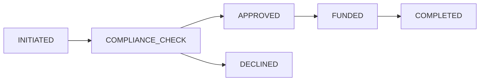

# BRD Creation Rules

**Version**: 1.1
**Date**: 2025-11-19
**Last Updated**: 2025-11-19
**Source**: Extracted from BRD-TEMPLATE.md, BRD-VALIDATION_RULES.md, README.md, and BRD-000_index.md
**Purpose**: Complete reference for creating BRD files according to doc-flow SDD framework
**Changes**: Clarified Platform vs Feature BRD section requirements, standardized Document Control positioning

---

## Table of Contents

1. [File Organization and Directory Structure](#1-file-organization-and-directory-structure)
2. [Document Structure (17 Required Sections)](#2-document-structure-17-required-sections)
3. [Document Control Requirements](#3-document-control-requirements)
4. [ID and Naming Standards](#4-id-and-naming-standards)
5. [Business Requirements Principles](#5-business-requirements-principles)
6. [Platform vs Feature BRD Distinctions](#6-platform-vs-feature-brd-distinctions)
7. [ADR Relationship Guidelines](#7-adr-relationship-guidelines)
8. [Traceability Requirements](#8-traceability-requirements)
9. [Architecture Decision Requirements](#9-architecture-decision-requirements)
10. [Business Objectives and Success Criteria](#10-business-objectives-and-success-criteria)
11. [Quality Gates](#11-quality-gates)
12. [Additional Requirements](#12-additional-requirements)

---

## 1. File Organization and Directory Structure

- **Location**: `docs/BRD/` within project docs directory
- **Platform BRDs**: `BRD-NNN_platform_*` or `BRD-NNN_infrastructure_*` (e.g., `BRD-001_platform_architecture_technology_stack.md`)
- **Feature BRDs**: `BRD-NNN_{feature_name}` (e.g., `BRD-006_b2c_progressive_kyc_onboarding.md`)
- **Naming**: `BRD-NNN_descriptive_title.md` (NNN = 3-digit sequential number, snake_case slug)
- **Subdocuments**: For complex business requirements: `BRD-NNN-YY_additional_detail.md` (YY = 2-digit sub-number)

---

## 2. Document Structure (17 Required Numbered Sections)

**Document Control Section**: Located at the very beginning (before all numbered sections)

Every BRD must contain these exact numbered sections in order:

1. **Introduction** - Purpose, scope, audience, conventions, references
2. **Business Objectives** - Background/context, business problem, goals, objectives, strategic alignment, expected benefits
3. **Project Scope** - Scope statement, in-scope/out-of-scope items, future considerations, business process scope
4. **Functional Requirements** - Overview, requirements by category, business rules, user roles/permissions
5. **Non-Functional Requirements** - Overview, performance, security, availability, scalability, usability, compatibility, compliance
6. **Assumptions and Constraints** - Assumptions with validation methods, budget/schedule/resource/technical constraints, dependencies
7. **Acceptance Criteria** - Business acceptance, functional acceptance, success metrics/KPIs, UAT criteria, go-live readiness
8. **Risk Management** - Risk register with assessment, risk categories, monitoring/review
9. **Implementation Approach** - Strategy, phases, rollout plan, data migration plan, integration plan
10. **Training and Change Management** - Training strategy/plan/materials, change management strategy/communication/impact assessment
11. **Support and Maintenance** - Support model/services/SLAs, maintenance plan
12. **Cost-Benefit Analysis** - One-time/recurring costs, quantifiable/qualitative benefits, ROI, payback NPV
13. **Project Governance** - Governance structure, decision-making authority, status reporting, change control
14. **Quality Assurance** - Quality standards, testing strategy, defect management
15. **Glossary** - Business and domain-specific terms
16. **Appendices** - References, supporting documentation, process flow diagrams, data requirements, UI mockups, integration specifications, stakeholder interview notes


## 3. Document Control Requirements

**Position**: Must be the first section at the very top of the BRD (before all numbered sections)

**Required Fields** (6 mandatory):
- Project Name: [Enter project name]
- Document Version: [e.g., 1.0] (semantic versioning X.Y)
- Date: [Current date in YYYY-MM-DD format]
- Document Owner: [Name and title of responsible business executive]
- Prepared By: [Business Analyst name who authored document]
- Status: [Draft / In Review / Approved]

**Also Required**: Document Revision History table with at least one initial entry

**Template**:
```markdown
| Item | Details |
|------|---------|
| **Project Name** | [Enter project name] |
| **Document Version** | [e.g., 1.0] |
| **Date** | [Current date] |
| **Document Owner** | [Name and title] |
| **Prepared By** | [Business Analyst name] |
| **Status** | [Draft / In Review / Approved] |

### Document Revision History

| Version | Date | Author | Changes Made | Approver |
|---------|------|--------|--------------|----------|
| 1.0 | [Date] | [Name] | Initial draft | |
| | | | | |
```

### 3.5 Version Control for Major Refactoring

**Purpose**: Define version control practices when performing major structural changes to BRD content, particularly when refactoring Functional Requirements from PRD-level to business-level format.

**When to Increment Major Version**:
- **Major Version Change (X.0)**: Structural changes to Functional Requirements format
  - Converting tabular FR format → 4-subsection FR structure (Business Capability, Business Requirements, Business Rules, Business Acceptance Criteria)
  - Removing PRD-level technical content (API specs, code blocks, UI flows) from FRs
  - Reclassifying content between BRD and PRD based on business vs technical boundaries
  - Adding new required subsections to existing FRs (e.g., Complexity ratings)
  - Significant changes affecting PRD-Ready Score (>20 point improvement)

- **Minor Version Change (X.Y)**: Content additions/updates without structural changes
  - Adding new Functional Requirements in existing format
  - Clarifying business requirements language
  - Updating business acceptance criteria values
  - Adding cross-references to new Platform BRDs
  - Fixing typos or minor editorial changes

**Revision History Entry Format for Major Refactoring**:

When performing major FR structure refactoring, use this template in Document Revision History:

```markdown
| Version | Date | Author | Changes Made | Approver |
|---------|------|--------|--------------|----------|
| 2.0 | 2024-11-24 | [BA Name] | **Major Refactoring**: Converted all FRs from tabular format to 4-subsection business-level structure; removed PRD-level content (API specs, JSON schemas, code blocks); added Complexity ratings; improved PRD-Ready Score from 65/100 to 95/100. See refactoring summary in CHANGELOG.md. | [Approver] |
```

**Required Elements**:
1. **"Major Refactoring"** label in bold
2. **Structural changes description**: What format changed (tabular → 4-subsection)
3. **Content removal summary**: What PRD-level content was removed (API specs, code blocks, etc.)
4. **New additions**: What was added (Complexity ratings, Related Requirements)
5. **PRD-Ready Score improvement**: Before/after scores (65/100 → 95/100)
6. **Reference to detailed changelog**: Link to CHANGELOG.md or refactoring work plan

**Before/After State Documentation Requirements**:

When performing major refactoring (version X.0), document the transformation:

1. **Create Backup**: Save original BRD version with `.backup` suffix before refactoring
   - Example: `BRD-009_remittance_transaction_us_to_uzbekistan.md.backup_v1.0`

2. **Document in CHANGELOG.md** (or work plan):
   ```markdown
   ## BRD-009 v2.0 Major Refactoring (2024-11-24)

   **PRD-Ready Score Improvement**: 65/100 → 95/100

   **Structural Changes**:
   - Converted 12 FRs from tabular format to 4-subsection business-level structure
   - Removed 15 code blocks (JSON schemas, Python pseudocode)
   - Removed 8 API endpoint specifications (deferred to PRD-009)
   - Removed 6 UI modal/screen descriptions (deferred to PRD-009)

   **Content Additions**:
   - Added Complexity ratings (1/5 to 5/5) to all 12 FRs with business-level rationale
   - Added Related Requirements cross-references to Platform BRDs (BRD-001 through BRD-005)
   - Added Business Rules subsections with regulatory constraints (OFAC, FinCEN)

   **Validation**:
   - All FRs now have 6 required subsections (Business Capability, Business Requirements, Business Rules, Business Acceptance Criteria, Related Requirements, Complexity)
   - Zero code blocks remaining in FR sections
   - Zero technical API/database terminology in FR descriptions
   - PRD-Ready Score: 95/100 (Target: ≥90/100) ✅
   ```

3. **Example Before/After FR Transformation**:

   **BEFORE (v1.0 - PRD-Level, Score 65/100)**:
   ```markdown
   ### FR-005: Transaction Initiation API

   | Field | Requirement |
   |-------|-------------|
   | Endpoint | POST /api/v1/transactions |
   | Request Body | JSON with amount, recipient_id, funding_source |
   | Response | 201 Created with transaction_id |
   | Validation | Amount >$1, recipient exists in database |
   ```

   **AFTER (v2.0 - Business-Level, Score 95/100)**:
   ```markdown
   #### FR-005: Customer-Initiated Cross-Border Transaction

   **Business Capability**: Enable customers to initiate remittance transactions to Uzbekistan recipients with selected funding source

   **Business Requirements**:
   - Customer selects amount ($1 minimum), recipient, and funding source (ACH/card/wallet)
   - System validates customer identity (KYC status), transaction limits (daily/monthly), recipient status (active)
   - Customer receives immediate transaction confirmation with estimated delivery time

   **Business Rules**:
   - Minimum transaction: $1.00 USD
   - Maximum transaction: $10,000 per transaction, $50,000 per rolling 30 days (FinCEN MSB limits)
   - Customer must have completed KYC (BRD-006 B2C onboarding)
   - Recipient must be pre-validated (BRD-011 recipient management)

   **Business Acceptance Criteria**:
   - 95% of valid transactions complete initiation in <5 seconds
   - Customer receives transaction receipt with tracking ID immediately upon completion
   - Invalid transactions rejected with clear business reason (insufficient balance, limits exceeded, recipient inactive)

   **Related Requirements**:
   - Platform BRDs: BRD-001 (Architecture), BRD-002 (Partner Ecosystem), BRD-003 (Compliance)
   - Feature BRDs: BRD-006 (KYC Onboarding), BRD-008 (Wallet Funding), BRD-011 (Recipient Management)

   **Complexity**: 3/5 (Three partner integrations (Bridge custody, Plaid/Stripe funding, Sardine compliance); FinCEN transaction monitoring requirements; references BRD-001, BRD-002, BRD-003, BRD-006, BRD-008, BRD-011)
   ```

**Refactoring Workflow Summary**:
1. Assess current PRD-Ready Score (should be <90/100 to justify refactoring)
2. Create backup of current version (`.backup_vX.Y` suffix)
3. Increment to next major version (1.0 → 2.0)
4. Transform FRs using 4-subsection structure (see BRD-TEMPLATE.md Section 5.2)
5. Remove PRD-level content per Appendix B exclusion rules
6. Add Complexity ratings and Related Requirements
7. Document changes in Revision History with "Major Refactoring" label
8. Create detailed CHANGELOG.md entry with before/after comparison
9. Validate new PRD-Ready Score (target ≥90/100)
10. Submit for review/approval

**Reference**: See BRD-009 v2.0 refactoring as gold standard example (65/100 → 100/100 improvement).

---

## 4. ID and Naming Standards

- **Filename**: `BRD-NNN_descriptive_title.md` (e.g., `BRD-001_platform_architecture_technology_stack.md`)
- **H1 Header**: `# Business Requirements Document (BRD)` (static for all BRDs)
- **Document Title**: Include in H1 as subtitle (e.g., "Business Requirements Document (BRD)" with project name in Introduction)
- **ID Format**: BRD-NNN (3-digit sequential), BRD-NNN-YY for multi-part documents
- **Uniqueness Rule**: Each NNN number unique across Platform and Feature BRDs

---

## 5. Business Requirements Principles

- **Business-First Focus**: Business needs drive requirements, not technical solutions
- **Measurable Objectives**: All business objectives follow SMART criteria (Specific, Measurable, Achievable, Relevant, Time-bound)
- **Strategic Alignment**: Requirements trace back to organizational strategy documents
- **Stakeholder Validation**: Acceptance criteria verifiable by business stakeholders without technical knowledge
- **BDD-Ready**: Business requirements formulated for executable behavior-driven development

### 5.5 Complexity Rating Methodology

**Purpose**: Provide consistent complexity assessment for Functional Requirements based on business-level factors. Complexity ratings inform PRD development effort and implementation planning.

**Rating Scale**: 1/5 (minimal complexity) to 5/5 (maximum complexity)

**Business Factors for Complexity Assessment**:
1. **Partner Integration Count**: Number of third-party partners/APIs involved
2. **Regulatory Scope**: Compliance requirements (KYC/KYB, AML, licensing, cross-border)
3. **Business Constraints**: SLAs, settlement timing, refund policies, customer service commitments
4. **Cross-BRD Dependencies**: Number of Platform/Feature BRDs referenced
5. **Business Process Complexity**: State transitions, decision branches, exception handling paths

---

#### Complexity Level 1/5: Single-Partner, Minimal Constraints

**Characteristics**:
- Single partner integration OR internal-only capability
- No regulatory compliance requirements
- Simple business rules (<3 decision points)
- Minimal cross-BRD dependencies (≤1 Platform BRD reference)
- Single business process state

**Example - Recipient Selection (BRD-011)**:
```markdown
**Complexity**: 1/5 (Simple recipient selection from existing saved list; no partner integration required; single-state operation)
```

**Business Factors**:
- Partners: 0 (internal database query only)
- Regulatory: None
- Constraints: Basic validation only
- Dependencies: BRD-004 (Data Model)
- Process: Single-state lookup

---

#### Complexity Level 2/5: Multiple Partners, Straightforward Integration

**Characteristics**:
- 2-3 partner integrations
- Light regulatory requirements (e.g., basic KYC verification)
- Moderate business rules (3-5 decision points)
- 2-3 Platform BRD dependencies
- Sequential 2-3 state process

**Example - Email Notification Delivery (BRD-018)**:
```markdown
**Complexity**: 2/5 (Two notification partners (SendGrid, Twilio); basic template management; standard retry policies; references BRD-002 partner ecosystem)
```

**Business Factors**:
- Partners: 2 (SendGrid, Twilio)
- Regulatory: None
- Constraints: 95% delivery SLA within 60 seconds
- Dependencies: BRD-002 (Partner Ecosystem)
- Process: 2-state (Queued → Delivered)

---

#### Complexity Level 3/5: AI/ML Integration, Moderate Regulatory Requirements

**Characteristics**:
- 3-4 partner integrations
- Moderate regulatory requirements (AML screening, transaction monitoring)
- Complex business rules (5-10 decision points)
- 3-4 Platform BRD dependencies
- Multi-state process with conditional branching

**Example - AI-Powered Risk Scoring (BRD-022)**:
```markdown
**Complexity**: 3/5 (ML-based fraud detection with Sardine + Unit21 integration; AML compliance requirements; multi-tier risk thresholds; references BRD-003, BRD-005, BRD-016)
```

**Business Factors**:
- Partners: 3 (Sardine risk API, Unit21 case management, internal ML model)
- Regulatory: AML/CFT transaction monitoring requirements
- Constraints: <3 second screening SLA for 95% of transactions
- Dependencies: BRD-003 (Compliance), BRD-005 (AI/ML Architecture), BRD-016 (Fraud Detection)
- Process: 3-state with branching (Auto-Approve, Manual Review, Auto-Decline)

---

#### Complexity Level 4/5: Multi-Region, High Regulatory Burden

**Characteristics**:
- 4-6 partner integrations
- High regulatory requirements (cross-border compliance, multiple jurisdictions)
- Complex business rules (10-15 decision points)
- 4-6 Platform/Feature BRD dependencies
- Complex state machine with exception handling

**Example - Multi-Region Wallet Funding (BRD-008)**:
```markdown
**Complexity**: 4/5 (Five funding partners (Plaid, Stripe, Bridge, PayPal, Unit); FinCEN compliance; multi-currency settlement; references BRD-001, BRD-002, BRD-003, BRD-004, BRD-013)
```

**Business Factors**:
- Partners: 5 (Plaid ACH, Stripe card processing, Bridge USDC custody, PayPal wallet, Unit banking)
- Regulatory: FinCEN compliance, card network rules, ACH regulations, MSB licensing
- Constraints: T+1 settlement SLA, 95% success rate, refund processing <1 hour
- Dependencies: BRD-001 (Architecture), BRD-002 (Partners), BRD-003 (Compliance), BRD-004 (Ledger), BRD-013 (Settlement)
- Process: Multi-state with error recovery (Initiated → Authorized → Captured → Settled → Reconciled)

---

#### Complexity Level 5/5: Cross-Border, Maximum Regulatory and Partner Complexity

**Characteristics**:
- 6+ partner integrations across multiple countries/regions
- Maximum regulatory requirements (international remittance, OFAC, sanctions, cross-border reporting)
- Highly complex business rules (>15 decision points)
- 6+ Platform/Feature BRD dependencies
- Complex state machine with multiple exception paths and rollback scenarios

**Example - US-to-Uzbekistan Remittance (BRD-009)**:
```markdown
**Complexity**: 5/5 (Seven partners across two countries; OFAC/sanctions screening; cross-border FX; Uzbekistan bill payment integration; references BRD-001, BRD-002, BRD-003, BRD-004, BRD-005, BRD-008, BRD-010, BRD-013)
```

**Business Factors**:
- Partners: 7+ (Bridge custody, Plaid/Stripe funding, Sardine/Unit21 compliance, Uzbekistan delivery partners, Paynet bill payment)
- Regulatory: FinCEN MSB licensing, OFAC sanctions screening, Uzbekistan Central Bank compliance, cross-border reporting
- Constraints: 95% delivery in <15 minutes, T+1 settlement, multi-currency reconciliation, refund SLAs
- Dependencies: 8 BRDs (BRD-001 through BRD-005, BRD-008, BRD-010, BRD-013)
- Process: 7-state transaction lifecycle with exception handling (Initiated → Screened → Funded → FX Converted → Delivered → Settled → Reconciled)

---

#### Rationale Format Requirements

**Required Elements**:
- Number of partners involved (with partner names or categories)
- Regulatory scope (specific regulations: FinCEN, OFAC, card networks, etc.)
- Key business constraints (SLAs, settlement timing, refund policies)
- Cross-BRD dependencies (list specific BRD references)

**Correct Format Example**:
```markdown
**Complexity**: 4/5 (Five funding partners (Plaid, Stripe, Bridge, PayPal, Unit); FinCEN compliance; multi-currency settlement; references BRD-001, BRD-002, BRD-003, BRD-004, BRD-013)
```

**Incorrect Format Examples**:
- ❌ "4/5 (Complex integration)" - missing specific partner count and regulatory details
- ❌ "4/5 (Multiple APIs and compliance rules)" - too vague, no specific references
- ❌ "4/5 (Requires significant development effort)" - technical rationale, not business-level

**Reference Examples**: See BRD-TEMPLATE.md Appendix C for complete FR examples at each complexity level.

---

## 6. Platform vs Feature BRD Distinctions

### Platform BRDs (e.g., BRD-001, BRD-034)
- **Purpose**: Define foundational capabilities, technology stacks, prerequisites
- **Sections 3.6 & 3.7**: ALWAYS PRESENT - Define foundational technology stacks and mandatory constraints
- **ADR Timing**: ADRs created BEFORE PRD to validate architectural decisions
- **Technology Focus**: Infrastructure, security, compliance foundations
- **Interdependencies**: Establish foundation for Feature BRDs

### Feature BRDs (e.g., BRD-006, BRD-009)
- **Purpose**: Define business features and user workflows
- **Sections 3.6 & 3.7**: ALWAYS PRESENT - Reference Platform BRD dependencies and feature-specific conditions
- **ADR Timing**: Standard workflow (BRD → PRD → SYS → EARS → REQ → ADR)
- **Business Focus**: User problems, business processes, acceptance criteria
- **Dependencies**: Reference Platform BRDs for technology foundations

### 6.5 Edge Case Handling: Business vs Technical Content

**Purpose**: Guidance for handling edge cases where content could be interpreted as either business-level (BRD-appropriate) or technical-level (PRD-appropriate). See also: BRD-TEMPLATE.md Appendix B for complete REMOVE/KEEP rules.

---

#### Edge Case 1: Technology Prescriptions

**Rule**: Convert technology vendor names to business capability descriptions with Platform BRD references.

**Examples**:

❌ **REMOVE (PRD-Level)**: "Platform MUST use Bridge custody provider for USDC wallet operations"

✅ **KEEP (Business-Level)**: "Platform requires segregated USDC custody with MTL sponsorship (BRD-002 partner selection)"

**Additional Examples**:
- ❌ "MUST use PostgreSQL" → ✅ "Platform requires scalable relational data storage with ACID compliance (BRD-001 technology stack)"
- ❌ "MUST use Auth0" → ✅ "Platform requires OAuth 2.0/OIDC authentication with MFA support (BRD-003 authentication)"
- ❌ "MUST use Kafka" → ✅ "Platform requires async event streaming for partner integrations (BRD-001 messaging)"

**When to Reference Platform BRDs**:
- BRD-001: Platform architecture and technology stack
- BRD-002: Partner ecosystem and integration requirements
- BRD-003: Security, compliance, and authentication requirements
- BRD-004: Data model and ledger architecture
- BRD-005: AI/ML agent system architecture

---

#### Edge Case 2: Quantitative Thresholds - Customer SLA vs Technical Metrics

**Rule**: Keep customer-facing SLAs and business outcomes; remove technical performance metrics (defer to PRD/SPEC).

**Customer-Facing SLAs (KEEP)**:
- ✅ "95% of transactions complete in <15 minutes" (customer experience requirement)
- ✅ "Email delivery: ≥95% within 60 seconds" (customer notification SLA)
- ✅ "Screening completion: ≤3 seconds for 95% of transactions" (regulatory compliance timing)
- ✅ "Refund processing: <1 hour from delivery failure (95% of cases)" (customer service SLA)

**Technical Metrics (REMOVE - Defer to PRD)**:
- ❌ "API latency <200ms (95th percentile)"
- ❌ "Database query time <50ms"
- ❌ "WebSocket connection establishment <500ms"
- ❌ "Cache hit rate ≥90%"

**Decision Criteria**:
- **KEEP**: Metric affects customer experience, regulatory compliance, or business operations
- **REMOVE**: Metric measures internal technical performance not visible to customers

---

#### Edge Case 3: State Machines and Business Processes

**Rule**: Document business process state NAMES and flow; remove technical state management implementation.

**Business State Names (KEEP)**:
- ✅ Transaction states: INITIATED, FUNDED, COMPLETED, FAILED
- ✅ Compliance review states: APPROVED, MANUAL_REVIEW, DECLINED
- ✅ Business process flow: Initiation → Compliance → Funding → Delivery
- ✅ Refund states: PROCESSING, COMPLETED

**State Management Implementation (REMOVE)**:
- ❌ Event handlers: "on wallet_debited event, transition to FUNDED"
- ❌ State machine coordination logic
- ❌ Technical state transitions with database updates: "StateMachine.transition(from: INITIATED, to: FUNDED)"
- ❌ State persistence mechanisms: "Update transaction_state column in PostgreSQL"

**Proper Format**:
```markdown
**Transaction States**: Transaction progresses through INITIATED → FUNDED → COMPLETED states

vs.

❌ **Technical Implementation**:
StateMachine.transition(from: INITIATED, to: FUNDED, on: wallet_debited event, with: update_database)
```

---

#### Edge Case 4: Code Blocks in BRDs

**Rule**: Remove ALL code blocks from BRDs without exception.

**Code Blocks (REMOVE)**:
- ❌ Python functions and pseudocode
- ❌ JSON schema examples
- ❌ SQL queries
- ❌ Algorithm implementations
- ❌ Feature engineering functions for ML models

**Business-Level Alternatives (KEEP)**:
- ✅ "High-value transactions (>$1,000) receive additional risk scoring weight"
- ✅ "First-time recipients flagged for enhanced review"
- ✅ "Risk scoring algorithm documented in PRD-022 Fraud Detection implementation"

**Exception**: High-level business process diagrams using Mermaid flowcharts showing business states only (NOT technical implementation).

**Acceptable Mermaid Diagram**:


**Unacceptable Technical Diagram**:
```mermaid
graph LR
    A[POST /api/transactions] --> B[validate_schema()]
    B --> C[db.beginTransaction()]
    C --> D[wallet.debit()]
    D --> E[db.commit()]
```

---

#### Edge Case 5: Business Economics Tables

**Rule**: Keep fee structure tables showing pricing tiers and competitive positioning; remove calculation algorithms (defer to PRD).

**Fee Structure (KEEP)**:
```markdown
| Transaction Amount | Service Fee | Competitive Benchmark |
|-------------------|-------------|----------------------|
| $10-$100 | $3.00 flat | vs Western Union 3-5% |
| $101-$500 | $3.00 flat | vs Western Union 3-5% |
| $501-$2,000 | $5.00 flat | vs Western Union 3-5% |
```

**Calculation Algorithms (REMOVE)**:
```javascript
❌ fee = Math.max(MIN_FEE, amount * tier_rate)
if (amount >= 501 && amount <= 2000) {
  fee = 5.00
}
```

**Proper Business-Level Format**:
- ✅ Fee tables with tiers, amounts, and competitive benchmarks
- ✅ Business rationale: "Tiered pricing provides 40% cost advantage vs Western Union for amounts >$200"
- ✅ Fee transparency requirement: "Fee disclosure mandatory before customer authorization"

---

#### Edge Case 6: ML Model Specifications (AI Agent BRDs)

**Rule**: Extract business risk policies, scoring thresholds, and operational outcomes; move ML model architecture to PRD/SPEC.

**PRD-Level Content (REMOVE)**:
- ❌ Feature extraction code: `features = ['transaction_amount', 'device_risk_score', 'velocity_24h']`
- ❌ Model hyperparameters: `XGBoost(max_depth=5, learning_rate=0.1, n_estimators=100)`
- ❌ Training pipeline specifications
- ❌ Model deployment architecture

**Business-Level Content (KEEP)**:

**Business Capability**:
✅ "System must assess transaction fraud risk using ML-based scoring model"

**Business Requirements**:
- ✅ Analyze transaction characteristics (amount, frequency, recipient patterns)
- ✅ Assign risk score 0-100 based on multiple fraud indicators
- ✅ Support automated decision-making for low-risk transactions
- ✅ Provide manual review queue for medium-risk transactions

**Business Rules (Risk Thresholds)**:
- ✅ Risk score 0-59: Auto-approve transaction
- ✅ Risk score 60-79: Queue for manual compliance review (target <5% of volume)
- ✅ Risk score 80-100: Auto-decline with SAR consideration

**Business Acceptance Criteria**:
- ✅ True positive rate ≥95% (catch actual fraud)
- ✅ False positive rate ≤3% (minimize blocking legitimate users)
- ✅ Model inference latency <200ms for real-time screening (customer experience requirement)
- ✅ Model retraining: Weekly with new fraud patterns (operational requirement)

**Cross-Reference**: "ML model architecture and feature engineering documented in PRD-022 Fraud Detection Agent"

---

## 7. ADR Relationship Guidelines

**CRITICAL DISTINCTION**: BRDs are created BEFORE ADRs in SDD workflow

❌ **NEVER** reference specific ADR numbers (ADR-012, ADR-033) in BRD documents

✅ **DO** include "Architecture Decision Requirements" section identifying topics for architectural decisions

**Workflow Order**:
1. BRD identifies architecture topics needing decisions
2. ADRs document which option was chosen and WHY
3. This separation maintains workflow integrity and prevents forward references

**Section 6.1: Architecture Decision Requirements**
```markdown
| Topic Area | Decision Needed | Business Driver | Key Considerations |
|------------|-----------------|---------------|-------------------|
| Database Selection | Choose data storage technology | NFR: Data persistence requirements | SAS 70 Type II compliance, horizontal scaling |
```

---

## 8. Traceability Requirements (MANDATORY - Layer 1)

- **Upstream Sources**: Link to business strategy documents (`option_strategy/` sections)
- **Downstream Artifacts**: Map to PRD, SYS, EARS, BDD, REQ sequences
- **Strategy References**: Include specific sections from integrated_strategy_algo_v5.md, etc.
- **Business Rationale**: Each requirement includes business justification
- **Acceptance Criteria**: Verifiable by business stakeholders

**Required Traceability Fields**:
- **Upstream Sources**: Business strategy documents
- **Downstream Artifacts**: PRD, EARS, BDD, REQ
- **Anchors/IDs**: `BO-XXX`, `FR-XXX`, `NFR-XXX` for each requirement
- **Code Path(s)**: Strategic impact area

---

## 9. Architecture Decision Requirements

Every BRD must include Section 6.1: "Architecture Decision Requirements"

| Field | Description | Example |
|-------|-------------|---------|
| **Topic Area** | Technology or architecture domain | "Multi-Agent Framework", "Data Storage", "Authentication Protocol" |
| **Decision Needed** | What architectural choice is required | "Select orchestration mechanism for agent coordination" |
| **Business Driver** | Which BRD requirement necessitates this | "BO-003: Autonomous trading execution" |
| **Key Considerations** | Technologies/patterns to evaluate | "Google ADK, n8n workflow engine, custom orchestration" |

**Purpose**: Identifies architectural topics requiring formal evaluation BEFORE PRD creation (for critical decisions) or standard workflow timing (for feature decisions)

---

## 10. Business Objectives and Success Criteria

### SMART Objectives Format
All business objectives in Section 2.4 must follow SMART criteria:

| Component | Description | Example |
|-----------|-------------|---------|
| **Specific** | Clear, explicit goal | "Reduce transaction processing time by 50%" |
| **Measurable** | Quantifiable metrics | "from 10 seconds to 5 seconds" |
| **Achievable** | Realistic within constraints | "based on current 95th percentile performance" |
| **Relevant** | Aligns with business strategy | "matches performance targets in integrated_strategy_algo_v5.md" |
| **Time-bound** | Specific deadline | "within 6 months of implementation" |

### Success Criteria Requirements
- **Quantifiable**: Include specific targets and metrics
- **Business-Focused**: Verifiable without technical expertise
- **Multi-Level**: Organization, department, individual stakeholder metrics
- **Baseline Included**: Current state measurement for comparison

---

## 11. Quality Gates (Pre-Commit Validation)

- **12 Validation Checks**: Run `./scripts/validate_brd_template.sh filename.md`
- **Blockers**: Missing sections, invalid formats, broken traceability
- **Warnings**: Missing references, incomplete criteria, unverified assumptions
- **Platform Feature Validation**: Different requirements for Platform vs Feature BRDs
- **Link Resolution**: All traceability links must resolve to existing files

---

## 12. Additional Requirements

- **Business Language**: Use business terminology over technical jargon
- **Financial Quantification**: Include ROI calculations, cost-benefit analysis
- **Stakeholder Engagement**: Define roles, responsibilities, communication plans
- **Risk Management**: Comprehensive risk register with mitigation strategies
- **Compliance Validation**: Include regulatory requirements and audit considerations

---

## Quick Reference

**Pre-Commit Validation**:
```bash
# Validate single file
./scripts/validate_brd_template.sh docs/BRD/BRD-001_platform_architecture.md

# Validate all BRD files
find docs/BRD -name "BRD-*.md" -exec ./scripts/validate_brd_template.sh {} \;
```

**Template Location**: [BRD-TEMPLATE.md](BRD-TEMPLATE.md)
**Validation Rules**: [BRD-VALIDATION-RULES.md](BRD-VALIDATION-RULES.md)
**Index**: [BRD-000_index.md](BRD-000_index.md)

---

**Framework Compliance**: 100% doc_flow SDD framework aligned (Layer 1 - Business Requirements)
**Maintained By**: Business Analyst Team, SDD Framework Team
**Review Frequency**: Updated with template and validation rule enhancements

---

# task_progress List (Optional - Plan Mode)

While in PLAN MODE, if you've outlined concrete steps or requirements for the user, you may include a preliminary todo list using the task_progress parameter.

Reminder on how to use the task_progress parameter:


1. To create or update a todo list, include the task_progress parameter in the next tool call
2. Review each item and update its status:
   - Mark completed items with: - [x]
   - Keep incomplete items as: - [ ]
   - Add new items if you discover additional steps
3. Modify the list as needed:
		- Add any new steps you've discovered
		 - Reorder if the sequence has changed
4. Ensure the list accurately reflects the current state

**Remember:** Keeping the task_progress list updated helps track progress and ensures nothing is missed.
