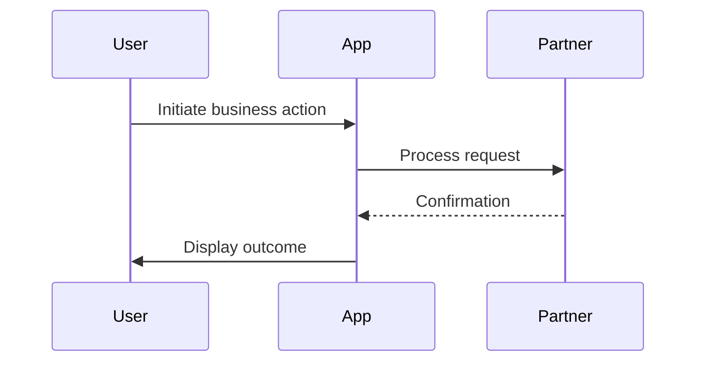
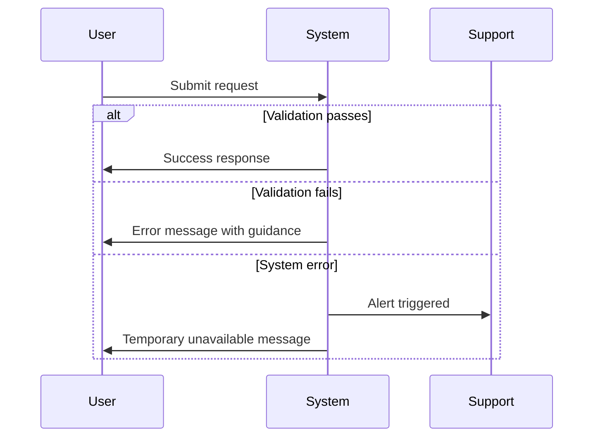

# =============================================================================
# 📋 Document Role: This is a DERIVATIVE of BRD-TEMPLATE.md
# - Authority: BRD-TEMPLATE.md is the single source of truth for BRD structure
# - Purpose: AI guidance for document creation (derived from template)
# - On conflict: Defer to BRD-TEMPLATE.md
# =============================================================================
---
title: "BRD Creation Rules"
tags:
  - creation-rules
  - layer-1-artifact
  - shared-architecture
custom_fields:
  document_type: creation-rules
  artifact_type: BRD
  layer: 1
  priority: shared
  development_status: active
---

> **📋 Document Role**: This is a **CREATION HELPER** for BRD-TEMPLATE.md.
> - **Authority**: `BRD-TEMPLATE.md` is the single source of truth for BRD structure
> - **Validation**: Use `BRD_VALIDATION_RULES.md` after BRD creation/changes

# BRD Creation Rules

**Version**: 1.2
**Date**: 2025-11-19
**Last Updated**: 2025-12-10
**Source**: Extracted from BRD-TEMPLATE.md, BRD-VALIDATION_RULES.md, README.md, and BRD-000_index.md
**Purpose**: Complete reference for creating BRD files according to doc-flow SDD framework
**Changes**: Added schema flexibility design decision documentation; clarified Platform vs Feature BRD section requirements

---

## Design Decision: No BRD_SCHEMA.yaml

> **Intentional Design Choice**: BRD artifacts do NOT have a schema file (`BRD_SCHEMA.yaml`).
>
> **Rationale**:
> - **Business Flexibility**: Layer 1 artifacts capture diverse business needs across domains (financial, healthcare, SaaS, IoT) - rigid schema validation would constrain legitimate business expression
> - **Domain Variability**: Business requirements vary significantly by industry, organization size, and project type - a fixed schema cannot accommodate this diversity
> - **Human-Centric Validation**: Business requirements require human judgment for quality assessment rather than automated schema validation
> - **Sufficient Guidance**: This document (`BRD_CREATION_RULES.md`) and `BRD_VALIDATION_RULES.md` provide comprehensive guidance without rigid constraints
>
> **Validation Approach**: Use `scripts/validate_brd_template.sh` for structural validation while allowing content flexibility.
>
> **Comparison with Other Layers**:
> | Layer | Artifact | Schema File | Rationale |
> |-------|----------|-------------|-----------|
> | Layer 1 | BRD | None | Business flexibility, human-centric validation |
> | Layer 2 | PRD | PRD_SCHEMA.yaml | Product specifications benefit from consistent structure |
> | Layer 3+ | EARS, REQ, etc. | *_SCHEMA.yaml | Technical artifacts require strict validation |

---

## Table of Contents

1. [File Organization and Directory Structure](#1-file-organization-and-directory-structure)
2. [Document Structure (17 Required sections)](#2-document-structure-17-required-sections)
3. [Document Control Requirements](#3-document-control-requirements)
4. [ID and Naming Standards](#4-id-and-naming-standards)
5. [Business Requirements Principles](#5-business-requirements-principles)
6. [Platform vs Feature BRD Distinctions](#6-platform-vs-feature-brd-distinctions)
7. [ADR Relationship Guidelines](#7-adr-relationship-guidelines)
8. [Traceability Requirements](#8-traceability-requirements)
9. [Architecture Decision Requirements](#9-architecture-decision-requirements)
10. [Business Objectives and Success Criteria](#10-business-objectives-and-success-criteria)
11. [Quality Gates](#11-quality-gates)
12. [Additional Requirements](#12-additional-requirements)

---

## 1. File Organization and Directory Structure

- **Location**: `docs/BRD/BRD-NNN/` within project docs directory (nested folder per document)
- **Folder Structure** (DEFAULT): `docs/BRD/BRD-NNN/BRD-NNN.S_slug.md`
  - Index file: `docs/BRD/BRD-NNN/BRD-NNN.0_index.md`
  - Section files: `docs/BRD/BRD-NNN/BRD-NNN.1_executive_summary.md`, etc.
- **Platform BRDs**: `BRD-NNN_platform_*` or `BRD-NNN_infrastructure_*` (e.g., `docs/BRD/BRD-001/BRD-001.0_index.md`)
- **Feature BRDs**: `BRD-NNN_{feature_name}` (e.g., `docs/BRD/BRD-006/BRD-006.0_index.md`)
- **Section Files**: Section-based structure is DEFAULT for all BRD documents. Use format: `BRD-NNN.S_section_title.md` (S = section number). See `ID_NAMING_STANDARDS.md` for metadata tags.
- **Monolithic** (OPTIONAL for <25KB): `docs/BRD/BRD-NNN_descriptive_title.md` (flat structure)

---

## 2. Document Structure (17 Required Numbered sections)

**Document Control section**: Located at the very beginning (before all numbered sections)

Every BRD must contain these exact 17 numbered sections in order:

1. **Introduction** - Purpose, scope, audience, conventions, references
2. **Business Objectives** - Background/context, business problem, goals, objectives, strategic alignment, expected benefits
3. **Project Scope** - Scope statement, in-scope/out-of-scope items, future considerations, business process scope
4. **Stakeholders** - Stakeholder analysis, roles and responsibilities, communication matrix
5. **User Stories** - Primary user stories, secondary user stories, edge cases and exceptions
6. **Functional Requirements** - Overview, requirements by category, business rules, user roles/permissions
7. **Quality Attributes** - Overview, performance, security, availability, scalability, usability, compatibility, compliance
8. **Business Constraints and Assumptions** - Assumptions with validation methods, budget/schedule/resource/technical constraints, dependencies
9. **Acceptance Criteria** - Business acceptance, functional acceptance, success metrics/KPIs, UAT criteria, go-live readiness
10. **Business Risk Management** - Risk register with assessment, risk categories, monitoring/review
11. **Implementation Approach** - Strategy, phases, rollout plan, data migration plan, integration plan
12. **Support and Maintenance** - Support model/services/SLAs, maintenance plan
13. **Cost-Benefit Analysis** - One-time/recurring costs, quantifiable/qualitative benefits, ROI, payback NPV
14. **Project Governance** - Governance structure, decision-making authority, status reporting, change control
15. **Traceability** - Requirements traceability matrix, cross-BRD dependencies, test coverage traceability, traceability summary
16. **Glossary** - Business terms, technical terms, domain-specific terms, acronyms, cross-references, external standards
17. **Appendices** - References, supporting documentation, process flow diagrams, data requirements, UI mockups, integration specifications, stakeholder interview notes

> **Note**: Technical QA (quality standards, testing strategy, defect management) moved to PRD-TEMPLATE.md Section 21.

**Important Updates (2025-11-26)**: Several sections have been simplified for better BRD/PRD layer separation:
- **section 4 (Stakeholders)**: Now high-level identification only. Detailed stakeholder analysis, communication plans, and team structure moved to PRD.
- **section 5 (User Stories)**: Now high-level summary only (3-5 key categories). Detailed user story tables, acceptance criteria, and role definitions moved to PRD.
- **section 6.4 (User Roles)**: Now high-level role identification only. Detailed permissions matrices and role responsibilities moved to PRD.
- **Appendix N (Customer Communication)**: Now business-level approval requirements only. Detailed messaging templates, error messages, and promotional content moved to PRD.

See section 5.6 below for detailed guidance on the simplified user stories approach.

### 2.2 Executive Summary Quantitative Pattern

**Purpose**: Provide quantitative structure for Executive Summary section that enables measurable business impact assessment.

**Required 3-Paragraph Structure**:

1. **Business Context** (Paragraph 1): Market opportunity with quantitative sizing
2. **Solution Overview** (Paragraph 2): Business capability with measurable outcomes
3. **Business Impact** (Paragraph 3): Expected benefits with specific metrics

**Quantitative Elements Required**:

| Paragraph | Required Quantitative Element | Example |
|-----------|------------------------------|---------|
| Business Context | Market size, volume, or gap | "$XX billion market", "X million potential customers", "Y% market gap" |
| Solution Overview | Capability scope with numbers | "X corridors", "Y transaction types", "Z user segments" |
| Business Impact | Measurable outcome targets | "X% cost reduction", "$Y revenue opportunity", "Z% efficiency gain" |

**Example Executive Summary** (from BRD-009):

> **Paragraph 1 (Business Context)**:
> The US-Uzbekistan remittance corridor represents a $2.1 billion annual market with approximately 350,000 Uzbek diaspora in the United States sending an average of $500 per month to family members. Current solutions charge 5-8% all-in fees with delivery times of 24-48 hours.
>
> **Paragraph 2 (Solution Overview)**:
> BeeLocal enables US-based customers to send money to Uzbekistan recipients within 15 minutes at an all-in cost of approximately 3.5% ($3.00 flat fee + 1.5% FX spread). The solution leverages Bridge custody for wallet funding, real-time FX conversion, and Paynet delivery network for instant recipient payouts.
>
> **Paragraph 3 (Business Impact)**:
> Initial launch targets 10,000 monthly active users within 6 months, representing $5M monthly transaction volume. At 3.5% effective margin, this generates $175K monthly gross revenue. Customer acquisition cost target is <$50, enabling payback within 3 transactions per customer.

**Anti-Patterns (Avoid)**:
- ❌ "BeeLocal will provide a fast and affordable way to send money" - No quantitative measures
- ❌ "The solution will significantly improve the customer experience" - Subjective, not measurable
- ❌ "We expect strong market adoption" - No specific targets

**Reference**: See BRD-TEMPLATE.md section 1 (Introduction) and section 3 (Business Objectives) for template structure.

### 2.3 Workflow Diagram Requirements (Template sections 3.5.4-3.5.5)

**Purpose**: Visualize business processes and exception handling using Mermaid diagrams. Workflow diagrams document the end-to-end business process from user and system perspectives.

**Location in Template**: section 3.5.4 (End-to-End Workflow Diagram) and section 3.5.5 (Error and Exception Handling Workflows) within Project Scope

#### section 3.5.4: End-to-End Workflow Diagram

**Required Components**:
1. **Mermaid Sequence Diagram**: Shows business-level interactions between participants
2. **Workflow Summary Table**: Documents each step with actor, action, system, business rule, and success criteria

**Diagram Guidelines**:
- Show all key participants (users, systems, partner names)
- Focus on business-level interactions, not technical implementation
- Highlight decision points and branching paths
- Include happy path and key exception paths

**Example Mermaid Structure**:


**Workflow Summary Table Format**:
| Step | Actor | Action | System | Business Rule | Success Criteria |
|------|-------|--------|--------|---------------|------------------|
| 1 | [Actor] | [Action description] | [System] | [Business rule applied] | [Success criteria] |

**Anti-Patterns**:
- ❌ Technical implementation details ("POST /api/endpoint", "SQL query")
- ❌ Infrastructure components ("Load Balancer", "Redis cache")
- ❌ Code-level operations ("validate JWT token", "serialize JSON")
- ✓ Business-level actions ("Submit transaction request", "Verify customer identity")

#### section 3.5.5: Error and Exception Handling Workflows

**Purpose**: Document how business processes handle errors, failures, and exception scenarios

**Required Components**:
1. **Exception Categories Table**: Lists trigger conditions, business responses, customer impact, and recovery paths
2. **Refund/Reversal Workflow** (if applicable for financial processes)
3. **Exception Handling Diagram**: Mermaid sequence diagram showing error paths

**Exception Categories Table Format**:
| Category | Trigger Condition | Business Response | Customer Impact | Recovery Path |
|----------|-------------------|-------------------|-----------------|---------------|
| Validation Failure | [When this occurs] | [How business responds] | [Impact to customer] | [How to recover] |
| Partner Error | [When this occurs] | [How business responds] | [Impact to customer] | [How to recover] |
| Timeout/Unavailable | [When this occurs] | [How business responds] | [Impact to customer] | [How to recover] |

**Example Exception Diagram**:


**Best Practices**:
- Document customer-facing error messages (business language, not technical errors)
- Specify SLAs for error resolution
- Define escalation paths for different error types
- Include retry policies and backoff strategies (business terms)

**Reference**: See BRD-TEMPLATE.md sections 3.5.4 and 3.5.5 for complete examples and table structures.

---

## 3. Document Control Requirements

**Position**: Must be the first section at the very top of the BRD (before all numbered sections)

**Required Fields** (7 mandatory):
- Project Name: [Enter project name]
- Document Version: [e.g., 1.0] (semantic versioning X.Y)
- Date: [Current date in YYYY-MM-DD format]
- Document Owner: [Name and title of responsible business executive]
- Prepared By: [Business Analyst name who authored document]
- Status: [Draft / In Review / Approved]
- PRD-Ready Score: [Score]/100 (Target: ≥90/100)

**Also Required**: Document Revision History table with at least one initial entry

**PRD-Ready Score**: Quantifies business-level content quality (100 = perfect business-level requirements, no technical details). Score calculated by deducting points for code blocks, API/technical terms, UI implementation details, and structural issues. Target: ≥90/100. See BRD_VALIDATION_RULES.md CHECK 13 for calculation algorithm.

**Template**:
```markdown
| Item | Details |
|------|---------|
| **Project Name** | [Enter project name] |
| **Document Version** | [e.g., 1.0] |
| **Date** | [Current date] |
| **Document Owner** | [Name and title] |
| **Prepared By** | [Business Analyst name] |
| **Status** | [Draft / In Review / Approved] |
| **PRD-Ready Score** | [Score]/100 (Target: ≥90/100) |

### Document Revision History

| Version | Date | Author | Changes Made | Approver |
|---------|------|--------|--------------|----------|
| 1.0 | [Date] | [Name] | Initial draft | |
| | | | | |
```

### 3.5 Version Control for Major Refactoring

**Purpose**: Define version control practices when performing major structural changes to BRD content, particularly when refactoring Functional Requirements from PRD-level to business-level format.

**When to Increment Major Version**:
- **Major Version Change (X.0)**: Structural changes to Functional Requirements format
  - Converting tabular FR format → 4-subsection FR structure (Business Capability, Business Requirements, Business Rules, Business Acceptance Criteria)
  - Removing PRD-level technical content (API specs, code blocks, UI flows) from FRs
  - Reclassifying content between BRD and PRD based on business vs technical boundaries
  - Adding new required subsections to existing FRs (e.g., Complexity ratings)
  - Significant changes affecting PRD-Ready Score (>20 point improvement)

- **Minor Version Change (X.Y)**: Content additions/updates without structural changes
  - Adding new Functional Requirements in existing format
  - Clarifying business requirements language
  - Updating business acceptance criteria values
  - Adding cross-references to new Platform BRDs
  - Fixing typos or minor editorial changes

**Revision History Entry Format for Major Refactoring**:

When performing major FR structure refactoring, use this template in Document Revision History:

```markdown
| Version | Date | Author | Changes Made | Approver |
|---------|------|--------|--------------|----------|
| 2.0 | 2024-11-24 | [BA Name] | **Major Refactoring**: Converted all FRs from tabular format to 4-subsection business-level structure; removed PRD-level content (API specs, JSON schemas, code blocks); added Complexity ratings; improved PRD-Ready Score from 65/100 to 95/100. See refactoring summary in CHANGELOG.md. | [Approver] |
```

**Required Elements**:
1. **"Major Refactoring"** label in bold
2. **Structural changes description**: What format changed (tabular → 4-subsection)
3. **Content removal summary**: What PRD-level content was removed (API specs, code blocks, etc.)
4. **New additions**: What was added (Complexity ratings, Related Requirements)
5. **PRD-Ready Score improvement**: Before/after scores (65/100 → 95/100)
6. **Reference to detailed changelog**: Link to CHANGELOG.md or refactoring work plan

**Before/After State Documentation Requirements**:

When performing major refactoring (version X.0), document the transformation:

1. **Create Backup**: Save original BRD version with `.backup` suffix before refactoring
   - Example: `BRD-009_remittance_transaction_us_to_uzbekistan.md.backup_v1.0`

2. **Document in CHANGELOG.md** (or work plan):
   ```markdown
   ## BRD-009 v2.0 Major Refactoring (2024-11-24)

   **PRD-Ready Score Improvement**: 65/100 → 95/100

   **Structural Changes**:
   - Converted 12 FRs from tabular format to 4-subsection business-level structure
   - Removed 15 code blocks (JSON schemas, Python pseudocode)
   - Removed 8 API endpoint specifications (deferred to PRD-009)
   - Removed 6 UI modal/screen descriptions (deferred to PRD-009)

   **Content Additions**:
   - Added Complexity ratings (1/5 to 5/5) to all 12 FRs with business-level rationale
   - Added Related Requirements cross-references to Platform BRDs (BRD-001 through BRD-005)
   - Added Business Rules subsections with regulatory constraints (OFAC, FinCEN)

   **Validation**:
   - All FRs now have 6 required subsections (Business Capability, Business Requirements, Business Rules, Business Acceptance Criteria, Related Requirements, Complexity)
   - Zero code blocks remaining in FR sections
   - Zero technical API/database terminology in FR descriptions
   - PRD-Ready Score: 95/100 (Target: ≥90/100) ✅
   ```

3. **Example Before/After FR Transformation**:

   **BEFORE (v1.0 - PRD-Level, Score 65/100)**:
   ```markdown
   ### FR-005: Transaction Initiation API (DEPRECATED FORMAT)

   | Field | Requirement |
   |-------|-------------|
   | Endpoint | POST /api/v1/transactions |
   | Request Body | JSON with amount, recipient_id, funding_source |
   | Response | 201 Created with transaction_id |
   | Validation | Amount >$1, recipient exists in database |
   ```

   **AFTER (v2.0 - Business-Level, Score 95/100)**:
   ```markdown
   ### BRD.NNN.005: Customer-Initiated Cross-Border Transaction

   **Business Capability**: Enable customers to initiate remittance transactions to Uzbekistan recipients with selected funding source

   **Business Requirements**:
   - Customer selects amount ($1 minimum), recipient, and funding source (ACH/card/wallet)
   - System validates customer identity (KYC status), transaction limits (daily/monthly), recipient status (active)
   - Customer receives immediate transaction confirmation with estimated delivery time

   **Business Rules**:
   - Minimum transaction: $1.00 USD
   - Maximum transaction: $10,000 per transaction, $50,000 per rolling 30 days (FinCEN MSB limits)
   - Customer must have completed KYC (BRD-006 B2C onboarding)
   - Recipient must be pre-validated (BRD-011 recipient management)

   **Business Acceptance Criteria**:
   - 95% of valid transactions complete initiation in <5 seconds
   - Customer receives transaction receipt with tracking ID immediately upon completion
   - Invalid transactions rejected with clear business reason (insufficient balance, limits exceeded, recipient inactive)

   **Related Requirements**:
   - Platform BRDs: BRD-001 (Architecture), BRD-002 (Partner Ecosystem), BRD-003 (Compliance)
   - Feature BRDs: BRD-006 (KYC Onboarding), BRD-008 (Wallet Funding), BRD-011 (Recipient Management)

   **Complexity**: 3/5 (Three partner integrations (Bridge custody, Plaid/Stripe funding, Sardine compliance); FinCEN transaction monitoring requirements; references BRD-001, BRD-002, BRD-003, BRD-006, BRD-008, BRD-011)
   ```

**Refactoring Workflow Summary**:
1. Assess current PRD-Ready Score (should be <90/100 to justify refactoring)
2. Create backup of current version (`.backup_vX.Y` suffix)
3. Increment to next major version (1.0 → 2.0)
4. Transform FRs using 4-subsection structure (see BRD-TEMPLATE.md section 5.2)
5. Remove PRD-level content per Appendix B exclusion rules
6. Add Complexity ratings and Related Requirements
7. Document changes in Revision History with "Major Refactoring" label
8. Create detailed CHANGELOG.md entry with before/after comparison
9. Validate new PRD-Ready Score (target ≥90/100)
10. Submit for review/approval

**Reference**: See BRD-009 v2.0 refactoring as gold standard example (65/100 → 100/100 improvement).

---

## 4. ID and Naming Standards

- **Filename**: `BRD-NNN_descriptive_title.md` (e.g., `BRD-001_platform_architecture_technology_stack.md`)
- **H1 Header**: `# Business Requirements Document (BRD)` (static for all BRDs)
- **Document Title**: Include in H1 as subtitle (e.g., "Business Requirements Document (BRD)" with project name in Introduction)
- **ID Format**: BRD-NNN (3-digit sequential), BRD-NNN.S for section files (large documents)
- **Uniqueness Rule**: Each NNN number unique across Platform and Feature BRDs

### 4.2 Business Objectives Baseline Pattern

**Purpose**: Provide quantitative baseline pattern for Business Objectives in section 3 of BRDs. Baselines enable measurable success criteria and impact assessment.

**Baseline Table Format**:

| Objective | Current State (Baseline) | Target State | Measurement Method | Success Criteria |
|-----------|-------------------------|--------------|-------------------|------------------|
| [Objective ID] | [Quantitative baseline] | [Quantitative target] | [How measured] | [Pass/fail threshold] |

**Required Baseline Elements**:
1. **Current State**: Quantitative measurement of today's performance (or "N/A - new capability")
2. **Target State**: Specific numeric goal with timeframe
3. **Measurement Method**: How the metric will be collected (system logs, surveys, manual counts)
4. **Success Criteria**: Clear pass/fail threshold for the objective

**Example Baseline Table** (from BRD-009):

| Objective | Current State (Baseline) | Target State | Measurement Method | Success Criteria |
|-----------|-------------------------|--------------|-------------------|------------------|
| Transaction delivery time | N/A - new corridor | <15 minutes for 95% of transactions | System timestamp tracking | 95th percentile ≤15 min |
| Transaction success rate | N/A - new corridor | ≥98% first-attempt success | Transaction status logs | Monthly success rate ≥98% |
| Customer acquisition cost | Industry avg: $75/customer | <$50/customer | Marketing spend / new customers | CAC <$50 within 6 months |
| All-in cost competitiveness | Competitors: 5-8% | ≤3.5% total cost | Fee + FX spread analysis | All-in cost ≤3.5% |

**Baseline Patterns by Objective Type**:

| Objective Type | Baseline Pattern | Example |
|---------------|------------------|---------|
| Performance | `[Metric] [current value] → [target value] ([percentile])` | Response time 5s → 2s (95th percentile) |
| Cost | `[Cost metric] [baseline] → [target] ([timeframe])` | CAC $75 → $50 (within 6 months) |
| Quality | `[Quality metric] [baseline]% → [target]%` | Success rate 95% → 98% |
| Volume | `[Volume metric] [baseline] → [target] per [period]` | Transactions 0 → 10,000/month |
| New Capability | `N/A - new capability` with target only | N/A → <15 min delivery time |

**Business Objectives Without Baselines**:
- ❌ "Improve transaction speed" - No baseline or target
- ❌ "Reduce costs" - No quantitative measure
- ❌ "Better customer experience" - Subjective, not measurable

**Business Objectives With Baselines**:
- ✅ "Reduce transaction delivery time from industry average 24-48 hours to <15 minutes for 95% of transactions"
- ✅ "Achieve customer acquisition cost <$50/customer vs industry average $75"
- ✅ "Deliver 98% first-attempt transaction success rate (no baseline - new corridor)"

---

## 5. Business Requirements Principles

- **Business-First Focus**: Business needs drive requirements, not technical solutions
- **Measurable Objectives**: All business objectives follow SMART criteria (Specific, Measurable, Achievable, Relevant, Time-bound)
- **Strategic Alignment**: Requirements trace back to organizational strategy documents
- **Stakeholder Validation**: Acceptance criteria verifiable by business stakeholders without technical knowledge
- **BDD-Ready**: Business requirements formulated for executable behavior-driven development

### 5.5 Complexity Rating Methodology

**Purpose**: Provide consistent complexity assessment for Functional Requirements based on business-level factors. Complexity ratings inform PRD development effort and implementation planning.

**Rating Scale**: 1/5 (minimal complexity) to 5/5 (maximum complexity)

**Business Factors for Complexity Assessment**:
1. **Partner Integration Count**: Number of third-party partners/APIs involved
2. **Regulatory Scope**: Compliance requirements (KYC/KYB, AML, licensing, cross-border)
3. **Business Constraints**: SLAs, settlement timing, refund policies, customer service commitments
4. **Cross-BRD Dependencies**: Number of Platform/Feature BRDs referenced
5. **Business Process Complexity**: State transitions, decision branches, exception handling paths

---

#### Complexity Level 1/5: Single-Partner, Minimal Constraints

**Characteristics**:
- Single partner integration OR internal-only capability
- No regulatory compliance requirements
- Simple business rules (<3 decision points)
- Minimal cross-BRD dependencies (≤1 Platform BRD reference)
- Single business process state

**Example - Recipient Selection (BRD-011)**:
```markdown
**Complexity**: 1/5 (Simple recipient selection from existing saved list; no partner integration required; single-state operation)
```

**Business Factors**:
- Partners: 0 (internal database query only)
- Regulatory: None
- Constraints: Basic validation only
- Dependencies: BRD-004 (Data Model)
- Process: Single-state lookup

---

#### Complexity Level 2/5: Multiple Partners, Straightforward Integration

**Characteristics**:
- 2-3 partner integrations
- Light regulatory requirements (e.g., basic KYC verification)
- Moderate business rules (3-5 decision points)
- 2-3 Platform BRD dependencies
- Sequential 2-3 state process

**Example - Email Notification Delivery (BRD-018)**:
```markdown
**Complexity**: 2/5 (Two notification partners (SendGrid, Twilio); basic template management; standard retry policies; references BRD-002 partner ecosystem)
```

**Business Factors**:
- Partners: 2 (SendGrid, Twilio)
- Regulatory: None
- Constraints: 95% delivery SLA within 60 seconds
- Dependencies: BRD-002 (Partner Ecosystem)
- Process: 2-state (Queued → Delivered)

---

#### Complexity Level 3/5: AI/ML Integration, Moderate Regulatory Requirements

**Characteristics**:
- 3-4 partner integrations
- Moderate regulatory requirements (AML screening, transaction monitoring)
- Complex business rules (5-10 decision points)
- 3-4 Platform BRD dependencies
- Multi-state process with conditional branching

**Example - AI-Powered Risk Scoring (BRD-022)**:
```markdown
**Complexity**: 3/5 (ML-based fraud detection with Sardine + Unit21 integration; AML compliance requirements; multi-tier risk thresholds; references BRD-003, BRD-005, BRD-016)
```

**Business Factors**:
- Partners: 3 (Sardine risk API, Unit21 case management, internal ML model)
- Regulatory: AML/CFT transaction monitoring requirements
- Constraints: <3 second screening SLA for 95% of transactions
- Dependencies: BRD-003 (Compliance), BRD-005 (AI/ML Architecture), BRD-016 (Fraud Detection)
- Process: 3-state with branching (Auto-Approve, Manual Review, Auto-Decline)

---

#### Complexity Level 4/5: Multi-Region, High Regulatory Burden

**Characteristics**:
- 4-6 partner integrations
- High regulatory requirements (cross-border compliance, multiple jurisdictions)
- Complex business rules (10-15 decision points)
- 4-6 Platform/Feature BRD dependencies
- Complex state machine with exception handling

**Example - Multi-Region Wallet Funding (BRD-008)**:
```markdown
**Complexity**: 4/5 (Five funding partners (Plaid, Stripe, Bridge, PayPal, Unit); FinCEN compliance; multi-currency settlement; references BRD-001, BRD-002, BRD-003, BRD-004, BRD-013)
```

**Business Factors**:
- Partners: 5 (Plaid ACH, Stripe card processing, Bridge USDC custody, PayPal wallet, Unit banking)
- Regulatory: FinCEN compliance, card network rules, ACH regulations, MSB licensing
- Constraints: T+1 settlement SLA, 95% success rate, refund processing <1 hour
- Dependencies: BRD-001 (Architecture), BRD-002 (Partners), BRD-003 (Compliance), BRD-004 (Ledger), BRD-013 (Settlement)
- Process: Multi-state with error recovery (Initiated → Authorized → Captured → Settled → Reconciled)

---

#### Complexity Level 5/5: Cross-Border, Maximum Regulatory and Partner Complexity

**Characteristics**:
- 6+ partner integrations across multiple countries/regions
- Maximum regulatory requirements (international remittance, OFAC, sanctions, cross-border reporting)
- Highly complex business rules (>15 decision points)
- 6+ Platform/Feature BRD dependencies
- Complex state machine with multiple exception paths and rollback scenarios

**Example - US-to-Uzbekistan Remittance (BRD-009)**:
```markdown
**Complexity**: 5/5 (Seven partners across two countries; OFAC/sanctions screening; cross-border FX; Uzbekistan bill payment integration; references BRD-001, BRD-002, BRD-003, BRD-004, BRD-005, BRD-008, BRD-010, BRD-013)
```

**Business Factors**:
- Partners: 7+ (Bridge custody, Plaid/Stripe funding, Sardine/Unit21 compliance, Uzbekistan delivery partners, Paynet bill payment)
- Regulatory: FinCEN MSB licensing, OFAC sanctions screening, Uzbekistan Central Bank compliance, cross-border reporting
- Constraints: 95% delivery in <15 minutes, T+1 settlement, multi-currency reconciliation, refund SLAs
- Dependencies: 8 BRDs (BRD-001 through BRD-005, BRD-008, BRD-010, BRD-013)
- Process: 7-state transaction lifecycle with exception handling (Initiated → Screened → Funded → FX Converted → Delivered → Settled → Reconciled)

---

#### Rationale Format Requirements

**Required Elements**:
- Number of partners involved (with partner names or categories)
- Regulatory scope (specific regulations: FinCEN, OFAC, card networks, etc.)
- Key business constraints (SLAs, settlement timing, refund policies)
- Cross-BRD dependencies (list specific BRD references)

**Complexity Justification Pattern**:
```
[Rating]/5 ([Partner chain notation]; [Regulatory scope]; [Business constraint count]; [Key business rule summary])
```

**Multi-Partner Chain Notation**: Use arrow notation (`→`) to show partner dependencies and data flow through the business process.

| Pattern | Meaning | Example |
|---------|---------|---------|
| Simple Chain | `A→B→C` | Sequential partner flow: `BeeLocal→Bridge→Paynet` |
| Parallel Chains | `A→B; A→C` | Multiple paths from same source: `BeeLocal→Bridge; BeeLocal→Compliance` |
| Complex Chain | `A→B→C; A→D→E` | Multiple paths with different destinations |

**Complexity Level by Partner Chain**:
| Chain Complexity | Typical Rating | Example |
|-----------------|----------------|---------|
| No chain (internal only) | 1/5 | Internal database query |
| Single link (A→B) | 2/5 | `BeeLocal→Notification Provider` |
| Two-link chain (A→B→C) | 3/5 | `BeeLocal→Bridge→Paynet` |
| Multi-link (A→B→C→D) or parallel | 4/5 | `BeeLocal→Bridge→Paynet→Bank` |
| Multi-chain with branching | 5/5 | `BeeLocal→Bridge→Paynet; BeeLocal→Compliance→OFAC` |

**Correct Format Examples**:

**Complexity 2/5** (Standard Integration):
```markdown
**Complexity**: 2/5 (Standard customer data management; single partner integration (BeeLocal→RecipientAPI); requires recipient validation from BRD-011)
```

**Complexity 3/5** (Multi-Partner with Compliance):
```markdown
**Complexity**: 3/5 (Multiple screening systems: BeeLocal→Sardine→OFAC; ML model inference with business rule thresholds; 4 business rules across risk tiers; manual review workflow coordination)
```

**Complexity 4/5** (Dual-Region with Multi-Partner):
```markdown
**Complexity**: 4/5 (Dual-region funding: BeeLocal→Bridge→ACH|SEPA; 5 business constraints including T+1 settlement; unified wallet balance across currency sources; multi-jurisdiction compliance US+EU)
```

**Complexity 5/5** (End-to-End Cross-Border):
```markdown
**Complexity**: 5/5 (End-to-end orchestration: BeeLocal→Bridge→Paynet partner chain; parallel compliance path BeeLocal→Sardine→OFAC; 7 business constraints including regulatory hold periods; multi-jurisdiction compliance US+Uzbekistan; automated retry with business escalation; 12 business rules across 4 decision categories)
```

**Incorrect Format Examples**:
- ❌ "4/5 (Complex integration)" - missing partner chain and regulatory details
- ❌ "4/5 (Multiple APIs and compliance rules)" - too vague, no specific references
- ❌ "4/5 (Requires significant development effort)" - technical rationale, not business-level
- ❌ "4/5 (A, B, C partners)" - missing chain notation, unclear dependencies

**Reference Examples**: See BRD-TEMPLATE.md Appendix C for complete FR examples at each complexity level.

---

## 5.6 User Stories Requirements (BRD Template section 5)

**Updated Guidance (2025-11-26)**: User Stories are now HIGH-LEVEL SUMMARIES in BRD (Layer 1), with complete details in PRD (Layer 2).

**Purpose**: Provide high-level summary of key user stories to demonstrate business value and user needs. Detailed user stories with full acceptance criteria belong in PRD.

**Location in Template**: section 5 (between Stakeholders and Functional Requirements)

**Reference**: See [PRD-TEMPLATE.md - User Stories & User Roles section](../PRD/PRD-TEMPLATE.md#user-stories--user-roles) for detailed user story tables, role definitions, and mapping

### Simplified BRD Requirements (High-Level Summary)

**BRD section 5 Content** (as of 2025-11-26):
- High-level summary of key user story categories (3-5 bullet points per category)
- Aggregate counts only (no detailed tables): Primary users, Operational users, Total
- High-level business objective alignment (mapping details in PRD)
- Reference link to PRD for complete user story details

**Minimum BRD Content**:

1. **Key User Story Categories**: List 2-3 primary user categories with 3-5 sample stories in simplified format
   - Example: "As a **primary user**, I want to **key capability**, so that **business value**"

2. **User Story Summary Statistics**: Provide aggregate counts only
   - Primary User Stories: [XX] total ([YY] P1, [ZZ] P2)
   - Operational User Stories: [XX] total ([YY] P1, [ZZ] P2)
   - No detailed breakdown tables

3. **Business Objective Alignment**: High-level mapping only
   - Example: "Business Objective 1: Supported by [XX] user stories (See PRD for details)"

**Complete Requirements Moved to PRD**: The following detailed content now belongs in PRD-TEMPLATE.md section "User Stories & User Roles":
- ❌ ~~Detailed user story tables with Story ID, Priority, Acceptance Criteria~~
- ❌ ~~User story to FR mapping tables~~
- ❌ ~~Detailed user story to business objective mapping~~
- ❌ ~~User story summary rollup by persona and priority~~
- ❌ ~~Subsections 5.1-5.5 with full tables~~

### User Story Best Practices

**Do Write Stories That**:
- Focus on user benefit, not system capability
- Use business language understandable to end users
- Link to specific Functional Requirements
- Include measurable acceptance criteria
- Map to business objectives

**Avoid**:
- ❌ Technical implementation details ("query database", "call API")
- ❌ UI implementation ("click button", "display modal dialog")
- ❌ Stories without clear business value
- ❌ Stories that duplicate Functional Requirements
- ❌ Stories without persona attribution

**Example Anti-Patterns**:
- ❌ "As a user, I want the system to store data in PostgreSQL" - technical implementation
- ❌ "As a user, I want to click the submit button" - UI implementation detail
- ✓ "As a **sender**, I want to **track transaction status in real-time**, so that **I know when funds are received**" - business-level need

**Reference**: See BRD-TEMPLATE.md section 5 for complete structure and additional examples.

---

## 6. Platform vs Feature BRD Distinctions

### Platform BRDs (e.g., BRD-001, BRD-034)
- **Purpose**: Define foundational capabilities, technology stacks, prerequisites
- **sections 3.6 & 3.7**: ALWAYS PRESENT - Define foundational technology stacks and mandatory constraints
- **ADR Timing**: ADRs created BEFORE PRD to validate architectural decisions
- **Technology Focus**: Infrastructure, security, compliance foundations
- **Interdependencies**: Establish foundation for Feature BRDs

### Feature BRDs (e.g., BRD-006, BRD-009)
- **Purpose**: Define business features and user workflows
- **sections 3.6 & 3.7**: ALWAYS PRESENT - Reference Platform BRD dependencies and feature-specific conditions
- **ADR Timing**: Standard workflow (BRD → PRD → SYS → EARS → REQ → ADR)
- **Business Focus**: User problems, business processes, acceptance criteria
- **Dependencies**: Reference Platform BRDs for technology foundations

### 6.3 Tabular Business Rules Guidance

**Purpose**: Provide decision criteria for when to use tables vs bullets for Business Rules in FR subsections.

#### When to Use Tables

Use tables when Business Rules have **≥3 decision variables** or involve **tiered thresholds**.

**Table-Appropriate Scenarios**:

| Scenario | Variables | Example |
|----------|-----------|---------|
| Tiered limits | KYC level + limit type + limit value | Transaction limits by KYC tier |
| Decision matrices | Input condition + output action + SLA | Risk score → action → escalation |
| Multi-option comparisons | Option + characteristics + constraints | Funding methods comparison |
| Fee structures | Amount tier + fee + calculation | Fee schedule by transaction size |
| Regional variations | Region + method + constraints | US vs EU funding paths |

**Table Pattern: Tiered Thresholds**
```markdown
| KYC Level | Daily Limit | Per-Transaction Limit | Velocity Limit |
|-----------|-------------|----------------------|----------------|
| L1 (Basic) | $500 | $200 | 3 transactions/day |
| L2 (Enhanced) | $2,000 | $500 | 5 transactions/day |
| L3 (Full) | $10,000 | $2,500 | 10 transactions/day |
```

**Table Pattern: Decision Matrix**
```markdown
| Risk Score | Action | SLA | Escalation |
|------------|--------|-----|------------|
| 0-59 | Auto-approve | Immediate | None |
| 60-79 | Manual review | ≤2 hours | Compliance team |
| 80-100 | Auto-decline | Immediate | SAR consideration |
```

**Table Pattern: Regional Variation**
```markdown
| Region | Funding Methods | Settlement Time | Managed By |
|--------|----------------|-----------------|------------|
| US | ACH, Debit/Credit Card | 1-3 days (ACH), Instant (Card) | BRD-008 |
| EU | SEPA Transfer | <10 minutes after EUR receipt | BRD-008 |
```

#### When to Use Bullets

Use bullets when Business Rules are **sequential**, have **single conditions**, or require **narrative explanation**.

**Bullet-Appropriate Scenarios**:
- Simple if/then rules with single condition
- Sequential business rules (must happen in order)
- Rules requiring context or explanation
- Default behaviors and fallback conditions

**Bullet Pattern: Sequential Rules**
```markdown
**Business Rules**:
- Recipients validated successfully in first transaction become saved for future reuse
- Recipient information must match Paynet network requirements for successful delivery
- Invalid recipient data must be rejected before transaction initiation
- Duplicate recipient detection within same customer profile (name + phone match)
```

**Bullet Pattern: Conditional Rules**
```markdown
**Business Rules**:
- Exact match (100% similarity): Auto-decline transaction immediately
- Fuzzy match (≥85% similarity): Queue for manual compliance review
- Low match (<85% similarity): Auto-approve with screening result logged
```

#### Decision Flowchart

```
Business Rules Count?
├── ≥3 variables → Consider table
│   └── Tiered/Matrix structure? → Use TABLE
│   └── Narrative needed? → Use BULLETS with sub-bullets
├── <3 variables → Consider bullets
│   └── Sequential flow? → Use BULLETS
│   └── Single conditions? → Use BULLETS
```

**Reference**: See BRD-TEMPLATE.md Appendix C, Subsection 3: Business Rules for complete pattern examples.

---

### 6.5 Edge Case Handling: Business vs Technical Content

**Purpose**: Guidance for handling edge cases where content could be interpreted as either business-level (BRD-appropriate) or technical-level (PRD-appropriate). See also: BRD-TEMPLATE.md Appendix B for complete REMOVE/KEEP rules.

---

#### Edge Case 1: Technology Prescriptions

**Rule**: Convert technology vendor names to business capability descriptions with Platform BRD references.

**Examples**:

❌ **REMOVE (PRD-Level)**: "Platform MUST use Bridge custody provider for USDC wallet operations"

✅ **KEEP (Business-Level)**: "Platform requires segregated USDC custody with MTL sponsorship (BRD-002 partner selection)"

**Additional Examples**:
- ❌ "MUST use PostgreSQL" → ✅ "Platform requires scalable relational data storage with ACID compliance (BRD-001 technology stack)"
- ❌ "MUST use Auth0" → ✅ "Platform requires OAuth 2.0/OIDC authentication with MFA support (BRD-003 authentication)"
- ❌ "MUST use Kafka" → ✅ "Platform requires async event streaming for partner integrations (BRD-001 messaging)"

**When to Reference Platform BRDs**:
- BRD-001: Platform architecture and technology stack
- BRD-002: Partner ecosystem and integration requirements
- BRD-003: security, compliance, and authentication requirements
- BRD-004: Data model and ledger architecture
- BRD-005: AI/ML agent system architecture

---

#### Edge Case 2: Quantitative Thresholds - Customer SLA vs Technical Metrics

**Rule**: Keep customer-facing SLAs and business outcomes; remove technical performance metrics (defer to PRD/SPEC).

**Customer-Facing SLAs (KEEP)**:
- ✅ "95% of transactions complete in <15 minutes" (customer experience requirement)
- ✅ "Email delivery: ≥95% within 60 seconds" (customer notification SLA)
- ✅ "Screening completion: ≤3 seconds for 95% of transactions" (regulatory compliance timing)
- ✅ "Refund processing: <1 hour from delivery failure (95% of cases)" (customer service SLA)

**Technical Metrics (REMOVE - Defer to PRD)**:
- ❌ "API latency <200ms (95th percentile)"
- ❌ "Database query time <50ms"
- ❌ "WebSocket connection establishment <500ms"
- ❌ "Cache hit rate ≥90%"

**Decision Criteria**:
- **KEEP**: Metric affects customer experience, regulatory compliance, or business operations
- **REMOVE**: Metric measures internal technical performance not visible to customers

---

#### Edge Case 3: State Machines and Business Processes

**Rule**: Document business process state NAMES and flow; remove technical state management implementation.

**Business State Names (KEEP)**:
- ✅ Transaction states: INITIATED, FUNDED, COMPLETED, FAILED
- ✅ Compliance review states: APPROVED, MANUAL_REVIEW, DECLINED
- ✅ Business process flow: Initiation → Compliance → Funding → Delivery
- ✅ Refund states: PROCESSING, COMPLETED

**State Management Implementation (REMOVE)**:
- ❌ Event handlers: "on wallet_debited event, transition to FUNDED"
- ❌ State machine coordination logic
- ❌ Technical state transitions with database updates: "StateMachine.transition(from: INITIATED, to: FUNDED)"
- ❌ State persistence mechanisms: "Update transaction_state column in PostgreSQL"

**Proper Format**:
```markdown
**Transaction States**: Transaction progresses through INITIATED → FUNDED → COMPLETED states

vs.

❌ **Technical Implementation**:
StateMachine.transition(from: INITIATED, to: FUNDED, on: wallet_debited event, with: update_database)
```

---

#### Edge Case 4: Code Blocks in BRDs

**Rule**: Remove ALL code blocks from BRDs without exception.

**Code Blocks (REMOVE)**:
- ❌ Python functions and pseudocode
- ❌ JSON schema examples
- ❌ SQL queries
- ❌ Algorithm implementations
- ❌ Feature engineering functions for ML models

**Business-Level Alternatives (KEEP)**:
- ✅ "High-value transactions (>$1,000) receive additional risk scoring weight"
- ✅ "First-time recipients flagged for enhanced review"
- ✅ "Risk scoring algorithm documented in PRD-022 Fraud Detection implementation"

**Exception**: High-level business process diagrams using Mermaid flowcharts showing business states only (NOT technical implementation).

**Acceptable Mermaid Diagram**:


**Unacceptable Technical Diagram**:
```mermaid
graph LR
    A[POST /api/transactions] --> B[validate_schema()]
    B --> C[db.beginTransaction()]
    C --> D[wallet.debit()]
    D --> E[db.commit()]
```

---

#### Edge Case 5: Business Economics Tables

**Rule**: Keep fee structure tables showing pricing tiers and competitive positioning; remove calculation algorithms (defer to PRD).

**Fee Structure (KEEP)**:
```markdown
| Transaction Amount | Service Fee | Competitive Benchmark |
|-------------------|-------------|----------------------|
| $10-$100 | $3.00 flat | vs Western Union 3-5% |
| $101-$500 | $3.00 flat | vs Western Union 3-5% |
| $501-$2,000 | $5.00 flat | vs Western Union 3-5% |
```

**Calculation Algorithms (REMOVE)**:
```javascript
❌ fee = Math.max(MIN_FEE, amount * tier_rate)
if (amount >= 501 && amount <= 2000) {
  fee = 5.00
}
```

**Proper Business-Level Format**:
- ✅ Fee tables with tiers, amounts, and competitive benchmarks
- ✅ Business rationale: "Tiered pricing provides 40% cost advantage vs Western Union for amounts >$200"
- ✅ Fee transparency requirement: "Fee disclosure mandatory before customer authorization"

---

#### Edge Case 6: ML Model Specifications (AI Agent BRDs)

**Rule**: Extract business risk policies, scoring thresholds, and operational outcomes; move ML model architecture to PRD/SPEC.

**PRD-Level Content (REMOVE)**:
- ❌ Feature extraction code: `features = ['transaction_amount', 'device_risk_score', 'velocity_24h']`
- ❌ Model hyperparameters: `XGBoost(max_depth=5, learning_rate=0.1, n_estimators=100)`
- ❌ Training pipeline specifications
- ❌ Model deployment architecture

**Business-Level Content (KEEP)**:

**Business Capability**:
✅ "System must assess transaction fraud risk using ML-based scoring model"

**Business Requirements**:
- ✅ Analyze transaction characteristics (amount, frequency, recipient patterns)
- ✅ Assign risk score 0-100 based on multiple fraud indicators
- ✅ Support automated decision-making for low-risk transactions
- ✅ Provide manual review queue for medium-risk transactions

**Business Rules (Risk Thresholds)**:
- ✅ Risk score 0-59: Auto-approve transaction
- ✅ Risk score 60-79: Queue for manual compliance review (target <5% of volume)
- ✅ Risk score 80-100: Auto-decline with SAR consideration

**Business Acceptance Criteria**:
- ✅ True positive rate ≥95% (catch actual fraud)
- ✅ False positive rate ≤3% (minimize blocking legitimate users)
- ✅ Model inference latency <200ms for real-time screening (customer experience requirement)
- ✅ Model retraining: Weekly with new fraud patterns (operational requirement)

**Cross-Reference**: "ML model architecture and feature engineering documented in PRD-022 Fraud Detection Agent"

---

#### Edge Case 7: Multi-Region Support Pattern

**Rule**: Document regional business variations as decision tables; separate business rules from infrastructure deployment details.

**Context**: Multi-region requirements (US, EU, APAC) involve both business variations (different regulations, limits, partners) and infrastructure concerns (data residency, latency). BRDs focus on business variations only.

**Infrastructure Content (REMOVE to PRD/SPEC)**:
- ❌ Cloud region specifications: "Deploy to us-east-1 and eu-west-1"
- ❌ Data residency implementation: "PII stored in region-local PostgreSQL"
- ❌ CDN and latency optimization: "Use CloudFront edge locations"
- ❌ Database replication topology: "Cross-region active-passive replication"

**Business-Level Content (KEEP)**:

**Regional Business Rules Table**:
```markdown
| Business Attribute | US Region | EU Region | Difference Reason |
|-------------------|-----------|-----------|-------------------|
| **Daily Transaction Limit** | $10,000 | €8,500 | Regulatory (FinCEN vs AMLD6) |
| **KYC Document Types** | SSN, Driver's License | National ID, Passport | Local ID standards |
| **Cooling-Off Period** | None | 14 days for first transaction | EU consumer protection |
| **Data Retention** | 5 years | 7 years (AML directive) | Regulatory requirement |
| **Supported Funding** | ACH, Card, Wire | SEPA, Card | Regional payment rails |
| **Default Currency** | USD | EUR | Market standard |
```

**Regional Partner Variations**:
```markdown
| Function | US Partner | EU Partner | Selection Criteria |
|----------|------------|------------|-------------------|
| **Custody Provider** | Noah | Noah EU entity | Regulatory license scope |
| **Compliance Screening** | Chainalysis US | Chainalysis EU | Data residency requirement |
| **Fiat Rails** | Bridge (ACH) | Bridge (SEPA) | Payment network availability |
| **Identity Verification** | Plaid + Jumio | Onfido + Jumio | Regional coverage |
```

**Business Acceptance Criteria by Region**:
```markdown
**US Region**:
- ✅ Transactions complete within US business hours (9am-6pm EST)
- ✅ ACH funding settles T+1 business day
- ✅ Customer support available in English and Spanish

**EU Region**:
- ✅ SEPA transactions complete within 1 business day
- ✅ Customer support available in English, German, French, Spanish
- ✅ GDPR data subject rights (access, deletion, portability) within 30 days
- ✅ Strong Customer Authentication (SCA) for transactions >€30
```

**Complexity Impact**:
- Single region: +0 complexity
- Dual region (US + EU): +1 complexity (different regulatory frameworks)
- Multi-region (3+): +2 complexity (significant partner and rule variations)

**Cross-Reference Pattern**: "Regional infrastructure deployment documented in ADR-XXX Multi-Region Architecture"

---

#### Edge Case 8: Retry and Recovery Policies

**Rule**: Document retry business logic and customer impact; separate from technical retry implementation patterns.

**Context**: Retry policies for failed transactions involve business decisions (when to retry, customer notification, escalation) and technical implementation (exponential backoff, circuit breakers). BRDs capture business policies only.

**Technical Content (REMOVE to PRD/SPEC)**:
- ❌ Retry implementation: "Exponential backoff with jitter: delay = base * 2^attempt + random(0, 1000ms)"
- ❌ Circuit breaker configuration: "Trip after 5 failures, half-open after 30s"
- ❌ Queue implementation: "Dead letter queue after 3 retries"
- ❌ Idempotency key management: "UUID v4 stored in Redis with 24h TTL"

**Business-Level Content (KEEP)**:

**Business Capability**:
```markdown
✅ "System must provide automated transaction recovery with customer notification for transient delivery failures"
```

**Retry Business Rules Table**:
```markdown
| Failure Category | Retry Strategy | Customer Notification | Escalation |
|-----------------|----------------|----------------------|------------|
| **Partner Timeout** | Retry 3x over 15 minutes | None (silent retry) | Alert ops if all fail |
| **Insufficient Balance** | No retry | "Add funds to continue" | None |
| **Recipient Validation Failed** | No retry | "Please verify recipient details" | None |
| **Partner System Down** | Retry every 30 min for 4 hours | "Delivery delayed, monitoring" | Customer support outreach at 2 hours |
| **Compliance Hold** | Manual release required | "Transfer under review" | Compliance team queue |
| **Rate Limit Exceeded** | Retry after cooldown period | None (silent retry) | None |
```

**Customer Communication During Retry**:
```markdown
| Retry Stage | Customer-Visible Status | Notification |
|-------------|------------------------|--------------|
| Initial attempt failed | "Processing" | None |
| After 3 silent retries | "Delayed" | Push: "Your transfer is taking longer than usual" |
| After 2 hours | "Under Review" | Email: "We're working on your transfer to [recipient]" |
| Manual intervention required | "Action Required" | SMS + Email: "Please contact support" |
| Successful after retry | "Completed" | Push: "Your transfer to [recipient] was delivered" |
| Failed after all retries | "Failed" | Email: "Your transfer could not be completed. [Refund details]" |
```

**Refund Policy on Permanent Failure**:
```markdown
**Business Rules**:
- Refunds initiated within 24 hours of permanent failure determination
- Original funding source credited (ACH) or wallet balance credited (card)
- Fees refunded for failures due to BeeLocal or partner errors
- Fees retained for failures due to invalid recipient information provided by customer
```

**Business Acceptance Criteria**:
```markdown
- ✅ 95% of retryable failures recovered within 4 hours
- ✅ Customer notified within 15 minutes of status change to "Delayed"
- ✅ Refunds processed within 24 hours for permanent failures
- ✅ No duplicate transactions from retry logic
- ✅ Customer support can view retry history and override retry policy
```

**Complexity Impact**:
- Simple (success/fail only): +0 complexity
- Retry with silent recovery: +1 complexity
- Retry with customer notification and escalation: +2 complexity

**Cross-Reference Pattern**: "Retry implementation patterns documented in SPEC-XXX Transaction Retry Handling"

---

### 6.6 Business Language Patterns

**Purpose**: Provide vocabulary guidance for converting technical language to business language in BRDs.

#### Business Verb Patterns

| Technical Term | Business Alternative | Example Usage |
|---------------|---------------------|---------------|
| API call | Request/retrieve | "Retrieve recipient details" not "Call recipient API" |
| Database query | Look up/search | "Search saved recipients" not "Query recipient table" |
| Store/persist | Record/maintain | "Record transaction audit trail" not "Store in database" |
| Validate | Verify/confirm | "Verify recipient eligibility" not "Validate against schema" |
| Process | Handle/execute | "Execute remittance transaction" not "Process API payload" |
| Cache | Remember/retain | "Retain quote for customer review" not "Cache quote response" |
| Trigger | Initiate/activate | "Initiate compliance screening" not "Trigger webhook" |
| Return/respond | Provide/deliver | "Provide confirmation to customer" not "Return JSON response" |

#### Business Capability Starter Phrases

**Approved Starters**:
- ✅ "System must enable [actor] to [action]..."
- ✅ "System must support [capability]..."
- ✅ "System must provide [outcome]..."
- ✅ "System must ensure [condition]..."
- ✅ "System must maintain [state/property]..."
- ✅ "System must validate [business rule]..."

**Avoided Technical Starters**:
- ❌ "System must call [API endpoint]..."
- ❌ "System must store [data] in [database]..."
- ❌ "System must implement [technical pattern]..."
- ❌ "System must expose [interface]..."

#### Business Rule Language Patterns

| Rule Type | Pattern | Example |
|-----------|---------|---------|
| Threshold | "[Entity] [condition] [threshold] require [action]" | "Transactions ≥$3,000 require Travel Rule disclosure" |
| Conditional | "[When condition] [entity] [receives/triggers] [outcome]" | "When KYC L3 verified, customer receives $10,000 daily limit" |
| Sequence | "[Action A] must complete before [Action B]" | "Sanctions screening must complete before transaction authorization" |
| Validation | "[Entity] must [meet/match] [criterion] for [outcome]" | "Recipient phone must match Uzbekistan format (+998) for delivery" |
| Default | "[Entity] [defaults to/uses] [value] [unless/when] [condition]" | "Wallet balance displays in USD regardless of funding source currency" |

#### Acceptance Criteria Language Patterns

| Criteria Type | Pattern | Example |
|---------------|---------|---------|
| Performance | "[Metric]: [threshold] for [percentile]% of [operations] ([justification])" | "Screening time: ≤3 seconds for 95% of transactions (customer experience)" |
| Accuracy | "[Metric] rate: [threshold]% ([justification])" | "False positive rate: ≤3% (minimize blocking legitimate customers)" |
| Compliance | "[Requirement]: [threshold] from [trigger] ([regulatory reference])" | "Sanctions updates: ≤24 hours from OFAC publication (regulatory mandate)" |
| Customer | "[Outcome] [condition] ([business benefit])" | "Recipient auto-saved after successful delivery (reduces friction)" |

**Reference**: See BRD-TEMPLATE.md Appendix C for complete FR examples using business language patterns.

---

## 7. ADR Relationship Guidelines

**CRITICAL DISTINCTION**: BRDs are created BEFORE ADRs in SDD workflow

❌ **NEVER** reference specific ADR numbers (ADR-012, ADR-033) in BRD documents

✅ **DO** include "Architecture Decision Requirements" section identifying topics for architectural decisions

**Workflow Order**:
1. BRD identifies architecture topics needing decisions
2. ADRs document which option was chosen and WHY
3. This separation maintains workflow integrity and prevents forward references

**section 6.1: Architecture Decision Requirements**
```markdown
| Topic Area | Decision Needed | Business Driver | Key Considerations |
|------------|-----------------|---------------|-------------------|
| Database Selection | Choose data storage technology | Quality Attribute: Data persistence requirements | SAS 70 Type II compliance, horizontal scaling |
```

---

## 8. Traceability Requirements (MANDATORY - Layer 1)

**Purpose**: Establish bidirectional linkage between business objectives, functional requirements, and downstream technical artifacts to ensure complete coverage, enable impact analysis, and prevent orphaned requirements.

**Location in Template**: section 17 (Traceability)

### 8.1 Requirements Traceability Matrix (Template section 17.1)

The traceability matrix provides three levels of bidirectional mapping to ensure complete requirements coverage:

#### 17.1.1 Business Objectives → Functional Requirements

**Required Table Format**:

| Business Objective | Related Functional Requirements | Related User Stories | Coverage Status |
|--------------------|--------------------------------|----------------------|-----------------|
| [BO-1: Objective description] | BRD.NNN.001, BRD.NNN.002, BRD.NNN.005 | US-001, US-003, US-008 | Complete/Partial/Gap |

**Requirements**:

- Every Business Objective (section 2.4) MUST appear in this table
- Coverage Status: "Complete" (all requirements documented), "Partial" (known gaps exist), "Gap" (no requirements yet)
- Related Functional Requirements: Reference all BRD.NN.EE.SS IDs that contribute to the objective
- Related User Stories: Reference all User Story IDs demonstrating the objective

**Orphan Detection**:

- **Orphaned Objective**: Business objective with Coverage Status = "Gap" (no functional requirements linked)
- **Unlinked Functional Requirement**: Functional requirement not appearing in any Business Objective row
- Zero orphans required for BRD approval

#### 17.1.2 Functional Requirements → Technical Specifications

**Required Table Format**:

| Functional Requirement | Downstream SPEC (Planned) | Downstream IMPL (Planned) | Status |
|------------------------|---------------------------|---------------------------|--------|
| BRD.NNN.001: [Requirement title] | SPEC-XXX-001: [Specification name] | IMPL-XXX-001: [Implementation name] | Planned |

**Requirements**:

- Every Functional Requirement (section 4) MUST appear in this table
- Downstream artifacts initially marked "Planned" (created during PRD/SPEC phases)
- SPEC-XXX format: Use BRD ID as XXX (e.g., BRD-005 → SPEC-005.1)
- IMPL-XXX format: Use BRD ID as XXX (e.g., BRD-005 → IMPL-005.1)

**Forward Traceability**: Enables impact analysis when changing functional requirements

#### 17.1.3 Quality Attributes → Technical Specifications

**Required Table Format**:
| Quality Attribute Category | Downstream SPEC (Planned) | Validation Method |
|---------------------------|---------------------------|-------------------|
| Performance | SPEC-XXX-QA-P: Performance Testing | Load testing |
| Reliability | SPEC-XXX-QA-R: Deployment Architecture | Uptime monitoring |
| Scalability | SPEC-XXX-QA-SC: Scaling Infrastructure | Capacity testing |
| Security & Compliance | SPEC-XXX-QA-S: Security Controls | Security audit |
| Observability | SPEC-XXX-QA-O: Monitoring Stack | Dashboard review |
| Maintainability | SPEC-XXX-QA-M: DevOps Pipeline | CI/CD metrics |

**Requirements**:
- Group quality attributes by category using unified sequential numbering
- Specify validation method for each category (testing, audit, monitoring)
- Use quality attribute SPEC naming convention (SPEC-XXX-QA-[Category])

### 8.2 Same-Type References / Cross-BRD Dependencies (Template section 17.2)

**Purpose**: Document dependencies on other BRDs to prevent integration issues and support parallel development.

**Conditional Section**: Include ONLY if same-type relationships exist between BRDs.

**Standard Table Format**:
| Relationship | Document ID | Document Title | Purpose |
|--------------|-------------|----------------|---------|
| Related | BRD-NNN | [Related BRD title] | Shared domain context |
| Depends | BRD-NNN | [Prerequisite BRD title] | Must complete before this |

**Detailed Dependency Table**:
| This BRD | Depends On | Dependency Type | Impact if Missing | Status |
|----------|------------|-----------------|-------------------|--------|
| BRD-XXX | BRD-001 (Platform) | Hard | Cannot proceed with implementation | Required |
| BRD-XXX | BRD-002 (Partners) | Hard | Partner integration unavailable | Required |
| BRD-XXX | BRD-YYY (Feature) | Medium | Workaround possible but suboptimal | Optional |

**Dependency Types**:
- **Hard**: Blocking dependency - this BRD cannot proceed without the dependency
- **Medium**: Important dependency - workarounds possible but not ideal
- **Soft**: Nice-to-have dependency - enhances functionality but not required

**Required Tags**:
```markdown
@related-brd: BRD-NNN
@depends-brd: BRD-NNN
```

**Requirements**:
- List ALL BRD dependencies (platform, shared services, partner integrations)
- Document impact if dependency missing (risk assessment)
- Status: "Required" (blocking), "Optional" (nice-to-have)
- Include standard same-type tags for automated traceability validation

### 8.3 Test Coverage Traceability (Template section 17.3)

**Purpose**: Map requirements to planned test artifacts to ensure comprehensive test coverage.

**Required Table Format**:

| Requirement Category | Test Type Required | Planned Test Specification | Coverage Target |
|----------------------|-------------------|---------------------------|-----------------|
| BRD.NNN.001 through BRD.NN.EE.SS | Unit Tests | TEST-XXX-UNIT: Functional Requirement Unit Test Suite | 95% |
| BRD.NNN.001 through BRD.NN.EE.SS | Integration Tests | TEST-XXX-INT: Integration Test Suite | 85% |
| User Stories (US-001 through US-XXX) | Acceptance Tests | TEST-XXX-ACC: Acceptance Test Suite | 100% |
| Performance Quality Attributes | Load Tests | TEST-XXX-LOAD: Performance Tests | All SLAs |
| Security Quality Attributes | Security Tests | TEST-XXX-SEC: Security Audit | All controls |

**Coverage Targets**:
- **Unit Tests**: 95% code coverage for functional requirements
- **Integration Tests**: 85% coverage for inter-component interactions
- **Acceptance Tests**: 100% coverage for user stories (BDD scenarios)
- **Quality Attribute Tests**: 100% coverage for all SLA thresholds and security controls

### 8.4 Traceability Summary (Template section 17.4)

**Purpose**: Quantify traceability coverage to ensure no orphaned or unlinked requirements.

**Required Table Format**:
| Category | Total Items | Traced Forward | Traced Backward | Coverage % |
|----------|-------------|----------------|-----------------|------------|
| Business Objectives | [Count] | [Count with FR links] | N/A | [%] |
| Functional Requirements | [Count] | [Count with SPEC links] | [Count with BO links] | [%] |
| Quality Attributes | [Count] | [Count with SPEC links] | [Count with BO links] | [%] |
| User Stories | [Count] | [Count with FR links] | [Count with BO links] | [%] |

**Traceability Health Score**: [X]% (Target: ≥90%)

**Calculation**:
- Forward traceability: Percentage of items with downstream links (to SPECs, IMPLs)
- Backward traceability: Percentage of items with upstream links (to Business Objectives)
- Health Score: Average of all coverage percentages
- Target: ≥90% for BRD approval

**Orphan Prevention**:
- **Zero Orphaned Objectives**: Every BO must link to at least one FR
- **Zero Orphaned FRs**: Every FR must link to at least one BO
- **Zero Orphaned User Stories**: Every US must link to at least one FR
- **Complete Forward Links**: Every FR/QA must have planned downstream SPEC

### 8.5 Legacy Traceability Fields (Project-Specific)

For projects with existing strategy documents:

**Required Traceability Fields**:

- **Upstream Sources**: Business strategy documents (domain-specific business logic sections)
- **Downstream Artifacts**: PRD, SYS, EARS, BDD, REQ sequences
- **Strategy References**: Specific sections from strategy documents
- **Business Rationale**: Business justification for each requirement
- **Acceptance Criteria**: Verifiable by business stakeholders
- **Anchors/IDs**: `BO-XXX`, `BRD.NN.EE.SS` (functional requirements), quality attributes use unified sequential numbering
- **Code Path(s)**: Strategic impact area

---

## 8.6 Quality Attribute Categories

Quality Attributes use unified sequential numbering (same as all other requirements) with category identification via keywords and section context.

### Quality Attribute Format

**Pattern**: `TYPE.NN.EE.SS` (unified 4-segment element ID format)

| Category | Keywords for Detection | Example |
|----------|------------------------|---------|
| Performance | latency, response time, throughput, p95, TPS | `BRD.17.01.15` |
| Reliability | uptime, availability, MTBF, MTTR, failover | `BRD.17.01.16` |
| Scalability | concurrent users, horizontal scaling, capacity | `BRD.17.01.17` |
| Security | authentication, authorization, encryption, RBAC | `BRD.17.01.18` |
| Observability | logging, monitoring, alerting, metrics | `BRD.17.01.19` |
| Maintainability | code coverage, deployment, CI/CD, documentation | `BRD.17.01.20` |

### AI Auto-Assignment

AI assistants should identify quality attribute categories based on:

1. **Keyword Matching** (Primary): Match requirement text against category keywords
2. **Section Context**: Use section header (e.g., "Performance Requirements" → Performance)
3. **Metric Type**: Response time → Performance, uptime → Reliability, concurrent users → Scalability

### Cross-Reference Format

Use unified format for quality attribute cross-references:
```markdown
@brd: BRD.17.01.15
```

### Downstream Inheritance

Quality attribute IDs use unified element ID format consistently across all downstream artifacts:
- BRD defines: `BRD.17.01.15` (Performance)
- PRD inherits: `PRD.17.01.15`
- EARS formalizes: `EARS.17.24.15`
- SYS implements: `SYS.17.25.15`

---

## 9. Architecture Decision Requirements

Every BRD must include **Section 7.2: "Architecture Decision Requirements"** with numbered subsections using format `{DOC_TYPE}.NN.EE.SS`.

### 9.1 Subsection ID Format

| Component | Format | Example |
|-----------|--------|---------|
| Document ID | `NN` (2+ digit) | `01` (BRD-001) |
| Element Type | `EE` (2+ digit) | `01` (Functional Requirement) |
| Sequence | `SS` (2+ digit) | `03` (third item) |
| Full ID | `{DOC_TYPE}.NN.EE.SS` | `BRD.01.01.03` |

**Reference**: See `ai_dev_flow/ID_NAMING_STANDARDS.md` - "Architecture Decision Topic Subsection Format"

### 9.2 Required Fields (Business-Only)

Each subsection **MUST** contain:

| Field | Description | Example |
|-------|-------------|---------|
| **Business Driver** | WHY this decision matters to business - reference upstream requirements | "Real-time position visibility required for treasury management (BRD.01.01.04)" |
| **Business Constraints** | Non-negotiable business rules (bullet list) | "Must support multi-currency per Section 3.2", "5-year audit retention per BSA" |
| **PRD Requirements** | Guidance for PRD Section 18 elaboration | "Evaluate technical options for data persistence. Include scalability analysis." |

### 9.3 Content Guidelines (Layer Separation)

**Include in BRD Section 7.2** (Business Content):

| Content Type | Description | Example |
|--------------|-------------|---------|
| Business objectives | What business goal drives this | "Treasury visibility for cash management" |
| Regulatory constraints | Compliance requirements | "BSA 5-year audit trail", "GDPR data residency" |
| Non-negotiable rules | Business rules that cannot change | "Multi-currency support mandatory" |
| Business impact | Consequences of the decision | "Enables $50M annual transaction volume" |
| Budget constraints | Financial limitations | "Max $50K annual licensing" |

**Exclude from BRD Section 7.2** (Goes to PRD Section 18):

| Content Type | Why Excluded | Where It Belongs |
|--------------|--------------|------------------|
| Technology options | Technical exploration | PRD §18 "Technical Options" |
| Performance specs | Technical criteria | PRD §18 "Evaluation Criteria" |
| Evaluation criteria | Technical comparison | PRD §18 "Evaluation Criteria" |
| Implementation patterns | Technical approach | ADR "Decision" |
| Technical timelines | Implementation details | PRD §18 "Decision Timeline" |

### 9.4 Layer Separation Principle

```
BRD Section 7.2          →    PRD Section 18         →    ADR
(WHAT & WHY)                  (HOW to evaluate)          (Final decision)
─────────────────────────────────────────────────────────────────────────
Business drivers              Technical options          Selected option
Business constraints          Evaluation criteria        Trade-off analysis
Business impact               Product constraints        Consequences
ADR placeholder               ADR placeholder            ADR document
```

### 9.5 Example (Business-Focused)

```markdown
#### BRD.01.01.03: Ledger System Selection

**Business Driver**: Real-time financial position visibility required for
treasury management (BRD.01.01.04) and regulatory reporting (Section 8.4.2 BSA compliance).

**Business Constraints**:
- Must support multi-currency operations (USD, UZS, USDC) per Section 3.2 market requirements
- Audit trail retention per BSA requirements (5 years) per Section 8.4.2
- Maximum budget allocation: $50K annual licensing per Section 8.2

**PRD Requirements**: [What PRD must elaborate for THIS topic - e.g., "Evaluate technical options for data persistence. Include scalability analysis."]
```

**Purpose**: Identifies architectural topics requiring formal evaluation. Technical details are elaborated in PRD Section 18

---

## 10. Business Objectives and Success Criteria

### SMART Objectives Format
All business objectives in section 2.4 must follow SMART criteria:

| Component | Description | Example |
|-----------|-------------|---------|
| **Specific** | Clear, explicit goal | "Reduce transaction processing time by 50%" |
| **Measurable** | Quantifiable metrics | "from 10 seconds to 5 seconds" |
| **Achievable** | Realistic within constraints | "based on current 95th percentile performance" |
| **Relevant** | Aligns with business strategy | "matches performance targets in integrated_strategy_algo_v5.md" |
| **Time-bound** | Specific deadline | "within 6 months of implementation" |

### Success Criteria Requirements
- **Quantifiable**: Include specific targets and metrics
- **Business-Focused**: Verifiable without technical expertise
- **Multi-Level**: Organization, department, individual stakeholder metrics
- **Baseline Included**: Current state measurement for comparison

---

## 11. Quality Gates (Pre-Commit Validation)

- **12 Validation Checks**: Run `./scripts/validate_brd_template.sh filename.md`
- **Blockers**: Missing sections, invalid formats, broken traceability
- **Warnings**: Missing references, incomplete criteria, unverified assumptions
- **Platform Feature Validation**: Different requirements for Platform vs Feature BRDs
- **Link Resolution**: All traceability links must resolve to existing files

---

## 11.5 Approval and Sign-off Requirements (Template section 15.5)

**Purpose**: Document formal approval process, approval criteria, and change control for the BRD after approval.

**Location in Template**: section 15.5 (Approval and Sign-off) within Project Governance

### Required Subsections (15.5.1-15.5.4)

#### 15.5.1 Document Approval Table

**Purpose**: Define stakeholders who must approve the BRD

**Required Table Format**:
| Role | Name | Title | Approval Date | Signature |
|------|------|-------|---------------|-----------|
| Executive Sponsor | [TBD] | [Title] | [Pending] | |
| Product Owner | [TBD] | [Title] | [Pending] | |
| Business Lead | [TBD] | [Title] | [Pending] | |
| Technology Lead | [TBD] | [Title] | [Pending] | |

**Requirements**:
- Minimum 4 approvers: Executive Sponsor, Product Owner, Business Lead, Technology Lead
- Add Compliance Lead if regulatory requirements exist
- Add Finance Lead if budget allocation required
- Name/Title initially [TBD], updated when stakeholders assigned
- Approval Date initially [Pending], updated when approval granted

#### 15.5.2 Approval Criteria

**Purpose**: Define conditions that must be met for BRD approval

**Required Criteria** (minimum):
1. All stakeholders listed in 15.5.1 have provided written approval
2. All critical business risks (section 10) with risk score ≥12 have documented mitigation strategies
3. Regulatory compliance requirements validated by legal counsel (if applicable)
4. Required dependencies (section 17.2) confirmed available or have mitigation plans
5. Budget allocation approved by appropriate financial authority

**Format**: Numbered list with specific, verifiable conditions

#### 15.5.3 Change Control Process for Approved BRD

**Purpose**: Define how changes to approved BRD are managed

**Required Table**:
| Change Type | Approval Required | Process | Version Impact |
|-------------|------------------|---------|----------------|
| Minor (clarifications, typos) | Product Owner | Update document + review | Increment patch (e.g., 1.2.1) |
| Moderate (new requirements, scope changes) | Product Owner + Tech Lead | Impact assessment + stakeholder review | Increment minor (e.g., 1.3) |
| Major (business model changes, new partners) | All stakeholders | Full BRD review cycle | Increment major (e.g., 2.0) |

**Requirements**:
- Define at least 3 change types: Minor, Moderate, Major
- Specify approval authority for each change type
- Map change types to semantic versioning (major.minor.patch)

#### 15.5.4 Approval Status Tracking

**Purpose**: Track review and approval progress for each approver

**Required Table**:
| Approver | Review Status | Review Date | Comments | Approval Status |
|----------|--------------|-------------|----------|-----------------|
| [Executive Sponsor] | Not Started / In Review / Complete | [Date] | [Comments] | Pending / Approved / Rejected |
| [Product Owner] | Not Started / In Review / Complete | [Date] | [Comments] | Pending / Approved / Rejected |
| [Business Lead] | Not Started / In Review / Complete | [Date] | [Comments] | Pending / Approved / Rejected |

**Additional Required Fields**:
- **Overall Approval Status**: [Not Started / In Progress / Approved / Conditional Approval]
- **Conditional Approval Notes**: [If conditionally approved, list conditions that must be met]

### Best Practices

**Document Approval**:
- Identify all approvers at BRD draft stage (section 15.5.1)
- Set approval criteria before starting stakeholder review (section 15.5.2)
- Track approval status throughout review cycle (section 15.5.4)
- Use change control process for all post-approval changes (section 15.5.3)

**Approval Criteria**:
- Link to specific BRD sections (e.g., "section 10 critical risks")
- Make criteria measurable and verifiable
- Include external validations (legal, compliance, finance)
- Reference dependency confirmation from Traceability section

**Change Control**:
- Define change types based on business impact, not technical effort
- Escalate approval authority for larger changes
- Use semantic versioning consistently
- Document rationale for major version increments

**Avoid**:
- ❌ Vague approval criteria ("all concerns addressed")
- ❌ Missing approvers (Technology Lead, Compliance)
- ❌ No change control process defined
- ❌ Approval table left entirely blank (populate with [TBD])

**Reference**: See BRD-TEMPLATE.md section 15.5 for complete structure and table examples.

---

## 12. Additional Requirements

- **Business Language**: Use business terminology over technical jargon
- **Financial Quantification**: Include ROI calculations, cost-benefit analysis
- **Stakeholder Engagement**: Define roles, responsibilities, communication plans
- **Risk Management**: Comprehensive risk register with mitigation strategies
- **Compliance Validation**: Include regulatory requirements and audit considerations

---

## Quick Reference

**Pre-Commit Validation**:
```bash
# Validate single file
./scripts/validate_brd_template.sh docs/BRD/BRD-001_platform_architecture.md

# Validate all BRD files
find docs/BRD -name "BRD-*.md" -exec ./scripts/validate_brd_template.sh {} \;
```

**Template Location**: [BRD-TEMPLATE.md](BRD-TEMPLATE.md)
**Validation Rules**: [BRD-VALIDATION-RULES.md](BRD-VALIDATION-RULES.md)
**Index**: [BRD-000_index.md](BRD-000_index.md)

---

**Framework Compliance**: 100% doc_flow SDD framework aligned (Layer 1 - Business Requirements)
**Maintained By**: Business Analyst Team, SDD Framework Team
**Review Frequency**: Updated with template and validation rule enhancements

---

# task_progress List (Optional - Plan Mode)

While in PLAN MODE, if you've outlined concrete steps or requirements for the user, you may include a preliminary todo list using the task_progress parameter.

Reminder on how to use the task_progress parameter:


1. To create or update a todo list, include the task_progress parameter in the next tool call
2. Review each item and update its status:
   - Mark completed items with: - [x]
   - Keep incomplete items as: - [ ]
   - Add new items if you discover additional steps
3. Modify the list as needed:
		- Add any new steps you've discovered
		 - Reorder if the sequence has changed
4. Ensure the list accurately reflects the current state

**Remember:** Keeping the task_progress list updated helps track progress and ensures nothing is missed.


## 13. Upstream Artifact Verification Process

### Before Creating This Document

**Step 1: Inventory Existing Upstream Artifacts**

```bash
# List existing upstream artifacts for this layer
ls -la docs/BRD/    # Layer 1
ls -la docs/PRD/    # Layer 2
ls -la docs/EARS/   # Layer 3
ls -la docs/BDD/    # Layer 4
ls -la docs/ADR/    # Layer 5
ls -la docs/SYS/    # Layer 6
ls -la docs/REQ/    # Layer 7
# ... continue for applicable layers
```

**Step 2: Map Existing Documents to Traceability Tags**

| Tag | Required for This Layer | Existing Document | Action |
|-----|------------------------|-------------------|--------|
| @brd | Yes/No | BRD-001 or null | Reference/Create/Skip |
| @prd | Yes/No | PRD-001 or null | Reference/Create/Skip |
| ... | ... | ... | ... |

**Step 3: Decision Rules**

| Situation | Action |
|-----------|--------|
| Upstream exists | Reference with exact document ID |
| Upstream required but missing | Skip that functionality - do NOT implement |
| Upstream optional and missing | Use `null` in traceability tag |
| Upstream not applicable | Omit tag entirely |

### Traceability Tag Rules

- **NEVER** use placeholder IDs like `BRD-XXX` or `TBD`
- **NEVER** reference documents that don't exist
- **ALWAYS** verify document exists before adding reference
- **USE** `null` only when artifact type is genuinely not applicable

---

## 14. Cross-Document Validation (MANDATORY)

**CRITICAL**: Execute cross-document validation IMMEDIATELY after creating any BRD document. Do NOT proceed to downstream artifacts until validation passes.

### Automatic Validation Loop

```
LOOP:
  1. Run: python scripts/validate_cross_document.py --document {doc_path} --auto-fix
  2. IF errors fixed: GOTO LOOP (re-validate)
  3. IF warnings fixed: GOTO LOOP (re-validate)
  4. IF unfixable issues: Log for manual review, continue
  5. IF clean: Mark VALIDATED, proceed to next layer
```

### Validation Command

```bash
# Per-document validation (Phase 1)
python scripts/validate_cross_document.py --document docs/BRD/BRD-NNN_slug.md --auto-fix

# Layer validation (Phase 2) - run when all BRD documents complete
python scripts/validate_cross_document.py --layer BRD --auto-fix
```

### Layer-Specific Upstream Requirements

| This Layer | Required Upstream Tags | Tag Count |
|------------|------------------------|-----------|
| BRD (Layer 1) | (none - root layer) | 0 |

### Auto-Fix Actions (No Confirmation Required)

| Issue | Fix Action |
|-------|------------|
| Broken link | Recalculate path from current location |
| Invalid ID format | Correct to BRD-NNN format |
| Missing traceability section | Insert from template |
| Malformed Document Control | Apply standard format |

### Validation Codes Reference

| Code | Description | Severity |
|------|-------------|----------|
| XDOC-001 | Referenced requirement ID not found | ERROR |
| XDOC-004 | Link target file missing | WARNING |
| XDOC-005 | Anchor in link not found | WARNING |
| XDOC-006 | Tag format invalid | ERROR |
| XDOC-009 | Missing traceability section | ERROR |
| XDOC-010 | Orphaned document (no downstream refs) | WARNING |

### Quality Gate

**Blocking**: YES - Cannot proceed to PRD creation until Phase 1 validation passes with 0 errors.
