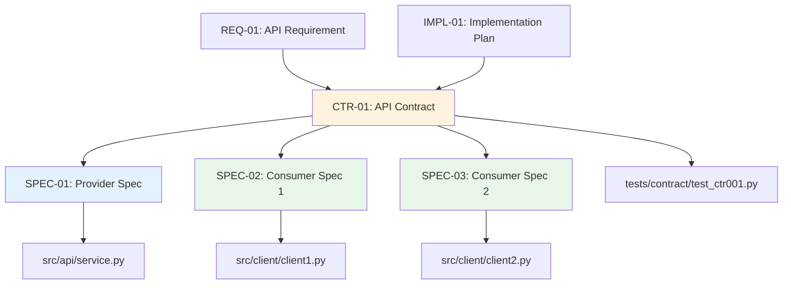

# Traceability Matrix: CTR-01 through CTR-NN

## Document Control

| Item | Details |
|------|---------|
| Document ID | TRACEABILITY_MATRIX_CTR |
| Title | Comprehensive API Contracts Traceability Matrix |
| Status | [Active/Draft] |
| Version | 1.0.0 |
| Date Created | YYYY-MM-DD |
| Author | [Team Name] |
| Purpose | Track bidirectional traceability for all API Contract Documents (dual-file format) |


---

**⚠️ TAG-BASED AUTO-GENERATION AVAILABLE**

This traceability matrix can be automatically generated by scanning code files for @ctr:, @spec:, @test: tags.

**Recommended Approach:** Use tag-based auto-discovery instead of manual maintenance.

**Generate automatically using:**
```bash
# Extract tags from all files
python scripts/extract_tags.py --source src/ docs/ tests/ --output docs/generated/tags.json

# Validate tags against documents
python scripts/validate_tags_against_docs.py --tags docs/generated/tags.json --strict

# Generate CTR traceability matrix
python scripts/generate_traceability_matrices.py --type CTR --output docs/CTR/CTR-000_TRACEABILITY_MATRIX.md
```

**Benefits:**
- ✅ Single source of truth: Tags embedded in code
- ✅ Always up-to-date: Generated from current codebase
- ✅ No manual sync: Automated validation prevents drift
- ✅ Coverage metrics: Automatically calculated

**Tag Format:** `@ctr: CTR-NN` (document-level format, e.g., `CTR-01`)

See: [TRACEABILITY.md](../TRACEABILITY.md#tag-based-auto-discovery-alternative) for complete tag-based workflow.

---

## 1. Overview

### 1.1 Document Type Description
API Contract Documents (CTR) define interface specifications using dual-file format: `.md` (human-readable context) + `.yaml` (machine-readable schema). CTR documents enable contract-first development and parallel team workflows.

### 1.2 Coverage Scope
This matrix tracks all CTR documents (both .md and .yaml files), mapping upstream requirements to downstream specifications and code implementations (providers and consumers).

### 1.3 Statistics
- **Total CTR Tracked**: [X] contracts ([Y] .md + [Y] .yaml)
- **Contract Types**: [Z] (OpenAPI, AsyncAPI, etc.)
- **Coverage Period**: [Start Date] to [End Date]
- **Last Updated**: YYYY-MM-DD

---

---

## 2. Required Tags (Cumulative Tagging Hierarchy - Layer 9)

### 2.1 Tag Requirements for CTR Artifacts

**Layer**: 9
**Artifact Type**: CTR (API Contracts)
**Required Tags**: `@brd`, `@prd`, `@ears`, `@bdd`, `@adr`, `@sys`, `@req`, `@impl`
**Tag Count**: 8

### 2.2 Tag Format

```markdown
@brd: BRD.09.01.15
@prd: PRD.16.01.03
@ears: EARS.12.24.02
@bdd: BDD.15.13.01
@adr: ADR-033
@sys: SYS.12.25.01
@req: REQ.45.26.01
@impl: IMPL.03.28.02
```

**Format Rules**:
- Prefix: `@` symbol
- Artifact Type: lowercase (`brd`, `prd`, `ears`, `bdd`, `adr`, `sys`, `req`, `impl`)
- Separator: colon `:` after artifact type, `:` between document ID and requirement ID
- Document ID: Standard format (e.g., `CTR-NN`)
- Requirement ID: Specific requirement/section identifier
- Multiple Values: comma-separated for same artifact type

### 2.3 Example: CTR with Required Tags

```markdown
# CTR-005: request submission API Contract

## 7. Traceability

### 7.1 Upstream Sources

**Required Tags** (Cumulative Tagging Hierarchy - Layer 9):
```markdown
@brd: BRD.09.01.15
@prd: PRD.16.01.03
@ears: EARS.12.24.02
@bdd: BDD.15.13.01
@adr: ADR-033
@sys: SYS.12.25.01
@req: REQ.45.26.01
@impl: IMPL.03.28.02
```

### 7.2 Downstream Artifacts
[Links to SPEC, TASKS, Code that reference this CTR]
```

### 2.4 Validation Rules

1. **Required**: Each CTR artifact MUST include at least one tag for each required layer
2. **Format Compliance**: All tags must follow `@artifact-type: DOC-ID:NN` format
3. **Valid References**: All referenced documents and requirements must exist
4. **No Gaps**: Cannot skip any required upstream layer in the chain
5. **Tag Count**: Must have exactly 8 tags for Layer 9

### 2.5 Tag Discovery

CTR tags can be discovered automatically:
```bash
# Find all CTRs and their upstream tags
python scripts/extract_tags.py --type CTR --show-all-upstream

# Validate CTR-005 has required tags
python scripts/validate_tags_against_docs.py \
  --artifact CTR-005 \
  --expected-layers brd,prd,ears,bdd,adr,sys,req,impl \
  --strict

# Generate CTR traceability report
python scripts/generate_traceability_matrices.py \
  --type CTR \
  --show-coverage
```

### 2.6 CTR Traceability Pattern

**Key Role**: CTR defines formal API contracts implementing requirements, ensuring interface compliance. (Optional layer - include only if exists in chain)

---

## 4. Complete CTR Inventory

| CTR ID | Title | Contract Type | Files | Status | Date | Upstream Sources | Downstream Artifacts |
|--------|-------|---------------|-------|--------|------|------------------|---------------------|
| CTR-01 | [API contract title] | OpenAPI 3.0 | .md + .yaml | Active | YYYY-MM-DD | REQ-01, IMPL-01 | SPEC-01 (provider), SPEC-02 (consumer), Code |
| CTR-02 | [API contract title] | AsyncAPI 2.0 | .md + .yaml | Active | YYYY-MM-DD | REQ-02 | SPEC-03, Code |
| CTR-NN | ... | ... | ... | ... | ... | ... | ... |

**Status Legend**:
- **Active**: Contract in use
- **Draft**: Under development
- **Deprecated**: Being phased out
- **Superseded**: Replaced by newer version

---

## 5. Upstream Traceability (REQUIRED)

> **Traceability Rule**: Upstream traceability is REQUIRED for CTR documents. All CTR contracts MUST reference existing BRD through IMPL documents.

### 4.1 REQ → CTR Traceability

| REQ ID | REQ Title | CTR IDs | CTR Titles | Relationship |
|--------|-----------|---------|------------|--------------|
| REQ-01 | [Atomic requirement for API] | CTR-01 | [API contract] | Requirement defines interface contract |
| REQ-NN | ... | ... | ... | ... |

### 4.2 IMPL → CTR Traceability

| IMPL ID | IMPL Title | CTR IDs | CTR Titles | Relationship |
|---------|------------|---------|------------|--------------|
| IMPL-01 | [Implementation plan] | CTR-01, CTR-02 | [API contracts] | Implementation plan includes interface definitions |
| IMPL-NN | ... | ... | ... | ... |

---

## 6. Downstream Traceability (OPTIONAL)

> **Traceability Rule**: Downstream traceability is OPTIONAL. Only add links to documents that already exist. Do NOT use placeholder IDs (TBD, XXX, NN).

### 5.1 CTR → SPEC Traceability (Provider)

| CTR ID | CTR Title | SPEC IDs (Provider) | SPEC Titles | Relationship |
|--------|-----------|---------------------|-------------|--------------|
| CTR-01 | [API contract] | SPEC-01 | [Provider specification] | Contract implemented by provider service |
| CTR-NN | ... | ... | ... | ... |

### 5.2 CTR → SPEC Traceability (Consumer)

| CTR ID | CTR Title | SPEC IDs (Consumer) | SPEC Titles | Relationship |
|--------|-----------|---------------------|-------------|--------------|
| CTR-01 | [API contract] | SPEC-02, SPEC-03 | [Consumer specifications] | Contract used by consumer services |
| CTR-NN | ... | ... | ... | ... |

### 5.3 CTR → Code Traceability

| CTR ID | CTR Title | Provider Code | Consumer Code | Contract Tests |
|--------|-----------|---------------|---------------|----------------|
| CTR-01 | [API contract] | src/api/endpoint.py | src/client/api_client.py | tests/contract/test_ctr_001.py |
| CTR-NN | ... | ... | ... | ... |

---

## 7. Contract Organization

### 6.1 CTR by Contract Type

| Contract Type | CTR IDs | Total | Description |
|---------------|---------|-------|-------------|
| OpenAPI 3.0 | CTR-01, CTR-02, CTR-03 | 3 | REST API contracts |
| AsyncAPI 2.0 | CTR-004, CTR-005 | 2 | Event-driven contracts |
| gRPC | CTR-006 | 1 | RPC service contracts |

### 6.2 Dual-File Validation

| CTR ID | .md File Exists | .yaml File Exists | Slugs Match | Schema Valid | Status |
|--------|-----------------|-------------------|-------------|--------------|--------|
| CTR-01 | ✅ | ✅ | ✅ | ✅ | Valid |
| CTR-02 | ✅ | ✅ | ✅ | ❌ | Schema Error |
| CTR-03 | ✅ | ❌ | N/A | N/A | Missing YAML |
| CTR-NN | ... | ... | ... | ... | ... |

---

## 8. Cross-CTR Dependencies



> **Note on Diagram Labels**: The above flowchart shows the sequential workflow. For formal layer numbers used in cumulative tagging, always reference the 16-layer architecture (Layers 0-15) defined in README.md. Diagram groupings are for visual clarity only.

### 7.1 Inter-CTR Dependencies

| Source CTR | Target CTR | Dependency Type | Description |
|------------|------------|-----------------|-------------|
| CTR-01 | CTR-03 | Prerequisite | Authentication contract required for data contract |
| CTR-02 | CTR-004 | Related | Event contracts for related business processes |
| CTR-NN | ... | ... | ... |

---

## 9. Contract Testing Status

### 8.1 Contract Test Coverage

| CTR ID | Provider Tests | Consumer Tests | Contract Tests | Coverage % | Status |
|--------|----------------|----------------|----------------|------------|--------|
| CTR-01 | ✅ | ✅ | ✅ | 100% | Validated |
| CTR-02 | ✅ | ❌ | ✅ | 67% | Partial |
| CTR-03 | ❌ | ❌ | ❌ | 0% | Not Tested |
| CTR-NN | ... | ... | ... | ... | ... |

### 8.2 Contract Validation Results

| CTR ID | Schema Valid | Examples Valid | Breaking Changes | Last Validated |
|--------|--------------|----------------|------------------|----------------|
| CTR-01 | ✅ | ✅ | None | YYYY-MM-DD |
| CTR-02 | ❌ | ✅ | None | YYYY-MM-DD |
| CTR-03 | ✅ | ❌ | 2 Breaking | YYYY-MM-DD |
| CTR-NN | ... | ... | ... | ... |

---

## 10. Implementation Status

### 9.1 CTR Implementation Progress

| CTR ID | Provider Status | Consumer Status | Tests Status | Overall | Completion % |
|--------|-----------------|-----------------|--------------|---------|--------------|
| CTR-01 | ✅ Complete | ✅ Complete | ✅ Complete | Complete | 100% |
| CTR-02 | ✅ Complete | 🟡 Partial (1/2) | 🟡 Partial | In Progress | 70% |
| CTR-03 | 🟡 In Progress | ⏳ Pending | ⏳ Pending | Started | 30% |
| CTR-NN | ... | ... | ... | ... | ... |

### 9.2 Gap Analysis

**Missing Dual Files**:
- CTR-XXX: Missing .yaml file (only .md exists)
- CTR-YYY: Missing .md file (only .yaml exists)

**Schema Validation Errors**:
- CTR-02: Invalid schema syntax
- CTR-005: Breaking changes detected

**Missing Implementation**:
- CTR-03: Provider not implemented
- CTR-004: Consumers not implemented
- CTR-006: No contract tests

---

## 11. Immediate Next Steps

### 10.1 Priority Actions
1. **Fix Schema Validation Errors**: [X] CTR documents have invalid schemas
2. **Complete Missing Dual Files**: [Y] CTR documents missing .md or .yaml
3. **Implement Provider/Consumer Code**: [Z] CTR documents need implementation
4. **Create Contract Tests**: [N] CTR documents need validation tests

### 10.2 Contract Evolution Plan

| CTR ID | Current Version | Planned Changes | Breaking | Target Date |
|--------|----------------|-----------------|----------|-------------|
| CTR-01 | v1.0 | Add pagination | No | YYYY-MM-DD |
| CTR-02 | v2.0 | Change auth method | Yes | YYYY-MM-DD |
| CTR-03 | v1.0 | Add new endpoints | No | YYYY-MM-DD |

---

## 12. Revision History

| Version | Date | Changes | Author |
|---------|------|---------|--------|
| 1.0.0 | YYYY-MM-DD | Initial creation | [Author Name] |

---

## 13. References

- **CTR Index**: [CTR-000_index.md](CTR-000_index.md)
- **CTR Template**: [CTR-TEMPLATE.md](CTR-TEMPLATE.md), [CTR-TEMPLATE.yaml](CTR-TEMPLATE.yaml)
- **Complete Traceability Matrix**: [../TRACEABILITY_MATRIX_COMPLETE-TEMPLATE.md](../TRACEABILITY_MATRIX_COMPLETE-TEMPLATE.md)
- **Related Matrices**: [REQ](../REQ/REQ-000_TRACEABILITY_MATRIX-TEMPLATE.md), [SPEC](../SPEC/SPEC-000_TRACEABILITY_MATRIX-TEMPLATE.md)

---

## 14. Appendix A: Contract Validation

### 14.1 Automated Validation
```bash
# Validate dual-file consistency
python ../scripts/validate_traceability_matrix.py \
  --matrix TRACEABILITY_MATRIX_CTR.md \
  --check-dual-files \
  --validate-schemas

# Check for breaking changes
python ../scripts/contract_change_validator.py \
  --contracts ../CTR/ \
  --baseline v1.0
```

### 14.2 Quality Checklist
- [ ] All CTR documents have both .md and .yaml files
- [ ] File slugs match between .md and .yaml
- [ ] YAML `contract_id:` uses lowercase_snake_case
- [ ] Schemas validate against OpenAPI/AsyncAPI standards
- [ ] Contract tests exist for all CTR documents
- [ ] Provider implementations exist
- [ ] Consumer implementations exist
- [ ] No breaking changes without version bump
