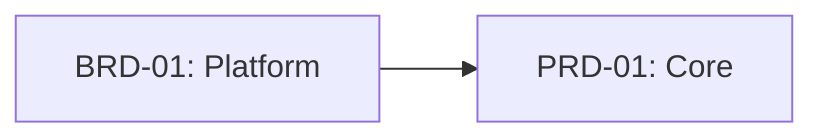
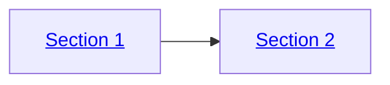

# Diagram Standards

## Mandatory Format: Mermaid Only

All diagrams, charts, workflows, and visual representations in SDD framework artifacts MUST use Mermaid syntax.

### Requirements

| Requirement | Description |
|-------------|-------------|
| **Format** | Mermaid syntax (fenced code blocks with `mermaid` language tag) |
| **Validation** | Diagrams must render without parse errors |
| **Style** | Follow `mermaid-gen` skill guidelines for syntax correctness |
| **File Management** | Use `charts-flow` skill for SVG generation and embedding |

### Prohibited Formats

The following diagram formats are NOT permitted in any SDD artifact:

| Format Type | Example | Prohibition Reason |
|-------------|---------|-------------------|
| ASCII art boxes | `+----+`, `|    |`, `+----+` | Not renderable, inconsistent display |
| Text-based flowcharts | `A --> B --> C` (outside Mermaid) | No semantic structure |
| Unicode box-drawing | `┌──┐`, `│  │`, `└──┘` | Font-dependent rendering |
| Manual arrow diagrams | `==>`, `->`, `<--` (outside Mermaid) | No styling or layout control |
| Indented hierarchy text | Manual spacing alignment | Fragile, breaks with formatting |

### Allowed Exceptions

| Exception | Permitted Use | Example |
|-----------|---------------|---------|
| Directory trees | File/folder structure representation | `├── src/`, `└── tests/` |
| Inline code references | Simple path or command notation | `src/main.py` |
| Table-based data | Structured data display | Markdown tables |

### Diagram Types Reference

Use appropriate Mermaid diagram type for the content:

| Content Type | Mermaid Diagram | Skill Reference |
|--------------|-----------------|-----------------|
| Process flows | `flowchart TD/LR` | `mermaid-gen` |
| Sequences/interactions | `sequenceDiagram` | `mermaid-gen` |
| State transitions | `stateDiagram-v2` | `mermaid-gen` |
| Class relationships | `classDiagram` | `mermaid-gen` |
| Entity relationships | `erDiagram` | `mermaid-gen` |
| Timelines | `timeline` | `mermaid-gen` |
| Mind maps | `mindmap` | `mermaid-gen` |

### Interactive Diagrams (RECOMMENDED)

For enhanced navigability, Mermaid diagrams MAY include click handlers to link nodes to related documents or sections. This is **optional but recommended** for traceability diagrams.

**Basic Click Handler Syntax**:



**Click Handler Format**:
```
click <node_id> "<relative_path>" "<tooltip_text>"
```

**When to Use Interactive Diagrams**:

| Use Case | Recommended | Example |
|----------|-------------|---------|
| Traceability diagrams | ✅ Yes | Link BRD → PRD → EARS nodes |
| Architecture overviews | ✅ Yes | Link to component docs |
| Workflow diagrams | ⚠️ Optional | Link to process docs |
| Simple concept diagrams | ❌ No | Static is sufficient |

**Best Practices**:

| Practice | Guidance |
|----------|----------|
| **Relative Paths** | Use `../` relative paths, not absolute URLs |
| **Consistent Direction** | Link from diagram location to target |
| **Tooltip Text** | Include descriptive tooltip (e.g., "View PRD-01 Details") |
| **Fallback** | Diagrams must be readable without clicking |
| **Validation** | Test links after file moves or renames |

**Alternative: Inline Anchor Links**:

For HTML-rendered Markdown, anchor links can be embedded in node labels:



**Note**: Anchor link syntax may not render in all Mermaid viewers. Use `click` handlers for broader compatibility.

**Format Comparison**:

| Aspect | Static Diagram | Click Handlers | Inline Anchors |
|--------|---------------|----------------|----------------|
| **Compatibility** | ✅ All viewers | ✅ Most viewers | ⚠️ HTML only |
| **Maintainability** | ✅ No path updates | ❌ Path breakage risk | ❌ Path breakage risk |
| **Navigation** | ❌ Manual | ✅ One-click | ✅ One-click |
| **Recommended For** | Conceptual diagrams | Published traceability | In-document navigation |

### Related Skills

| Skill | Purpose |
|-------|---------|
| `mermaid-gen` | Syntax generation, error prevention, best practices |
| `charts-flow` | File management, SVG conversion, document embedding |

### Enforcement

1. **Pre-commit validation**: Quality gates check for text-based diagram patterns
2. **Skill enforcement**: All doc-* skills include Mermaid-only requirement
3. **Review checklist**: Diagram format verification in code review

### Traceability

This standard applies to all SDD artifacts across Layers 1-15.

**Cross-references**:
- `mermaid-gen` skill: `.claude/skills/mermaid-gen/SKILL.md`
- `charts-flow` skill: `.claude/skills/charts-flow/SKILL.md`
- Framework guide: `ai_dev_flow/SPEC_DRIVEN_DEVELOPMENT_GUIDE.md`
