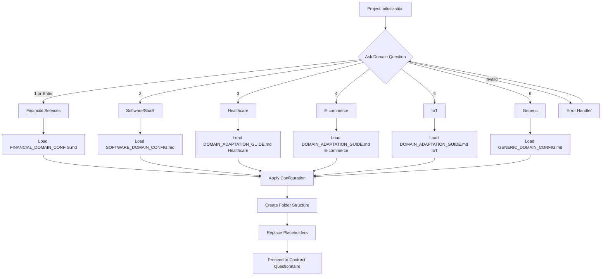

# Domain Selection Questionnaire

**Version**: 1.0
**Purpose**: Interactive questionnaire for AI Assistants to determine project domain at initialization
**Target**: AI Coding Assistants (Claude AI, Claude Code, Gemini CLI, GitHub Copilot)
**Status**: Production
**Default Domain**: Financial Services

---

## Purpose

This questionnaire enables AI Coding Assistants to:

1. **Identify project domain** at initialization
2. **Load correct domain configuration** automatically
3. **Apply domain-specific terminology** and placeholders
4. **Set regulatory requirements** per domain
5. **Customize folder structure** with domain subdirectories

---

## Questionnaire Execution

### When to Run

AI Assistant **MUST** run this questionnaire:
- At project initialization (first step)
- Before creating folder structure
- Before copying templates
- Before creating any documents

### How to Run

AI Assistant presents this question to the user:

```
═══════════════════════════════════════════════════════════
                 PROJECT DOMAIN SELECTION
═══════════════════════════════════════════════════════════

What is the purpose and focus of this new project?

Select one:

1. Financial Services (DEFAULT)
   - Trading platforms, banking, insurance, portfolio management
   - Regulatory: SEC, FINRA, SOX, Basel III, PCI-DSS
   - Terminology: Portfolio, Position, Trade, Greeks, VaR, Risk

2. Software/SaaS
   - B2B/B2C software services, multi-tenant applications
   - Regulatory: SOC2, GDPR/CCPA, ISO 27001
   - Terminology: Tenant, Workspace, Subscription, API, MRR

3. Healthcare
   - EMR, telemedicine, medical devices, patient management
   - Regulatory: HIPAA, FDA, HITECH, 21 CFR Part 11
   - Terminology: Patient, PHI, HL7/FHIR, Clinical Quality Measures

4. E-commerce
   - Retail, marketplace, subscription services, shopping platforms
   - Regulatory: PCI-DSS, GDPR/CCPA, FTC
   - Terminology: SKU, Cart, Order, Payment, Conversion Rate

5. IoT (Internet of Things)
   - Connected devices, sensors, industrial systems
   - Regulatory: FCC, CE, UL/IEC, FDA (medical devices)
   - Terminology: Device, Telemetry, OTA Updates, Edge Computing

6. Other/Generic
   - Internal tools, utilities, custom domain
   - Regulatory: Company policies only
   - Terminology: Generic (Resource, Entity, User, System)

Enter selection (1-6) or press Enter for default (1):
```

---

## Decision Matrix

| User Input | Domain | Config File | Subdirectories |
|------------|--------|-------------|----------------|
| 1 or Enter or "default" | Financial Services | `FINANCIAL_DOMAIN_CONFIG.md` | risk, trading, portfolio, compliance, ml |
| 2 or "software" or "saas" | Software/SaaS | `SOFTWARE_DOMAIN_CONFIG.md` | tenant, subscription, billing, workspace |
| 3 or "healthcare" | Healthcare | `DOMAIN_ADAPTATION_GUIDE.md` (Healthcare) | patient, clinical, ehr, hipaa |
| 4 or "ecommerce" or "e-commerce" | E-commerce | `DOMAIN_ADAPTATION_GUIDE.md` (E-commerce) | catalog, cart, order, payment, inventory |
| 5 or "iot" | IoT | `DOMAIN_ADAPTATION_GUIDE.md` (IoT) | device, telemetry, firmware, edge |
| 6 or "generic" or "other" | Generic | `GENERIC_DOMAIN_CONFIG.md` | (standard subdirectories only) |

---

## Domain Profiles

### 1. Financial Services (DEFAULT)

**When to Choose**:
- Trading platforms (equities, options, futures, crypto)
- Banking applications (retail, commercial, investment)
- Insurance systems (underwriting, claims, actuarial)
- Portfolio management (asset allocation, rebalancing)
- Risk management (VaR, stress testing, limit monitoring)
- Compliance reporting (regulatory filings, audit trails)

**Key Characteristics**:
- High regulatory requirements
- Real-time data processing
- Complex calculations (Greeks, P&L, risk metrics)
- Audit trails and compliance
- Market data integration
- Transaction processing

**Placeholder Mappings**:
```
[RESOURCE_COLLECTION] → Portfolio
[RESOURCE_ITEM] → Position
[RESOURCE_ACTION] → Trade Execution
[EXTERNAL_DATA_PROVIDER] → Market Data Feed
[CALCULATION_ENGINE] → Greeks Calculator
[USER_ROLE] → Trader / Portfolio Manager
[TRANSACTION] → Trade
[CONSTRAINT] → Position Limit
[REGULATORY_REQUIREMENT] → SEC Rule 15c3-5
```

**Requirements Subdirectories**:
- `docs/REQ/risk/` - Risk management requirements
- `docs/REQ/trading/` - Trade execution requirements
- `docs/REQ/portfolio/` - Portfolio management requirements
- `docs/REQ/compliance/` - Regulatory compliance requirements
- `docs/REQ/ml/` - ML model requirements (pricing, sentiment, regime detection)

**Example Use Cases**:
- Algorithmic trading platform
- Portfolio optimization system
- Risk analytics dashboard
- Regulatory reporting system
- Market data aggregation service

---

### 2. Software/SaaS

**When to Choose**:
- Multi-tenant B2B/B2C applications
- Subscription-based services
- Platform-as-a-Service offerings
- Workspace collaboration tools
- API-first products
- Microservices architectures

**Key Characteristics**:
- Multi-tenancy and data isolation
- Subscription and billing management
- API rate limiting and quotas
- Workspace/team organization
- SSO and identity management
- Usage-based pricing (MRR, ARR)

**Placeholder Mappings**:
```
[RESOURCE_COLLECTION] → Workspace
[RESOURCE_ITEM] → Resource
[RESOURCE_ACTION] → API Request
[EXTERNAL_DATA_PROVIDER] → Third-party Integration
[CALCULATION_ENGINE] → Billing Engine
[USER_ROLE] → Account Admin / Member
[TRANSACTION] → API Call
[CONSTRAINT] → Rate Limit
[REGULATORY_REQUIREMENT] → SOC2 Control
```

**Requirements Subdirectories**:
- `docs/REQ/tenant/` - Multi-tenancy requirements
- `docs/REQ/subscription/` - Subscription management
- `docs/REQ/billing/` - Billing and invoicing
- `docs/REQ/workspace/` - Workspace features

**Example Use Cases**:
- Project management SaaS
- CRM platform
- Analytics service
- Collaboration tool
- API gateway

---

### 3. Healthcare

**When to Choose**:
- Electronic Medical Records (EMR/EHR)
- Telemedicine platforms
- Medical device software
- Patient portals
- Clinical decision support
- Health information exchanges

**Key Characteristics**:
- HIPAA compliance (PHI protection)
- HL7/FHIR integration
- Clinical workflows
- Patient consent management
- Audit logging (access to PHI)
- Interoperability standards

**Placeholder Mappings**:
```
[RESOURCE_COLLECTION] → Patient Cohort
[RESOURCE_ITEM] → Patient Record
[RESOURCE_ACTION] → Clinical Event
[EXTERNAL_DATA_PROVIDER] → HL7 Interface
[CALCULATION_ENGINE] → Clinical Quality Measure Calculator
[USER_ROLE] → Physician / Nurse / Admin
[TRANSACTION] → Clinical Encounter
[CONSTRAINT] → Consent Restriction
[REGULATORY_REQUIREMENT] → HIPAA 164.312(a)(1)
```

**Requirements Subdirectories**:
- `docs/REQ/patient/` - Patient management
- `docs/REQ/clinical/` - Clinical workflows
- `docs/REQ/ehr/` - EMR/EHR features
- `docs/REQ/hipaa/` - HIPAA compliance

**Example Use Cases**:
- Telemedicine platform
- Patient scheduling system
- Clinical data warehouse
- Medical imaging viewer
- Prescription management

---

### 4. E-commerce

**When to Choose**:
- Online retail platforms
- Marketplace applications
- Subscription box services
- Shopping cart systems
- Payment processing
- Inventory management

**Key Characteristics**:
- Product catalog management
- Shopping cart and checkout
- Payment gateway integration
- Order fulfillment workflows
- Inventory tracking
- PCI-DSS compliance

**Placeholder Mappings**:
```
[RESOURCE_COLLECTION] → Product Catalog
[RESOURCE_ITEM] → SKU (Stock Keeping Unit)
[RESOURCE_ACTION] → Purchase
[EXTERNAL_DATA_PROVIDER] → Payment Gateway
[CALCULATION_ENGINE] → Pricing Engine
[USER_ROLE] → Shopper / Merchant / Admin
[TRANSACTION] → Order
[CONSTRAINT] → Inventory Limit
[REGULATORY_REQUIREMENT] → PCI-DSS 3.2.1
```

**Requirements Subdirectories**:
- `docs/REQ/catalog/` - Product catalog features
- `docs/REQ/cart/` - Shopping cart
- `docs/REQ/order/` - Order management
- `docs/REQ/payment/` - Payment processing
- `docs/REQ/inventory/` - Inventory management

**Example Use Cases**:
- Online store platform
- Marketplace (multi-vendor)
- Subscription commerce
- Point-of-sale (POS) system
- Warehouse management

---

### 5. IoT (Internet of Things)

**When to Choose**:
- Connected device platforms
- Sensor networks
- Industrial IoT (IIoT)
- Smart home systems
- Fleet management
- Remote monitoring

**Key Characteristics**:
- Device provisioning and management
- Telemetry data ingestion
- Edge computing
- Over-the-air (OTA) firmware updates
- Time-series data storage
- Device authentication

**Placeholder Mappings**:
```
[RESOURCE_COLLECTION] → Device Fleet
[RESOURCE_ITEM] → IoT Device
[RESOURCE_ACTION] → Telemetry Event
[EXTERNAL_DATA_PROVIDER] → Sensor Network
[CALCULATION_ENGINE] → Edge Analytics Engine
[USER_ROLE] → Fleet Manager / Operator
[TRANSACTION] → Device Command
[CONSTRAINT] → Bandwidth Limit
[REGULATORY_REQUIREMENT] → FCC Part 15
```

**Requirements Subdirectories**:
- `docs/REQ/device/` - Device management
- `docs/REQ/telemetry/` - Data collection
- `docs/REQ/firmware/` - OTA updates
- `docs/REQ/edge/` - Edge computing

**Example Use Cases**:
- Smart building management
- Fleet tracking system
- Industrial sensor network
- Wearable device platform
- Home automation

---

### 6. Other/Generic

**When to Choose**:
- Internal business tools
- Utility applications
- Proof-of-concept projects
- Domain not listed above
- Custom/hybrid domain
- Generic CRUD applications

**Key Characteristics**:
- Minimal regulatory requirements
- Standard CRUD operations
- Company-specific policies
- Flexible terminology
- General-purpose architecture

**Placeholder Mappings**:
```
[RESOURCE_COLLECTION] → Collection
[RESOURCE_ITEM] → Entity
[RESOURCE_ACTION] → Operation
[EXTERNAL_DATA_PROVIDER] → External API
[CALCULATION_ENGINE] → Processing Engine
[USER_ROLE] → User / Admin
[TRANSACTION] → Action
[CONSTRAINT] → Business Rule
[REGULATORY_REQUIREMENT] → Company Policy
```

**Requirements Subdirectories**:
- Standard subdirectories only (api, auth, data, core, etc.)
- No domain-specific subdirectories added

**Example Use Cases**:
- Internal admin tool
- Content management system
- Reporting dashboard
- Workflow automation
- Data migration utility

---

## AI Assistant Processing Logic

### After User Selection

```python
# Pseudocode for AI Assistant

def process_domain_selection(user_input):
    # Normalize input
    selection = normalize_input(user_input)

    # Domain mapping
    domain_map = {
        "1": "financial",
        "": "financial",  # Default on Enter
        "default": "financial",
        "2": "software",
        "software": "software",
        "saas": "software",
        "3": "healthcare",
        "healthcare": "healthcare",
        "4": "ecommerce",
        "ecommerce": "ecommerce",
        "e-commerce": "ecommerce",
        "5": "iot",
        "iot": "iot",
        "6": "generic",
        "generic": "generic",
        "other": "generic"
    }

    domain = domain_map.get(selection, "financial")  # Default to financial

    # Load configuration
    if domain == "financial":
        config_file = "FINANCIAL_DOMAIN_CONFIG.md"
        subdirs = ["risk", "trading", "portfolio", "compliance", "ml"]
    elif domain == "software":
        config_file = "SOFTWARE_DOMAIN_CONFIG.md"
        subdirs = ["tenant", "subscription", "billing", "workspace"]
    elif domain == "healthcare":
        config_file = "DOMAIN_ADAPTATION_GUIDE.md"  # Healthcare section
        subdirs = ["patient", "clinical", "ehr", "hipaa"]
    elif domain == "ecommerce":
        config_file = "DOMAIN_ADAPTATION_GUIDE.md"  # E-commerce section
        subdirs = ["catalog", "cart", "order", "payment", "inventory"]
    elif domain == "iot":
        config_file = "DOMAIN_ADAPTATION_GUIDE.md"  # IoT section
        subdirs = ["device", "telemetry", "firmware", "edge"]
    else:  # generic
        config_file = "GENERIC_DOMAIN_CONFIG.md"
        subdirs = []  # Standard subdirs only

    # Confirm with user
    print(f"✓ Domain selected: {domain.title()}")
    print(f"✓ Loading configuration: {config_file}")
    print(f"✓ Domain-specific subdirectories: {subdirs}")

    # Load and apply configuration
    load_domain_config(config_file)

    # Create folder structure with domain subdirs
    create_folder_structure(standard_dirs + subdirs)

    # Apply placeholder replacements
    apply_domain_placeholders(config_file)

    # Proceed to next step
    return domain, config_file, subdirs
```

---

## Validation Questions

### Follow-Up Questions (Optional)

After domain selection, AI Assistant **MAY** ask clarifying questions:

#### For Financial Services:
```
"Which financial sector applies to this project?"
1. Retail Trading (individual investors)
2. Institutional Trading (hedge funds, asset managers)
3. Banking (retail, commercial, investment)
4. Insurance (underwriting, claims, actuarial)
5. Mixed/Multiple
```

#### For Software/SaaS:
```
"What is the primary architecture?"
1. Monolithic application
2. Microservices architecture
3. API-first platform
4. Serverless/event-driven
5. Hybrid
```

#### For Healthcare:
```
"Which healthcare segment?"
1. Provider-facing (EMR, clinical workflows)
2. Patient-facing (portals, telemedicine)
3. Payer-facing (claims, billing)
4. Medical devices (firmware, diagnostics)
5. Research/Analytics
```

#### For E-commerce:
```
"What is the business model?"
1. B2C Direct-to-Consumer
2. B2B Enterprise sales
3. Marketplace (multi-vendor)
4. Subscription commerce
5. Hybrid
```

---

## Configuration File References

### Primary Config Files

1. **FINANCIAL_DOMAIN_CONFIG.md**
   - Complete financial services configuration
   - Regulatory mappings (SEC, FINRA, SOX, Basel III)
   - Financial terminology dictionary
   - Example use cases and templates

2. **SOFTWARE_DOMAIN_CONFIG.md**
   - Software/SaaS configuration
   - Compliance mappings (SOC2, GDPR, ISO 27001)
   - SaaS terminology dictionary
   - Multi-tenancy patterns

3. **GENERIC_DOMAIN_CONFIG.md**
   - Universal fallback configuration
   - Minimal compliance requirements
   - Generic terminology
   - Flexible templates

### Reference Documentation

4. **DOMAIN_ADAPTATION_GUIDE.md**
   - Contains sections for Healthcare, E-commerce, IoT
   - Cross-references for all domains
   - Migration guide between domains
   - Custom domain creation instructions

---

## Example: AI Assistant Execution

### User Story

```
User: "Initialize new project"

AI Assistant:
═══════════════════════════════════════════════════════════
                 PROJECT DOMAIN SELECTION
═══════════════════════════════════════════════════════════

What is the purpose and focus of this new project?

Select one:

1. Financial Services (DEFAULT)
2. Software/SaaS
3. Healthcare
4. E-commerce
5. IoT
6. Other/Generic

Enter selection (1-6) or press Enter for default (1):

User: "2"

AI Assistant:
✓ Domain selected: Software/SaaS
✓ Loading configuration: SOFTWARE_DOMAIN_CONFIG.md
✓ Domain-specific subdirectories: ['tenant', 'subscription', 'billing', 'workspace']

Applying Software/SaaS terminology:
- [RESOURCE_COLLECTION] → Workspace
- [RESOURCE_ITEM] → Resource
- [USER_ROLE] → Account Admin
- [TRANSACTION] → API Call
- [REGULATORY_REQUIREMENT] → SOC2 Control

Creating folder structure...
✓ Created: docs/REQ/tenant/
✓ Created: docs/REQ/subscription/
✓ Created: docs/REQ/billing/
✓ Created: docs/REQ/workspace/

Ready to proceed. Next: Run contract decision questionnaire.
```

---

## Error Handling

### Invalid Input

If user provides invalid input:

```
User: "blockchain"

AI Assistant:
⚠ Input "blockchain" not recognized.

Please select from:
1. Financial Services (DEFAULT)
2. Software/SaaS
3. Healthcare
4. E-commerce
5. IoT
6. Other/Generic

Enter selection (1-6) or press Enter for default (1):
```

### Uncertain User

If user is unsure:

```
User: "Not sure, what should I choose?"

AI Assistant:
Let me ask a few questions to determine the best domain:

1. Does this project involve financial transactions, trading, or banking?
   → If YES: Choose Financial Services

2. Is this a multi-tenant SaaS application or API platform?
   → If YES: Choose Software/SaaS

3. Does this handle patient health information (PHI)?
   → If YES: Choose Healthcare

4. Is this an online store, marketplace, or shopping platform?
   → If YES: Choose E-commerce

5. Does this involve connected devices, sensors, or telemetry?
   → If YES: Choose IoT

6. None of the above?
   → Choose Other/Generic

Which category best describes your project?
```

---

## Summary: Domain Selection Flow



> **Note on Diagram Labels**: The above flowchart shows the sequential workflow. For formal layer numbers used in cumulative tagging, always reference the 16-layer architecture (Layers 0-15) defined in README.md. Diagram groupings are for visual clarity only.

---

## References

- [AI_ASSISTANT_RULES.md](./AI_ASSISTANT_RULES.md#rule-1-domain-selection-first-step) - Rule 1: Domain Selection
- [FINANCIAL_DOMAIN_CONFIG.md](./FINANCIAL_DOMAIN_CONFIG.md) - Financial Services configuration
- [SOFTWARE_DOMAIN_CONFIG.md](./SOFTWARE_DOMAIN_CONFIG.md) - Software/SaaS configuration
- [GENERIC_DOMAIN_CONFIG.md](./GENERIC_DOMAIN_CONFIG.md) - Generic configuration
- [DOMAIN_ADAPTATION_GUIDE.md](./DOMAIN_ADAPTATION_GUIDE.md) - Multi-domain adaptation guide
- [CONTRACT_DECISION_QUESTIONNAIRE.md](./CONTRACT_DECISION_QUESTIONNAIRE.md) - Next step after domain selection

---

**End of Domain Selection Questionnaire**
