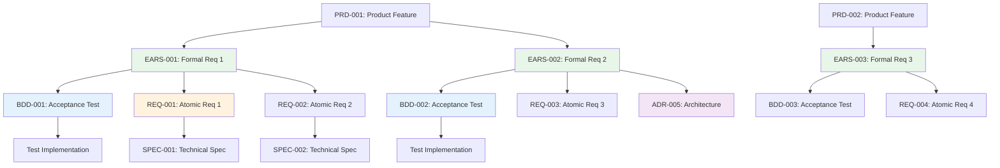

# Traceability Matrix: EARS-001 through EARS-NNN

## Document Control

| Item | Details |
|------|---------|
| Document ID | TRACEABILITY_MATRIX_EARS |
| Title | Comprehensive EARS Requirements Traceability Matrix |
| Status | [Active/Draft] |
| Version | 1.0.0 |
| Date Created | YYYY-MM-DD |
| Author | [Team Name] |
| Purpose | Track bidirectional traceability for all EARS (Easy Approach to Requirements Syntax) Documents |


---

**⚠️ TAG-BASED AUTO-GENERATION AVAILABLE**

This traceability matrix can be automatically generated by scanning code files for @ears:, @spec:, @test: tags.

**Recommended Approach:** Use tag-based auto-discovery instead of manual maintenance.

**Generate automatically using:**
```bash
# Extract tags from all files
python scripts/extract_tags.py --source src/ docs/ tests/ --output docs/generated/tags.json

# Validate tags against documents
python scripts/validate_tags_against_docs.py --tags docs/generated/tags.json --strict

# Generate EARS traceability matrix
python scripts/generate_traceability_matrices.py --type EARS --output docs/EARS/EARS-000_TRACEABILITY_MATRIX.md
```

**Benefits:**
- ✅ Single source of truth: Tags embedded in code
- ✅ Always up-to-date: Generated from current codebase
- ✅ No manual sync: Automated validation prevents drift
- ✅ Coverage metrics: Automatically calculated

**Tag Format:** `@ears: EARS-001:REQ-ID` (for multi-requirement docs) or `@ears: EARS-001` (for single-doc refs)

See: [TRACEABILITY.md](../TRACEABILITY.md#tag-based-auto-discovery-alternative) for complete tag-based workflow.

---

## 1. Overview

### 1.1 Document Type Description
EARS documents formalize requirements using the WHEN-THE-SHALL-WITHIN syntax, providing unambiguous, testable, and verifiable requirement statements. EARS bridges product requirements (PRD) and technical implementation.

### 1.2 Coverage Scope
This matrix tracks all EARS documents, mapping upstream product requirements to downstream BDD test scenarios, atomic requirements (REQ), and architecture decisions (ADR).

### 1.3 Statistics
- **Total EARS Tracked**: [X] documents
- **EARS Statements**: [Y] total formal requirements
- **Coverage Period**: [Start Date] to [End Date]
- **Last Updated**: YYYY-MM-DD

---

## 2. Required Tags (Cumulative Tagging Hierarchy - Layer 3)

### 2.1 Tag Requirements for EARS Artifacts

**Layer**: 3
**Artifact Type**: EARS (Easy Approach to Requirements Syntax)
**Required Tags**: `@brd`, `@prd`
**Tag Count**: 2

### 2.2 Tag Format

```markdown
@brd: BRD-009:FR-015, BRD-009:NFR-006
@prd: PRD-016:FEATURE-003
```

**Format Rules**:
- Prefix: `@` symbol
- Artifact Types: lowercase (`brd`, `prd`)
- Separator: colon `:` after artifact type
- Document ID: `TYPE-NNN` format
- Requirement ID: specific requirement/section identifier
- Multiple Values: comma-separated within each tag line

### 2.3 Example: EARS with Required Tags

```markdown
# EARS-012: Trade Execution Formal Requirements

## 10. Traceability

### 11.1 Upstream Sources

**Required Tags** (Cumulative Tagging Hierarchy - Layer 3):
```markdown
@brd: BRD-009:FR-015, BRD-009:NFR-006
@prd: PRD-016:FEATURE-003
```

- **BRD-009:FR-015**: Functional requirement for broker integration
- **BRD-009:NFR-006**: Non-functional requirement for trade execution performance
- **PRD-016:FEATURE-003**: Product feature for trade execution user interface

### 11.2 Downstream Artifacts

**Direct Dependencies**:
- BDD-015: Trade execution test scenarios (`@ears: EARS-012:EVENT-002`)
- REQ-045: Place limit order atomic requirement (`@ears: EARS-012:EVENT-002`)
- ADR-033: Trade execution architecture (`@ears: EARS-012:EVENT-002`)
```

### 2.4 Example: EARS Statements with Traceability

```markdown
## 5.1 Event-Driven Requirements

### EARS-012:EVENT-001
**WHEN** user selects "Place Order" button
**THE** system **SHALL** validate order parameters
**WITHIN** 100 milliseconds

**Traceability**:
- Upstream: BRD-009:FR-015 (Order placement capability)
- Upstream: PRD-016:FEATURE-003 (Order placement UI)
- Downstream: BDD-015:scenario-place-order (Test scenario)
- Downstream: REQ-045 (Validation logic requirement)

### EARS-012:EVENT-002
**WHEN** order validation succeeds
**THE** system **SHALL** execute the trade
**WITHIN** 2 seconds

**Traceability**:
- Upstream: BRD-009:NFR-006 (Performance requirement)
- Upstream: PRD-016:FEATURE-003 (Trade execution feature)
- Downstream: BDD-015:scenario-trade-execution (Test scenario)
- Downstream: REQ-046 (Trade execution logic)
```

### 2.5 Validation Rules

1. **Required Tags**: Each EARS MUST include both `@brd` and `@prd` tags
2. **Format Compliance**: All tags must follow `@type: DOC-ID:REQ-ID` format
3. **Valid References**: All referenced BRD and PRD documents must exist
4. **No Gaps**: Cannot skip BRD layer (must reference both BRD and PRD)
5. **Statement-Level Traceability**: Individual EARS statements should document upstream sources in their descriptions

### 2.6 Tag Discovery

```bash
# Find all EARS and their upstream tags
python scripts/extract_tags.py --type EARS --show-upstream brd,prd

# Validate EARS-012 has required tags
python scripts/validate_tags_against_docs.py \
  --artifact EARS-012 \
  --expected-layers brd,prd \
  --strict

# Generate EARS coverage report
python scripts/generate_traceability_matrices.py \
  --type EARS \
  --show-coverage
```

### 2.7 EARS Traceability Pattern

EARS at Layer 3 formalizes business and product requirements:

```
Strategy (External) → Strategic business goals
  ↓
BRD (Layer 1) → Business requirements
  ↓
PRD (Layer 2) → Product features (@brd)
  ↓
EARS (Layer 3) → Formal engineering requirements (@brd, @prd)
  ↓
BDD (Layer 4) → Test scenarios (@brd, @prd, @ears)
  ↓
ADR (Layer 5) → Architecture decisions (@brd through @bdd)
  ↓
[Complete chain through Code and Tests]
```

**Key Role**: EARS transforms informal product requirements (PRD) into formal, testable, unambiguous engineering requirements using WHEN-THE-SHALL syntax, creating the foundation for BDD test scenarios and technical implementation.

---

## 5. Complete EARS Inventory

| EARS ID | Title | Requirement Category | Total Statements | Status | Date | Upstream Sources | Downstream Artifacts |
|---------|-------|---------------------|------------------|--------|------|------------------|---------------------|
| EARS-001 | [Formal requirement title] | [Category] | [X] | Active | YYYY-MM-DD | PRD-001, BRD-001 | BDD-001, REQ-001, REQ-002 |
| EARS-002 | [Formal requirement title] | [Category] | [X] | Active | YYYY-MM-DD | PRD-002 | BDD-002, REQ-003 |
| EARS-NNN | ... | ... | ... | ... | ... | ... | ... |

**Document Status Legend**:
- **Active**: Current and actively referenced
- **In Validation**: Under testing/verification
- **Approved**: Verified and baselined
- **Superseded**: Replaced by newer version

---

## 6. Upstream Traceability

### 11.1 BRD → EARS Traceability

| BRD ID | BRD Title | EARS IDs | EARS Titles | Relationship Description |
|--------|-----------|----------|-------------|--------------------------|
| BRD-001 | [Business requirement] | EARS-001, EARS-002 | [Formal requirements] | Business goals formalized as verifiable requirements |
| BRD-NNN | ... | ... | ... | ... |

### 11.2 PRD → EARS Traceability

| PRD ID | PRD Title | EARS IDs | EARS Titles | Relationship Description |
|--------|-----------|----------|-------------|--------------------------|
| PRD-001 | [Product feature] | EARS-001, EARS-002, EARS-003 | [Formal requirements] | Product features decomposed into formal EARS statements |
| PRD-002 | [Product feature] | EARS-004 | [Formal requirement] | User stories converted to WHEN-THE-SHALL syntax |
| PRD-NNN | ... | ... | ... | ... |

### 5.3 Upstream Source Summary

| Source Category | Total Sources | EARS Derived | Coverage % |
|-----------------|---------------|--------------|------------|
| BRD | [X] | [Y] EARS | XX% |
| PRD | [X] | [Y] EARS | XX% |
| User Research | [X] | [Y] EARS | XX% |
| Technical Analysis | [X] | [Y] EARS | XX% |

---

## 7. Downstream Traceability

### 11.1 EARS → BDD Traceability

| EARS ID | EARS Title | BDD IDs | BDD Scenarios | Relationship |
|---------|------------|---------|---------------|--------------|
| EARS-001 | [Formal requirement] | BDD-001 | [Test scenarios] | EARS statements validated through BDD scenarios |
| EARS-002 | [Formal requirement] | BDD-002, BDD-003 | [Test scenarios] | Multiple test scenarios verify requirement |
| EARS-NNN | ... | ... | ... | ... |

### 11.2 EARS → REQ Traceability

| EARS ID | EARS Title | REQ IDs | REQ Titles | Relationship |
|---------|------------|---------|------------|--------------|
| EARS-001 | [Formal requirement] | REQ-001, REQ-002 | [Atomic requirements] | EARS decomposed into implementation requirements |
| EARS-002 | [Formal requirement] | REQ-003 | [Atomic requirement] | Direct 1:1 implementation requirement |
| EARS-NNN | ... | ... | ... | ... |

### 7.3 EARS → ADR Traceability

| EARS ID | EARS Title | ADR IDs | ADR Titles | Relationship |
|---------|------------|---------|------------|--------------|
| EARS-001 | [Requirement driving architectural decision] | ADR-005 | [Architecture decision] | Requirement necessitates technical decision |
| EARS-NNN | ... | ... | ... | ... |

### 6.4 EARS → SYS Traceability

| EARS ID | EARS Title | SYS IDs | SYS Titles | Relationship |
|---------|------------|---------|------------|--------------|
| EARS-001 | [Formal requirement] | SYS-001 | [System requirement] | EARS informs system-level requirements |
| EARS-NNN | ... | ... | ... | ... |

### 6.5 Downstream Artifact Summary

| Artifact Type | Total Artifacts | EARS Traced | Coverage % |
|---------------|-----------------|-------------|------------|
| BDD | [X] | [Y] EARS | XX% |
| REQ | [X] | [Y] EARS | XX% |
| ADR | [X] | [Y] EARS | XX% |
| SYS | [X] | [Y] EARS | XX% |
| SPEC | [X] | [Y] EARS | XX% |

---

## 9. EARS Statement Analysis

### 11.1 EARS Syntax Pattern Distribution

| EARS Pattern | Count | Percentage | Examples |
|--------------|-------|------------|----------|
| **Ubiquitous** (SHALL) | [X] | XX% | System SHALL validate user input |
| **Event-driven** (WHEN...SHALL) | [X] | XX% | WHEN user submits form, system SHALL validate |
| **State-driven** (WHILE...SHALL) | [X] | XX% | WHILE processing, system SHALL display progress |
| **Unwanted behavior** (IF...THEN...SHALL) | [X] | XX% | IF timeout occurs, THEN system SHALL retry |
| **Optional** (WHERE...SHALL) | [X] | XX% | WHERE applicable, system SHALL log events |
| **Complex** (WHEN...WHERE...SHALL...WITHIN) | [X] | XX% | Full EARS syntax with constraints |

### 11.2 EARS Statement Coverage by Requirement Type

| Requirement Type | EARS Statements | BDD Coverage | REQ Coverage | Verified |
|------------------|-----------------|--------------|--------------|----------|
| Functional | [X] | XX% | XX% | [Y] statements |
| Performance | [X] | XX% | XX% | [Y] statements |
| Security | [X] | XX% | XX% | [Y] statements |
| Usability | [X] | XX% | XX% | [Y] statements |
| Reliability | [X] | XX% | XX% | [Y] statements |

---

## 9. Cross-EARS Dependencies

### 11.1 EARS Relationship Map



> **Note on Diagram Labels**: The above flowchart shows the sequential workflow. For formal layer numbers used in cumulative tagging, always reference the 16-layer architecture (Layers 0-15) defined in README.md. Diagram groupings are for visual clarity only.

### 11.2 Inter-EARS Dependencies

| Source EARS | Target EARS | Dependency Type | Description |
|-------------|-------------|-----------------|-------------|
| EARS-001 | EARS-005 | Prerequisite | Authentication required before authorization |
| EARS-002 | EARS-003 | Related | Data validation supports data processing |
| EARS-NNN | ... | ... | ... |

---

## 10. Verification and Validation Status

### 11.1 EARS Verification Coverage

| EARS ID | Total Statements | BDD Scenarios | REQ Mappings | Verification % | Status |
|---------|------------------|---------------|--------------|----------------|--------|
| EARS-001 | 5 | 5 | 5 | 100% | ✅ Verified |
| EARS-002 | 3 | 3 | 3 | 100% | ✅ Verified |
| EARS-003 | 4 | 2 | 4 | 50% | 🟡 Partial |
| EARS-NNN | ... | ... | ... | ... | ... |

### 11.2 Testability Assessment

| EARS ID | Testability Score | Ambiguity Level | Completeness | Issues |
|---------|-------------------|-----------------|--------------|--------|
| EARS-001 | High (9/10) | Low | Complete | None |
| EARS-002 | Medium (6/10) | Medium | Partial | Missing performance criteria |
| EARS-003 | High (8/10) | Low | Complete | None |
| EARS-NNN | ... | ... | ... | ... |

### 11.3 Requirements Quality Metrics

| Quality Metric | Target | Current | Status |
|----------------|--------|---------|--------|
| Atomic (single concern per statement) | 100% | XX% | [Status] |
| Testable (verifiable) | 100% | XX% | [Status] |
| Unambiguous (clear SHALL statements) | 100% | XX% | [Status] |
| Complete (all necessary info) | 100% | XX% | [Status] |
| Consistent (no contradictions) | 100% | XX% | [Status] |

---

## 11. Implementation Status

### 11.1 Artifact Creation Coverage

| Artifact Type | Required | Created | Pending | Coverage % |
|---------------|----------|---------|---------|------------|
| BDD | [X] | [Y] | [Z] | XX% |
| REQ | [X] | [Y] | [Z] | XX% |
| ADR | [X] | [Y] | [Z] | XX% |
| SYS | [X] | [Y] | [Z] | XX% |
| SPEC | [X] | [Y] | [Z] | XX% |
| **Total** | **[X]** | **[Y]** | **[Z]** | **XX%** |

### 11.2 EARS Implementation Status

| EARS ID | BDD Status | REQ Status | ADR Status | Overall Status | Completion % |
|---------|------------|------------|------------|----------------|--------------|
| EARS-001 | ✅ Complete | ✅ Complete | N/A | Complete | 100% |
| EARS-002 | ✅ Complete | 🟡 In Progress | ✅ Complete | In Progress | 80% |
| EARS-003 | 🟡 In Progress | ⏳ Pending | ⏳ Pending | Started | 30% |
| EARS-NNN | ... | ... | ... | ... | ... |

**Status Legend**:
- ✅ Complete: Artifact created and validated
- 🟡 In Progress: Artifact under development
- ⏳ Pending: Artifact not yet started
- N/A: Not applicable for this EARS
- ❌ Blocked: Artifact creation blocked by dependencies

### 11.3 Gap Analysis

**Missing Downstream Artifacts**:
- EARS-XXX: Missing BDD scenarios (requirement not testable)
- EARS-YYY: Missing REQ decomposition (not implemented)
- EARS-ZZZ: Missing ADR (technical decision undocumented)

**Orphaned Documents** (downstream artifacts with no EARS source):
- BDD-XXX: Test scenario with no formal requirement
- REQ-YYY: Atomic requirement with no EARS foundation
- SPEC-ZZZ: Specification with no requirements traceability

**Quality Issues**:
- EARS-AAA: Ambiguous SHALL statement (needs clarification)
- EARS-BBB: Untestable requirement (no measurable criteria)
- EARS-CCC: Incomplete WITHIN clause (missing performance target)

---

## 12. Immediate Next Steps

### 12.1 Priority Actions

1. **Complete Missing BDD Scenarios**: [X] EARS require acceptance tests
2. **Decompose into Atomic Requirements**: [Y] EARS need REQ breakdown
3. **Clarify Ambiguous Statements**: [Z] EARS need revision for clarity
4. **Add Performance Criteria**: [N] EARS missing WITHIN clauses

### 12.2 EARS Quality Improvement Plan

| Improvement Area | EARS Affected | Target Date | Owner |
|------------------|---------------|-------------|-------|
| Add performance criteria (WITHIN) | EARS-002, EARS-005 | YYYY-MM-DD | [Owner] |
| Create missing BDD scenarios | EARS-003, EARS-007 | YYYY-MM-DD | [Owner] |
| Refine ambiguous statements | EARS-010 | YYYY-MM-DD | [Owner] |
| Complete REQ decomposition | EARS-008, EARS-009 | YYYY-MM-DD | [Owner] |

### 12.3 Validation Milestones

| Milestone | Target Date | EARS Scope | Status |
|-----------|-------------|------------|--------|
| [Milestone 1: MVP Validation] | YYYY-MM-DD | EARS-001 through EARS-010 | On Track |
| [Milestone 2: Full Coverage] | YYYY-MM-DD | All EARS | Planning |

---

## 13. Revision History

| Version | Date | Changes | Author |
|---------|------|---------|--------|
| 1.0.0 | YYYY-MM-DD | Initial traceability matrix creation | [Author Name] |
| 0.9.0 | YYYY-MM-DD | Draft version for review | [Author Name] |

---

## 14. References

### Internal Documentation
- **EARS Index**: [EARS-000_index.md](EARS-000_index.md)
- **EARS Template**: [EARS-TEMPLATE.md](EARS-TEMPLATE.md)
- **Complete Traceability Matrix**: [../TRACEABILITY_MATRIX_COMPLETE-TEMPLATE.md](../TRACEABILITY_MATRIX_COMPLETE-TEMPLATE.md)
- **Traceability Standards**: [../TRACEABILITY.md](../TRACEABILITY.md)
- **SDD Workflow Guide**: [../SPEC_DRIVEN_DEVELOPMENT_GUIDE.md](../SPEC_DRIVEN_DEVELOPMENT_GUIDE.md)

### EARS Standards and Guides
- EARS (Easy Approach to Requirements Syntax) - Alistair Mavin et al.
- ISO/IEC/IEEE 29148:2018 - Requirements engineering
- INCOSE Guide to Writing Requirements

### Related Matrices
- [PRD Traceability Matrix](../PRD/PRD-000_TRACEABILITY_MATRIX-TEMPLATE.md)
- [BDD Traceability Matrix](../BDD/BDD-000_TRACEABILITY_MATRIX-TEMPLATE.md)
- [REQ Traceability Matrix](../REQ/REQ-000_TRACEABILITY_MATRIX-TEMPLATE.md)
- [ADR Traceability Matrix](../ADR/ADR-000_TRACEABILITY_MATRIX-TEMPLATE.md)

---

## Appendix A: Matrix Maintenance Guidelines

### When to Update This Matrix
1. **After Creating/Updating EARS**: Add new entries within 1 business day
2. **BDD Scenario Creation**: Link new test scenarios to EARS statements
3. **Requirements Refinement**: Update when clarifying ambiguous statements
4. **Validation Reviews**: Full matrix review before testing phases

### Automated Generation
```bash
# Generate matrix from EARS directory
python ../scripts/generate_traceability_matrix.py \
  --type EARS \
  --input ../EARS/ \
  --template EARS-000_TRACEABILITY_MATRIX-TEMPLATE.md \
  --output TRACEABILITY_MATRIX_EARS.md

# Validate matrix
python ../scripts/validate_traceability_matrix.py \
  --matrix TRACEABILITY_MATRIX_EARS.md \
  --strict \
  --check-EARS-syntax

# Update incrementally
python ../scripts/update_traceability_matrix.py \
  --matrix TRACEABILITY_MATRIX_EARS.md \
  --preserve-annotations
```

### Quality Checklist
- [ ] All EARS documents included in inventory
- [ ] Upstream PRD/BRD sources documented for each EARS
- [ ] Downstream artifacts mapped (BDD, REQ, ADR, SYS)
- [ ] EARS syntax pattern distribution analyzed
- [ ] Verification coverage tracked (BDD + REQ)
- [ ] Testability assessment complete
- [ ] Requirements quality metrics calculated
- [ ] Inter-EARS dependencies identified
- [ ] Gap analysis identifies missing artifacts
- [ ] All EARS statements follow WHEN-THE-SHALL-WITHIN syntax
- [ ] All hyperlinks resolve correctly
- [ ] Mermaid diagrams render without errors
- [ ] Coverage metrics mathematically correct
- [ ] Revision history updated
