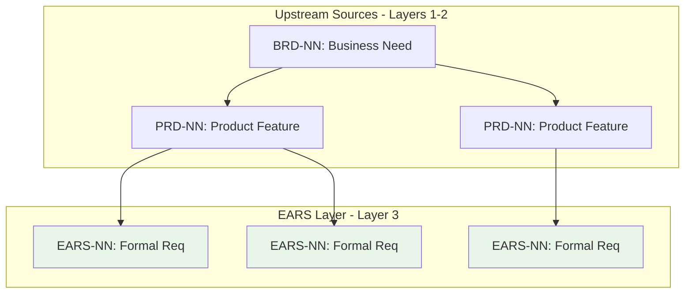

# Traceability Matrix: EARS-NN (project-agnostic example IDs)

## Document Control

| Item | Details |
|------|---------|
| Document ID | TRACEABILITY_MATRIX_EARS |
| Title | Comprehensive EARS Requirements Traceability Matrix |
| Status | [Active/Draft] |
| Version | 1.0.0 |
| Date Created | YYYY-MM-DD |
| Author | [Team Name] |
| Purpose | Track upstream traceability for all EARS (Event-Action-Response-State) Engineering Requirements |


---

Note: Some examples in this document show a portable `docs/` root. In this repository, artifact folders live at the ai_dev_flow root without the `docs/` prefix; see README → “Using This Repo” for path mapping.

**⚠️ TAG-BASED AUTO-GENERATION AVAILABLE**

This traceability matrix can be automatically generated by scanning code files for @ears:, @spec:, @test: tags.

**Recommended Approach:** Use tag-based auto-discovery instead of manual maintenance.

**Generate automatically using:**
```bash
# NOTE: In this ai_dev_flow repo, drop any `docs/` prefix shown in generic examples.
# Extract tags from all files
python scripts/extract_tags.py --source src/ docs/ tests/ --output docs/generated/tags.json

# Validate tags against documents
python scripts/validate_tags_against_docs.py --tags docs/generated/tags.json --strict

# Generate EARS traceability matrix
python scripts/generate_traceability_matrix.py --type EARS --output docs/EARS/EARS-00_TRACEABILITY_MATRIX.md
```

**Benefits:**
- ✅ Single source of truth: Tags embedded in code
- ✅ Always up-to-date: Generated from current codebase
- ✅ No manual sync: Automated validation prevents drift
- ✅ Coverage metrics: Automatically calculated

**Tag Format:** `@ears: EARS.NN.25.SS` (unified 4-segment format, e.g., `EARS.02.25.03`)

See: [TRACEABILITY.md](../TRACEABILITY.md#tag-based-auto-discovery-alternative) for complete tag-based workflow.

---

## 1. Overview

### 1.1 Document Type Description
EARS documents formalize requirements using the WHEN-THE-SHALL-WITHIN syntax, providing unambiguous, testable, and verifiable requirement statements. EARS bridges product requirements (PRD) and technical implementation.

### 1.2 Coverage Scope
This matrix tracks all EARS documents and their upstream sources (BRD, PRD). Downstream documents (BDD, REQ, ADR, SYS) track their own upstream references to EARS—this matrix does not maintain downstream links.

### 1.3 Statistics
- **Total EARS Tracked**: [X] documents
- **EARS Statements**: [Y] total formal requirements
- **Coverage Period**: [Start Date] to [End Date]
- **Last Updated**: YYYY-MM-DD

---

## 2. Required Tags (Cumulative Tagging Hierarchy - Layer 3)

### 2.1 Tag Requirements for EARS Artifacts

**Layer**: 3
**Artifact Type**: EARS (Event-Action-Response-State) — Engineering Requirements
**Required Tags**: `@brd`, `@prd`
**Tag Count**: 2

### 2.2 Tag Format

```markdown
@brd: BRD.NN.NN.NN, BRD.NN.NN.NN
@prd: PRD.NN.NN.NN
```

**Format Rules**:
- Prefix: `@` symbol
- Artifact Types: lowercase (`brd`, `prd`)
- Separator: colon `:` after artifact type
- Document ID: `TYPE-NN` format
- Requirement ID: specific requirement/section identifier
- Multiple Values: comma-separated within each tag line

### 2.3 Example: EARS with Required Tags

```markdown
# EARS-NN: operation execution Engineering Requirements

## 10. Traceability

### 11.1 Upstream Sources

**Required Tags** (Cumulative Tagging Hierarchy - Layer 3):
```markdown
@brd: BRD.NN.NN.NN, BRD.NN.NN.NN
@prd: PRD.NN.NN.NN
```

- **BRD.09.01.15**: Functional requirement for service integration
- **BRD.09.01.06**: Quality attribute for operation execution performance
- **PRD.16.01.03**: Product feature for operation execution user interface

### 11.2 Downstream Artifacts

**Direct Dependencies** (populated after downstream docs exist):
- [BDD IDs when created]: operation execution test scenarios
- [REQ IDs when created]: Submit constrained operation request (atomic requirement)
- [ADR IDs when created]: operation execution architecture
```

### 2.4 Example: EARS Statements with Traceability

```markdown
## 5.1 Event-Driven Requirements

### 5.1 EARS.12.25.01
**WHEN** user selects "Place Order" button
**THE** system **SHALL** validate request parameters
**WITHIN** 100 milliseconds

**Traceability**:
- Upstream: BRD.09.01.15 (request submission capability)
- Upstream: PRD.16.01.03 (request submission UI)
- Downstream: [BDD ID when created] (Test scenario)
- Downstream: [REQ ID when created] (Validation logic requirement)

### 5.2 EARS.12.25.02
**WHEN** validation succeeds
**THE** system **SHALL** execute the operation
**WITHIN** 2 seconds

**Traceability**:
- Upstream: BRD-NN (Performance requirement)
- Upstream: PRD-NN (operation execution feature)
- Downstream: [BDD ID when created] (Test scenario)
- Downstream: [REQ ID when created] (operation execution logic)
```

### 2.5 Validation Rules

1. **Required Tags**: Each EARS MUST include both `@brd` and `@prd` tags
2. **Format Compliance**: All tags must follow `@type: DOC-ID:NN` format
3. **Valid References**: All referenced BRD and PRD documents must exist
4. **No Gaps**: Cannot skip BRD layer (must reference both BRD and PRD)
5. **Statement-Level Traceability**: Individual EARS statements should document upstream sources in their descriptions

### 2.6 Tag Discovery

```bash
# Find all EARS and their upstream tags
python scripts/extract_tags.py --type EARS --show-upstream brd,prd

# Validate EARS-NN has required tags
python scripts/validate_tags_against_docs.py \
  --artifact EARS-NN \
  --expected-layers brd,prd \
  --strict

# Generate EARS coverage report
python scripts/generate_traceability_matrix.py \
  --type EARS \
  --show-coverage
```

### 2.7 EARS Traceability Pattern

EARS at Layer 3 formalizes business and product requirements:

```
Strategy (External) → Strategic business goals
  ↓
BRD (Layer 1) → Business requirements
  ↓
PRD (Layer 2) → Product features (@brd)
  ↓
EARS (Layer 3) → Formal engineering requirements (@brd, @prd)
  ↓
BDD (Layer 4) → Test scenarios (@brd, @prd, @ears)
  ↓
ADR (Layer 5) → Architecture decisions (@brd through @bdd)
  ↓
[Complete chain through Code and Tests]
```

**Key Role**: EARS transforms informal product requirements (PRD) into formal, testable, unambiguous engineering requirements using WHEN-THE-SHALL syntax, creating the foundation for BDD test scenarios and technical implementation.

---

## 5. Complete EARS Inventory

| EARS ID | Title | Requirement Category | Total Statements | Status | Date | Upstream Sources |
|---------|-------|---------------------|------------------|--------|------|------------------|
| EARS-NN | [Formal requirement title] | [Category] | [X] | Active | YYYY-MM-DD | PRD-NN, BRD-NN |
| EARS-NN | [Formal requirement title] | [Category] | [X] | Active | YYYY-MM-DD | PRD-NN, BRD-NN |
| EARS-NN | ... | ... | ... | ... | ... | ... |

**Document Status Legend**:
- **Active**: Current and actively referenced
- **In Validation**: Under testing/verification
- **Approved**: Verified and baselined
- **Superseded**: Replaced by newer version

---

## 6. Upstream Traceability (REQUIRED)

> **Traceability Rule**: Upstream traceability is REQUIRED for EARS documents. All EARS MUST reference existing BRD and PRD documents.

### 11.1 BRD → EARS Traceability

| BRD ID | BRD Title | EARS IDs | EARS Titles | Relationship Description |
|--------|-----------|----------|-------------|--------------------------|
| BRD-NN | [Business requirement] | EARS-NN, EARS-NN | [Formal requirements] | Business goals formalized as verifiable requirements |
| BRD-NN | ... | ... | ... | ... |

### 11.2 PRD → EARS Traceability

| PRD ID | PRD Title | EARS IDs | EARS Titles | Relationship Description |
|--------|-----------|----------|-------------|--------------------------|
| PRD-NN | [Product feature] | EARS-NN | [Formal requirements] | Product features decomposed into formal EARS statements |
| PRD-NN | [Product feature] | EARS-NN | [Formal requirement] | User stories converted to WHEN-THE-SHALL syntax |
| PRD-NN | ... | ... | ... | ... |

### 5.3 Upstream Source Summary

| Source Category | Total Sources | EARS Derived | Coverage % |
|-----------------|---------------|--------------|------------|
| BRD | [X] | [Y] EARS | XX% |
| PRD | [X] | [Y] EARS | XX% |
| User Research | [X] | [Y] EARS | XX% |
| Technical Analysis | [X] | [Y] EARS | XX% |

---

## 7. Downstream Reference Guidance

> **Upstream-Only Traceability Rule**: This matrix does NOT track downstream documents. Each downstream artifact tracks its own upstream references. This eliminates post-creation maintenance and ensures traceability accuracy.

### 7.1 How Downstream Documents Reference EARS

When creating downstream artifacts, they MUST include `@ears` tags referencing this matrix's EARS:

| Downstream Type | Required Tag Format | Example |
|-----------------|---------------------|---------|
| BDD | `@ears: EARS.NN.25.SS` | `@ears: EARS.12.25.01` |
| ADR | `@ears: EARS.NN.25.SS` | `@ears: EARS.05.25.03` |
| SYS | `@ears: EARS.NN.25.SS` | `@ears: EARS.NN.25.NN` |
| REQ | `@ears: EARS.NN.25.SS` | `@ears: EARS.NN.25.NN` |

### 7.2 Finding Downstream References

To discover which downstream documents reference a specific EARS:

```bash
# Find all BDD documents referencing an EARS artifact
grep -r "@ears: EARS\.NN" ../BDD/

# Find all ADR documents referencing any EARS
grep -r "@ears:" ../ADR/

# Find all downstream references to a specific EARS statement
grep -r "EARS\.NN\.25\.NN" ../BDD/ ../ADR/ ../SYS/ ../REQ/

# Generate reverse traceability report
python scripts/generate_reverse_traceability.py --upstream EARS-NN --downstream BDD,ADR,SYS,REQ
```

### 7.3 Downstream Document Responsibilities

Each downstream artifact type has specific tagging responsibilities:

| Artifact | Layer | Must Include | Purpose |
|----------|-------|--------------|---------|
| BDD | 4 | `@brd`, `@prd`, `@ears` | Test scenarios validate EARS statements |
| ADR | 5 | `@brd`, `@prd`, `@ears`, `@bdd` | Architecture decisions trace to formal requirements |
| SYS | 6 | `@brd`, `@prd`, `@ears`, `@bdd`, `@adr` | System requirements derive from EARS |
| REQ | 7 | `@brd` through `@sys` | Atomic requirements decompose EARS statements |

---

## 9. EARS Statement Analysis

### 11.1 EARS Syntax Pattern Distribution

| EARS Pattern | Count | Percentage | Examples |
|--------------|-------|------------|----------|
| **Ubiquitous** (SHALL) | [X] | XX% | System SHALL validate user input |
| **Event-driven** (WHEN...SHALL) | [X] | XX% | WHEN user submits form, system SHALL validate |
| **State-driven** (WHILE...SHALL) | [X] | XX% | WHILE processing, system SHALL display progress |
| **Unwanted behavior** (IF...THEN...SHALL) | [X] | XX% | IF timeout occurs, THEN system SHALL retry |
| **Optional** (WHERE...SHALL) | [X] | XX% | WHERE applicable, system SHALL log events |
| **Complex** (WHEN...WHERE...SHALL...WITHIN) | [X] | XX% | Full EARS syntax with constraints |

### 11.2 EARS Statement Coverage by Requirement Type

| Requirement Type | EARS Statements | BDD Coverage | REQ Coverage | Verified |
|------------------|-----------------|--------------|--------------|----------|
| Functional | [X] | XX% | XX% | [Y] statements |
| Performance | [X] | XX% | XX% | [Y] statements |
| security | [X] | XX% | XX% | [Y] statements |
| Usability | [X] | XX% | XX% | [Y] statements |
| Reliability | [X] | XX% | XX% | [Y] statements |

---

## 9. Cross-EARS Dependencies

### 11.1 EARS Relationship Map



> **Note on Diagram Labels**: The above flowchart shows the sequential workflow. For formal layer numbers used in cumulative tagging, always reference the 16-layer architecture (Layers 0-15) defined in README.md. Diagram groupings are for visual clarity only.

### 11.2 Inter-EARS Dependencies

| Source EARS | Target EARS | Dependency Type | Description |
|-------------|-------------|-----------------|-------------|
| EARS-01 | EARS-005 | Prerequisite | Authentication required before authorization |
| EARS-NN | EARS-NN | Related | Data validation supports data processing |
| EARS-NN | ... | ... | ... |

---

## 10. Verification and Validation Status

### 11.1 EARS Verification Coverage

| EARS ID | Total Statements | BDD Scenarios | REQ Mappings | Verification % | Status |
|---------|------------------|---------------|--------------|----------------|--------|
| EARS-01 | 5 | 5 | 5 | 100% | ✅ Verified |
| EARS-NN | 3 | 3 | 3 | 100% | ✅ Verified |
| EARS-NN | 4 | 2 | 4 | 50% | 🟡 Partial |
| EARS-NN | ... | ... | ... | ... | ... |

### 11.2 Testability Assessment

| EARS ID | Testability Score | Ambiguity Level | Completeness | Issues |
|---------|-------------------|-----------------|--------------|--------|
| EARS-01 | High (9/10) | Low | Complete | None |
| EARS-NN | Medium (6/10) | Medium | Partial | Missing performance criteria |
| EARS-NN | High (8/10) | Low | Complete | None |
| EARS-NN | ... | ... | ... | ... |

### 11.3 Requirements Quality Metrics

| Quality Metric | Target | Current | Status |
|----------------|--------|---------|--------|
| Atomic (single concern per statement) | 100% | XX% | [Status] |
| Testable (verifiable) | 100% | XX% | [Status] |
| Unambiguous (clear SHALL statements) | 100% | XX% | [Status] |
| Complete (all necessary info) | 100% | XX% | [Status] |
| Consistent (no contradictions) | 100% | XX% | [Status] |

---

## 11. Implementation Status

### 11.1 Artifact Creation Coverage

| Artifact Type | Required | Created | Pending | Coverage % |
|---------------|----------|---------|---------|------------|
| BDD | [X] | [Y] | [Z] | XX% |
| REQ | [X] | [Y] | [Z] | XX% |
| ADR | [X] | [Y] | [Z] | XX% |
| SYS | [X] | [Y] | [Z] | XX% |
| SPEC | [X] | [Y] | [Z] | XX% |
| **Total** | **[X]** | **[Y]** | **[Z]** | **XX%** |

### 11.2 EARS Implementation Status

| EARS ID | BDD Status | REQ Status | ADR Status | Overall Status | Completion % |
|---------|------------|------------|------------|----------------|--------------|
| EARS-01 | ✅ Complete | ✅ Complete | N/A | Complete | 100% |
| EARS-NN | ✅ Complete | 🟡 In Progress | ✅ Complete | In Progress | 80% |
| EARS-NN | 🟡 In Progress | ⏳ Pending | ⏳ Pending | Started | 30% |
| EARS-NN | ... | ... | ... | ... | ... |

**Status Legend**:
- ✅ Complete: Artifact created and validated
- 🟡 In Progress: Artifact under development
- ⏳ Pending: Artifact not yet started
- N/A: Not applicable for this EARS
- ❌ Blocked: Artifact creation blocked by dependencies

### 11.3 Gap Analysis

**Missing Upstream References**:
- EARS-XXX: Missing `@brd` tag (no business requirement link)
- EARS-YYY: Missing `@prd` tag (no product feature link)
- EARS-ZZZ: Upstream BRD-NN no longer exists (orphaned reference)

**Upstream Validation Issues**:
- EARS-AAA: References deprecated PRD (needs update)
- EARS-BBB: BRD reference points to wrong section
- EARS-CCC: Missing rationale for upstream derivation

**Quality Issues**:
- EARS-AAA: Ambiguous SHALL statement (needs clarification)
- EARS-BBB: Untestable requirement (no measurable criteria)
- EARS-CCC: Incomplete WITHIN clause (missing performance target)

---

## 12. Immediate Next Steps

### 12.1 Priority Actions

1. **Complete Missing BDD Scenarios**: [X] EARS require acceptance tests
2. **Decompose into Atomic Requirements**: [Y] EARS need REQ breakdown
3. **Clarify Ambiguous Statements**: [Z] EARS need revision for clarity
4. **Add Performance Criteria**: [N] EARS missing WITHIN clauses

### 12.2 EARS Quality Improvement Plan

| Improvement Area | EARS Affected | Target Date | Owner |
|------------------|---------------|-------------|-------|
| Add performance criteria (WITHIN) | EARS-NN, EARS-NN | YYYY-MM-DD | [Owner] |
| Create missing BDD scenarios | EARS-NN, EARS-NN | YYYY-MM-DD | [Owner] |
| Refine ambiguous statements | EARS-NN | YYYY-MM-DD | [Owner] |
| Complete REQ decomposition | EARS-NN, EARS-NN | YYYY-MM-DD | [Owner] |

### 12.3 Validation Milestones

| Milestone | Target Date | EARS Scope | Status |
|-----------|-------------|------------|--------|
| [Milestone 1: MVP Validation] | YYYY-MM-DD | EARS-NN range | On Track |
| [Milestone 2: Full Coverage] | YYYY-MM-DD | All EARS | Planning |

---

## 13. Revision History

| Version | Date | Changes | Author |
|---------|------|---------|--------|
| 1.0.0 | YYYY-MM-DD | Initial traceability matrix creation | [Author Name] |
| 0.9.0 | YYYY-MM-DD | Draft version for review | [Author Name] |

---

## 14. References

### 14.1 Internal Documentation
- **EARS Index**: [EARS-00_index.md](EARS-00_index.md)
- **EARS Template**: [EARS-TEMPLATE.md](EARS-TEMPLATE.md)
- **Complete Traceability Matrix**: [../TRACEABILITY_MATRIX_COMPLETE-TEMPLATE.md](../TRACEABILITY_MATRIX_COMPLETE-TEMPLATE.md)
- **Traceability Standards**: [../TRACEABILITY.md](../TRACEABILITY.md)
- **SDD Workflow Guide**: [../SPEC_DRIVEN_DEVELOPMENT_GUIDE.md](../SPEC_DRIVEN_DEVELOPMENT_GUIDE.md)

### 14.2 EARS Standards and Guides
- EARS-inspired structured patterns (Alistair Mavin et al.). In this framework, EARS stands for Event-Action-Response-State — Engineering Requirements.
- ISO/IEC/IEEE 29148:2018 - Requirements engineering
- INCOSE Guide to Writing Requirements

### 14.3 Related Matrices
- [PRD Traceability Matrix](../PRD/PRD-00_TRACEABILITY_MATRIX-TEMPLATE.md)
- [BDD Traceability Matrix](../BDD/BDD-00_TRACEABILITY_MATRIX-TEMPLATE.md)
- [REQ Traceability Matrix](../REQ/REQ-00_TRACEABILITY_MATRIX-TEMPLATE.md)
- [ADR Traceability Matrix](../ADR/ADR-00_TRACEABILITY_MATRIX-TEMPLATE.md)

---

## 15. Appendix A: Matrix Maintenance Guidelines

### 15.1 When to Update This Matrix
1. **After Creating/Updating EARS**: Add new entries within 1 business day
2. **BDD Scenario Creation**: Link new test scenarios to EARS statements
3. **Requirements Refinement**: Update when clarifying ambiguous statements
4. **Validation Reviews**: Full matrix review before testing phases

### 15.2 Automated Generation
```bash
# Generate matrix from EARS directory
python ../scripts/generate_traceability_matrix.py \
  --type EARS \
  --input ../EARS/ \
  --template EARS-00_TRACEABILITY_MATRIX-TEMPLATE.md \
  --output TRACEABILITY_MATRIX_EARS.md

# Validate matrix
python ../scripts/validate_traceability_matrix.py \
  --matrix TRACEABILITY_MATRIX_EARS.md \
  --strict \
  --check-EARS-syntax

# Update incrementally
python ../scripts/update_traceability_matrix.py \
  --matrix TRACEABILITY_MATRIX_EARS.md \
  --preserve-annotations
```

### 15.3 Quality Checklist
- [ ] All EARS documents included in inventory
- [ ] All EARS have valid `@brd` tags (Layer 1 upstream)
- [ ] All EARS have valid `@prd` tags (Layer 2 upstream)
- [ ] All upstream references point to existing documents
- [ ] EARS syntax pattern distribution analyzed
- [ ] Testability assessment complete
- [ ] Requirements quality metrics calculated
- [ ] Inter-EARS dependencies identified
- [ ] Gap analysis identifies missing upstream references
- [ ] All EARS statements follow WHEN-THE-SHALL-WITHIN syntax
- [ ] All hyperlinks resolve correctly
- [ ] Mermaid diagrams render without errors
- [ ] Coverage metrics mathematically correct
- [ ] Revision history updated
