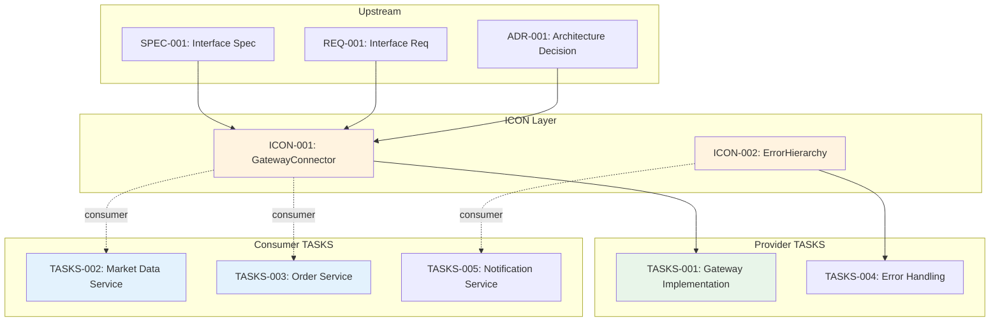

# Traceability Matrix: ICON-001 through ICON-NNN

## Document Control

| Item | Details |
|------|---------|
| Document ID | TRACEABILITY_MATRIX_ICON |
| Title | Comprehensive Implementation Contracts Traceability Matrix |
| Status | [Active/Draft] |
| Version | 1.0.0 |
| Date Created | YYYY-MM-DD |
| Author | [Team Name] |
| Purpose | Track bidirectional traceability for all Implementation Contract Documents |


---

**TAG-BASED AUTO-GENERATION AVAILABLE**

This traceability matrix can be automatically generated by scanning TASKS files for @icon:, @icon-role: tags.

**Recommended Approach:** Use tag-based auto-discovery instead of manual maintenance.

**Generate automatically using:**
```bash
# Extract tags from all files
python scripts/extract_tags.py --source docs/TASKS/ docs/ICON/ --output docs/generated/tags.json

# Validate tags against documents
python scripts/validate_tags_against_docs.py --tags docs/generated/tags.json --strict

# Generate ICON traceability matrix
python scripts/generate_traceability_matrices.py --type ICON --output docs/ICON/ICON-000_TRACEABILITY_MATRIX.md
```

**Benefits:**
- Single source of truth: Tags embedded in TASKS files
- Always up-to-date: Generated from current codebase
- No manual sync: Automated validation prevents drift
- Provider/consumer tracking: @icon-role tags clarify relationships

**Tag Format:**
- `@icon: ICON-001:ContractName` (contract reference)
- `@icon-role: provider` or `@icon-role: consumer`

See: [TRACEABILITY.md](../TRACEABILITY.md#tag-based-auto-discovery-alternative) for complete tag-based workflow.

---

## 1. Overview

### 1.1 Document Type Description
Implementation Contracts (ICON) define type-safe interfaces for parallel development. ICON documents enable multiple TASKS to develop concurrently by establishing stable, validated contracts between providers and consumers.

### 1.2 Coverage Scope
This matrix tracks all ICON contracts, mapping upstream specifications to provider/consumer TASKS and downstream code implementations.

### 1.3 Statistics
- **Total ICON Tracked**: [X] contracts
- **Total Providers**: [Y] TASKS files
- **Total Consumers**: [Z] TASKS files
- **Coverage Period**: [Start Date] to [End Date]
- **Last Updated**: YYYY-MM-DD

---

## 2. Required Tags (Cumulative Tagging Hierarchy - Layer 11)

### 2.1 Tag Requirements for ICON Artifacts

**Layer**: 11 (parallel to TASKS)
**Artifact Type**: ICON (Implementation Contracts)
**Required Tags**: `@spec`, `@req`, `@adr`
**Optional Tags**: `@impl`, `@ctr`
**Tag Count**: 3-5

### 2.2 Tag Format

```markdown
@spec: SPEC-018:interface-spec
@req: REQ-045:interface-requirement
@adr: ADR-033
@impl: IMPL-003:002
@ctr: CTR-005
@icon: ICON-001:ContractName
@icon-role: provider|consumer
```

**Format Rules**:
- Prefix: `@` symbol
- Artifact Type: lowercase (`spec`, `req`, `adr`, `icon`)
- Separator: colon `:` after artifact type, `:` between document ID and requirement ID
- Document ID: Standard format (e.g., `ICON-NNN`)
- Contract Name: PascalCase identifier
- Role Tag: `provider` or `consumer` (required in TASKS files)

### 2.3 Example: ICON with Required Tags

```markdown
# ICON-001: GatewayConnector

## 7. Traceability

### 7.1 Upstream Sources

**Required Tags** (Layer 11):
```markdown
@spec: SPEC-018:interface-spec
@req: REQ-045:connection-interface
@adr: ADR-033
```

### 7.2 Provider/Consumer Tags

**Provider TASKS**:
```markdown
@icon: ICON-001:GatewayConnector
@icon-role: provider
```

**Consumer TASKS**:
```markdown
@icon: ICON-001:GatewayConnector
@icon-role: consumer
```
```

### 2.4 Validation Rules

1. **Required**: Each ICON artifact MUST include @spec, @req, @adr tags
2. **Format Compliance**: All tags must follow `@artifact-type: DOC-ID:NNN` format
3. **Valid References**: All referenced documents and requirements must exist
4. **Bidirectional Tags**: Provider and consumer TASKS must have matching @icon tags
5. **Consumer Count**: Frontmatter consumer_count must match grep results

### 2.5 Tag Discovery

ICON tags can be discovered automatically:
```bash
# Find all ICONs and their provider/consumer TASKS
python scripts/extract_tags.py --type ICON --show-relationships

# Validate ICON-001 has bidirectional tags
python scripts/validate_tags_against_docs.py \
  --artifact ICON-001 \
  --verify-bidirectional \
  --strict

# Generate ICON traceability report
python scripts/generate_traceability_matrices.py \
  --type ICON \
  --show-provider-consumer
```

### 2.6 ICON Traceability Pattern

**Key Role**: ICON enables parallel development by defining stable interfaces between provider and consumer TASKS, with complete upstream traceability.

---

## 3. Contract Type Inventory

| Contract Type | Count | ICON IDs | Description |
|---------------|-------|----------|-------------|
| Protocol Interface | [X] | ICON-001, ICON-005 | typing.Protocol definitions |
| Exception Hierarchy | [X] | ICON-002, ICON-006 | Typed exceptions with error codes |
| State Machine | [X] | ICON-003 | Enum states with transitions |
| Data Model | [X] | ICON-004 | Pydantic/TypedDict schemas |
| DI Interface | [X] | ICON-007 | ABC classes for dependency injection |

---

## 4. Complete ICON Inventory

| ICON ID | Contract Name | Type | Providers | Consumers | Status | Date | Complexity |
|---------|---------------|------|-----------|-----------|--------|------|------------|
| ICON-001 | [ContractName] | Protocol | TASKS-001 | TASKS-002, TASKS-003 | Active | YYYY-MM-DD | 3/5 |
| ICON-002 | [ContractName] | Exception | TASKS-004 | TASKS-005 | Draft | YYYY-MM-DD | 2/5 |
| ICON-NNN | ... | ... | ... | ... | ... | ... | ... |

**Status Legend**:
- **Active**: Contract finalized, implementations in progress
- **Draft**: Contract under review
- **Deprecated**: Marked for removal (sunset period)
- **Superseded**: Replaced by newer version

---

## 5. Upstream Traceability (REQUIRED)

> **Traceability Rule**: Upstream traceability is REQUIRED for ICON documents. All ICON contracts MUST reference existing SPEC and REQ documents.

### 5.1 SPEC → ICON Traceability

| SPEC ID | SPEC Title | ICON IDs | Contract Names | Relationship |
|---------|------------|----------|----------------|--------------|
| SPEC-001 | [Technical specification] | ICON-001 | [ContractName] | Interface defined in SPEC |
| SPEC-002 | [Technical specification] | ICON-002, ICON-003 | [ContractName], [ContractName] | Multiple contracts from single SPEC |
| SPEC-NNN | ... | ... | ... | ... |

### 5.2 REQ → ICON Traceability

| REQ ID | REQ Title | ICON IDs | Contract Names | Relationship |
|--------|-----------|----------|----------------|--------------|
| REQ-001 | [Atomic requirement] | ICON-001 | [ContractName] | Requirement drives interface design |
| REQ-NNN | ... | ... | ... | ... |

### 5.3 Upstream Source Summary

| Source Type | Total Sources | ICON Derived | Coverage % |
|-------------|---------------|--------------|------------|
| SPEC | [X] | [Y] ICON | XX% |
| REQ | [X] | [Y] ICON | XX% |
| ADR | [X] | [Y] ICON | XX% |

---

## 6. Provider/Consumer Traceability

### 6.1 Provider TASKS → ICON

| ICON ID | Contract Name | Provider TASKS | Implementation Status | Validation |
|---------|---------------|----------------|----------------------|------------|
| ICON-001 | [ContractName] | TASKS-001 | Complete | mypy pass |
| ICON-002 | [ContractName] | TASKS-004 | In Progress | mypy pass |
| ICON-NNN | ... | ... | ... | ... |

### 6.2 Consumer TASKS → ICON

| ICON ID | Contract Name | Consumer TASKS | Integration Status | Mock Available |
|---------|---------------|----------------|-------------------|----------------|
| ICON-001 | [ContractName] | TASKS-002, TASKS-003 | Testing | Yes |
| ICON-002 | [ContractName] | TASKS-005 | Waiting | Yes |
| ICON-NNN | ... | ... | ... | ... |

### 6.3 Provider/Consumer Summary

| ICON ID | Contract Name | Provider Count | Consumer Count | Validation Status |
|---------|---------------|----------------|----------------|-------------------|
| ICON-001 | [ContractName] | 1 | 2 | Bidirectional tags verified |
| ICON-002 | [ContractName] | 1 | 1 | Bidirectional tags verified |
| ICON-NNN | ... | ... | ... | ... |

---

## 7. Downstream Traceability (OPTIONAL)

> **Traceability Rule**: Downstream traceability is OPTIONAL. Only add links to documents that already exist. Do NOT use placeholder IDs (TBD, XXX, NNN).

### 7.1 ICON → Code Traceability

| ICON ID | Contract Name | Implementation Files | Classes/Functions | LOC | Type Check |
|---------|---------------|---------------------|-------------------|-----|------------|
| ICON-001 | [ContractName] | src/contracts/gateway.py | GatewayConnector | 150 | mypy pass |
| ICON-002 | [ContractName] | src/contracts/exceptions.py | GatewayError, ... | 80 | mypy pass |
| ICON-NNN | ... | ... | ... | ... | ... |

### 7.2 ICON → Tests Traceability

| ICON ID | Contract Name | Test Files | Test Functions | Coverage % | Relationship |
|---------|---------------|------------|----------------|------------|--------------|
| ICON-001 | [ContractName] | tests/test_gateway_contract.py | test_protocol_compliance, ... | 100% | Contract validation |
| ICON-002 | [ContractName] | tests/test_exceptions.py | test_error_hierarchy, ... | 100% | Exception coverage |
| ICON-NNN | ... | ... | ... | ... | ... |

---

## 8. Contract Relationships



> **Note on Diagram Labels**: The above flowchart shows provider/consumer relationships. Solid arrows indicate provider relationships, dashed arrows indicate consumer dependencies.

### 8.1 Inter-ICON Dependencies

| Source ICON | Target ICON | Dependency Type | Description |
|-------------|-------------|-----------------|-------------|
| ICON-002 | ICON-001 | Exception handling | Error hierarchy used by gateway contract |
| ICON-NNN | ... | ... | ... |

---

## 9. Validation Metrics

### 9.1 Contract Quality

| ICON ID | Contract Name | Type Check | Runtime Check | Mock Coverage | Quality Score |
|---------|---------------|------------|---------------|---------------|---------------|
| ICON-001 | [ContractName] | mypy pass | isinstance pass | 100% | 10/10 |
| ICON-002 | [ContractName] | mypy pass | N/A | 100% | 9/10 |
| ICON-NNN | ... | ... | ... | ... | ... |

### 9.2 Bidirectional Tag Verification

| ICON ID | Contract Name | Provider Tags | Consumer Tags | Tag Sync Status |
|---------|---------------|---------------|---------------|-----------------|
| ICON-001 | [ContractName] | 1 verified | 2 verified | In Sync |
| ICON-002 | [ContractName] | 1 verified | 1 verified | In Sync |
| ICON-NNN | ... | ... | ... | ... |

---

## 10. Change Management

### 10.1 Version History by Contract

| ICON ID | Current Version | Breaking Changes | Deprecation Date | Sunset Date |
|---------|-----------------|------------------|------------------|-------------|
| ICON-001 | 1.0.0 | None | N/A | N/A |
| ICON-002 | 1.1.0 | v1.0→v1.1: Added field | N/A | N/A |
| ICON-NNN | ... | ... | ... | ... |

### 10.2 Pending Changes

| ICON ID | Proposed Change | Impact | Consumer Notification | Target Date |
|---------|-----------------|--------|----------------------|-------------|
| ICON-001 | Add async method | Minor | Sent YYYY-MM-DD | YYYY-MM-DD |
| ICON-NNN | ... | ... | ... | ... |

---

## 11. Gap Analysis

### 11.1 Missing Provider Implementations
- ICON-XXX: Missing provider TASKS (contract defined but not implemented)
- ICON-YYY: Provider incomplete (partial implementation)

### 11.2 Missing Consumer Integrations
- ICON-XXX: Consumer TASKS-YYY not using contract (direct implementation instead)
- ICON-ZZZ: Consumer missing @icon-role tag

### 11.3 Orphaned Contracts
- ICON-AAA: No active consumers (consider deprecation)
- ICON-BBB: Provider TASKS deleted (orphaned contract)

### 11.4 Tag Sync Issues
- ICON-CCC: consumer_count mismatch (frontmatter: 2, grep: 3)
- ICON-DDD: Missing bidirectional tags

---

## 12. Immediate Next Steps

### 12.1 Priority Actions
1. **Complete Provider Implementations**: [X] contracts need provider code
2. **Verify Consumer Integration**: [Y] consumers missing @icon tags
3. **Fix Tag Sync Issues**: [Z] contracts with bidirectional tag mismatches
4. **Deprecate Orphaned Contracts**: [N] contracts with no consumers

### 12.2 Validation Schedule

| Phase | ICON IDs | Focus Area | Target Date | Status |
|-------|----------|------------|-------------|--------|
| Phase 1 | ICON-001, ICON-002 | Provider validation | YYYY-MM-DD | Active |
| Phase 2 | ICON-003, ICON-004 | Consumer integration | YYYY-MM-DD | Planning |
| Phase 3 | All | Bidirectional tag audit | YYYY-MM-DD | Not Started |

---

## 13. Revision History

| Version | Date | Changes | Author |
|---------|------|---------|--------|
| 1.0.0 | YYYY-MM-DD | Initial creation | [Author Name] |

---

## 14. References

- **ICON Index**: [ICON-000_index.md](ICON-000_index.md)
- **ICON Template**: [ICON-TEMPLATE.md](ICON-TEMPLATE.md)
- **ICON Integration Workflow**: [ICON_INTEGRATION_WORKFLOW.md](ICON_INTEGRATION_WORKFLOW.md)
- **Complete Traceability Matrix**: [../TRACEABILITY_MATRIX_COMPLETE-TEMPLATE.md](../TRACEABILITY_MATRIX_COMPLETE-TEMPLATE.md)
- **Related Matrices**: [TASKS](../TASKS/TASKS-000_TRACEABILITY_MATRIX-TEMPLATE.md), [SPEC](../SPEC/SPEC-000_TRACEABILITY_MATRIX-TEMPLATE.md)
- **Implementation Contracts Guide**: [../TASKS/IMPLEMENTATION_CONTRACTS_GUIDE.md](../TASKS/IMPLEMENTATION_CONTRACTS_GUIDE.md)

---

## 15. Appendix A: Matrix Maintenance

### 15.1 Automated Generation
```bash
python ../scripts/generate_traceability_matrix.py \
  --type ICON \
  --input ../ICON/ \
  --template ICON-000_TRACEABILITY_MATRIX-TEMPLATE.md \
  --output TRACEABILITY_MATRIX_ICON.md \
  --scan-tasks-for-tags
```

### 15.2 Quality Checklist
- [ ] All ICON documents included in inventory
- [ ] Upstream SPEC/REQ/ADR sources documented
- [ ] Provider TASKS mapped with @icon-role: provider
- [ ] Consumer TASKS mapped with @icon-role: consumer
- [ ] consumer_count matches grep results
- [ ] Bidirectional tags verified
- [ ] Contract type categorization complete
- [ ] Inter-ICON dependencies identified
- [ ] Gap analysis identifies orphaned contracts
- [ ] Change management tracking current
