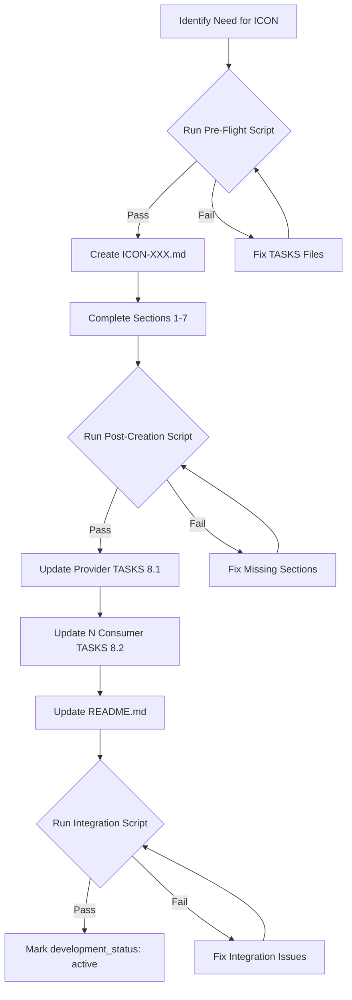

# =============================================================================
# 📋 Document Role: This is a DERIVATIVE of ICON-TEMPLATE.md
# - Authority: ICON-TEMPLATE.md is the single source of truth for ICON structure
# - Purpose: AI guidance for document creation (derived from template)
# - On conflict: Defer to ICON-TEMPLATE.md
# =============================================================================
---
title: ICON Creation Rules
tags:
  - framework-guide
  - implementation-contract
  - layer-11-artifact
  - decision-criteria
custom_fields:
  document_type: creation-rules
  artifact_type: ICON
  layer: 11
  architecture_approaches: [ai-agent-based, traditional-8layer]
  priority: shared
  development_status: active
---

# ICON Creation Rules

## Table of Contents

1. [Purpose](#purpose)
2. [Decision Matrix](#decision-matrix)
3. [Detailed Decision Rules](#detailed-decision-rules)
4. [Decision Examples](#decision-examples)
5. [Migration Strategy](#migration-strategy)
6. [Anti-Patterns](#anti-patterns)
7. [Governance](#governance)
8. [Enforcement Mechanisms](#enforcement-mechanisms)
9. [Common Violations and Fixes](#common-violations-and-fixes)
10. [Upstream Artifact Verification Process](#10-upstream-artifact-verification-process)
11. [References](#references)
12. [Document Metadata](#document-metadata)
13. [Cross-Document Validation](#13-cross-document-validation-mandatory)

---

## Purpose

Decision framework for when to create standalone ICON files versus embedding implementation contracts in TASKS files.

**Default**: Embed contracts in TASKS files (section 8: Implementation Contracts)

---

## Decision Matrix

### Use Standalone ICON Files When

**Criteria** (ALL must be met):

| Criterion | Threshold | Rationale |
|-----------|-----------|-----------|
| **Consumer Count** | 5+ TASKS files | High coordination overhead |
| **Contract Size** | >500 lines | Too large to embed cleanly |
| **Scope** | Platform-level | Shared across multiple components |
| **Projects** | Cross-project usage | Needs central management |

**Example**: Platform event bus used by 8 TASKS across 3 projects with 600-line protocol definition → Standalone ICON file

### Embed in TASKS Files When

**Criteria** (ANY condition):

| Criterion | Threshold | Rationale |
|-----------|-----------|-----------|
| **Consumer Count** | <5 TASKS files | Low coordination overhead |
| **Contract Size** | <500 lines | Fits cleanly in TASKS |
| **Scope** | Component-level | Single component boundary |
| **Projects** | Single project | No cross-project sharing |

**Example**: Gateway connector used by 3 TASKS within single project with 200-line protocol → Embed in TASKS-01

---

## Detailed Decision Rules

### Rule 1: Consumer Count

**5+ Consumers → Standalone ICON**:
- High coordination overhead
- Central change management required
- Breaking changes impact many TASKS
- Single source of truth critical

**<5 Consumers → Embed in TASKS**:
- Low coordination overhead
- Direct communication between teams
- Changes easily coordinated
- Less management overhead

### Rule 2: Contract Size

**>500 Lines → Standalone ICON**:
- Too large to embed in TASKS
- Overwhelming TASKS document
- Difficult to maintain inline
- Better as separate artifact

**<500 Lines → Embed in TASKS**:
- Manageable inline size
- Self-contained TASKS file
- Easier to review together
- Reduced file proliferation

### Rule 3: Scope Level

**Platform-Level → Standalone ICON**:
- Shared across multiple components
- System-wide impact
- Architectural significance
- Needs formal governance

**Component-Level → Embed in TASKS**:
- Single component boundary
- Local implementation detail
- Minimal architectural impact
- Lightweight management

### Rule 4: Project Scope

**Cross-Project → Standalone ICON**:
- Multiple projects depend on contract
- Shared infrastructure
- Requires versioning strategy
- Central maintenance

**Single Project → Embed in TASKS**:
- Project-specific contract
- No external dependencies
- Simpler lifecycle
- Project-local management

---

## Decision Examples

### Example 1: Gateway Connector (Embed in TASKS)

**Analysis**:
- Consumer Count: 3 TASKS files ❌ (<5)
- Contract Size: 200 lines ❌ (<500)
- Scope: Component-level ❌
- Projects: Single project ❌

**Decision**: Embed in TASKS-01
**Rationale**: Small contract with few consumers, component-level scope

### Example 2: Platform Event Bus (Standalone ICON)

**Analysis**:
- Consumer Count: 8 TASKS files ✅ (>5)
- Contract Size: 600 lines ✅ (>500)
- Scope: Platform-level ✅
- Projects: 3 projects ✅

**Decision**: Create ICON-02
**Rationale**: Large contract with many consumers across multiple projects

### Example 3: Order Execution Protocol (Standalone ICON)

**Analysis**:
- Consumer Count: 6 TASKS files ✅ (>5)
- Contract Size: 350 lines ❌ (<500)
- Scope: Platform-level ✅
- Projects: Single project ❌

**Decision**: Borderline - Consider future growth
**Recommendation**:
- Start: Embed in TASKS if stable
- Migrate: To ICON if grows or adds consumers

### Example 4: Market Data Exception Hierarchy (Embed in TASKS)

**Analysis**:
- Consumer Count: 2 TASKS files ❌ (<5)
- Contract Size: 150 lines ❌ (<500)
- Scope: Component-level ❌
- Projects: Single project ❌

**Decision**: Embed in TASKS-03
**Rationale**: Small exception hierarchy with few consumers

---

## Migration Strategy

### When to Migrate from TASKS to ICON

**Triggers**:
1. Consumer count reaches 5+
2. Contract size exceeds 500 lines
3. Cross-project usage emerges
4. Platform-level significance recognized

**Process**:
1. Create ICON file from embedded contract
2. Assign ICON-NN ID
3. Update ICON-00_index.md registry
4. Update all TASKS files to reference ICON
5. Archive embedded versions
6. Notify all stakeholders

### When to Migrate from ICON to TASKS

**Triggers**:
1. Consumer count drops below 3
2. Contract size shrinks below 300 lines
3. Single project usage only
4. Component-level scope identified

**Process**:
1. Identify primary provider TASKS
2. Embed contract in provider TASKS
3. Update consumer TASKS references
4. Deprecate ICON file
5. Update ICON-00_index.md registry
6. Archive ICON after transition period

---

## Anti-Patterns

### ❌ Premature ICON Creation

**Problem**: Creating ICON files for small contracts with few consumers
**Impact**: File proliferation, management overhead
**Solution**: Start with embedded contracts, migrate when criteria met

### ❌ ICON Avoidance

**Problem**: Keeping large contracts embedded despite 10+ consumers
**Impact**: Difficult coordination, version conflicts, maintenance burden
**Solution**: Migrate to ICON when thresholds exceeded

### ❌ Inconsistent Criteria

**Problem**: Creating ICON files without following decision matrix
**Impact**: Arbitrary decisions, inconsistent architecture
**Solution**: Always apply decision matrix, document exceptions

### ❌ Missing Migration

**Problem**: Not migrating contracts when criteria change
**Impact**: Technical debt accumulation, maintenance issues
**Solution**: Regular review of embedded contracts, proactive migration

---

## Governance

### Review Process

**Quarterly Review**:
1. Audit all embedded contracts in TASKS files
2. Identify contracts meeting ICON criteria
3. Plan migration for threshold-exceeding contracts
4. Review existing ICON files for relevance

**Metrics to Track**:
- Consumer count per contract
- Contract size (lines of code)
- Cross-project usage
- Change frequency
- Breaking change incidents

### Exception Handling

**When to Override Rules**:
1. Architectural significance (strategic contract)
2. External compliance requirements
3. Performance-critical interfaces
4. Legacy system integration points

**Exception Process**:
1. Document rationale in contract
2. Record in ICON-00_index.md
3. Review exception in quarterly audit
4. Re-evaluate when conditions change

---

## Enforcement Mechanisms

### Validation Gates

| Gate | Timing | Script | Failure Action |
|------|--------|--------|----------------|
| Pre-Flight | Before ICON creation | `preflight_icon_creation.sh` | Block creation, fix TASKS first |
| Post-Creation | After section 7 complete | `validate_icon_complete.sh` | Block "active" status |
| Integration | After TASKS updates | `validate_icon_integration.sh` | Block merge to main branch |

### Mandatory Validation Workflow



### Validation Script Requirements

**Pre-Flight Script** (`scripts/preflight_icon_creation.sh`):
- Accepts: `ICON-XXX` and `TASKS-XXX` (provider)
- Validates:
  - Provider TASKS exists with section 8.1
  - Consumer count calculated via grep
  - No self-reference detected
  - No duplicate ICON-XXX in docs/ICON/
- Exit code: 0 (pass) or 1 (fail with error message)

**Post-Creation Script** (`scripts/validate_icon_complete.sh`):
- Accepts: `ICON-XXX`
- Validates:
  - YAML frontmatter present with all 9 fields
  - All 10 contract sections present
  - Consumer count matches grep results
  - Performance requirements present (if contract_type requires)
  - Mock implementation template present (if Protocol)
- Exit code: 0 (pass) or 1 (fail with error message)

**Integration Script** (`scripts/validate_icon_integration.sh`):
- Accepts: `ICON-XXX`
- Validates:
  - Provider TASKS has @icon tag in section 8.1
  - N consumer TASKS have @icon tags in section 8.2
  - README.md active contracts table updated
  - Bidirectional traceability complete
- Exit code: 0 (pass) or 1 (fail with error message)

---

## Common Violations and Fixes

| Violation | Detection | Fix Procedure | Prevention |
|-----------|-----------|---------------|------------|
| **Orphaned ICON** | 0 TASKS references | See ICON_ERROR_RECOVERY.md §2.1 | Run pre-flight script |
| **Consumer Count Mismatch** | grep ≠ frontmatter | Run `grep -r "@icon: ICON-XXX" \| wc -l`, update frontmatter | Use grep in step 5 |
| **Self-Reference** | Provider in consumer list | Remove section 8.2 from provider TASKS | Check pre-flight output |
| **Missing YAML** | No frontmatter | Copy from ICON-TEMPLATE.md lines 1-15 | Use template |
| **Incomplete Sections** | < 10 sections | See ICON_ERROR_RECOVERY.md §2.5 | Use template checklist |
| **Wrong Contract Type** | Type doesn't match content | Update custom_fields.contract_type | Review before creation |
| **No Mock Template** | Protocol without mock | Add section 6 from ICON-01 | Check template requirements |
| **Missing Performance** | State/Protocol without perf | Add section 4 from ICON-006 | Check contract type rules |

### Metrics Tracking

**ICON Health Metrics**:
```bash
# Calculate ICON completion rate
total_icons=$(ls docs/ICON/ICON-*.md | wc -l)
complete_icons=$(./scripts/validate_all_icons.sh | grep "✓ PASS" | wc -l)
completion_rate=$((complete_icons * 100 / total_icons))

# Calculate consumer count accuracy
grep -r "consumer_count:" docs/ICON/ | while read -r line; do
    icon_file=$(echo "$line" | cut -d: -f1)
    declared_count=$(echo "$line" | cut -d: -f3 | xargs)
    icon_id=$(basename "$icon_file" .md)
    actual_count=$(grep -r "@icon: $icon_id" docs/TASKS/ | wc -l)
    if [ "$declared_count" -ne "$actual_count" ]; then
        echo "MISMATCH: $icon_id (declared=$declared_count, actual=$actual_count)"
    fi
done
```

---

## 10. Upstream Artifact Verification Process

### Before Creating This Document

**Step 1: Inventory Existing Upstream Artifacts**

```bash
# List existing upstream artifacts for this layer
ls -la docs/BRD/    # Layer 1
ls -la docs/PRD/    # Layer 2
ls -la docs/EARS/   # Layer 3
ls -la docs/BDD/    # Layer 4
ls -la docs/ADR/    # Layer 5
ls -la docs/SYS/    # Layer 6
ls -la docs/REQ/    # Layer 7
# ... continue for applicable layers
```

**Step 2: Map Existing Documents to Traceability Tags**

| Tag | Required for This Layer | Existing Document | Action |
|-----|------------------------|-------------------|--------|
| @brd | Yes/No | BRD-01 or null | Reference/Create/Skip |
| @prd | Yes/No | PRD-01 or null | Reference/Create/Skip |
| ... | ... | ... | ... |

**Step 3: Decision Rules**

| Situation | Action |
|-----------|--------|
| Upstream exists | Reference with exact document ID |
| Upstream required but missing | Skip that functionality - do NOT implement |
| Upstream optional and missing | Use `null` in traceability tag |
| Upstream not applicable | Omit tag entirely |

### Traceability Tag Rules

- **NEVER** use placeholder IDs like `BRD-XXX` or `TBD`
- **NEVER** reference documents that don't exist
- **ALWAYS** verify document exists before adding reference
- **USE** `null` only when artifact type is genuinely not applicable


## References

### Internal Documentation
- [IMPLEMENTATION_CONTRACTS_GUIDE.md](../TASKS/IMPLEMENTATION_CONTRACTS_GUIDE.md)
- [ICON-00_index.md](./ICON-00_index.md)
- [ICON-TEMPLATE.md](./ICON-TEMPLATE.md)
- [ICON_INTEGRATION_WORKFLOW.md](./ICON_INTEGRATION_WORKFLOW.md)
- [ICON_ERROR_RECOVERY.md](./ICON_ERROR_RECOVERY.md)
- [TASKS-TEMPLATE.md](../TASKS/TASKS-TEMPLATE.md)

### Decision Examples
- Example 1: Gateway Connector (embedded)
- Example 2: Platform Event Bus (ICON)
- Example 3: Order Execution Protocol (borderline)
- Example 4: Market Data Exceptions (embedded)

---

## Document Metadata

**Version**: 1.0.0
**Created**: 2025-11-25
**Last Updated**: 2025-11-25
**Document Type**: Decision Framework
**Complexity**: 2/5
**Token Count**: ~2,000 tokens

---

## 13. Cross-Document Validation (MANDATORY)

**CRITICAL**: Execute cross-document validation IMMEDIATELY after creating any ICON (Implementation Contract) document. Do NOT proceed until validation passes.

### Automatic Validation Loop

```
LOOP:
  1. Run: python scripts/validate_cross_document.py --document {doc_path} --auto-fix
  2. IF errors fixed: GOTO LOOP (re-validate)
  3. IF warnings fixed: GOTO LOOP (re-validate)
  4. IF unfixable issues: Log for manual review, continue
  5. IF clean: Mark VALIDATED, proceed
```

### Validation Command

```bash
# Per-document validation (Phase 1)
python scripts/validate_cross_document.py --document docs/ICON/ICON-NN_slug.md --auto-fix

# Layer validation (Phase 2) - run when all ICON documents complete
python scripts/validate_cross_document.py --layer ICON --auto-fix
```

### Layer-Specific Upstream Requirements

| This Layer | Required Upstream Tags | Tag Count |
|------------|------------------------|-----------|
| ICON (Layer 11, shared with TASKS) | @brd through @tasks | 8-10 |

### Auto-Fix Actions (No Confirmation Required)

| Issue | Fix Action |
|-------|------------|
| Missing @brd through @tasks tag | Add with upstream document reference |
| Invalid tag format | Correct to TYPE.NN.TT.SS or TYPE-NN format |
| Broken link | Recalculate path from current location |
| Missing traceability section | Insert from template |

### Validation Codes Reference

| Code | Description | Severity |
|------|-------------|----------|
| XDOC-001 | Referenced requirement ID not found | ERROR |
| XDOC-002 | Missing cumulative tag | ERROR |
| XDOC-003 | Upstream document not found | ERROR |
| XDOC-006 | Tag format invalid | ERROR |
| XDOC-007 | Gap in cumulative tag chain | ERROR |
| XDOC-009 | Missing traceability section | ERROR |

### Quality Gate

**Blocking**: YES - Cannot proceed to implementation until Phase 1 validation passes with 0 errors.
