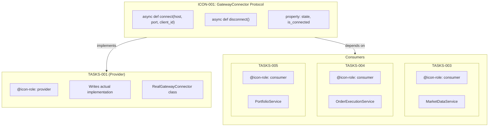
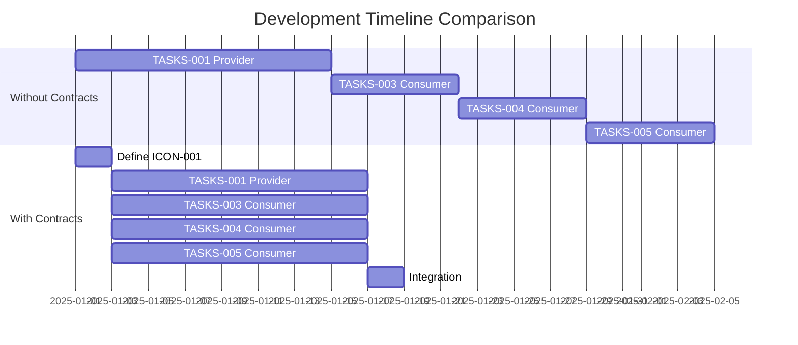
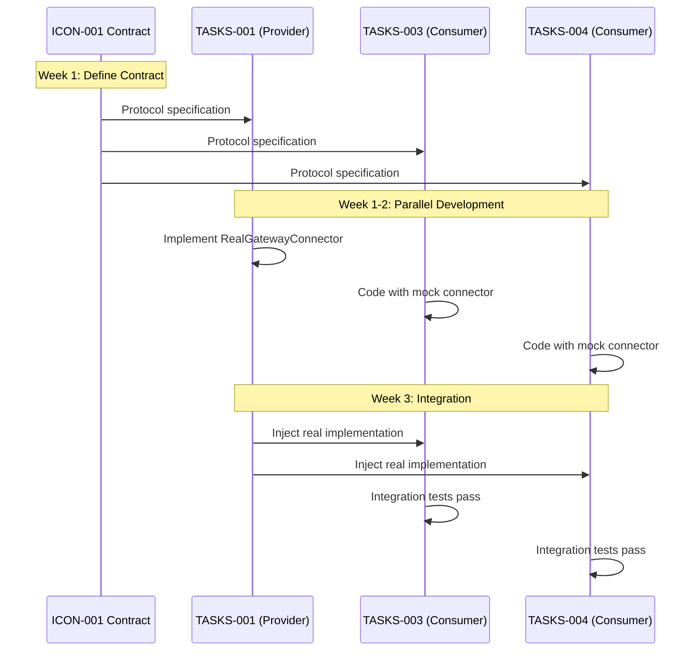

# ICON Directory

**Purpose**: Standalone Implementation Contract files for Layer 11 (TASKS) parallel development coordination.

**⚠️ IMPORTANT**: Most implementation contracts should be embedded in TASKS files. Use standalone ICON files only when criteria are met (see ICON_CREATION_RULES.md).

## Integration Workflow (CRITICAL)

### Step-by-Step Process

1. **Identify Need**: TASKS file analysis shows 3+ downstream dependencies
2. **Create ICON File**: Use ICON-TEMPLATE.md
3. **Update Provider TASKS**: Add section 8.1 with contract details
4. **Update Consumer TASKS**: Add section 8.2 to each consumer
5. **Validate Integration**: Run validation commands
6. **Mark ICON as Active**: Only after validation passes

### Validation Commands

**Before marking ICON as Active, run these commands**:

```bash
# Navigate to project root
cd /opt/data/ibmcp/

# Check total references (must equal 1 provider + N consumers)
grep -r "@icon: ICON-XXX" docs/TASKS/ | wc -l

# Verify provider role exists
grep -r "@icon-role: provider" docs/TASKS/ | grep "ICON-XXX"

# Verify consumer roles exist (count must equal N consumers)
grep -r "@icon-role: consumer" docs/TASKS/ | grep "ICON-XXX" | wc -l

# Check no orphaned ICON files
for icon in ICON-001 ICON-002 ICON-003; do
  count=$(grep -r "@icon: $icon" docs/TASKS/ | wc -l)
  if [ $count -eq 0 ]; then
    echo "ERROR: $icon is orphaned (0 TASKS references)"
  else
    echo "OK: $icon has $count TASKS references"
  fi
done
```

### Anti-Pattern Prevention

❌ **NEVER**: Create ICON file and stop
❌ **NEVER**: Skip TASKS file updates
❌ **NEVER**: Mark ICON as "Active" before validation

✅ **ALWAYS**: Complete full integration workflow
✅ **ALWAYS**: Validate bidirectional traceability
✅ **ALWAYS**: Run validation commands before marking Active

---

## Directory Contents

| File | Purpose |
|------|---------|
| **ICON-000_index.md** | Contract registry and quick reference |
| **ICON-TEMPLATE.md** | Template for creating new contracts |
| **ICON_CREATION_RULES.md** | Decision framework for ICON vs embedded |
| **README.md** | This file - directory overview |

**Contract Files**: `ICON-NNN_descriptive_name.md` (created as needed)

---

## Quick Start

### 8-Step ICON Creation Workflow

**Prerequisites**: Provider TASKS file complete with dependencies identified

1. **Pre-Flight Validation** (5 min):
   ```bash
   ./scripts/preflight_icon_creation.sh ICON-XXX TASKS-XXX
   # Must show: ✓ All checks passed
   ```

2. **Create ICON File** (30 min):
   - Copy `ICON-TEMPLATE.md` to `docs/ICON/ICON-XXX_descriptive_name.md`
   - Update YAML frontmatter with correct provider_tasks and consumer_count
   - Complete sections 1-10 using template guidance

3. **Post-Creation Validation** (2 min):
   ```bash
   ./scripts/validate_icon_complete.sh ICON-XXX
   # Must show: ✓ All sections complete
   ```

4. **Update Provider TASKS** (5 min):
   - Open provider TASKS file (e.g., `docs/TASKS/TASKS-XXX.md`)
   - Add section 8.1 with @icon tag:
     ```markdown
     ## 8. Implementation Contracts

     ### 8.1 Provided Contracts

     @icon: ICON-XXX:ContractName
     @icon-role: provider
     ```

5. **Update Consumer TASKS** (5 min × N):
   - For each of N consumer TASKS files:
     ```markdown
     ### 8.2 Consumed Contracts

     @icon: ICON-XXX:ContractName
     @icon-role: consumer
     ```

6. **Update README** (2 min):
   - Add row to "Active Contracts" table in `docs/ICON/README.md`

7. **Integration Validation** (2 min):
   ```bash
   ./scripts/validate_icon_integration.sh ICON-XXX
   # Must show: ✓ Bidirectional traceability complete
   ```

8. **Activate Contract** (1 min):
   - Update YAML frontmatter: `development_status: active`
   - Commit all 8 files atomically

**Total time**: ~50 minutes + (5 min × N consumers)

### Success Criteria

- [ ] All 3 validation scripts pass (exit code 0)
- [ ] Consumer count matches grep results exactly
- [ ] No self-references detected
- [ ] All 10 contract sections present
- [ ] Bidirectional @icon tags verified
- [ ] README.md updated
- [ ] development_status set to "active"

### Using Existing ICON Files

**Provider TASKS** (implements contract):
```markdown
## 8. Implementation Contracts

@icon: ICON-001:GatewayConnector
@icon-role: provider

See [ICON-001_gateway_connector.md](../../ai_dev_flow/ICON/ICON-001_gateway_connector.md)
```

**Consumer TASKS** (depends on contract):
```markdown
## 3. Dependencies

@icon: ICON-001:GatewayConnector
@icon-role: consumer

Requires GatewayConnector protocol for gateway connections.
```

---

## Troubleshooting

### Common Errors and Solutions

| Error | Symptom | Solution | Reference |
|-------|---------|----------|-----------|
| **Orphaned ICON** | 0 TASKS references found | Add @icon tags to provider/consumer TASKS | ICON_ERROR_RECOVERY.md §2.1 |
| **Consumer Count Mismatch** | grep count ≠ frontmatter | Update frontmatter with: `grep -r "@icon: ICON-XXX" docs/TASKS/ \| wc -l` | ICON_ERROR_RECOVERY.md §2.2 |
| **Self-Reference** | Provider TASKS has section 8.2 | Remove section 8.2, keep only 8.1 | ICON_ERROR_RECOVERY.md §2.3 |
| **Missing YAML** | No frontmatter in ICON file | Copy lines 1-15 from ICON-TEMPLATE.md | ICON_ERROR_RECOVERY.md §2.4 |
| **Incomplete Sections** | < 10 sections in ICON | Use ICON-TEMPLATE.md checklist | ICON_ERROR_RECOVERY.md §2.5 |
| **Pre-Flight Fail** | Script exits with error | Fix TASKS files before creating ICON | ICON_CREATION_RULES.md §4.1 |
| **No Mock Template** | Protocol without section 6 | Add mock from ICON-001 example | ICON-TEMPLATE.md §6 |

### Validation Script Debugging

**Pre-Flight Script Failures**:
```bash
# Show detailed output
./scripts/preflight_icon_creation.sh ICON-XXX TASKS-XXX --verbose

# Common fixes:
# - "Provider TASKS not found" → Create TASKS-XXX.md first
# - "No consumer TASKS identified" → Add section 3.2 dependencies to TASKS-XXX
# - "Self-reference detected" → Remove TASKS-XXX from consumer list
```

**Post-Creation Script Failures**:
```bash
# Show missing sections
./scripts/validate_icon_complete.sh ICON-XXX --show-missing

# Common fixes:
# - "YAML frontmatter missing" → Add lines 1-15 from template
# - "Consumer count mismatch" → Run grep and update frontmatter
# - "Section X missing" → Add section using template
```

**Integration Script Failures**:
```bash
# Show traceability gaps
./scripts/validate_icon_integration.sh ICON-XXX --show-gaps

# Common fixes:
# - "Provider TASKS missing @icon tag" → Add section 8.1
# - "Consumer TASKS-YYY missing @icon tag" → Add section 8.2
# - "README.md not updated" → Add row to active contracts table
```

---

## File Naming Convention

**Format**: `ICON-NNN_descriptive_name.md`

**Rules**:
- **ICON-NNN**: Sequential numbering starting from 001
- **descriptive_name**: Lowercase with underscores
- **Extension**: Always `.md`

**Examples**:
- `ICON-001_gateway_connector_protocol.md`
- `ICON-002_external_data_event_bus.md`
- `ICON-003_order_execution_exceptions.md`
- `ICON-004_resource_state_machine.md`

---

## Traceability Tags

### Tag Format

**Contract Definition**:
```yaml
@icon: ICON-NNN:ContractName
```

**With Role** (in TASKS files):
```yaml
@icon: ICON-001:GatewayConnector
@icon-role: provider
```

```yaml
@icon: ICON-001:GatewayConnector
@icon-role: consumer
```

### Role Types

| Role | Description | Usage |
|------|-------------|-------|
| `provider` | Implements the contract | TASKS file defining implementation |
| `consumer` | Depends on the contract | TASKS files using contract |
| (no role) | Reference only | Documentation references |

---

## Providers vs Consumers

### Conceptual Overview

Think of ICON contracts like a **power outlet standard**:

| Role | Analogy | ICON Context |
|------|---------|--------------|
| **Provider** | Power company that builds outlets to spec | TASKS that **implements** the contract interface |
| **Consumer** | Devices that plug into outlets | TASKS that **uses/depends on** the contract |

### Architecture Diagram



### Provider (1 per contract)

**Definition**: The TASKS file responsible for **implementing** the contract interface.

**Responsibilities**:
- Write the actual code that fulfills the protocol
- Implement all methods defined in the contract
- Honor all type signatures
- Raise specified exceptions
- Pass `mypy --strict` validation

**TASKS Reference Example**:
```markdown
# TASKS-001: Gateway Connection Service

## 8.1 Contracts Provided

@icon: ICON-001:GatewayConnector
@icon-role: provider

This TASKS implements the GatewayConnector protocol.
```

**Implementation Example**:
```python
class RealGatewayConnector:
    """Actual implementation of GatewayConnector protocol."""

    async def connect(self, host: str, port: int, client_id: int) -> None:
        # Real connection logic here
        ...

    async def disconnect(self) -> None:
        # Real disconnection logic
        ...
```

### Consumer (N per contract)

**Definition**: TASKS files that **depend on** and **use** the contract interface.

**Responsibilities**:
- Import protocol type only (not implementation)
- Type hint all protocol references
- Handle all specified exceptions
- Work with any implementation that matches the protocol

**TASKS Reference Example**:
```markdown
# TASKS-003: Market Data Service

## 8.2 Contracts Consumed

@icon: ICON-001:GatewayConnector
@icon-role: consumer

Requires GatewayConnector for market data subscriptions.
```

**Usage Example**:
```python
class MarketDataService:
    """Consumes GatewayConnector - doesn't implement it."""

    def __init__(self, connector: GatewayConnector):  # Type hint only
        self._connector = connector  # Injected dependency

    async def subscribe(self, symbol: str) -> None:
        if not self._connector.is_connected:
            await self._connector.connect("localhost", 7497, 1)
        # Use connector without knowing implementation details
```

### Key Differences

| Aspect | Provider | Consumer |
|--------|----------|----------|
| **Count** | Exactly 1 | 0 to N |
| **Action** | Implements interface | Uses interface |
| **Knowledge** | Knows implementation details | Only knows contract |
| **Dependency** | None on consumers | Depends on provider |
| **Testing** | Unit tests for compliance | Integration tests with mocks |
| **Breaking changes** | Must notify all consumers | Must adapt to changes |

### Parallel Development Benefit



**Without contracts**: Sequential development (5+ weeks)
**With contracts**: Parallel development (2.5 weeks) = **50%+ faster**

### Workflow Sequence



### Validation Commands

```bash
# Verify exactly 1 provider exists
grep -r "@icon-role: provider" docs/TASKS/ | grep "ICON-001"

# Count consumers (should be N)
grep -r "@icon-role: consumer" docs/TASKS/ | grep "ICON-001" | wc -l

# Total references should equal 1 provider + N consumers
grep -r "@icon: ICON-001" docs/TASKS/ | wc -l

# Validate no orphaned ICON (must have provider + at least 1 consumer)
for icon in ICON-001 ICON-002; do
  provider=$(grep -r "@icon-role: provider" docs/TASKS/ | grep "$icon" | wc -l)
  consumers=$(grep -r "@icon-role: consumer" docs/TASKS/ | grep "$icon" | wc -l)
  echo "$icon: $provider provider(s), $consumers consumer(s)"
  if [ $provider -ne 1 ]; then
    echo "  ERROR: Must have exactly 1 provider"
  fi
  if [ $consumers -lt 1 ]; then
    echo "  WARNING: No consumers found"
  fi
done
```

---

## Contract Types

### 1. Protocol Interfaces

**Purpose**: Type-safe service interfaces
**Use Case**: Async/sync services, plugin architectures, adapter patterns
**Example**: GatewayConnector, MarketDataProvider

### 2. Exception Hierarchies

**Purpose**: Typed exception handling
**Use Case**: Error classification, retry logic, circuit breakers
**Example**: GatewayException, OrderException

### 3. State Machine Contracts

**Purpose**: Valid state transitions
**Use Case**: Connection states, order lifecycle, session management
**Example**: ConnectionState, OrderState

### 4. Data Models

**Purpose**: Validated data structures
**Use Case**: API requests/responses, events, configuration
**Example**: MarketDataEvent, OrderRequest

### 5. Dependency Injection Interfaces

**Purpose**: DI container interfaces
**Use Case**: Service factories, repository patterns
**Example**: ServiceProvider, RepositoryFactory

---

## Lifecycle Management

### Active Phase

**Responsibilities**:
- Track version changes
- Maintain provider/consumer lists
- Monitor usage patterns
- Coordinate breaking changes

**Versioning** (Semantic):
- **Major**: Breaking changes (signature changes, removed methods)
- **Minor**: Backward-compatible additions (new optional parameters)
- **Patch**: Documentation updates, clarifications

### Deprecation Phase

**Process**:
1. Announce deprecation (6-month notice)
2. Provide migration guide
3. Update status to "Deprecated" in ICON-000_index.md
4. Monitor consumer migration progress
5. Archive after all consumers migrate

**Communication**:
- Update contract file with deprecation notice
- Notify all provider/consumer TASKS owners
- Document migration path
- Provide timeline for sunset

---

## Best Practices

### ✅ Do

- **Validate criteria** before creating ICON files
- **Use semantic versioning** for contract changes
- **Document all changes** in version history
- **Notify stakeholders** of breaking changes
- **Maintain registry** (ICON-000_index.md) current
- **Review quarterly** for relevance and usage

### ❌ Don't

- **Create ICON files prematurely** (start with embedded)
- **Skip migration** when criteria change
- **Make breaking changes** without notice
- **Forget to update registry** when creating contracts
- **Leave orphaned contracts** (no consumers)
- **Mix contract types** in single ICON file

---

## Integration with SDD Workflow

### Layer Position

**Layer 11**: TASKS (Task Breakdown)
- Bridges SPEC (Layer 10) and IPLAN (Layer 12)
- Coordinates parallel implementation
- Enables type-safe integration

### Relationship to Other Layers

**Layer 9 (CTR)**: External API contracts
- `@ctr:` tags reference external APIs
- ICON contracts are internal only

**Layer 11 (ICON)**: Internal implementation contracts
- `@icon:` tags reference implementation contracts
- Embedded in TASKS or standalone ICON

**Layer 12 (IPLAN)**: Implementation plans
- `@iplan:` tags reference execution plans
- Consume contracts defined in TASKS/ICON

---

## References

### Internal Documentation

**Primary Guides**:
- [IMPLEMENTATION_CONTRACTS_GUIDE.md](../TASKS/IMPLEMENTATION_CONTRACTS_GUIDE.md) - Comprehensive guide
- [ICON_CREATION_RULES.md](./ICON_CREATION_RULES.md) - Decision criteria
- [ICON-000_index.md](./ICON-000_index.md) - Contract registry
- [ICON-TEMPLATE.md](./ICON-TEMPLATE.md) - Contract template

**Related Artifacts**:
- [TASKS-TEMPLATE.md](../TASKS/TASKS-TEMPLATE.md) - Embedded contracts (default)
- [TRACEABILITY.md](../TRACEABILITY.md) - Traceability tags
- [ID_NAMING_STANDARDS.md](../ID_NAMING_STANDARDS.md) - Naming conventions
- [SPEC_DRIVEN_DEVELOPMENT_GUIDE.md](../SPEC_DRIVEN_DEVELOPMENT_GUIDE.md) - SDD workflow

### External Resources

- [PEP 544: Protocols](https://peps.python.org/pep-0544/) - Structural subtyping
- [PEP 589: TypedDict](https://peps.python.org/pep-0589/) - Typed dictionaries
- [mypy Documentation](https://mypy.readthedocs.io/) - Type checking
- [Pydantic Documentation](https://docs.pydantic.dev/) - Data validation

---

## Support

### Questions or Issues

**Documentation**:
- Check IMPLEMENTATION_CONTRACTS_GUIDE.md first
- Review ICON_CREATION_RULES.md for decisions
- Consult ICON-000_index.md for examples

**Unclear Criteria**:
- Apply decision matrix from ICON_CREATION_RULES.md
- Document exceptions with rationale
- Review in quarterly audit

**Migration Needs**:
- Follow migration strategy in ICON_CREATION_RULES.md
- Update all stakeholders
- Coordinate transition timing

---

## Document Metadata

**Version**: 1.1.0
**Created**: 2025-11-25
**Last Updated**: 2025-11-27
**Document Type**: Directory Overview
**Complexity**: 2/5
**Token Count**: ~4,500 tokens

### Change History

| Version | Date | Changes |
|---------|------|---------|
| 1.1.0 | 2025-11-27 | Added "Providers vs Consumers" section with Mermaid diagrams |
| 1.0.0 | 2025-11-25 | Initial version |
