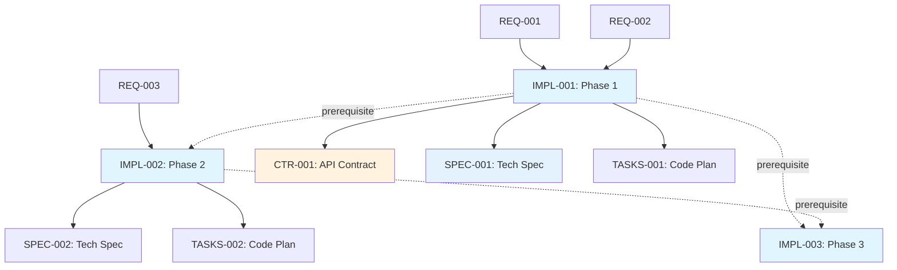

# Traceability Matrix: IMPL-001 through IMPL-NNN

## Document Control

| Item | Details |
|------|---------|
| Document ID | TRACEABILITY_MATRIX_IMPL |
| Title | Comprehensive Implementation Plans Traceability Matrix |
| Status | [Active/Draft] |
| Version | 1.0.0 |
| Date Created | YYYY-MM-DD |
| Author | [Team Name] |
| Purpose | Track bidirectional traceability for all Implementation Plan Documents |


---

**⚠️ TAG-BASED AUTO-GENERATION AVAILABLE**

This traceability matrix can be automatically generated by scanning code files for @impl:, @spec:, @test: tags.

**Recommended Approach:** Use tag-based auto-discovery instead of manual maintenance.

**Generate automatically using:**
```bash
# Extract tags from all files
python scripts/extract_tags.py --source src/ docs/ tests/ --output docs/generated/tags.json

# Validate tags against documents
python scripts/validate_tags_against_docs.py --tags docs/generated/tags.json --strict

# Generate IMPL traceability matrix
python scripts/generate_traceability_matrices.py --type IMPL --output docs/IMPL/IMPL-000_TRACEABILITY_MATRIX.md
```

**Benefits:**
- ✅ Single source of truth: Tags embedded in code
- ✅ Always up-to-date: Generated from current codebase
- ✅ No manual sync: Automated validation prevents drift
- ✅ Coverage metrics: Automatically calculated

**Tag Format:** `@impl: IMPL-001:NNN` (for multi-requirement docs) or `@impl: IMPL-001` (for single-doc refs)

See: [TRACEABILITY.md](../TRACEABILITY.md#tag-based-auto-discovery-alternative) for complete tag-based workflow.

---

## 1. Overview

### 1.1 Document Type Description
Implementation Plan Documents (IMPL) define project management aspects: WHO implements WHAT requirements, WHEN they deliver, and in what PHASES. IMPL bridges requirements (WHAT) and technical specifications (HOW).

### 1.2 Coverage Scope
This matrix tracks all IMPL documents, mapping upstream requirements to downstream specifications, contracts, tasks, and team deliverables.

### 1.3 Statistics
- **Total IMPL Tracked**: [X] documents
- **Total Phases**: [Y] phases
- **Total Teams**: [Z] teams
- **Coverage Period**: [Start Date] to [End Date]
- **Last Updated**: YYYY-MM-DD

---

---

## 2. Required Tags (Cumulative Tagging Hierarchy - Layer 8)

### 2.1 Tag Requirements for IMPL Artifacts

**Layer**: 8
**Artifact Type**: IMPL (Implementation Plans)
**Required Tags**: `@brd`, `@prd`, `@ears`, `@bdd`, `@adr`, `@sys`, `@req`
**Tag Count**: 7

### 2.2 Tag Format

```markdown
@brd: BRD-009:015, BRD-009:006
@prd: PRD-016:003
@ears: EARS-012:002
@bdd: BDD-015:001
@adr: ADR-033
@sys: SYS-012:001
@req: REQ-045:001
```

**Format Rules**:
- Prefix: `@` symbol
- Artifact Type: lowercase (`brd`, `prd`, `ears`, `bdd`, `adr`, `sys`, `req`)
- Separator: colon `:` after artifact type, `:` between document ID and requirement ID
- Document ID: Standard format (e.g., `IMPL-NNN`)
- Requirement ID: Specific requirement/section identifier
- Multiple Values: comma-separated for same artifact type

### 2.3 Example: IMPL with Required Tags

```markdown
# IMPL-003: Order Service Implementation Plan

## 7. Traceability

### 7.1 Upstream Sources

**Required Tags** (Cumulative Tagging Hierarchy - Layer 8):
```markdown
@brd: BRD-009:015, BRD-009:006
@prd: PRD-016:003
@ears: EARS-012:002
@bdd: BDD-015:001
@adr: ADR-033
@sys: SYS-012:001
@req: REQ-045:001
```

### 7.2 Downstream Artifacts
[Links to SPEC, TASKS, Code that reference this IMPL]
```

### 2.4 Validation Rules

1. **Required**: Each IMPL artifact MUST include at least one tag for each required layer
2. **Format Compliance**: All tags must follow `@artifact-type: DOC-ID:NNN` format
3. **Valid References**: All referenced documents and requirements must exist
4. **No Gaps**: Cannot skip any required upstream layer in the chain
5. **Tag Count**: Must have exactly 7 tags for Layer 8

### 2.5 Tag Discovery

IMPL tags can be discovered automatically:
```bash
# Find all IMPLs and their upstream tags
python scripts/extract_tags.py --type IMPL --show-all-upstream

# Validate IMPL-003 has required tags
python scripts/validate_tags_against_docs.py \
  --artifact IMPL-003 \
  --expected-layers brd,prd,ears,bdd,adr,sys,req \
  --strict

# Generate IMPL traceability report
python scripts/generate_traceability_matrices.py \
  --type IMPL \
  --show-coverage
```

### 2.6 IMPL Traceability Pattern

**Key Role**: IMPL plans phased implementation of atomic requirements, providing roadmap from requirements to code. (Optional layer - include only if exists in chain)

---

## 4. Complete IMPL Inventory

| IMPL ID | Title | Phase | Team | Status | Date | Upstream Sources | Downstream Artifacts |
|---------|-------|-------|------|--------|------|------------------|---------------------|
| IMPL-001 | [Implementation plan title] | Phase 1 | Team A | Active | YYYY-MM-DD | REQ-001, REQ-002, ADR-001 | CTR-001, SPEC-001, TASKS-001 |
| IMPL-002 | [Implementation plan title] | Phase 2 | Team B | Planning | YYYY-MM-DD | REQ-003, REQ-004 | SPEC-002, TASKS-002 |
| IMPL-NNN | ... | ... | ... | ... | ... | ... | ... |

---

## 5. Upstream Traceability (REQUIRED)

> **Traceability Rule**: Upstream traceability is REQUIRED for IMPL documents. All IMPL documents MUST reference existing BRD through REQ documents.

### 4.1 REQ → IMPL Traceability

| REQ ID | REQ Title | IMPL IDs | IMPL Titles | Relationship |
|--------|-----------|----------|-------------|--------------|
| REQ-001 | [Atomic requirement] | IMPL-001 | [Implementation plan] | Requirement assigned to implementation plan |
| REQ-002 | [Atomic requirement] | IMPL-001 | [Implementation plan] | Multiple requirements in same plan |
| REQ-NNN | ... | ... | ... | ... |

### 4.2 ADR → IMPL Traceability

| ADR ID | ADR Title | IMPL IDs | IMPL Titles | Relationship |
|--------|-----------|----------|-------------|--------------|
| ADR-001 | [Architecture decision] | IMPL-001 | [Implementation plan] | Architectural changes require implementation planning |
| ADR-NNN | ... | ... | ... | ... |

---

## 6. Downstream Traceability (OPTIONAL)

> **Traceability Rule**: Downstream traceability is OPTIONAL. Only add links to documents that already exist. Do NOT use placeholder IDs (TBD, XXX, NNN).

### 5.1 IMPL → CTR Traceability

| IMPL ID | IMPL Title | CTR IDs | CTR Titles | Relationship |
|---------|------------|---------|------------|--------------|
| IMPL-001 | [Implementation plan] | CTR-001, CTR-002 | [API contracts] | Implementation plan includes interface contracts |
| IMPL-NNN | ... | ... | ... | ... |

### 5.2 IMPL → SPEC Traceability

| IMPL ID | IMPL Title | SPEC IDs | SPEC Titles | Relationship |
|---------|------------|----------|-------------|--------------|
| IMPL-001 | [Implementation plan] | SPEC-001, SPEC-002 | [Technical specifications] | Implementation plan defines technical specifications |
| IMPL-NNN | ... | ... | ... | ... |

### 5.3 IMPL → TASKS Traceability

| IMPL ID | IMPL Title | TASKS IDs | TASKS Titles | Relationship |
|---------|------------|-----------|--------------|--------------|
| IMPL-001 | [Implementation plan] | TASKS-001, TASKS-002 | [Code generation plans] | Implementation plan broken into code generation tasks |
| IMPL-NNN | ... | ... | ... | ... |

### 5.4 IMPL → Code Traceability

| IMPL ID | IMPL Title | Code Deliverables | Relationship |
|---------|------------|-------------------|--------------|
| IMPL-001 | [Implementation plan] | src/module1.py, src/module2.py, tests/ | Implementation plan deliverables |
| IMPL-NNN | ... | ... | ... |

---

## 7. Implementation Organization

### 6.1 IMPL by Phase

| Phase | IMPL IDs | Total | Start Date | End Date | Status |
|-------|---------|-------|------------|----------|--------|
| Phase 1: MVP | IMPL-001, IMPL-002 | 2 | YYYY-MM-DD | YYYY-MM-DD | Complete |
| Phase 2: Features | IMPL-003, IMPL-004 | 2 | YYYY-MM-DD | YYYY-MM-DD | In Progress |
| Phase 3: Scale | IMPL-005 | 1 | YYYY-MM-DD | YYYY-MM-DD | Planning |

### 6.2 IMPL by Team

| Team | IMPL IDs | Total | Requirements | Deliverables | Status |
|------|---------|-------|--------------|--------------|--------|
| Team A: Backend | IMPL-001, IMPL-003 | 2 | [X] REQ | [Y] SPEC | On Track |
| Team B: Frontend | IMPL-002 | 1 | [X] REQ | [Y] SPEC | On Track |
| Team C: Integration | IMPL-004, IMPL-005 | 2 | [X] REQ | [Y] SPEC | Planning |

### 6.3 Resource Allocation

| IMPL ID | Team Size | Duration (days) | Dependencies | Status |
|---------|-----------|----------------|--------------|--------|
| IMPL-001 | 3 developers | 20 | None | Complete |
| IMPL-002 | 2 developers | 15 | IMPL-001 | In Progress |
| IMPL-003 | 4 developers | 30 | IMPL-001, IMPL-002 | Planning |
| IMPL-NNN | ... | ... | ... | ... |

---

## 8. Cross-IMPL Dependencies



> **Note on Diagram Labels**: The above flowchart shows the sequential workflow. For formal layer numbers used in cumulative tagging, always reference the 16-layer architecture (Layers 0-15) defined in README.md. Diagram groupings are for visual clarity only.

### 7.1 Inter-IMPL Dependencies

| Source IMPL | Target IMPL | Dependency Type | Description |
|-------------|-------------|-----------------|-------------|
| IMPL-001 | IMPL-002 | Prerequisite | Core platform required before features |
| IMPL-001 | IMPL-003 | Prerequisite | Authentication required before advanced features |
| IMPL-002 | IMPL-003 | Related | Features inform scaling requirements |
| IMPL-NNN | ... | ... | ... |

---

## 9. Milestone and Delivery Tracking

### 8.1 Implementation Milestones

| Milestone | Target Date | IMPL IDs | Deliverables | Status | Completion % |
|-----------|-------------|----------|--------------|--------|--------------|
| MVP Release | YYYY-MM-DD | IMPL-001, IMPL-002 | Core features | Complete | 100% |
| Feature Release | YYYY-MM-DD | IMPL-003, IMPL-004 | Enhanced features | In Progress | 60% |
| Scale Release | YYYY-MM-DD | IMPL-005, IMPL-006 | Performance optimization | Planning | 10% |

### 8.2 Deliverable Status

| IMPL ID | Total Deliverables | Completed | In Progress | Pending | Completion % |
|---------|-------------------|-----------|-------------|---------|--------------|
| IMPL-001 | 10 | 10 | 0 | 0 | 100% |
| IMPL-002 | 8 | 5 | 3 | 0 | 63% |
| IMPL-003 | 12 | 0 | 2 | 10 | 17% |
| IMPL-NNN | ... | ... | ... | ... | ... |

---

## 10. Implementation Status

### 9.1 IMPL Execution Progress

| IMPL ID | REQ Coverage | CTR Status | SPEC Status | TASKS Status | Code Status | Overall | Completion % |
|---------|--------------|------------|-------------|--------------|-------------|---------|--------------|
| IMPL-001 | 100% | ✅ | ✅ | ✅ | ✅ | Complete | 100% |
| IMPL-002 | 100% | N/A | 🟡 | 🟡 | 🟡 | In Progress | 60% |
| IMPL-003 | 80% | ⏳ | ⏳ | ⏳ | ⏳ | Planning | 20% |
| IMPL-NNN | ... | ... | ... | ... | ... | ... | ... |

### 9.2 Gap Analysis

**Missing Downstream Artifacts**:
- IMPL-XXX: Missing CTR (interfaces not defined)
- IMPL-YYY: Missing SPEC (technical specifications pending)
- IMPL-ZZZ: Missing TASKS (code generation plans not created)

**Blocked Implementation**:
- IMPL-003: Blocked by IMPL-001 completion
- IMPL-005: Blocked by resource availability

---

## 11. Immediate Next Steps

### 10.1 Priority Actions
1. **Complete In-Progress IMPL**: [X] implementation plans need completion
2. **Create Missing CTR**: [Y] plans need interface contracts
3. **Define SPEC for Pending IMPL**: [Z] plans need technical specifications
4. **Resolve Dependencies**: [N] blocked plans need prerequisite completion

### 10.2 Upcoming Sprints

| Sprint | IMPL IDs | Focus Area | Target Date |
|--------|----------|------------|-------------|
| Sprint 5 | IMPL-002 | Complete Phase 1 features | YYYY-MM-DD |
| Sprint 6 | IMPL-003 | Start Phase 2 implementation | YYYY-MM-DD |
| Sprint 7 | IMPL-004 | Phase 2 integration | YYYY-MM-DD |

---

## 12. Revision History

| Version | Date | Changes | Author |
|---------|------|---------|--------|
| 1.0.0 | YYYY-MM-DD | Initial creation | [Author Name] |

---

## 13. References

- **IMPL Index**: [IMPL-000_index.md](IMPL-000_index.md)
- **IMPL Template**: [IMPL-TEMPLATE.md](IMPL-TEMPLATE.md)
- **Complete Traceability Matrix**: [../TRACEABILITY_MATRIX_COMPLETE-TEMPLATE.md](../TRACEABILITY_MATRIX_COMPLETE-TEMPLATE.md)
- **Related Matrices**: [REQ](../REQ/REQ-000_TRACEABILITY_MATRIX-TEMPLATE.md), [CTR](../CTR/CTR-000_TRACEABILITY_MATRIX-TEMPLATE.md), [SPEC](../SPEC/SPEC-000_TRACEABILITY_MATRIX-TEMPLATE.md), [TASKS](../TASKS/TASKS-000_TRACEABILITY_MATRIX-TEMPLATE.md)
