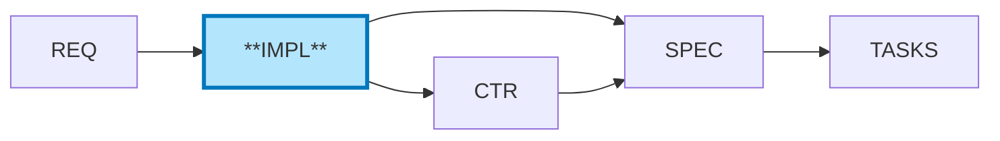

# IMPL-NNN: [Implementation Plan Title]

**⚠️ CRITICAL**: Always reference [SPEC_DRIVEN_DEVELOPMENT_GUIDE.md](../SPEC_DRIVEN_DEVELOPMENT_GUIDE.md) as the single source of truth for workflow steps, artifact definitions, and quality gates.

**[RESOURCE_INSTANCE - e.g., database connection, workflow instance]**: IMPL is in Layer 5 (Project Management Layer) - organizes WHO does WHAT, WHEN.

## Document Control

| Field | Value |
|-------|-------|
| **IMPL ID** | IMPL-NNN |
| **Title** | [Feature or System Name] Implementation Plan |
| **Status** | Draft \| Planned \| In Progress \| On Hold \| Completed \| Cancelled |
| **Created** | YYYY-MM-DD |
| **Author** | [Your Name / Team] |
| **Owner** | [Team or Person Responsible] |
| **Last Updated** | YYYY-MM-DD |
| **Version** | 1.0 |
| **Related REQs** | [REQ-NNN](../REQ/.../REQ-NNN.md), [REQ-MMM](../REQ/.../REQ-MMM.md) |
| **Deliverables** | CTR-NNN, SPEC-NNN, TASKS-NNN, CTR-YY, SPEC-YY, TASKS-YY |

## [RESOURCE_INSTANCE - e.g., database connection, workflow instance] in Development Workflow

**IMPL (Implementation Plans)** ← YOU ARE HERE

For the complete traceability workflow with visual diagram, see: [index.md - Traceability Flow](../index.md#traceability-flow)

**Quick Reference**:


**IMPL Purpose**: Define WHO does WHAT by WHEN (Project Management Layer)
- **Input**: REQ (atomic requirements)
- **Output**: Project plan with phases, teams, deliverables, timelines
- **Consumer**: CTR and SPEC reference IMPL for coordination and phasing

**⚠️ CRITICAL SCOPE DISTINCTION**:
- **IMPL focuses on**: WHO (teams), WHAT (deliverables), WHEN (timeline), WHY (business objectives)
- **IMPL does NOT contain**: HOW (technical implementation) - that goes in SPEC
- **IMPL does NOT contain**: Test details - that goes in BDD/TASKS
- **IMPL is project management**, not technical design

---

## PART 1: Project Context and Strategy

### 1.1 Overview

**What System/Feature Is Being Implemented**:
[Brief description of the system or feature being built, 2-3 sentences]

**Purpose**:
[Why this implementation is needed, what business value it delivers]

**Scope Summary**:
[High-level summary of what's included in this implementation]

### 1.2 Business Objectives

**Requirements Satisfied**:

| Requirement ID | Description | Implementation Approach |
|----------------|-------------|------------------------|
| [REQ-NNN](../REQ/.../REQ-NNN.md) | [What business need] | [High-level approach in this IMPL] |
| [REQ-MMM](../REQ/.../REQ-MMM.md) | [Another requirement] | [How we'll address it] |

**Source Business Logic**:
[References to product strategy documents or business rules driving this implementation]

**Success Criteria**:
[How will we know this implementation is successful? Measurable outcomes]

### 1.3 Scope

**In Scope**:
- [Component or feature 1]
- [Component or feature 2]
- [Component or feature 3]

**Out of Scope**:
- [What is NOT included in this implementation]
- [Features deferred to future work]
- [Explicit exclusions to manage expectations]

**Assumptions**:
- [Assumption 1 about resources, dependencies, or environment]
- [Assumption 2]

**Constraints**:
- **Technical**: [Technology limitations, platform constraints]
- **Resource**: [Team availability, budget, tools]
- **Timeline**: [Deadlines, release schedules]
- **Business**: [Regulatory requirements, business rules]

### 1.4 Dependencies

**Upstream Dependencies** (Must be complete before starting):

| Dependency | Type | Status | Impact if Delayed |
|------------|------|--------|-------------------|
| [REQ-NNN](../REQ/.../REQ-NNN.md) | Requirement | Approved | Cannot start Phase 1 |
| [ADR-MMM](../ADR/ADR-MMM.md) | Architecture Decision | Draft | Risk: Design changes |

**External Dependencies** (Outside this IMPL):
- [Other systems, services, or teams we depend on]
- [Third-party APIs or services]
- [Infrastructure or platform requirements]

---

## PART 2: Phased Implementation and Work Breakdown

### Phase 1: [Phase Name]

| Attribute | Details |
|-----------|---------|
| **Purpose** | [What this phase accomplishes] |
| **Owner** | [Team/Person] |
| **Timeline** | [Start Date] → [End Date] ([Duration]) |
| **Deliverables** | CTR-NNN, SPEC-NNN, TASKS-NNN |
| **Dependencies** | Requires: [Prerequisites] \| Blocks: [Downstream phases] |

**Success Criteria**: [ ] Deliverables created [ ] [Key milestone] [ ] Stakeholder approval

**Key Risks**: [Risk 1: Mitigation] \| [Risk 2: Mitigation]

---

### Phase 2: [Phase Name]

| Attribute | Details |
|-----------|---------|
| **Purpose** | [What this phase accomplishes] |
| **Owner** | [Team/Person] |
| **Timeline** | [Start Date] → [End Date] ([Duration]) |
| **Deliverables** | CTR-YY, SPEC-YY, TASKS-YY |
| **Dependencies** | Requires: Phase 1 complete \| Blocks: Phase 3 start |

**Success Criteria**: [ ] Deliverables created [ ] [Key milestone]

**Key Risks**: [Risk: Mitigation]

---

### Phase N: [Final Phase]

| Attribute | Details |
|-----------|---------|
| **Purpose** | [Integration, deployment, or final steps] |
| **Owner** | [Team/Person] |
| **Timeline** | [Start Date] → [End Date] ([Duration]) |
| **Deliverables** | Integration validation, Documentation, Deployment artifacts |
| **Dependencies** | Requires: All previous phases complete |

**Success Criteria**: [ ] Components integrated [ ] System validated [ ] Production ready

---

## PART 3: Project Management and Risk

### 3.1 Resources, Timeline, and Dependencies

**Resource Allocation**:

| Team/Person | Role | Phases | Estimated Effort |
|-------------|------|--------|------------------|
| [Team A] | [Agent Development] | Phase 1, 2 | [X person-weeks] |
| [Team B] | [MCP Server Development] | Phase 1 | [Y person-weeks] |
| [Person C] | [Infrastructure] | Phase 3 | [Z person-days] |

**Overall Timeline**: [Start: YYYY-MM-DD] → [End: YYYY-MM-DD] ([Total Duration])

**Key Milestones**:

| Milestone | Date | Status |
|-----------|------|--------|
| Phase 1 Complete (CTR-NNN, SPEC-NNN, TASKS-NNN) | [YYYY-MM-DD] | Pending |
| Phase 2 Complete (CTR-YY, SPEC-YY, TASKS-YY) | [YYYY-MM-DD] | Pending |
| Production Ready | [YYYY-MM-DD] | Pending |

**Critical Path**: [Phases that cannot be delayed]

**Current Blockers**: [Blocker: Impact and resolution] \| [Blocker: Impact and resolution]

### 3.2 Risk Register

**Project Management Risks** (Technical risks go in ADR/SPEC):

| Risk ID | Risk Description | Probability | Impact | Mitigation Strategy | Owner | Status |
|---------|------------------|-------------|--------|---------------------|-------|--------|
| R-001 | [Resource unavailability] | Medium | High | [Cross-train team members, buffer capacity] | [PM] | Open |
| R-002 | [Timeline underestimation] | Medium | High | [Add buffer to critical path, weekly tracking] | [PM] | Open |
| R-003 | [Scope creep] | Medium | Medium | [Change control process, stakeholder alignment] | [PM] | Open |
| R-004 | [Dependency delays] | Low | High | [Early coordination, alternative paths] | [PM] | Open |

**Focus Areas**: Resource allocation, timeline management, scope control, dependency coordination

### 3.3 Communication Plan

| Stakeholder | Role | Updates Frequency | Method |
|-------------|------|-------------------|--------|
| [Product Owner] | Decision maker | Weekly | Status meeting |
| [Technical Lead] | Technical decisions | Daily | Stand-up |
| [Development Team] | Implementers | Daily | Stand-up |

**Decision Authority**:
- **Scope Changes**: [Product Owner approval required]
- **Timeline Changes**: [PM + Product Owner approval]
- **Resource Changes**: [PM approval, escalate if capacity issue]

---

## PART 4: Tracking and Completion

### 4.1 Deliverables Checklist

**Phase 1 Deliverables**:
- [ ] CTR-NNN: [API Contract Title] created
- [ ] SPEC-NNN: [Technical Spec Title] created
- [ ] TASKS-NNN: [Code Generation Plan] created
- [ ] [Additional deliverable if any]

**Phase 2 Deliverables**:
- [ ] CTR-YY: [API Contract Title] created
- [ ] SPEC-YY: [Technical Spec Title] created
- [ ] TASKS-YY: [Code Generation Plan] created

**Phase N Deliverables**:
- [ ] Integration tests complete
- [ ] Documentation complete
- [ ] Deployment artifacts created

**Overall Deliverables**:
- [ ] All CTR documents created: [List CTR-IDs]
- [ ] All SPEC documents created: [List SPEC-IDs]
- [ ] All TASKS documents created: [List TASKS-IDs]
- [ ] All code generated from TASKS
- [ ] All tests passing
- [ ] System deployed and validated

### 4.2 Project Validation

**Project Management Validation** (Technical validation in SPEC/BDD/TASKS):
- [ ] All phases completed on schedule (or variance documented with approval)
- [ ] All deliverable documents created (CTR/SPEC/TASKS listed in Section 4.1)
- [ ] All project risks mitigated or accepted by stakeholders
- [ ] All dependencies resolved or escalated
- [ ] Resource allocation tracked against estimates (variance documented)
- [ ] Stakeholder sign-off received for each phase
- [ ] Budget tracking complete (if applicable)

**Business Validation**:
- [ ] Requirements satisfied (REQ-NNN validation complete)
- [ ] Success criteria met (from Section 1.2)
- [ ] Final stakeholder approval received
- [ ] Handoff to operations complete (if applicable)

### 4.3 Project Completion Criteria

**Project Complete When**:
1. **All Deliverables Created**: CTR/SPEC/TASKS documents listed in Section 4.1
2. **All Phases Complete**: Each phase meets its success criteria (Section 2.x)
3. **Stakeholder Sign-off**: Product Owner + Technical Lead approval (Section 4.5)
4. **Handoff Complete**: Operations team ready to support (if applicable)

### 4.4 Lessons Learned (Post-Implementation)

| Category | Observation | Recommendation |
|----------|-------------|----------------|
| Timeline | [What went well/poorly] | [How to improve estimates] |
| Resources | [Team performance insights] | [Staffing recommendations] |
| Process | [Workflow effectiveness] | [Process improvements] |
| Risks | [How risks materialized] | [Better mitigation strategies] |

### 4.5 Sign-off

**Completion Date**: [YYYY-MM-DD or TBD]

| Role | Name | Status | Date |
|------|------|--------|------|
| Project Manager | [Name] | [Approved/Pending] | [Date] |
| Product Owner | [Name] | [Approved/Pending] | [Date] |
| Technical Lead | [Name] | [Approved/Pending] | [Date] |

**Follow-up Items**: [Known issues, handoff tasks, future enhancements]

---

## Traceability

### Upstream Sources

| Source Type | Document ID | Document Title | Relevant Sections | Relationship |
|-------------|-------------|----------------|-------------------|--------------|
| REQ | [REQ-NNN](../REQ/.../REQ-NNN.md) | [Requirement Title] | Section X.Y | Business requirement |
| REQ | [REQ-MMM](../REQ/.../REQ-MMM.md) | [Another Requirement] | Section Z | Functional requirement |
| ADR | [ADR-PPP](../ADR/ADR-PPP.md) | [Architecture Decision] | All | Architecture guidance |
| SYS | [SYS-QQQ](../SYS/SYS-QQQ.md) | [System Requirement] | Section A | System constraint |

### Downstream Artifacts (Deliverables)

| Artifact Type | Document ID | Document Title | Status | Relationship |
|---------------|-------------|----------------|--------|--------------|
| CTR | [CTR-NNN](../CTR/CTR-NNN.md) | [API Contract] | Pending | Interface definition |
| SPEC | [SPEC-NNN](../SPEC/.../SPEC-NNN.yaml) | [Technical Spec] | Pending | Implementation blueprint |
| TASKS | [TASKS-NNN](../TASKS/TASKS-NNN.md) | [Code Generation Plan] | Pending | Code generation guide |
| CTR | [CTR-YY](../CTR/CTR-YY.md) | [API Contract] | Pending | Interface definition |
| SPEC | [SPEC-YY](../SPEC/.../SPEC-YY.yaml) | [Technical Spec] | Pending | Implementation blueprint |
| TASKS | [TASKS-YY](../TASKS/TASKS-YY.md) | [Code Generation Plan] | Pending | Code generation guide |

### Related IMPL Plans

**Depends On**: [IMPL-NNN previous implementation plans this depends on]
**Related**: [IMPL-YY complementary implementation plans]
**Supersedes**: [IMPL-ZZZ older plans replaced by this one]

### Traceability Tags

**Required Tags** (Cumulative Tagging Hierarchy - Layer 8):
```markdown
@brd: BRD-NNN:REQUIREMENT-ID
@prd: PRD-NNN:REQUIREMENT-ID
@ears: EARS-NNN:STATEMENT-ID
@bdd: BDD-NNN:SCENARIO-ID
@adr: ADR-NNN
@sys: SYS-NNN:SECTION-ID
@req: REQ-NNN:REQUIREMENT-ID
```

**Format**: `@artifact-type: DOCUMENT-ID:REQUIREMENT-ID`

**Layer 8 Requirements**: IMPL must reference ALL upstream artifacts:
- `@brd`: Business Requirements Document(s)
- `@prd`: Product Requirements Document(s)
- `@ears`: EARS Requirements
- `@bdd`: BDD Scenarios
- `@adr`: Architecture Decision Records
- `@sys`: System Requirements
- `@req`: Atomic Requirements

**Tag Placement**: Include tags in this section or at the top of the document (after Document Control).

**Example**:
```markdown
@brd: BRD-001:FR-030
@prd: PRD-003:FEATURE-002
@ears: EARS-001:EVENT-003
@bdd: BDD-003:scenario-realtime-quote
@adr: ADR-033
@sys: SYS-008:PERF-001
@req: REQ-003:interface-spec
```

**Validation**: Tags must reference existing documents and requirement IDs. Complete chain validation ensures all upstream artifacts (BRD through REQ) are properly linked.

**Purpose**: Cumulative tagging enables complete traceability chains from business requirements through implementation planning. See [TRACEABILITY.md](../TRACEABILITY.md#cumulative-tagging-hierarchy) for complete hierarchy documentation.

---

## References

**Internal**: [REQ-NNN](../REQ/.../REQ-NNN.md) \| [ADR-PPP](../ADR/ADR-PPP.md) \| [IMPL-000 Index](./IMPL-000_index.md)

**Templates**: [CTR-TEMPLATE](../CTR/CTR-TEMPLATE.md) \| [SPEC-TEMPLATE](../SPEC/SPEC-TEMPLATE.yaml) \| [TASKS-TEMPLATE](../TASKS/TASKS-TEMPLATE.md)

**Guidelines**: [IMPL README](./README.md) \| [SPEC README](../SPEC/README.md)

---

## Template Instructions

**Usage**: `cp IMPL-TEMPLATE.md IMPL-042_my_feature.md`

**Fill Out in Order**:
1. Document Control table → Part 1 (Context) → Part 2 (Phases) → Part 3 (Resources/Risks) → Part 4 (Tracking)
2. Each phase lists deliverables (CTR/SPEC/TASKS), teams, timelines, dependencies
3. Update index: Add entry to IMPL-000_index.md
4. Track progress: Update status as phases complete

**⚠️ SCOPE BOUNDARIES**:
- **IMPL Contains**: WHO (teams), WHEN (timeline), WHY (objectives), WHAT (deliverables)
- **IMPL Excludes**: HOW (→ SPEC), Code (→ TASKS), Tests (→ BDD/TASKS)

---

**Template Version**: 1.0
**Last Reviewed**: 2025-11-02
**Next Review**: 2026-02-02 (quarterly)
