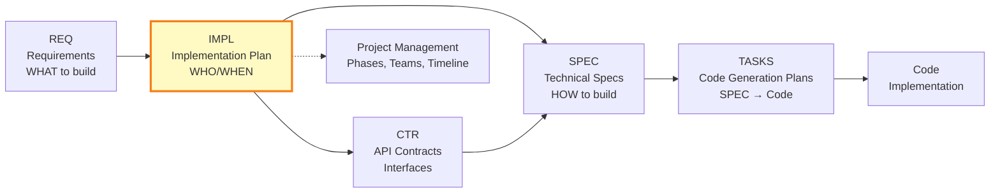

# Implementation Plans (IMPL): Project Management Layer

## Purpose

Implementation Plans (IMPL) are **project management documents** that organize and coordinate development work between requirements and technical specifications. They answer **WHO does WHAT and WHEN**, not HOW to build it.

**Key Role**: IMPL Plans bridge the gap between business requirements (REQ) and technical implementation by organizing work into phases, assigning teams, and scheduling deliverables.

## [RESOURCE_INSTANCE - e.g., database connection, workflow instance] in Development Workflow

**⚠️ See [../index.md](../index.md#traceability-flow) for the authoritative workflow visualization.**




## What IMPL Plans Are

IMPL Plans are **project management documents** that:

✅ **Break down requirements** into work packages and phases
✅ **Assign responsibilities** to teams, agents, or individuals
✅ **Set timelines** and milestones
✅ **Define deliverables** (which CTRs, SPECs, TASKS to create)
✅ **Identify dependencies** between work packages
✅ **Track project risks** (resource availability, timeline risks)
✅ **Organize work sequence** for efficient execution

**Analogy**: IMPL Plan = **Project Manager's Timeline**

## What IMPL Plans Are NOT

IMPL Plans do **NOT** define:

❌ **Technical architecture** (that's ADR)
❌ **Data structures or algorithms** (that's SPEC)
❌ **API contracts** (that's CTR)
❌ **Code implementation steps** (that's TASKS)
❌ **Class hierarchies or state machines** (that's SPEC)
❌ **Integration patterns** (that's ADR/SPEC)

**IMPL Plans organize work; they don't design systems.**

## IMPL vs Other Document Types

| Document Type | Purpose | Analogy | Focus |
|--------------|---------|---------|-------|
| **REQ** | Business requirements | Product Owner's vision | WHAT to build |
| **IMPL** | Project management | Project Manager's timeline | WHO does WHAT, WHEN |
| **CTR** | API contracts | Service agreement | Interface definitions |
| **SPEC** | Technical blueprint | Architect's design | HOW to build (YAML) |
| **TASKS** | Code generation plan | Developer's TODO list | SPEC → Code steps |
| **ADR** | Architecture decisions | Design rationale | WHY we chose this approach |

### IMPL vs TASKS: Key Distinction

This is the most critical distinction:

| Aspect | IMPL Plans | TASKS |
|--------|-----------|-------|
| **Level** | High-level (multi-component) | Low-level (single SPEC) |
| **Scope** | Entire system or feature | One YAML specification |
| **Audience** | Project managers, architects | AI code generators, developers |
| **Content** | Phases, teams, deliverables | Exact code generation steps |
| **Granularity** | "Phase 1: Build [RESOURCE_MANAGEMENT - e.g., capacity planning, quota management] (Week 1-2)" | "Step 3: Generate PositionLimitService class from SPEC-003.yaml" |
| **Timeline** | Weeks or months | Hours or days |
| **Deliverables** | List of CTR/SPEC/TASKS to create | Source code files |
| **Traceability** | IMPL → CTR, SPEC, TASKS | TASKS → Code |

**Example Flow**:
1. **REQ-003**: "System must enforce [RESOURCE_INSTANCE - e.g., database connection, workflow instance] limits"
2. **IMPL-001**: "[RESOURCE_MANAGEMENT - e.g., capacity planning, quota management] System" - Phase 1: Build [RESOURCE_INSTANCE - e.g., database connection, workflow instance] limits (Week 1-2, Agent Team) → Deliverables: CTR-003, SPEC-003, TASKS-003
3. **SPEC-003.yaml**: Technical spec with PositionLimitService class, methods, algorithms
4. **TASKS-003**: Step-by-step TODOs to generate code from SPEC-003.yaml
5. **Code**: `position_limit_service.py` generated following TASKS-003

## When to Create IMPL Plans

Create an IMPL Plan when:

✅ **Multi-component systems**: Feature requires multiple CTRs/SPECs
✅ **Phased rollout**: Work must be done in stages
✅ **Multiple teams**: Different teams working on related components
✅ **Complex dependencies**: Components must be built in specific order
✅ **Large scope**: Project spans multiple sprints or weeks
✅ **Resource coordination**: Need to allocate people/teams to work packages

**Rule of Thumb**: If implementing a requirement requires creating 3+ SPEC files or coordinating 2+ teams, create an IMPL Plan.

## IMPL Plan Structure

IMPL Plans follow a **4-part structure** (adapted from ADR-TEMPLATE.md):

### PART 1: Project Context and Strategy
- **Overview**: What system/feature is being built (from REQ)
- **Business Objectives**: References to REQ-IDs
- **Scope**: Work packages included/excluded
- **Document Flow**: [RESOURCE_INSTANCE - e.g., database connection, workflow instance] in development workflow

### PART 2: Phased Implementation
- **Phase 1, 2, ... N**: Work breakdown
  - Deliverables: CTR-NNN, SPEC-NNN, TASKS-NNN to create
  - Teams/agents responsible
  - Timeline estimates
  - Dependencies

### PART 3: Project Management and Risk
- **Resource Allocation**: Teams, people, agents
- **Timeline and Milestones**: When things happen
- **Dependencies and Blockers**: What must complete first
- **Risk Register**: Project risks (timeline, resources, scope)
- **Communication Plan**: Status updates, stakeholders

### PART 4: Tracking and Completion
- **Deliverables Checklist**: All CTR/SPEC/TASKS to create
- **Acceptance Criteria**: Project completion definition
- **Sign-off Process**: Who approves completion

## File Naming Convention

**Pattern**: `IMPL-NNN_{system_name}.md`

**Examples**:
- `IMPL-001_risk_management_system.md`
- `IMPL-002_market_data_integration.md`
- `IMPL-003_portfolio_orchestrator_agent.md`

**ID Format**: `IMPL-NNN` where NNN is zero-padded number (001, 002, ...)

## Traceability Requirements

### Upstream (What IMPL Plans Reference)

IMPL Plans trace to:
- **REQ-NNN**: Business requirements being implemented
- **ADR-NNN**: Architecture decisions affecting work organization
- **SYS-NNN**: System requirements driving implementation

### Downstream (What IMPL Plans Produce)

IMPL Plans identify deliverables:
- **CTR-NNN**: API contracts to be created
- **SPEC-NNN**: Technical specifications to be written
- **TASKS-NNN**: Code generation plans to be developed

**Note**: IMPL Plans do NOT directly produce code. They organize the creation of technical documents (CTR/SPEC/TASKS) which eventually lead to code.

## Directory Organization

```
docs_templates/ai_dev_flow/IMPL/
├── README.md                          # This file
├── IMPL-000_index.md                  # Master index of all IMPL plans
├── IMPL-TEMPLATE.md                   # Template for new IMPL plans
├── IMPL_IMPLEMENTATION_PLAN.md        # Example: Plan for creating IMPL/ system
└── examples/                          # Reference examples
    └── IMPL-001_risk_management_system.md
```

## Quality Gates

Before completing an IMPL Plan, verify:

- [ ] **Scope Clear**: All work packages identified
- [ ] **Phases Defined**: Work broken into logical phases
- [ ] **Teams Assigned**: Responsibilities clear
- [ ] **Timeline Realistic**: Estimates based on capacity
- [ ] **Dependencies Mapped**: Blockers identified
- [ ] **Deliverables Listed**: All CTR/SPEC/TASKS enumerated
- [ ] **Risks Assessed**: Project risks identified with mitigations
- [ ] **Traceability Complete**: Links to REQ/ADR/SYS
- [ ] **Token Limit**:
  - Claude Code: File under 50,000 tokens (200KB) standard, 100,000 tokens maximum
  - Gemini CLI: Use file read tool (not `@`) for files >10,000 tokens
  - See: [TOOL_OPTIMIZATION_GUIDE.md](../TOOL_OPTIMIZATION_GUIDE.md)

## Writing Guidelines

### Focus on Organization, Not Implementation

**Good** (Project Management):
```markdown
## Phase 1: [RESOURCE_LIMIT - e.g., request quota, concurrent sessions] Service (Week 1-2)

**Team**: Agent Development Team (3 developers)

**Deliverables**:
- CTR-003: [RESOURCE_LIMIT - e.g., request quota, concurrent sessions] API Contract
- SPEC-003: [RESOURCE_LIMIT - e.g., request quota, concurrent sessions] Service Specification
- TASKS-003: Code Generation Plan for SPEC-003

**Dependencies**:
- Database schema approved (ADR-008)
- Risk parameter configuration complete (REQ-003)

**Timeline**: Sprint 1 (2 weeks)
```

**Bad** (Technical Implementation - belongs in SPEC):
```markdown
## Phase 1: [RESOURCE_LIMIT - e.g., request quota, concurrent sessions] Service

The PositionLimitService class will implement a Redis-backed cache with
TTL of 60 seconds. The calculate_position_limit() method uses the formula:
limit = base_limit * (1 - risk_factor * 0.1)
```

### Organize by Work Packages, Not Technical Layers

**Good** (Business Value):
```markdown
## Phase 1: Core [RESOURCE_MANAGEMENT - e.g., capacity planning, quota management] (Sprint 1-2)
- [RESOURCE_INSTANCE - e.g., database connection, workflow instance] limits (CTR-003, SPEC-003)
- [RESOURCE_COLLECTION - e.g., user accounts, active sessions] risk calculator (CTR-005, SPEC-005)

## Phase 2: Advanced Features (Sprint 3)
- Circuit breakers (CTR-008, SPEC-008)
- Correlation analysis (CTR-010, SPEC-010)
```

**Bad** (Technical Layers):
```markdown
## Phase 1: Data Layer
- All database models

## Phase 2: Service Layer
- All business logic

## Phase 3: API Layer
- All endpoints
```

## Common Patterns

### Pattern 1: Sequential Phases

When components must be built in order:

```markdown
## Phase 1: Foundation (Week 1-2)
- Core data models (SPEC-001, SPEC-002)
- Database setup (SPEC-003)

## Phase 2: Services (Week 3-4)
- Business logic (SPEC-004, SPEC-005)
- Depends on: Phase 1 complete

## Phase 3: Integration (Week 5)
- API layer (SPEC-006)
- Depends on: Phase 2 complete
```

### Pattern 2: Parallel Development

When teams can work independently:

```markdown
## Phase 1 (Parallel): Core Services (Week 1-2)

**Team A**: [RESOURCE_INSTANCE - e.g., database connection, workflow instance] Limits
- CTR-003, SPEC-003, TASKS-003

**Team B**: Risk Calculator
- CTR-005, SPEC-005, TASKS-005

**Team C**: Circuit Breakers
- CTR-008, SPEC-008, TASKS-008

No dependencies between teams.
```

### Pattern 3: Iterative Delivery

When delivering incremental value:

```markdown
## Phase 1: MVP (Sprint 1)
- Basic [RESOURCE_INSTANCE - e.g., database connection, workflow instance] limits (SPEC-003)
- Manual override capability (SPEC-004)
- **Release**: V1.0 to production

## Phase 2: Enhancements (Sprint 2)
- Automated limit calculation (SPEC-005)
- Real-time monitoring (SPEC-006)
- **Release**: V1.1 to production

## Phase 3: Advanced Features (Sprint 3)
- ML-based limit recommendations (SPEC-007)
- **Release**: V2.0 to production
```

## Integration with Workflow

### From Requirements to IMPL

After requirements (REQ) are approved:

1. **Review Requirements**: Understand WHAT needs to be built
2. **Create IMPL Plan**: Organize WHO will build WHAT and WHEN
3. **Identify Deliverables**: List all CTR/SPEC/TASKS needed
4. **Assign Teams**: Allocate resources to work packages
5. **Set Timeline**: Estimate phase durations
6. **Get Approval**: Review IMPL Plan with stakeholders

### From IMPL to Technical Specs

IMPL Plan guides creation of:

1. **CTR Documents**: API contracts for component interfaces
2. **SPEC Documents**: YAML specifications for component implementation
3. **TASKS Documents**: Code generation plans for each SPEC

### IMPL as Progress Tracker

Throughout implementation:

- **Update Status**: Mark phases as complete
- **Track Deliverables**: Link to created CTR/SPEC/TASKS
- **Adjust Timeline**: Update estimates based on actuals
- **Manage Risks**: Update risk register as issues arise

## Benefits

### For Project Managers
- **Clear Timeline**: Know when deliverables are due
- **Resource Visibility**: See who's working on what
- **Dependency Management**: Identify blockers early
- **Progress Tracking**: Monitor completion against plan

### For Architects
- **Phased Design**: Break complex systems into manageable pieces
- **Team Coordination**: Ensure teams don't duplicate work
- **Integration Planning**: Identify integration points early

### For Developers
- **Work Organization**: Understand where their work fits
- **Dependency Clarity**: Know what they're waiting for
- **Deliverable Focus**: Clear goals (create SPEC-NNN, TASKS-NNN)

### For AI Assistants
- **Structured Guidance**: Clear roadmap for feature implementation
- **Deliverable Checklist**: Know what documents to create
- **Phase Context**: Understand current implementation stage

## Avoiding Pitfalls

### Pitfall 1: IMPL Becomes Technical Spec

**Problem**: IMPL Plan includes data structures, algorithms, class hierarchies

**Solution**: Move technical details to SPEC. IMPL only says "create SPEC-003 for [RESOURCE_LIMIT - e.g., request quota, concurrent sessions] service"

### Pitfall 2: IMPL Duplicates TASKS

**Problem**: IMPL Plan lists exact code generation steps

**Solution**: IMPL references TASKS documents. Only TASKS contains code generation TODOs.

### Pitfall 3: IMPL Too Granular

**Problem**: IMPL Plan has 50 phases, each 2 hours long

**Solution**: Group related work into logical phases (1-2 weeks each). Save granularity for TASKS.

### Pitfall 4: IMPL Missing Deliverables

**Problem**: Phase says "Build [RESOURCE_MANAGEMENT - e.g., capacity planning, quota management]" but doesn't list which CTR/SPEC/TASKS

**Solution**: Always enumerate deliverables: "CTR-003, SPEC-003, TASKS-003"

### Pitfall 5: No Team [ALLOCATION - e.g., task assignment, resource allocation]

**Problem**: Phases don't specify who does the work

**Solution**: Assign teams/people: "Agent Development Team" or "AI Code Generator"

## Tools

### Template Usage

Start with `IMPL-TEMPLATE.md`:

```bash
cp docs_templates/ai_dev_flow/IMPL/IMPL-TEMPLATE.md \
   docs/IMPL/IMPL-042_my_feature.md
```

### Validation

Check IMPL Plan quality:

- **Traceability**: All REQ-NNN references valid?
- **Deliverables**: All CTR/SPEC/TASKS enumerated?
- **Timeline**: Realistic estimates?
- **Dependencies**: Blockers identified?
- **Token Limit**: File < 50,000 tokens (Claude Code) or < 100,000 tokens maximum?

## Examples

### Example 1: Simple IMPL (Single Team)

```markdown
# IMPL-042: User Authentication System

## PART 1: Project Context
**Overview**: Implement OAuth2 authentication for API access

**Business Objectives**: REQ-042 (secure API access)

**Scope**:
- OAuth2 provider integration
- Token management
- User session handling

## PART 2: Phased Implementation

### Phase 1: Core Auth (Week 1)
**Deliverables**:
- CTR-042: Authentication API Contract
- SPEC-042: OAuth2 Service Specification
- TASKS-042: Code Generation Plan

**Team**: Security Team (2 developers)
**Dependencies**: None

### Phase 2: Session Management (Week 2)
**Deliverables**:
- SPEC-043: Session Service Specification
- TASKS-043: Code Generation Plan

**Team**: Security Team
**Dependencies**: Phase 1 complete

## PART 3: Project Management
**Timeline**: 2 weeks total
**Risk**: OAuth2 provider downtime → Mitigation: Local testing mode

## PART 4: Completion
**Acceptance**: All auth flows tested, security review passed
```

### Example 2: Complex IMPL (Multiple Teams)

See: `examples/IMPL-001_risk_management_system.md`

## Related Documents

- **IMPL-000_index.md**: Master index of all IMPL plans
- **IMPL-TEMPLATE.md**: Template for new IMPL plans
- **TASKS README**: Understanding code generation plans (TASKS/README.md)
- **SPEC_DRIVEN_DEVELOPMENT_GUIDE.md**: Full workflow including IMPL
- **TRACEABILITY.md**: How IMPL fits in traceability chain

## Quick Reference

| Question | Answer |
|----------|--------|
| When to create IMPL? | Multi-component features, phased rollout, multiple teams |
| What goes in IMPL? | Phases, teams, timeline, deliverables (CTR/SPEC/TASKS) |
| What NOT in IMPL? | Data structures, algorithms, code generation steps |
| IMPL vs TASKS? | IMPL = project plan (WHO/WHEN), TASKS = code plan (HOW) |
| Upstream? | REQ, ADR, SYS |
| Downstream? | CTR, SPEC, TASKS (as deliverables) |

---

**Template Version**: 1.0
**Last Reviewed**: 2025-11-02
**Next Review**: 2026-02-02 (quarterly)
