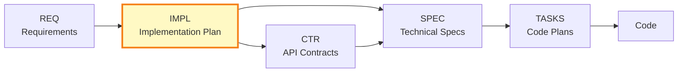

# IMPL-001: Data Validation System Implementation

**Note**: This is a reference implementation plan demonstrating best practices for multi-component, phased implementations.

## Document Control

| Field | Value |
|-------|-------|
| **IMPL ID** | IMPL-001 |
| **Title** | Data Validation System Implementation Plan |
| **Status** | Planned |
| **Created** | 2025-11-26 |
| **Author** | System Architect |
| **Owner** | Platform Development Team |
| **Last Updated** | 2025-11-26 |
| **Version** | 1.0 |
| **Related REQs** | [REQ-003](../../REQ/examples/api/REQ-003_data_quality_validation.md) |
| **Deliverables** | CTR-003, SPEC-003, TASKS-003, CTR-005, SPEC-005, TASKS-005, CTR-008, SPEC-008, TASKS-008 |

## Position in Development Workflow

> **Note on Diagram Labels**: The above flowchart shows the sequential workflow. For formal layer numbers used in cumulative tagging, always reference the 16-layer architecture (Layers 0-15) defined in README.md. Diagram groupings are for visual clarity only.

---

## PART 1: Project Context and Strategy

### 1.1 Overview

**What System Is Being Implemented**:
Complete data validation system for multi-service architecture, including input validation, schema enforcement, and automated quality gates.

**Purpose**:
Ensure data integrity by validating inputs, enforcing quality thresholds, and automatically rejecting invalid data during adverse conditions. System ensures compliance with quality standards and provides real-time validation monitoring.

**Scope Summary**:
Three core validation components: input validation service, data quality calculator, and quality gate system. All components integrate with the Data Processing Service for real-time validation.

### 1.2 Business Objectives

**Requirements Satisfied**:

| Requirement ID | Description | Implementation Approach |
|----------------|-------------|------------------------|
| REQ-003 | Input validation enforcement | Build InputValidationService with real-time checks |
| REQ-005 | Data quality aggregation | Build DataQualityCalculator with metrics summation |
| REQ-008 | Quality gate system | Build QualityGateService with threshold triggers |

**Success Criteria**:
- Zero invalid records processed that violate validation rules
- Data quality metrics monitored in real-time (<1s latency)
- Quality gates trigger within 5 seconds of threshold breach
- 99.9% system availability

### 1.3 Scope

**In Scope**:
- Input validation (per-record and batch-level)
- Real-time quality metrics aggregation across all records
- Quality gate triggers (completeness, freshness, accuracy)
- Integration with Data Processing Service
- Validation monitoring dashboard data feeds

**Out of Scope** (Deferred to Phase 2):
- Predictive quality analytics (ML-based)
- Data profiling engine
- Historical quality reporting
- Mobile alerts

**Assumptions**:
- Data source integration operational (external API complete)
- Database schema approved (PostgreSQL for operational data)
- Data Processing Service interfaces defined

**Constraints**:
- **Technical**: Must integrate with existing Redis cache (no new infrastructure)
- **Resource**: 3 developers available (Platform Team)
- **Timeline**: Complete before Q1 launch (6 weeks)
- **Business**: Compliance required (data quality standards)

### 1.4 Dependencies

**Upstream Dependencies**:

| Dependency | Type | Status | Impact if Delayed |
|------------|------|--------|-------------------|
| REQ-003, REQ-005, REQ-008 | Requirements | Approved | Cannot start - no SPEC |
| Database schema (ADR-003) | Architecture | Approved | Risk: Schema changes during dev |
| Data source feed | External | In Progress | Cannot test without real data |

**External Dependencies**:
- Data Processing Service API endpoints
- Redis cache availability
- PostgreSQL database provisioning

---

## PART 2: Phased Implementation and Work Breakdown

### Phase 1: Input Validation Service (Sprint 1: Week 1-2)

**Description**:
Build core input validation service that checks both single-record and batch-level quality requirements before data processing.

**Deliverables**:
- **CTR-003**: Input Validation API Contract - REST endpoints for validation
- **SPEC-003**: Input Validation Service Specification - YAML with InputValidationService class, validation algorithms
- **TASKS-003**: Code Generation Plan for SPEC-003 - Step-by-step implementation guide

**Team/Owner**:
Platform Development Team (2 developers: Alice, Bob)

**Timeline**:
- **Start**: Week 1, Day 1
- **Duration**: 2 weeks (Sprint 1)
- **End**: Week 2, Day 5

**Dependencies**:
- **Requires**: Database schema complete, Redis cache available
- **Blocks**: Data quality calculator (needs validation service operational)

**Success Criteria**:
- [ ] CTR-003 created and validated
- [ ] SPEC-003 created with complete traceability to REQ-003
- [ ] TASKS-003 created with code generation steps
- [ ] Input validation functional (>1000 validations/regulatory)
- [ ] Unit tests passing (>95% coverage)

**Risks**:
- **Risk**: Database performance insufficient for real-time validation
  - **Probability**: Medium
  - **Impact**: High
  - **Mitigation**: Implement Redis caching layer for frequent lookups

---

### Phase 2: Data Quality Calculator (Sprint 2: Week 3-4)

**Description**:
Build batch-level quality aggregation service that computes quality metrics across all records and calculates total data quality score in real-time.

**Deliverables**:
- **CTR-005**: Data Quality API Contract - Endpoints for metrics aggregation
- **SPEC-005**: Data Quality Calculator Specification - YAML with DataQualityCalculator class
- **TASKS-005**: Code Generation Plan for SPEC-005

**Team/Owner**:
Platform Development Team (2 developers: Alice, Carol)

**Timeline**:
- **Start**: Week 3, Day 1
- **Duration**: 2 weeks (Sprint 2)
- **End**: Week 4, Day 5

**Dependencies**:
- **Requires**: Phase 1 complete (input validation operational)
- **Blocks**: Quality gates (need quality data)

**Success Criteria**:
- [ ] CTR-005 created
- [ ] SPEC-005 created with REQ-005 traceability
- [ ] TASKS-005 created
- [ ] Data quality metrics calculated in <1 second
- [ ] Integration tests with Input Validation Service passing

**Risks**:
- **Risk**: Quality calculation complexity underestimated
  - **Probability**: Low
  - **Impact**: Medium
  - **Mitigation**: Proof of concept completed in Phase 1 (parallel task)

---

### Phase 3: Quality Gate System (Sprint 3: Week 5-6)

**Description**:
Build automated quality gate system that monitors completeness, freshness, and accuracy metrics to automatically halt processing during quality issues.

**Deliverables**:
- **CTR-008**: Quality Gate API Contract - Endpoints for gate monitoring
- **SPEC-008**: Quality Gate Service Specification - YAML with QualityGateService class
- **TASKS-008**: Code Generation Plan for SPEC-008
- **Integration Tests**: End-to-end validation across all components
- **Deployment Artifacts**: Docker images, Kubernetes manifests

**Team/Owner**:
Platform Development Team (3 developers: Alice, Bob, Carol) + Infrastructure Team (Dave)

**Timeline**:
- **Start**: Week 5, Day 1
- **Duration**: 2 weeks (Sprint 3)
- **End**: Week 6, Day 5

**Dependencies**:
- **Requires**: Phase 2 complete (quality data available)
- **Blocks**: Production deployment

**Success Criteria**:
- [ ] CTR-008 created
- [ ] SPEC-008 created with REQ-008 traceability
- [ ] TASKS-008 created
- [ ] Quality gates trigger within 5 seconds of breach
- [ ] All three services integrated and tested end-to-end
- [ ] Production deployment complete

**Risks**:
- **Risk**: Integration issues between services
  - **Probability**: Medium
  - **Impact**: Medium
  - **Mitigation**: Daily integration testing starting Phase 2

---

## PART 3: Project Management and Risk

### 3.1 Resource Allocation

**Teams and Roles**:

| Team/Person | Role | Phases | Estimated Effort |
|-------------|------|--------|------------------|
| Alice (Platform Team) | Lead Developer | All phases | 6 person-weeks |
| Bob (Platform Team) | Developer | Phase 1, 3 | 4 person-weeks |
| Carol (Platform Team) | Developer | Phase 2, 3 | 4 person-weeks |
| Dave (Infrastructure) | DevOps Engineer | Phase 3 | 1 person-week |

**Total Effort**: 15 person-weeks

**Skills Required**:
- Python development (FastAPI, asyncio)
- Redis caching patterns
- PostgreSQL database design
- Data quality domain knowledge
- Kubernetes deployment

### 3.2 Timeline and Milestones

**Overall Timeline**: 6 weeks (3 sprints)
- **Start Date**: 2025-11-04
- **Target Completion**: 2025-12-16

**Milestones**:

| Milestone | Date | Deliverables | Status |
|-----------|------|--------------|--------|
| Phase 1 Complete | 2025-11-15 | CTR-003, SPEC-003, TASKS-003, validation code | Pending |
| Phase 2 Complete | 2025-11-29 | CTR-005, SPEC-005, TASKS-005, quality code | Pending |
| Phase 3 Complete | 2025-12-13 | CTR-008, SPEC-008, TASKS-008, gate code | Pending |
| Production Deployment | 2025-12-16 | All services deployed and validated | Pending |

**Critical Path**: Phase 1 -> Phase 2 -> Phase 3 (sequential dependencies)

### 3.3 Dependencies and Blockers

**Current Blockers**:
- None (all upstream dependencies approved)

**Anticipated Blockers**:
- **Data source delay** (Week 2): If external API integration incomplete, use mock data
- **Infrastructure provisioning** (Week 5): If Kubernetes cluster not ready, deploy to staging first

### 3.4 Risk Register

| Risk ID | Risk Description | Probability | Impact | Mitigation Strategy | Owner | Status |
|---------|------------------|-------------|--------|---------------------|-------|--------|
| R-001 | Developer unavailability (sick leave) | Low | High | Cross-train team members on each component | Alice | Open |
| R-002 | Performance requirements not met | Medium | High | Performance testing in each phase, optimize early | Bob | Open |
| R-003 | Integration complexity underestimated | Medium | Medium | Daily integration testing starting Phase 2 | Alice | Open |
| R-004 | Compliance requirements change | Low | Very High | Monthly compliance review with stakeholders | PM | Open |

### 3.5 Communication Plan

**Stakeholders**:

| Stakeholder | Role | Updates Frequency | Method |
|-------------|------|-------------------|--------|
| Product Owner | Approval authority | Weekly | Sprint review meeting |
| Technical Architect | Design decisions | As needed | Slack + design reviews |
| Platform Development Team | Implementers | Daily | Stand-up (9:00 AM) |
| Infrastructure Team | Deployment support | Weekly | Integration meeting |

**Status Reporting**:
- **Daily**: Stand-up (9:00 AM, 15 min) - blockers, progress, plan
- **Weekly**: Sprint review (Fridays, 2:00 PM) - demo progress, risk review
- **Ad-hoc**: Escalate blockers >24 hours to Product Owner

---

## PART 4: Tracking and Completion

### 4.1 Deliverables Checklist

**Phase 1 Deliverables**:
- [ ] CTR-003: Input Validation API Contract created
- [ ] SPEC-003: Input Validation Service Specification created
- [ ] TASKS-003: Code Generation Plan created
- [ ] Input validation service code generated and tested

**Phase 2 Deliverables**:
- [ ] CTR-005: Data Quality API Contract created
- [ ] SPEC-005: Data Quality Calculator Specification created
- [ ] TASKS-005: Code Generation Plan created
- [ ] Data quality calculator code generated and tested

**Phase 3 Deliverables**:
- [ ] CTR-008: Quality Gate API Contract created
- [ ] SPEC-008: Quality Gate Service Specification created
- [ ] TASKS-008: Code Generation Plan created
- [ ] Quality gate service code generated and tested
- [ ] Integration tests complete
- [ ] Deployment artifacts created

**Overall Deliverables**:
- [ ] All CTR documents created: CTR-003, CTR-005, CTR-008
- [ ] All SPEC documents created: SPEC-003, SPEC-005, SPEC-008
- [ ] All TASKS documents created: TASKS-003, TASKS-005, TASKS-008
- [ ] All code generated and validated
- [ ] System deployed to production

### 4.2 Validation Checklist

**Technical Validation**:
- [ ] All API contracts validated (CTR-003, CTR-005, CTR-008)
- [ ] All specifications complete with traceability (SPEC-003, SPEC-005, SPEC-008)
- [ ] Unit test coverage >95%
- [ ] Integration tests passing
- [ ] Performance requirements met (<1s for quality calculations)
- [ ] Quality gates trigger within 5 seconds

**Business Validation**:
- [ ] REQ-003 satisfied (input validation enforced)
- [ ] REQ-005 satisfied (data quality monitored)
- [ ] REQ-008 satisfied (quality gates operational)
- [ ] Compliance verified
- [ ] Product Owner approval received

### 4.3 Acceptance Criteria

**Project Complete When**:
1. All 9 deliverables created (3 CTR + 3 SPEC + 3 TASKS)
2. All code generated and passing tests
3. System deployed to production and validated
4. Zero invalid records processed that violate validation rules in first week
5. Data quality monitoring functional with <1s latency
6. Quality gates trigger correctly during test scenarios

### 4.4 Completion and Sign-off

**Completion Date**: [TBD after Phase 3]

**Sign-off**:

| Role | Name | Signature | Date |
|------|------|-----------|------|
| Project Owner | [PM Name] | Pending | [TBD] |
| Technical Lead | Alice | Pending | [TBD] |
| Product Owner | [PO Name] | Pending | [TBD] |

---

## Traceability

### Upstream Sources

| Source Type | Document ID | Document Title | Relevant sections | Relationship |
|-------------|-------------|----------------|-------------------|--------------|
| REQ | REQ-003 | Input Validation Enforcement | All | Validation requirement |
| REQ | REQ-005 | Data Quality Aggregation | All | Quality requirement |
| REQ | REQ-008 | Quality Gate System | All | Gate requirement |
| ADR | ADR-003 | Database Architecture | section 2.1 | Database design |

### Downstream Artifacts (Deliverables)

| Artifact Type | Document ID | Document Title | Status | Relationship |
|---------------|-------------|----------------|--------|--------------|
| CTR | CTR-003 | Input Validation API Contract | Pending | Phase 1 deliverable |
| SPEC | SPEC-003 | Input Validation Service Spec | Pending | Phase 1 deliverable |
| TASKS | TASKS-003 | Input Validation Code Plan | Pending | Phase 1 deliverable |
| CTR | CTR-005 | Data Quality API Contract | Pending | Phase 2 deliverable |
| SPEC | SPEC-005 | Data Quality Calculator Spec | Pending | Phase 2 deliverable |
| TASKS | TASKS-005 | Data Quality Code Plan | Pending | Phase 2 deliverable |
| CTR | CTR-008 | Quality Gate API Contract | Pending | Phase 3 deliverable |
| SPEC | SPEC-008 | Quality Gate Service Spec | Pending | Phase 3 deliverable |
| TASKS | TASKS-008 | Quality Gate Code Plan | Pending | Phase 3 deliverable |

---

## References

- [IMPL-000: Master Index](../IMPL-000_index.md)

---

**Example Type**: Reference implementation plan showing multi-component, phased approach
**Template Version**: 1.0
**Last Reviewed**: 2025-11-26
