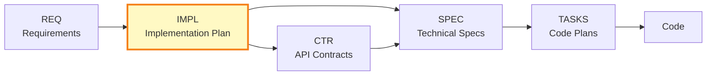

# IMPL-001: [RESOURCE_MANAGEMENT - e.g., capacity planning, quota management] System Implementation

**⚠️ EXAMPLE DOCUMENT**: This is a reference implementation plan demonstrating best practices. Parameterized placeholders (e.g., `[RESOURCE_MANAGEMENT]`, `[RESOURCE_LIMIT]`) are intentional examples - replace with actual project terms. References to REQ-003 demonstrate traceability patterns using actual framework requirements.

## Document Control

| Field | Value |
|-------|-------|
| **IMPL ID** | IMPL-001 |
| **Title** | [RESOURCE_MANAGEMENT - e.g., capacity planning, quota management] System Implementation Plan |
| **Status** | Planned |
| **Created** | 2025-11-02 |
| **Author** | System Architect |
| **Owner** | Agent Development Team |
| **Last Updated** | 2025-11-02 |
| **Version** | 1.0 |
| **Related REQs** | [REQ-003](../../REQ/risk/lim/REQ-003_position_limit_enforcement.md) |
| **Deliverables** | CTR-003, SPEC-003, TASKS-003, CTR-005, SPEC-005, TASKS-005, CTR-008, SPEC-008, TASKS-008 |

## [RESOURCE_INSTANCE - e.g., database connection, workflow instance] in Development Workflow

---

## PART 1: Project Context and Strategy

### 1.1 Overview

**What System Is Being Implemented**:
Complete [RESOURCE_MANAGEMENT - e.g., capacity planning, quota management] system for multi-agent options [APPLICATION_TYPE - e.g., e-commerce platform, SaaS application], including [RESOURCE_LIMIT - e.g., request quota, concurrent sessions] enforcement, [RESOURCE_COLLECTION - e.g., user accounts, active sessions]-level risk aggregation, and automated circuit breakers.

**Purpose**:
Protect capital by preventing over-concentration, enforcing risk limits, and automatically halting trading during adverse market conditions. System ensures compliance with risk parameters and provides real-time risk monitoring.

**Scope Summary**:
Three core [RESOURCE_MANAGEMENT - e.g., capacity planning, quota management] components: [RESOURCE_INSTANCE - e.g., database connection, workflow instance] limits service, [RESOURCE_COLLECTION - e.g., user accounts, active sessions] risk calculator, and [SAFETY_MECHANISM - e.g., rate limiter, error threshold] system. All components integrate with [ORCHESTRATION_COMPONENT] for real-time risk validation.

### 1.2 Business Objectives

**Requirements Satisfied**:

| Requirement ID | Description | Implementation Approach |
|----------------|-------------|------------------------|
| REQ-003 | [RESOURCE_LIMIT - e.g., request quota, concurrent sessions] enforcement | Build PositionLimitService with real-time validation |
| REQ-005 | [RESOURCE_COLLECTION - e.g., user accounts, active sessions] risk aggregation | Build PortfolioRiskCalculator with [METRICS - e.g., performance indicators, quality scores] summation |
| REQ-008 | [SAFETY_MECHANISM - e.g., rate limiter, error threshold] system | Build CircuitBreakerService with [VOLATILITY_INDICATOR - e.g., system load, error frequency] and loss triggers |

**Success Criteria**:
- Zero trades executed that violate [RESOURCE_INSTANCE - e.g., database connection, workflow instance] limits
- [RESOURCE_COLLECTION - e.g., user accounts, active sessions] [METRICS - e.g., performance indicators, quality scores] monitored in real-time (<1s latency)
- Circuit breakers trigger within 5 seconds of condition breach
- 99.9% system availability

### 1.3 Scope

**In Scope**:
- [RESOURCE_LIMIT - e.g., request quota, concurrent sessions] validation (per-[RESOURCE_INSTANCE - e.g., database connection, workflow instance] and [RESOURCE_COLLECTION - e.g., user accounts, active sessions]-level)
- Real-time [METRICS - e.g., performance indicators, quality scores] aggregation across all positions
- [SAFETY_MECHANISM - e.g., rate limiter, error threshold] triggers ([VOLATILITY_INDICATOR - e.g., system load, error frequency], daily loss, correlation)
- Integration with [ORCHESTRATION_COMPONENT]
- Risk monitoring dashboard data feeds

**Out of Scope** (Deferred to Phase 2):
- Predictive risk analytics (ML-based)
- Stress testing engine
- Historical risk reporting
- Mobile alerts

**Assumptions**:
- [EXTERNAL_DATA - e.g., customer data, sensor readings] feed operational ([EXTERNAL_DATA_PROVIDER - e.g., Weather API, Stock Data API] integration complete)
- Database schema approved (PostgreSQL for operational data)
- [ORCHESTRATION_COMPONENT] interfaces defined

**Constraints**:
- **Technical**: Must integrate with existing Redis cache (no new infrastructure)
- **Resource**: 3 developers available (Agent Team)
- **Timeline**: Complete before Q1 trading launch (6 weeks)
- **Business**: Regulatory compliance required (SEC [RESOURCE_MANAGEMENT - e.g., capacity planning, quota management] rules)

### 1.4 Dependencies

**Upstream Dependencies**:

| Dependency | Type | Status | Impact if Delayed |
|------------|------|--------|-------------------|
| REQ-003, REQ-005, REQ-008 | Requirements | Approved | Cannot start - no SPEC |
| Database schema (ADR-003) | Architecture | Approved | Risk: Schema changes during dev |
| [EXTERNAL_DATA - e.g., customer data, sensor readings] feed | External | In Progress | Cannot test without real data |

**External Dependencies**:
- [ORCHESTRATION_COMPONENT] API endpoints
- Redis cache availability
- PostgreSQL database provisioning

---

## PART 2: Phased Implementation and Work Breakdown

### Phase 1: [RESOURCE_LIMIT - e.g., request quota, concurrent sessions] Service (Sprint 1: Week 1-2)

**Description**:
Build core [RESOURCE_LIMIT - e.g., request quota, concurrent sessions] validation service that checks both single-[RESOURCE_INSTANCE - e.g., database connection, workflow instance] and [RESOURCE_COLLECTION - e.g., user accounts, active sessions]-level concentration limits before [OPERATION_EXECUTION - e.g., order processing, task execution].

**Deliverables**:
- **CTR-003**: [RESOURCE_LIMIT - e.g., request quota, concurrent sessions] API Contract - REST endpoints for limit validation
- **SPEC-003**: [RESOURCE_LIMIT - e.g., request quota, concurrent sessions] Service Specification - YAML with PositionLimitService class, validation algorithms
- **TASKS-003**: Code Generation Plan for SPEC-003 - Step-by-step implementation guide

**Team/Owner**:
Agent Development Team (2 developers: Alice, Bob)

**Timeline**:
- **Start**: Week 1, Day 1
- **Duration**: 2 weeks (Sprint 1)
- **End**: Week 2, Day 5

**Dependencies**:
- **Requires**: Database schema complete, Redis cache available
- **Blocks**: [RESOURCE_COLLECTION - e.g., user accounts, active sessions] risk calculator (needs limit service operational)

**Success Criteria**:
- [ ] CTR-003 created and validated
- [ ] SPEC-003 created with complete traceability to REQ-003
- [ ] TASKS-003 created with code generation steps
- [ ] [RESOURCE_LIMIT - e.g., request quota, concurrent sessions] validation functional (>1000 validations/sec)
- [ ] Unit tests passing (>95% coverage)

**Risks**:
- **Risk**: Database performance insufficient for real-time validation
  - **Probability**: Medium
  - **Impact**: High
  - **Mitigation**: Implement Redis caching layer for frequent lookups

---

### Phase 2: [RESOURCE_COLLECTION - e.g., user accounts, active sessions] Risk Calculator (Sprint 2: Week 3-4)

**Description**:
Build [RESOURCE_COLLECTION - e.g., user accounts, active sessions]-level risk aggregation service that sums [METRICS - e.g., performance indicators, quality scores] across all positions and calculates total [RESOURCE_COLLECTION - e.g., user accounts, active sessions] exposure in real-time.

**Deliverables**:
- **CTR-005**: [RESOURCE_COLLECTION - e.g., user accounts, active sessions] Risk API Contract - Endpoints for [METRICS - e.g., performance indicators, quality scores] aggregation
- **SPEC-005**: [RESOURCE_COLLECTION - e.g., user accounts, active sessions] Risk Calculator Specification - YAML with PortfolioRiskCalculator class
- **TASKS-005**: Code Generation Plan for SPEC-005

**Team/Owner**:
Agent Development Team (2 developers: Alice, Carol)

**Timeline**:
- **Start**: Week 3, Day 1
- **Duration**: 2 weeks (Sprint 2)
- **End**: Week 4, Day 5

**Dependencies**:
- **Requires**: Phase 1 complete ([RESOURCE_INSTANCE - e.g., database connection, workflow instance] limits operational)
- **Blocks**: Circuit breakers (need [RESOURCE_COLLECTION - e.g., user accounts, active sessions] risk data)

**Success Criteria**:
- [ ] CTR-005 created
- [ ] SPEC-005 created with REQ-005 traceability
- [ ] TASKS-005 created
- [ ] [RESOURCE_COLLECTION - e.g., user accounts, active sessions] [METRICS - e.g., performance indicators, quality scores] calculated in <1 second
- [ ] Integration tests with [RESOURCE_LIMIT - e.g., request quota, concurrent sessions] Service passing

**Risks**:
- **Risk**: [METRICS - e.g., performance indicators, quality scores] calculation complexity underestimated
  - **Probability**: Low
  - **Impact**: Medium
  - **Mitigation**: Proof of concept completed in Phase 1 (parallel task)

---

### Phase 3: [SAFETY_MECHANISM - e.g., rate limiter, error threshold] System (Sprint 3: Week 5-6)

**Description**:
Build automated [SAFETY_MECHANISM - e.g., rate limiter, error threshold] system that monitors [VOLATILITY_INDICATOR - e.g., system load, error frequency], daily P&L, and correlation metrics to automatically halt trading during adverse conditions.

**Deliverables**:
- **CTR-008**: [SAFETY_MECHANISM - e.g., rate limiter, error threshold] API Contract - Endpoints for trigger monitoring
- **SPEC-008**: [SAFETY_MECHANISM - e.g., rate limiter, error threshold] Service Specification - YAML with CircuitBreakerService class
- **TASKS-008**: Code Generation Plan for SPEC-008
- **Integration Tests**: End-to-end validation across all risk components
- **Deployment Artifacts**: Docker images, Kubernetes manifests

**Team/Owner**:
Agent Development Team (3 developers: Alice, Bob, Carol) + Infrastructure Team (Dave)

**Timeline**:
- **Start**: Week 5, Day 1
- **Duration**: 2 weeks (Sprint 3)
- **End**: Week 6, Day 5

**Dependencies**:
- **Requires**: Phase 2 complete ([RESOURCE_COLLECTION - e.g., user accounts, active sessions] risk data available)
- **Blocks**: Production deployment

**Success Criteria**:
- [ ] CTR-008 created
- [ ] SPEC-008 created with REQ-008 traceability
- [ ] TASKS-008 created
- [ ] Circuit breakers trigger within 5 seconds of breach
- [ ] All three services integrated and tested end-to-end
- [ ] Production deployment complete

**Risks**:
- **Risk**: Integration issues between services
  - **Probability**: Medium
  - **Impact**: Medium
  - **Mitigation**: Daily integration testing starting Phase 2

---

## PART 3: Project Management and Risk

### 3.1 Resource Allocation

**Teams and Roles**:

| Team/Person | Role | Phases | Estimated Effort |
|-------------|------|--------|------------------|
| Alice (Agent Team) | Lead Developer | All phases | 6 person-weeks |
| Bob (Agent Team) | Developer | Phase 1, 3 | 4 person-weeks |
| Carol (Agent Team) | Developer | Phase 2, 3 | 4 person-weeks |
| Dave (Infrastructure) | DevOps Engineer | Phase 3 | 1 person-week |

**Total Effort**: 15 person-weeks

**Skills Required**:
- Python development (FastAPI, asyncio)
- Redis caching patterns
- PostgreSQL database design
- [DOMAIN_ACTIVITY - e.g., payment processing, content moderation] domain knowledge
- Kubernetes deployment

### 3.2 Timeline and Milestones

**Overall Timeline**: 6 weeks (3 sprints)
- **Start Date**: 2025-11-04
- **Target Completion**: 2025-12-16

**Milestones**:

| Milestone | Date | Deliverables | Status |
|-----------|------|--------------|--------|
| Phase 1 Complete | 2025-11-15 | CTR-003, SPEC-003, TASKS-003, [RESOURCE_LIMIT - e.g., request quota, concurrent sessions] code | Pending |
| Phase 2 Complete | 2025-11-29 | CTR-005, SPEC-005, TASKS-005, [RESOURCE_COLLECTION - e.g., user accounts, active sessions] risk code | Pending |
| Phase 3 Complete | 2025-12-13 | CTR-008, SPEC-008, TASKS-008, [SAFETY_MECHANISM - e.g., rate limiter, error threshold] code | Pending |
| Production Deployment | 2025-12-16 | All services deployed and validated | Pending |

**Critical Path**: Phase 1 → Phase 2 → Phase 3 (sequential dependencies)

### 3.3 Dependencies and Blockers

**Current Blockers**:
- None (all upstream dependencies approved)

**Anticipated Blockers**:
- **[EXTERNAL_DATA - e.g., customer data, sensor readings] feed delay** (Week 2): If [EXTERNAL_DATA_PROVIDER - e.g., Weather API, Stock Data API] integration incomplete, use mock data
- **Infrastructure provisioning** (Week 5): If Kubernetes cluster not ready, deploy to staging first

### 3.4 Risk Register

| Risk ID | Risk Description | Probability | Impact | Mitigation Strategy | Owner | Status |
|---------|------------------|-------------|--------|---------------------|-------|--------|
| R-001 | Developer unavailability (sick leave) | Low | High | Cross-train team members on each component | Alice | Open |
| R-002 | Performance requirements not met | Medium | High | Performance testing in each phase, optimize early | Bob | Open |
| R-003 | Integration complexity underestimated | Medium | Medium | Daily integration testing starting Phase 2 | Alice | Open |
| R-004 | Regulatory requirements change | Low | Very High | Monthly compliance review with legal team | PM | Open |

### 3.5 Communication Plan

**Stakeholders**:

| Stakeholder | Role | Updates Frequency | Method |
|-------------|------|-------------------|--------|
| Product Owner | Approval authority | Weekly | Sprint review meeting |
| Technical Architect | Design decisions | As needed | Slack + design reviews |
| Agent Development Team | Implementers | Daily | Stand-up (9:00 AM) |
| Infrastructure Team | Deployment support | Weekly | Integration meeting |

**Status Reporting**:
- **Daily**: Stand-up (9:00 AM, 15 min) - blockers, progress, plan
- **Weekly**: Sprint review (Fridays, 2:00 PM) - demo progress, risk review
- **Ad-hoc**: Escalate blockers >24 hours to Product Owner

---

## PART 4: Tracking and Completion

### 4.1 Deliverables Checklist

**Phase 1 Deliverables**:
- [ ] CTR-003: [RESOURCE_LIMIT - e.g., request quota, concurrent sessions] API Contract created
- [ ] SPEC-003: [RESOURCE_LIMIT - e.g., request quota, concurrent sessions] Service Specification created
- [ ] TASKS-003: Code Generation Plan created
- [ ] [RESOURCE_LIMIT - e.g., request quota, concurrent sessions] service code generated and tested

**Phase 2 Deliverables**:
- [ ] CTR-005: [RESOURCE_COLLECTION - e.g., user accounts, active sessions] Risk API Contract created
- [ ] SPEC-005: [RESOURCE_COLLECTION - e.g., user accounts, active sessions] Risk Calculator Specification created
- [ ] TASKS-005: Code Generation Plan created
- [ ] [RESOURCE_COLLECTION - e.g., user accounts, active sessions] risk calculator code generated and tested

**Phase 3 Deliverables**:
- [ ] CTR-008: [SAFETY_MECHANISM - e.g., rate limiter, error threshold] API Contract created
- [ ] SPEC-008: [SAFETY_MECHANISM - e.g., rate limiter, error threshold] Service Specification created
- [ ] TASKS-008: Code Generation Plan created
- [ ] [SAFETY_MECHANISM - e.g., rate limiter, error threshold] service code generated and tested
- [ ] Integration tests complete
- [ ] Deployment artifacts created

**Overall Deliverables**:
- [ ] All CTR documents created: CTR-003, CTR-005, CTR-008
- [ ] All SPEC documents created: SPEC-003, SPEC-005, SPEC-008
- [ ] All TASKS documents created: TASKS-003, TASKS-005, TASKS-008
- [ ] All code generated and validated
- [ ] System deployed to production

### 4.2 Validation Checklist

**Technical Validation**:
- [ ] All API contracts validated (CTR-003, CTR-005, CTR-008)
- [ ] All specifications complete with traceability (SPEC-003, SPEC-005, SPEC-008)
- [ ] Unit test coverage >95%
- [ ] Integration tests passing
- [ ] Performance requirements met (<1s for risk calculations)
- [ ] Circuit breakers trigger within 5 seconds

**Business Validation**:
- [ ] REQ-003 satisfied ([RESOURCE_INSTANCE - e.g., database connection, workflow instance] limits enforced)
- [ ] REQ-005 satisfied ([RESOURCE_COLLECTION - e.g., user accounts, active sessions] risk monitored)
- [ ] REQ-008 satisfied (circuit breakers operational)
- [ ] Regulatory compliance verified
- [ ] Product Owner approval received

### 4.3 Acceptance Criteria

**Project Complete When**:
1. All 9 deliverables created (3 CTR + 3 SPEC + 3 TASKS)
2. All code generated and passing tests
3. System deployed to production and validated
4. Zero trades violate [RESOURCE_INSTANCE - e.g., database connection, workflow instance] limits in first week
5. [RESOURCE_COLLECTION - e.g., user accounts, active sessions] risk monitoring functional with <1s latency
6. Circuit breakers trigger correctly during test scenarios

### 4.4 Completion and Sign-off

**Completion Date**: [TBD after Phase 3]

**Sign-off**:

| Role | Name | Signature | Date |
|------|------|-----------|------|
| Project Owner | [PM Name] | Pending | [TBD] |
| Technical Lead | Alice | Pending | [TBD] |
| Product Owner | [PO Name] | Pending | [TBD] |

---

## Traceability

### Upstream Sources

| Source Type | Document ID | Document Title | Relevant Sections | Relationship |
|-------------|-------------|----------------|-------------------|--------------|
| REQ | REQ-003 | [RESOURCE_LIMIT - e.g., request quota, concurrent sessions] Enforcement | All | [RESOURCE_LIMIT - e.g., request quota, concurrent sessions] requirement |
| REQ | REQ-005 | [RESOURCE_COLLECTION - e.g., user accounts, active sessions] Risk Aggregation | All | [RESOURCE_COLLECTION - e.g., user accounts, active sessions] risk requirement |
| REQ | REQ-008 | [SAFETY_MECHANISM - e.g., rate limiter, error threshold] System | All | [SAFETY_MECHANISM - e.g., rate limiter, error threshold] requirement |
| ADR | ADR-003 | Database Architecture | Section 2.1 | Database design |

### Downstream Artifacts (Deliverables)

| Artifact Type | Document ID | Document Title | Status | Relationship |
|---------------|-------------|----------------|--------|--------------|
| CTR | CTR-003 | [RESOURCE_LIMIT - e.g., request quota, concurrent sessions] API Contract | Pending | Phase 1 deliverable |
| SPEC | SPEC-003 | [RESOURCE_LIMIT - e.g., request quota, concurrent sessions] Service Spec | Pending | Phase 1 deliverable |
| TASKS | TASKS-003 | [RESOURCE_LIMIT - e.g., request quota, concurrent sessions] Code Plan | Pending | Phase 1 deliverable |
| CTR | CTR-005 | [RESOURCE_COLLECTION - e.g., user accounts, active sessions] Risk API Contract | Pending | Phase 2 deliverable |
| SPEC | SPEC-005 | [RESOURCE_COLLECTION - e.g., user accounts, active sessions] Risk Calculator Spec | Pending | Phase 2 deliverable |
| TASKS | TASKS-005 | [RESOURCE_COLLECTION - e.g., user accounts, active sessions] Risk Code Plan | Pending | Phase 2 deliverable |
| CTR | CTR-008 | [SAFETY_MECHANISM - e.g., rate limiter, error threshold] API Contract | Pending | Phase 3 deliverable |
| SPEC | SPEC-008 | [SAFETY_MECHANISM - e.g., rate limiter, error threshold] Service Spec | Pending | Phase 3 deliverable |
| TASKS | TASKS-008 | [SAFETY_MECHANISM - e.g., rate limiter, error threshold] Code Plan | Pending | Phase 3 deliverable |

---

## References

**Note**: This example references actual framework requirements to demonstrate proper traceability patterns.

- [REQ-003: Position Limit Enforcement](../../REQ/risk/lim/REQ-003_position_limit_enforcement.md) - Example of risk management requirement
- [IMPL-000: Master Index](../IMPL-000_index.md)

---

**Example Type**: Reference implementation plan showing multi-component, phased approach
**Template Version**: 1.0
**Last Reviewed**: 2025-11-02
