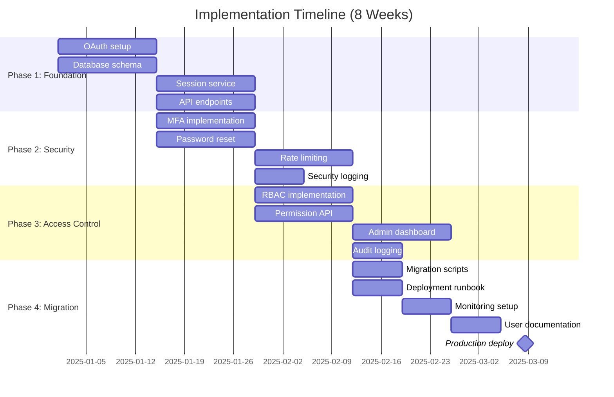

# IMPL-NN: Feature Implementation Plan (Example)

**Implementation Plan ID**: IMPL-NN
**Feature**: [FEATURE_NAME]
**Type**: [New Feature | Enhancement]
**Status**: Planning

**Created**: [YYYY-MM-DD]
**Updated**: [YYYY-MM-DD]
**Target Launch**: [YYYY-MM-DD]

**Project Manager**: [PM_NAME]
**Technical Lead**: [TECH_LEAD_NAME]
**Stakeholders**: [STAKEHOLDER_LIST]

---

## Summary

Problem: [one sentence].
Solution: [one sentence].
Success Criteria: [2–3 measurable goals].

---

## Scope (High-Level)

- In: [core deliverable A], [core deliverable B].
- Out: [deferred C].
- Assumptions: [A1], [A2].
- Constraints: [C1], [C2].

---

## Traceability

Tags (Layer 8 optional):
```markdown
@brd: BRD-NN
@prd: PRD-NN
@ears: EARS-NN
@bdd: BDD-NN
@adr: ADR-NN
@sys: SYS-NN
@req: REQ-NN
```

---

## Implementation Phases (Minimal)

### Phase 1 (Weeks 1–2)
- Objective: Core service foundations
- Deliverables: CTR-NN (contract), SPEC-NN (spec), TASKS-NN (plan)
- Dependencies: [D1]
- Success: [S1], [S2]

### Phase 2 (Weeks 3–4)
- Objective: Feature completion
- Deliverables: SPEC-NN updates, tests, docs
- Dependencies: [D2]
- Success: [S3]
- ⚠️ Email deliverability issues (Mitigation: Configure SPF/DKIM/DMARC)

---

### Phase 3: Access Control (Weeks 5-6)
**Objective**: Role-based permissions and user management

**Deliverables**:
- ✅ RBAC implementation (5 default roles)
- ✅ Permission assignment API
- ✅ User profile CRUD operations
- ✅ Admin user management dashboard
- ✅ Audit logging for permission changes

**Dependencies**:
- [DEPENDENCY - e.g., Frontend team implements RBAC UI]

**Success Criteria**:
- All protected resources enforce permissions
- <1ms authorization check latency p95
- 100% audit coverage for admin actions

**Risks**:
- ⚠️ Complex permission matrix (Mitigation: Start with simple roles, iterate)

---

### Phase 4: Migration & Rollout (Weeks 7-8)
**Objective**: Migrate existing users, production deployment

**Deliverables**:
- ✅ User migration scripts (old auth → new auth)
- ✅ Backward compatibility shims
- ✅ Production deployment runbook
- ✅ Rollback procedures
- ✅ Monitoring dashboards and alerts
- ✅ User documentation and FAQs

**Dependencies**:
- [DEPENDENCY - e.g., Marketing team prepares user communication]
- [DEPENDENCY - e.g., Support team trained on new auth flows]

**Success Criteria**:
- 100% user migration with <1% requiring manual intervention
- Zero downtime deployment
- <5% support ticket increase

**Risks**:
- ⚠️ Migration data inconsistencies (Mitigation: Dry-run migration in staging)
- ⚠️ User confusion during transition (Mitigation: In-app notifications, email campaign)

---

## Team Structure

### Core Team
| Role | Name | Responsibility | Allocation |
|------|------|----------------|------------|
| Project Manager | [PM_NAME] | Timeline, stakeholder communication | 50% |
| Tech Lead | [TECH_LEAD] | Architecture, code reviews | 100% |
| Backend Engineer 1 | [ENGINEER_1] | OAuth integration, session management | 100% |
| Backend Engineer 2 | [ENGINEER_2] | MFA, password reset | 100% |
| Backend Engineer 3 | [ENGINEER_3] | RBAC, user management | 100% |
| QA Engineer | [QA_ENGINEER] | Test strategy, automation | 100% |
| DevOps Engineer | [DEVOPS_ENGINEER] | Infrastructure, deployment | 50% |
| security Engineer | [regulatory_ENGINEER] | security review, penetration testing | 25% |

### Supporting Roles
| Role | Name | Responsibility | Allocation |
|------|------|----------------|------------|
| Frontend Engineer | [FE_ENGINEER] | Login UI, MFA flows | 75% |
| Designer | [DESIGNER] | UX design for auth flows | 25% |
| Technical Writer | [TW] | Documentation | 25% |
| Support Lead | [SUPPORT] | Runbook, documentation | 15% |

**Total Team Capacity**: [TOTAL_PERSON_WEEKS - e.g., 28 person-weeks]

---

## Timeline

### Gantt Chart (8-Week Plan)



**Task Assignments**:

| Phase | Task | Owner |
|-------|------|-------|
| Phase 1 | OAuth setup, Session service | Engineer 1 |
| Phase 1 | Database schema | Engineer 2 |
| Phase 1 | API endpoints | Engineer 3 |
| Phase 2 | MFA implementation | Engineer 2 |
| Phase 2 | Password reset | Engineer 3 |
| Phase 2 | Rate limiting, Security logging | Engineer 1 |
| Phase 3 | RBAC implementation | Engineer 3 |
| Phase 3 | Permission API | Engineer 2 |
| Phase 3 | Admin dashboard | FE Engineer |
| Phase 3 | Audit logging | Engineer 1 |
| Phase 4 | Migration scripts | Engineer 2 |
| Phase 4 | Deployment runbook, Monitoring | DevOps |
| Phase 4 | User documentation | Tech Writer |
| Phase 4 | Production deploy | All |

### Milestones
| Milestone | Date | Deliverable | Owner |
|-----------|------|-------------|-------|
| M1: Foundation Complete | Week 2 End | Core auth working in staging | Engineer 1 |
| M2: security Features Complete | Week 4 End | MFA & password reset tested | Engineer 2 |
| M3: RBAC Complete | Week 6 End | Permissions enforced | Engineer 3 |
| M4: Production Launch | Week 8 End | 100% users migrated | PM |

---

## Technical Specifications

### Components to Implement
| Component | Specification | Owner |
|-----------|---------------|-------|
| [COMPONENT_1 - e.g., OAuth Service] | [SPEC_REF - SPEC-01_oauth_service.yaml] | Engineer 1 |
| [COMPONENT_2 - e.g., Session Manager] | [SPEC_REF - SPEC-02_session_manager.yaml] | Engineer 1 |
| [COMPONENT_3 - e.g., MFA Service] | [SPEC_REF - SPEC-03_mfa_service.yaml] | Engineer 2 |
| [COMPONENT_4 - e.g., RBAC Engine] | [SPEC_REF - SPEC-004_rbac_engine.yaml] | Engineer 3 |

### API Contracts
| Contract | Specification | Consumer |
|----------|---------------|----------|
| [CTR_1 - e.g., Auth API] | [CTR_REF - CTR-01_auth_api.yaml] | Frontend, Mobile |
| [CTR_2 - e.g., User API] | [CTR_REF - CTR-02_user_api.yaml] | Admin Dashboard |

---

## Testing Strategy

### Test Coverage Targets
| Test Type | Coverage Target | Responsibility |
|-----------|----------------|----------------|
| Unit Tests | 95%+ | Engineers |
| Integration Tests | 85%+ | Engineers + QA |
| End-to-End Tests | 75%+ | QA |
| security Tests | 100% (OWASP Top 10) | security Engineer |
| Performance Tests | Key flows <2s p95 | QA + DevOps |

### Test Environments
| Environment | Purpose | Configuration |
|-------------|---------|---------------|
| Dev | Feature development | Isolated databases, mock external services |
| Staging | Integration testing | Production-like, real OAuth providers (test apps) |
| QA | Acceptance testing | Full integration, synthetic user data |
| Production | Live traffic | High availability, monitoring, alerts |

---

## Deployment Strategy

### Deployment Approach
**Strategy**: [STRATEGY - e.g., Blue-Green Deployment, Canary Release, Rolling Update]

**Rollout Schedule**:
1. **Week 7**: Deploy to staging, final QA
2. **Week 8, Day 1**: Deploy to 10% of production traffic (canary)
3. **Week 8, Day 2**: Increase to 50% if no issues
4. **Week 8, Day 3**: Full rollout to 100%

**Rollback Criteria**:
- Error rate >1% on auth endpoints
- Login latency p95 >5s
- >100 support tickets/hour related to auth

**Rollback Procedure**:
1. Revert to previous deployment
2. Re-enable old auth endpoints
3. Pause user migration
4. Incident post-mortem

---

## Risk Management

### Risk Register
| ID | Risk | Probability | Impact | Mitigation | Owner |
|----|------|-------------|--------|------------|-------|
| R1 | OAuth provider outage during launch | Low | High | Deploy during low-traffic window, monitor provider status | DevOps |
| R2 | User migration data loss | Medium | Critical | Dry-run in staging, backup database before migration | Engineer 2 |
| R3 | MFA adoption <50% | High | Medium | In-app prompts, email campaign, incentivize enrollment | PM |
| R4 | Performance degradation under load | Medium | High | Load testing in staging, auto-scaling configured | DevOps |
| R5 | security vulnerability discovered | Low | Critical | Penetration testing, bug bounty, rapid patch process | security Eng |

---

## Budget

### Cost Breakdown
| Category | Item | Quantity | Unit Cost | Total Cost |
|----------|------|----------|-----------|------------|
| Personnel | Engineering (28 person-weeks) | 28 | $[RATE] | $[TOTAL] |
| Infrastructure | Redis cluster | 3 nodes | $[COST]/mo | $[TOTAL] (12 months) |
| Services | Twilio SMS | [VOLUME] msgs | $[RATE] | $[TOTAL] |
| Services | OAuth provider fees | - | - | $[TOTAL] |
| security | Penetration testing | 1 | $[COST] | $[TOTAL] |
| Documentation | Team onboarding documentation for OAuth/OIDC | 1 | $[COST] | $[TOTAL] |
| **Total** | | | | **$[GRAND_TOTAL]** |

**Budget Holder**: [BUDGET_OWNER]
**Approval Status**: [STATUS - e.g., Approved, Pending, Rejected]

---

## Communication Plan

### Stakeholder Communication
| Audience | Frequency | Channel | Owner |
|----------|-----------|---------|-------|
| Executive Leadership | Weekly | Email summary | PM |
| Engineering Team | Daily | Stand-up, Slack | Tech Lead |
| QA Team | Twice/week | Sync meeting | QA Engineer |
| Product Team | Weekly | Demo | PM |
| End Users | Launch week | Email, in-app notification | Marketing |
| Support Team | Before launch | Documentation review, runbook | Support Lead |

### Status Reporting
- **Weekly Status Report**: [TEMPLATE - e.g., Accomplishments, Blockers, Next Steps]
- **Milestone Reviews**: [SCHEDULE - e.g., End of each phase]
- **Launch Readiness Review**: [DATE - Week 7]

---

## Success Metrics

### KPIs (30-Day Post-Launch)
| Metric | Current Baseline | Target | Measurement |
|--------|------------------|--------|-------------|
| Login Success Rate | [X%] | [TARGET - e.g., 98%] | Analytics dashboard |
| Login Latency (p95) | [Xms] | [TARGET - e.g., <2s] | APM (New Relic, Datadog) |
| MFA Adoption Rate | 0% | [TARGET - e.g., 60%] | User database query |
| Auth-Related Support Tickets | [X/week] | [TARGET - e.g., <10/week] | Zendesk |
| security Incidents | [X/month] | 0 | security event logs |
| User Churn Due to Auth | [X%] | [TARGET - e.g., <0.1%] | Analytics cohort analysis |

### Launch Criteria (Go/No-Go Checklist)
- [ ] All P0/P1 bugs resolved
- [ ] security penetration testing passed
- [ ] Performance tests passed (load, stress, endurance)
- [ ] Rollback procedure tested in staging
- [ ] Monitoring dashboards configured
- [ ] Support team trained
- [ ] User communication sent
- [ ] Stakeholder approval obtained

---

## Dependencies

### External Dependencies
| Dependency | Provider | Required By | Status | Risk |
|------------|----------|-------------|--------|------|
| Redis cluster | Platform Team | Week 1 | ✅ Provisioned | Low |
| OAuth app approval | Google, GitHub | Week 1 | 🔄 In Progress | Medium |
| Twilio account | Procurement | Week 3 | ⏳ Pending | High |
| Email service (SES) | AWS Team | Week 3 | ✅ Ready | Low |

### Internal Dependencies
| Dependency | Team | Required By | Status | Risk |
|------------|------|-------------|--------|------|
| Frontend login UI | Frontend Team | Week 2 | 🔄 In Progress | Low |
| Admin dashboard | Frontend Team | Week 6 | ⏳ Not Started | Medium |
| Monitoring dashboards | DevOps Team | Week 7 | ⏳ Not Started | Medium |
| User documentation | Docs Team | Week 7 | ⏳ Not Started | Low |

---

## Compliance & security

### security Reviews
| Review Type | Scheduled | Status | Findings |
|-------------|-----------|--------|----------|
| Threat Modeling | Week 2 | ✅ Complete | 3 mitigations added |
| Code security Review | Week 6 | ⏳ Scheduled | - |
| Penetration Testing | Week 7 | ⏳ Scheduled | - |
| Compliance Audit (SOC2) | Week 8 | ⏳ Scheduled | - |

### Compliance Requirements
- **[STANDARD_1 - e.g., SOC2]**: [CONTROLS - e.g., CC6.1 (Logical Access), CC7.2 (System Monitoring)]
- **[STANDARD_2 - e.g., GDPR]**: [REQUIREMENTS - e.g., Article 32 (security), Article 33 (Breach Notification)]
- **[STANDARD_3 - e.g., OWASP ASVS]**: [LEVEL - e.g., Level 2 compliance]

---

## Open Issues

| ID | Issue | Impact | Owner | Target Resolution |
|----|-------|--------|-------|-------------------|
| I1 | [ISSUE] | [IMPACT] | [OWNER] | [DATE] |
| I2 | [ISSUE] | [IMPACT] | [OWNER] | [DATE] |

---

## Lessons Learned (Post-Launch)

**What Went Well**:
- [POSITIVE_1]
- [POSITIVE_2]

**What Could Be Improved**:
- [IMPROVEMENT_1]
- [IMPROVEMENT_2]

**Action Items for Future Projects**:
- [ACTION_1]
- [ACTION_2]

---

## References

- **Project Charter**: [LINK]
- **Requirements**: REQ-01, REQ-02, REQ-03, ...
- **Architecture Decisions**: ADR-XXX, ADR-YYY, ...
- **Technical Specifications**: SPEC-XXX, ...
- **API Contracts**: CTR-XXX, ...
- **Related Projects**: [LINKS]

---

**Example Usage**: This is a template example. Replace all [PLACEHOLDERS] with your project-specific values.

---

**Document Control**:
- **Version**: 1.0
- **Last Updated**: [YYYY-MM-DD]
- **Next Review**: [YYYY-MM-DD]
- **Approved By**: [APPROVER_NAME], [DATE]
