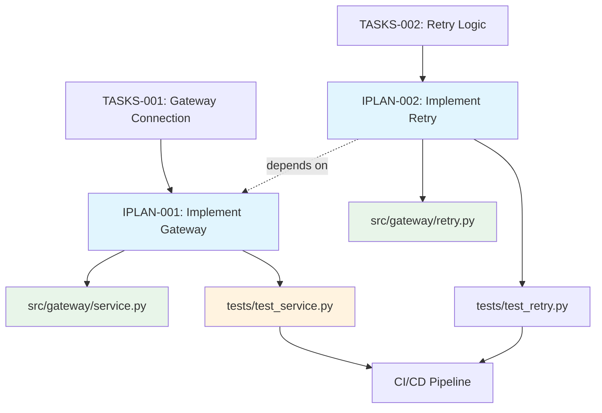

# Traceability Matrix: IPLAN-001 through IPLAN-NNN

## Document Control

| Item | Details |
|------|---------|
| Document ID | TRACEABILITY_MATRIX_IPLAN |
| Title | Comprehensive Implementation Work Plans Traceability Matrix |
| Status | [Active/Draft] |
| Version | 1.0.0 |
| Date Created | YYYY-MM-DD |
| Last Updated | YYYY-MM-DD |
| Author | [Team Name] |
| Purpose | Track bidirectional traceability for all Implementation Plans (IPLAN) including cumulative tag validation |

---

**⚠️ TAG-BASED AUTO-GENERATION AVAILABLE**

This traceability matrix can be automatically generated by scanning iplan documents for cumulative tags.

**Recommended Approach:** Use tag-based auto-discovery instead of manual maintenance.

**Generate automatically using:**
```bash
# Extract tags from all iplan documents
python scripts/extract_tags.py --source ai_dev_flow/IPLAN/ --output generated/iplan_tags.json

# Validate tags against all upstream documents
python scripts/validate_tags_against_docs.py --tags generated/iplan_tags.json --strict

# Generate iplan traceability matrix
python scripts/generate_traceability_matrices.py --type iplan --output ai_dev_flow/IPLAN/IPLAN-000_TRACEABILITY_MATRIX.md
```

**Benefits**:
- ✅ Single source of truth: Tags embedded in iplan documents
- ✅ Always up-to-date: Generated from current documents
- ✅ No manual sync: Automated validation prevents drift
- ✅ Cumulative tag validation: Verifies complete tag chain (Layer 0-12)
- ✅ Coverage metrics: Automatically calculated

**Tag Format**:
- `@brd: BRD-NNN:REQ-NNN` (Business Requirements)
- `@prd: PRD-NNN:REQ-NNN` (Product Requirements)
- `@ears: EARS-NNN:REQ-NNN` (Event-Action-Response)
- `@bdd: BDD-NNN:SCENARIO-NNN` (Behavioral Scenarios)
- `@adr: ADR-NNN` (Architecture Decisions)
- `@sys: SYS-NNN:REQ-NNN` (System Requirements)
- `@req: REQ-NNN` (Atomic Requirements)
- `@impl: IMPL-NNN` (Implementation Plans - optional)
- `@ctr: CTR-NNN:SECTION` (Contracts - optional)
- `@spec: SPEC-NNN:SECTION` (Technical Specifications)
- `@tasks: TASKS-NNN:PHASE-X.Y` (Code Generation Plans)

See: [TRACEABILITY.md](../TRACEABILITY.md#cumulative-tagging-hierarchy) for complete tag-based workflow.

---

## 1. Overview

### 1.1 Document Type Description

Implementation Plans (IPLAN) provide **session-based execution context** with bash commands, verification steps, and specific instructions for AI assistants to implement TASKS documents. iplan translate code generation plans into executable session plans.

**Layer 12 Position**: iplan sits between TASKS (Layer 11) and Code (Layer 13) in the 16-layer architecture (Layer 0-15).

**Distinction from TASKS**:
- **TASKS**: AI code generation instructions (WHAT code to generate)
- **IPLAN**: Implementation work plans (HOW to execute with bash commands)

### 1.2 Coverage Scope

This matrix tracks all iplan documents, mapping:
- **Upstream**: Complete tag chain through all 11-12 upstream layers
- **Parent**: Direct TASKS document being implemented
- **Downstream**: Code files, test results, deployment artifacts

### 1.3 Statistics

- **Total iplan Tracked**: [X] documents
- **Total Implementation Phases**: [Y] phases
- **Completed Implementations**: [Z] documents
- **Tag Compliance Rate**: [XX%] with all 9 mandatory tags
- **Coverage Period**: [Start Date] to [End Date]
- **Last Updated**: YYYY-MM-DD

---

---

## 2. Required Tags (Cumulative Tagging Hierarchy - Layer 12)

### 2.1 Tag Requirements for IPLAN Artifacts

**Layer**: 12
**Artifact Type**: IPLAN (Session Plans)
**Required Tags**: `@brd`, `@prd`, `@ears`, `@bdd`, `@adr`, `@sys`, `@req`, `@spec`, `@tasks`
**Tag Count**: 9-11 (includes all layers through @tasks)

### 2.2 Tag Format

```markdown
@brd: BRD-009:FR-015
@prd: PRD-016:FEATURE-003
@ears: EARS-012:EVENT-002
@bdd: BDD-015:scenario-place-order
@adr: ADR-033
@sys: SYS-012:FUNC-001
@req: REQ-045:interface-spec
@impl: IMPL-003:phase2
@ctr: CTR-005
@spec: SPEC-018
@tasks: TASKS-015
```

**Format Rules**:
- Prefix: `@` symbol
- Artifact Type: lowercase (`brd`, `prd`, `ears`, `bdd`, `adr`, `sys`, `req`, `spec`, `tasks`)
- Separator: colon `:` after artifact type, `:` between document ID and requirement ID
- Document ID: Standard format (e.g., `IPLAN-NNN`)
- Requirement ID: Specific requirement/section identifier
- Multiple Values: comma-separated for same artifact type

### 2.3 Example: IPLAN with Required Tags

```markdown
# session-2025-11-13-order-service: Order Service Development Session

## 7. Traceability

### 7.1 Upstream Sources

**Required Tags** (Cumulative Tagging Hierarchy - Layer 12):
```markdown
@brd: BRD-009:FR-015
@prd: PRD-016:FEATURE-003
@ears: EARS-012:EVENT-002
@bdd: BDD-015:scenario-place-order
@adr: ADR-033
@sys: SYS-012:FUNC-001
@req: REQ-045:interface-spec
@impl: IMPL-003:phase2
@ctr: CTR-005
@spec: SPEC-018
@tasks: TASKS-015
```

### 7.2 Downstream Artifacts
[Links to SPEC, TASKS, Code that reference this IPLAN]
```

### 2.4 Validation Rules

1. **Required**: Each IPLAN artifact MUST include at least one tag for each required layer
2. **Format Compliance**: All tags must follow `@artifact-type:DOC-ID:REQ-ID` format
3. **Valid References**: All referenced documents and requirements must exist
4. **No Gaps**: Cannot skip any required upstream layer in the chain
5. **Tag Count**: Must have exactly 9-11 (includes all layers through @tasks) tags for Layer 12

### 2.5 Tag Discovery

IPLAN tags can be discovered automatically:
```bash
# Find all IPLANs and their upstream tags
python scripts/extract_tags.py --type IPLAN --show-all-upstream

# Validate session-2025-11-13-order-service has required tags
python scripts/validate_tags_against_docs.py \
  --artifact session-2025-11-13-order-service \
  --expected-layers brd,prd,ears,bdd,adr,sys,req,spec,tasks \
  --strict

# Generate IPLAN traceability report
python scripts/generate_traceability_matrices.py \
  --type IPLAN \
  --show-coverage
```

### 2.6 IPLAN Traceability Pattern

**Key Role**: iplan organizes session-specific implementation work, maintaining complete chain from business requirements through tasks.

---

## 4. Required Tags Section

**Layer 12 Cumulative Tagging Requirements**

All iplan documents MUST include these tags to maintain traceability chain:

### 3.1 Mandatory Tags (9 Required)

| Tag | Layer | Artifact Type | Format | Validation Status |
|-----|-------|---------------|--------|-------------------|
| @brd | 1 | Business Requirements | `@brd: BRD-NNN:REQ-NNN` | [✅/❌] |
| @prd | 2 | Product Requirements | `@prd: PRD-NNN:REQ-NNN` | [✅/❌] |
| @ears | 3 | Event-Action-Response | `@ears: EARS-NNN:REQ-NNN` | [✅/❌] |
| @bdd | 4 | Behavioral Scenarios | `@bdd: BDD-NNN:SCENARIO-NNN` | [✅/❌] |
| @adr | 5 | Architecture Decisions | `@adr: ADR-NNN` | [✅/❌] |
| @sys | 6 | System Requirements | `@sys: SYS-NNN:REQ-NNN` | [✅/❌] |
| @req | 7 | Atomic Requirements | `@req: REQ-NNN` | [✅/❌] |
| @spec | 10 | Technical Specifications | `@spec: SPEC-NNN:SECTION` | [✅/❌] |
| @tasks | 11 | Code Generation Plans | `@tasks: TASKS-NNN:PHASE-X.Y` | [✅/❌] |

### 3.2 Optional Tags (Conditional)

| Tag | Layer | Artifact Type | Format | Required If... |
|-----|-------|---------------|--------|----------------|
| @impl | 8 | Implementation Plans | `@impl: IMPL-NNN` | Project uses IMPL artifacts |
| @ctr | 9 | Interface Contracts | `@ctr: CTR-NNN:SECTION` | Contracts defined in project |

### 3.3 Tag Format Validation

**Standard Format**: `@artifact-type: DOCUMENT-ID:REQUIREMENT-ID`

**Format Rules**:
1. Lowercase artifact type (e.g., `@brd`, not `@BRD`)
2. Uppercase document ID with hyphens (e.g., `BRD-001`, not `brd_001`)
3. Colon separator with space after artifact type
4. Requirement ID or section after document ID (optional for some types)

**Examples**:
```markdown
✅ Correct: @brd: BRD-001:REQ-042
✅ Correct: @adr: ADR-002
✅ Correct: @spec: SPEC-001:connection_service
✅ Correct: @tasks: TASKS-001:PHASE-2.1

❌ Wrong: @BRD: brd-001:req-042 (case incorrect)
❌ Wrong: @brd:BRD-001:REQ-042 (missing space)
❌ Wrong: @brd BRD-001 REQ-042 (wrong separators)
```

### 3.4 Validation Requirements for Complete Chain

**Chain Integrity Rules**:
1. **Completeness**: All 9 mandatory tags present (11 if @impl/@ctr exist)
2. **Document Existence**: Each tagged document must exist in repository
3. **Bidirectional Links**: Tagged documents must reference this iplan in downstream traceability
4. **Format Compliance**: All tags match standard format specification
5. **Layer Hierarchy**: Tags respect cumulative tagging hierarchy (Layers 0-12)
6. **No Duplicates**: No duplicate tags for same artifact type
7. **Valid References**: Document IDs and requirement IDs exist in referenced documents

**Validation Commands**:
```bash
# Validate single iplan document
python scripts/validate_tags_against_docs.py --file IPLAN/IPLAN-001_*.md

# Validate all iplan documents
for file in IPLAN/IPLAN-*.md; do
  python scripts/validate_tags_against_docs.py --file "$file"
done

# Generate coverage report
python scripts/generate_tag_coverage_report.py --artifact-type iplan
```

---

## 5. Complete iplan Inventory

| ID | Title | Status | Parent TASKS | Tag Compliance | Estimated Effort | Actual Effort | Date | Upstream Tags | Downstream Artifacts |
|----|-------|--------|--------------|----------------|------------------|---------------|------|---------------|---------------------|
| IPLAN-001 | [Implementation plan title] | Completed | TASKS-001 | ✅ 9/9 | 80h | 85h | YYYY-MM-DD | All 9 tags verified | Code: src/service.py, Tests: tests/test_service.py |
| IPLAN-002 | [Implementation plan title] | In Progress | TASKS-002 | ✅ 11/11 | 40h | 25h (partial) | YYYY-MM-DD | All 11 tags verified | Code: src/feature.py |
| IPLAN-NNN | ... | ... | ... | ... | ... | ... | ... | ... | ... |

**Status Legend**:
- **Draft**: Document created, not started
- **Ready for Implementation**: Prerequisites verified
- **In Progress**: Active implementation work
- **Blocked**: Waiting on dependency
- **Completed**: All phases done, verified
- **On Hold**: Paused

**Tag Compliance Legend**:
- ✅ `9/9` - All mandatory tags present
- ✅ `11/11` - All mandatory + optional tags present
- ⚠️ `8/9` - Missing mandatory tag(s)
- ❌ `0/9` - No tags present

---

## 6. Upstream Traceability

### 5.1 Complete Cumulative Tag Chain

| iplan ID | @brd | @prd | @ears | @bdd | @adr | @sys | @req | @impl | @ctr | @spec | @tasks | Tag Completeness |
|---------------|------|------|-------|------|------|------|------|-------|------|-------|--------|------------------|
| IPLAN-001 | ✅ BRD-001 | ✅ PRD-001 | ✅ EARS-001 | ✅ BDD-001 | ✅ ADR-002 | ✅ SYS-002 | ✅ REQ-001 | ✅ IMPL-001 | ✅ CTR-001 | ✅ SPEC-001 | ✅ TASKS-001 | 11/11 ✅ |
| IPLAN-002 | ✅ BRD-001 | ✅ PRD-001 | ✅ EARS-001 | ✅ BDD-002 | ✅ ADR-003 | ✅ SYS-002 | ✅ REQ-002 | - | - | ✅ SPEC-002 | ✅ TASKS-002 | 9/9 ✅ |
| IPLAN-NNN | ... | ... | ... | ... | ... | ... | ... | ... | ... | ... | ... | ... |

**Validation Status**:
- ✅ Green: Tag present and document verified
- ⚠️ Yellow: Tag present but document not found
- ❌ Red: Tag missing

### 5.2 TASKS → iplan Traceability

| TASKS ID | TASKS Title | iplan IDs | iplan Titles | Relationship |
|----------|------------|-----------------|-------------------|--------------|
| TASKS-001 | [Code generation plan] | IPLAN-001, IPLAN-002 | [Implementation plans] | 1:N mapping: TASKS may have multiple IPLAN (sessions) |
| TASKS-002 | [Code generation plan] | IPLAN-003 | [Implementation plan] | 1:1 mapping: Single session implementation |
| TASKS-NNN | ... | ... | ... | ... |

### 5.3 Upstream Source Summary

| Source Type | Layer | Total Sources | iplan Referencing | Coverage % |
|-------------|-------|---------------|------------------------|------------|
| BRD | 1 | [X] | [Y] iplan | XX% |
| PRD | 2 | [X] | [Y] iplan | XX% |
| EARS | 3 | [X] | [Y] iplan | XX% |
| BDD | 4 | [X] | [Y] iplan | XX% |
| ADR | 5 | [X] | [Y] iplan | XX% |
| SYS | 6 | [X] | [Y] iplan | XX% |
| REQ | 7 | [X] | [Y] iplan | XX% |
| IMPL (optional) | 8 | [X] | [Y] iplan | XX% |
| CTR (optional) | 9 | [X] | [Y] iplan | XX% |
| SPEC | 10 | [X] | [Y] iplan | XX% |
| TASKS | 11 | [X] | [Y] iplan | XX% |

### 5.4 Tag Validation Status by Document

| iplan ID | BRD Exists | PRD Exists | EARS Exists | BDD Exists | ADR Exists | SYS Exists | REQ Exists | SPEC Exists | TASKS Exists | Overall Status |
|---------------|-----------|-----------|------------|-----------|-----------|-----------|-----------|------------|-------------|---------------|
| IPLAN-001 | ✅ | ✅ | ✅ | ✅ | ✅ | ✅ | ✅ | ✅ | ✅ | ✅ Valid |
| IPLAN-002 | ✅ | ✅ | ✅ | ⚠️ Not Found | ✅ | ✅ | ✅ | ✅ | ✅ | ⚠️ Incomplete |
| IPLAN-NNN | ... | ... | ... | ... | ... | ... | ... | ... | ... | ... |

---

## 7. Downstream Traceability

### 6.1 iplan → Code Traceability

| iplan ID | iplan Title | Code Files | Modules/Classes | LOC | Relationship |
|---------------|------------------|------------|-----------------|-----|--------------|
| IPLAN-001 | [Implementation plan] | src/ibmcp/gateway/service.py | IBGatewayConnectionService | 450 | Direct implementation from plan |
| IPLAN-002 | [Implementation plan] | src/ibmcp/gateway/retry.py, src/ibmcp/gateway/circuit_breaker.py | RetryHandler, CircuitBreaker | 320 | Multi-module implementation |
| IPLAN-NNN | ... | ... | ... | ... | ... |

### 6.2 iplan → Tests Traceability

| iplan ID | iplan Title | Test Files | Test Functions | Coverage % | Relationship |
|---------------|------------------|------------|----------------|------------|--------------|
| IPLAN-001 | [Implementation plan] | tests/unit/test_service.py | test_connect(), test_disconnect(), ... | 95% | Tests implemented per plan |
| IPLAN-002 | [Implementation plan] | tests/integration/test_retry.py | test_retry_logic(), ... | 85% | Integration tests verified |
| IPLAN-NNN | ... | ... | ... | ... | ... |

### 6.3 iplan → Deployment Artifacts Traceability

| iplan ID | Deployment Files | Configuration | Infrastructure | CI/CD Pipeline |
|---------------|------------------|---------------|----------------|----------------|
| IPLAN-001 | docker/gateway.Dockerfile | config/gateway.yaml | terraform/gateway.tf | .github/workflows/gateway-ci.yml |
| IPLAN-002 | - | config/retry.yaml | - | - |
| IPLAN-NNN | ... | ... | ... | ... |

---

## 8. Tag Completeness Validation

### 7.1 Missing Tags Report

| iplan ID | Missing Mandatory Tags | Missing Optional Tags | Action Required |
|---------------|----------------------|----------------------|-----------------|
| IPLAN-002 | None | @impl, @ctr | Add optional tags if project uses IMPL/CTR |
| IPLAN-NNN | ... | ... | ... |

**Status**:
- ✅ All iplan have 9 mandatory tags
- ⚠️ Some iplan missing optional tags (if project uses them)
- ❌ Some iplan have missing mandatory tags

### 7.2 Tag Coverage Matrix

| iplan ID | Layer 1 (BRD) | Layer 2 (PRD) | Layer 3 (EARS) | Layer 4 (BDD) | Layer 5 (ADR) | Layer 6 (SYS) | Layer 7 (REQ) | Layer 10 (SPEC) | Layer 11 (TASKS) | Coverage % |
|---------------|--------------|--------------|---------------|--------------|--------------|--------------|--------------|----------------|----------------|------------|
| IPLAN-001 | ✅ | ✅ | ✅ | ✅ | ✅ | ✅ | ✅ | ✅ | ✅ | 100% |
| IPLAN-002 | ✅ | ✅ | ✅ | ✅ | ✅ | ✅ | ✅ | ✅ | ✅ | 100% |
| IPLAN-NNN | ... | ... | ... | ... | ... | ... | ... | ... | ... | ... |

**Target**: 100% of iplan documents have 100% tag coverage

### 7.3 Bidirectional Link Validation

| iplan ID | Upstream Links Valid | Downstream Links Valid | Bidirectional Status |
|---------------|---------------------|----------------------|---------------------|
| IPLAN-001 | ✅ All 9 tags resolve | ✅ Code files reference | ✅ Complete |
| IPLAN-002 | ⚠️ BDD-002 not found | ✅ Code files reference | ⚠️ Incomplete |
| IPLAN-NNN | ... | ... | ... |

---

## 9. Implementation Metrics

### 8.1 Effort Tracking

| iplan ID | Phases | Estimated Effort | Actual Effort | Variance | Variance % | Status |
|---------------|--------|------------------|---------------|----------|------------|--------|
| IPLAN-001 | 4 | 80h | 85h | +5h | +6.25% | Completed |
| IPLAN-002 | 4 | 40h | 25h (partial) | -15h | -37.5% | In Progress |
| IPLAN-NNN | ... | ... | ... | ... | ... | ... |

**Summary**:
- Total Estimated: [XXX] hours
- Total Actual: [YYY] hours
- Average Variance: [±ZZ%]

### 8.2 Test Coverage from iplan

| iplan ID | Unit Tests | Integration Tests | BDD Tests | Total Coverage % | Target % | Met Target |
|---------------|------------|-------------------|-----------|------------------|----------|------------|
| IPLAN-001 | 95% | 90% | 100% | 95% | 85% | ✅ Yes |
| IPLAN-002 | 80% | 75% | 90% | 82% | 85% | ⚠️ Close |
| IPLAN-NNN | ... | ... | ... | ... | ... | ... |

### 8.3 Phase Completion Metrics

| iplan ID | Total Phases | Completed | In Progress | Pending | Blocked | Completion % |
|---------------|--------------|-----------|-------------|---------|---------|--------------|
| IPLAN-001 | 4 | 4 | 0 | 0 | 0 | 100% |
| IPLAN-002 | 4 | 2 | 1 | 1 | 0 | 50% |
| IPLAN-NNN | ... | ... | ... | ... | ... | ... |

---

## 10. Implementation Status

### 9.1 iplan Execution Progress

```mermaid
gantt
    title iplan Implementation Timeline
    dateFormat YYYY-MM-DD
    section IPLAN-001
    Phase 1: Foundation    :done, p1, 2025-11-10, 2d
    Phase 2: Implementation:done, p2, after p1, 5d
    Phase 3: Testing       :done, p3, after p2, 3d
    Phase 4: QA            :done, p4, after p3, 2d
    section IPLAN-002
    Phase 1: Foundation    :done, p5, 2025-11-18, 1d
    Phase 2: Implementation:active, p6, after p5, 4d
    Phase 3: Testing       :p7, after p6, 2d
    Phase 4: QA            :p8, after p7, 1d
```

### 9.2 Status Summary

| Status | Count | Percentage | iplan IDs |
|--------|-------|------------|----------------|
| Draft | 0 | 0% | - |
| Ready for Implementation | 1 | 20% | IPLAN-003 |
| In Progress | 2 | 40% | IPLAN-002, IPLAN-004 |
| Blocked | 0 | 0% | - |
| Completed | 2 | 40% | IPLAN-001, IPLAN-005 |
| On Hold | 0 | 0% | - |

---

## 11. Cross-iplan Dependencies



### 10.1 Inter-iplan Dependencies

| Source iplan | Target iplan | Dependency Type | Description |
|-------------------|-------------------|-----------------|-------------|
| IPLAN-001 | IPLAN-002 | Prerequisite | Gateway service must be implemented before retry logic |
| IPLAN-003 | IPLAN-001 | Uses | Circuit breaker uses gateway connection |
| IPLAN-NNN | ... | ... | ... |

---

## 12. Verification Methods

### 11.1 Tag Validation Script

**Location**: `/opt/data/docs_flow_framework/ai_dev_flow/scripts/validate_tags_against_docs.py`

**Usage**:
```bash
# Validate single document
python scripts/validate_tags_against_docs.py --file IPLAN/IPLAN-001_*.md

# Validate all iplan
for file in IPLAN/IPLAN-*.md; do
  echo "Validating $file..."
  python scripts/validate_tags_against_docs.py --file "$file"
done

# Generate validation report
python scripts/validate_tags_against_docs.py --artifact-type iplan --report-output validation_report.md
```

**Expected Output**:
```
✅ Tag validation passed
✅ Found 9/9 mandatory tags
✅ Found 2/2 optional tags (@impl, @ctr)
✅ All tags resolve to existing documents
✅ Tag format compliant
✅ Cumulative hierarchy respected
✅ Bidirectional links validated
```

### 11.2 Manual Validation Checklist

For each iplan document:

- [ ] All 9 mandatory tags present (@brd through @tasks)
- [ ] Optional tags included if project uses them (@impl, @ctr)
- [ ] Tag format correct: `@type: DOC-ID:REQ-ID`
- [ ] Each tag resolves to existing document
- [ ] No duplicate tags
- [ ] Upstream documents reference this iplan
- [ ] Downstream code files reference this iplan
- [ ] Traceability matrix updated
- [ ] Index file updated

---

## 13. Maintenance Guidelines

### 12.1 Updating This Matrix

**When creating new iplan**:
1. Add row to "Complete iplan Inventory" (Section 3)
2. Add tag chain to "Complete Cumulative Tag Chain" (Section 4.1)
3. Validate all tags exist: `python scripts/validate_tags_against_docs.py`
4. Update parent TASKS relationship (Section 4.2)
5. Update tag coverage matrix (Section 6.2)
6. Run matrix generation script to auto-populate

**When completing iplan**:
1. Update status to "Completed"
2. Add actual effort hours
3. Calculate variance
4. Add downstream code and test files
5. Verify test coverage metrics
6. Update phase completion (Section 7.3)

**When tags are modified**:
1. Re-run validation script
2. Update tag completeness column
3. Check bidirectional link validation
4. Update missing tags report if applicable

### 12.2 Review Schedule

- **Daily**: Developers update implementation status
- **Weekly**: Tech leads validate tag compliance
- **Sprint End**: Project managers review effort metrics
- **Monthly**: Architects validate traceability completeness

---

## 14. Related Documents

- **Index**: [IPLAN-000_index.md](./IPLAN-000_index.md) - Master index of all iplan
- **Template**: [IPLAN-TEMPLATE.md](./IPLAN-TEMPLATE.md) - Use this to create new iplan
- **README**: [README.md](./README.md) - Complete guide to iplan with tagging requirements
- **Framework**: [../TRACEABILITY.md](../TRACEABILITY.md) - Cumulative tagging hierarchy documentation
- **Parent Artifact**: [../TASKS/README.md](../TASKS/README.md) - TASKS code generation plans

---

**Matrix Version**: 1.0.0
**Last Updated**: YYYY-MM-DD
**Next Review**: YYYY-MM-DD (weekly)
**Maintained By**: Development Team
**Tag Compliance Target**: 100% of documents with all mandatory tags
