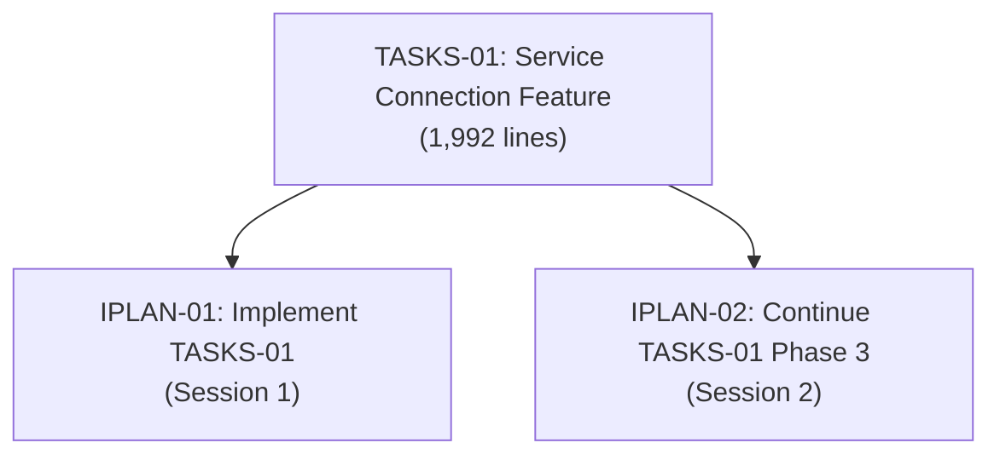
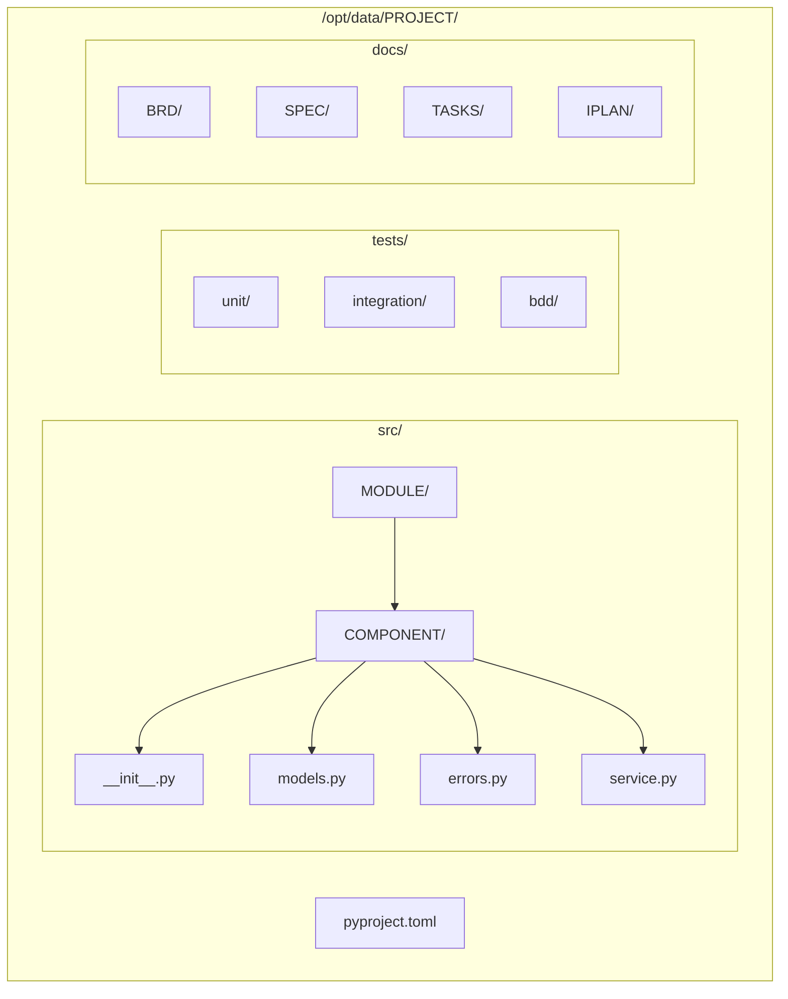

# Implementation Plans (IPLAN): Session-Based Execution Plans

Implementation Plans (IPLAN) provide **session-based execution context** with bash commands, verification steps, and specific instructions for AI assistants to implement TASKS documents. IPLAN serve as the executable bridge between code generation plans and actual implementation.

## Purpose

IPLAN create the **implementation execution roadmap** that:
- **Provides Session Context**: Bash commands, file paths, environment setup for AI assistants
- **Guides Step-by-Step Execution**: Commands and steps runnable in AI coding assistants or CLI tools
- **Establishes Verification Checkpoints**: Clear validation steps after each phase
- **Maintains Implementation State**: Tracks progress through phases and tasks
- **Enables Context Resumption**: Allows new sessions to continue work from checkpoints
- **Ensures Traceability**: Links implementation work to TASKS plans and upstream requirements

## Position in Document Workflow

**⚠️ See [../index.md](../index.md#traceability-flow) for the authoritative workflow visualization.**


**Layer 12: Implementation Work Plans**

IPLAN sit between TASKS (code generation plans) and Code (implementation) in the 16-layer architecture (Layer 0-15):

**⚠️ See for the full document flow: [SPEC_DRIVEN_DEVELOPMENT_GUIDE.md](../SPEC_DRIVEN_DEVELOPMENT_GUIDE.md)**

> **Note on Diagram Labels**: The above flowchart shows the sequential workflow. For formal layer numbers used in cumulative tagging, always reference the 16-layer architecture (Layers 0-15) defined in README.md. Diagram groupings are for visual clarity only.

**Key Workflow Position**:
- **Upstream**: TASKS (Layer 11) - AI code generation plan (WHAT to generate)
- **Current**: IPLAN (Layer 12) - Implementation work plan (HOW to execute)
- **Downstream**: Code (Layer 13) - Actual source code implementation

## IPLAN vs TASKS: Critical Distinction

Understanding the difference between TASKS and IPLAN is essential:

| Aspect | TASKS (Layer 11) | IPLAN (Layer 12) |
|--------|------------------|------------------------|
| **Purpose** | Code generation instructions for AI | Session-based execution plans with bash commands |
| **Scope** | WHAT code to generate | HOW to execute implementation |
| **Audience** | AI code generators (abstract) | AI assistants in active sessions (specific) |
| **Content** | Classes, methods, algorithms, patterns | Bash commands, file paths, verification steps |
| **Format** | Markdown with code examples | Markdown with executable bash blocks |
| **Session Context** | Session-agnostic | Session-specific with environment details |
| **Verification** | Acceptance criteria | Bash verification commands |
| **Example** | "Implement ResourceLimitService class with retry logic" | "Run: `touch src/service.py && pytest tests/` → Verify: 0 errors" |
| **Required Tags** | @brd through @spec | @brd through @tasks (includes @tasks tag) |

**Analogy**:
- **TASKS**: Architectural blueprint showing what rooms to build and their purpose
- **IPLAN**: Construction work order with specific tasks, tools needed, and inspection checkpoints

**Flow**:
```
TASKS defines WHAT → IPLAN defines HOW → Code implements it
```

**Example Comparison**:

**TASKS-01** (excerpt):
```markdown
### Phase 2.1: Implement Connection Service (12 hours)
- Create ServiceConnector class
- Implement async connect() method with retry logic
- Add connection state machine (5 states)
- Include circuit breaker pattern
- Verify: Unit tests pass with 85% coverage
```

**IPLAN-01** (corresponding section):
```bash
# Phase 2.1: Implement Connection Service
cd ${PROJECT_ROOT}

# Create module file
touch src/[project]/services/connector.py

# Implement class (paste from TASKS-01 specification)
# ... implementation details ...

# Run unit tests
pytest tests/unit/services/test_connector.py -v

# Verify coverage
pytest --cov=src/[project]/services/connector --cov-report=term
# Expected: ≥85% coverage

# Verify type checking
mypy src/[project]/services/connector.py
# Expected: 0 errors
```

## When to Create IPLAN Documents

Create IPLAN documents when:

1. **Starting Implementation**: Beginning work on a TASKS document in a new session
2. **Complex Setup**: Implementation requires specific environment configuration
3. **Multi-Phase Work**: Implementation spans multiple sessions and needs state tracking
4. **Team Handoff**: Another developer or AI assistant will continue the work
5. **Context Preservation**: Session-specific decisions need documentation
6. **Verification Critical**: Step-by-step validation checkpoints required

**Do NOT create IPLAN when**:
- Simple, one-file implementations (<100 lines)
- No environment setup needed
- Work completed in single session without interruption
- TASKS document already provides sufficient execution detail

## Cumulative Tagging Requirements

**Layer 12 Position**: IPLAN inherits ALL tags from upstream layers (0-11)

### Complete Required Tag List

All IPLAN documents MUST include these 9 mandatory tags:

1. `@brd: BRD.NN.EE.SS` - Business Requirements Document (Layer 1)
2. `@prd: PRD.NN.EE.SS` - Product Requirements Document (Layer 2)
3. `@ears: EARS.NN.EE.SS` - Event-Action-Response-State Requirements (Layer 3)
4. `@bdd: BDD.NN.EE.SS` - Behavior-Driven Development Scenarios (Layer 4)
5. `@adr: ADR-NN` - Architecture Decision Records (Layer 5)
6. `@sys: SYS.NN.EE.SS` - System Requirements (Layer 6)
7. `@req: REQ.NN.EE.SS` - Atomic Requirements (Layer 7)
8. `@spec: SPEC-NN` - Technical Specifications (Layer 10)
9. `@tasks: TASKS.NN.EE.SS` - Code Generation Plan (Layer 11)

### Optional Tags (Conditional)

Include these tags if present in your project:

10. `@impl: IMPL.NN.EE.SS` - Implementation Plan (Layer 8) - **if project uses IMPL artifacts**
11. `@ctr: CTR-NN` - Interface Contracts (Layer 9) - **if contracts are defined**

### Tag Format Specification

**Standard Format**: `@artifact-type: TYPE.NN.TT.SS (Unified Feature ID)`

**Component Breakdown**:
- `@artifact-type` - lowercase artifact type (brd, prd, ears, bdd, adr, sys, req, impl, ctr, spec, tasks)
- `DOCUMENT-ID` - Uppercase with hyphens (e.g., BRD-01, SPEC-03, TASKS-01)
- `REQUIREMENT-ID` - Specific requirement, scenario, or section referenced

**Examples by Layer**:

```markdown
## Traceability Tags

@brd: BRD.01.01.42
@prd: PRD.01.01.15
@ears: EARS.01.24.03
@bdd: BDD.01.13.05, BDD.07.13.12
@adr: ADR-02, ADR-005
@sys: SYS.02.25.01
@req: REQ.01.26.01, REQ.02.26.01, REQ.03.26.01, REQ.10.26.01
@impl: IMPL.01.28.01 (optional - if project uses IMPL)
@ctr: CTR-01 (optional - if contracts defined)
@spec: SPEC-01
@tasks: TASKS.01.29.01, TASKS.01.29.04
```

### Tag Inheritance Rules

**Cumulative Tagging Hierarchy** (16 layers - Layer 0 through Layer 15):

| Layer | Artifact Type | Required Tags | New Tag Added |
|-------|---------------|---------------|---------------|
| 0 | Strategy | None (external) | - |
| 1 | BRD | None | @brd |
| 2 | PRD | @brd | @prd |
| 3 | EARS | @brd, @prd | @ears |
| 4 | BDD | @brd, @prd, @ears | @bdd |
| 5 | ADR | @brd through @bdd | @adr |
| 6 | SYS | @brd through @adr | @sys |
| 7 | REQ | @brd through @sys | @req |
| 8 | IMPL | @brd through @req | @impl (optional) |
| 9 | CTR | @brd through @req, (@impl) | @ctr (optional) |
| 10 | SPEC | @brd through @req, (@impl, @ctr) | @spec |
| 11 | TASKS | @brd through @spec (include optional if present) | @tasks |
| **12** | **IPLAN** | **@brd through @tasks** | **@IPLAN** |
| 13 | Code | ALL tags including @IPLAN | @code |
| 14 | Tests | @brd through @code | @test |
| 15 | Validation | ALL tags from all documents | @validation |

**Key Principle**: Each layer inherits ALL tags from upstream layers and adds its own tag.

### Tag Validation Requirements

1. **Completeness Check**: All 9 mandatory tags present (11 if @impl/@ctr exist)
2. **Chain Integrity**: Each tag references a valid, existing upstream document
3. **Bidirectional Links**: Tagged documents reference this IPLAN in their downstream traceability
4. **Format Compliance**: Tags follow `@type: DOC-ID:REQ-ID` syntax exactly
5. **Layer Hierarchy**: Tags respect the cumulative tagging hierarchy order

### Validation Methods

**Automated Validation**:
```bash
# Run tag validation script
python /opt/data/docs_flow_framework/ai_dev_flow/scripts/validate_tags_against_docs.py \
  --file IPLAN/IPLAN-01_example.md

# Expected output:
# ✅ All 9 mandatory tags present
# ✅ All tags resolve to existing documents
# ✅ Tag format valid
# ✅ Cumulative hierarchy respected
```

**Manual Validation Checklist**:
- [ ] Count tags: 9 mandatory + optional @impl/@ctr if applicable
- [ ] Verify each tag links to existing document
- [ ] Check tag format: `@type: DOC-ID:REQ-ID`
- [ ] Confirm upstream documents reference this IPLAN
- [ ] Update traceability matrix with tag status

### Tag Examples by Project Type

**Example 1: Project with IMPL and CTR**:
```markdown
@brd: BRD.01.01.42
@prd: PRD.01.01.15
@ears: EARS.01.24.03
@bdd: BDD.01.13.05
@adr: ADR-02
@sys: SYS.02.25.01
@req: REQ.01.26.01, REQ.02.26.01
@impl: IMPL.01.28.01 (present in this project)
@ctr: CTR-01 (present in this project)
@spec: SPEC-01
@tasks: TASKS.01.29.01
```
Total: 11 tags (9 mandatory + 2 optional)

**Example 2: Project without IMPL and CTR**:
```markdown
@brd: BRD.01.01.42
@prd: PRD.01.01.15
@ears: EARS.01.24.03
@bdd: BDD.01.13.05
@adr: ADR-02
@sys: SYS.02.25.01
@req: REQ.01.26.01, REQ.02.26.01
@spec: SPEC-01
@tasks: TASKS.01.29.01
```
Total: 9 tags (all mandatory, no optional)

## Document Structure Guide

### 1. Document Control Header

**Purpose**: Metadata for tracking and version control

**Required Fields**:
```markdown
| Item | Details |
|------|---------|
| **ID** | IPLAN-NN |
| **Status** | Draft/Ready/In Progress/Completed/Blocked |
| **Version** | 1.0.0 |
| **Created** | YYYY-MM-DD HH:MM:SS TZ |
| **Last Updated** | YYYY-MM-DD HH:MM:SS TZ |
| **Author** | [AI Assistant/Developer Name] |
| **Estimated Effort** | [X hours] |
| **Complexity** | [1-5: 1=minimal, 5=architectural] |
| **Parent TASKS** | TASKS-NN |
```

### 2. Position in Workflow

**Purpose**: Context about Layer 12 position

**Content**:
- Quick reference diagram
- Purpose statement
- Input/output description
- Consumer identification

### 3. Objective section

**Purpose**: Clear deliverables statement

**Format**:
```markdown
## Objective

[1-2 sentence goal statement]

**Deliverables**:
- [Specific deliverable #1]
- [Specific deliverable #2]
- [Specific deliverable #3]
```

### 4. Context section

**Purpose**: Current state and key decisions

**Subsections**:
- **Current State Analysis**: Documentation/code status
- **Key Technical Decisions**: Architecture, error handling, resilience, observability

**Format**:
```markdown
## Context

### Current State Analysis

**Documentation Status**: ✅ 100% Complete
- SPEC-NN: [description]
- REQ-NN through REQ-NN: [coverage]
- BDD-NN: [scenarios]

**Code Status**: ❌ 0% - Starting from Scratch
- [Current implementation state]

### Key Technical Decisions

**Architecture** (from ADR-NN):
- [Decision #1]
- [Decision #2]

**Error Handling** (from SPEC-NN):
- [Strategy]
```

### 5. Task List section

**Purpose**: Phase-based checklist of tasks

**Format**:
```markdown
## Task List

### Phase 0: Documentation (COMPLETED ✅)
- [x] Task completed
- [x] Another completed task

### Phase 1: Foundation (8 hours) - PENDING
- [ ] **TASK-1.1**: Description
  - Action item
  - Verification step

- [ ] **TASK-1.2**: Description
  - Action item
  - Verification step
```

**Best Practices**:
- Group tasks into logical phases (0-4 typically)
- Include time estimates per phase
- Mark phase status (COMPLETED/PENDING/IN PROGRESS)
- Use checkboxes for trackable progress
- Include verification for each task

### 6. Implementation Guide section

**Purpose**: Executable steps with bash commands

**Subsections**:
- **Prerequisites**: Tools, files, knowledge, environment
- **Execution Steps**: Numbered steps with bash commands
- **Verification Checklist**: After each phase validation

**Format**:
```markdown
## Implementation Guide

### Prerequisites

**Required Tools**:
- Python 3.11+
- Poetry
- Docker

**Required Files Access**:
- /opt/data/project/src/ (read/write)
- /opt/data/project/tests/ (read/write)

### Execution Steps

**Step 1: Create Project Structure**

```bash
cd /opt/data/project
mkdir -p src/module/{submodule1,submodule2}
touch src/module/__init__.py
```

Verification:
```bash
ls -R src/module/
# Expected: __init__.py, submodule1/, submodule2/
```

**Step 2: Install Dependencies**

```bash
poetry add async_client pydantic tenacity
poetry install
```

Verification:
```bash
poetry show | grep async_client
# Expected: async_client version X.Y.Z
```

### Verification Checklist

**After Phase 1:**
- [ ] Directory structure exists
- [ ] Dependencies installed
- [ ] Configuration files valid
```

**Best Practices**:
- Use executable bash code blocks
- Include verification commands after each step
- Specify expected outcomes
- Use absolute paths where possible
- Add comments to explain complex commands

### 7. Technical Details section

**Purpose**: Module specifications and configurations

**Subsections**:
- File structure
- Module specifications
- Configuration parameters
- BDD scenario mapping

### 8. Traceability Tags section (MANDATORY)

**Purpose**: Complete cumulative tag chain

**Required Content**:
```markdown
## Traceability Tags

**Layer 12 Position**: IPLAN inherits tags from all upstream artifacts (Layers 0-11)

### Required Tags (Mandatory)

- `@brd: BRD.01.01.42` - Business Requirements Document (Layer 1)
- `@prd: PRD.01.01.15` - Product Requirements Document (Layer 2)
- `@ears: EARS.01.24.03` - Event-Action-Response-State (Layer 3)
- `@bdd: BDD.01.13.05` - Behavior-Driven Development (Layer 4)
- `@adr: ADR-02` - Architecture Decision Record (Layer 5)
- `@sys: SYS.02.25.01` - System Requirements (Layer 6)
- `@req: REQ.01.26.01` - Atomic Requirements (Layer 7)
- `@spec: SPEC-01` - Technical Specification (Layer 10)
- `@tasks: TASKS.01.29.01` - Code Generation Plan (Layer 11)

### Optional Tags (If Present in Project)

- `@impl: IMPL.01.28.01` - Implementation Plan (Layer 8)
- `@ctr: CTR-01` - Interface Contract (Layer 9)
```

**Critical**: This section is MANDATORY and must include ALL required tags.

### 9. Traceability section

**Purpose**: Upstream and downstream links

**Subsections**:
- **Upstream References**: Links TO upstream documents
- **Downstream Impact**: Referenced BY downstream artifacts
- **Related Documents**: Sibling and matrix documents

### 10. Risk Mitigation section

**Purpose**: Identify and mitigate implementation risks

**Format per risk**:
- Description
- Likelihood (High/Medium/Low)
- Impact (High/Medium/Low)
- Mitigation actions

### 11. Success Criteria section

**Purpose**: Measurable completion metrics

**Subsections**:
- Coverage metrics (requirements, tests, code quality)
- Functional validation
- Quality attribute validation
- Documentation quality
- Integration validation

### 12. References section

**Purpose**: Links to related documentation

**Categories**:
- Framework documentation
- Artifact templates
- Related artifacts
- External references

## File Naming Conventions

**Template File**: `IPLAN-TEMPLATE.md`

**Document Files**: `IPLAN-NN_{descriptive_slug}.md`

**Components**:
- `IPLAN` - constant prefix (uppercase)
- `NNN` - 2+ digit sequence (01, 02, 003, ...)
- `descriptive_slug` - lowercase with underscores (describes task/feature)
- `.md` - markdown extension

**Examples**:
- `IPLAN-01_implement_gateway_connection.md`
- `IPLAN-02_add_retry_logic.md`
- `IPLAN-03_deploy_authentication_service.md`

**Naming Rules**:
1. Always use `IPLAN` (not `IPLAN_S`, `IMPLPLAN`, or `iplan`)
2. Sequence numbers must be zero-padded (001, not 1)
3. Descriptive slug uses underscores, not hyphens or camelCase
4. Do NOT include timestamps in filename (use Document Control for versioning)

## Integration with Other Document Types

### Parent Relationship: TASKS

**Integration Pattern**:
- **One TASKS → One or More IPLAN**
- Each IPLAN implements a portion or all of a TASKS document
- IPLAN adds session context to TASKS instructions

**Example**:



### Upstream References: SPEC, REQ, ADR

**Purpose**: Technical specifications and requirements

**Integration**:
- IPLAN references SPEC for implementation details
- IPLAN satisfies REQ atomic requirements
- IPLAN follows ADR architecture decisions

**Tagging**:
```markdown
@spec: SPEC-01
@req: REQ.01.26.01, REQ.02.26.01
@adr: ADR-02
```

### Upstream References: BDD, EARS

**Purpose**: Behavioral validation

**Integration**:
- IPLAN implements code to satisfy BDD scenarios
- IPLAN handles EARS event-action-response patterns

**Verification**:
```bash
# Run BDD scenarios
pytest tests/bdd/ --gherkin-terminal-reporter

# Verify EARS coverage
# Check event handlers, actions, responses implemented
```

### Downstream Impact: Code

**Purpose**: Source code implementation

**Integration**:
- Code files reference parent IPLAN in comments
- Git commits reference IPLAN ID

**Example**:
```python
# src/[project]/services/connector.py
"""
Connection service for External Service.

Implementation follows:
- IPLAN: IPLAN-01
- TASKS: TASKS-01
- SPEC: SPEC-01
"""
```

**Git Commit**:
```bash
git commit -m "feat: implement service connector

Implements: IPLAN-01
Parent: TASKS-01
Satisfies: REQ-01, REQ-02
Tests: BDD.01.13.05

🤖 Generated with [Claude Code](https://claude.com/claude-code)
Co-Authored-By: Claude <noreply@anthropic.com>"
```

### Sibling Relationships: Other IPLAN

**Purpose**: Related implementation work

**Integration**:
- IPLAN can reference other IPLAN for dependencies
- Index file tracks all IPLAN documents

**Example**:
```markdown
### Dependencies
- IPLAN-01 must be completed before IPLAN-03
- IPLAN-02 runs in parallel with IPLAN-004
```

## Best Practices

### 1. Session Context is Critical

**DO**:
✅ Include absolute file paths: `/opt/data/project/src/module.py`
✅ Specify exact commands: `poetry add async_client>=0.9.86`
✅ Document environment: Python 3.11+, PostgreSQL 14
✅ Include verification steps after each command
✅ Capture current state: "Code Status: 35% complete, models done"

**DON'T**:
❌ Use relative paths: `../src/module.py` (ambiguous in new session)
❌ Vague instructions: "Install dependencies" (which ones? how?)
❌ Assume environment: "Run the tests" (which test runner? where?)
❌ Skip verification: No way to confirm step succeeded
❌ Omit state: Can't resume work without context

### 2. Make Commands Executable

**DO**:
✅ Use copyable bash blocks
✅ Include all necessary flags: `pytest -v --cov`
✅ Show expected output
✅ Provide error handling

**Example**:
```bash
# Install dependencies with specific versions
poetry add async_client>=0.9.86 pydantic>=2.0

# Verify installation
poetry show | grep -E "(async_client|pydantic)"
# Expected output:
# async_client    0.9.86  ...
# pydantic    2.5.0   ...

# If async_client not found:
# Error: Check poetry.lock for conflicts
# Solution: poetry update
```

### 3. Break Down Large Implementations

**Pattern**:
- Phase 0: Documentation review (prerequisite)
- Phase 1: Setup and foundation (4-8 hours)
- Phase 2: Core implementation (split into 2.1, 2.2, 2.3, etc.)
- Phase 3: Testing (split by test type)
- Phase 4: Quality and deployment

**Rationale**:
- Enables checkpoint resumption
- Allows parallel work on independent phases
- Provides clear progress tracking
- Reduces cognitive load per phase

### 4. Comprehensive Verification

**After Every Step**:
```bash
# Step: Create directory
mkdir -p src/module

# Verification: Directory exists and is writable
ls -ld src/module && touch src/module/test.tmp && rm src/module/test.tmp
# Expected: drwxr-xr-x ... src/module/ (and test file creates/deletes successfully)
```

**After Every Phase**:
```markdown
### Verification Checklist

**After Phase 1:**
- [ ] Directory structure matches expected layout
- [ ] All dependencies installed and importable
- [ ] Configuration files valid (run validation script)
- [ ] Test infrastructure functional (pytest --collect-only)
```

### 5. Document Decisions Made During Implementation

**Capture**:
- Deviations from original TASKS plan
- Environment-specific configurations
- Workarounds for issues encountered
- Performance optimizations applied

**Example**:
```markdown
### Implementation Notes

**Deviation from TASKS-01**:
- Changed retry delay from fixed 5s to exponential backoff (1s, 2s, 4s...)
- Rationale: Better performance under load, recommended by async_client docs
- Impact: Improves connection recovery time
- Approval: Self-approved (optimization, no functional change)

**Environment-Specific**:
- PostgreSQL connection pool size: 20 (default was 10)
- Reason: Development machine has 32GB RAM, can handle larger pool
- Production: Will use 10 (configured via environment variable)
```

### 6. Use Checklists Extensively

**Benefits**:
- Visual progress tracking
- Resume point identification
- Prevents skipped steps
- Provides satisfaction of completion

**Format**:
```markdown
### Phase 2: Implementation

- [x] TASK-2.1: Models created ✅
- [x] TASK-2.2: Errors defined ✅
- [ ] TASK-2.3: Protocol interface (IN PROGRESS)
- [ ] TASK-2.4: Connection service
- [ ] TASK-2.5: Retry handler
- [ ] TASK-2.6: Circuit breaker
```

### 7. Include Recovery Procedures

**For Each Risk**:
```markdown
**Risk: PostgreSQL connection fails during tests**
- **Symptom**: `ConnectionRefusedError: [Errno 111] Connection refused`
- **Diagnosis**: `docker ps | grep postgres` (check if running)
- **Fix**: `docker start postgres-dev`
- **Verification**: `psql -h localhost -U testuser -d testdb -c "SELECT 1"`
```

### 8. Link to Parent TASKS Extensively

**Throughout Document**:
```markdown
### Implementation of TASKS-01 Phase 2.1

Per [TASKS.01.29.01](../TASKS/path/TASKS-01.md#phase-21-implement-connection-service):
> "Create ServiceConnector class with async connect() method..."

Implementation:
```bash
# Create service module
touch src/[project]/services/connector.py
# ... (implement per TASKS-01 specification)
```
```

### 9. Maintain Token Efficiency

**Target**: 25-40KB per IPLAN document (see AI_TOOL_OPTIMIZATION_GUIDE.md for tool-specific sizing)

**Techniques**:
- Use tables for repetitive data
- Reference external docs instead of duplicating
- Summarize long specifications
- Use collapsible sections if needed (though not in markdown)

**Example - Efficient**:
```markdown
### Module Specifications

| Module | File | Purpose | Key Classes |
|--------|------|---------|-------------|
| Models | models.py | Data structures | ConnectionConfig, ServiceConnection |
| Errors | errors.py | Exceptions | ServiceError, ConnectionError |
| Service | service.py | Core logic | ServiceConnector |
```

**Example - Inefficient (Avoid)**:
```markdown
### Module Specifications

**Module: Models**
File: src/[project]/services/models.py
Purpose: Defines data structures for service connections
Key Classes:
- ConnectionConfig: Configuration for connection parameters
- ServiceConnection: Represents active connection state
... (repeating format for each module - wastes tokens)
```

### 10. Tag Completeness Before Commit

**Pre-Commit Checklist**:
```markdown
### Traceability Validation

- [ ] All 9 mandatory tags present (@brd through @tasks)
- [ ] Optional tags included (@impl, @ctr) if project uses them
- [ ] Each tag references existing document (links work)
- [ ] Tag format correct: `@type: DOC-ID:REQ-ID`
- [ ] Upstream documents updated with downstream reference to this IPLAN
- [ ] Traceability matrix updated with this IPLAN
- [ ] Validation script passes: `python scripts/validate_tags_against_docs.py`
```

## Examples and Use Cases

### Example 1: Starting New Implementation from Scratch

**Scenario**: Implementing TASKS-01 Service Connection Feature, no code exists

**IPLAN Structure**:
```markdown
# IPLAN-01: Implement TASKS-01 Service Connection from Scratch

## Objective
Implement complete service connection feature with retry logic, circuit breaker,
and 100% BDD coverage starting from empty repository.

## Context
**Code Status**: ❌ 0% - No /src directory exists

## Task List
### Phase 0: Documentation Review ✅
### Phase 1: Project Foundation (8 hours)
  - TASK-1.1: Create directory structure
  - TASK-1.2: Set up pyproject.toml with dependencies
  - TASK-1.3: Configure pytest
### Phase 2: Core Implementation (38 hours)
  - TASK-2.1 through TASK-2.6: Implement modules
### Phase 3: Testing (20 hours)
### Phase 4: Quality Assurance (14 hours)

## Implementation Guide
**Step 1: Create Project Structure**
```bash
mkdir -p ${PROJECT_ROOT}/src/[project]/services
touch ${PROJECT_ROOT}/src/[project]/__init__.py
...
```
```

**Key Features**:
- Starts from zero (no existing code)
- Detailed setup instructions
- Extensive verification steps
- Multiple phases for checkpoint resumption

### Example 2: Continuing Partially Complete Work

**Scenario**: Phase 2 is 50% done, resuming in new session

**IPLAN Structure**:
```markdown
# IPLAN-02: Continue TASKS-01 Phase 2 Implementation

## Objective
Complete Phase 2.3 through 2.6 of TASKS-01 service connection feature.

## Context
**Code Status**: 🟡 50% Phase 2 Complete
- ✅ Phase 2.1: Models implemented and tested
- ✅ Phase 2.2: Errors implemented and tested
- ⏳ Phase 2.3: Protocol interface (IN PROGRESS - 30% done)
- ⏸️ Phase 2.4: Connection service (NOT STARTED)
- ⏸️ Phase 2.5: Retry handler (NOT STARTED)
- ⏸️ Phase 2.6: Circuit breaker (NOT STARTED)

**Previous Work** (from IPLAN-01):
- Created: models.py, errors.py (fully tested)
- Partially created: connector.py (protocol interface stubbed)
- Environment: Poetry venv active, pytest configured

## Task List
### Phase 2 (Continued): Core Implementation
- [x] TASK-2.1: Models ✅
- [x] TASK-2.2: Errors ✅
- [ ] TASK-2.3: Protocol interface (RESUME HERE 👈)
- [ ] TASK-2.4: Connection service
- [ ] TASK-2.5: Retry handler
- [ ] TASK-2.6: Circuit breaker

## Implementation Guide
**Step 1: Resume Protocol Interface (TASK-2.3)**

Current state:
```bash
cat src/[project]/services/connector.py
# Shows: ExternalConnector protocol with stub methods
```

Next actions:
```bash
# Complete protocol interface per TASKS-01 specification
# Add abstract methods: connect(), disconnect(), verify_connection(), get_state()
# ... (implementation continues)
```
```

**Key Features**:
- Clear state of what's done vs. pending
- References previous IPLAN
- Identifies resume point explicitly
- Verifies current state before continuing

### Example 3: Bug Fix or Enhancement

**Scenario**: Add circuit breaker timeout configuration per new requirement

**IPLAN Structure**:
```markdown
# IPLAN-NN: Add Circuit Breaker Timeout Configuration

## Objective
Add configurable timeout parameter to circuit breaker per REQ-NN enhancement.

## Context
**Code Status**: ✅ Existing implementation functional
- Circuit breaker implemented in src/[project]/services/circuit_breaker.py
- Current timeout: hardcoded 60 seconds
- New requirement: Make timeout configurable via environment variable

**Impact Analysis**:
- Files to modify: circuit_breaker.py, models.py (add config field)
- Tests to update: test_circuit_breaker.py (add config test cases)
- Docs to update: README.md (document new env var)

## Task List
### Phase 1: Update Models (1 hour)
- [ ] Add `circuit_breaker_timeout: int = 60` to ConnectionConfig
- [ ] Update validation: timeout must be 10-300 seconds

### Phase 2: Update Circuit Breaker (2 hours)
- [ ] Modify CircuitBreaker.__init__ to accept timeout parameter
- [ ] Read timeout from ConnectionConfig
- [ ] Update all instantiations

### Phase 3: Update Tests (2 hours)
- [ ] Add test for custom timeout configuration
- [ ] Add test for timeout validation (must be 10-300)
- [ ] Update existing tests to use default timeout

### Phase 4: Documentation (1 hour)
- [ ] Update README.md with SERVICE_TIMEOUT env var
- [ ] Update SPEC-01 with new configuration parameter
- [ ] Update TASKS-01 traceability matrix

## Implementation Guide
**Step 1: Update ConnectionConfig**

File: src/[project]/services/models.py

```python
class ConnectionConfig(BaseModel):
    # ... existing fields ...
    circuit_breaker_timeout: int = Field(
        default=60,
        ge=10,
        le=300,
        description="Circuit breaker timeout in seconds"
    )
    # ... rest of class ...
```

Verification:
```bash
pytest tests/unit/test_models.py::test_connection_config_validation -v
# Expected: All tests pass
```

**Step 2: Update CircuitBreaker**
... (continues)
```

**Key Features**:
- Focused on specific enhancement
- Impact analysis upfront
- Smaller, targeted phases
- Clear modification points

## Token Efficiency Guidelines

### Target Sizes

**Optimal**: 25,000 - 40,000 tokens (100KB - 160KB)
- Claude Code: Handles up to 50,000 tokens (200KB) standard
- Maximum: 100,000 tokens (400KB) before splitting
- Gemini CLI: Use file read tool (not @) for large files

**When to Split**:
- IPLAN exceeds 100,000 tokens
- Logical phase boundaries exist
- Multiple independent workstreams

**Splitting Pattern**:
```
IPLAN-01_gateway_connection_part1.md (Phase 0-2)
IPLAN-01_gateway_connection_part2.md (Phase 3-4)
```

### Efficiency Techniques

**1. Use Tables for Repetitive Data**

❌ Inefficient:
```markdown
**Module 1: Models**
- File: models.py
- Purpose: Data structures
- Lines: 120
- Test coverage: 95%

**Module 2: Errors**
- File: errors.py
- Purpose: Exceptions
- Lines: 85
- Test coverage: 100%
```

✅ Efficient:
```markdown
| Module | File | Purpose | Lines | Coverage |
|--------|------|---------|-------|----------|
| Models | models.py | Data structures | 120 | 95% |
| Errors | errors.py | Exceptions | 85 | 100% |
```

**2. Reference Instead of Duplicate**

❌ Inefficient:
```markdown
## Error Handling

(Copies entire error handling specification from SPEC-01)
```

✅ Efficient:
```markdown
## Error Handling

Per [SPEC-01:error_handling](../SPEC/SPEC-01.yaml):
- 6 typed exceptions with error codes (SVC_ERR_001 through SVC_ERR_006)
- Retry strategy: Exponential backoff, max 6 attempts
- See SPEC-01 for complete specification
```

**3. Summarize Long Bash Output**

❌ Inefficient:
```markdown
Expected output:
(Pastes 200 lines of pytest output)
```

✅ Efficient:
```markdown
Expected output:
```
tests/unit/test_models.py::test_connection_config ✓
tests/unit/test_models.py::test_ib_connection ✓
... (15 more tests) ...
================== 17 passed in 0.52s ==================
```
```

**4. Use Abbreviations and Codes**

✅ Efficient:
```markdown
| Error Code | Exception | Retryable | HTTP |
|------------|-----------|-----------|------|
| SVC_ERR_001 | ConnectionError | ✓ | 503 |
| SVC_ERR_002 | ClientIDInUseError | ✓ | 409 |
| SVC_ERR_003 | TimeoutError | ✓ | 504 |
| SVC_ERR_004 | AuthenticationError | ✗ | 401 |
```

**5. Collapse Nested Details**

Instead of:
```markdown
### Phase 2: Implementation
#### 2.1: Models
##### 2.1.1: ConnectionConfig
###### Fields:
- host: string
- port: integer
- ...
```

Use:
```markdown
### Phase 2: Implementation

**TASK-2.1: Models** (6 hours)
- File: models.py
- Classes: ConnectionConfig (8 fields), IbConnection (5 fields), ConnectionState (enum)
- See [SPEC-01:models](../SPEC/SPEC-01.yaml) for field specifications
```

## Troubleshooting

### Issue 1: Missing Tags Error

**Symptom**:
```bash
python validate_tags_against_docs.py
Error: Missing required tag @bdd
```

**Cause**: Incomplete cumulative tag chain

**Solution**:
1. Review cumulative tagging requirements section above
2. Identify missing layer (Layer 4: BDD in this case)
3. Add tag with correct format: `@bdd: BDD.01.13.05`
4. Verify upstream BDD document exists
5. Rerun validation script

### Issue 2: Bash Commands Don't Execute

**Symptom**: Copy-paste bash commands fail with errors

**Causes & Solutions**:

**Cause 1**: Relative paths
```bash
# ❌ Fails in new session
cd ../src

# ✅ Always use absolute paths
cd /opt/data/project/src
```

**Cause 2**: Environment not activated
```bash
# ❌ poetry/python not found
poetry install

# ✅ Activate environment first
source /opt/data/project/.venv/bin/activate
poetry install
```

**Cause 3**: Missing prerequisites
```bash
# ❌ pytest fails (not installed)
pytest tests/

# ✅ Install dependencies first
poetry install
poetry run pytest tests/
```

### Issue 3: Can't Resume from Previous Session

**Symptom**: Unclear where to continue work

**Solution**: Update IPLAN with progress markers

```markdown
## Task List Progress

### Phase 2: Core Implementation (38 hours)
- [x] TASK-2.1: Models ✅ (Completed 2025-11-12 10:30)
- [x] TASK-2.2: Errors ✅ (Completed 2025-11-12 12:15)
- [ ] TASK-2.3: Protocol interface ⏳ **RESUME HERE** 👈
  - Current state: File created, stub methods added
  - Next: Implement abstract methods per SPEC-01
  - File: src/[project_module]/gateway/connector.py
- [ ] TASK-2.4: Connection service
```

### Issue 4: Token Limit Exceeded

**Symptom**: Document > 100,000 tokens

**Solutions**:

**Option 1**: Split into multiple IPLAN
```
IPLAN-01_part1_foundation_and_setup.md
IPLAN-01_part2_core_implementation.md
IPLAN-01_part3_testing_and_qa.md
```

**Option 2**: Use external references
```markdown
## BDD Scenarios

See [BDD_SCENARIO_MAPPING.md](./BDD_SCENARIO_MAPPING.md) for complete scenario-to-test mapping.

Summary: 18 scenarios across BDD-01 and BDD-007
```

**Option 3**: Compress bash commands
```markdown
**Setup Commands** (see [setup.sh](./scripts/setup.sh)):
```bash
./scripts/setup.sh --env development
```
```

### Issue 5: Traceability Links Broken

**Symptom**: Tag references non-existent document

**Diagnosis**:
```bash
# Check if document exists
ls /opt/data/docs_flow_framework/ai_dev_flow/REQ/REQ-01.md
# Error: No such file or directory
```

**Solutions**:

**Solution 1**: Correct document path
```markdown
# ❌ Wrong path
@req: REQ.01.26.01

# ✅ Correct with full path verification
@req: REQ.01.26.01 (verified: /opt/data/project/docs/REQ/REQ-01.md exists)
```

**Solution 2**: Create missing document
```bash
# If document truly should exist, create it
cd /opt/data/docs_flow_framework/ai_dev_flow/REQ
cp REQ-TEMPLATE.md REQ-01_gateway_requirements.md
# ... (populate with requirements)
```

**Solution 3**: Use correct reference
```markdown
# Check parent TASKS document for correct tag
cat /opt/data/project/docs/TASKS/TASKS-01.md | grep "@req"
# Copy exact tag format used in TASKS
```

### Issue 6: Verification Steps Fail

**Symptom**: Verification command returns unexpected output

**Example**:
```bash
pytest --cov=src/module --cov-report=term
# Expected: ≥85% coverage
# Actual: 42% coverage
```

**Solutions**:

**Solution 1**: Identify uncovered code
```bash
pytest --cov=src/module --cov-report=html
open htmlcov/index.html
# Review uncovered lines, add tests
```

**Solution 2**: Update verification expectation
```markdown
# If 42% is acceptable at this phase:
Verification:
```bash
pytest --cov=src/module --cov-report=term
# Expected: ≥40% coverage (Phase 2.1 only, will reach 85% by Phase 3)
```
```

**Solution 3**: Fix implementation
```bash
# Add missing tests to reach target
# ... (implement tests for uncovered code)
pytest --cov=src/module --cov-report=term
# Re-verify: ≥85% coverage ✅
```

## Appendix A: Quick Reference

### Cumulative Tags Checklist

```markdown
- [ ] @brd: BRD.NN.EE.SS
- [ ] @prd: PRD.NN.EE.SS
- [ ] @ears: EARS.NN.EE.SS
- [ ] @bdd: BDD.NN.EE.SS
- [ ] @adr: ADR-NN
- [ ] @sys: SYS.NN.EE.SS
- [ ] @req: REQ.NN.EE.SS
- [ ] @spec: SPEC-NN
- [ ] @tasks: TASKS.NN.EE.SS
- [ ] @impl: IMPL.NN.EE.SS (optional)
- [ ] @ctr: CTR-NN (optional)
```

### Common Bash Commands

```bash
# Project setup
mkdir -p /opt/data/project/{src,tests,docs}
cd /opt/data/project

# Dependency management
poetry init
poetry add package-name
poetry install
poetry show

# Testing
pytest tests/ -v
pytest --cov=src --cov-report=term
pytest --cov=src --cov-report=html

# Code quality
ruff check .
black --check .
mypy src/

# Git operations
git status
git add .
git commit -m "message"
git push origin branch-name
```

### File Path Patterns



## Appendix B: Validation Scripts

### Tag Validation Script

**Location**: `/opt/data/docs_flow_framework/ai_dev_flow/scripts/validate_tags_against_docs.py`

**Usage**:
```bash
python validate_tags_against_docs.py --file IPLAN/IPLAN-01.md

# Output:
# ✅ Tag validation passed
# ✅ Found 9/9 mandatory tags
# ✅ Found 2/2 optional tags (@impl, @ctr)
# ✅ All tags resolve to existing documents
# ✅ Tag format compliant
# ✅ Cumulative hierarchy respected
```

**Common Exit Codes**:
- 0: All validations passed
- 1: Missing mandatory tags
- 2: Invalid tag format
- 3: Broken document references
- 4: Hierarchy violations

### Traceability Matrix Update Script

**Location**: `/opt/data/docs_flow_framework/ai_dev_flow/scripts/update_traceability_matrix.py`

**Usage**:
```bash
python update_traceability_matrix.py \
  --artifact IPLAN/IPLAN-01.md \
  --matrix IPLAN/IPLAN-000_TRACEABILITY_MATRIX.md

# Output:
# ✅ Matrix updated with IPLAN-01
# ✅ Upstream references: 11 documents
# ✅ Downstream impacts: 6 code files
# ✅ Coverage: 100% requirements traced
```

---

## Conclusion

IPLAN documents are essential for **session-based implementation work** with AI assistants. They bridge the gap between abstract code generation plans (TASKS) and actual implementation by providing:

1. **Executable bash commands** for each step
2. **Verification checkpoints** to ensure correctness
3. **Session context** for resumption in new conversations
4. **Complete traceability** through cumulative tagging
5. **Risk mitigation** through planning and documentation

**Key Takeaways**:
- IPLAN ≠ TASKS (implementation HOW vs. code WHAT)
- Layer 12 position requires ALL upstream tags (@brd through @tasks)
- Bash commands must be executable and verified
- Use checklists for progress tracking
- Document decisions and deviations
- Optimize for token efficiency (25-40KB target)
- Validate tags before commit

**Getting Started**:
1. Copy [IPLAN-TEMPLATE.md](./IPLAN-TEMPLATE.md)
2. Follow [Document Structure Guide](#document-structure-guide)
3. Include all [Cumulative Tags](#cumulative-tagging-requirements)
4. Write [Executable Steps](#6-implementation-guide-section)
5. Validate with scripts
6. Commit and track in index

**Questions?**:
- Review [SPEC_DRIVEN_DEVELOPMENT_GUIDE.md](../SPEC_DRIVEN_DEVELOPMENT_GUIDE.md) for workflow
- Check [TRACEABILITY.md](../TRACEABILITY.md) for tagging hierarchy
- Consult [TASKS/README.md](../TASKS/README.md) for parent artifact guidance

---

**Document Version**: 1.0.0
**Last Updated**: 2025-11-12
**Framework Version**: AI Dev Flow 2.0
## File Size Limits

- Target: 300–500 lines per file
- Maximum: 600 lines per file (absolute)
- If a file approaches/exceeds limits, split plans by scope or timebox and update indexes.

## Document Splitting Standard

Split IPLAN by sprint/phase to improve clarity:
- Create additional IPLAN files (e.g., `IPLAN-{NN}_sprint1_{slug}.md`)
- Update any roll-up indexes and cross-links to TASKS/REQs
- Validate links and run size lints
