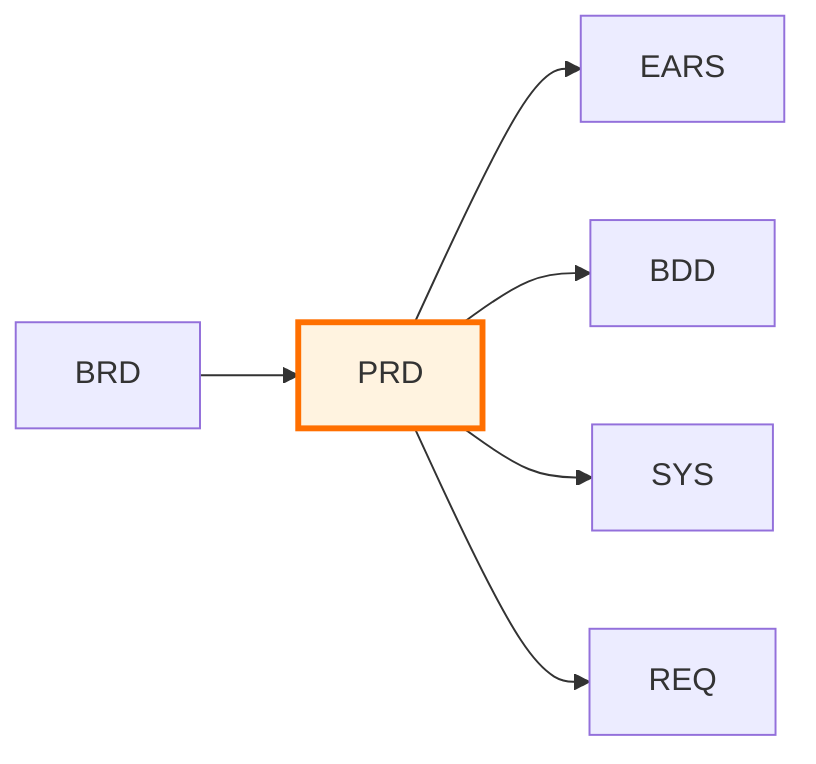
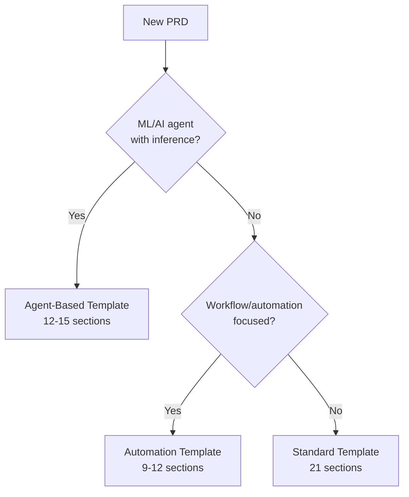

# PRD-000: Product Requirements Documents Master Index

## Purpose

This document serves as the master index for all Product Requirements Documents (PRDs) in the project. Use this index to:

- **Discover** existing product requirements
- **Track** feature specification status
- **Coordinate** product planning across teams
- **Reference** business requirements and downstream artifacts

## Position in Document Workflow



> **Note on Diagram Labels**: The above flowchart shows the sequential workflow. For formal layer numbers used in cumulative tagging, always reference the 16-layer architecture (Layers 0-15) defined in README.md. Diagram groupings are for visual clarity only.

**Layer**: 2 (Product Requirements Layer)
**Upstream**: BRD (Business Requirements)
**Downstream**: EARS, BDD, SYS, REQ

## Product Requirements Index

| PRD ID | Title | Status | Related BRD | Features | Priority | Last Updated |
|--------|-------|--------|-------------|----------|----------|--------------|
| [PRD-TEMPLATE](./PRD-TEMPLATE.md) | Template | Reference | - | - | - | 2025-11-13 |

## Status Definitions

| Status | Meaning | Description |
|--------|---------|-------------|
| **Draft** | In development | PRD being written, requirements gathering in progress |
| **Review** | Under review | Stakeholders reviewing product requirements |
| **Approved** | Finalized | PRD approved, ready for downstream development |
| **In Progress** | Active development | Features being implemented |
| **Completed** | Delivered | All features implemented and released |
| **Archived** | Superseded | Replaced by newer PRD or no longer relevant |

## Adding New Product Requirements

When creating a new PRD:

1. **Copy Template**:
   ```bash
   cp ai_dev_flow/PRD/PRD-TEMPLATE.md \
      docs/PRD/PRD-NN_product_name.md
   ```

2. **Assign PRD ID**: Use next sequential number (PRD-01, PRD-02, ...)

3. **Update This Index**: Add new row to table above with:
   - PRD ID and link to file
   - Title (product or feature area name)
   - Status (Draft initially)
   - Related BRD-ID
   - Feature count
   - Priority (P0-P3)
   - Last Updated date

4. **Create Cross-References**: Update related BRD to reference new PRD

## Allocation Rules

- **Numbering**: Allocate sequentially starting at `001`; keep numbers stable
- **One Product Per File**: Each `PRD-NN` file covers a coherent product or feature area
- **Slugs**: Short, descriptive, lower_snake_case
- **Cross-Links**: Each PRD should reference upstream BRD and downstream EARS/BDD/SYS/REQ
- **Index Updates**: Add a line for every new PRD; do not remove past entries

## Template Variants

PRDs support three template variants based on feature complexity and implementation approach:

| Variant | Code | Sections | Use Case | Selection Criteria |
|---------|------|----------|----------|-------------------|
| **Standard** | S | 21 sections (1-21) | Business features, platform capabilities | Default for most PRDs |
| **Agent-Based** | A | 12-15 sections | AI/ML agents with inference pipelines | ML models, autonomous decision-making |
| **Automation** | W | 9-12 sections | Workflow-focused, n8n-centric | Event-driven automation, minimal UI |

### Template Variant Selection Guide



### Variant-Specific Required Sections

| Section | Standard (S) | Agent-Based (A) | Automation (W) |
|---------|:------------:|:---------------:|:--------------:|
| YAML Metadata | ✓ | ✓ | ✓ |
| Document Control | ✓ | ✓ | ✓ |
| Product Overview | ✓ | ✓ | ✓ |
| User Stories | ✓ | ○ (condensed) | ○ (optional) |
| Functional Requirements | ✓ | ✓ | ✓ |
| ML Pipeline Specification | ○ | ✓ | ○ |
| Workflow Specification | ○ | ○ | ✓ |
| EARS Enhancement Appendix | ✓ | ✓ | ✓ |

**Legend**: ✓ = Required, ○ = Optional/Condensed

## Threshold Registry Integration

### Purpose
The Threshold Registry (PRD-035 pattern) centralizes magic numbers, limits, and configuration values that span multiple PRDs. This prevents conflicts and enables consistent updates.

### Reference Pattern
```markdown
@threshold: PRD.035.category.key
```

### Common Threshold Categories
| Category | Example Key | Description |
|----------|-------------|-------------|
| KYC Limits | `kyc_velocity_daily` | Daily transaction limits by verification tier |
| Transaction Limits | `tx_max_single` | Maximum single transaction amount |
| Timeout Values | `api_timeout_p99` | API response time SLAs |
| Risk Thresholds | `risk_score_high` | Risk scoring breakpoints |
| Rate Limits | `api_rate_per_minute` | API rate limiting values |

### When to Create Threshold Registry Entries
1. Value appears in 2+ PRDs
2. Value affects cross-system behavior
3. Value requires coordinated updates
4. Value has compliance/regulatory implications

See [PRD-TEMPLATE.md Section 7](./PRD-TEMPLATE.md#7-technical-requirements-specifications) for threshold registry reference format.

## Migration Guide

### PRD Migration Status Categories

| Status | Definition | Action Required |
|--------|------------|-----------------|
| **Current** | Compliant with v2.0 template (21 sections: 1-21 including EARS Appendix and QA) | None |
| **Legacy** | Pre-v2.0 format (missing EARS Appendix, inconsistent Feature IDs) | Migration required |
| **Migrated** | Updated from legacy to current format | Validation only |

### Migration Checklist for Legacy PRDs

When migrating a Legacy PRD to Current status:

1. **Template Variant Selection**
   - [ ] Identify appropriate variant (S/A/W)
   - [ ] Add `template_variant` to YAML metadata

2. **Feature ID Standardization**
   - [ ] Convert all Feature IDs to `FR-{PRD#}-{sequence}` format
   - [ ] Validate with regex: `^FR-\d{3}-\d{3}$`
   - [ ] Update cross-references in downstream artifacts

3. **EARS Enhancement Appendix**
   - [ ] Add Section 19 with all 5 subsections
   - [ ] Populate timing profile matrix (p50/p95/p99)
   - [ ] Define boundary value matrix with explicit operators
   - [ ] Create state transition diagram
   - [ ] Document fallback paths
   - [ ] Complete EARS-Ready checklist

4. **Threshold Registry Integration**
   - [ ] Identify all magic numbers/thresholds
   - [ ] Create PRD-035 entries for shared values
   - [ ] Replace inline values with registry references

5. **Bidirectional Reference Validation**
   - [ ] Verify all upstream references exist and reciprocate
   - [ ] Verify all downstream references exist and reciprocate
   - [ ] Update cross-reference section

6. **Final Validation**
   - [ ] Calculate EARS-Ready score (target ≥90)
   - [ ] Update migration status to "Migrated"
   - [ ] Update traceability matrix entry

## Index by Status

### Draft
- None

### Review
- None

### Approved
- None

### In Progress
- None

### Completed
- None

### Archived
- None

## Index by Priority

| Priority | PRD Documents |
|----------|---------------|
| P0 (Critical) | - |
| P1 (High) | - |
| P2 (Medium) | - |
| P3 (Low) | - |

## Index by Product Area

| Product Area | PRD Documents | Count |
|--------------|---------------|-------|
| Core Platform | - | 0 |
| User Features | - | 0 |
| Admin Tools | - | 0 |
| Integrations | - | 0 |
| Infrastructure | - | 0 |

## Feature Summary

### User Stories by Epic
- None yet

### Functional Requirements
- None yet

### Quality Attributes
- None yet

## Metrics

### Document Metrics
| Metric | Value | Description |
|--------|-------|-------------|
| Total PRDs | 0 | Total product requirement documents |
| Total Features | 0 | Total features specified |
| Total User Stories | 0 | Total user stories documented |
| Approved PRDs | 0 | PRDs ready for implementation |
| In Progress | 0 | PRDs with active development |

### Quality Metrics
| Metric | Target | Current | Status |
|--------|--------|---------|--------|
| Average EARS-Ready Score | ≥90 | - | - |
| Bidirectional Validation Rate | 100% | - | - |
| Template Variant Compliance | 100% | - | - |
| Feature ID Standard Compliance | 100% | - | - |
| Threshold Registry Coverage | 100% | - | - |

### Migration Metrics
| Migration Status | Count | Percentage |
|------------------|-------|------------|
| Current | 0 | 0% |
| Legacy | 0 | 0% |
| Migrated | 0 | 0% |

### Template Variant Distribution
| Variant | Count | Percentage |
|---------|-------|------------|
| Standard (S) | 0 | 0% |
| Agent-Based (A) | 0 | 0% |
| Automation (W) | 0 | 0% |

## Related Documents

- **Template**: [PRD-TEMPLATE.md](./PRD-TEMPLATE.md) - Use this to create new PRDs
- **README**: [README.md](./README.md) - Learn about PRD purpose and structure
- **Traceability Matrix**: [PRD-000_TRACEABILITY_MATRIX-TEMPLATE.md](./PRD-000_TRACEABILITY_MATRIX-TEMPLATE.md)

## Maintenance Guidelines

### Updating This Index

- Update this index whenever a new PRD is created
- Update status when PRD moves through workflow stages
- Add cross-references when BRD or downstream documents are created
- Archive PRDs that are superseded or no longer relevant

### Quality Checks

Before marking PRD as "Approved":
- ✅ All user stories follow standard format (As a... I want... So that...)
- ✅ Functional requirements are testable and specific
- ✅ Quality attributes have measurable criteria
- ✅ Cross-references to BRD are complete
- ✅ Acceptance criteria defined for each feature
- ✅ **EARS-Ready score ≥90** (required for EARS progression)
- ✅ **Bidirectional references validated** (all A→B have B→A)
- ✅ **Template variant declared** in YAML metadata
- ✅ **Feature IDs follow standard format** (`FR-NNN-NNN`)
- ✅ **Threshold registry references** for shared values

---

**Index Version**: 3.0
**Last Updated**: 2025-11-29
**Maintainer**: [Project Team]

### Version History
| Version | Date | Changes |
|---------|------|---------|
| 3.0 | 2025-11-29 | Added Template Variants, Threshold Registry Integration, Migration Guide, enhanced Quality Metrics |
| 2.0 | 2025-11-13 | Initial structured index |
