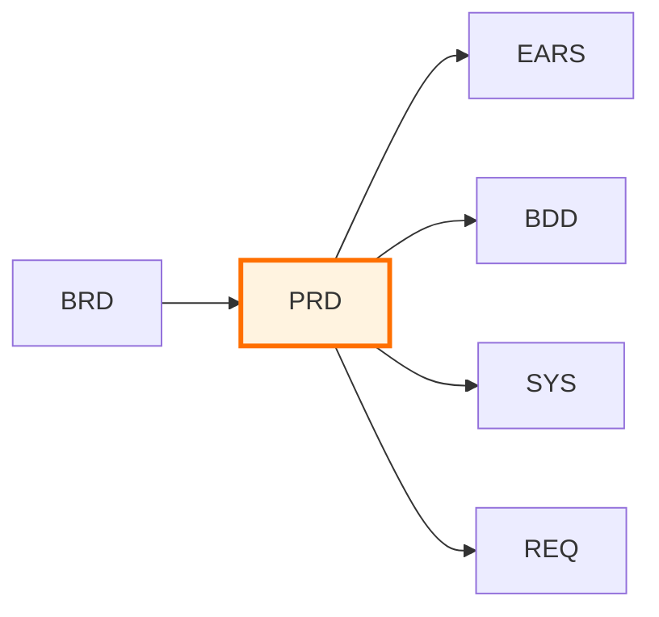

# PRD-000: Product Requirements Documents Master Index

## Purpose

This document serves as the master index for all Product Requirements Documents (PRDs) in the project. Use this index to:

- **Discover** existing product requirements
- **Track** feature specification status
- **Coordinate** product planning across teams
- **Reference** business requirements and downstream artifacts

## Position in Development Workflow



> **Note on Diagram Labels**: The above flowchart shows the sequential workflow. For formal layer numbers used in cumulative tagging, always reference the 16-layer architecture (Layers 0-15) defined in README.md. Diagram groupings are for visual clarity only.

**Layer**: 2 (Product Requirements Layer)
**Upstream**: BRD (Business Requirements)
**Downstream**: EARS, BDD, SYS, REQ

## Product Requirements Index

| PRD ID | Title | Status | Related BRD | Features | Priority | Last Updated |
|--------|-------|--------|-------------|----------|----------|--------------|
| [PRD-TEMPLATE](./PRD-TEMPLATE.md) | Template | Reference | - | - | - | 2025-11-13 |

## Status Definitions

| Status | Meaning | Description |
|--------|---------|-------------|
| **Draft** | In development | PRD being written, requirements gathering in progress |
| **Review** | Under review | Stakeholders reviewing product requirements |
| **Approved** | Finalized | PRD approved, ready for downstream development |
| **In Progress** | Active development | Features being implemented |
| **Completed** | Delivered | All features implemented and released |
| **Archived** | Superseded | Replaced by newer PRD or no longer relevant |

## Adding New Product Requirements

When creating a new PRD:

1. **Copy Template**:
   ```bash
   cp ai_dev_flow/PRD/PRD-TEMPLATE.md \
      docs/PRD/PRD-NNN_product_name.md
   ```

2. **Assign PRD ID**: Use next sequential number (PRD-001, PRD-002, ...)

3. **Update This Index**: Add new row to table above with:
   - PRD ID and link to file
   - Title (product or feature area name)
   - Status (Draft initially)
   - Related BRD-ID
   - Feature count
   - Priority (P0-P3)
   - Last Updated date

4. **Create Cross-References**: Update related BRD to reference new PRD

## Allocation Rules

- **Numbering**: Allocate sequentially starting at `001`; keep numbers stable
- **One Product Per File**: Each `PRD-NNN` file covers a coherent product or feature area
- **Slugs**: Short, descriptive, lower_snake_case
- **Cross-Links**: Each PRD should reference upstream BRD and downstream EARS/BDD/SYS/REQ
- **Index Updates**: Add a line for every new PRD; do not remove past entries

## Index by Status

### Draft
- None

### Review
- None

### Approved
- None

### In Progress
- None

### Completed
- None

### Archived
- None

## Index by Priority

| Priority | PRD Documents |
|----------|---------------|
| P0 (Critical) | - |
| P1 (High) | - |
| P2 (Medium) | - |
| P3 (Low) | - |

## Index by Product Area

| Product Area | PRD Documents | Count |
|--------------|---------------|-------|
| Core Platform | - | 0 |
| User Features | - | 0 |
| Admin Tools | - | 0 |
| Integrations | - | 0 |
| Infrastructure | - | 0 |

## Feature Summary

### User Stories by Epic
- None yet

### Functional Requirements
- None yet

### Non-Functional Requirements
- None yet

## Metrics

| Metric | Value | Description |
|--------|-------|-------------|
| Total PRDs | 0 | Total product requirement documents |
| Total Features | 0 | Total features specified |
| Total User Stories | 0 | Total user stories documented |
| Approved PRDs | 0 | PRDs ready for implementation |
| In Progress | 0 | PRDs with active development |

## Related Documents

- **Template**: [PRD-TEMPLATE.md](./PRD-TEMPLATE.md) - Use this to create new PRDs
- **README**: [README.md](./README.md) - Learn about PRD purpose and structure
- **Traceability Matrix**: [PRD-000_TRACEABILITY_MATRIX-TEMPLATE.md](./PRD-000_TRACEABILITY_MATRIX-TEMPLATE.md)

## Maintenance Guidelines

### Updating This Index

- Update this index whenever a new PRD is created
- Update status when PRD moves through workflow stages
- Add cross-references when BRD or downstream documents are created
- Archive PRDs that are superseded or no longer relevant

### Quality Checks

Before marking PRD as "Approved":
- ✅ All user stories follow standard format (As a... I want... So that...)
- ✅ Functional requirements are testable and specific
- ✅ Non-functional requirements have measurable criteria
- ✅ Cross-references to BRD are complete
- ✅ Acceptance criteria defined for each feature

---

**Index Version**: 2.0
**Last Updated**: 2025-11-13
**Maintainer**: [Project Team]
