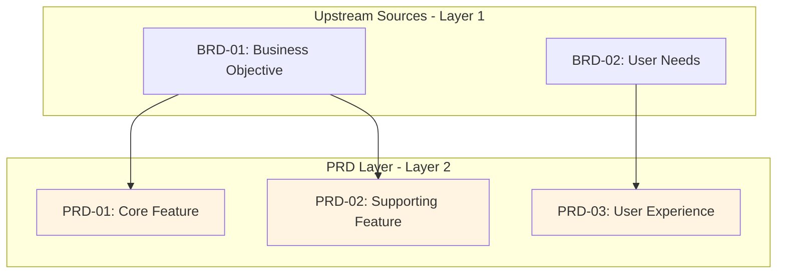

# Traceability Matrix: PRD-01 through PRD-NN

## Document Control

| Item | Details |
|------|---------|
| Document ID | TRACEABILITY_MATRIX_PRD |
| Title | Comprehensive Product Requirements Traceability Matrix |
| Status | [Active/Draft] |
| Version | 1.0.0 |
| Date Created | YYYY-MM-DD |
| Author | [Team Name] |
| Purpose | Track upstream traceability for all Product Requirements Documents |


---

**⚠️ TAG-BASED AUTO-GENERATION AVAILABLE**

This traceability matrix can be automatically generated by scanning code files for @prd:, @spec:, @test: tags.

**Recommended Approach:** Use tag-based auto-discovery instead of manual maintenance.

**Generate automatically using:**
```bash
# Extract tags from all files
python scripts/extract_tags.py --source src/ docs/ tests/ --output docs/generated/tags.json

# Validate tags against documents
python scripts/validate_tags_against_docs.py --tags docs/generated/tags.json --strict

# Generate PRD traceability matrix
python scripts/generate_traceability_matrix.py --type PRD --output docs/PRD/PRD-00_TRACEABILITY_MATRIX.md
```

**Benefits:**
- ✅ Single source of truth: Tags embedded in code
- ✅ Always up-to-date: Generated from current codebase
- ✅ No manual sync: Automated validation prevents drift
- ✅ Coverage metrics: Automatically calculated

**Tag Format:** `@prd: PRD.NN.01.SS` (unified 4-segment format, e.g., `PRD.03.01.01`)

See: [TRACEABILITY.md](../TRACEABILITY.md#tag-based-auto-discovery-alternative) for complete tag-based workflow.

---

## 1. Overview

### 1.1 Document Type Description
Product Requirements Documents (PRDs) translate business objectives into concrete product features, user stories, and functional specifications. PRDs define WHAT the product does from a user perspective.

### 1.2 Coverage Scope
This matrix tracks all PRD documents, mapping each to its upstream business requirements (BRDs). Downstream documents (EARS, BDD, ADR) track their own upstream references to PRDs - no post-creation updates are required here.

### 1.3 Statistics
- **Total PRDs Tracked**: [X] documents
- **Document Status**: [Y] active, [Z] in development
- **Coverage Period**: [Start Date] to [End Date]
- **Last Updated**: YYYY-MM-DD

---

## 2. Required Tags (Cumulative Tagging Hierarchy - Layer 2)

### 2.1 Tag Requirements for PRD Artifacts

**Layer**: 2
**Artifact Type**: PRD (Product Requirements Document)
**Required Tags**: `@brd`
**Tag Count**: 1

### 2.2 Tag Format

```markdown
@brd: BRD.NN.01.SS
```

**Format Rules**:
- Prefix: `@` symbol
- Artifact Type: lowercase (`brd`)
- Separator: colon `:` after artifact type
- Document ID: `BRD-NN` format
- Requirement ID: specific requirement/section identifier
- Multiple Values: comma-separated `@brd: BRD.01.01.30, BRD.01.01.06`

### 2.3 Example: PRD with Required Tags

```markdown
# PRD-NN: operation execution Product Requirements

## 8. Traceability

### 8.1 Upstream Sources

**Required Tags** (Cumulative Tagging Hierarchy - Layer 2):
```markdown
@brd: BRD.09.01.15, BRD.09.01.06
```

- **BRD.09.01.15**: Functional requirement for service integration
- **BRD.09.01.06**: Quality attribute for operation execution performance
```

### 2.4 Validation Rules

1. **Required**: Each PRD MUST include at least one `@brd` tag referencing upstream business requirements
2. **Format Compliance**: All tags must follow `@brd: BRD.NN.EE.SS` format
3. **Valid References**: All referenced BRD documents and requirements must exist
4. **No Gaps**: Cannot create PRD without upstream BRD justification

### 2.5 Tag Discovery

PRD tags can be discovered automatically:
```bash
# Find all PRDs and their upstream BRD tags
python scripts/extract_tags.py --type PRD --show-upstream brd
```

---

## 4. Complete PRD Inventory

| PRD ID | Title | Feature Category | Status | Date | Upstream Sources | EARS | Variant | Migration |
|--------|-------|------------------|--------|------|------------------|------|---------|-----------|
| PRD-01 | [Product feature title] | [Category] | Active | YYYY-MM-DD | BRD-01, BRD-02 | 95 | S | Current |
| PRD-02 | [Product feature title] | [Category] | Active | YYYY-MM-DD | BRD-03 | 88 | S | Current |
| PRD-NN | ... | ... | ... | ... | ... | ... | ... | ... |

**Document Status Legend**:
- **Active**: Current and actively referenced
- **In Development**: Under active development
- **In Review**: Pending stakeholder approval
- **Superseded**: Replaced by newer version
- **Archived**: Historical reference only

**Column Legend**:
- **EARS** (EARS-Ready Score): 0-100 score based on timing profiles (25%), boundary values (25%), state machines (25%), fallback paths (15%), threshold registry (10%)
- **Variant** (Template Variant): S = Standard (21 sections), A = Agent-Based (12-15 sections), W = Automation/Workflow-Focused (9-12 sections)
- **Migration** (Migration Status): Current = Compliant with v2.0 template, Legacy = Pre-v2.0 format, Migrated = Updated from legacy to current

---

## 5. Upstream Traceability (REQUIRED)

> **Traceability Rule**: Upstream traceability is REQUIRED for PRD documents. All PRDs MUST reference at least one existing BRD business requirement.

### 5.1 BRD → PRD Traceability

| BRD ID | BRD Title | PRD IDs | PRD Titles | Relationship Description |
|--------|-----------|---------|------------|--------------------------|
| BRD-01 | [Business requirement] | PRD-01, PRD-02 | [Product features] | Business objectives drive feature definitions |
| BRD-02 | [Business requirement] | PRD-03 | [Product feature] | Stakeholder needs translated to product SPEC |
| BRD-NN | ... | ... | ... | ... |

### 5.2 Market Research → PRD Traceability

| Research Source | Research Finding | PRD IDs | Feature Impact |
|-----------------|------------------|---------|----------------|
| User Research [Date] | [Key insight] | PRD-01, PRD-004 | Feature prioritization based on user needs |
| Competitive Analysis | [Market gap identified] | PRD-02 | Differentiation feature requirements |
| [Source Type] | ... | ... | ... |

### 5.3 Upstream Source Summary

| Source Category | Total Sources | PRDs Derived | Coverage % |
|-----------------|---------------|--------------|------------|
| BRD | [X] | [Y] PRDs | XX% |
| User Research | [X] | [Y] PRDs | XX% |
| Competitive Analysis | [X] | [Y] PRDs | XX% |
| Technical Feasibility | [X] | [Y] PRDs | XX% |

---

## 6. Downstream Reference Guidance

> **Upstream-Only Traceability Rule**: This matrix does NOT track downstream documents. Each downstream artifact tracks its own upstream references. This eliminates post-creation maintenance and ensures traceability accuracy.

### 6.1 How Downstream Documents Reference PRDs

When creating downstream artifacts, they MUST include `@prd` tags referencing this matrix's PRDs:

| Downstream Type | Required Tag Format | Example |
|-----------------|---------------------|---------|
| EARS | `@prd: PRD.NN.SS.RR` | `@prd: PRD.01.03.02` |
| BDD | `@prd: PRD.NN.SS.RR` | `@prd: PRD.01.03.02` |
| ADR | `@prd: PRD.NN.SS.RR` | `@prd: PRD.02.01.01` |
| REQ | `@prd: PRD.NN.SS.RR` | `@prd: PRD.01.03.02` |

### 6.2 Finding Downstream References

To discover which downstream documents reference a specific PRD:

```bash
# Find all EARS documents referencing PRD-01
grep -r "@prd: PRD.01" ../EARS/

# Find all BDD scenarios referencing PRD-01
grep -r "@prd: PRD.01" ../BDD/

# Generate reverse traceability report
python scripts/generate_reverse_traceability.py --upstream PRD-01 --downstream EARS,BDD,ADR,REQ
```

### 6.3 Downstream Coverage Validation

Run automated validation to check downstream coverage:

```bash
# Validate all PRDs have required downstream coverage
python scripts/validate_downstream_coverage.py \
  --source PRD \
  --expected EARS,BDD \
  --optional ADR,REQ
```

---

## 7. Cross-PRD Dependencies

### 7.1 PRD Upstream Relationship Map



> **Note**: This diagram shows only upstream relationships (BRD→PRD). Downstream documents (EARS, BDD, ADR, REQ) track their own upstream references to PRDs - see their respective traceability matrices.

### 7.2 Inter-PRD Dependencies

| Source PRD | Target PRD | Dependency Type | Description |
|------------|------------|-----------------|-------------|
| PRD-01 | PRD-005 | Prerequisite | Core authentication must exist before advanced features |
| PRD-02 | PRD-03 | Related | User profile management supports personalization |
| PRD-NN | ... | ... | ... |

---

## 8. Feature Category Summary

### 8.1 PRDs by Feature Category

| Feature Category | PRD IDs | Total | Description |
|------------------|---------|-------|-------------|
| [Core Platform] | PRD-01, PRD-02, PRD-03 | 3 | Foundation platform capabilities |
| [User Experience] | PRD-004, PRD-005 | 2 | User-facing workflows and interfaces |
| [Integration] | PRD-006, PRD-007 | 2 | External system connections |
| [Analytics] | PRD-NN | 1 | Reporting and insights |
| [security] | PRD-NN, PRD-NN | 2 | Authentication, authorization, data protection |

### 8.2 User Persona Alignment

| User Persona | Related PRDs | Primary Needs | Satisfaction Score |
|--------------|--------------|---------------|-------------------|
| [Persona 1: End User] | PRD-01, PRD-004, PRD-005 | Ease of use, performance | 8/10 |
| [Persona 2: Administrator] | PRD-02, PRD-009 | Control, visibility | 7/10 |
| [Persona 3: Developer] | PRD-006, PRD-007 | Integration, APIs | 9/10 |

---

## 9. User Story and Acceptance Criteria Summary

### 9.1 User Story Distribution

| PRD ID | Total User Stories | Completed Stories | Completion % |
|--------|-------------------|-------------------|--------------|
| PRD-01 | [X] | [Y] | XX% |
| PRD-02 | [X] | [Y] | XX% |
| PRD-NN | ... | ... | ... |
| **Total** | **[X]** | **[Y]** | **XX%** |

### 9.2 Acceptance Criteria Coverage

| PRD ID | User Stories | BDD Scenarios | AC Coverage % | Status |
|--------|--------------|---------------|---------------|--------|
| PRD-01 | 5 | 8 | 100% | ✅ Complete |
| PRD-02 | 3 | 5 | 100% | ✅ Complete |
| PRD-03 | 4 | 2 | 50% | 🟡 Incomplete |
| PRD-NN | ... | ... | ... | ... |

---

## 10. Implementation Status

### 10.1 Artifact Creation Coverage

| Artifact Type | Required | Created | Pending | Coverage % |
|---------------|----------|---------|---------|------------|
| EARS | [X] | [Y] | [Z] | XX% |
| BDD | [X] | [Y] | [Z] | XX% |
| ADR | [X] | [Y] | [Z] | XX% |
| REQ | [X] | [Y] | [Z] | XX% |
| SPEC | [X] | [Y] | [Z] | XX% |
| **Total** | **[X]** | **[Y]** | **[Z]** | **XX%** |

### 10.2 PRD Upstream Validation Status

| PRD ID | Upstream Valid | EARS Score | Variant | Migration | Notes |
|--------|----------------|------------|---------|-----------|-------|
| PRD-01 | ✓ | 95 | S | Current | All BRD refs validated |
| PRD-02 | ✓ | 88 | S | Current | All BRD refs validated |
| PRD-03 | ✗ | 45 | A | Legacy | Missing BRD-04 reference |
| PRD-NN | ... | ... | ... | ... | ... |

**Validation Legend**:
- **Upstream Valid**: ✓ = All upstream BRD references exist and are valid, ✗ = Validation needed
- **EARS Score**: 0-100 (target ≥90 for EARS progression)
- **Variant**: S (Standard), A (Agent-Based), W (Workflow/Automation)
- **Migration**: Current, Legacy, Migrated

### 10.3 Gap Analysis

**Missing Upstream References**:
- PRD-XXX: Missing BRD reference (no business justification documented)
- PRD-YYY: References deprecated BRD-ZZZ (needs update)

**Validation Commands**:
```bash
# Check all PRDs have valid upstream references
python scripts/validate_upstream_refs.py --type PRD --strict

# Find PRDs with missing or invalid BRD references
python scripts/find_orphaned_artifacts.py --type PRD --check-upstream
```

---

## 11. Immediate Next Steps

### 11.1 Priority Actions

1. **Complete Missing EARS Mappings**: [X] PRDs require EARS formalization
2. **Create BDD Scenarios**: [Y] PRDs need acceptance tests
3. **Decompose into Atomic Requirements**: [Z] PRDs need REQ breakdown
4. **Architecture Decision Documentation**: [N] PRDs require ADR analysis

### 11.2 Upcoming Release Milestones

| Release | Target Date | Required PRDs | Status | Completion % |
|---------|-------------|---------------|--------|--------------|
| [Release 1.0: MVP] | YYYY-MM-DD | PRD-01 through PRD-005 | On Track | 85% |
| [Release 1.1: Feature Pack] | YYYY-MM-DD | PRD-NN range | Planning | 30% |
| [Release 2.0: Major Update] | YYYY-MM-DD | All PRDs | Not Started | 0% |

### 11.3 Quality Metrics Summary

| Metric | Target | Current | Status |
|--------|--------|---------|--------|
| Upstream Validation | 100% | [XX]% | 🟡 |
| EARS-Ready Score (Average) | ≥90 | [XX] | 🟡 |
| Template Variant Compliance | 100% | [XX]% | 🟡 |
| Migration Status (Current) | 100% | [XX]% | 🟡 |
| Legacy PRDs Pending Migration | 0 | [X] | 🟡 |

**EARS-Ready Score Distribution**:
| Score Range | PRD Count | Percentage |
|-------------|-----------|------------|
| 90-100 (Excellent) | [X] | XX% |
| 75-89 (Good) | [X] | XX% |
| 50-74 (Needs Work) | [X] | XX% |
| 0-49 (Critical) | [X] | XX% |

**Template Variant Distribution**:
| Variant | PRD Count | Percentage |
|---------|-----------|------------|
| Standard (S) | [X] | XX% |
| Agent-Based (A) | [X] | XX% |
| Workflow (W) | [X] | XX% |

### 11.4 Quality Improvement Recommendations

- **Upstream Validation**: Ensure all PRDs have valid BRD references
- **EARS-Ready Score**: Improve all PRDs to ≥90 before EARS progression
- **Legacy Migration**: Migrate all Legacy PRDs to Current template version
- **Tag Compliance**: Verify all PRDs use correct `@brd` tag format
- **Stakeholder Review**: Schedule feature validation with product owners

---

## 12. Revision History

| Version | Date | Changes | Author |
|---------|------|---------|--------|
| 1.0.0 | YYYY-MM-DD | Initial traceability matrix creation | [Author Name] |
| 0.9.0 | YYYY-MM-DD | Draft version for review | [Author Name] |

---

## 13. References

### 13.1 Internal Documentation
- **PRD Index**: [PRD-00_index.md](PRD-00_index.md)
- **PRD Template**: [PRD-TEMPLATE.md](PRD-TEMPLATE.md)
- **Complete Traceability Matrix**: [../TRACEABILITY_MATRIX_COMPLETE-TEMPLATE.md](../TRACEABILITY_MATRIX_COMPLETE-TEMPLATE.md)
- **Traceability Standards**: [../TRACEABILITY.md](../TRACEABILITY.md)
- **SDD Workflow Guide**: [../SPEC_DRIVEN_DEVELOPMENT_GUIDE.md](../SPEC_DRIVEN_DEVELOPMENT_GUIDE.md)

### 13.2 External Standards
- ISO/IEC/IEEE 29148:2018 - Systems and software engineering requirements
- SAFe Product Requirements Documentation Standards
- Agile Alliance User Story Best Practices

### 13.3 Related Matrices
- [BRD Traceability Matrix](../BRD/BRD-00_TRACEABILITY_MATRIX-TEMPLATE.md)
- [EARS Traceability Matrix](../EARS/EARS-00_TRACEABILITY_MATRIX-TEMPLATE.md)
- [BDD Traceability Matrix](../BDD/BDD-00_TRACEABILITY_MATRIX-TEMPLATE.md)
- [ADR Traceability Matrix](../ADR/ADR-00_TRACEABILITY_MATRIX-TEMPLATE.md)

---

## 14. Appendix A: Matrix Maintenance Guidelines

### 14.1 When to Update This Matrix
1. **After Creating/Updating PRDs**: Add new entries within 1 business day
2. **Sprint Planning**: Review PRD coverage before sprint commitments
3. **Release Preparation**: Full validation of traceability chain
4. **Feature Prioritization**: Ensure alignment with business requirements

### 14.2 Automated Generation
```bash
# Generate matrix from PRD directory
python ../scripts/generate_traceability_matrix.py \
  --type PRD \
  --input ../PRD/ \
  --template PRD-00_TRACEABILITY_MATRIX-TEMPLATE.md \
  --output TRACEABILITY_MATRIX_PRD.md

# Validate matrix
python ../scripts/validate_traceability_matrix.py \
  --matrix TRACEABILITY_MATRIX_PRD.md \
  --strict

# Update incrementally
python ../scripts/update_traceability_matrix.py \
  --matrix TRACEABILITY_MATRIX_PRD.md \
  --preserve-annotations
```

### 14.3 Quality Checklist
- [ ] All PRD documents included in inventory
- [ ] Upstream BRD sources documented for each PRD
- [ ] All upstream references validated (exist and are current)
- [ ] Cross-PRD dependencies identified
- [ ] Feature category classification complete
- [ ] User persona alignment documented
- [ ] User story and acceptance criteria coverage tracked
- [ ] All hyperlinks resolve correctly
- [ ] Mermaid diagrams render without errors
- [ ] Revision history updated
- [ ] **Upstream validation column populated** (✓/✗ for each PRD)
- [ ] **EARS-Ready scores calculated** (0-100, target ≥90)
- [ ] **Template variant identified** (S/A/W for each PRD)
- [ ] **Migration status tracked** (Current/Legacy/Migrated)
