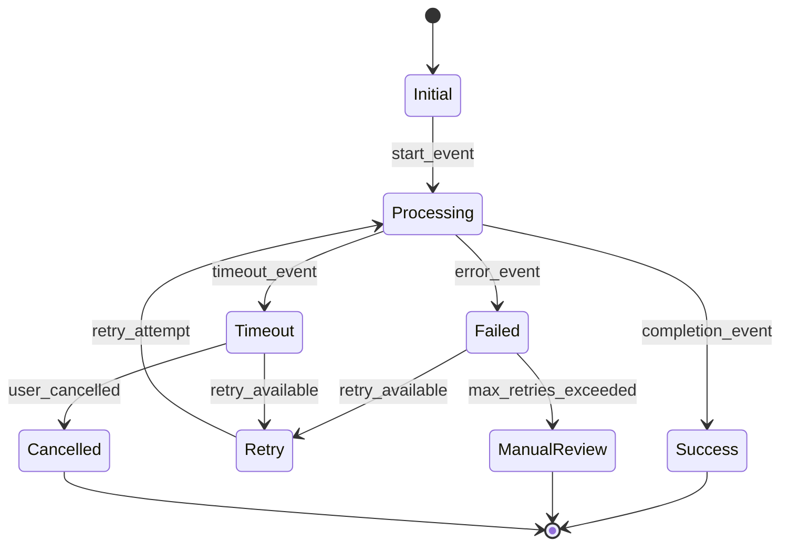

> **📋 Document Authority**: This is the **PRIMARY STANDARD** for PRD structure.
> - All PRDs must conform to this template (20 sections: 0-19)
> - `PRD_CREATION_RULES.md` - Helper guidance for template usage
> - `PRD_VALIDATION_RULES.md` - Post-creation validation checks
>
> **Template Variants**:
> - **Standard PRD** (20 sections): Default for business features - use this template
> - **Agent-Based PRD** (12-15 sections): Extended ML/AI sections, state machine focus
> - **Automation-Focused PRD** (9-12 sections): n8n workflow-centric, webhook-focused

# PRD-NNN: [Descriptive Product Name/Feature Name]

**⚠️ CRITICAL**: Always reference [SPEC_DRIVEN_DEVELOPMENT_GUIDE.md](../SPEC_DRIVEN_DEVELOPMENT_GUIDE.md) as the single source of truth for workflow steps, artifact definitions, and quality gates.

**[RESOURCE_INSTANCE - e.g., database connection, workflow instance]**: PRD is in Layer 2 (Product Requirements Layer) - defines product requirements from BRD business needs.

## 0. Document Control

| Item | Details |
|------|---------|
| **Status** | Draft / Review / Approved / Implemented |
| **Version** | [Semantic version, e.g., 1.0.0] |
| **Date Created** | YYYY-MM-DD |
| **Last Updated** | YYYY-MM-DD |
| **Author** | [Product Manager/Owner Name] |
| **Reviewer** | [Technical Reviewer Name] |
| **Approver** | [Stakeholder Name] |
| **BRD Reference** | @brd: BRD-NNN |
| **Priority** | High / Medium / Low |
| **Target Release** | [Release version/Quarter] |
| **Estimated Effort** | [Story Points or Person-Months] |
| **SYS-Ready Score** | ✅ 95% (Target: ≥90%) |
| **EARS-Ready Score** | ✅ 95% (Target: ≥90%) |
| **Template Variant** | Standard / Agent-Based / Automation-Focused |

### Template Variant Selection

Select the appropriate template variant based on domain:

| Variant | Sections | Use Case | Selection Criteria |
|---------|----------|----------|-------------------|
| **Standard** | 0-19 (20) | Business features, core platform | Default choice for most PRDs |
| **Agent-Based** | 0-14 (15) | ML/AI agents, intelligent systems | Contains agent-specific sections (state machine, ML metrics) |
| **Automation-Focused** | 0-11 (12) | n8n workflows, event processing | Webhook-focused, workflow states |

**Selection Flowchart**:
1. Does this PRD describe an ML/AI agent? → **Agent-Based**
2. Does this PRD describe n8n workflows or automation? → **Automation-Focused**
3. Otherwise → **Standard**

### Document Revision History

| Version | Date | Author | Changes Made | Approver |
|---------|------|--------|--------------|----------|
| 1.0.0 | YYYY-MM-DD | [Author Name] | Initial draft | [Approver] |

## 1. Executive Summary

[2-3 sentence high-level overview of what this product/feature accomplishes, who benefits, and the expected business impact]

### Business Value Proposition

[Clear statement of value to customers, users, or the business with quantifiable benefits where possible]

### Timeline

- **Discovery & Planning**: YYYY-MM-DD to YYYY-MM-DD ([duration])
- **Development**: YYYY-MM-DD to YYYY-MM-DD ([duration])
- **Testing & Validation**: YYYY-MM-DD to YYYY-MM-DD ([duration])
- **Launch**: YYYY-MM-DD
- **Post-Launch Monitoring**: YYYY-MM-DD onwards ([duration])

---

> **⚠️ UPSTREAM ARTIFACT REQUIREMENT**: Before completing traceability tags:
> 1. **Check existing artifacts**: List what upstream documents actually exist in `docs/`
> 2. **Reference only existing documents**: Use actual document IDs, not placeholders
> 3. **Use `null` appropriately**: Only when upstream artifact type genuinely doesn't exist for this feature
> 4. **Do NOT create phantom references**: Never reference documents that don't exist
> 5. **Do NOT create missing upstream artifacts**: If upstream artifacts are missing, skip that functionality. Only create functionality for existing upstream artifacts.


## 2. Problem Statement

### Current State

[Describe the current situation and its pain points:
- What users currently do and why it doesn't work well
- Business impacts of the current situation
- Quantitative data on friction points, errors, time waste, etc.]

### Business Impact

[Quantify the problem's effect on:
- Revenue/efficiency losses
- Customer satisfaction/success metrics
- Operational costs and overhead
- Competitive disadvantages
- Risk exposure or compliance issues]

### Root Cause Analysis

[Identify the core issues driving this initiative:
- Process gaps or inefficiencies
- Technical limitations
- Data/visibility problems
- Market or regulatory drivers
- Customer feedback patterns]

### Opportunity Assessment

[Describe the market or business opportunity:
- Market size and growth potential
- Competitive advantages to be gained
- Customer needs being addressed
- Strategic alignment with business objectives]

---

## 3. Target Audience & User Personas

### Primary Users

[Who will use this product most frequently:
- Role and job function
- Key characteristics and behaviors
- Pain points this solves
- Usage patterns and frequency]

### secondary Users

[Other stakeholders who benefit:
- Roles affected by or affecting this feature
- Their relationship to primary users
- How they interact with the product]

### Business Stakeholders

[Internal decision-makers and organizations:
- Who approves and funds this initiative
- Success measures most important to them
- Key concerns and requirements they have]

---

## 4. Success Metrics (KPIs)

### Primary KPIs

[Most important measures of business success - 3-5 key metrics:
- **Metric Name**: Target value (e.g., "Time to Complete Task: Reduce from 45 minutes to 15 minutes (66% improvement)")
- **Customer Satisfaction Score**: ≥ 4.5/5 within 90 days post-launch
- **Adoption Rate**: ≥ 80% of eligible users actively using within 60 days]

### secondary KPIs

[Supporting metrics that indicate progress toward goals:
- **Feature Usage**: [Measure] across [user segment]
- **Error Reduction**: [X]% decrease in [error type] incidents
- **Process Efficiency**: [Time/resource savings achieved]]

### Success Criteria by Phase

**Phase 1 - Launch (YYYY-MM-DD)**:
- [Measurable outcomes for initial release]
- [User adoption targets]
- [Performance benchmarks]

**Phase 2 - Stabilization (YYYY-MM-DD to YYYY-MM-DD)**:
- [Usage growth targets]
- [Feature maturity metrics]
- [Issue resolution benchmarks]

**Phase 3 - Optimization (YYYY-MM-DD onwards)**:
- [Continuous improvement goals]
- [Advanced feature adoption]
- [Business impact maximization]

---

## 5. Goals & Objectives

### Primary Business Goals

[What we must achieve - prioritized list:
1. **Goal 1**: [Specific, measurable outcome] by [deadline], measured by [KPIs]
2. **Goal 2**: [Specific, measurable outcome] by [deadline], measured by [KPIs]
3. **Goal 3**: [Specific, measurable outcome] by [deadline], measured by [KPIs]]

### secondary Objectives

[Important but not blocking objectives:
- **Objective A**: [Supporting goal] enabling [larger outcome]
- **Objective B**: [Foundation-building goal] for [future capability]
- **Objective C**: [Efficiency improvement] resulting in [cost/time savings]]

### Stretch Goals

[Desirable but not required achievements:
- **Stretch Goal 1**: [Ambitious outcome] if [conditions] allow
- **Stretch Goal 2**: [Advanced capability] contingent on [resource availability]]

---

## 6. Scope & Requirements

### In Scope (Included Features/Capabilities)

#### Core Features

[List the must-have features that define the MVP:
- **Feature 1**: [Description, business value, user story format]
- **Feature 2**: [Description, business value, user story format]
- **Feature 3**: [Description, business value, user story format]]

#### Integration Requirements

[External systems and processes this touches:
- **Integration 1**: [System/connection point], Purpose: [why needed], Data flow: [what data]
- **Integration 2**: [System/connection point], Purpose: [why needed], Data flow: [what data]]

### Out of Scope (Non-Goals)

[What we explicitly will NOT do in this initiative - critical for managing expectations and preventing scope creep:

#### Technical Implementation Decisions

- [Specific technology choices left to engineering team]
- [Architecture patterns not yet determined]
- [Performance optimization not included at this stage]

#### Feature Exclusions

- [Nice-to-have features that would complicate scope]
- [Future enhancements planned for subsequent releases]
- [Adjacent workflows that could expand but shouldn't]

#### Integration Limitations

- [Legacy systems we intentionally won't touch]
- [Third-party services not in contract scope]
- [Manual processes that remain unchanged]

#### Business Process Limitations

- [Organizational changes not addressed]
- [Training and change management out of scope]
- [Metrics and reporting not included]]

### Dependencies & Prerequisites

[What must exist or be completed before this can succeed:

#### Technical Dependencies

- **Dependency 1**: [Required system/component], Status: [available/in development], Impact: [blocking/non-blocking]
- **Dependency 2**: [Required infrastructure/API], Status: [available/in development], Impact: [blocking/non-blocking]

#### Business Dependencies

- **Dependency 1**: [Required organizational change], Owner: [person/team], Target Date: [YYYY-MM-DD]
- **Dependency 2**: [Required process change], Owner: [person/team], Target Date: [YYYY-MM-DD]

#### External Dependencies

- **Dependency 1**: [Vendor/third-party requirement], Contract Status: [signed/pending], Target Date: [YYYY-MM-DD]
- **Dependency 2**: [Regulatory/Compliance requirement], Status: [approved/pending], Target Date: [YYYY-MM-DD]]

---

## 7. User Stories & User Roles

This section documents user stories that capture who benefits from the system, what they need to accomplish, and why it matters to them. User stories provide a user-centric view of requirements and help ensure the solution meets actual user needs.

### Layer Separation

**PRD (Layer 2) Scope**:
- User role definitions (who they are)
- User story titles and summaries (what they need)
- High-level capability requirements (business value)
- Product-level acceptance criteria

**EARS (Layer 3) Scope**:
- Detailed behavioral scenarios with technical specifications
- Engineering requirements in WHEN-THE-SHALL-WITHIN format
- System-level acceptance criteria

**BDD (Layer 4) Scope**:
- Test cases with Given-When-Then format
- Executable specifications
- Acceptance testing scenarios

> **Scope Note**: This section provides role definitions and story summaries. Detailed behavioral requirements are captured in EARS; executable test specifications are in BDD feature files.

### User Story Format

User stories follow the standard format:
**As a** [user type/persona], **I want to** [goal/action], **so that** [business value/benefit].

### Primary User Stories

[Document user stories for the primary personas identified in the stakeholder analysis]

#### Primary Persona 1: [Name - e.g., End User, Customer, Admin]

| Story ID | User Story | Priority | Acceptance Criteria | Related FR |
|----------|------------|----------|---------------------|------------|
| US-001 | As a [persona], I want to [action], so that [benefit] | P1/P2/P3 | [Measurable criteria for story completion] | FR-XXX |
| US-002 | As a [persona], I want to [action], so that [benefit] | P1/P2/P3 | [Measurable criteria for story completion] | FR-XXX |
| US-003 | As a [persona], I want to [action], so that [benefit] | P1/P2/P3 | [Measurable criteria for story completion] | FR-XXX |

**Example User Stories**:
- US-001: As a **sender**, I want to **view transparent fee breakdown before confirming transaction**, so that **I understand total cost with no surprises**.
- US-002: As a **sender**, I want to **save recipient details for future transactions**, so that **repeat sends are faster and more convenient**.
- US-003: As a **recipient**, I want to **receive SMS notification when money arrives**, so that **I know funds are available immediately**.

#### Primary Persona 2: [Name - e.g., Support Agent, Compliance Officer]

| Story ID | User Story | Priority | Acceptance Criteria | Related FR |
|----------|------------|----------|---------------------|------------|
| US-0XX | As a [persona], I want to [action], so that [benefit] | P1/P2/P3 | [Measurable criteria for story completion] | FR-XXX |

### Operational User Stories

[Document user stories for internal operations, support, and administrative personas]

| Story ID | User Story | Priority | Acceptance Criteria | Related FR |
|----------|------------|----------|---------------------|------------|
| US-0XX | As a **compliance officer**, I want to [action], so that [benefit] | P1/P2/P3 | [Criteria] | FR-XXX |
| US-0XX | As a **support agent**, I want to [action], so that [benefit] | P1/P2/P3 | [Criteria] | FR-XXX |
| US-0XX | As an **operations manager**, I want to [action], so that [benefit] | P1/P2/P3 | [Criteria] | FR-XXX |

### User Story Summary

| Category | P1 Stories | P2 Stories | P3 Stories | Total |
|----------|------------|------------|------------|-------|
| [Primary Persona 1] | [Count] | [Count] | [Count] | [Total] |
| [Primary Persona 2] | [Count] | [Count] | [Count] | [Total] |
| Operational | [Count] | [Count] | [Count] | [Total] |
| **Total** | [Total P1] | [Total P2] | [Total P3] | [Grand Total] |

### User Story to Business Objective Mapping

[Map user stories to business objectives to demonstrate alignment]

| Business Objective | Related User Stories | Coverage Notes |
|--------------------|---------------------|----------------|
| [BO-1: Objective description] | US-001, US-003, US-008 | [How stories address objective] |
| [BO-2: Objective description] | US-002, US-005, US-012 | [How stories address objective] |
| [BO-3: Objective description] | US-004, US-009, US-015 | [How stories address objective] |

### User Roles and Permissions

[Define detailed user roles with specific permissions - more granular than BRD stakeholder identification]

| Role | Description | Key Responsibilities | Permissions | Related User Stories |
|------|-------------|---------------------|-------------|---------------------|
| [Role Name] | [Who this role represents] | [What they do] | [What access they have] | US-XXX, US-YYY |

**Example Roles**:
- **Primary User**: End customers who initiate transactions, save recipients, view transaction history
- **Support Agent**: Internal staff who can view user accounts, transactions, assist with issues (read-only financial data)
- **Compliance Officer**: Internal staff who can review flagged transactions, approve/reject sanctions screening, access audit logs
- **Operations Manager**: Internal staff who can view dashboards, generate reports, modify system configuration
- **System Administrator**: Technical staff with full system access for maintenance, monitoring, troubleshooting

### Threshold Registry References

**⚠️ IMPORTANT**: When this PRD references numeric thresholds, limits, or timing parameters, use the Threshold Registry pattern to ensure consistency across PRDs.

**Reference Format**: `@prd: PRD-XXX:threshold-key`

**When to Create Threshold Registry References**:
- Transaction velocity limits (KYC/KYB limits)
- Risk score thresholds (Low/Medium/High boundaries)
- Performance timing targets (p50/p95/p99 latencies)
- Timeout configurations (API, session, job timeouts)
- Rate limits (API, transaction frequency)
- Financial amount boundaries (min/max transaction amounts)

**Example Usage**:
```markdown
Transaction limit: $1,000 USD (per @prd: PRD-035:kyc.l1.daily)
Risk threshold: Score ≥75 triggers escalation (per @prd: PRD-035:risk.high.min)
```

**Benefits**:
- Single source of truth for threshold values
- Eliminates conflicts between PRDs (e.g., CRIT-001 in blocal_n8n remediation)
- Enables centralized threshold management

---

## 8. Functional Requirements

### User Journey Mapping

[Key user workflows this product enables:]

#### Primary User Journey: [Journey Name]

1. **Step 1**: User [does action], System [responds], Resulting in [outcome]
2. **Step 2**: User [does action], System [responds], Resulting in [outcome]
3. **Step 3**: User [does action], System [responds], Resulting in [outcome]

#### Edge Case Journeys

- **Error Scenario**: When [error condition], user should [expected experience]
- **Recovery Scenario**: When [failure occurs], system should [recovery behavior]
- **Performance Scenario**: Under [stress conditions], system maintains [slas]

### Capability Requirements

#### Must-Have Capabilities

- **Capability 1**: [Specific functionality], Context: [when/why needed], Success Criteria: [how to validate]
- **Capability 2**: [Specific functionality], Context: [when/why needed], Success Criteria: [how to validate]
- **Capability 3**: [Specific functionality], Context: [when/why needed], Success Criteria: [how to validate]

#### Should-Have Capabilities

- **Capability A**: [Desirable but not blocking functionality]
- **Capability B**: [Nice-to-have that enhances user experience]
- **Capability C**: [Efficiency improvement for power users]

---

## 9. Customer-Facing Content & Messaging (MANDATORY)

**Purpose**: Define product-approved messaging for customer communications at key touchpoints. This ensures consistency, compliance, and optimal user experience across all customer interactions.

**📚 Complete Business Context**: For business-level messaging requirements and approval workflows, see:
- **[BRD Template - Appendix N: Customer Communication Templates](../BRD/BRD-TEMPLATE.md#appendix-n-customer-communication-templates-required-for-customer-facing-brds)** - Business approval and messaging strategy

### Transaction Status Messages

| Status | Customer Message | Channel | Trigger |
|--------|-----------------|---------|---------|
| [Status] | [Approved message text] | [Push/Email/SMS/In-App] | [When sent] |

**Example:**
| Status | Customer Message | Channel | Trigger |
|--------|-----------------|---------|---------|
| Initiated | "Your transfer of $[amount] to [recipient] has been initiated." | Push + Email | On transaction creation |
| Delivered | "Great news! Your $[amount] transfer to [recipient] was delivered successfully." | Push + Email | On delivery confirmation |
| Failed | "We couldn't complete your transfer. [Reason]. Funds will be returned within [X] days." | Push + Email | On delivery failure |

### Error Messages

| Error Condition | Customer Message | Recommended Action | Support Escalation |
|----------------|-----------------|-------------------|-------------------|
| [Condition] | [Message] | [CTA] | [When to escalate] |

**Example:**
| Error Condition | Customer Message | Recommended Action | Support Escalation |
|----------------|-----------------|-------------------|-------------------|
| Insufficient Balance | "Your balance is too low to complete this transfer. Please add funds." | "Add Funds" button | None - self-service |
| Recipient Blocked | "We cannot send to this recipient. Please contact support for details." | "Contact Support" | Immediate - compliance |
| Network Timeout | "Connection lost. We'll retry automatically. Check status in 5 minutes." | "View Status" | After 3 retries |

### Promotional Messages (If Applicable)

| Campaign | Message | Eligibility | Duration | Terms Link |
|----------|---------|-------------|----------|-----------|
| [Campaign] | [Message] | [Who qualifies] | [Start-End] | [URL] |

**Example:**
| Campaign | Message | Eligibility | Duration | Terms Link |
|----------|---------|-------------|----------|-----------|
| First Transfer Free | "Send your first transfer fee-free! No promo code needed." | New users, first 30 days | 2025-Q1 | /terms/promo-q1 |

### In-App Guidance & Tooltips

| Feature/Screen | Element | Tooltip/Help Text | Trigger |
|----------------|---------|------------------|---------|
| [Screen name] | [Field/button] | [Help text] | [On hover/tap/first use] |

**Example:**
| Feature/Screen | Element | Tooltip/Help Text | Trigger |
|----------------|---------|------------------|---------|
| Send Money | Amount Field | "Enter amount in USD. Recipient gets [currency] at [rate]." | On focus |
| Recipient List | Save Button | "Save this recipient for faster future transfers." | On hover |

### Compliance & Legal Disclosures

| Requirement | Disclosure Text | Placement | Acknowledgment Required |
|-------------|----------------|-----------|------------------------|
| [Regulation] | [Required text] | [Where shown] | [Yes/No] |

**Example:**
| Requirement | Disclosure Text | Placement | Acknowledgment Required |
|-------------|----------------|-----------|------------------------|
| EFTA Disclosure | "Your rights under the Electronic Fund Transfer Act: [link]" | Transaction confirmation | No - informational |
| Fee Disclosure | "Total fees: $[amount]. Exchange rate: [rate]. Total cost: $[total]." | Pre-confirmation screen | Yes - tap "I Agree" |

---

## 10. Acceptance Criteria

### Business Acceptance Criteria

[High-level, business-focused measures that stakeholders sign off on:

#### User Value Validation

- Users can achieve [business outcome] independently within [timeframe]
- Process completion rate improves from [baseline]% to [target]% or better
- Customer satisfaction with [current process vs. new solution] reaches [score]/5
- Time to complete [critical task] reduces from [current] to [target] minutes

#### Business Impact Validation

- Operational cost of [process/activity] decreases by [X]% within [timeframe]
- Revenue impact: [Expected increase/decrease] of [amount] by [deadline]
- Risk reduction: [Specific risk] exposure decreases by [percentage]
- Scalability: System supports [growth target, e.g., 10x current users] without performance degradation]

### Technical Acceptance Criteria

[Engineering-focused validation points:

#### Functional Testing

- All user stories can be executed end-to-end without manual workarounds
- Error conditions trigger appropriate user guidance and logging
- System maintains data consistency across all operations
- Integration points work correctly with connected systems

#### Performance Criteria

- System response time < [X]ms for [95th percentile] of operations
- System handles [X] concurrent users without degradation
- Data processing completes within [X] minutes of event triggers
- Service uptime maintains [99.X]% availability during operation windows

#### security & Compliance

- All data encryption requirements met for [data classification levels]
- Authorization controls prevent unauthorized access to sensitive functions
- Audit logging captures all [critical operations] with proper attribution
- Privacy regulations compliance verified through [assessment/review]]

### Quality Assurance Criteria

- Code coverage meets [X]% minimum threshold for all new functionality
- Automated test suite includes positive, negative, and edge case scenarios
- Load testing demonstrates required performance under peak conditions
- Accessibility standards [WCAG 2.1 AA] compliance verified for all user interfaces
- Cross-browser and device compatibility validated for supported platforms

---

## 11. Constraints & Assumptions

### Business Constraints

- **Budget**: [Available budget for this initiative: $X for development, $Y for operations]
- **Timeline**: [Fixed release dates, regulatory deadlines, seasonal considerations]
- **Resources**: [Available teams, contractors, or external resources]
- **Organizational**: [Company policies, procurement processes, approval workflows]

### Technical Constraints

- **Existing Systems**: [Legacy systems that cannot be changed, APIs we must use]
- **Infrastructure**: [Hosting environment, data center limitations, network constraints]
- **Technology Stack**: [Required or prohibited technologies, frameworks, languages]
- **Data**: [Data availability, quality, privacy restrictions, and processing limitations]

### External Constraints

- **Vendor Contracts**: [Third-party service agreements, pricing structures, service level agreements]
- **Regulatory**: [Legal requirements, compliance standards, certification needs]
- **Market**: [Competitive landscape, industry standards, partner requirements]

### Key Assumptions

[Important assumptions that could impact this project if incorrect:

#### Business Assumptions

- **Assumption 1**: [Statement about market, users, or business conditions], Risk: [high/medium/low], Mitigation: [strategy]
- **Assumption 2**: [Statement about competitive or industry dynamics], Risk: [high/medium/low], Mitigation: [strategy]

#### Technical Assumptions

- **Assumption 1**: [Statement about system capabilities or constraints], Risk: [high/medium/low], Mitigation: [strategy]
- **Assumption 2**: [Statement about integration possibilities], Risk: [high/medium/low], Mitigation: [strategy]]

---

## 12. Risk Assessment

### High-Risk Items

[Risks that could derail the project:

#### Technical Risks

- **Risk 1**: [Technical challenge], Likelihood: [High/Medium/Low], Impact: [High/Medium/Low], Mitigation: [Strategy]
- **Risk 2**: [Integration complexity], Likelihood: [High/Medium/Low], Impact: [High/Medium/Low], Mitigation: [Strategy]

#### Business Risks

- **Risk 1**: [Market adoption challenge], Likelihood: [High/Medium/Low], Impact: [High/Medium/Low], Mitigation: [Strategy]
- **Risk 2**: [Competitive response], Likelihood: [High/Medium/Low], Impact: [High/Medium/Low], Mitigation: [Strategy]]

### Risk Mitigation Plan

[Overall approach to managing risk:
- Regular risk reviews with stakeholders
- Early prototyping of high-risk components
- Fallback options for critical dependencies
- Contingency budget and timeline buffers]

---

## 13. Success Definition

### Go-Live Success Criteria

[Conditions that must be met to launch:
- All [critical] features functional and tested
- Performance requirements met in staging environment
- Training materials and documentation complete
- Support team familiar with the new system
- Business stakeholders approve based on acceptance criteria]

### Post-Launch Validation

[How we confirm the solution delivers value:
- User adoption reaches [X]% within [Y] days
- KPIs show improvement over baseline measurements
- Customer feedback survey scores [Z]/5 or higher
- System stability demonstrates [99.X]% uptime
- Business case ROI achieved within [timeframe]]

### Success Measurement Timeline

- **Day 1-7**: System stability and user training completion
- **Month 1**: Feature adoption and process efficiency gains
- **Month 2**: Business impact measurement and KPI validation
- **Month 3+**: Ongoing optimization and expansion planning

---

## 14. Stakeholders & Communication

### Core Team

- **Product Owner**: [Name], Role: [Define success criteria, prioritize features]
- **Engineering Lead**: [Name], Role: [Technical architecture and delivery]
- **Design Lead**: [Name], Role: [User experience and design validation]
- **QA Lead**: [Name], Role: [Testing strategy and quality assurance]

### Stakeholders

- **Executive Sponsor**: [Name/Title], Interests: [Business impact, ROI]
- **Business Users**: [Team/Department], Interests: [Feature functionality, usability]
- **IT Operations**: [Team], Interests: [Deployment, maintenance, uptime]
- **Legal/Compliance**: [Department], Interests: [Regulatory compliance, privacy]

### Communication Plan

- **Weekly Status Updates**: [Distribution list], Content: [Progress, risks, next steps]
- **Monthly Steering Committee**: [Attendees], Focus: [Business alignment, key decisions]
- **Release Planning**: [2 weeks before launch], Content: [Feature demo, training schedule]
- **Post-Launch Feedback**: [30/60/90 day check-ins], Purpose: [Value validation, improvement planning]

---

## 15. Implementation Approach

### Development Phases

[MVP-first approach with iterative delivery:

#### Phase 1 MVP (YYYY-MM-DD): Core Capabilities

- Deliver: [Essential features for basic functionality]
- Value: [What users can immediately achieve]
- Success Criteria: [Measurable validation points]

#### Phase 2 Enhancement (YYYY-MM-DD): Extended Features

- Deliver: [Advanced functionality and integrations]
- Value: [Additional capabilities and efficiency gains]
- Success Criteria: [Enhanced user experience validation]

#### Phase 3 Optimization (YYYY-MM-DD): Maturity & Scale

- Deliver: [Performance optimization and advanced features]
- Value: [Enterprise-grade reliability and scalability]
- Success Criteria: [Full KPI achievement and operational readiness]]

### Testing Strategy

- **Unit Testing**: [Code-level validation coverage requirements]
- **Integration Testing**: [Component interaction validation schedule]
- **User Acceptance Testing**: [Business verification with real users]
- **Performance Testing**: [Load and stress testing at scale]
- **security Testing**: [Vulnerability assessment and penetration testing]

---

## 16. Budget & Resources

### Development Budget

- **Engineering**: [FTE allocation: X engineers for Y months = $Z]
- **Design**: [UI/UX design and user research costs]
- **Testing**: [QA resources and testing tooling]
- **Infrastructure**: [Cloud hosting, databases, third-party services]
- **Contingency**: [Additional budget for risks and unforeseen issues]

### Operational Budget

- **Post-Launch Support**: [Production monitoring and incident response]
- **Maintenance**: [Ongoing code maintenance and updates]
- **Training**: [User training and documentation updates]
- **Marketing**: [Internal communications and change management]

---

## 17. Traceability

### Upstream Sources

Document the business strategy and research that drive this PRD.

| Source Type | Document ID | Document Title | Relevant sections | Relationship |
|-------------|-------------|----------------|-------------------|--------------|
| BRD | [BRD-NNN](../BRD/BRD-NNN_...md) | [Business requirements title] | sections 2.4, 4.x | Business objectives driving product features |
| Business Strategy | [Strategy Doc] | [Company OKRs/Strategic initiatives] | [section reference] | Strategic alignment and rationale |
| Market Research | [Research Report] | [Customer insights, competitive analysis] | [Key findings] | User needs and market opportunity |

**Key Business Objectives Satisfied**:
- BO-001: [Business objective description] → Enabled by PRD features [list feature IDs]
- BO-002: [Business objective description] → Enabled by PRD features [list feature IDs]

**Customer Needs Addressed**:
- Need: [Customer pain point] → Solved by [specific product capability]
- Need: [Market requirement] → Addressed by [specific feature]

### Downstream Artifacts

Document the technical specifications and designs derived from this PRD.

#### System Requirements

| SYS ID | System Requirement Title | PRD Features Driving Requirement | Relationship |
|--------|------------------------|--------------------------------|--------------|
| [SYS-NNN](../SYS/SYS-NNN_...md) | [System requirement] | Derived from PRD features [IDs] | Technical system specification |
| [SYS-NNN](../SYS/SYS-NNN_...md) | [System requirement] | Derived from PRD features [IDs] | Technical system specification |

#### EARS Requirements

| EARS ID | EARS Title | PRD Capabilities Specified | Relationship |
|---------|-----------|---------------------------|--------------|
| [EARS-NNN](../EARS/EARS-NNN_...md) | [Engineering requirement] | Specifies PRD capabilities [IDs] | Atomic engineering requirements |
| [EARS-NNN](../EARS/EARS-NNN_...md) | [Engineering requirement] | Specifies PRD capabilities [IDs] | Atomic engineering requirements |

#### Atomic Requirements

| REQ ID | Requirement Title | PRD Source | Relationship |
|--------|------------------|------------|--------------|
| [REQ-NNN](../REQ/.../REQ-NNN_...md#REQ-NNN) | [Detailed requirement] | Implements PRD feature [ID] | Detailed implementation requirement |
| [REQ-NNN](../REQ/.../REQ-NNN_...md#REQ-NNN) | [Detailed requirement] | Implements PRD feature [ID] | Detailed implementation requirement |

#### Architecture Decision Requirements

The following architectural topics require formal Architecture Decision Records (ADRs) to be created in the ADR phase of the SDD workflow:

| Topic Area | Decision Needed | Business Driver (PRD Reference) | Key Considerations |
|------------|-----------------|--------------------------------|-------------------|
| [Topic 1] | [What decision is needed] | [Which PRD requirements/NFRs drive this] | [Technologies, patterns, or approaches to evaluate] |
| [Topic 2] | [What decision is needed] | [Which PRD requirements/NFRs drive this] | [Technologies, patterns, or approaches to evaluate] |
| [Topic 3] | [What decision is needed] | [Which PRD requirements/NFRs drive this] | [Technologies, patterns, or approaches to evaluate] |

**Example Topics**:
- **[Component_Type: e.g., Framework, Library, Service]**: [What architectural choice is needed] (driven by [requirement references])
- **[Integration_Pattern: e.g., Messaging, API, Protocol]**: [What integration decision is needed] (driven by [requirement references])
- **[Data_Strategy: e.g., Storage, Caching, Persistence]**: [What data architecture decision is needed] (driven by [requirement references])
- **[security_Mechanism: e.g., Authentication, Authorization, Encryption]**: [What security approach is needed] (driven by [requirement references])
- **[Technology_Selection: e.g., Database, Cache, Queue]**: [What technology decision is needed] (driven by [requirement references])

**Purpose**: This section identifies architectural topics requiring decisions. Specific ADRs will be created AFTER this PRD during the ADR phase of the SDD workflow. Do NOT reference specific ADR numbers here.

**ADR Creation Timing**: ADRs are created after BRD → PRD → SYS → EARS → REQ in the SDD workflow. Reference [SPEC_DRIVEN_DEVELOPMENT_GUIDE.md](../SPEC_DRIVEN_DEVELOPMENT_GUIDE.md) for complete workflow order.

#### BDD Scenarios

| BDD Feature | PRD Feature/Journey | Scenarios | Test Coverage |
|-------------|---------------------|-----------|---------------|
| [BDD-NNN.feature](../BDD/BDD-NNN.feature) | Maps to PRD User Journey [name] | [Scenario list] | Acceptance test coverage |
| [BDD-NNN.feature](../BDD/BDD-NNN.feature) | Maps to PRD Feature [name] | [Scenario list] | Functional validation |

### Same-Type References (Conditional)

**Include this section only if same-type relationships exist between PRDs.**

| Relationship | Document ID | Document Title | Purpose |
|--------------|-------------|----------------|---------|
| Related | [PRD-NNN](./PRD-NNN_...md) | [Related PRD title] | Shared domain context |
| Depends | [PRD-NNN](./PRD-NNN_...md) | [Prerequisite PRD title] | Must complete before this |

**Tags:**
```markdown
@related-prd: PRD-NNN
@depends-prd: PRD-NNN
```

### Traceability Tags

**Required Tags** (Cumulative Tagging Hierarchy - Layer 2):
```markdown
@brd: BRD-NNN:REQUIREMENT-ID
```

**Format**: `@artifact-type: DOCUMENT-ID:REQUIREMENT-ID`

**Layer 2 Requirements**: PRD must reference upstream BRD document(s) using `@brd` tags.

**Tag Placement**: Include tags in this section or at the top of the document (after Document Control).

**Example**:
```markdown
@brd: BRD-NNN:FR-XXX, BRD-NNN:NFR-YYY
```

**Validation**: Tags must reference existing BRD documents and requirement IDs within those documents.

**Purpose**: Cumulative tagging enables complete traceability chains from business requirements through implementation. See [TRACEABILITY.md](../TRACEABILITY.md#cumulative-tagging-hierarchy) for complete hierarchy documentation.

### Bidirectional Reference Validation

**⚠️ IMPORTANT**: All cross-PRD references must be bidirectional. If PRD-A references PRD-B, then PRD-B must also reference PRD-A.

**Validation Requirements**:

| Rule | Description | Example |
|------|-------------|---------|
| **A→B implies B→A** | If this PRD references another PRD, that PRD must reference this one | PRD-016 → PRD-022 requires PRD-022 → PRD-016 |
| **No placeholder IDs** | Never use PRD-XXX, TBD, or undefined references | Use `null` if artifact doesn't exist |
| **Tag format required** | Use `@prd: PRD-NNN` format in body, not just metadata | `@prd: PRD-022` not `see PRD-022` |
| **Referenced doc must exist** | Verify target document exists before adding reference | Check `docs/PRD/PRD-NNN_*.md` exists |

**Cross-PRD Reference Table** (for PRDs with bidirectional dependencies):

| This PRD | References PRD | Relationship Type | Reciprocal Reference Status |
|----------|---------------|-------------------|----------------------------|
| PRD-NNN | @prd: PRD-XXX | [Primary/Fallback/Related/Orchestrates] | ✅ Verified / ❌ Missing |

**Common Relationship Types**:
- **Primary/Fallback**: AI-agent vs traditional approach (e.g., PRD-022/PRD-016)
- **Related**: Shared functionality or data (e.g., PRD-018/PRD-031 notifications)
- **Orchestrates**: One PRD coordinates another (e.g., PRD-025 orchestrates PRD-009)
- **Consumes**: One PRD uses thresholds/services from another (e.g., @prd: PRD-035:threshold-key)

**Validation Process**:
1. Before creating reference: Verify target document exists
2. After adding reference: Add reciprocal reference in target document
3. During review: Run bidirectional reference validation script
4. Before commit: Confirm all A→B relationships have B→A counterparts

### Document Links and Cross-References

#### Internal Document Structure

- **Anchors/IDs**: `#PRD-NNN` (for referencing this document)
- **section References**: Use `#problem-statement` for Problem Statement section
- **Feature References**: Use unique IDs within document (e.g., `Feature-001`, `Journey-001`)

#### External References

**Product Strategy Documents**:
- [Strategy_Document: e.g., Product Vision, Strategic Plan](../../[domain_folder]/[strategy_doc].md) - Strategic foundation
- [Business_Rules_Document: e.g., Business Logic, Domain Rules](../../[domain_folder]/[business_rules].md) - Business logic

**Architecture Documentation**:
- [System_Architecture: e.g., System Design, Technical Blueprint](../../docs/[system_architecture].md) - System design
- [Data_Architecture: e.g., Data Model, Database Design](../../docs/[data_architecture].md) - Data architecture

**Business Requirements**:
- [Business Requirements Document](../BRD/BRD-NNN_[project_name].md) - Source business case
- [Market_Research: e.g., User Research, [DATA_ANALYSIS - e.g., user behavior analysis, trend detection]](../research/[market_analysis].md) - Customer insights

#### Cross-Reference Validation

| Reference Type | Total Count | Valid Links | Broken Links | Last Validated |
|----------------|-------------|-------------|--------------|----------------|
| Upstream (BRD/Strategy) | [count] | [count] | [count] | YYYY-MM-DD |
| Downstream (SYS/EARS/REQ/ADR) | [count] | [count] | [count] | YYYY-MM-DD |
| BDD Scenarios | [count] | [count] | [count] | YYYY-MM-DD |
| External References | [count] | [count] | [count] | YYYY-MM-DD |

### Validation Evidence

Document evidence that PRD requirements have been translated to technical specifications and validated.

| PRD Feature ID | Validation Method | Evidence Location | Result | Date Validated |
|----------------|------------------|-------------------|--------|----------------|
| Feature-001 | User acceptance testing | UAT report [location] | PASS | YYYY-MM-DD |
| Feature-002 | Integration test | Test results [location] | PASS | YYYY-MM-DD |
| Feature-003 | Performance benchmark | Load test results [location] | PASS (meets targets) | YYYY-MM-DD |

**Validation Status Summary**:
- Validated features: [count] / [total]
- Validation coverage: [percentage]%
- Failed validations: [list IDs with remediation plans]
- Pending validations: [list IDs awaiting validation]

---

## 18. References

### Internal Documentation

- [PRD Writing Guidelines](../README.md) - Product requirements best practices
- [BRD Template](../BRD/BRD-TEMPLATE.md) - Business requirements structure
- [EARS Template](../EARS/EARS-TEMPLATE.md) - Engineering requirements format
- [ADR Template](../ADR/ADR-TEMPLATE.md) - Architecture decision records

### External Standards

- **Product Management**: [Product Management Body of Knowledge (PMBOK)]
- **User Experience**: [Nielsen Norman Group UX Guidelines]
- **Agile Methodology**: [Scrum Guide / SAFe Framework]

### Domain References

[Add domain-specific references relevant to your project:]

- **[Domain_Standard_1: e.g., Healthcare, Finance, E-commerce]**: [Industry standards, regulatory frameworks]
- **[Domain_Standard_2: e.g., Compliance, security]**: [Regulatory body, compliance framework]
- **[Domain_Best_Practice: e.g., [RESOURCE_MANAGEMENT - e.g., capacity planning, quota management], Quality Assurance]**: [Industry guidelines, best practices]

### Technology References

[Add technology-specific references relevant to your project:]

- **[Cloud_Platform: e.g., AWS, GCP, Azure]**: [Platform documentation]
- **[External_Service: e.g., Payment Gateway, API Provider]**: [Service documentation]
- **[Data_Source: e.g., Third-party API, Data Provider]**: [API documentation]

---

## 19. EARS Enhancement Appendix

**Purpose**: This appendix provides structured technical specifications required for EARS (Engineering Requirements Specification) creation. Complete this section to achieve EARS-Ready scores ≥90%.

### 19.1 Timing Profile Matrix

Define performance timing targets for all operations. Replace vague terms like "real-time" or "immediately" with precise percentile-based specifications.

| Operation | p50 (Median) | p95 | p99 | Unit | Trigger Event | Notes |
|-----------|--------------|-----|-----|------|---------------|-------|
| [operation_name] | [value] | [value] | [value] | ms/s | [event] | [constraints] |

**Example Entries**:
| Operation | p50 | p95 | p99 | Unit | Trigger Event | Notes |
|-----------|-----|-----|-----|------|---------------|-------|
| API Response | 100 | 300 | 500 | ms | HTTP request received | Standard endpoints |
| ML Fraud Score | 50 | 150 | 300 | ms | Transaction submitted | GPU inference |
| Transaction Confirmation | 500 | 1000 | 2000 | ms | Payment initiated | Includes partner API |

**Timing Precision Requirements**:
- p50: 50th percentile (median) - typical user experience
- p95: 95th percentile - performance SLA target
- p99: 99th percentile - alert threshold for degradation

### 19.2 Boundary Value Matrix

Specify boundary conditions for all thresholds with explicit inclusive/exclusive notation.

| Threshold Name | Operator | Value | At Boundary Behavior | Above Boundary | Below Boundary |
|----------------|----------|-------|---------------------|----------------|----------------|
| [threshold_name] | ≥ or > or ≤ or < | [value] | [behavior] | [behavior] | [behavior] |

**Boundary Notation Convention**:
- `≥` (greater than or equal): Inclusive lower bound (value IS in range)
- `>` (greater than): Exclusive lower bound (value NOT in range)
- `≤` (less than or equal): Inclusive upper bound (value IS in range)
- `<` (less than): Exclusive upper bound (value NOT in range)
- `[a, b]`: Closed interval - both a and b included
- `(a, b)`: Open interval - neither a nor b included
- `[a, b)`: Half-open - a included, b excluded

**Example Entries**:
| Threshold Name | Operator | Value | At Boundary | Above | Below |
|----------------|----------|-------|-------------|-------|-------|
| L1 Daily Limit | ≤ | $1,000 | ALLOW (exactly $1,000) | BLOCK | ALLOW |
| Risk Score High | ≥ | 75 | ESCALATE (score=75) | ESCALATE | REVIEW or APPROVE |
| Session Timeout | > | 900s | ACTIVE (at 900s) | EXPIRE | ACTIVE |

**Threshold Registry Cross-Reference**:
For centralized threshold values, reference: `@prd: PRD-035:{category}.{key}`

### 19.3 State Transition Diagram

Document complete state machine including error states and recovery transitions.



**State Definitions**:

| State | Description | Entry Condition | Exit Conditions | Max Duration |
|-------|-------------|-----------------|-----------------|--------------|
| Initial | Starting state | [trigger] | Processing | Immediate |
| Processing | Active work | [action] | Success, Failed, Timeout | [timeout] |
| Success | Completed successfully | [completion criteria] | Terminal | N/A |
| Failed | Error occurred | [error condition] | Retry, ManualReview | N/A |
| Timeout | Exceeded time limit | [timeout threshold] | Retry, Cancelled | N/A |
| Retry | Attempting recovery | [retry criteria] | Processing | [retry_timeout] |
| ManualReview | Human intervention | [escalation criteria] | Terminal | [SLA] |

**Required Error Transitions** (must include):
- Happy path → Error state
- Error state → Recovery attempt
- Recovery exhausted → Final disposition (manual review, cancellation, etc.)

### 19.4 Fallback Path Documentation

Define behavior when external dependencies are unavailable.

| External Dependency | Failure Mode | Detection Method | Fallback Behavior | Timeout | Recovery |
|---------------------|--------------|------------------|-------------------|---------|----------|
| [dependency_name] | [failure_type] | [how_detected] | [alternative_action] | [seconds] | [recovery_steps] |

**Example Entries**:
| External Dependency | Failure Mode | Detection | Fallback Behavior | Timeout | Recovery |
|---------------------|--------------|-----------|-------------------|---------|----------|
| Partner API (Bridge) | Connection timeout | HTTP timeout | Queue for retry, notify user | 30s | Exponential backoff, max 3 retries |
| ML Fraud Model | Model unavailable | Health check failure | Use rule-based scoring | 5s | Automatic failover to rules |
| Database | Connection pool exhausted | Connection error | Return cached data, queue writes | 10s | Connection pool refresh |
| Cache (Redis) | Cache miss | Key not found | Fall through to database | N/A | Automatic on next request |

**Fallback Requirements**:
1. **Detection**: How is the failure detected? (timeout, error code, health check)
2. **Degradation**: What functionality is reduced? (partial service, read-only, etc.)
3. **User Impact**: What does the user experience? (delay, error message, retry prompt)
4. **Recovery**: How does the system return to normal? (automatic, manual intervention)
5. **Alerting**: What alerts are triggered? (PagerDuty, Slack, logging)

### 19.5 EARS-Ready Checklist

Before progressing to EARS creation, verify:

- [ ] **Timing Profiles**: All operations have p50/p95/p99 specifications
- [ ] **Boundary Values**: All thresholds have explicit ≥/>/</<= operators
- [ ] **State Machine**: All states have entry/exit conditions and error transitions
- [ ] **Fallback Paths**: All external dependencies have failure mode documentation
- [ ] **Threshold Registry**: Numeric values reference centralized registry where applicable
- [ ] **No Vague Terms**: Eliminated "real-time", "immediately", "quickly", "fast"
- [ ] **Boundary Precision**: No ambiguous ranges like "30-70" (use [30,70] or (30,70))

**EARS-Ready Score Calculation**:
| Component | Weight | Criteria |
|-----------|--------|----------|
| Timing Profiles | 25% | All operations covered with p50/p95/p99 |
| Boundary Values | 25% | All thresholds with explicit operators |
| State Machine | 25% | Complete with error transitions |
| Fallback Paths | 15% | All external dependencies covered |
| Threshold Registry | 10% | Centralized values referenced |

---

**Document Version**: 1.0.0
**Template Version**: 3.0
**Last Business Review**: YYYY-MM-DD
**Next Business Review**: YYYY-MM-DD (recommend quarterly review for active PRDs)
**Approval Status**: [Draft/Under Review/Approved/Rejected]
**Approver Signatures**: [Space for stakeholder signatures or approval tracking]
**Maintained By**: [Product Manager/Team responsible for PRD maintenance]
