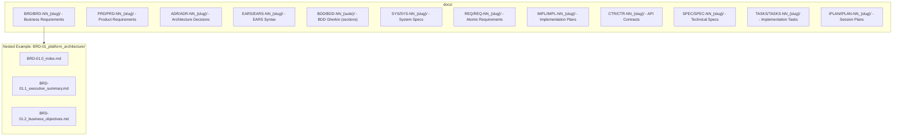

# Quick Reference Card

**Version**: 1.0
**Purpose**: One-page cheat sheet for AI Dev Flow framework
**Target**: Developers and AI Assistants
**Status**: Production

---

Note: Some examples in this document show a portable `docs/` root. In this repository, artifact folders live at the ai_dev_flow root without the `docs/` prefix; see README → “Using This Repo” for path mapping.

## Units & Conversions (KB vs tokens)

- KB: 1 KB = 1,024 bytes (OS file size).
- Tokens: ~4 characters per token on average for English plaintext (≈0.75 words).
- Estimate tokens from size: tokens ≈ (KB × 1024) ÷ 4.
  - Examples: 10 KB ≈ 2,500 tokens; 20 KB ≈ 5,000 tokens; 50 KB ≈ 12,500 tokens.
- Estimate size from tokens: KB ≈ (tokens × 4) ÷ 1024.
  - Examples: 10,000 tokens ≈ 39 KB; 50,000 tokens ≈ 195 KB.
- Caveats: Code/JSON and non‑ASCII text increase token counts; tools may compress inputs.

See also: [README → Units & Conversions](./README.md#units--conversions-kb-vs-tokens)

### Splitting Rules

- Core: [DOCUMENT_SPLITTING_RULES.md](./DOCUMENT_SPLITTING_RULES.md)
- BDD addendum: [BDD/BDD_SPLITTING_RULES.md](./BDD/BDD_SPLITTING_RULES.md)
- CTR addendum: [CTR/CTR_SPLITTING_RULES.md](./CTR/CTR_SPLITTING_RULES.md)
- SPEC addendum: [SPEC/SPEC_SPLITTING_RULES.md](./SPEC/SPEC_SPLITTING_RULES.md)
- Templates: Use `{TYPE}-SECTION-0-TEMPLATE.md` (index) and `{TYPE}-SECTION-TEMPLATE.md` (sections)

<!-- See README.md → “Using This Repo” for path mapping guidance. -->

## 16-Layer Workflow

```
BRD → PRD → EARS → BDD → ADR → SYS → REQ → IMPL → CTR → SPEC → TASKS → IPLAN → Code → Tests → Validation
```

**Note**: Layer 0 (Strategy/STRAT) is external business context; formal documentation begins at Layer 1 (BRD). "Production" is an outcome, not a formal layer.

**With Contracts**: `REQ → IMPL → CTR → SPEC → TASKS → IPLAN`
**Without Contracts**: `REQ → IMPL → SPEC → TASKS → IPLAN`

**BRD Section Requirements**:
- Platform BRDs (001-005): Foundation architecture, cross-cutting concerns
- Feature BRDs (006+): Feature-specific business requirements

**Note**: For distinction between metadata (YAML frontmatter) and traceability (Section 7 links), see `SPEC_DRIVEN_DEVELOPMENT_GUIDE.md`.

---

## Document ID Naming

### Format
```
{TYPE}-{NN}_{descriptive_slug}.{ext}
```

### Examples
```
REQ-01_resource_limit_enforcement.md
ADR-05_database_selection.md
CTR-12_data_service_api.md
CTR-12_data_service_api.yaml  (dual-file)
SPEC-23_risk_calculator.yaml
TASKS-23_implement_risk_calculator.md
```

### Numbering Rule (Unified)

- Start at 2 digits and expand only when needed (no extra leading zeros).
- Correct: `BRD-01`, `BRD-99`, `BRD-102`, `BRD-999`, `BRD-1000`.
- Incorrect: `BRD-001`, `BRD-009`.
- Applies to all document types (BRD→IPLAN). Element IDs must match filename digit width (e.g., `PRD-16` ↔ `PRD.16.xx.xx`).
- Reserved infra docs: This repository uses `-000` for index/registry and general utility docs. Code and tests use their language-specific naming rules.
- See: `ID_NAMING_STANDARDS.md` for full details.

### General Utility Documents (`{DOC_TYPE}-000_*`)
- Purpose: Group general-purpose, cross-project, or utility documents not tied to a specific project artifact.
- Pattern: `{DOC_TYPE}-000_{slug}.{ext}` (e.g., `REQ-000_TRACEABILITY_MATRIX-TEMPLATE.md`, `ICON-000_index.md`).
- Usage: May be referenced across artifacts but are excluded from sequential DOC_NUM series. Keep guidance, templates, matrices, and reference content here.

### Section Files (DEFAULT for BRD/PRD/ADR)
```
docs/{TYPE}/{TYPE}-{NN}_{slug}/{TYPE}-{NN}.{S}_{section_slug}.{ext}

Folder:       docs/BRD/BRD-01_platform_architecture/
Index File:   docs/BRD/BRD-01_platform_architecture/BRD-01.0_platform_architecture_index.md
Section File: docs/BRD/BRD-01_platform_architecture/BRD-01.1_platform_architecture_executive_summary.md
Section File: docs/PRD/PRD-02_user_authentication/PRD-02.3_user_authentication_problem_statement.md
Section File: docs/ADR/ADR-05_database_selection/ADR-05.2_database_selection_alternatives.md
```

**Note**: Folder slug MUST match the index file slug (e.g., `BRD-01_platform_architecture/` contains `BRD-01.0_platform_architecture_index.md`).

### SPEC Policy (YAML vs Markdown)

- YAML: Keep monolithic per component for codegen (`SPEC-{DOC_NUM}_{slug}.yaml`).
- Markdown: Split narrative with `SPEC-{DOC_NUM}.0_index.md` and `SPEC-{DOC_NUM}.{S}_{slug}.md` when needed.
- Layout:
  - Nested default: `SPEC/SPEC-{DOC_NUM}_{slug}/SPEC-{DOC_NUM}_{slug}.yaml`
  - Flat exception: `SPEC/SPEC-{DOC_NUM}_{slug}.yaml` (small, stable specs)

Examples:
- Flat: `SPEC/SPEC-01_api_client_example.yaml`
- Nested: `SPEC/examples/SPEC-02_nested_example/SPEC-02_nested_example.yaml` (+ `SPEC-02.0_index.md`)

---

## Traceability Link Format

```markdown
[{TYPE}-{ID}](../path/to/document.md#{TYPE}-{ID})

<!-- VALIDATOR:IGNORE-LINKS-START -->
Examples (nested folder structure):
[BRD-01](../BRD/BRD-01_platform_architecture/BRD-01.0_platform_architecture_index.md#BRD-01)
[PRD-02](../PRD/PRD-02_user_authentication/PRD-02.0_user_authentication_index.md#PRD-02)
[ADR-05](../ADR/ADR-05_database_selection/ADR-05.0_database_selection_index.md#ADR-05)

Examples (flat structure - legacy):
[REQ-03](../REQ/risk/REQ-03_resource_limit.md#REQ-03)
[SPEC-23](../SPEC/SPEC-23_risk_calculator/SPEC-23_risk_calculator.yaml)
```

---

## Folder Structure (Unified Nested)



<!-- Repository migration notes are tracked in the changelog; this quick reference remains generic. -->

---

Note: This repository includes some flat examples for historical reasons. For new projects, use the nested folder structure for all document types by default.

## REQ Subfolder Taxonomy

- Standard (domain‑agnostic): `api`, `auth`, `data`, `core`, `integration`, `monitoring`, `reporting`, `security`, `ui`
- Financial (domain‑specific): `risk`, `operations`, `data`, `compliance`, `ml`

Use the Standard set for general projects, and add Financial sets as needed for financial services domains.

## Common Commands

### Project Initialization

```bash
# NOTE: In this repo, drop any `docs/` prefix used in generic examples.
# Create top-level folders (nested structure is DEFAULT for all document types)
mkdir -p docs/{BRD,PRD,ADR}
mkdir -p docs/{EARS,BDD,SYS,REQ,IMPL,CTR,SPEC,TASKS,IPLAN}
# REQ: Nested per-document folders (DEFAULT)
mkdir -p docs/REQ/REQ-01_resource_limits

# Create nested document folders (ALL TYPES - DEFAULT)
# Folder slug MUST match the index file slug
mkdir -p docs/BRD/BRD-01_platform_architecture  # Creates docs/BRD/BRD-01_platform_architecture/
mkdir -p docs/PRD/PRD-01_user_authentication    # Creates docs/PRD/PRD-01_user_authentication/
mkdir -p docs/ADR/ADR-01_cloud_migration        # Creates docs/ADR/ADR-01_cloud_migration/

# Examples for other types (nested per document)
mkdir -p docs/EARS/EARS-01_event_processing
mkdir -p docs/SYS/SYS-01_api_gateway
mkdir -p docs/REQ/REQ-01_resource_limits
mkdir -p docs/SPEC/SPEC-01_rate_limiter
mkdir -p docs/TASKS/TASKS-01_implement_rate_limiter
mkdir -p docs/CTR/CTR-01_data_service_api
mkdir -p docs/IPLAN/IPLAN-01_initial_session

# Legacy category folders are not used in new projects.

# Support directories
mkdir -p scripts work_plans
```

Note: Traceability matrix generator — use the singular script `scripts/generate_traceability_matrix.py`. The plural `generate_traceability_matrices.py` is a backward-compatible wrapper.

Index Width Policy: See README.md → “Using This Repo” for the `-000` index/utility convention used here.

### Validation

```bash
# NOTE: In this repo, drop any `docs/` prefix used in generic examples.
# Validate requirement IDs
python scripts/validate_requirement_ids.py

# Check broken references
python scripts/validate_links.py

# Generate traceability matrix
python scripts/generate_traceability_matrix.py --type REQ --input docs/REQ/ --output docs/TRACEABILITY_MATRIX_REQ.md

# Lint file sizes (target 300–500, max 600)
./scripts/lint_file_sizes.sh
```

---

## Traceability Rules Quick Reference

| Document Type | Upstream Traceability | Downstream Traceability |
|---------------|----------------------|------------------------|
| **BRD** | OPTIONAL (to other BRDs) | OPTIONAL |
| **All Others** | REQUIRED | OPTIONAL |

**Key Rules**:
- **Upstream REQUIRED** (except BRD): Document MUST reference its upstream sources
- **Downstream OPTIONAL**: Only link to documents that already exist
- **No-TBD Rule**: NEVER use placeholder IDs (TBD, XXX, NNN) - leave empty or omit section

---

## 7. Traceability Template

<!-- VALIDATOR:IGNORE-LINKS-START -->
```markdown
<!-- VALIDATOR:IGNORE-LINKS-END -->
## 7. Traceability

### Upstream Sources (REQUIRED - except BRD)
| Source | Type | Reference |
|--------|------|-----------|
| [BRD-01](../BRD/BRD-01_business.md#BRD-01) | Business Requirements | Context |
| [PRD-02](../PRD/PRD-02_product.md#PRD-02) | Product Requirements | Feature spec |

### Downstream Artifacts (OPTIONAL - only existing docs)
| Artifact | Type | Reference |
|----------|------|-----------|
| [SPEC-23](../SPEC/SPEC-23_impl/SPEC-23_impl.yaml) | Technical Specification | Implementation |
| [TASKS-23](../TASKS/TASKS-23_impl.md#TASKS-23) | Implementation Tasks | TODOs |

### Primary Anchor/ID
- **REQ-03**: [placeholder] requirement title

### Code Paths
- `src/[module]/[component].py::[ClassOrFunc]`
- `tests/[module]/test_[component].py::test_[behavior]()`
```

---

## Domain Placeholders

### Financial Services (Default)
```
[RESOURCE_COLLECTION] → collection
[RESOURCE_ITEM] → Position
[USER_ROLE] → Trader
[TRANSACTION] → Trade
[REGULATORY_REQUIREMENT] → regulatory Rule 15c3-5
```

### Software/SaaS
```
[RESOURCE_COLLECTION] → Workspace
[RESOURCE_ITEM] → Resource
[USER_ROLE] → Account Admin
[TRANSACTION] → API Call
[REGULATORY_REQUIREMENT] → SOC2 Control
```

### Generic
```
[RESOURCE_COLLECTION] → Collection
[RESOURCE_ITEM] → Entity
[USER_ROLE] → User
[TRANSACTION] → Action
[REGULATORY_REQUIREMENT] → Company Policy
```

---

## Tool Optimization

For tool-specific guidance (token limits, file handling, working set strategies), see `AI_TOOL_OPTIMIZATION_GUIDE.md`.
Quick link: AI Assistant Playbook (index): `AI_ASSISTANT_PLAYBOOK.md`

---

## AI Assistant Rules Summary

1. **Domain Selection First** - Ask user for project domain
2. **Create Folders Before Documents** - Complete directory structure
3. **Apply Domain Config** - Replace placeholders with domain terms
4. **Run Contract Questionnaire** - Determine if CTR layer needed
5. **Initialize Index Files** - Create all {TYPE}-000_index files
6. **Maintain Traceability** - section 7 in every document
7. **Validate Continuously** - Run validation after each document
8. **Follow ID Standards** - Sequential numbering, stable IDs
9. **Dual-File Contracts** - Both .md and .yaml for CTR
10. **Tool Optimization** - See AI_TOOL_OPTIMIZATION_GUIDE.md for token guidance

---

## Creating New Documents Checklist

### Pre-Creation
- [ ] Read upstream documents (strategy, BRD, PRD, EARS, etc.)
- [ ] Identify which template to use from `ai_dev_flow/[TYPE]/`
- [ ] Assign next sequential ID ([TYPE]-NN)
- [ ] Check for existing traceability matrix: `[TYPE]-000_TRACEABILITY_MATRIX.md`

### During Creation
- [ ] Use template from `ai_dev_flow/[TYPE]/[TYPE]-TEMPLATE.[ext]`
- [ ] Include H1 header with ID: `# [TYPE]-NN: Title`
- [ ] Fill all required sections from template
- [ ] Add Traceability section (section 7) with upstream/downstream links
- [ ] Validate inline cross-references use anchor format: `#[TYPE]-NN`

### Post-Creation (MANDATORY)
- [ ] **CREATE/UPDATE TRACEABILITY MATRIX** ⚠️ **CRITICAL STEP**
  - [ ] Check if `[TYPE]-000_TRACEABILITY_MATRIX.md` exists
  - [ ] If missing: Create from `[TYPE]-000_TRACEABILITY_MATRIX-TEMPLATE.md`
  - [ ] Add this document to section 2 (Complete Inventory) with:
    - Document ID, title, status, date
    - Upstream sources (which documents drove this)
    - Downstream artifacts (which documents/code derive from this)
  - [ ] Update section 3 (Upstream Traceability)
  - [ ] Update section 4 (Downstream Traceability)
  - [ ] Update section 8 (Implementation Status)
- [ ] Update index file: `[TYPE]-000_index.md`
- [ ] Validate all markdown links resolve correctly
- [ ] Run validation scripts:
  ```bash
  python scripts/validate_requirement_ids.py
  python scripts/validate_traceability_matrix.py --type [TYPE]
  ```
- [ ] Commit files together (artifact + matrix + index)

### Quality Gates
- [ ] Document ID complies with ID_NAMING_STANDARDS.md
- [ ] Traceability matrix updated (MANDATORY)
- [ ] No broken links or missing anchors
- [ ] No orphaned artifacts (all docs in matrix)
- [ ] Validation scripts pass without errors
- [ ] File size under token limits (50K standard, 100K max)

---

## Regulatory Mappings

### Financial Services
- regulatory Rule 15c3-5 (Market Access)
- compliance Rule 3110 (Supervision)
- SOX 404 (Internal Controls)
- Basel III (Capital Adequacy)
- PCI-DSS (Payment Card security)

### Software/SaaS
- SOC2 CC6.1 (Access Control)
- GDPR Article 17 (Right to Erasure)
- CCPA (Data Privacy)
- ISO 27001 (Information security)

---

## Document Types Quick Reference

| Type | Purpose | Format | Structure | Example |
|------|---------|--------|-----------|---------|
| **BRD** | Business objectives | .md | **Nested** | `BRD/BRD-01_platform_architecture/BRD-01.0_platform_architecture_index.md` |
| **PRD** | Product features | .md | **Nested** | `PRD/PRD-02_user_auth/PRD-02.0_user_auth_index.md` |
| **ADR** | Architecture decisions | .md | **Nested** | `ADR/ADR-05_db_selection/ADR-05.0_db_selection_index.md` |
| **EARS** | Measurable requirements | .md | **Nested** | `EARS/EARS-03_performance/EARS-03_performance.md` |
| **BDD** | Acceptance tests | .feature | **Nested (section-based)** | `BDD/BDD-02_query/BDD-02.14_query_filtering.feature` |
| **SYS** | System specifications | .md | **Nested** | `SYS/SYS-06_api_gateway/SYS-06_api_gateway.md` |
| **REQ** | Atomic requirements | .md | **Nested** | `REQ/REQ-07_limit_enforcement/REQ-07_limit_enforcement.md` |
| **IMPL** | Implementation plan | .md | **Nested** | `IMPL/IMPL-08_phase1_plan/IMPL-08_phase1_plan.md` |
| **CTR** | API contracts | .md + .yaml | **Nested** | `CTR/CTR-09_market_api/CTR-09_market_api.{md,yaml}` |
| **SPEC** | Technical SPEC | .yaml | **Nested** | `SPEC/SPEC-10_limiter/SPEC-10_limiter.yaml` |
| **TASKS** | Implementation TODOs | .md | **Nested** | `TASKS/TASKS-10_implement_limiter/TASKS-10_implement_limiter.md` |
| **IPLAN** | Session execution plans | .md | **Nested** | `IPLAN/IPLAN-01_db_migration/IPLAN-01_db_migration.md` |
| **REF** | Supplementary docs | .md | **Nested** | `REF/TYPE-REF-NN_{slug}/TYPE-REF-NN_{slug}.md` |

**Note**: REF (Reference Documents) are supplementary and do not participate in formal traceability chain.

**Default Directory Model**: All document types use nested folder structure by default. The primary file(s) live inside that folder, using section-based filenames where applicable. Folder slug MUST match the document slug.

## File Size Limits (All Documents)

- Target: 300–500 lines per file
- Maximum: 600 lines per file (absolute) for Markdown and feature files
- YAML Exception: YAML specs are monolithic; warnings start at ~1000 lines and errors at ~2000 lines in the linter. Prefer readability and coherent grouping over splitting.
- If a file approaches/exceeds limits, split into sections/subsections per the type’s templates (except YAML where monolithic files are preferred)

## Document Splitting Standard (All Types)

- Triggers:
  - Approaches or exceeds size limits (MD/feature > 500 target or > 600 max; YAML > ~2000 only if readability suffers)
  - Logical boundaries emerge (distinct topics, modules, or lifecycle phases)
  - Navigation or maintenance suffers (anchors hard to find, very long TOC)
- General Steps:
  1) Identify natural split points (headings or feature groupings)
  2) Create a section index if not present (`{TYPE}-{NN}.0_index.md`)
  3) Create section files from the type’s SECTION-TEMPLATE:
     - Pattern: `{TYPE}-{NN}.{S}_{slug}.{ext}` (S starts at 1)
  4) Update index with section map, prev/next links, and brief descriptions
  5) Update cross-references and traceability matrices
  6) Validate links and run `./scripts/lint_file_sizes.sh`
- Type-specific Notes:
  - BDD: Use section-based `.SS_{slug}.feature`. If a section grows, split into subsections `.SS.mm_{slug}.feature` and add an aggregator `.SS.00_{slug}.feature` with `@redirect`.
  - SPEC (YAML): Prefer monolithic. Only split by component/domain when extremely large or harming readability; ensure interfaces remain coherent.
  - CTR: Maintain dual-file structure (`.md` + `.yaml`). If split by endpoint groups, keep paired files consistent and cross-linked.

---

## BDD Section-Based Format (MANDATORY)

**All BDD files MUST use section-based numbering** - No backward compatibility with legacy formats.

### Three Valid Patterns

#### 1. Section-Only Format (Primary)
```
Pattern: BDD-NN.SS_{slug}.feature
Example: BDD-02.14_query_result_filtering.feature
Use When: Standard section file (≤500 lines, ≤12 scenarios)
```

#### 2. Subsection Format (When Section >500 Lines)
```
Pattern: BDD-NN.SS.mm_{slug}.feature
Example: BDD-02.24.01_quality_performance.feature
Use When: Section requires splitting (each subsection ≤500 lines)
```

#### 3. Aggregator Format (Optional Redirect Stub)
```
Pattern: BDD-NN.SS.00_{slug}.feature
Example: BDD-02.12.00_query_graph_traversal.feature
Use When: Organizing multiple subsections under one section
Requirements: @redirect tag MANDATORY, 0 scenarios
```

### Index File (Mandatory)
```
Pattern: BDD-NN.0_index.md
Example: BDD-02.0_index.md
Purpose: Suite overview, section map, traceability matrix
```

### Prohibited Patterns (ERROR)
```
❌ BDD-02_query_part1.feature          # _partN suffix
❌ BDD-02_knowledge_engine.feature     # Single-file format
❌ BDD-02_knowledge_engine/features/   # Directory-based structure
```

### File Organization (Nested Suite)
```
docs/BDD/
└── BDD-02_knowledge_engine/
    ├── BDD-02.0_index.md                       # Index (MANDATORY)
    ├── BDD-02.1_ingest.feature                 # Section-only
    ├── BDD-02.2_query.feature                  # Section-only
    ├── BDD-02.12.00_graph_traversal.feature    # Aggregator (@redirect)
    ├── BDD-02.12.01_depth_first.feature        # Subsection
    ├── BDD-02.12.02_breadth_first.feature      # Subsection
    └── BDD-02.3_learning.feature               # Section-only
```

### Section Metadata Tags (Required)
```gherkin
@section: 2.14              # Section number
@parent_doc: BDD-02         # Parent BDD suite
@index: BDD-02.0_index.md   # Index file reference
@brd:BRD.02.03.14          # Upstream traceability
@prd:PRD.02.05.14
@ears:EARS.02.14.01
```

### Cross-Doc BDD Link Format
```markdown
# Suite folder
../BDD/BDD-NN_{suite}/

# Section link (most common)
[BDD-NN.SS](../BDD/BDD-NN_{suite}/BDD-NN.SS_{slug}.feature#scenarios)

# Subsection link
[BDD-NN.SS.mm](../BDD/BDD-NN_{suite}/BDD-NN.SS.mm_{slug}.feature#scenario-1)

# Aggregator link (redirect, 0 scenarios)
[BDD-NN.SS.00](../BDD/BDD-NN_{suite}/BDD-NN.SS.00_{slug}.feature)
```

### Validation
```bash
# Validate section-based format
python3 scripts/validate_bdd_suite.py --root BDD

# Migrate legacy formats
python3 scripts/migrate_bdd_to_sections.py --root BDD --suite BDD-02_knowledge_engine
```

---

## Validation Checklist

- [ ] All directories created
- [ ] Domain configuration applied
- [ ] Index files initialized
- [ ] Requirement IDs unique and sequential
- [ ] No broken references
- [ ] section 7 in all documents
- [ ] Dual files for CTR (.md + .yaml)
- [ ] Traceability matrices generated
- [ ] Code includes traceability comments
- [ ] Tests reference BDD scenarios

---

## Key Files Reference

| File | Purpose |
|------|---------|
| [AI_ASSISTANT_RULES.md](./AI_ASSISTANT_RULES.md) | Core execution rules |
| [DOMAIN_SELECTION_QUESTIONNAIRE.md](./DOMAIN_SELECTION_QUESTIONNAIRE.md) | Domain selection |
| [CONTRACT_DECISION_QUESTIONNAIRE.md](./CONTRACT_DECISION_QUESTIONNAIRE.md) | Contract decision |
| [PROJECT_SETUP_GUIDE.md](./PROJECT_SETUP_GUIDE.md) | Setup instructions |
| [PROJECT_KICKOFF_TASKS.md](./PROJECT_KICKOFF_TASKS.md) | Week 1 tasks |
| [TRACEABILITY_SETUP.md](./TRACEABILITY_SETUP.md) | Validation automation |
| [FINANCIAL_DOMAIN_CONFIG.md](./FINANCIAL_DOMAIN_CONFIG.md) | Finance config |
| [SOFTWARE_DOMAIN_CONFIG.md](./SOFTWARE_DOMAIN_CONFIG.md) | Software config |
| [GENERIC_DOMAIN_CONFIG.md](./GENERIC_DOMAIN_CONFIG.md) | Generic config |

---

## Emergency Fixes

### Broken Reference
```bash
# Find all broken references
python scripts/validate_links.py

# Fix pattern
[REQ-03](../REQ/risk/REQ-03_resource_limit.md#REQ-03)
         ^^^^^ correct path ^^^^^ ^^^^^^^ anchor matches ID ^^^^^^^
```

### Duplicate ID
```bash
# Check for duplicates
python scripts/validate_requirement_ids.py

# Resolution: Rename duplicate with next sequential ID
# Update all references to new ID
```

### Missing section 7
<!-- VALIDATOR:IGNORE-LINKS-START -->
```markdown
## 7. Traceability

### Upstream Sources
| Source | Type | Reference |
|--------|------|-----------|
| (Add upstream documents) |

### Downstream Artifacts
| Artifact | Type | Reference |
|----------|------|-----------|
| (Add downstream documents) |

### Primary Anchor/ID
- **{TYPE}-{ID}**: (Description)
```

---

**End of Quick Reference Card**
