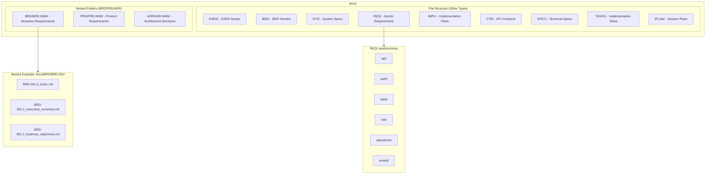

# Quick Reference Card

**Version**: 1.0
**Purpose**: One-page cheat sheet for AI Dev Flow framework
**Target**: Developers and AI Assistants
**Status**: Production

---

## 16-Layer Workflow

```
BRD → PRD → EARS → BDD → ADR → SYS → REQ → IMPL → CTR → SPEC → TASKS → IPLAN → Code → Tests → Validation → Production
```

**With Contracts**: `REQ → IMPL → CTR → SPEC → TASKS → IPLAN`
**Without Contracts**: `REQ → IMPL → SPEC → TASKS → IPLAN`

---

## Document ID Naming

### Format
```
{TYPE}-{NNN}_{descriptive_slug}.{ext}
```

### Examples
```
REQ-001_resource_limit_enforcement.md
ADR-005_database_selection.md
CTR-012_data_service_api.md
CTR-012_data_service_api.yaml  (dual-file)
SPEC-023_risk_calculator.yaml
TASKS-023_implement_risk_calculator.md
```

### Section Files (DEFAULT for BRD/PRD/ADR)
```
docs/{TYPE}/{TYPE}-{NNN}/{TYPE}-{NNN}.{S}_{section_slug}.{ext}

Index File:   docs/BRD/BRD-001/BRD-001.0_index.md
Section File: docs/BRD/BRD-001/BRD-001.1_executive_summary.md
Section File: docs/PRD/PRD-002/PRD-002.3_problem_statement.md
Section File: docs/ADR/ADR-005/ADR-005.2_alternatives.md
```

### Monolithic (Optional for <25KB)
```
docs/{TYPE}/{TYPE}-{NNN}_{descriptive_slug}.md

Example: docs/REQ/REQ-042_authentication_methods.md
```

---

## Traceability Link Format

```markdown
[{TYPE}-{ID}](../path/to/document.md#{TYPE}-{ID})

Examples (nested folder structure - BRD/PRD/ADR):
[BRD-001](../BRD/BRD-001/BRD-001.0_index.md#BRD-001)
[PRD-002](../PRD/PRD-002/PRD-002.0_index.md#PRD-002)
[ADR-005](../ADR/ADR-005/ADR-005.0_index.md#ADR-005)

Examples (flat structure - other types):
[REQ-003](../REQ/risk/REQ-003_resource_limit.md#REQ-003)
[SPEC-023](../SPEC/SPEC-023_risk_calculator.yaml)
```

---

## Folder Structure



<!-- Migration History -->
<!-- CONTRACTS/ migrated to CTR/ (2025-01-13) -->
<!-- tasks_plans/ migrated to IPLAN/ (2025-01-13) -->
<!-- BRD/PRD/ADR migrated to nested folder structure (2025-12-18) -->

---

## Common Commands

### Project Initialization

```bash
# Create top-level folders (nested structure for BRD/PRD/ADR)
mkdir -p docs/{BRD,PRD,ADR}
mkdir -p docs/{EARS,BDD,SYS,REQ,IMPL,CTR,SPEC,TASKS,IPLAN}
mkdir -p docs/REQ/{api,auth,data,core,integration,monitoring,reporting,security,ui}

# Create nested document folders (BRD/PRD/ADR - DEFAULT)
mkdir -p docs/BRD/BRD-001  # Creates docs/BRD/BRD-001/
mkdir -p docs/PRD/PRD-001  # Creates docs/PRD/PRD-001/
mkdir -p docs/ADR/ADR-001  # Creates docs/ADR/ADR-001/

# Domain-specific (Financial)
mkdir -p docs/REQ/{core,operations,data,compliance,ml}

# Domain-specific (Software/SaaS)
mkdir -p docs/REQ/{tenant,subscription,billing,workspace}

# Support directories
mkdir -p scripts work_plans
```

### Validation

```bash
# Validate requirement IDs
python scripts/validate_requirement_ids.py

# Check broken references
python scripts/check_broken_references.py

# Generate traceability matrix
python scripts/generate_traceability_matrix.py --type REQ --input docs/REQ/ --output docs/TRACEABILITY_MATRIX_REQ.md
```

---

## Traceability Rules Quick Reference

| Document Type | Upstream Traceability | Downstream Traceability |
|---------------|----------------------|------------------------|
| **BRD** | OPTIONAL (to other BRDs) | OPTIONAL |
| **All Others** | REQUIRED | OPTIONAL |

**Key Rules**:
- **Upstream REQUIRED** (except BRD): Document MUST reference its upstream sources
- **Downstream OPTIONAL**: Only link to documents that already exist
- **No-TBD Rule**: NEVER use placeholder IDs (TBD, XXX, NNN) - leave empty or omit section

---

## section 7: Traceability Template

```markdown
## 7. Traceability

### Upstream Sources (REQUIRED - except BRD)
| Source | Type | Reference |
|--------|------|-----------|
| [BRD-001](../BRD/BRD-001_business.md#BRD-001) | Business Requirements | Context |
| [PRD-002](../PRD/PRD-002_product.md#PRD-002) | Product Requirements | Feature spec |

### Downstream Artifacts (OPTIONAL - only existing docs)
| Artifact | Type | Reference |
|----------|------|-----------|
| [SPEC-023](../SPEC/SPEC-023_impl.yaml) | Technical Specification | Implementation |
| [TASKS-023](../TASKS/TASKS-023_impl.md#TASKS-023) | Implementation Tasks | TODOs |

### Primary Anchor/ID
- **REQ-003**: resource limit enforcement requirement

### Code Paths
- `src/risk/resource_limiter.py::PositionLimiter.enforce_limit()`
- `tests/risk/test_resource_limits.py::test_hard_limit_enforcement()`
```

---

## Domain Placeholders

### Financial Services (Default)
```
[RESOURCE_COLLECTION] → collection
[RESOURCE_ITEM] → Position
[USER_ROLE] → Trader
[TRANSACTION] → Trade
[REGULATORY_REQUIREMENT] → regulatory Rule 15c3-5
```

### Software/SaaS
```
[RESOURCE_COLLECTION] → Workspace
[RESOURCE_ITEM] → Resource
[USER_ROLE] → Account Admin
[TRANSACTION] → API Call
[REGULATORY_REQUIREMENT] → SOC2 Control
```

### Generic
```
[RESOURCE_COLLECTION] → Collection
[RESOURCE_ITEM] → Entity
[USER_ROLE] → User
[TRANSACTION] → Action
[REGULATORY_REQUIREMENT] → Company Policy
```

---

## Tool Optimization

### Claude Code
- **File limit**: 50K tokens (200KB) standard, 100K max
- **Strategy**: Single comprehensive files
- **Command**: Use `Read` tool for all file operations

### Gemini CLI
- **@ reference limit**: 10K tokens (40KB)
- **Large files**: Use file read tool, not `@` reference
- **Command**: `gemini read FILE.md` instead of `@FILE.md`

### GitHub Copilot
- **Optimal**: 10-30KB per file
- **Large files**: Create companion summaries
- **Working set**: Max 10 files in Edits mode

---

## AI Assistant Rules Summary

1. **Domain Selection First** - Ask user for project domain
2. **Create Folders Before Documents** - Complete directory structure
3. **Apply Domain Config** - Replace placeholders with domain terms
4. **Run Contract Questionnaire** - Determine if CTR layer needed
5. **Initialize Index Files** - Create all {TYPE}-000_index files
6. **Maintain Traceability** - section 7 in every document
7. **Validate Continuously** - Run validation after each document
8. **Follow ID Standards** - Sequential numbering, stable IDs
9. **Dual-File Contracts** - Both .md and .yaml for CTR
10. **Token Optimization** - Target 50K tokens per file, 100K max

---

## Creating New Documents Checklist

### Pre-Creation
- [ ] Read upstream documents (strategy, BRD, PRD, EARS, etc.)
- [ ] Identify which template to use from `ai_dev_flow/[TYPE]/`
- [ ] Assign next sequential ID ([TYPE]-NNN)
- [ ] Check for existing traceability matrix: `[TYPE]-000_TRACEABILITY_MATRIX.md`

### During Creation
- [ ] Use template from `ai_dev_flow/[TYPE]/[TYPE]-TEMPLATE.[ext]`
- [ ] Include H1 header with ID: `# [TYPE]-NNN: Title`
- [ ] Fill all required sections from template
- [ ] Add Traceability section (section 7) with upstream/downstream links
- [ ] Validate inline cross-references use anchor format: `#[TYPE]-NNN`

### Post-Creation (MANDATORY)
- [ ] **CREATE/UPDATE TRACEABILITY MATRIX** ⚠️ **CRITICAL STEP**
  - [ ] Check if `[TYPE]-000_TRACEABILITY_MATRIX.md` exists
  - [ ] If missing: Create from `[TYPE]-000_TRACEABILITY_MATRIX-TEMPLATE.md`
  - [ ] Add this document to section 2 (Complete Inventory) with:
    - Document ID, title, status, date
    - Upstream sources (which documents drove this)
    - Downstream artifacts (which documents/code derive from this)
  - [ ] Update section 3 (Upstream Traceability)
  - [ ] Update section 4 (Downstream Traceability)
  - [ ] Update section 8 (Implementation Status)
- [ ] Update index file: `[TYPE]-000_index.md`
- [ ] Validate all markdown links resolve correctly
- [ ] Run validation scripts:
  ```bash
  python scripts/validate_requirement_ids.py
  python scripts/validate_traceability_matrix.py --type [TYPE]
  ```
- [ ] Commit files together (artifact + matrix + index)

### Quality Gates
- [ ] Document ID complies with ID_NAMING_STANDARDS.md
- [ ] Traceability matrix updated (MANDATORY)
- [ ] No broken links or missing anchors
- [ ] No orphaned artifacts (all docs in matrix)
- [ ] Validation scripts pass without errors
- [ ] File size under token limits (50K standard, 100K max)

---

## Regulatory Mappings

### Financial Services
- regulatory Rule 15c3-5 (Market Access)
- compliance Rule 3110 (Supervision)
- SOX 404 (Internal Controls)
- Basel III (Capital Adequacy)
- PCI-DSS (Payment Card security)

### Software/SaaS
- SOC2 CC6.1 (Access Control)
- GDPR Article 17 (Right to Erasure)
- CCPA (Data Privacy)
- ISO 27001 (Information security)

---

## Document Types Quick Reference

| Type | Purpose | Format | Structure | Example |
|------|---------|--------|-----------|---------|
| **BRD** | Business objectives | .md | **Nested** | `BRD/BRD-001/BRD-001.0_index.md` |
| **PRD** | Product features | .md | **Nested** | `PRD/PRD-002/PRD-002.0_index.md` |
| **ADR** | Architecture decisions | .md | **Nested** | `ADR/ADR-005/ADR-005.0_index.md` |
| **EARS** | Measurable requirements | .md | Flat | EARS-003_performance.md |
| **BDD** | Acceptance tests | .feature | Flat | BDD-004_resource_limits.feature |
| **SYS** | System specifications | .md | Flat | SYS-006_api_gateway.md |
| **REQ** | Atomic requirements | .md | Flat | REQ-007_limit_enforcement.md |
| **IMPL** | Implementation plan | .md | Flat | IMPL-008_phase1_plan.md |
| **CTR** | API contracts | .md + .yaml | Flat | CTR-009_market_api.md + .yaml |
| **SPEC** | Technical SPEC | .yaml | Flat | SPEC-010_limiter.yaml |
| **TASKS** | Implementation TODOs | .md | Flat | TASKS-010_implement_limiter.md |
| **IPLAN** | Session execution plans | .md | Flat | IPLAN-001_db_migration.md |

**Note**: BRD/PRD/ADR use nested folder structure (`{TYPE}/{TYPE}-NNN/{TYPE}-NNN.S_slug.md`) by DEFAULT. Other types use flat structure.

---

## Validation Checklist

- [ ] All directories created
- [ ] Domain configuration applied
- [ ] Index files initialized
- [ ] Requirement IDs unique and sequential
- [ ] No broken references
- [ ] section 7 in all documents
- [ ] Dual files for CTR (.md + .yaml)
- [ ] Traceability matrices generated
- [ ] Code includes traceability comments
- [ ] Tests reference BDD scenarios

---

## Key Files Reference

| File | Purpose |
|------|---------|
| [AI_ASSISTANT_RULES.md](./AI_ASSISTANT_RULES.md) | Core execution rules |
| [DOMAIN_SELECTION_QUESTIONNAIRE.md](./DOMAIN_SELECTION_QUESTIONNAIRE.md) | Domain selection |
| [CONTRACT_DECISION_QUESTIONNAIRE.md](./CONTRACT_DECISION_QUESTIONNAIRE.md) | Contract decision |
| [PROJECT_SETUP_GUIDE.md](./PROJECT_SETUP_GUIDE.md) | Setup instructions |
| [PROJECT_KICKOFF_TASKS.md](./PROJECT_KICKOFF_TASKS.md) | Week 1 tasks |
| [TRACEABILITY_SETUP.md](./TRACEABILITY_SETUP.md) | Validation automation |
| [FINANCIAL_DOMAIN_CONFIG.md](./FINANCIAL_DOMAIN_CONFIG.md) | Finance config |
| [SOFTWARE_DOMAIN_CONFIG.md](./SOFTWARE_DOMAIN_CONFIG.md) | Software config |
| [GENERIC_DOMAIN_CONFIG.md](./GENERIC_DOMAIN_CONFIG.md) | Generic config |

---

## Emergency Fixes

### Broken Reference
```bash
# Find all broken references
python scripts/check_broken_references.py

# Fix pattern
[REQ-003](../REQ/risk/REQ-003_resource_limit.md#REQ-003)
         ^^^^^ correct path ^^^^^ ^^^^^^^ anchor matches ID ^^^^^^^
```

### Duplicate ID
```bash
# Check for duplicates
python scripts/validate_requirement_ids.py

# Resolution: Rename duplicate with next sequential ID
# Update all references to new ID
```

### Missing section 7
```markdown
## 7. Traceability

### Upstream Sources
| Source | Type | Reference |
|--------|------|-----------|
| (Add upstream documents) |

### Downstream Artifacts
| Artifact | Type | Reference |
|----------|------|-----------|
| (Add downstream documents) |

### Primary Anchor/ID
- **{TYPE}-{ID}**: (Description)
```

---

**End of Quick Reference Card**
