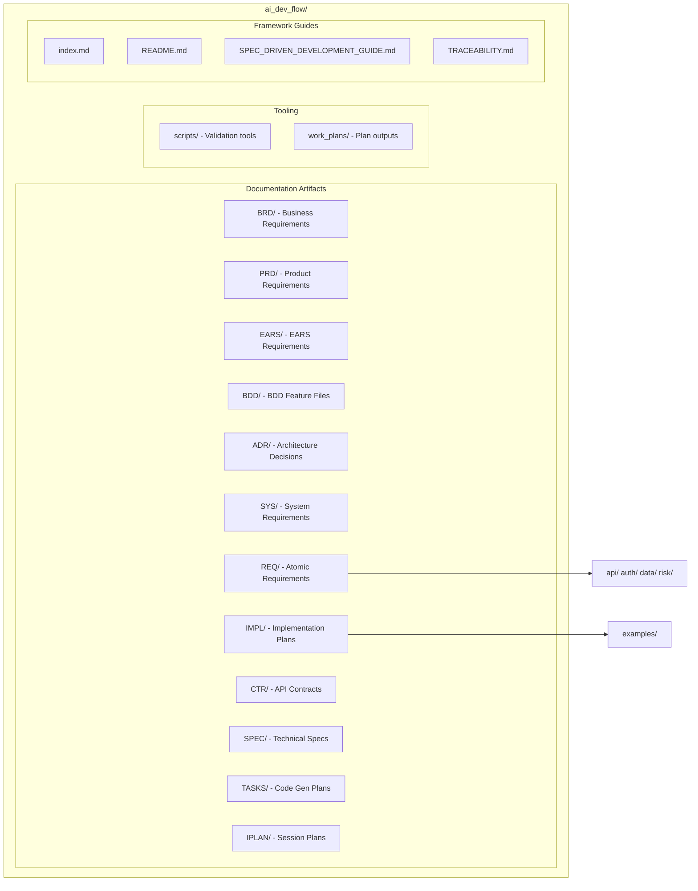

# AI Dev Flow - Universal Specification-Driven Development Framework

**Purpose**: Enable AI-assisted software development across any project domain through structured, traceable requirements and specifications.

**Status**: Production-ready framework with generic templates, domain adaptation guidance, cumulative tagging hierarchy, and automated validation tooling.

**Version**: 2.0 | **Last Updated**: 2025-11-13

## Overview

This directory provides a **universal, reusable framework** for Specification-Driven Development (SDD), transforming business needs into production-ready code through a systematic, traceable workflow.

### Why AI Dev Flow?

**Traditional Development Challenges**:
- Requirements drift from implementation over time
- Manual traceability is incomplete and outdated
- Inconsistent documentation across teams
- AI code generation requires unstructured guidance

**AI Dev Flow Solutions**:
- ✅ **Domain-Agnostic**: Adaptable to any software project (e-commerce, SaaS, IoT, healthcare, finance)
- ✅ **Complete Traceability**: Bidirectional links from business requirements to production code
- ✅ **Cumulative Tagging Hierarchy**: Each artifact includes tags from ALL upstream layers for complete audit trails
- ✅ **AI-Optimized**: YAML specifications designed for deterministic code generation
- ✅ **16-Layer Architecture**: Structured progression from strategy through validation
- ✅ **Dual-File Contracts**: Human-readable `.md` + machine-readable `.yaml`
- ✅ **Strict ID Standards**: Consistent naming and organization across all documents
- ✅ **Example-Driven**: Generic examples with `[PLACEHOLDER]` format for easy customization
- ✅ **Automated Validation**: Scripts for tag validation, traceability matrix generation, cumulative hierarchy enforcement

**📚 New to this framework?** Start with [DOMAIN_ADAPTATION_GUIDE.md](./DOMAIN_ADAPTATION_GUIDE.md) for domain-specific guidance (financial, healthcare, e-commerce, SaaS, IoT, or generic software).

## Metadata Management in AI Dev Flow

AI Dev Flow uses **dual metadata approaches** to serve both human and machine audiences:

### 1. YAML Frontmatter (Machine-Readable)

**Purpose**: Enables tooling integration, automated validation, and documentation site generation (e.g., Docusaurus).

**Location**: Top of markdown files, enclosed in `---` markers.

**Required in**: All templates, index files, and published documentation artifacts.

**Example**:
```yaml
---
title: "BRD-002: Partner Ecosystem Integration"
tags:
  - platform-brd
  - shared-architecture
  - layer-1-artifact
custom_fields:
  document_type: brd
  artifact_type: BRD
  layer: 1
  architecture_approaches: [ai-agent-based, traditional-8layer]
  priority: shared
  development_status: active
---
```

### 2. Document Control Tables (Human-Readable)

**Purpose**: Provide version history, authorship, and approval tracking for human reviewers.

**Location**: "Document Control" section within markdown body (typically section 1).

**Required in**: All production documents (BRD through IPLAN).

**Example**:
```markdown
## Document Control

| Item | Details |
|------|---------|
| Document ID | BRD-002 |
| Version | 1.2.0 |
| Status | Approved |
| Author | Product Team |
| Last Updated | 2025-11-15 |
| Approved By | Chief Product Officer |
```

### 3. Metadata vs. Traceability Tags

**IMPORTANT**: Metadata (YAML frontmatter) is DIFFERENT from traceability tags (`@artifact: ID`).

| Aspect | YAML Frontmatter | Traceability Tags |
|--------|------------------|-------------------|
| **Purpose** | Document classification, tooling | Audit trail, compliance |
| **Location** | Top of file (lines 1-20) | section 7 (body) |
| **Format** | YAML key-value pairs | `@artifact: ID (Description)` |
| **Validation** | `validate_metadata.py` | `trace-check` skill |
| **Changeability** | Can be updated | Immutable after approval |

**Learn More**:
- [METADATA_VS_TRACEABILITY.md](./METADATA_VS_TRACEABILITY.md) - Quick reference comparing both systems
- [SPEC_DRIVEN_DEVELOPMENT_GUIDE.md](./SPEC_DRIVEN_DEVELOPMENT_GUIDE.md#metadata-management-approaches) - Detailed methodology
- [scripts/validate_metadata.py](./scripts/validate_metadata.py) - YAML validation tool

**Validation**:
```bash
# Validate YAML frontmatter
python3 scripts/validate_metadata.py .

# Validate traceability tags (use Claude Code trace-check skill)
# Checks bidirectional links and cumulative tagging hierarchy
```

## Complete Development Workflow

**⚠️ See [index.md](./index.md#traceability-flow) for the authoritative workflow diagram with full Mermaid visualization.**

### 16-Layer Architecture with Cumulative Tagging

The AI Dev Flow transforms business requirements into production code through a structured, traceable workflow. Each layer includes cumulative tags from ALL upstream layers, creating complete audit trails for regulatory compliance (regulatory, FDA, ISO).

| Layer | Artifact | Purpose | Tags Required | Key Decision |
|-------|----------|---------|---------------|--------------|
| **0** | Strategy | External business strategy documents | 0 | Strategic direction |
| **1** | BRD | Business objectives and market context | 0 (top level) | WHAT needs to be built |
| **2** | PRD | Product features and user stories | @brd (1) | Product capabilities |
| **3** | EARS | Measurable event-driven requirements | @brd, @prd (2) | Formal requirements |
| **4** | BDD | Executable acceptance tests (Gherkin) | @brd→@ears (3+) | HOW to verify success |
| **5** | ADR | Architectural decisions and rationale | @brd→@bdd (4) | TECHNICAL approach |
| **6** | SYS | System-level requirements | @brd→@adr (5) | System specifications |
| **7** | REQ | Atomic, testable requirements | @brd→@sys (6) | GRANULAR specifications |
| **8** | IMPL | Implementation plans (optional) | @brd→@req (7) | WHO/WHEN to build |
| **9** | CTR | API contracts (optional) | @brd→@impl (8) | INTERFACE definitions |
| **10** | SPEC | YAML technical specifications | @brd→@req (+optional) (7-9) | HOW to build |
| **11** | TASKS | Implementation task breakdown | @brd→@spec (8-10) | EXACT TODOs |
| **12** | IPLAN | Session-specific plans | @brd→@tasks (9-11) | Session work scope |
| **13** | Code | Source code implementation | @brd→@tasks (9-11) | RUNNABLE artifacts |
| **14** | Tests | Test suite implementation | @brd→@code (10-12) | Quality validation |
| **15** | Validation | Production readiness verification | All upstream (10-15) | PRODUCTION-READY |

**Note**: Layers 8 (IMPL) and 9 (CTR) are optional - include only when needed for project management or API contracts.

#### Layer Numbering Explained

The 16-layer architecture uses the following structure:

- **Layer 0**: Strategy (pre-artifact foundational layer)
  - Product strategy documents, market analysis, vision statements
  - No formal artifact type, no traceability tags

- **Layers 1-12**: Formal Documentation Artifacts
  - Layer 1: BRD (Business Requirements)
  - Layer 2: PRD (Product Requirements)
  - Layer 3: EARS (Easy Approach to Requirements Syntax)
  - Layer 4: BDD (Behavior-Driven Development)
  - Layer 5: ADR (Architecture Decision Records)
  - Layer 6: SYS (System Architecture)
  - Layer 7: REQ (Requirements Specifications)
  - Layer 8: IMPL (Implementation Specifications) - optional
  - Layer 9: CTR (Contracts) - optional
  - Layer 10: SPEC (Technical Specifications)
  - Layer 11: TASKS (Task Breakdowns)
  - Layer 12: IPLAN (Implementation Work Plans)

- **Layers 13-15**: Execution Layers
  - Layer 13: Code (source code files)
  - Layer 14: Tests (test implementations)
  - Layer 15: Validation (test results, metrics)

**Important Note on Layer Numbering:**
- **Formal layer numbers (0-15)**: Used in cumulative tagging, templates, and specifications
- **Mermaid diagram groupings**: May use simplified labels (L1-L11) for visual organization
- **Always use formal layer numbers** when implementing cumulative tagging or referencing layers in documentation
- Mermaid subgraph labels (e.g., "Layer 1 - Business") are visual groupings that may combine multiple formal layers for diagram clarity

### Layer Numbering Reference

#### Formal Layer Numbers (Use in Code/Tags/Documentation)

| Layer | Artifact Type | Purpose |
|-------|---------------|---------|
| 0 | Strategy (STRAT) | Strategic business direction |
| 1 | Business Requirements (BRD) | Business needs and goals |
| 2 | Product Requirements (PRD) | Product features and specifications |
| 3 | EARS | Structured requirement statements |
| 4 | BDD | Behavior-driven test scenarios |
| 5 | Architecture Decisions (ADR) | Technical architecture choices |
| 6 | System Requirements (SYS) | System-level specifications |
| 7 | Requirements (REQ) | Atomic requirements |
| 8 | Implementation Specifications (IMPL) | Project management plans |
| 9 | Contracts (CTR) | Interface contracts (dual-file format) |
| 10 | Specifications (SPEC) | Detailed technical specs |
| 11 | Tasks (TASKS) | Development task breakdown |
| 12 | Implementation Work Plans (IPLAN) | Session execution plans |
| 13 | Code | Actual implementation |
| 14 | Tests | Unit/integration tests |
| 15 | Validation | End-to-end validation |

#### Mermaid Diagram Visual Groupings (L1-L11)

Diagrams use simplified labels for visual clarity:

- **L1**: Business Layer (contains Layers 1-3: BRD, PRD, EARS)
- **L2**: Testing Layer (contains Layer 4: BDD)
- **L3**: Architecture Layer (contains Layers 5-6: ADR, SYS)
- **L4**: Requirements Layer (contains Layer 7: REQ)
- **L5**: Project Management (contains Layer 8: IMPL)
- **L6**: Interface Layer (contains Layer 9: CTR)
- **L7**: Technical Specs (contains Layer 10: SPEC)
- **L8**: Code Generation (contains Layer 11: TASKS)
- **L9**: Session Planning (contains Layer 12: IPLAN)
- **L10**: Code Layer (contains Layer 13: Code)
- **L11**: Validation Layer (contains Layers 14-15: Tests, Validation)

**Important**: Always use formal layer numbers (0-15) in:
- Cumulative tagging implementations
- Documentation references
- Code comments
- Traceability matrices

### Critical Decision Point

**After IMPL (Project Management Layer)**:
- **Interface requirement** (API, event schema, data model) → Create **CTR** (API Contract) → then **SPEC**
- **No interface requirement** (internal logic, business rules) → Create **SPEC** directly

**CTR Format**: Dual-file contract with human-readable `.md` (context, traceability) + machine-readable `.yaml` (OpenAPI/AsyncAPI schema)

## Template Directories

### 1. Business Layer

**BRD/** - Business Requirements Documents
- High-level business objectives and market context
- Strategic goals and success criteria
- **Files**: [BRD-000_index.md](./BRD/BRD-000_index.md) | [Template](./BRD/BRD-TEMPLATE.md)

**PRD/** - Product Requirements Documents
- User-facing features and product capabilities
- Business requirements and acceptance criteria
- **Files**: [PRD-000_index.md](./PRD/PRD-000_index.md) | [Template](./PRD/PRD-TEMPLATE.md)

**EARS/** - Easy Approach to Requirements Syntax
- Measurable requirements using WHEN-THE-SHALL-WITHIN format
- Event-driven and state-driven requirements
- **Files**: [EARS-000_index.md](./EARS/EARS-000_index.md) | [Template](./EARS/EARS-TEMPLATE.md)

### 2. Testing Layer

**BDD/** - Behavior-Driven Development Scenarios
- Executable acceptance tests in Gherkin format
- Business-readable behavioral specifications
- **Files**: [BDD-000_index.md](./BDD/BDD-000_index.md) | [Template](./BDD/BDD-TEMPLATE.feature)

### 3. Architecture Layer

**ADR/** - Architecture Decision Records
- Architectural choices and rationale
- Technology selections and trade-offs
- **Files**: [ADR-000_index.md](./ADR/ADR-000_index.md) | [Template](./ADR/ADR-TEMPLATE.md)

**SYS/** - System Requirements Specifications
- System-level functional and non-functional requirements
- Performance, security, and operational characteristics
- **Files**: [SYS-000_index.md](./SYS/SYS-000_index.md) | [Template](./SYS/SYS-TEMPLATE.md)

### 4. Requirements Layer

**REQ/** - Atomic Requirements
- Granular, testable requirements with acceptance criteria
- **Organization**: Subdirectories by functional domain
  - `api/` - API integration requirements (examples: REQ-001_api_integration_example.md)
  - `auth/` - Authentication/authorization (examples: REQ-003_access_control_example.md)
  - `data/` - Data architecture (examples: REQ-002_data_validation_example.md)
  - `risk/` - Risk management (legacy: REQ-003_resource_limit_enforcement.md)
- **Files**: [REQ-000_index.md](./REQ/REQ-000_index.md) | [Template](./REQ/REQ-TEMPLATE.md)

### 5. Project Management Layer

**IMPL/** - Implementation Specifications (Layer 8)
- Project management documents organizing work into phases, teams, deliverables
- **Focus**: WHO does WHAT, WHEN - NOT technical specifications (HOW)
- Identifies which CTR, SPEC, TASKS to create
- **Files**: [IMPL-000_index.md](./IMPL/IMPL-000_index.md) | [Template](./IMPL/IMPL-TEMPLATE.md)
- **Examples**: [IMPL-001_risk_management_system.md](./IMPL/examples/IMPL-001_risk_management_system.md) | [IMPL-001_feature_implementation_example.md](./IMPL/IMPL-001_feature_implementation_example.md)

### 6. Interface Layer

**CTR/** - API Contracts (CTR)
- Formal interface specifications for component-to-component communication
- **Dual-file format**:
  - `.md` file: Human-readable context, business rationale, traceability links
  - `.yaml` file: Machine-readable schema (OpenAPI/AsyncAPI/JSON Schema)
- **When to use**: Created when REQ specifies interface requirements (APIs, events, data models)
- **Benefits**: Enables parallel development and contract testing
- **Files**: [CTR-000_index.md](./CTR/CTR-000_index.md) | [Template .md](./CTR/CTR-TEMPLATE.md) + [Template .yaml](./CTR/CTR-TEMPLATE.yaml)
- **Examples**: [CTR-001_service_contract_example.md](./CTR/CTR-001_service_contract_example.md) + [CTR-001_service_contract_example.yaml](./CTR/CTR-001_service_contract_example.yaml)

### 7. Implementation Layer

**SPEC/** - Technical Specifications
- Implementation-ready YAML specifications for code generation
- Behavioral specifications and operational characteristics
- References CTR contracts when implementing interfaces
- **Files**: [SPEC-000_index.md](./SPEC/SPEC-000_index.md) | [Template](./SPEC/SPEC-TEMPLATE.yaml)
- **Examples**: [SPEC-001_api_client_example.yaml](./SPEC/SPEC-001_api_client_example.yaml)

### 8. Code Generation Layer

**TASKS/** - Code Generation Plans (TASKS)
- Exact TODOs to implement SPEC in source code
- Step-by-step guide for AI code generation from YAML specifications
- **1:1 mapping**: Each TASKS document corresponds to one SPEC
- **Files**: [TASKS-000_index.md](./TASKS/TASKS-000_index.md) | [Template](./TASKS/TASKS-TEMPLATE.md)

### 9. Session Planning Layer

**IPLAN/** - Implementation Work Plans (Layer 12)
- Organize multiple TASKS into session-scoped work packages
- Track progress across related implementation units
- Maintain context between AI coding sessions
- **Files**: Session plans saved via `/save-plan` command

## Document ID Standards

### Scope: Documentation Artifacts Only

**IMPORTANT**: These ID naming standards apply ONLY to **documentation artifacts** in the SDD workflow, NOT to source code files.

#### ✅ Apply To (Documentation):
- Documents in `docs/` directories: BRD, PRD, EARS, BDD, ADR, SYS, REQ, IMPL, CTR, SPEC, TASKS
- BDD feature files (`.feature` format) in `tests/bdd/` directories

#### ❌ Do NOT Apply To (Source Code):
- **Python files**: Follow PEP 8 conventions (`snake_case.py`, `PascalCase` classes)
- **Test files**: Follow pytest conventions (`test_*.py`, `test_*()` functions)
- **Other languages**: Follow language-specific style guides (Java, JavaScript, Go, etc.)

### Documentation Naming Format

Format: `{TYPE}-{NNN}_{descriptive_slug}.{ext}`

- **TYPE**: Document type prefix (BRD, PRD, EARS, BDD, ADR, SYS, REQ, IMPL, CTR, SPEC, TASKS)
- **NNN**: Three-digit sequence number (001, 002, 003)
- **descriptive_slug**: snake_case description
- **ext**: File extension (md, feature, yaml)

Examples:
- `PRD-001_external_api_integration.md`
- `BDD-003_risk_limits_requirements.feature`
- `CTR-001_data_validation.md` + `CTR-001_data_validation.yaml` (dual-file format)
- `SPEC-042_real_time_processor.yaml`

**Note**: CTR (API Contracts) requires both `.md` and `.yaml` files with matching slugs.

See [ID_NAMING_STANDARDS.md](./ID_NAMING_STANDARDS.md) for complete rules.

## Traceability

Every document maintains bidirectional traceability through **Cumulative Tagging Hierarchy** - each artifact includes tags from ALL upstream layers, creating complete audit trails.

### Cumulative Tagging Hierarchy

**Core Principle**: Each layer N includes tags from layers 1 through N-1 plus its own identifier.

**Tag Format**: `@artifact-type: DOC-ID:REQ-ID`

**Example Progression**:
```markdown
# Layer 2 (PRD)
@brd: BRD-009:FR-015

# Layer 4 (BDD)
@brd: BRD-009:FR-015
@prd: PRD-016:FEATURE-003
@ears: EARS-012:EVENT-002

# Layer 7 (REQ)
@brd: BRD-009:FR-015
@prd: PRD-016:FEATURE-003
@ears: EARS-012:EVENT-002
@bdd: BDD-015:scenario-place-order
@adr: ADR-033
@sys: SYS-012:FUNC-001

# Layer 13 (Code)
@brd: BRD-009:FR-015
... [all upstream tags through @tasks]
@impl-status: complete
```

### Benefits

- **Complete Audit Trail**: Every artifact traces back to original business requirement
- **Regulatory Compliance**: regulatory, FDA, ISO requirements for traceability
- **Impact Analysis**: Instantly identify all downstream artifacts affected by upstream changes
- **Automated Validation**: Scripts enforce cumulative tagging compliance
- **Change Management**: Track complete lineage from requirements through code

### Validation

```bash
# Extract tags from codebase
python scripts/extract_tags.py --source src/ docs/ tests/ --output docs/generated/tags.json

# Validate cumulative tagging hierarchy
python scripts/validate_tags_against_docs.py --validate-cumulative --strict

# Generate traceability matrices
python scripts/generate_traceability_matrices.py --auto
```

See [TRACEABILITY.md](./TRACEABILITY.md) and [COMPLETE_TAGGING_EXAMPLE.md](./COMPLETE_TAGGING_EXAMPLE.md) for complete guidelines.

## Getting Started

### Quick Start Guide

**Step 1: Choose Your Domain**
- Review [DOMAIN_ADAPTATION_GUIDE.md](./DOMAIN_ADAPTATION_GUIDE.md)
- Identify domain-specific terminology and placeholders

**Step 2: Copy Templates to Your Project**
```bash
# Copy entire framework to your project
cp -r ai_dev_flow/ <your_project>/docs/

# Or copy specific templates as needed
cp ai_dev_flow/REQ/REQ-TEMPLATE.md <your_project>/docs/REQ/
```

**Step 3: Replace Placeholders**
- Search for `[PLACEHOLDERS]` in templates
- Replace with domain-specific values
- Update examples to match your use cases

**Step 4: Create Your First Document**
1. **Choose Document Type**: Select directory (BRD/, PRD/, REQ/, etc.)
2. **Check Index**: Review `{TYPE}-000_index.{ext}` for next available ID
3. **Copy Template**: Use template file from the directory
4. **Fill Content**: Complete all sections with traceability links
5. **Update Index**: Add entry to index file
6. **Validate**: Run validation scripts (if available)

### Template Structure

Each directory contains:
- **Index File**: `{TYPE}-000_index.{ext}` - Master list of all documents
- **Template File**: `{TYPE}-TEMPLATE.{ext}` - Copy for new documents
- **README.md**: Detailed usage guide and best practices
- **Example Files**: Reference implementations showing real-world usage
  - Generic examples with `[PLACEHOLDER]` format
  - Domain-specific examples from original project

### Validation

The framework includes comprehensive validation tooling:

```bash
# Cumulative tagging validation (recommended)
python scripts/extract_tags.py --source src/ docs/ tests/ --output docs/generated/tags.json
python scripts/validate_tags_against_docs.py --validate-cumulative --strict
python scripts/generate_traceability_matrices.py --auto

# Legacy validation (optional)
python scripts/validate_requirement_ids.py
python scripts/check_broken_references.py
```

**CI/CD Integration**: See [TRACEABILITY_SETUP.md](./TRACEABILITY_SETUP.md) for pre-commit hooks and GitHub Actions workflows.

**Note**: Framework includes `scripts/make_framework_generic.py` for maintaining placeholder consistency.

### Using Automated Validation Tooling

The framework provides three main validation scripts for enforcing cumulative tagging hierarchy and traceability compliance.

#### 1. Tag Extraction (`extract_tags.py`)

**Purpose**: Scan codebase to extract all traceability tags from source code, documentation, and tests.

**Usage**:
```bash
# Extract tags from all sources
python scripts/extract_tags.py --source src/ docs/ tests/ --output docs/generated/tags.json

# Validate format only (no output file)
python scripts/extract_tags.py --validate-only

# Extract from specific artifact type
python scripts/extract_tags.py --type REQ --show-all-upstream
```

**What It Does**:
- Scans files for `@artifact-type: DOC-ID:REQ-ID` patterns
- Validates tag format compliance
- Generates JSON file with all discovered tags
- Reports orphaned or malformed tags

**Output Example**:
```json
{
  "REQ-045": {
    "brd": ["BRD-009:FR-015", "BRD-009:NFR-006"],
    "prd": ["PRD-016:FEATURE-003"],
    "ears": ["EARS-012:EVENT-002"],
    "bdd": ["BDD-015:scenario-place-order"],
    "adr": ["ADR-033"],
    "sys": ["SYS-012:FUNC-001"]
  }
}
```

#### 2. Cumulative Tag Validation (`validate_tags_against_docs.py`)

**Purpose**: Enforce cumulative tagging hierarchy - verify each artifact includes ALL required upstream tags.

**Usage**:
```bash
# Full validation with cumulative tagging check
python scripts/validate_tags_against_docs.py \
  --source src/ docs/ tests/ \
  --docs docs/ \
  --validate-cumulative \
  --strict

# Validate specific artifact
python scripts/validate_tags_against_docs.py \
  --artifact REQ-045 \
  --expected-layers brd,prd,ears,bdd,adr,sys \
  --strict

# Check for orphaned tags (tags without corresponding documents)
python scripts/validate_tags_against_docs.py \
  --tags docs/generated/tags.json \
  --strict
```

**What It Checks**:
1. **Layer Detection**: Automatically determines artifact layer from file path
2. **Required Tags**: Ensures all required upstream tags are present (no gaps)
3. **Tag Count**: Validates tag count matches layer requirements
4. **Tag Chain**: Verifies no gaps in cumulative tag chain
5. **Optional Layers**: Correctly handles IMPL (Layer 8) and CTR (Layer 9)

**Expected Tag Counts by Layer**:
```
Layer 1 (BRD):    0 tags (top level)
Layer 2 (PRD):    1 tag  (@brd)
Layer 3 (EARS):   2 tags (@brd, @prd)
Layer 4 (BDD):    3+ tags (@brd through @ears)
Layer 5 (ADR):    4 tags (@brd through @bdd)
Layer 6 (SYS):    5 tags (@brd through @adr)
Layer 7 (REQ):    6 tags (@brd through @sys)
Layer 8 (IMPL):   7 tags (@brd through @req) [optional]
Layer 9 (CTR):    8 tags (@brd through @impl) [optional]
Layer 10 (SPEC):  7-9 tags (@brd through @req + optional impl/ctr)
Layer 11 (TASKS): 8-10 tags (@brd through @spec)
Layer 12 (IPLAN): 9-11 tags (@brd through @tasks)
Layer 13 (Code):  9-11 tags (@brd through @tasks)
Layer 14 (Tests): 10-12 tags (@brd through @code)
```

**Output Example**:
```
✅ VALIDATION PASSED

Statistics:
- Total artifacts validated: 147
- Total tags validated: 1,234
- Cumulative tagging compliance: 100%
- No gaps found in tag chains
```

**Error Example**:
```
❌ CUMULATIVE TAGGING ERRORS FOUND: 3

MISSING_REQUIRED_TAGS: 1
  📄 docs/REQ/api/REQ-045_place_order.md
     ❌ Missing required upstream tags for REQ (Layer 7): bdd

TAG_CHAIN_GAP: 2
  📄 docs/SPEC/order_service.yaml
     ❌ Gap in cumulative tag chain: @bdd (Layer 4) missing but higher layers present
```

#### 3. Traceability Matrix Generation (`generate_traceability_matrices.py`)

**Purpose**: Auto-generate traceability matrices showing bidirectional relationships between artifacts.

**Usage**:
```bash
# Generate all matrices automatically
python scripts/generate_traceability_matrices.py --auto

# Generate matrix for specific artifact type
python scripts/generate_traceability_matrices.py \
  --type REQ \
  --output docs/REQ/REQ-000_TRACEABILITY_MATRIX.md

# Show coverage metrics
python scripts/generate_traceability_matrices.py \
  --type BDD \
  --show-coverage
```

**What It Generates**:
- Complete inventory of all artifacts by type
- Upstream traceability (requirements → implementations)
- Downstream traceability (implementations → tests)
- Coverage metrics and gap analysis
- Bidirectional reference validation

**Output Example** (REQ Matrix):
```markdown
# Traceability Matrix: REQ-001 through REQ-150

## Complete REQ Inventory
| REQ ID | Title | Status | Upstream | Downstream |
|--------|-------|--------|----------|------------|
| REQ-045 | Place Order | Active | BRD-009, PRD-016, EARS-012, BDD-015, ADR-033, SYS-012 | SPEC-018, TASKS-015, Code |

## Coverage Metrics
- Total Requirements: 150
- With Complete Upstream: 148 (98.7%)
- With Downstream Implementation: 145 (96.7%)
- Orphaned Requirements: 2 (1.3%)
```

#### 4. Complete Validation Workflow

**Step 1: After Creating/Modifying Artifacts**
```bash
# Extract tags
python scripts/extract_tags.py --source src/ docs/ tests/ --output docs/generated/tags.json

# Validate
python scripts/validate_tags_against_docs.py --validate-cumulative --strict
```

**Step 2: Before Committing**
```bash
# Complete validation workflow
python scripts/generate_traceability_matrices.py --auto
```

**Step 3: CI/CD Integration** (see [TRACEABILITY_SETUP.md](./TRACEABILITY_SETUP.md))
```yaml
# .github/workflows/traceability.yml
- name: Validate Cumulative Tagging
  run: python scripts/validate_tags_against_docs.py --validate-cumulative --strict
```

#### Common Issues and Fixes

**Issue**: "Missing required upstream tags"
```bash
# Fix: Add missing tags to artifact's section 7 Traceability
# Example: REQ-045 missing @bdd tag
```
```markdown
## 7. Traceability

**Required Tags**:
@brd: BRD-009:FR-015
@prd: PRD-016:FEATURE-003
@ears: EARS-012:EVENT-002
@bdd: BDD-015:scenario-place-order  # ← Add this
@adr: ADR-033
@sys: SYS-012:FUNC-001
```

**Issue**: "Gap in cumulative tag chain"
```bash
# Fix: Ensure no layers are skipped
# If @adr exists, @brd, @prd, @ears, @bdd must all exist
```

**Issue**: "Orphaned tag - referenced document not found"
```bash
# Fix: Either create the referenced document or remove invalid tag
# Verify: ls docs/BRD/BRD-009*.md
```

**Issue**: "Insufficient tag count"
```bash
# Fix: Add all required upstream tags for the artifact's layer
# REQ (Layer 7) needs exactly 6 tags: @brd through @sys
```

#### Dependencies

Install required Python packages:
```bash
pip install pyyaml  # For YAML parsing (SPEC documents)
```

#### Performance

- **extract_tags.py**: ~5-10 seconds for 1,000 files
- **validate_tags_against_docs.py**: ~30 seconds for 100 artifacts with cumulative validation
- **generate_traceability_matrices.py**: ~1-2 minutes for complete matrix suite

#### Next Steps

1. **First Time Setup**: Read [TRACEABILITY_SETUP.md](./TRACEABILITY_SETUP.md)
2. **Complete Example**: Review [COMPLETE_TAGGING_EXAMPLE.md](./COMPLETE_TAGGING_EXAMPLE.md)
3. **Pre-Commit Hooks**: Configure automatic validation before commits
4. **CI/CD**: Add GitHub Actions workflow for pull request validation

## Core Standards Documents

- [SPEC_DRIVEN_DEVELOPMENT_GUIDE.md](./SPEC_DRIVEN_DEVELOPMENT_GUIDE.md) - Complete SDD methodology
- [ID_NAMING_STANDARDS.md](./ID_NAMING_STANDARDS.md) - Document identification rules
- [TRACEABILITY.md](./TRACEABILITY.md) - Traceability requirements
- [Traceability Format Standards](./TRACEABILITY.md#traceability-format-standards) - Link formatting conventions
- [index.md](./index.md) - Detailed directory structure reference

## Workflow Guides

### Business Requirements → Production Code

The AI Dev Flow follows a structured progression through 16 layers:

**Documentation Layers (0-12)**:
1. **Strategy** (Layer 0) - External business strategy documents
2. **BRD** (Layer 1) - Business objectives and market context
3. **PRD** (Layer 2) - Product features and user stories
4. **EARS** (Layer 3) - Measurable event-driven requirements
5. **BDD** (Layer 4) - Executable acceptance tests in Gherkin
6. **ADR** (Layer 5) - Architectural decisions and rationale
7. **SYS** (Layer 6) - System-level requirements
8. **REQ** (Layer 7) - Atomic, testable requirements
9. **IMPL** (Layer 8) - Implementation plans (optional)
10. **CTR** (Layer 9) - API contracts (optional)
11. **SPEC** (Layer 10) - YAML technical specifications
12. **TASKS** (Layer 11) - Implementation task breakdown
13. **IPLAN** (Layer 12) - Session-specific plans

**Implementation Layers (13-15)**:
14. **Code** (Layer 13) - Source code with cumulative tags
15. **Tests** (Layer 14) - Test suite with cumulative tags
16. **Validation** (Layer 15) - Production readiness verification

**Key Workflow Patterns**:
- **Cumulative Tagging**: Every artifact includes tags from ALL upstream layers
- **Complete Traceability**: Every document links upstream (requirements) and downstream (implementations)
- **Regulatory Compliance**: Complete audit trail for regulatory, FDA, ISO requirements
- **Dual-File Contracts**: CTR uses `.md` (human) + `.yaml` (machine) for parallel development
- **AI Code Generation**: SPEC + TASKS enable deterministic code generation by AI assistants
- **Automated Validation**: Scripts enforce tagging hierarchy and traceability compliance

### AI-Assisted Development

Templates are optimized for AI code generation:

**Human-Readable**:
- Clear business context and rationale
- Traceability links to requirements and decisions
- Acceptance criteria in natural language

**Machine-Readable**:
- Structured YAML specifications
- Explicit interface definitions (OpenAPI/AsyncAPI)
- Measurable constraints and validation rules
- Complete behavioral specifications

**AI Benefits**:
- Deterministic code generation from YAML SPEC
- Automatic traceability comment injection
- Consistent implementation patterns
- Reduced manual coding effort (48x speed improvement documented)

## Best Practices

### Document Creation

1. **One Concept Per File**: Each document addresses one requirement/decision/component
2. **Complete Traceability**: Always link upstream sources and downstream implementations
3. **Measurable Criteria**: Use quantitative thresholds, not subjective terms (avoid "fast", "efficient")
4. **Update Indexes**: Keep index files current when adding new documents
5. **Stable IDs**: Once assigned, document IDs never change (even if content is deprecated)
6. **Descriptive Slugs**: Use `lower_snake_case` slugs that clearly describe the content

### CTR (Contract) Best Practices

1. **Dual Files Required**: Always create both `.md` and `.yaml` with matching slugs
2. **Machine-Readable Schema**: Use OpenAPI 3.x (REST), AsyncAPI 2.x (events), or JSON Schema
3. **Contract-First Development**: Define contracts before implementation to enable parallel work
4. **Version Management**: Include version field in YAML schema for evolution tracking
5. **Consumer-Driven**: Design contracts from consumer perspective, not provider

### SPEC (Specification) Best Practices

1. **Reference CTR**: When implementing interfaces, link to corresponding CTR document
2. **Complete YAML**: Include all classes, methods, parameters, return types
3. **Behavioral Specs**: Document pre/post conditions, invariants, error handling
4. **Traceability Comments**: Include REQ-IDs, ADR references, BDD scenarios
5. **AI-Ready**: Structure for deterministic code generation

### IMPL (Implementation Plan) Best Practices

1. **Project Management Focus**: WHO does WHAT, WHEN - not HOW (technical details)
2. **Deliverable Identification**: List which CTR, SPEC, TASKS documents will be created
3. **Phase Organization**: Break large projects into manageable phases
4. **Team Assignments**: Clearly assign responsibilities to teams/individuals
5. **Dependencies**: Document inter-phase and inter-deliverable dependencies

### General Guidelines

- **Run Validation**: Check links and IDs before committing (if validation scripts available)
- **Placeholder Consistency**: Use `[UPPERCASE_BRACKET]` format for domain-agnostic placeholders
- **Cross-References**: Use relative paths within template directory
- **Token Limits (Tool-Optimized)**:
  - **Claude Code** (Primary): Up to 50,000 tokens (200KB) standard, 100,000 tokens (400KB) maximum
  - **Gemini CLI** (secondary): Use file read tool (not `@`) for files >10,000 tokens
  - **GitHub Copilot**: Keep <30KB or create companion summaries
  - See: [TOOL_OPTIMIZATION_GUIDE.md](TOOL_OPTIMIZATION_GUIDE.md) and [Gemini_CLI_Large_File_Workarounds.md](../Gemini_CLI_Large_File_Workarounds.md)
- **Update History**: Document version and last updated date in headers

## Directory Organization



**Artifact Directories**:

| Directory | Purpose |
|-----------|---------|
| `BRD/` | Business Requirements Documents |
| `PRD/` | Product Requirements Documents |
| `EARS/` | EARS Requirements (Event-driven) |
| `BDD/` | BDD Feature Files (Gherkin) |
| `ADR/` | Architecture Decision Records |
| `SYS/` | System Requirements Specifications |
| `REQ/` | Atomic Requirements (subdirs: api/, auth/, data/, risk/) |
| `IMPL/` | Implementation Plans (subdirs: examples/) |
| `CTR/` | API Contracts - dual-file format (.md + .yaml) |
| `SPEC/` | Technical Specifications (YAML) |
| `TASKS/` | Code Generation Plans |
| `IPLAN/` | Session-specific implementation plans (Layer 12) |

**Tooling & Guides**:

| Path | Purpose |
|------|---------|
| `scripts/` | Validation and tooling scripts |
| `work_plans/` | Implementation plans (/save-plan output) |
| `index.md` | Detailed directory reference with Mermaid workflow |
| `SPEC_DRIVEN_DEVELOPMENT_GUIDE.md` | Complete SDD methodology |
| `TRACEABILITY.md` | Traceability requirements and conventions |

<!-- Directory Structure Migration History -->
<!-- 2025-01-13: CONTRACTS/ → CTR/ (contracts now use dual-file format) -->
<!-- 2025-01-13: tasks_plans/ → IPLAN/ (implementation plans with timestamps) -->

## Framework Versions and Updates

**Current Version**: 2.0
**Last Updated**: 2025-11-13

**Version 2.0 - Cumulative Tagging Hierarchy** (November 2025):
- ✅ **16-Layer Architecture**: Expanded from 10 to 16 layers (added Strategy, IPLAN, Code, Tests, Validation)
- ✅ **Cumulative Tagging System**: Each artifact includes tags from ALL upstream layers
- ✅ **Automated Validation**: Enhanced scripts enforce cumulative tagging compliance
- ✅ **Traceability Matrix Templates**: All 13 artifact types have cumulative tagging sections
- ✅ **Complete Example**: COMPLETE_TAGGING_EXAMPLE.md shows end-to-end tagging
- ✅ **Setup Guide**: TRACEABILITY_SETUP.md with CI/CD integration patterns
- ✅ **Regulatory Compliance**: Complete audit trails for regulatory, FDA, ISO
- ✅ **Impact Analysis**: Instant identification of affected downstream artifacts

**Version 1.0 Enhancements** (November 2025):
- Added IMPL (Implementation Plans) for project management layer
- Created DOMAIN_ADAPTATION_GUIDE.md with 5 domain checklists
- Introduced dual-file CTR format (.md + .yaml)
- Added generic examples with placeholder format
- Enhanced TASKS templates for AI code generation

**Framework Evolution**:
- Proven in production: 48x code generation speed improvement
- 16-layer architecture with complete cumulative tagging
- Automated traceability validation and matrix generation
- Complete audit trail from business strategy to production code
- AI-optimized YAML specifications for deterministic generation

## Related Documentation

**Within This Framework**:
- [index.md](./index.md) - Complete directory reference with workflow diagram
- [SPEC_DRIVEN_DEVELOPMENT_GUIDE.md](./SPEC_DRIVEN_DEVELOPMENT_GUIDE.md) - Detailed SDD methodology
- [TRACEABILITY.md](./TRACEABILITY.md) - Traceability format standards and cumulative tagging hierarchy
- [TRACEABILITY_SETUP.md](./TRACEABILITY_SETUP.md) - Setup guide for cumulative tagging validation and CI/CD
- [COMPLETE_TAGGING_EXAMPLE.md](./COMPLETE_TAGGING_EXAMPLE.md) - End-to-end example across all 16 layers
- [DOMAIN_ADAPTATION_GUIDE.md](./DOMAIN_ADAPTATION_GUIDE.md) - Domain customization checklists
- [ID_NAMING_STANDARDS.md](./ID_NAMING_STANDARDS.md) - Document naming conventions

**For Original Project Context** (example references - replace with your project path):
- [CLAUDE.md]({project_root}/CLAUDE.md) - Project-level SDD guidance
- [docs/SPEC/]({project_root}/docs/SPEC/) - Production specifications
- [docs/src/]({project_root}/docs/src/) - Component implementations

## Adoption and Support

### Adopting This Framework

1. **Copy templates** to your project: `cp -r ai_dev_flow/ <your_project>/docs/`
2. **Read domain guide**: Review [DOMAIN_ADAPTATION_GUIDE.md](./DOMAIN_ADAPTATION_GUIDE.md)
3. **Replace placeholders**: Search for `[PLACEHOLDERS]` and customize
4. **Create first document**: Follow Quick Start Guide above
5. **Implement validation**: Add validation scripts as needed

### Questions or Issues

1. Review relevant template README.md in each directory
2. Check [SPEC_DRIVEN_DEVELOPMENT_GUIDE.md](./SPEC_DRIVEN_DEVELOPMENT_GUIDE.md) for methodology
3. Examine existing examples in subdirectories
4. Reference [index.md](./index.md) for workflow visualization
5. Use validation scripts (if implemented) to check correctness

### Contributing to Framework

If enhancing this framework:
- Maintain `[PLACEHOLDER]` format for domain-agnostic templates
- Update [DOMAIN_ADAPTATION_GUIDE.md](./DOMAIN_ADAPTATION_GUIDE.md) with new domains
- Run `scripts/make_framework_generic.py` to ensure consistency
- Document version and last updated date in modified files
