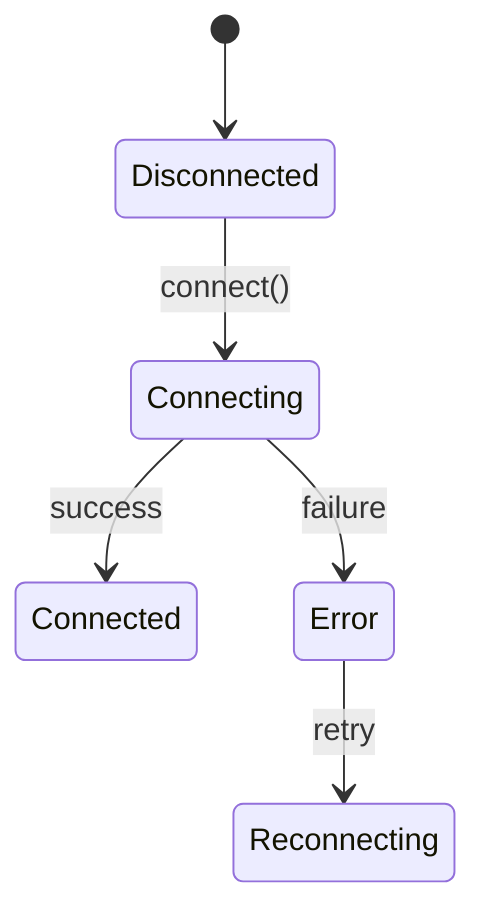

# Requirements (REQ)

## Document Control

| Item | Details |
|------|---------|
| **Template Version** | 3.0 |
| **Last Updated** | 2025-11-19 |
| **Layer** | 7 (Requirements) |
| **Status** | Active |

---

Requirements (REQ) documents capture atomic, testable requirements that serve as the granular specification layer between high-level Product Requirements Documents (PRDs) and implementation. REQs transform business intentions into precise, verifiable statements that drive technical specification and testing.

## Purpose

REQs create the **formal contract** for system behavior by:
- **Atomic Decomposition**: Breaking complex business needs into single, testable requirements
- **Measurable Verification**: Defining acceptance criteria that prove requirement satisfaction
- **Implementation Guidance**: Providing design constraints and validation rules for developers
- **Quality Assurance**: Establishing baselines for testing and compliance verification
- **Traceability Bridge**: Linking business needs to architectural decisions and technical specifications

## REQ in Development Workflow

**⚠️ See [index.md](../index.md#traceability-flow) for the authoritative workflow visualization.**


REQs are the **testable specification layer** that operationalizes business requirements within the complete SDD workflow:

**⚠️ See for the full document flow: [SPEC_DRIVEN_DEVELOPMENT_GUIDE.md](../SPEC_DRIVEN_DEVELOPMENT_GUIDE.md)**

## REQ Document Structure

### Header with Traceability Tags

Comprehensive links establish the requirement's context and relationships:

```markdown
@adr:[ADR-NN](../../ADR/ADR-NN_...md#ADR-NN)
@prd:[PRD-NN](../../PRD/PRD-NN_...md)
@sys:[SYS-NN](../../SYS/SYS-NN_...md)
@ears:[EARS-NN](../../EARS/EARS-NN_...md)
@spec:[SPEC-NN](../../SPEC/.../SPEC-NN_...yaml)
@bdd:[BDD-NN.SS:scenarios](../../BDD/BDD-NN_{suite}/BDD-NN.SS_{slug}.feature#scenarios)
```

### Description
Concise requirement statement using modal SHALL language:

```markdown
### Description
The system SHALL [precise, atomic requirement statement that defines one specific behavior].
```

### Acceptance Criteria
Measurable validation rules that prove requirement satisfaction:

```markdown
### Acceptance Criteria
- [Specific, quantifiable condition 1 that validates the requirement]
- [Specific, quantifiable condition 2 that validates the requirement]
- [Specific, quantifiable condition N that validates the requirement]
```

### Related ADRs
Architecture decisions that implement or impact this requirement:

```markdown
### Related ADRs
- [ADR-NN](../../ADR/ADR-NN_...md#ADR-NN): [Architectural approach implemented]
- [ADR-NN](../../ADR/ADR-NN_...md#ADR-NN): [Alternative approaches considered]
```

### Source Requirements
Links to upstream requirements this REQ implements:

```markdown
### Source Requirements
- See summary and details in [Related Requirements Document](../../path/to/document.md#section-reference)
```

### Verification
How this requirement will be tested and validated:

```markdown
### Verification
- BDD: `BDD/BDD-NN_{suite}/BDD-NN.SS_{slug}.feature#scenarios`
- Spec: [SPEC-NN.yaml](../../SPEC/.../SPEC-NN.yaml)
- [Additional verification methods: performance tests, security tests, etc.]
```

## File Organization Hierarchy

REQ files are organized by functional domains and subdomains:

```
REQ/
├── api/           # API Integration Requirements
│   ├── av/        # [EXTERNAL_DATA_PROVIDER - e.g., Weather API, item Data API] API
│   └── ib/        # [EXTERNAL_SERVICE_GATEWAY] API
├── data/          # Data Management Requirements
├── risk/          # resource management Requirements
│   ├── lim/       # resource Limits
│   ├── mon/       # Risk Monitoring
│   └── hed/       # balancing Requirements
└── perf/          # Performance Requirements
```

## File Naming Convention

```
REQ/{domain}/{subdomain}/REQ-NN_descriptive_title.md
```

Where:
- `REQ/` is the base requirements directory
- `{domain}` is functional area (`api`, `risk`, `data`, `ui`, etc.)
- `{subdomain}` is specific sub-area (`av`, `ib`, `lim`, `mon`, etc.)
- `REQ` is the constant prefix
- `NNN` is the 2+ digit sequence number (01, 02, 003, etc.)
- `descriptive_title` uses snake_case describing the requirement

**Examples:**
- `REQ/api/av/REQ-01_external_api_integration.md`
- `REQ/risk/lim/REQ-03_resource_limit_enforcement.md`
- `REQ/data/proc/REQ-045_real_time_data_processing.md`

## Requirement Statement Quality

### Atomic Principle (One Responsibility)
Each REQ documents exactly one requirement - never multiple behaviors.

**Good:**
```markdown
### Description
The system SHALL validate input parameters against defined schemas.
```

**Poor (violates atomic principle):**
```markdown
### Description
The system SHALL validate input parameters against defined schemas and log validation failures and return appropriate error responses.
```
<!-- Split into separate REQs -->

### Measurable Validation
Every requirement must be testable with clear true/false outcomes.

**Good Acceptance Criteria:**
```markdown
### Acceptance Criteria
- Input validation fails for values outside allowed ranges
- Validation errors include specific field names and violation reasons
- Schema validation completes within 50ms under normal load
```

**Poor Acceptance Criteria:**
```markdown
### Acceptance Criteria
- Input is validated properly
- The system works as expected
- Performance is acceptable
```

### Modal SHALL Language
Use precise modal verbs to indicate requirement strength:

- **SHALL/SHALL NOT**: Absolute requirement (must be satisfied)
- **SHOULD/SHOULD NOT**: Preferred approach (strong recommendation)
- **MAY**: Optional behavior (permitted but not required)

### Context Independence
Requirements should be understandable without external context.

**Good (self-contained):**
```markdown
### Description
The authentication service SHALL reject login attempts after three consecutive failures for the same user account within a five-minute window.
```

**Poor (context-dependent):**
```markdown
### Description
The system SHALL handle the edge case.
```

## Acceptance Criteria Patterns

### Functional Requirements
```markdown
### Acceptance Criteria
- [Functionality] succeeds when [valid inputs] are provided
- [Functionality] fails gracefully when [invalid inputs] are provided
- [Output format] matches [specified schema] exactly
- [Error conditions] result in [specific response codes and messages]
```

### Performance Requirements
```markdown
### Acceptance Criteria
- [Operation] completes within [X milliseconds] for 95th percentile
- [Resource usage] does not exceed [Y units] under peak load
- [Throughput] maintains [Z operations/second] during stress testing
```

### security Requirements
```markdown
### Acceptance Criteria
- [Authentication] requires valid [credential type] for access
- [Data] is encrypted using [algorithm] during [transmission/storage]
- [Access control] enforces [role-based permissions] correctly
```

### Integration Requirements
```markdown
### Acceptance Criteria
- [System interface] accepts and processes [expected message format]
- [Data synchronization] completes within [time window] with [accuracy level]
- [Error scenarios] trigger appropriate [compensation actions]
```

## Requirement Refinement Process

### From PRD to REQ
1. **Analyze PRD**: Break down functional requirements into atomic behaviors
2. **Identify Actors**: Determine system components and user roles
3. **Define Interfaces**: Specify inputs, outputs, and interaction points
4. **Set Constraints**: Include performance, security, and operational limits
5. **Create Testable Criteria**: Write acceptance criteria that prove satisfaction

### REQ Evolution
```markdown
Initial Draft → Acceptance Criteria Added → ADR Reference Added → Verification Linked → Production Ready

Basic Description → Acceptance Criteria → Constraints & Boundaries → Error Handling → Performance Targets
```

## Cross-Reference Linking

### Upstream Traceability
Requirements must link to their source business logic:

```markdown
### Source Requirements
- PRD: [PRD-NN](../../PRD/PRD-NN_...md): [section reference]
- SRS: [SYS-NN](../../SYS/SYS-NN_...md): [section reference]
- Business Rules: [Document](../../path/document.md#section)
```

### Downstream Dependencies
Track implementation artifacts that realize the requirement:

```markdown
### Verification
- ADR: [ADR-NN](../ADR/ADR-NN_...md#ADR-NN) - [Implementation approach]
- BDD: `BDD/BDD-NN_{suite}/BDD-NN.SS_{slug}.feature#scenario-1`
- Spec: [SPEC-NN.yaml](../../SPEC/.../SPEC-NN.yaml)
- Code Module: `component.module.function()`
```

## Quality Gates

**Every REQ must:**
- Reference upstream PRD or SRS as source requirement
- Express exactly one atomic requirement using SHALL language
- Include measurable acceptance criteria with specific validation conditions
- Link to relevant ADR(s) that address the requirement
- Define verification methods (BDD scenarios, specifications, tests)
- Maintain traceability to downstream implementation artifacts

**REQ validation checklist:**
- ✅ Description uses precise SHALL/SHOULD/MAY language
- ✅ Acceptance criteria are quantitative and testable
- ✅ No compound requirements (single responsibility principle)
- ✅ Cross-reference links are functional and point to valid artifacts
- ✅ No implementation details (focus on what, not how)
- ✅ Requirement is independently verifiable

## REQ Writing Guidelines

### 1. Be Concrete and Specific
Avoid abstract or vague language that allows multiple interpretations:

**Good:**
```markdown
The API SHALL return HTTP 401 status code for requests lacking valid authentication credentials.
```

**Poor:**
```markdown
The API SHALL handle authentication properly.
```

### 2. Include Error and Edge Cases
Requirements should explicitly address failure modes:

**Good:**
```markdown
The validation service SHALL reject malformed JSON input with a descriptive error message and HTTP 400 status code.
```

### 3. Use Consistent Terminology
Establish domain-specific terms and use them consistently across related REQs.

### 4. Include Performance Characteristics
Where performance matters, specify quantitative requirements:

```markdown
### Acceptance Criteria
- Response time is less than 200ms for 95th percentile of requests
- Concurrent requests are handled without resource exhaustion up to 1000 RPS
```

### 5. Enable Independent Testing
Write acceptance criteria that can be tested without human interpretation:

```markdown
### Acceptance Criteria
- Purple button background is RGB(128, 0, 128) with 100% opacity
- NOT: Purple button looks correct  (subjective interpretation)
```

## Common REQ Patterns

### Data Validation Requirements
```markdown
## REQ-NN: Input Data Validation

### Description
The [component] SHALL validate all input data against the defined schema and reject invalid requests with appropriate error responses.

### Acceptance Criteria
- Schema validation occurs before any business logic processing
- Invalid inputs result in HTTP 400 responses with detailed error messages
- Required fields missing trigger FIELD_REQUIRED error codes
- Type mismatches produce TYPE_MISMATCH error codes
- Schema validation completes within 100ms
```

### Authentication Requirements
```markdown
## REQ-NN: User Authentication

### Description
The system SHALL authenticate users using [method] before granting access to protected resources.

### Acceptance Criteria
- Valid credentials result in successful authentication and session creation
- Invalid credentials fail with UNAUTHORIZED response
- Account lockout occurs after 5 consecutive failures within 15 minutes
- Sessions expire after 30 minutes of inactivity
```

### Error Handling Requirements
```markdown
## REQ-NN: Error Response Standardization

### Description
The API SHALL return consistent error responses following the defined error schema for all failure conditions.

### Acceptance Criteria
- All errors include error.code, error.message, and error.timestamp fields
- Error codes are unique identifiers from the predefined list
- Correlation IDs are included when provided in the original request
- Error responses maintain HTTP status code conventions
```

## REQ Lifecycle Management

### Draft Status
Initial creation with basic description while design is evolving.

### Accepted Status
Stable requirement approved for implementation.

### Superseded Status
Requirement replaced by new REQ-NN (with reference link).

### Retired Status
No longer relevant, archived for historical reference.

### Implementation Tracking
- Track REQ status through development phases
- Update verification links as BDD scenarios and SPEC are created
- Mark completed when all acceptance criteria are satisfied
- Maintain audit trail of changes and rationales

## Integration with Development Workflow

### During Definition
- Use REQs to drive BDD scenario creation
- Reference REQs in ADR evaluations as requirements satisfied
- Link REQs to specification development

### During Implementation
- Verify each code change contributes to at least one REQ acceptance criterion
- Use REQ acceptance criteria to validate unit test completeness
- Reference REQs in code comments and documentation

### During Testing
- Map test cases directly to REQ acceptance criteria
- Test REQs independently and in combination
- Verify all REQs have corresponding executable tests

### During Review
- Ensure PR descriptions reference satisfied REQs
- Validate that changes don't violate existing REQ contracts
- Confirm new functionality includes corresponding new REQs

## Benefits of Atomic Requirements

1. **Clarity**: Single focus eliminates requirement interpretation disputes
2. **Testability**: Clear criteria enable precise verification planning
3. **Traceability**: Enables tracking from requirement through implementation and testing
4. **Modularity**: Changes to one REQ minimally impact others
5. **Progress Tracking**: Binary completion status for each requirement

## Avoiding Common Pitfalls

1. **Compound Requirements**: "System SHALL handle authentication AND authorization AND logging"
   - Solution: Split into separate REQs with individual acceptance criteria

2. **Implementation Details**: "System SHALL use PostgreSQL database with connection pooling"
   - Solution: Use "SHALL persist data durably with ACID properties" (implementation agnostic)

3. **Vague Acceptance**: "System SHALL perform well under load"
   - Solution: "System SHALL maintain 95th percentile response time under 200ms with 1000 concurrent users"

4. **Untestable Requirements**: "System SHALL be user-friendly"
   - Solution: "System SHALL provide accessible form labels for all input fields"

5. **Missing Error Cases**: Defining success paths without failure handling
   - Solution: Include explicit error conditions and expected behaviors

## Tools and Automation

### REQ Validation Scripts
```bash
# Validate REQ format and links
python validate_reqs.py --directory REQ/

# Check acceptance criteria completeness
python check_req_quality.py --req-file REQ/api/av/REQ-01_*.md

# Generate traceability matrices
python generate_req_matrix.py --domain api --format html
```

### Test Mapping Tools
```python
def test_req_coverage():
    """Ensure all REQs have corresponding tests"""
    reqs = load_all_reqs()
    tests = load_all_tests()
    for req in reqs:
        assert req.id in tests.coverage_map, f"Missing test for {req.id}"
```

## Example REQ Template

See `REQ/api/av/REQ-01_external_api_integration.md` for a complete example of a well-structured requirement document that follows these conventions and includes proper traceability and acceptance criteria.

---

## REQ Template Versions

### Current Templates

| Version | File | Status | Lines | Notes |
|---------|------|--------|-------|-------|
| **V3.0** | [REQ-TEMPLATE.md](REQ-TEMPLATE.md) | **✅ CURRENT** | 1274 | Enhanced with REST API, DB schema, Circuit Breaker, DI setup, Layer 7, absolute paths |
| V2.0 | [archived/REQ-TEMPLATE-V2-ARCHIVED.md](archived/REQ-TEMPLATE-V2-ARCHIVED.md) | 📦 ARCHIVED | 930 | Legacy V2 template (archived 2025-11-19) |
| V1.0 | [archived/REQ-TEMPLATE-V1-ARCHIVED.md](archived/REQ-TEMPLATE-V1-ARCHIVED.md) | 📦 DEPRECATED | 30-48 | Basic requirements only |

### Template Evolution

**V3.0 Enhancements** (November 2025):
- **Template Version field**: Required in Document Control (must be `3.0`)
- **Layer 7**: Corrected layer numbering (was Layer 4 in V2)
- **Absolute paths**: All cross-references use project root paths (`../../` not `../`)
- **Priority format**: Requires P-level designation (e.g., `High (P2)`)
- **SPEC-Ready Score**: Requires ✅ emoji (e.g., `✅ 95% (Target: ≥90%)`)
- **section 3.3**: REST API Endpoints table with rate limits
- **section 4.3**: Database schema (SQLAlchemy + Alembic migrations)
- **section 5.4**: Circuit breaker configuration dataclass
- **section 8.3**: Dependency injection container setup
- **Document Control**: 12 fields (added Template Version)
- **Resource tags**: Required in H1 header `[RESOURCE_TYPE]`
- **Cumulative tagging**: All 6 upstream tags required (@brd, @prd, @ears, @bdd, @adr, @sys)
- **18-check validation**: Shell-based script (validate_req_template_v3.sh)

**V2.0 Features** (January 2025):
- 12 mandatory sections
- SPEC-ready principle (≥90% completeness)
- Protocol/ABC interfaces
- Triple schema approach (JSON Schema + Pydantic + SQLAlchemy)
- Exception catalogs with recovery strategies
- State machine diagrams
- Performance targets (p50/p95/p99)

### Migration Guide

**V1 → V2**: Not recommended, recreate from scratch using V2 template

**V2 → V3**: Additive migration (existing V2 files remain valid)
1. Add Template Version field to Document Control (set to `3.0`)
2. Update layer references: `Layer 4` → `Layer 7`
3. Update all paths from relative (`../`) to absolute (`../../`)
4. Update Priority format: add P-level (e.g., `High` → `High (P2)`)
5. Update SPEC-Ready Score: add ✅ emoji (e.g., `95%` → `✅ 95% (Target: ≥90%)`)
6. Add Source Document section reference (e.g., `SYS-02` → `SYS-02 section 3.1.1`)
7. Add resource tag to H1 header (e.g., `# REQ-01: [EXTERNAL_SERVICE_GATEWAY] Title`)
8. Add all 6 cumulative tags to section 11 (@brd, @prd, @ears, @bdd, @adr, @sys)
9. Add new subsections (3.3, 4.3, 5.4, 8.3) as applicable
10. Run `scripts/validate_req_template_v3.sh` for verification

**Migration Script**: `scripts/migrate_req_v2_to_v3.py` automates transformations 1-6

## REQ Template V2/V3: SPEC-Ready Requirements

**Version**: 2.0 / 3.0
**Purpose**: Create SPEC-ready requirements containing ALL information needed for automated SPEC generation

### What Makes a REQ "SPEC-Ready"?

A SPEC-ready REQ contains complete technical specifications that enable automated SPEC generation without additional inputs:

**SPEC-Ready Score**: ≥90% completeness across all required sections

**Required sections** (100% coverage target):
1. ✅ **Interfaces**: Protocol/ABC definitions with type annotations
2. ✅ **Schemas**: JSON Schema + Pydantic models + database models
3. ✅ **Error Handling**: Exception catalog + state machines + recovery strategies
4. ✅ **Configuration**: YAML examples + validation + environment variables
5. ✅ **QAs**: Performance targets (p50/p95/p99) + security + scalability
6. ✅ **Implementation Guidance**: Algorithms + concurrency patterns + dependency injection

### V2 Template Structure

#### section 3: Interface Specifications (NEW)

Define ALL interfaces required for implementation:

```python
from typing import Protocol
from abc import ABC, abstractmethod

class ServiceClient(Protocol):
    """Protocol defining the contract.

    Implementations must provide these methods with exact signatures.
    """

    async def connect(
        self,
        credentials: Credentials,
        timeout: float = 5.0
    ) -> ConnectionResult:
        """Establish connection.

        Args:
            credentials: Authentication credentials
            timeout: Connection timeout in seconds

        Returns:
            ConnectionResult with status, session_id

        Raises:
            ConnectionError: When connection fails after retries
            AuthenticationError: When credentials invalid
        """
        ...
```

**Key Elements**:
- Protocol/ABC class definitions
- Complete method signatures with type annotations
- Docstrings with Args/Returns/Raises
- Data Transfer Objects (DTOs)
- REST API endpoint specifications

#### section 4: Data Schemas (NEW)

Define ALL data structures with validation:

**JSON Schema**:
```json
{
  "$schema": "http://json-schema.org/draft-07/schema#",
  "title": "RequestModel",
  "type": "object",
  "required": ["field1", "field2"],
  "properties": {
    "field1": {
      "type": "string",
      "pattern": "^[A-Z]{1,5}$"
    }
  }
}
```

**Pydantic Models**:
```python
from pydantic import BaseModel, Field, field_validator

class RequestModel(BaseModel):
    field1: str = Field(..., pattern=r"^[A-Z]{1,5}$")

    @field_validator('field1')
    @classmethod
    def validate_field1(cls, v: str) -> str:
        """Ensure field1 is uppercase."""
        if not v.isupper():
            raise ValueError("Must be uppercase")
        return v
```

**Database Schema**:
```python
from sqlalchemy import Column, String, CheckConstraint

class Model(Base):
    __tablename__ = 'table'
    field1 = Column(String(5), nullable=False)
    __table_args__ = (
        CheckConstraint('LENGTH(field1) <= 5'),
    )
```

#### section 5: Error Handling Specifications (NEW)

Define ALL error types and recovery strategies:

**Exception Catalog**:
| Exception Type | HTTP Code | Error Code | Retry? | Recovery Strategy |
|----------------|-----------|------------|--------|-------------------|
| `ConnectionError` | 503 | `CONN_001` | Yes (5x) | Exponential backoff: 1s, 2s, 4s, 8s, 16s |
| `ValidationError` | 400 | `VALID_001` | No | Return field errors to client |

**State Machine** (Mermaid):


> **Note on Diagram Labels**: The above flowchart shows the sequential workflow. For formal layer numbers used in cumulative tagging, always reference the 16-layer architecture (Layers 0-15) defined in README.md. Diagram groupings are for visual clarity only.

**Circuit Breaker Configuration**:
```python
@dataclass
class CircuitBreakerConfig:
    failure_threshold: int = 5
    success_threshold: int = 2
    timeout_seconds: float = 30.0
```

#### section 6: Configuration Specifications (NEW)

Define ALL configuration with concrete examples:

**YAML Configuration**:
```yaml
# config/service.yaml
service:
  connection:
    base_url: "https://api.example.com/v1"
    timeout_seconds: 30.0
    max_connections: 100

  retry:
    enabled: true
    max_attempts: 5
    initial_delay_seconds: 1.0
    backoff_multiplier: 2.0
```

**Environment Variables**:
| Variable | Type | Required | Default | Description |
|----------|------|----------|---------|-------------|
| `SERVICE_URL` | string | Yes | - | Base URL for service |
| `SERVICE_TIMEOUT` | float | No | 30.0 | Timeout in seconds |

**Validation**:
```python
class ServiceConfig(BaseModel):
    base_url: HttpUrl
    timeout_seconds: float = Field(30.0, gt=0, le=300)

    @field_validator('base_url')
    @classmethod
    def validate_https_in_prod(cls, v: HttpUrl) -> HttpUrl:
        if os.getenv('ENV') == 'production':
            if not str(v).startswith('https://'):
                raise ValueError("Production must use HTTPS")
        return v
```

### SPEC-Ready Checklist

Before marking a REQ as complete, verify:

- [ ] **Interfaces**: All methods have type annotations and docstrings
- [ ] **Schemas**: JSON Schema + Pydantic + Database schemas present
- [ ] **Errors**: Exception catalog with recovery strategies defined
- [ ] **Config**: YAML examples with realistic values (no placeholders)
- [ ] **State Machines**: Mermaid diagrams for complex workflows
- [ ] **QAs**: Performance targets specified (p50/p95/p99)
- [ ] **Implementation**: Algorithms and patterns documented
- [ ] **Acceptance Criteria**: Mapped to verification methods
- [ ] **No Placeholders**: All examples use concrete values

### V2 Example Files

**REQ-01: API Integration Example** (`REQ/api/REQ-01_api_integration_example.md`)
- 1372 lines, 95% SPEC-ready
- Complete REST API client with resilience patterns
- Rate limiting, circuit breaker, retry logic
- 18 acceptance criteria with verification methods

**REQ-02: Data Validation Example** (`REQ/data/REQ-02_data_validation_example.md`)
- 345 lines, 95% SPEC-ready
- Multi-layer validation pipeline
- Schema + business rules + database constraints
- Cross-field validation with Pydantic

**REQ-03: Access Control Example** (`REQ/auth/REQ-03_access_control_example.md`)
- 464 lines, 95% SPEC-ready
- RBAC with role hierarchy
- Permission inheritance algorithm
- JWT-based authorization middleware

### Migration from V1 to V2

**No Migration Required**: All existing REQ files will be recreated from scratch using V2 template as needed. V1 files can coexist with V2 files.

**V1 vs V2 Comparison**:

| Aspect | V1 (Old) | V2 (New) |
|--------|----------|----------|
| **Interfaces** | Optional, often missing | Mandatory with type annotations |
| **Schemas** | Placeholder text | JSON Schema + Pydantic + SQL |
| **Error Handling** | Basic descriptions | Exception catalog + state machines |
| **Configuration** | Generic placeholders | Concrete YAML + validation |
| **SPEC Readiness** | 40-70% | 90-95% |
| **Line Count** | 30-48 (sparse) or 260-410 (bloated) | 400-500 (focused) |

### Validation Tools

#### V3 Shell-Based Validator (Recommended)

**Script**: `scripts/validate_req_template_v3.sh` (623 lines, 18 checks)

```bash
# Validate single REQ file
./scripts/validate_req_template_v3.sh REQ/api/REQ-01_api_integration.md

# Expected output (success):
# ✅ PASSED: All validation checks passed with no warnings
# Errors: 0
# Warnings: 0

# Validate all REQ files
find REQ -name "REQ-*.md" ! -path "*/archived/*" -exec ./scripts/validate_req_template_v3.sh {} \;
```

**18 Validation Checks**:
- CHECK 1-3: Required sections, Document Control fields, Traceability structure
- CHECK 4-6: Version format, Date validation, Priority validation
- CHECK 7-11: V2 sections (interfaces, schemas, errors, config, quality attributes)
- CHECK 12-18: V3 enhancements (filename, resource tags, cumulative tagging, link resolution, traceability matrix, SPEC-Ready content)

**Validation Reference**: See [REQ_VALIDATION_RULES.md](REQ_VALIDATION_RULES.md) for detailed fix instructions for each check.

#### Python-Based Validators

**SPEC Readiness Checker** (`scripts/validate_req_spec_readiness.py`):
```bash
# Score REQ files on SPEC-generation readiness
python scripts/validate_req_spec_readiness.py --req-file REQ/api/REQ-01.md

# Output:
# REQ-01: External data service API Integration
# SPEC-Ready Score: 95%
# ✅ Interfaces: Present with type annotations
# ✅ Schemas: JSON Schema + Pydantic + Database
# ✅ Errors: Exception catalog + state machines
# ✅ Config: YAML with validation
# ✅ QAs: Performance targets specified
# ✅ Implementation: Algorithms documented
```

**Requirement ID Validator**:
```bash
# Validate V2/V3 mandatory sections
python scripts/validate_requirement_ids.py --directory REQ/

# Checks:
# - Interface Specifications section present
# - Data Schemas section present
# - Error Handling section present
# - Configuration section present
```

**Link Validator** (`scripts/validate_links.py`):
```bash
# Check for broken links in REQ files
python scripts/validate_links.py --directory REQ/

# Detects:
# - Missing files referenced in links
# - Invalid path formats (spaces, case mismatches)
# - Broken cross-references
# Severity levels: HIGH, MEDIUM, LOW
```

**Traceability Matrix Validator** (`scripts/validate_traceability_matrix.py`):
```bash
# Validate matrix consistency
python scripts/validate_traceability_matrix.py --matrix-file REQ/REQ-000_TRACEABILITY_MATRIX.md

# Verifies:
# - Document counts match actual files
# - Cross-references are valid
# - No orphaned requirements
# - Coverage metrics are accurate
```

#### Additional Tools

**Requirement Anchor Generator** (`scripts/add_requirement_anchors.py`):
```bash
# Auto-generate anchors for requirements
python scripts/add_requirement_anchors.py --req-file REQ/api/REQ-01.md

# Adds HTML anchors for all requirement IDs
```

### Best Practices for V2 REQs

1. **Start with Interfaces**: Define Protocol/ABC before writing description
2. **Use Concrete Examples**: Replace ALL [PLACEHOLDER] with realistic values
3. **Include State Machines**: For any workflow with >3 states
4. **Specify Error Codes**: Use format {CATEGORY}_{NUMBER} (e.g., CONN_001)
5. **Document Algorithms**: Include pseudocode for complex logic
6. **Performance Targets**: Always specify p50/p95/p99 percentiles
7. **Configuration Examples**: Show actual YAML with all parameters
8. **Cross-Reference**: Link to related ADRs, SPECs, BDD scenarios
9. **Validation First**: Write Pydantic validators for all data models
10. **Test Coverage**: Map every acceptance criterion to test method

### Common V2 Patterns

**REST API Client Pattern**: REQ-01
- Connection management, retry, circuit breaker
- Rate limiting with token bucket algorithm
- Caching with TTL strategies

**Data Validation Pattern**: REQ-02
- Multi-layer validation pipeline
- Schema → Business Rules → Database Constraints
- Cross-field validation with Pydantic

**RBAC Pattern**: REQ-03
- Role-permission mappings
- Hierarchical role inheritance
- Authorization middleware with JWT

For detailed examples, see the V2 example files in `REQ/api/`, `REQ/data/`, and `REQ/auth/`.
## File Size Limits

- Target: 300–500 lines per file
- Maximum: 600 lines per file (absolute)
- If a file approaches/exceeds limits, split into section files where appropriate and update indexes or mapping tables.

## Document Splitting Standard

REQ documents are atomic by design; prefer separate REQ files over long monoliths:
- If a REQ grows too large, split it into multiple focused REQ files (by capability/domain)
- Maintain consistent numbering and update any mapping tables or indexes
- Validate all cross-references after splitting; run size lints
