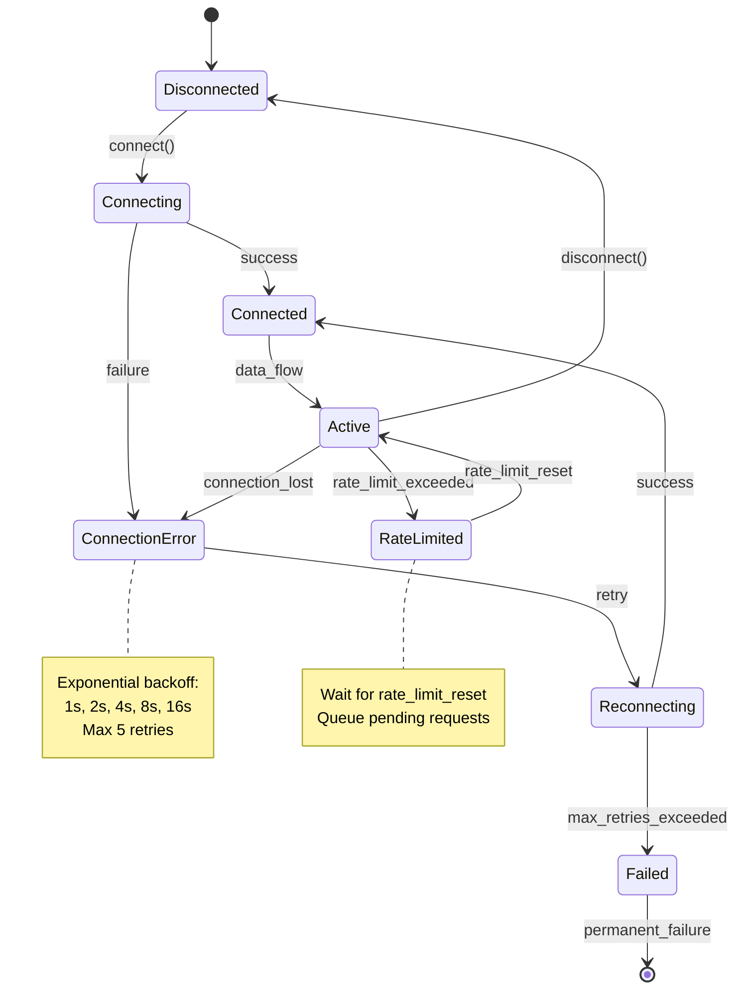
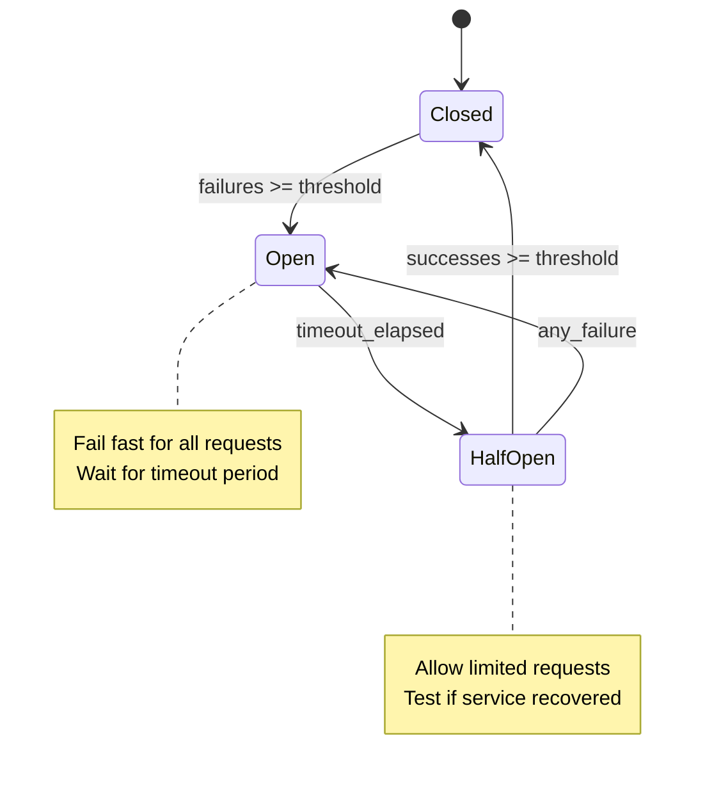

# =============================================================================
# 📋 Document Authority: This is the PRIMARY STANDARD for REQ structure.
# All other documents (Schema, Creation Rules, Validation Rules) DERIVE from this template.
# - In case of conflict, this template is the single source of truth
# - Schema: REQ_SCHEMA.yaml - Machine-readable validation (derivative)
# - Creation Rules: REQ_CREATION_RULES.md - AI guidance for document creation (derivative)
# - Validation Rules: REQ_VALIDATION_RULES.md - AI checklist after document creation (derivative)
#   NOTE: VALIDATION_RULES includes all CREATION_RULES and may be extended for validation
# =============================================================================
---
title: "REQ-TEMPLATE: Atomic Requirements Document"
tags:
  - req-template
  - layer-7-artifact
  - shared-architecture
  - document-template
custom_fields:
  document_type: template
  artifact_type: REQ
  layer: 7
  architecture_approaches: [ai-agent-based, traditional-8layer]
  priority: shared
  development_status: active
  template_for: atomic-requirements-document
  schema_reference: "REQ_SCHEMA.yaml"
  schema_version: "1.0"
---

> **📋 Document Authority**: This is the **PRIMARY STANDARD** for REQ structure.
> - **Schema**: `REQ_SCHEMA.yaml v1.0` - Validation rules
> - **Creation Rules**: `REQ_CREATION_RULES.md` - Usage guidance
> - **Validation Rules**: `REQ_VALIDATION_RULES.md` - Post-creation checks

# REQ-NN: [Descriptive Requirement Title]

## Position in Document Workflow

**⚠️ CRITICAL**: Always reference [SPEC_DRIVEN_DEVELOPMENT_GUIDE.md](../../../docs_flow_framework/ai_dev_flow/SPEC_DRIVEN_DEVELOPMENT_GUIDE.md) as the single source of truth for workflow steps, artifact definitions, and quality gates.

**REQ (Atomic Requirements)** ← YOU ARE HERE (Layer 7 - Requirements Layer)

For the complete traceability workflow with visual diagram, see: [index.md - Traceability Flow](../../../docs_flow_framework/ai_dev_flow/index.md#traceability-flow)

**Quick Reference**:

```
BRD (Business Requirements Document): High-level business needs
        ↓
PRD (Product Requirements Document): User needs and features
        ↓
EARS (Easy Approach to Requirements Syntax): Atomic, measurable requirements
        ↓
BDD (Behavior-Driven Development): Acceptance scenarios
        ↓
ADR (Architecture Decisions): Technical architecture choices
        ↓
SYS (System Requirements): Technical interpretation of business requirements
        ↓
REQ (Atomic Requirements)
        ↓
SPEC (Technical Implementation)
        ↓
TASKS (Implementation Plans)
        ↓
Code (src/{module_name}/) ← AI generates Python
        ↓
Tests (tests/{suit_name}) ← AI generates test suites
        ↓
Validation ← AI runs BDD tests
        ↓
Human Review ← HUMAN reviews architecture only
        ↓
Production-Ready Code
```

```
... → SYS → **REQ** → IMPL → CTR/SPEC → TASKS → Code → ...
                ↑
        Requirements Layer
        (Granular, testable, SPEC-ready requirements)
```

**REQ Purpose**: Define atomic, implementable, SPEC-ready requirements
- **Input**: BRD, PRD, SYS, EARS (upstream business/system requirements)
- **Output**: Complete specifications including interfaces, schemas, error handling, and configuration
- **Consumer**: SPEC uses REQ for automated technical specification generation
- **SPEC-Ready Principle**: REQ must contain ALL information needed for SPEC generation without additional inputs

---

## Document Control

| Item | Details |
|------|---------|
| **Status** | Draft/Review/Approved/Implemented/Verified/Retired |
| **Version** | [Semantic version, e.g., 1.0.0] |
| **Date Created** | YYYY-MM-DD |
| **Last Updated** | YYYY-MM-DD |
| **Author** | [Author name and role] |
| **Priority** | Critical (P1) / High (P2) / Medium (P3) / Low (P4) |
| **Category** | Functional/Security/Performance/Reliability/Scalability |
| **Source Document** | [PRD-NN, SYS-NN, or EARS-NN reference with section] |
| **Verification Method** | BDD/Spec/Unit Test/Integration Test/Contract Test |
| **Assigned Team** | [Team/Person responsible] |
| **SPEC-Ready Score** | ✅ XX% (Target: ≥90%) |
| **IMPL-Ready Score** | ✅ 95% (Target: ≥90%) |
| **Template Version** | 3.0 |

---

> **⚠️ UPSTREAM ARTIFACT REQUIREMENT**: Before completing traceability tags:
> 1. **Check existing artifacts**: List what upstream documents actually exist in `docs/`
> 2. **Reference only existing documents**: Use actual document IDs, not placeholders
> 3. **Use `null` appropriately**: Only when upstream artifact type genuinely doesn't exist for this feature
> 4. **Do NOT create phantom references**: Never reference documents that don't exist
> 5. **Do NOT create missing upstream artifacts**: If upstream artifacts are missing, skip that functionality. Only create functionality for existing upstream artifacts.


## 1. Description

[The system/component] SHALL/SHOULD/MAY [precise, atomic requirement statement that defines exactly one specific behavior or constraint].

[Additional context explaining why this requirement exists and what problem it solves. Include business justification and importance.]

### 1.1 Context

[What makes this requirement necessary and how it fits into the larger system capabilities]

### 1.2 Use Case Scenario

**Primary Flow**:
1. User/System initiates [action/trigger event]
2. System validates [input/precondition]
3. System executes [core behavior]
4. System returns [expected outcome]

**Alternative Flows**:
- **Error Path**: When [error condition], system SHALL [error handling behavior]
- **Edge Case**: When [boundary condition], system SHALL [boundary handling]

---

## 2. Functional Requirements

### 2.1 Primary Functionality

[Detailed description of the core functional behavior this requirement implements]

**Required Capabilities**:
- Capability 1: [Specific functional capability with measurable outcome]
- Capability 2: [Specific functional capability with measurable outcome]
- Capability 3: [Specific functional capability with measurable outcome]

### 2.2 Business Rules

[Specific business logic that governs this requirement's behavior]

**Rules**:
1. **Rule Name**: IF [Condition] THEN [Action/Outcome]
2. **Rule Name**: IF [Condition] THEN [Action/Outcome]

---

## 3. Interface Specifications

**Purpose**: Define ALL interfaces, method signatures, and contracts required for implementation.

### 3.1 Protocol/Abstract Base Class Definition

```python
from typing import Protocol, TypeVar, Generic
from abc import ABC, abstractmethod
from dataclasses import dataclass

class ExternalAPIClient(Protocol):
    """Protocol defining the contract for external API integration.

    Implementations must provide these methods with exact signatures.
    """

    async def connect(
        self,
        credentials: APICredentials,
        timeout: float = 5.0
    ) -> ConnectionResult:
        """Establish connection to external API.

        Args:
            credentials: Authentication credentials (API key, OAuth token, etc.)
            timeout: Connection timeout in seconds

        Returns:
            ConnectionResult with status, session_id, and metadata

        Raises:
            ConnectionError: When connection fails after retries
            AuthenticationError: When credentials are invalid
            TimeoutError: When connection exceeds timeout
        """
        ...

    async def fetch_data(
        self,
        request: DataRequest,
        retry_config: RetryConfig | None = None
    ) -> DataResponse:
        """Fetch data from external API endpoint.

        Args:
            request: Request parameters with endpoint, query params, headers
            retry_config: Optional retry configuration (uses default if None)

        Returns:
            DataResponse with status_code, data payload, headers, metadata

        Raises:
            RateLimitExceeded: When API rate limit is hit
            ValidationError: When request parameters are invalid
            APIError: When API returns error response
        """
        ...

    async def disconnect(self) -> DisconnectionResult:
        """Gracefully disconnect from external API.

        Returns:
            DisconnectionResult with cleanup status
        """
        ...
```

### 3.2 Data Transfer Objects (DTOs)

```python
from dataclasses import dataclass
from datetime import datetime
from enum import Enum

@dataclass(frozen=True)
class APICredentials:
    """Credentials for API authentication."""
    api_key: str
    secret_key: str | None = None
    auth_type: str = "api_key"  # api_key, oauth2, certificate

@dataclass
class DataRequest:
    """Request structure for API data fetching."""
    endpoint: str
    method: str = "GET"  # GET, POST, PUT, DELETE
    query_params: dict[str, str | int | float] | None = None
    headers: dict[str, str] | None = None
    body: dict | None = None
    timeout: float = 30.0

@dataclass
class DataResponse:
    """Response structure from API."""
    status_code: int
    data: dict | list | None
    headers: dict[str, str]
    timestamp: datetime
    request_id: str
    rate_limit_remaining: int | None = None
```

### 3.3 REST API Endpoints (if applicable)

**Base URL**: `https://api.example.com/v1`

| Endpoint | Method | Request Schema | Response Schema | Rate Limit | Description |
|----------|--------|----------------|-----------------|------------|-------------|
| `/data/quotes` | GET | `QuoteRequest` | `QuoteResponse` | 100/min | Retrieve real-time quotes |
| `/data/historical` | GET | `HistoricalRequest` | `HistoricalResponse` | 75/min | Fetch historical data |
| `/orders/create` | POST | `OrderRequest` | `OrderResponse` | 50/min | Create new order |

**Endpoint Details**:

```python
# GET /data/quotes
@dataclass
class QuoteRequest:
    symbol: str  # item identifier (e.g., "ITEM-001")
    fields: list[str] | None = None  # Optional fields to include

@dataclass
class QuoteResponse:
    symbol: str
    price: float
    timestamp: datetime
    bid: float | None
    ask: float | None
    volume: int | None
```

---

## 4. Data Schemas

**Purpose**: Define ALL data structures, validation rules, and schemas using standard formats.

### 4.1 JSON Schema Definitions

```json
{
  "$schema": "http://json-schema.org/draft-07/schema#",
  "title": "QuoteResponse",
  "type": "object",
  "required": ["symbol", "price", "timestamp"],
  "properties": {
    "symbol": {
      "type": "string",
      "pattern": "^[A-Z]{1,5}$",
      "description": "item resource identifier (1-5 uppercase letters)"
    },
    "price": {
      "type": "number",
      "minimum": 0.01,
      "multipleOf": 0.01,
      "description": "Current price in USD"
    },
    "timestamp": {
      "type": "string",
      "format": "date-time",
      "description": "ISO 8601 timestamp of quote"
    },
    "bid": {
      "type": "number",
      "minimum": 0
    },
    "ask": {
      "type": "number",
      "minimum": 0
    },
    "volume": {
      "type": "integer",
      "minimum": 0
    }
  },
  "additionalProperties": false
}
```

### 4.2 Pydantic Models with Validators

```python
from pydantic import BaseModel, Field, field_validator, model_validator
from datetime import datetime
from typing import Literal

class ItemPricing(BaseModel):
    """Generic item pricing model with field-level validation."""

    item_id: str = Field(
        ...,
        min_length=1,
        max_length=32,
        pattern=r"^[A-Z0-9_-]{1,32}$",
        description="Item identifier"
    )
    unit_price: float = Field(
        ...,
        gt=0,
        decimal_places=2,
        description="Current unit price"
    )
    timestamp: datetime
    min_price: float | None = Field(None, ge=0)
    max_price: float | None = Field(None, ge=0)
    units_in_stock: int | None = Field(None, ge=0)

    @field_validator('unit_price', 'min_price', 'max_price')
    @classmethod
    def validate_price_precision(cls, v: float) -> float:
        """Ensure prices have maximum 2 decimal places."""
        if v is not None and round(v, 2) != v:
            raise ValueError(f"Price must have max 2 decimal places, got {v}")
        return v

    @model_validator(mode='after')
    def validate_price_bounds(self) -> 'ItemPricing':
        """Ensure min_price <= unit_price <= max_price when bounds are present."""
        if self.min_price is not None and self.max_price is not None:
            if not (self.min_price <= self.unit_price <= self.max_price):
                raise ValueError(
                    f"Invalid price bounds: min={self.min_price}, unit={self.unit_price}, max={self.max_price}"
                )
        return self

    class Config:
        frozen = True  # Immutable after creation
        json_schema_extra = {
            "examples": [
                {
                    "item_id": "ITEM-001",
                    "unit_price": 49.99,
                    "timestamp": "2025-01-15T14:30:00Z",
                    "min_price": 39.99,
                    "max_price": 59.99,
                    "units_in_stock": 250
                }
            ]
        }
```

### 4.3 Database Schema (if applicable)

```python
# SQLAlchemy Model
from sqlalchemy import Column, Integer, String, Float, DateTime, CheckConstraint, Index
from sqlalchemy.ext.declarative import declarative_base
from datetime import datetime

Base = declarative_base()

class ItemPrice(Base):
    """Generic pricing model with database constraints."""
    __tablename__ = 'item_prices'

    id = Column(Integer, primary_key=True, autoincrement=True)
    item_id = Column(String(32), nullable=False, index=True)
    unit_price = Column(Float, nullable=False)
    timestamp = Column(DateTime, nullable=False, index=True)
    min_price = Column(Float, nullable=True)
    max_price = Column(Float, nullable=True)
    units_in_stock = Column(Integer, nullable=True)
    created_at = Column(DateTime, default=datetime.utcnow, nullable=False)

    __table_args__ = (
        CheckConstraint('unit_price > 0', name='check_unit_price_positive'),
        CheckConstraint('min_price >= 0', name='check_min_price_non_negative'),
        CheckConstraint('max_price >= 0', name='check_max_price_non_negative'),
        CheckConstraint('units_in_stock >= 0', name='check_units_in_stock_non_negative'),
        Index('idx_item_id_timestamp', 'item_id', 'timestamp'),
    )
```

**Migration Script** (Alembic):

```python
# migrations/versions/001_create_item_prices_table.py
def upgrade():
    op.create_table(
        'item_prices',
        sa.Column('id', sa.Integer(), primary_key=True, autoincrement=True),
        sa.Column('item_id', sa.String(32), nullable=False, index=True),
        sa.Column('unit_price', sa.Float(), nullable=False),
        sa.Column('timestamp', sa.DateTime(), nullable=False, index=True),
        sa.Column('min_price', sa.Float(), nullable=True),
        sa.Column('max_price', sa.Float(), nullable=True),
        sa.Column('units_in_stock', sa.Integer(), nullable=True),
        sa.Column('created_at', sa.DateTime(), default=datetime.utcnow, nullable=False),
        sa.CheckConstraint('unit_price > 0', name='check_unit_price_positive'),
        sa.CheckConstraint('min_price >= 0', name='check_min_price_non_negative'),
        sa.CheckConstraint('max_price >= 0', name='check_max_price_non_negative'),
        sa.CheckConstraint('units_in_stock >= 0', name='check_units_in_stock_non_negative'),
    )
    op.create_index('idx_item_id_timestamp', 'item_prices', ['item_id', 'timestamp'])

def downgrade():
    op.drop_index('idx_item_id_timestamp', 'item_prices')
    op.drop_table('item_prices')
```

---

## 5. Error Handling Specifications

**Purpose**: Define ALL error types, recovery strategies, and state transitions.

### 5.1 Exception Catalog

| Exception Type | HTTP Code | Error Code | Retry? | Recovery Strategy |
|----------------|-----------|------------|--------|-------------------|
| `ConnectionError` | 503 | `CONN_001` | Yes | Exponential backoff, max 5 retries |
| `AuthenticationError` | 401 | `AUTH_001` | No | Refresh credentials, alert admin |
| `RateLimitExceeded` | 429 | `RATE_001` | Yes | Wait for rate limit reset, queue request |
| `ValidationError` | 400 | `VALID_001` | No | Log error, return to caller |
| `APIError` | 5xx | `API_001` | Yes | Retry with backoff, fallback to cache |
| `TimeoutError` | 504 | `TIMEOUT_001` | Yes | Retry with increased timeout |

### 5.2 Error Response Schema

```python
from typing import Literal
from pydantic import BaseModel
from datetime import datetime

class ErrorResponse(BaseModel):
    """Standardized error response structure."""

    error_code: str  # Format: {CATEGORY}_{NUMBER} (e.g., CONN_001)
    error_message: str
    error_type: Literal[
        "ConnectionError",
        "AuthenticationError",
        "RateLimitExceeded",
        "ValidationError",
        "APIError",
        "TimeoutError"
    ]
    timestamp: datetime
    request_id: str
    retry_after: int | None = None  # seconds until retry allowed
    details: dict | None = None  # Additional error context

    class Config:
        json_schema_extra = {
            "examples": [
                {
                    "error_code": "RATE_001",
                    "error_message": "Rate limit exceeded: 100 requests per minute",
                    "error_type": "RateLimitExceeded",
                    "timestamp": "2025-01-15T14:30:00Z",
                    "request_id": "req_abc123",
                    "retry_after": 45,
                    "details": {
                        "limit": 100,
                        "window": "1 minute",
                        "current_count": 105
                    }
                }
            ]
        }
```

### 5.3 State Machine Diagram

**Connection Lifecycle State Machine**:



> **Note on Diagram Labels**: The above flowchart shows the sequential workflow. For formal layer numbers used in cumulative tagging, always reference the 16-layer architecture (Layers 0-15) defined in SPEC_DRIVEN_DEVELOPMENT_GUIDE.md. Diagram groupings are for visual clarity only.

### 5.4 Circuit Breaker Configuration

```python
from dataclasses import dataclass

@dataclass
class CircuitBreakerConfig:
    """Circuit breaker thresholds and behavior."""

    failure_threshold: int = 5  # Open circuit after N failures
    success_threshold: int = 2  # Close circuit after N successes
    timeout: float = 30.0  # seconds circuit stays open
    half_open_max_calls: int = 1  # Calls allowed in half-open state
    excluded_exceptions: tuple = (ValidationError,)  # Don't count these

    def __post_init__(self):
        """Validate configuration parameters."""
        if self.failure_threshold < 1:
            raise ValueError("failure_threshold must be >= 1")
        if self.success_threshold < 1:
            raise ValueError("success_threshold must be >= 1")
        if self.timeout <= 0:
            raise ValueError("timeout must be > 0")
```

**Circuit Breaker State Transitions**:



---

## 6. Configuration Specifications

**Purpose**: Define ALL configuration parameters with concrete examples and validation rules.

### 6.1 Configuration Schema (YAML)

```yaml
# config/api_client.yaml
api_client:
  # Connection settings
  connection:
    base_url: "https://api.example.com/v1"
    timeout_seconds: 30.0
    max_connections: 100
    keepalive_seconds: 60

  # Authentication
  authentication:
    type: "api_key"  # api_key | oauth2 | certificate
    credentials_source: "google_secret_manager"  # google_secret_manager | env_vars | file
    secret_name: "api_credentials_prod"
    refresh_interval_hours: 24

  # Rate limiting
  rate_limits:
    tier: "premium"  # free | premium | enterprise
    requests_per_minute: 75
    burst_allowance: 10  # Extra requests allowed in burst
    throttle_strategy: "queue"  # queue | reject | wait

  # Retry policy
  retry:
    enabled: true
    max_attempts: 5
    initial_delay_seconds: 1.0
    max_delay_seconds: 60.0
    backoff_multiplier: 2.0
    retryable_status_codes: [429, 500, 502, 503, 504]

  # Circuit breaker
  circuit_breaker:
    enabled: true
    failure_threshold: 5
    success_threshold: 2
    timeout_seconds: 30.0
    half_open_max_calls: 1

  # Caching
  cache:
    enabled: true
    backend: "redis"  # redis | memcached | memory
    ttl_seconds:
      quotes: 30
      historical: 3600
      metadata: 86400
    max_size_mb: 512

  # Monitoring
  monitoring:
    metrics_enabled: true
    logging_level: "INFO"  # DEBUG | INFO | WARNING | ERROR
    trace_sampling_rate: 0.1  # 10% of requests
    alert_on_errors: true
    error_threshold_percent: 5.0
```

### 6.2 Environment Variables

| Variable | Type | Required | Default | Description | Validation |
|----------|------|----------|---------|-------------|------------|
| `API_BASE_URL` | string | Yes | - | Base URL for API | Must start with https:// in production |
| `API_TIMEOUT` | float | No | 30.0 | Request timeout in seconds | 0 < value <= 300 |
| `API_RATE_LIMIT` | int | No | 75 | Requests per minute | 1 <= value <= 10000 |
| `API_RETRY_ENABLED` | bool | No | true | Enable retry logic | true or false |
| `API_CACHE_TTL` | int | No | 3600 | Cache TTL in seconds | value >= 0 |
| `API_SECRET_NAME` | string | Yes | - | Secret Manager Secret name | Non-empty string |

### 6.3 Configuration Validation

```python
from pydantic import BaseModel, Field, field_validator
import os

class APIClientConfig(BaseModel):
    """Validated configuration for API client."""

    base_url: str = Field(..., pattern=r'^https?://[^\s]+$')
    timeout_seconds: float = Field(30.0, gt=0, le=300)
    max_connections: int = Field(100, ge=1, le=1000)
    requests_per_minute: int = Field(75, ge=1, le=10000)
    max_retry_attempts: int = Field(5, ge=0, le=10)

    @field_validator('base_url')
    @classmethod
    def validate_https_in_production(cls, v: str) -> str:
        """Ensure HTTPS in production environments."""
        if os.getenv('ENV') == 'production' and not v.startswith('https://'):
            raise ValueError("Production must use HTTPS")
        return v

    @field_validator('timeout_seconds')
    @classmethod
    def validate_reasonable_timeout(cls, v: float) -> float:
        """Ensure timeout is reasonable for production use."""
        if v < 1.0:
            raise ValueError("Timeout too low for production (min 1.0s)")
        if v > 120.0:
            import warnings
            warnings.warn(f"Timeout {v}s is unusually high (>120s)")
        return v

    class Config:
        validate_assignment = True  # Validate on attribute assignment
        frozen = False  # Allow updates for dynamic reconfiguration
```

---

## 7. Quality Attributes

> **Note**: All quality attribute targets MUST use @threshold registry references. See PRD-000_threshold_registry_template.md for registry format.

### 7.1 Performance

| Metric | Target (p50) | Target (p95) | Target (p99) | Measurement Method | SLI/SLO |
|--------|--------------|--------------|--------------|-------------------|---------|
| Response Time | <@threshold: PRD.NN.perf.api.p50_latency | <@threshold: PRD.NN.perf.api.p95_latency | <@threshold: PRD.NN.perf.api.p99_latency | APM traces (Datadog/New Relic) | SLI: p95 latency, SLO: @threshold: PRD.NN.sla.success_rate.target% |
| Throughput | @threshold: PRD.NN.perf.throughput.target_rps | @threshold: PRD.NN.perf.throughput.sustained_rps | @threshold: PRD.NN.perf.throughput.min_rps | Load testing (k6/Locust) | SLI: requests/s, SLO: @threshold: PRD.NN.sla.success_rate.target% |
| Connection Time | <@threshold: PRD.NN.timeout.connection.p50 | <@threshold: PRD.NN.timeout.connection.p95 | <@threshold: PRD.NN.timeout.connection.p99 | Metrics (Prometheus) | SLI: connection duration, SLO: @threshold: PRD.NN.sla.connection_success% |

### 7.2 Reliability

- **Availability**: @threshold: PRD.NN.sla.uptime.target% uptime
- **Error Rate**: <@threshold: PRD.NN.sla.error_rate.max% of requests
- **Data Integrity**: 100% (checksums, validation)
- **Recovery Time Objective (RTO)**: <@threshold: PRD.NN.sla.rto minutes for service recovery
- **Recovery Point Objective (RPO)**: <@threshold: PRD.NN.sla.rpo minutes for data loss

### security

- **Authentication**: API key + TLS 1.3 minimum
- **Data Encryption**: AES-256 at rest, TLS 1.3 in transit
- **Secrets Management**: Google Secret Manager (no plaintext credentials)
- **Audit Logging**: All API calls logged with request_id and user context
- **Input Validation**: All inputs validated against schemas before processing
- **Rate Limiting**: Per-user and per-IP rate limits to prevent abuse

### 7.3 Scalability

- **Horizontal Scaling**: Support 10-100 instances with linear scaling
- **Connection Pooling**: Max 100 connections per instance
- **Resource Limits**: CPU <20%, Memory <512MB per instance
- **Burst Capacity**: Handle 2x normal load for 5 minutes
- **Auto-scaling**: Scale up at 70% CPU, scale down at 30% CPU

### 7.4 Observability

- **Metrics**: Response time, error rate, throughput, connection pool metrics
- **Logging**: Structured JSON logs with correlation IDs
- **Tracing**: Distributed tracing with OpenTelemetry
- **Alerting**: Alerts for error rate >1%, latency >1s (p95), availability <99.9%

---

## 8. Implementation Guidance

**Purpose**: Provide technical approaches, algorithms, and patterns for implementation.

### 8.1 Recommended Architecture Patterns

**Pattern**: Retry with Exponential Backoff + Circuit Breaker

```python
import asyncio
from typing import Callable, TypeVar
from functools import wraps

T = TypeVar('T')

async def fetch_with_resilience(
    client: ExternalAPIClient,
    request: DataRequest,
    config: RetryConfig
) -> DataResponse:
    """Fetch data with retry logic and circuit breaker.

    Algorithm:
    1. Check circuit breaker state (open/closed/half-open)
    2. If open, fail fast with CircuitOpenError
    3. If closed/half-open, attempt request
    4. On failure, apply exponential backoff retry
    5. Update circuit breaker based on result

    Time Complexity: O(n) where n = max_attempts
    Space Complexity: O(1)
    """
    circuit_breaker = get_circuit_breaker('api_client')

    # Check circuit state
    if circuit_breaker.is_open():
        raise CircuitOpenError("Circuit breaker is open")

    # Retry loop with exponential backoff
    delay = config.initial_delay
    last_error = None

    for attempt in range(1, config.max_attempts + 1):
        try:
            response = await client.fetch_data(request)
            circuit_breaker.record_success()
            return response

        except RetryableError as e:
            last_error = e
            if attempt == config.max_attempts:
                circuit_breaker.record_failure()
                raise MaxRetriesExceeded(
                    f"Failed after {attempt} attempts"
                ) from e

            # Exponential backoff with jitter
            jitter = random.uniform(0, delay * 0.1)
            sleep_time = min(delay + jitter, config.max_delay)
            await asyncio.sleep(sleep_time)
            delay *= config.backoff_multiplier

            logger.warning(
                f"Retry {attempt}/{config.max_attempts} after {sleep_time:.2f}s",
                extra={"error": str(e), "request_id": request.request_id}
            )

        except NonRetryableError as e:
            circuit_breaker.record_failure()
            raise

    # Should never reach here due to raise in loop
    raise last_error
```

### 8.2 Concurrency and Async Patterns

```python
import asyncio
from typing import AsyncIterator, Iterable
from collections.abc import Coroutine

async def fetch_batch_concurrent(
    symbols: list[str],
    max_concurrent: int = 10,
    preserve_order: bool = False
) -> AsyncIterator[QuoteResponse]:
    """Fetch quotes concurrently with rate limiting.

    Algorithm:
    1. Create semaphore to limit concurrency
    2. Launch async tasks for each symbol
    3. Yield results as they complete (or in order if preserve_order=True)

    Time Complexity: O(n/k) where n=symbols, k=max_concurrent
    Space Complexity: O(n) for task storage

    Args:
        symbols: List of resource identifiers to fetch
        max_concurrent: Maximum concurrent requests
        preserve_order: If True, yield results in input order

    Yields:
        QuoteResponse objects as they complete
    """
    semaphore = asyncio.Semaphore(max_concurrent)

    async def fetch_with_semaphore(symbol: str) -> QuoteResponse:
        async with semaphore:
            return await fetch_quote(symbol)

    tasks = [fetch_with_semaphore(symbol) for symbol in symbols]

    if preserve_order:
        # Gather all results and yield in order
        results = await asyncio.gather(*tasks, return_exceptions=True)
        for result in results:
            if isinstance(result, Exception):
                logger.error(f"Quote fetch failed: {result}")
            else:
                yield result
    else:
        # Yield results as they complete
        for coro in asyncio.as_completed(tasks):
            try:
                yield await coro
            except Exception as e:
                logger.error(f"Quote fetch failed: {e}")
```

### 8.3 Dependency Injection

```python
from dependency_injector import containers, providers
from dependency_injector.wiring import inject, Provide

class Container(containers.DeclarativeContainer):
    """Dependency injection container for API client components."""

    # Configuration
    config = providers.Configuration()

    # Infrastructure layers
    http_client = providers.Singleton(
        HTTPClient,
        timeout=config.timeout_seconds,
        max_connections=config.max_connections,
        keepalive=config.keepalive_seconds
    )

    cache = providers.Singleton(
        RedisCache,
        url=config.cache.redis_url,
        ttl=config.cache.ttl_seconds,
        max_size_mb=config.cache.max_size_mb
    )

    circuit_breaker = providers.Singleton(
        CircuitBreaker,
        config=config.circuit_breaker
    )

    # Service layer
    api_client = providers.Factory(
        ExternalAPIClientImpl,
        http_client=http_client,
        cache=cache,
        circuit_breaker=circuit_breaker,
        config=config.api_client
    )

    # Repository layer (if applicable)
    quote_repository = providers.Factory(
        QuoteRepository,
        db_session=providers.Singleton(create_db_session),
        cache=cache
    )

# Usage with automatic injection
@inject
async def get_quote(
    symbol: str,
    api_client: ExternalAPIClient = Provide[Container.api_client]
) -> QuoteResponse:
    """Get quote with injected dependencies."""
    request = DataRequest(endpoint=f"/quotes/{symbol}")
    return await api_client.fetch_data(request)
```

**Dependency Injection Benefits**:
- **Testability**: Enables mocking dependencies for unit tests
- **Flexibility**: Swap implementations without changing code
- **Configuration**: Centralized configuration management
- **Lifecycle Management**: Automatic singleton/factory handling

---

## 9. Acceptance Criteria

**Purpose**: Define measurable conditions that prove requirement satisfaction.

### 9.1 Primary Functional Criteria

- ✅ **REQ.NN.06.01**: API connection established within 5 seconds using valid credentials
  - **Verification**: Integration test with test credentials
  - **Pass Criteria**: Connection succeeds in <5s for 100% of attempts (n=100)
  - **Test Method**: Integration test with real API endpoint

- ✅ **REQ.NN.06.02**: Data retrieval completes within SLA (p95 <500ms)
  - **Verification**: Load test with 1000 requests
  - **Pass Criteria**: p50 <200ms, p95 <500ms, p99 <1000ms
  - **Test Method**: Performance test with k6 or Locust

- ✅ **REQ.NN.06.03**: Rate limiting enforced at 75 requests/minute (premium tier)
  - **Verification**: Send 100 requests in 1 minute
  - **Pass Criteria**: 76th request returns 429, queues, or waits appropriately
  - **Test Method**: Integration test with rate limit simulation

- ✅ **REQ.NN.06.04**: Response data validates against JSON Schema
  - **Verification**: Schema validation tests with 1000 responses
  - **Pass Criteria**: 100% of responses pass schema validation
  - **Test Method**: Unit test with jsonschema library

- ✅ **REQ.NN.06.05**: Pydantic models reject invalid data with clear errors
  - **Verification**: Unit tests with invalid inputs (edge cases)
  - **Pass Criteria**: ValidationError raised for all invalid inputs with descriptive messages
  - **Test Method**: Unit test with parametrized test cases

### 9.2 Error and Edge Case Criteria

- ✅ **REQ.NN.06.06**: Connection failures trigger exponential backoff retry
  - **Verification**: Chaos test with network failures
  - **Pass Criteria**: Retries at 1s, 2s, 4s, 8s, 16s intervals (±10% jitter)
  - **Test Method**: Integration test with network fault injection

- ✅ **REQ.NN.06.07**: Circuit breaker opens after 5 consecutive failures
  - **Verification**: Inject 5 consecutive errors
  - **Pass Criteria**: 6th request fails fast with CircuitOpenError (<1ms)
  - **Test Method**: Unit test with mocked failures

- ✅ **REQ.NN.06.08**: Circuit breaker transitions to half-open after timeout
  - **Verification**: Wait for timeout period (30s) after circuit opens
  - **Pass Criteria**: Next request allowed in half-open state
  - **Test Method**: Integration test with time acceleration

- ✅ **REQ.NN.06.09**: Invalid responses return ValidationError (not crash)
  - **Verification**: Send malformed JSON responses
  - **Pass Criteria**: ValidationError raised with error details, no uncaught exceptions
  - **Test Method**: Unit test with invalid response payloads

- ✅ **REQ.NN.06.10**: Timeout errors trigger retry with increased timeout
  - **Verification**: Simulate slow API responses (>30s)
  - **Pass Criteria**: Retry with timeout increased by 50% each attempt
  - **Test Method**: Integration test with delayed responses

### 9.3 Quality and Constraint Criteria

- ✅ **REQ.NN.06.11**: Response time <500ms at p95 under normal load
  - **Verification**: Performance test with APM (Datadog/New Relic)
  - **Pass Criteria**: p95 <500ms across 10,000 requests
  - **Test Method**: Performance test with production-like load

- ✅ **REQ.NN.06.12**: Secrets never logged or exposed in errors
  - **Verification**: Log audit + error inspection
  - **Pass Criteria**: Zero plaintext API keys/Secrets in logs/errors/traces
  - **Test Method**: security audit with log analysis

- ✅ **REQ.NN.06.13**: Resource usage within limits (CPU <20%, Memory <512MB)
  - **Verification**: Resource monitoring during load test
  - **Pass Criteria**: CPU <20%, Memory <512MB for 100 req/s load
  - **Test Method**: Performance test with resource monitoring

### 9.4 Data Validation Criteria

- ✅ **REQ.NN.06.14**: Database constraints enforced for all inserts
  - **Verification**: Insert invalid data (negative prices, invalid symbols)
  - **Pass Criteria**: Database rejects invalid data with constraint violation errors
  - **Test Method**: Integration test with database

- ✅ **REQ.NN.06.15**: Data integrity maintained across API-DB pipeline
  - **Verification**: Compare API response with database records
  - **Pass Criteria**: 100% data match (no corruption/loss)
  - **Test Method**: Integration test with data verification

### 9.5 Integration Criteria

- ✅ **REQ.NN.06.16**: Contract tests pass with API provider
  - **Verification**: Pact/Spring Cloud Contract tests
  - **Pass Criteria**: 100% contract compatibility with API version
  - **Test Method**: Contract test with Pact framework

- ✅ **REQ.NN.06.17**: Observability metrics published (latency, errors, rate)
  - **Verification**: Metrics dashboard inspection (Prometheus/Grafana)
  - **Pass Criteria**: All metrics present with <1min lag
  - **Test Method**: Integration test with metrics validation

- ✅ **REQ.NN.06.18**: Distributed tracing captures full request flow
  - **Verification**: Inspect traces in APM (Jaeger/Zipkin)
  - **Pass Criteria**: All spans present (API client → cache → database)
  - **Test Method**: Integration test with trace inspection

---

## 10. Verification Methods

### 10.1 Automated Testing

<!-- VALIDATOR:IGNORE-LINKS-START -->
- **BDD Scenarios**: `BDD/BDD-NN_{suite}/BDD-NN.SS_{slug}.feature#scenarios`
<!-- VALIDATOR:IGNORE-LINKS-END -->
  - Scenario: Successful API connection with valid credentials
  - Scenario: Rate limiting enforcement at premium tier threshold
  - Scenario: Retry on transient failure with exponential backoff
  - Scenario: Circuit breaker activation after failure threshold
  - Scenario: Data validation with JSON Schema and Pydantic models

- **Unit Tests**: `tests/unit/api/test_api_client.py`
  - Test: Credential validation (valid/invalid formats)
  - Test: Request building with query params and headers
  - Test: Response parsing and validation
  - Test: Error handling for all exception types
  - Test: Circuit breaker state transitions
  - Test: Exponential backoff calculation
  - **Coverage Target**: ≥95% line coverage, ≥90% branch coverage

- **Integration Tests**: `tests/integration/api/test_api_integration.py`
  - Test: End-to-end data fetch with real API
  - Test: Retry logic with transient failures
  - Test: Rate limit handling with burst traffic
  - Test: Database persistence of API responses
  - Test: Cache hit/miss scenarios
  - **Coverage Target**: ≥85% of critical paths

- **Contract Tests**: `tests/contract/api/test_api_contract.py`
  - Test: Request/response schema compliance (Pact)
  - Test: API version compatibility
  - Test: Breaking change detection
  - **Framework**: Pact or Spring Cloud Contract

- **Performance Tests**: `tests/performance/api/test_api_performance.py`
  - Test: Latency benchmarks (p50/p95/p99) under various loads
  - Test: Throughput under sustained load (100 req/s for 10 minutes)
  - Test: Connection pooling efficiency
  - Test: Resource usage (CPU/Memory) under load
  - **Tool**: k6, Locust, or JMeter

### 10.2 Technical Validation

<!-- VALIDATOR:IGNORE-LINKS-START -->
- **Specification Compliance**: [SPEC-NN](../../SPEC/.../SPEC-NN.yaml)
<!-- VALIDATOR:IGNORE-LINKS-END -->
  - Interface implementation matches Protocol/ABC definition
  - All methods have complete type annotations
  - Error handling follows specification
  - Configuration validates correctly

- **Schema Validation**:
  - JSON Schema validation passes for all data structures
  - Pydantic models validate correctly with edge cases
  - Database constraints enforced (check constraints, foreign keys)

- **Static Analysis**:
  - mypy: Type checking passes with strict mode
  - pylint: Code quality score ≥9.0/10
  - bandit: security scan passes with no high/medium issues

### 10.3 Manual Validation

- **Code Review Checklist**:
  - [ ] All interfaces implement Protocol/ABC correctly
  - [ ] Error handling covers all exception types from catalog
  - [ ] Configuration validated with Pydantic models
  - [ ] Secrets never logged or hardcoded
  - [ ] Metrics and logging instrumented for observability
  - [ ] Docstrings complete with Args/Returns/Raises
  - [ ] Type hints present for all public methods

- **security Assessment**:
  - [ ] TLS 1.3 enforced for all connections
  - [ ] API keys stored in Secret Manager (not environment variables)
  - [ ] Input validation prevents SQL injection and XSS
  - [ ] Rate limiting prevents abuse and DoS
  - [ ] Audit logging captures all security-relevant events

- **Performance Assessment**:
  - [ ] Connection pooling configured optimally
  - [ ] Caching strategy reduces API calls appropriately
  - [ ] Resource limits prevent memory leaks
  - [ ] Async patterns used for I/O-bound operations

---

## 11. Traceability

### 11.1 Upstream Sources

Document the business strategy, product requirements, system specifications, and engineering requirements that drive this atomic requirement.

| Source Type | Document | Document Title | Relevant sections | Relationship |
|-------------|----------|----------------|-------------------|--------------|
| BRD | BRD (TBD link) | [Business requirements title] | sections 2.4, 4.x | Business objectives justifying this requirement |
| PRD | PRD (TBD link) | [Product requirements title] | Functional Requirements 4.x | Product features this requirement enables |
| EARS | EARS (TBD link) | [Engineering requirements] | Event-driven/State-driven statements | Formal engineering requirement this satisfies |
| BDD | BDD (TBD link) | [BDD feature title] | Scenarios 1-5 | Behavioral specification this implements |
| ADR | ADR (TBD link) | [Architecture decision title] | Decision outcome | Architecture decision driving this requirement |
| SYS | SYS (TBD link) | [System requirements title] | System Requirements 3.x | System-level specification this implements |

### 11.2 Downstream Artifacts

#### Architecture Decisions

| Artifact | ADR Title | Requirement Aspects Addressed | Decision Impact |
|----------|-----------|------------------------------|-----------------|
| ADR (TBD) | [Architecture decision title] | Technology selection, patterns, trade-offs | Architectural implementation constraints |

#### Technical Specifications

| Artifact | Specification Title | Requirement Aspects Implemented | Implementation Path |
|----------|-------------------|--------------------------------|---------------------|
| SPEC (TBD) | [Technical spec title] | Interfaces, schemas, error handling, config | src/[module]/[component].py |

#### Behavioral Specifications

| Artifact | Scenario Title | Acceptance Criteria Validated | Test Coverage |
|----------|----------------|-------------------------------|---------------|
| BDD (TBD) | Feature: [Feature name] | REQ.NN.06.01 through REQ.NN.06.18 | Scenarios 1-8 |

#### API Contracts

| Artifact | Contract Title | Interface Defined | Relationship |
|----------|----------------|-------------------|--------------|
| CTR (TBD) | [API Contract Title] | REST API / Event Schema / gRPC Proto | Interface specification and versioning |

### 11.3 Code Implementation Paths

**Primary Implementation**:
- `src/[module]/client.py`: API client implementation with retry and circuit breaker
- `src/[module]/models.py`: Pydantic models and DTOs
- `src/[module]/schemas.py`: JSON Schema definitions
- `src/[module]/errors.py`: Exception definitions and error handling
- `src/[module]/config.py`: Configuration classes with validation

**Test Paths**:
- `tests/unit/[module]/test_client.py`: Unit tests for API client
- `tests/integration/[module]/test_integration.py`: Integration tests with real API
- `tests/contract/[module]/test_contract.py`: Contract tests (Pact)
- `tests/performance/[module]/test_performance.py`: Performance benchmarks
- `tests/bdd/[module]/[feature].feature`: BDD scenarios

**Database Paths** (if applicable):
- `src/[module]/repositories/quote_repository.py`: Repository pattern implementation
- `src/[module]/models/quote.py`: SQLAlchemy models
- `migrations/versions/NN_create_quotes_table.py`: Alembic migrations

**Infrastructure Paths**:
- `config/api_client.yaml`: Configuration file
- `.env.example`: Environment variable examples
- `docker-compose.yml`: Local development stack

### 11.4 Same-Type References (Conditional)

**Include this section only if same-type relationships exist between REQ documents.**

| Relationship | Document ID | Document Title | Purpose |
|--------------|-------------|----------------|---------|
<!-- VALIDATOR:IGNORE-LINKS-START -->
| Related | [REQ-NN](./REQ-NN_...md) | [Related REQ title] | Shared domain context |
<!-- VALIDATOR:IGNORE-LINKS-END -->
<!-- VALIDATOR:IGNORE-LINKS-START -->
| Depends | [REQ-NN](./REQ-NN_...md) | [Prerequisite REQ title] | Must complete before this |
<!-- VALIDATOR:IGNORE-LINKS-END -->

**Tags:**
```markdown
@related-req: REQ-NN
@depends-req: REQ-NN
```

### 11.5 Traceability Tags

**Required Tags** (Cumulative Tagging Hierarchy - Layer 7):
```markdown
@brd: BRD.NN.EE.SS
@prd: PRD.NN.EE.SS
@ears: EARS.NN.24.SS
@bdd: BDD.NN.13.SS
@adr: ADR-NN
@sys: SYS.NN.25.SS
```

**Threshold Registry Tag** (Required when quality attributes reference quantitative values):
```markdown
@threshold: PRD.NN.category.subcategory.key
```

**Format**: `@artifact-type: TYPE.NN.TT.SS` (Unified Element ID format: DOC_TYPE.DOC_NUM.ELEM_TYPE.SEQ)

**Layer 7 Requirements**: REQ must reference ALL upstream artifacts:
- `@brd`: Business Requirements Document(s)
- `@prd`: Product Requirements Document(s)
- `@ears`: EARS Requirements
- `@bdd`: BDD Scenarios
- `@adr`: Architecture Decision Records
- `@sys`: System Requirements
- `@threshold`: Threshold Registry (when quality attributes contain performance, SLA, or limit values)

**Tag Placement**: Include tags in this section or at the top of the document (after Document Control).

**Example**:
```markdown
@brd: BRD.01.01.30
@prd: PRD.03.07.02
@ears: EARS.01.24.03
@bdd: BDD.03.13.15
@adr: ADR-033
@sys: SYS.08.25.01
@threshold: PRD.035.perf.api.p95_latency
@threshold: PRD.035.sla.uptime.target
```

**Validation**: Tags must reference existing documents and requirement IDs. Complete chain validation ensures all upstream artifacts (BRD through SYS) are properly linked. Threshold references must resolve to valid keys in the threshold registry.

**Purpose**: Cumulative tagging enables complete traceability chains from business requirements through atomic requirements. Threshold tags prevent magic numbers and ensure quantitative values are centrally managed. See [SPEC_DRIVEN_DEVELOPMENT_GUIDE.md](../../../docs_flow_framework/ai_dev_flow/SPEC_DRIVEN_DEVELOPMENT_GUIDE.md#cumulative-tagging-hierarchy) for complete hierarchy documentation.

---

## 12. Change History

| Date | Version | Change | Author |
|------|---------|--------|---------|
| 2025-11-18 | 3.0.0 | Created unified REQ template v3.0 with 100% doc_flow framework compliance, 12 Document Control fields, REST API endpoints (3.3), Database Schema (4.3), Circuit Breaker Configuration (5.4), Dependency Injection (8.3) | System Architect |

**Template Version**: 3.0
**Next Review**: 2025-12-18 (quarterly review recommended)
**Technical Contact**: [Name/Email for technical clarification]
**Framework Compliance**: 100% doc_flow framework aligned
**SPEC-Ready Checklist**: ✅ Interfaces ✅ Schemas ✅ Errors ✅ Config ✅ QAs ✅ Implementation ✅ Acceptance Criteria ✅ Traceability

---

## 13. Appendix A: SPEC-Ready Score Calculation

**Formula**:
```
SPEC-Ready Score = (
  Interface Completeness × 15% +
  Data Schema Completeness × 15% +
  Error Handling Completeness × 15% +
  Configuration Completeness × 15% +
  QA Completeness × 10% +
  Implementation Guidance × 10% +
  Acceptance Criteria × 10% +
  Traceability Completeness × 10%
)
```

**Minimum Threshold**: ≥90% for SPEC generation eligibility

### section Completeness Criteria

| section | 100% Complete When... |
|---------|---------------------|
| **3. Interface Specs** | Protocol/ABC + all DTOs defined with type hints + REST endpoints (if applicable) |
| **4. Data Schemas** | JSON Schema + Pydantic models + DB schema (if applicable) |
| **5. Error Handling** | Exception catalog + error response schema + recovery strategies + state diagram + circuit breaker config |
| **6. Configuration** | YAML schema + environment variables + validation rules |
| **7. Quality Attributes** | Performance targets (p50/p95/p99) + reliability metrics + security requirements + scalability limits |
| **8. Implementation** | Architecture patterns + concurrency + DI + code examples |
| **9. Acceptance Criteria** | ≥15 criteria covering functional + error + quality + data + integration |
| **11. Traceability** | Complete upstream chain (BRD + PRD + EARS + BDD + ADR + SYS) + downstream artifacts + code paths |

---

## 14. Appendix B: Quick Reference

**REQ Template v3.0 - 5-Minute Validation Checklist**:

```
□ Document Control: 11 fields formatted correctly
□ Source Document: Verified by reading actual section
□ Upstream Sources: ≥1 BRD + ≥1 PRD + ≥1 EARS + ≥1 BDD + ≥1 ADR + ≥1 SYS
□ Relationships: Specific and meaningful (not generic)
□ sections: All 12 in correct order
□ Interface Specs: Protocol/ABC + DTOs + REST endpoints (if applicable)
□ Data Schemas: JSON Schema + Pydantic + Database (if applicable)
□ Error Handling: Catalog + response schema + state diagram + circuit breaker
□ Configuration: YAML + env vars + validation
□ QAs: Performance (p50/p95/p99) + reliability + security + scalability
□ Implementation: Architecture patterns + concurrency + DI
□ Acceptance Criteria: ≥15 criteria across 5 categories
□ Code Paths: Actual paths (not placeholders)
□ Change History: Entry for current version
□ SPEC-Ready Score: ≥ 90%
□ Traceability Tags: All 6 required (@brd, @prd, @ears, @bdd, @adr, @sys)
□ Framework Compliance: 100% doc_flow aligned
```

---

**Document Location**: `[project_root]/docs/REQ/REQ-TEMPLATE.md`
**Framework Alignment**: 100% doc_flow framework compliant
**Maintained By**: System Architect, Quality Assurance Team
**Review Frequency**: Quarterly or after major template updates
**Support**: See [SPEC_DRIVEN_DEVELOPMENT_GUIDE.md](../../../docs_flow_framework/ai_dev_flow/SPEC_DRIVEN_DEVELOPMENT_GUIDE.md) for complete workflow documentation

---

*This is the authoritative unified template v3.0 for creating SPEC-ready REQ documents with 100% doc_flow framework compliance.*
## File Size Limits

- Target: 300–500 lines per file
- Maximum: 600 lines per file (absolute)
- If this document approaches/exceeds limits, split into logically separate requirement files and update cross-references.

## Document Splitting Standard

Split REQ content by capability scope rather than using section files:
- Create additional REQ documents with clear slugs and update traceability
- Keep each REQ focused and measurable; avoid broad multi-topic files
- Update any summary/mapping tables; re-run validation and lints
