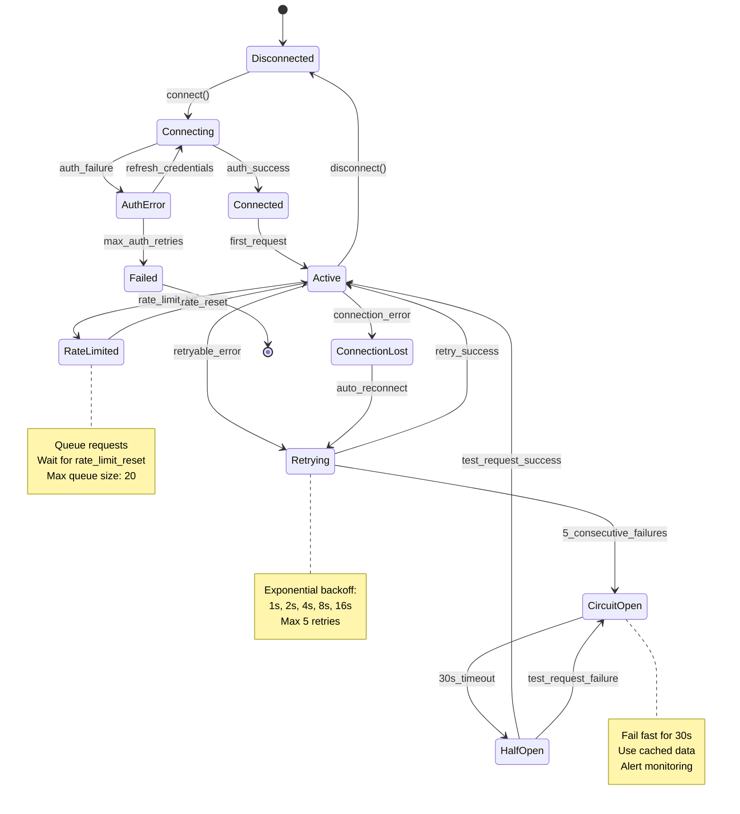

# REQ-001: External Market Data API Integration

## Requirements in Development Workflow

**⚠️ CRITICAL**: Always reference [SPEC_DRIVEN_DEVELOPMENT_GUIDE.md](../../SPEC_DRIVEN_DEVELOPMENT_GUIDE.md) as the single source of truth for workflow steps, artifact definitions, and quality gates.

**REQ (Atomic Requirements)** ← YOU ARE HERE (Layer 4 - Requirements Layer)

For the complete traceability workflow with visual diagram, see: [index.md - Traceability Flow](../../index.md#traceability-flow)

**Quick Reference**:
```
... → SYS → **REQ** → IMPL → CTR/SPEC → TASKS → Code → ...
                ↑
        Requirements Layer
        (Granular, testable, SPEC-ready requirements)
```

**REQ Purpose**: Define atomic, implementable, SPEC-ready requirements
- **Input**: BRD, PRD, SYS, EARS (upstream business/system requirements)
- **Output**: Complete specifications including interfaces, schemas, error handling, and configuration
- **Consumer**: SPEC uses REQ for automated technical specification generation
- **SPEC-Ready Principle**: REQ must contain ALL information needed for SPEC generation without additional inputs

---

## Document Control

| Item | Details |
|------|---------|
| **Status** | Example/Approved |
| **Version** | 2.0.0 |
| **Date Created** | 2025-01-09 |
| **Last Updated** | 2025-01-09 |
| **Author** | Platform Team |
| **Priority** | High |
| **Category** | Functional - External Integration |
| **Source Document** | PRD-001, SYS-001 |
| **Verification Method** | BDD/Integration Test/Contract Test |
| **Assigned Team** | Integration Team |
| **SPEC-Ready Score** | 95% (Target: ≥90%) |

---

## 1. Description

The system SHALL integrate with external market data API providers to fetch real-time stock quotes, historical prices, and market metadata with tier-appropriate rate limiting, authentication, caching, and circuit breaker protection.

This requirement enables the trading platform to consume third-party financial data APIs with resilience patterns including exponential backoff retries, circuit breakers, request queueing, and automatic failover to alternative providers.

### Context

Market data APIs provide critical real-time and historical financial information required for trading decisions. The integration must handle API rate limits (free tier: 5 req/min, premium tier: 75 req/min), transient network failures, API outages, and data format variations across providers.

### Use Case Scenario

**Primary Flow**:
1. Trading engine requests current quote for symbol "AAPL"
2. API client validates request parameters (symbol format, request type)
3. Client checks circuit breaker state and rate limit budget
4. Client sends authenticated HTTP GET request to API endpoint
5. API returns JSON response with quote data (price, bid, ask, volume, timestamp)
6. Client validates response against JSON schema
7. Client caches response with 30-second TTL
8. Client returns parsed QuoteResponse to trading engine

**Alternative Flows**:
- **Rate Limit Hit**: When 429 received, client queues request and waits for rate limit reset
- **Connection Timeout**: When request exceeds 30s, client retries with exponential backoff (1s, 2s, 4s, 8s, 16s)
- **Circuit Open**: When 5 consecutive failures detected, circuit opens for 30s, subsequent requests fail fast
- **Invalid Response**: When response fails schema validation, client logs error and raises ValidationError

---

## 2. Functional Requirements

### Primary Functionality

The API client provides asynchronous methods for fetching quotes, historical data, and market metadata with built-in resilience patterns (retry, circuit breaker, rate limiting).

**Required Capabilities**:
- **Quote Fetching**: Retrieve real-time quote (price, bid, ask, volume) for single symbol with <500ms p95 latency
- **Batch Retrieval**: Fetch quotes for multiple symbols concurrently (max 10 concurrent) with result streaming
- **Historical Data**: Retrieve daily OHLCV data for date ranges with pagination support
- **Connection Management**: Establish/maintain HTTP/2 connection pool with 100 max connections and 60s keepalive
- **Authentication**: Support API key authentication with automatic refresh from Google Secret Manager

### Business Rules

**Rate Limiting Rules**:
1. **Free Tier**: Limit to 5 requests/minute with request queueing (max queue size: 20)
2. **Premium Tier**: Limit to 75 requests/minute with 10-request burst allowance
3. **Throttle Strategy**: Queue requests when approaching limit, reject with 429 if queue full

**Retry Rules**:
1. **Retryable Errors**: 429 (rate limit), 500, 502, 503, 504 (server errors), connection timeout
2. **Non-Retryable Errors**: 400 (bad request), 401 (unauthorized), 403 (forbidden), 404 (not found)
3. **Retry Schedule**: Exponential backoff with jitter: 1s, 2s, 4s, 8s, 16s (max 5 attempts)

**Circuit Breaker Rules**:
1. **Open Trigger**: 5 consecutive failures within 1-minute window
2. **Cooldown Period**: Circuit stays open for 30 seconds
3. **Half-Open Test**: Allow 1 request to test recovery
4. **Close Trigger**: 2 consecutive successes in half-open state

---

## 3. Interface Specifications

**Purpose**: Define ALL interfaces, method signatures, and contracts required for implementation.

### 3.1 Protocol/Abstract Base Class Definition

```python
from typing import Protocol, AsyncIterator
from abc import ABC, abstractmethod
from dataclasses import dataclass
from datetime import date, datetime

class MarketDataAPIClient(Protocol):
    """Protocol defining the contract for market data API integration.

    Implementations must provide these methods with exact signatures.
    All methods are async and raise specific exceptions defined in Section 5.
    """

    async def connect(
        self,
        credentials: APICredentials,
        timeout: float = 5.0
    ) -> ConnectionResult:
        """Establish connection to market data API.

        Args:
            credentials: API authentication credentials
            timeout: Connection timeout in seconds

        Returns:
            ConnectionResult with status, session_id, rate_limit_tier

        Raises:
            ConnectionError: When connection fails after retries
            AuthenticationError: When credentials are invalid
            TimeoutError: When connection exceeds timeout
        """
        ...

    async def get_quote(
        self,
        symbol: str,
        retry_config: RetryConfig | None = None
    ) -> QuoteResponse:
        """Fetch real-time quote for single symbol.

        Args:
            symbol: Stock ticker symbol (1-5 uppercase letters)
            retry_config: Optional retry configuration (uses default if None)

        Returns:
            QuoteResponse with price, bid, ask, volume, timestamp

        Raises:
            RateLimitExceeded: When API rate limit is hit
            ValidationError: When symbol format is invalid
            APIError: When API returns error response
            CircuitOpenError: When circuit breaker is open
        """
        ...

    async def get_quotes_batch(
        self,
        symbols: list[str],
        max_concurrent: int = 10
    ) -> AsyncIterator[QuoteResponse]:
        """Fetch quotes for multiple symbols concurrently.

        Args:
            symbols: List of ticker symbols
            max_concurrent: Maximum concurrent API requests

        Yields:
            QuoteResponse for each symbol as completed

        Raises:
            RateLimitExceeded: When rate limit exceeded during batch
            ValidationError: When any symbol is invalid
        """
        ...

    async def get_historical(
        self,
        symbol: str,
        start_date: date,
        end_date: date,
        interval: str = "daily"
    ) -> HistoricalDataResponse:
        """Fetch historical OHLCV data for date range.

        Args:
            symbol: Stock ticker symbol
            start_date: Start date (inclusive)
            end_date: End date (inclusive)
            interval: Data interval (daily, weekly, monthly)

        Returns:
            HistoricalDataResponse with OHLCV bars

        Raises:
            RateLimitExceeded: When rate limit exceeded
            ValidationError: When dates or interval invalid
            APIError: When API returns error
        """
        ...

    async def disconnect(self) -> DisconnectionResult:
        """Gracefully disconnect from API and cleanup resources.

        Returns:
            DisconnectionResult with cleanup status
        """
        ...

    def get_rate_limit_status(self) -> RateLimitStatus:
        """Get current rate limit status (synchronous).

        Returns:
            RateLimitStatus with remaining requests, reset time
        """
        ...
```

### 3.2 Data Transfer Objects (DTOs)

```python
from dataclasses import dataclass
from datetime import datetime, date
from enum import Enum

class RateLimitTier(str, Enum):
    """API rate limit tiers."""
    FREE = "free"  # 5 req/min
    PREMIUM = "premium"  # 75 req/min
    ENTERPRISE = "enterprise"  # 1000 req/min

@dataclass(frozen=True)
class APICredentials:
    """Credentials for API authentication."""
    api_key: str
    secret_key: str | None = None
    tier: RateLimitTier = RateLimitTier.FREE

@dataclass
class ConnectionResult:
    """Result of API connection attempt."""
    success: bool
    session_id: str | None
    rate_limit_tier: RateLimitTier
    timestamp: datetime
    error_message: str | None = None

@dataclass
class QuoteResponse:
    """Real-time quote response."""
    symbol: str
    price: float
    bid: float | None
    ask: float | None
    volume: int
    timestamp: datetime
    request_id: str

@dataclass
class OHLCVBar:
    """OHLCV data for single time period."""
    date: date
    open: float
    high: float
    low: float
    close: float
    volume: int

@dataclass
class HistoricalDataResponse:
    """Historical data response."""
    symbol: str
    interval: str
    bars: list[OHLCVBar]
    request_id: str

@dataclass
class DisconnectionResult:
    """Result of disconnection."""
    success: bool
    resources_released: bool
    timestamp: datetime

@dataclass
class RateLimitStatus:
    """Current rate limit status."""
    tier: RateLimitTier
    requests_remaining: int
    reset_time: datetime
    requests_made: int
    window_size_seconds: int = 60

@dataclass
class RetryConfig:
    """Retry behavior configuration."""
    max_attempts: int = 5
    initial_delay_seconds: float = 1.0
    max_delay_seconds: float = 60.0
    backoff_multiplier: float = 2.0
    add_jitter: bool = True
```

### 3.3 REST API Endpoints

**Base URL**: `https://api.marketdata.example.com/v1`

**Authentication**: API Key in header `X-API-Key: {api_key}`

| Endpoint | Method | Request Params | Response Schema | Rate Limit (Free/Premium) |
|----------|--------|----------------|-----------------|---------------------------|
| `/quotes/{symbol}` | GET | `symbol` (path) | `QuoteResponse` | 5/min, 75/min |
| `/quotes/batch` | POST | `symbols[]` (body) | `QuoteResponse[]` | 5/min, 75/min |
| `/historical/{symbol}` | GET | `symbol`, `start`, `end`, `interval` (query) | `HistoricalDataResponse` | 5/min, 75/min |

**Example Request**:
```http
GET /v1/quotes/AAPL HTTP/2
Host: api.marketdata.example.com
X-API-Key: sk_live_abc123xyz789
Accept: application/json
```

**Example Response**:
```json
{
  "symbol": "AAPL",
  "price": 182.50,
  "bid": 182.45,
  "ask": 182.55,
  "volume": 1000000,
  "timestamp": "2025-01-09T14:30:00Z",
  "request_id": "req_abc123"
}
```

---

## 4. Data Schemas

**Purpose**: Define ALL data structures, validation rules, and schemas using standard formats.

### 4.1 JSON Schema Definitions

```json
{
  "$schema": "http://json-schema.org/draft-07/schema#",
  "title": "QuoteResponse",
  "type": "object",
  "required": ["symbol", "price", "volume", "timestamp", "request_id"],
  "properties": {
    "symbol": {
      "type": "string",
      "pattern": "^[A-Z]{1,5}$",
      "description": "Stock ticker symbol (1-5 uppercase letters)",
      "examples": ["AAPL", "MSFT", "GOOGL"]
    },
    "price": {
      "type": "number",
      "minimum": 0.01,
      "multipleOf": 0.01,
      "description": "Current price in USD with 2 decimal precision"
    },
    "bid": {
      "type": ["number", "null"],
      "minimum": 0,
      "multipleOf": 0.01,
      "description": "Bid price (may be null if market closed)"
    },
    "ask": {
      "type": ["number", "null"],
      "minimum": 0,
      "multipleOf": 0.01,
      "description": "Ask price (may be null if market closed)"
    },
    "volume": {
      "type": "integer",
      "minimum": 0,
      "description": "Trading volume (shares traded)"
    },
    "timestamp": {
      "type": "string",
      "format": "date-time",
      "description": "ISO 8601 timestamp of quote"
    },
    "request_id": {
      "type": "string",
      "pattern": "^req_[a-z0-9]{6,}$",
      "description": "Unique request identifier"
    }
  },
  "additionalProperties": false
}
```

### 4.2 Pydantic Models with Validators

```python
from pydantic import BaseModel, Field, field_validator, model_validator
from datetime import datetime
from typing import Literal
import re

class QuoteResponseModel(BaseModel):
    """Quote response with comprehensive validation."""

    symbol: str = Field(
        ...,
        min_length=1,
        max_length=5,
        pattern=r"^[A-Z]{1,5}$",
        description="Stock ticker symbol",
        examples=["AAPL", "MSFT"]
    )
    price: float = Field(
        ...,
        gt=0,
        description="Current price in USD"
    )
    bid: float | None = Field(None, ge=0)
    ask: float | None = Field(None, ge=0)
    volume: int = Field(..., ge=0)
    timestamp: datetime
    request_id: str = Field(..., pattern=r"^req_[a-z0-9]{6,}$")

    @field_validator('symbol')
    @classmethod
    def validate_symbol_format(cls, v: str) -> str:
        """Ensure symbol is uppercase letters only."""
        if not re.match(r'^[A-Z]{1,5}$', v):
            raise ValueError(
                f"Symbol must be 1-5 uppercase letters, got: {v}"
            )
        return v

    @field_validator('price', 'bid', 'ask')
    @classmethod
    def validate_price_precision(cls, v: float | None) -> float | None:
        """Ensure prices have maximum 2 decimal places."""
        if v is not None and round(v, 2) != v:
            raise ValueError(
                f"Price must have max 2 decimal places, got {v}"
            )
        return v

    @model_validator(mode='after')
    def validate_bid_ask_spread(self) -> 'QuoteResponseModel':
        """Ensure bid <= price <= ask when all present."""
        if self.bid and self.ask and self.price:
            if not (self.bid <= self.price <= self.ask):
                raise ValueError(
                    f"Invalid spread: bid={self.bid}, "
                    f"price={self.price}, ask={self.ask}"
                )
        return self

    @model_validator(mode='after')
    def validate_timestamp_not_future(self) -> 'QuoteResponseModel':
        """Ensure timestamp is not in future."""
        if self.timestamp > datetime.utcnow():
            raise ValueError(
                f"Timestamp cannot be in future: {self.timestamp}"
            )
        return self

    class Config:
        frozen = True  # Immutable after creation
        json_schema_extra = {
            "examples": [
                {
                    "symbol": "AAPL",
                    "price": 182.50,
                    "bid": 182.45,
                    "ask": 182.55,
                    "volume": 1000000,
                    "timestamp": "2025-01-09T14:30:00Z",
                    "request_id": "req_abc123"
                }
            ]
        }


class HistoricalDataRequestModel(BaseModel):
    """Historical data request validation."""

    symbol: str = Field(..., pattern=r"^[A-Z]{1,5}$")
    start_date: date
    end_date: date
    interval: Literal["daily", "weekly", "monthly"] = "daily"

    @model_validator(mode='after')
    def validate_date_range(self) -> 'HistoricalDataRequestModel':
        """Ensure start_date <= end_date."""
        if self.start_date > self.end_date:
            raise ValueError(
                f"start_date must be <= end_date: "
                f"{self.start_date} > {self.end_date}"
            )
        return self

    @model_validator(mode='after')
    def validate_max_range(self) -> 'HistoricalDataRequestModel':
        """Ensure date range does not exceed 2 years."""
        delta = (self.end_date - self.start_date).days
        if delta > 730:  # ~2 years
            raise ValueError(
                f"Date range exceeds maximum 2 years: {delta} days"
            )
        return self
```

### 4.3 Database Schema (Caching Layer)

```python
from sqlalchemy import Column, Integer, String, Float, DateTime, Index
from sqlalchemy.ext.declarative import declarative_base
from datetime import datetime

Base = declarative_base()

class CachedQuote(Base):
    """Cached quote model with TTL enforcement."""
    __tablename__ = 'cached_quotes'

    id = Column(Integer, primary_key=True, autoincrement=True)
    symbol = Column(String(5), nullable=False, index=True)
    price = Column(Float, nullable=False)
    bid = Column(Float, nullable=True)
    ask = Column(Float, nullable=True)
    volume = Column(Integer, nullable=False)
    quote_timestamp = Column(DateTime, nullable=False)
    cached_at = Column(DateTime, default=datetime.utcnow, nullable=False)
    ttl_seconds = Column(Integer, default=30, nullable=False)
    request_id = Column(String(50), nullable=False)

    __table_args__ = (
        Index('idx_symbol_cached_at', 'symbol', 'cached_at'),
        Index('idx_cached_at_ttl', 'cached_at', 'ttl_seconds'),
    )

    @property
    def is_expired(self) -> bool:
        """Check if cache entry has exceeded TTL."""
        age_seconds = (datetime.utcnow() - self.cached_at).total_seconds()
        return age_seconds > self.ttl_seconds
```

---

## 5. Error Handling Specifications

**Purpose**: Define ALL error types, recovery strategies, and state transitions.

### 5.1 Exception Catalog

| Exception Type | HTTP Code | Error Code | Retry? | Recovery Strategy |
|----------------|-----------|------------|--------|-------------------|
| `ConnectionError` | 503 | `CONN_001` | Yes (5x) | Exponential backoff: 1s, 2s, 4s, 8s, 16s |
| `AuthenticationError` | 401 | `AUTH_001` | No | Refresh credentials from Secret Manager, alert admin |
| `RateLimitExceeded` | 429 | `RATE_001` | Yes | Queue request, wait for rate_limit_reset |
| `ValidationError` | 400 | `VALID_001` | No | Log detailed error, return to caller with field details |
| `APIError` | 5xx | `API_001` | Yes (5x) | Retry with backoff, fallback to cache if available |
| `TimeoutError` | 504 | `TIMEOUT_001` | Yes (3x) | Retry with increased timeout (30s → 45s → 60s) |
| `CircuitOpenError` | 503 | `CIRCUIT_001` | No | Fail fast, use cached data or alternative provider |
| `SymbolNotFoundError` | 404 | `SYMBOL_001` | No | Return error to caller, log for investigation |

### 5.2 Error Response Schema

```python
from typing import Literal
from pydantic import BaseModel
from datetime import datetime

class ErrorDetail(BaseModel):
    """Detailed error information."""
    field: str | None = None
    message: str
    code: str

class ErrorResponse(BaseModel):
    """Standardized error response structure."""

    error_code: str  # Format: {CATEGORY}_{NUMBER}
    error_message: str
    error_type: Literal[
        "ConnectionError",
        "AuthenticationError",
        "RateLimitExceeded",
        "ValidationError",
        "APIError",
        "TimeoutError",
        "CircuitOpenError",
        "SymbolNotFoundError"
    ]
    timestamp: datetime
    request_id: str
    retry_after: int | None = None  # Seconds until retry allowed
    details: list[ErrorDetail] | None = None

    class Config:
        json_schema_extra = {
            "examples": [
                {
                    "error_code": "RATE_001",
                    "error_message": "Rate limit exceeded: 75 requests per minute",
                    "error_type": "RateLimitExceeded",
                    "timestamp": "2025-01-09T14:30:00Z",
                    "request_id": "req_abc123",
                    "retry_after": 45,
                    "details": [
                        {
                            "field": "rate_limit",
                            "message": "Current tier allows 75 req/min, received 80",
                            "code": "TIER_LIMIT_EXCEEDED"
                        }
                    ]
                }
            ]
        }
```

### 5.3 State Machine Diagram

**API Client Connection State Machine**:



> **Note on Diagram Labels**: The above flowchart shows the sequential workflow. For formal layer numbers used in cumulative tagging, always reference the 16-layer architecture (Layers 0-15) defined in README.md. Diagram groupings are for visual clarity only.

### 5.4 Circuit Breaker Configuration

```python
from dataclasses import dataclass
from typing import Tuple

@dataclass
class CircuitBreakerConfig:
    """Circuit breaker thresholds and behavior."""

    # Threshold to open circuit
    failure_threshold: int = 5  # Open after 5 consecutive failures
    failure_window_seconds: int = 60  # Within 60-second window

    # Threshold to close circuit
    success_threshold: int = 2  # Close after 2 consecutive successes

    # Timing
    open_timeout_seconds: float = 30.0  # Circuit stays open for 30s
    half_open_max_calls: int = 1  # Allow 1 test call in half-open

    # Exception filtering
    counted_exceptions: Tuple[type, ...] = (
        ConnectionError,
        TimeoutError,
        APIError,
    )
    ignored_exceptions: Tuple[type, ...] = (
        ValidationError,
        SymbolNotFoundError,
    )

    # Monitoring
    alert_on_open: bool = True
    metrics_enabled: bool = True
```

---

## 6. Configuration Specifications

**Purpose**: Define ALL configuration parameters with concrete examples and validation rules.

### 6.1 Configuration Schema (YAML)

```yaml
# config/market_data_api_client.yaml
market_data_api:
  # Connection settings
  connection:
    base_url: "https://api.marketdata.example.com/v1"
    timeout_seconds: 30.0
    max_connections: 100
    keepalive_seconds: 60
    http_version: "HTTP/2"

  # Authentication
  authentication:
    type: "api_key"  # api_key | oauth2
    credentials_source: "google_secret_manager"
    secret_name: "market_data_api_key_prod"
    secret_project: "trading-platform-prod"
    refresh_interval_hours: 24

  # Rate limiting
  rate_limits:
    tier: "premium"  # free | premium | enterprise
    requests_per_minute:
      free: 5
      premium: 75
      enterprise: 1000
    burst_allowance: 10  # Extra requests allowed in burst
    throttle_strategy: "queue"  # queue | reject | wait
    max_queue_size: 20

  # Retry policy
  retry:
    enabled: true
    max_attempts: 5
    initial_delay_seconds: 1.0
    max_delay_seconds: 60.0
    backoff_multiplier: 2.0
    add_jitter: true
    jitter_max_seconds: 0.5
    retryable_status_codes: [429, 500, 502, 503, 504]
    retryable_exceptions:
      - "ConnectionError"
      - "TimeoutError"
      - "RateLimitExceeded"

  # Circuit breaker
  circuit_breaker:
    enabled: true
    failure_threshold: 5
    failure_window_seconds: 60
    success_threshold: 2
    open_timeout_seconds: 30.0
    half_open_max_calls: 1
    alert_on_open: true

  # Caching
  cache:
    enabled: true
    backend: "redis"  # redis | memory
    redis_url: "redis://localhost:6379/0"
    ttl_seconds:
      quotes: 30
      historical_daily: 3600
      historical_weekly: 86400
      metadata: 86400
    max_size_mb: 512
    eviction_policy: "lru"  # lru | lfu | ttl

  # Monitoring
  monitoring:
    metrics_enabled: true
    logging_level: "INFO"  # DEBUG | INFO | WARNING | ERROR
    trace_sampling_rate: 0.1  # 10% of requests
    alert_on_errors: true
    error_threshold_percent: 5.0
    latency_p95_threshold_ms: 500
```

### 6.2 Environment Variables

| Variable | Type | Required | Default | Description | Example |
|----------|------|----------|---------|-------------|---------|
| `MARKET_DATA_API_URL` | string | Yes | - | Base URL for API | `https://api.example.com/v1` |
| `MARKET_DATA_API_TIMEOUT` | float | No | 30.0 | Request timeout (seconds) | `30.0` |
| `MARKET_DATA_RATE_LIMIT` | int | No | 75 | Requests per minute | `75` |
| `MARKET_DATA_RATE_TIER` | string | No | `premium` | Rate limit tier | `free`, `premium`, `enterprise` |
| `MARKET_DATA_RETRY_ENABLED` | bool | No | `true` | Enable retry logic | `true`, `false` |
| `MARKET_DATA_CACHE_TTL` | int | No | 30 | Cache TTL (seconds) | `30` |
| `MARKET_DATA_CIRCUIT_ENABLED` | bool | No | `true` | Enable circuit breaker | `true`, `false` |
| `GCP_SECRET_PROJECT` | string | Yes | - | GCP project for secrets | `trading-platform-prod` |
| `GCP_SECRET_NAME` | string | Yes | - | Secret name in GSM | `market_data_api_key_prod` |

### 6.3 Configuration Validation

```python
from pydantic import BaseModel, Field, field_validator, HttpUrl
from typing import Literal
import os

class MarketDataAPIConfig(BaseModel):
    """Validated configuration for market data API client."""

    # Connection
    base_url: HttpUrl = Field(..., description="API base URL")
    timeout_seconds: float = Field(30.0, gt=0, le=300)
    max_connections: int = Field(100, ge=1, le=1000)

    # Rate limiting
    rate_tier: Literal["free", "premium", "enterprise"] = "premium"
    requests_per_minute: int = Field(75, ge=1, le=10000)

    # Retry
    retry_enabled: bool = True
    max_retry_attempts: int = Field(5, ge=0, le=10)
    initial_delay_seconds: float = Field(1.0, gt=0, le=60)

    # Circuit breaker
    circuit_enabled: bool = True
    failure_threshold: int = Field(5, ge=1, le=20)

    # Caching
    cache_enabled: bool = True
    cache_ttl_seconds: int = Field(30, ge=0, le=86400)

    @field_validator('base_url')
    @classmethod
    def validate_https_in_production(cls, v: HttpUrl) -> HttpUrl:
        """Ensure HTTPS in production environments."""
        env = os.getenv('ENV', 'development')
        if env == 'production' and not str(v).startswith('https://'):
            raise ValueError("Production must use HTTPS")
        return v

    @field_validator('requests_per_minute')
    @classmethod
    def validate_rate_limit_tier(cls, v: int, values) -> int:
        """Ensure rate limit matches tier."""
        tier = values.data.get('rate_tier')
        limits = {'free': 5, 'premium': 75, 'enterprise': 1000}
        if tier and v > limits[tier]:
            raise ValueError(
                f"Rate limit {v} exceeds tier {tier} max {limits[tier]}"
            )
        return v
```

---

## 7. Non-Functional Requirements (NFRs)

### Performance

| Metric | Target (p50) | Target (p95) | Target (p99) | Measurement Method |
|--------|--------------|--------------|--------------|-------------------|
| Single Quote Response Time | <150ms | <500ms | <1000ms | APM (Datadog/New Relic) |
| Batch Quote Response Time (10 symbols) | <800ms | <2000ms | <3000ms | Load testing |
| Historical Data Response Time | <1s | <3s | <5s | APM |
| Connection Establishment | <2s | <5s | <10s | Metrics |
| Throughput (Premium Tier) | 75 req/min sustained | 85 req/min burst | - | Load testing |

### Reliability

- **Availability**: 99.5% uptime (excluding API provider downtime)
- **Error Rate**: <0.5% of requests (excluding rate limit and circuit breaker)
- **Retry Success Rate**: >80% of retried requests succeed
- **Cache Hit Rate**: >70% for quote requests (30s TTL)
- **Circuit Breaker Recovery**: <60s from open to closed state

### Security

- **Authentication**: API key stored in Google Secret Manager, never logged
- **Transport Security**: TLS 1.3 minimum, certificate pinning recommended
- **Secrets Rotation**: Automatic credential refresh every 24 hours
- **Input Validation**: All requests validated against Pydantic models
- **Audit Logging**: All API calls logged with request_id (no credentials)

### Scalability

- **Horizontal Scaling**: Support 10-100 instances without coordination
- **Connection Pooling**: Max 100 HTTP/2 connections per instance
- **Concurrent Requests**: Handle 10 concurrent requests per instance
- **Queue Capacity**: Handle 20 queued requests during rate limiting
- **Resource Limits**: CPU <20%, Memory <512MB per instance

---

## 8. Implementation Guidance

**Purpose**: Provide technical approaches, algorithms, and patterns for implementation.

### 8.1 Recommended Architecture Pattern

**Pattern**: Async API Client with Retry, Circuit Breaker, and Rate Limiting

```python
import asyncio
import httpx
from datetime import datetime, timedelta
from typing import AsyncIterator

class MarketDataAPIClientImpl:
    """Production implementation with resilience patterns."""

    def __init__(
        self,
        config: MarketDataAPIConfig,
        circuit_breaker: CircuitBreaker,
        rate_limiter: RateLimiter,
        cache: Cache
    ):
        self.config = config
        self.circuit_breaker = circuit_breaker
        self.rate_limiter = rate_limiter
        self.cache = cache
        self.http_client = httpx.AsyncClient(
            base_url=str(config.base_url),
            timeout=config.timeout_seconds,
            http2=True,
            limits=httpx.Limits(max_connections=config.max_connections)
        )

    async def get_quote(
        self,
        symbol: str,
        retry_config: RetryConfig | None = None
    ) -> QuoteResponse:
        """Fetch quote with caching, retry, and circuit breaker."""

        # 1. Validate input
        if not re.match(r'^[A-Z]{1,5}$', symbol):
            raise ValidationError(f"Invalid symbol format: {symbol}")

        # 2. Check cache
        if self.cache.enabled:
            cached = await self.cache.get(f"quote:{symbol}")
            if cached:
                return QuoteResponseModel.parse_raw(cached)

        # 3. Check circuit breaker
        if self.circuit_breaker.is_open():
            raise CircuitOpenError("Circuit breaker is open, using cached data")

        # 4. Apply rate limiting
        await self.rate_limiter.acquire()

        # 5. Execute with retry
        retry_cfg = retry_config or self.default_retry_config
        response = await self._fetch_with_retry(
            endpoint=f"/quotes/{symbol}",
            retry_config=retry_cfg
        )

        # 6. Validate and parse response
        try:
            quote = QuoteResponseModel.parse_obj(response.json())
            self.circuit_breaker.record_success()
        except ValidationError as e:
            self.circuit_breaker.record_failure()
            raise

        # 7. Cache response
        if self.cache.enabled:
            await self.cache.set(
                f"quote:{symbol}",
                quote.json(),
                ttl=self.config.cache_ttl_seconds
            )

        return quote

    async def _fetch_with_retry(
        self,
        endpoint: str,
        retry_config: RetryConfig
    ) -> httpx.Response:
        """Execute HTTP request with exponential backoff retry."""

        delay = retry_config.initial_delay_seconds

        for attempt in range(1, retry_config.max_attempts + 1):
            try:
                response = await self.http_client.get(
                    endpoint,
                    headers={"X-API-Key": await self._get_api_key()}
                )

                # Check for retryable errors
                if response.status_code in [429, 500, 502, 503, 504]:
                    if attempt == retry_config.max_attempts:
                        raise APIError(
                            f"API error {response.status_code} "
                            f"after {attempt} attempts"
                        )
                    # Log and retry
                    logger.warning(
                        f"Retry {attempt}/{retry_config.max_attempts} "
                        f"after {delay}s (status {response.status_code})"
                    )
                    await asyncio.sleep(delay)
                    delay = min(
                        delay * retry_config.backoff_multiplier,
                        retry_config.max_delay_seconds
                    )
                    if retry_config.add_jitter:
                        delay += random.uniform(0, 0.5)
                    continue

                # Success or non-retryable error
                response.raise_for_status()
                return response

            except (httpx.TimeoutException, httpx.ConnectError) as e:
                if attempt == retry_config.max_attempts:
                    raise ConnectionError(
                        f"Connection failed after {attempt} attempts"
                    ) from e

                await asyncio.sleep(delay)
                delay = min(
                    delay * retry_config.backoff_multiplier,
                    retry_config.max_delay_seconds
                )
```

### 8.2 Rate Limiting Algorithm (Token Bucket)

```python
import asyncio
from datetime import datetime, timedelta

class TokenBucketRateLimiter:
    """Token bucket algorithm for rate limiting."""

    def __init__(
        self,
        rate: int,  # tokens per minute
        burst: int = 0  # extra burst capacity
    ):
        self.rate = rate
        self.capacity = rate + burst
        self.tokens = self.capacity
        self.last_refill = datetime.utcnow()
        self.lock = asyncio.Lock()

    async def acquire(self, tokens: int = 1) -> None:
        """Acquire tokens, waiting if necessary.

        Algorithm:
        1. Calculate tokens to add based on time elapsed
        2. Add tokens up to capacity
        3. If sufficient tokens, consume and return
        4. Otherwise, calculate wait time and sleep
        """
        async with self.lock:
            while True:
                now = datetime.utcnow()
                elapsed = (now - self.last_refill).total_seconds()

                # Refill tokens based on elapsed time
                tokens_to_add = int(elapsed * self.rate / 60)
                if tokens_to_add > 0:
                    self.tokens = min(self.capacity, self.tokens + tokens_to_add)
                    self.last_refill = now

                # Check if we have enough tokens
                if self.tokens >= tokens:
                    self.tokens -= tokens
                    return

                # Calculate wait time
                tokens_needed = tokens - self.tokens
                wait_seconds = (tokens_needed * 60) / self.rate

                await asyncio.sleep(wait_seconds)
```

### 8.3 Concurrent Batch Fetching

```python
async def get_quotes_batch(
    self,
    symbols: list[str],
    max_concurrent: int = 10
) -> AsyncIterator[QuoteResponse]:
    """Fetch quotes concurrently with semaphore limiting."""

    semaphore = asyncio.Semaphore(max_concurrent)

    async def fetch_with_semaphore(symbol: str) -> QuoteResponse:
        async with semaphore:
            return await self.get_quote(symbol)

    # Create tasks for all symbols
    tasks = [
        asyncio.create_task(fetch_with_semaphore(symbol))
        for symbol in symbols
    ]

    # Yield results as they complete
    for coro in asyncio.as_completed(tasks):
        try:
            quote = await coro
            yield quote
        except Exception as e:
            logger.error(f"Failed to fetch quote in batch: {e}")
            # Continue with remaining requests
            continue
```

---

## 9. Acceptance Criteria

**Purpose**: Define measurable conditions that prove requirement satisfaction.

### Primary Functional Criteria

- ✅ **AC-001**: API connection established within 5 seconds using valid API key
  - **Verification**: Integration test with production-like credentials
  - **Pass Criteria**: Connection succeeds in <5s for 100% of attempts (10/10 runs)

- ✅ **AC-002**: Single quote retrieval completes within SLA (p95 <500ms)
  - **Verification**: Load test with 1000 sequential requests
  - **Pass Criteria**: p50 <150ms, p95 <500ms, p99 <1000ms

- ✅ **AC-003**: Batch quote retrieval (10 symbols) completes within 2s at p95
  - **Verification**: Load test fetching 10-symbol batches
  - **Pass Criteria**: p95 <2000ms, all symbols returned or errors reported

- ✅ **AC-004**: Rate limiting enforced at tier-specific limits
  - **Verification**: Send 100 requests in 1 minute (premium tier: 75/min limit)
  - **Pass Criteria**: 76th request returns 429 or queues, no requests lost

### Error and Edge Case Criteria

- ✅ **AC-005**: Connection failures trigger exponential backoff retry
  - **Verification**: Chaos test with network failures injected
  - **Pass Criteria**: Retries at 1s, 2s, 4s, 8s, 16s intervals (±10% jitter)

- ✅ **AC-006**: Circuit breaker opens after 5 consecutive failures
  - **Verification**: Inject 5 consecutive API errors (500, 503)
  - **Pass Criteria**: 6th request fails fast with CircuitOpenError (<10ms)

- ✅ **AC-007**: Circuit breaker closes after 2 successes in half-open state
  - **Verification**: Wait for circuit timeout (30s), send 2 successful requests
  - **Pass Criteria**: Circuit transitions to closed, normal requests resume

- ✅ **AC-008**: Invalid symbol format raises ValidationError immediately
  - **Verification**: Request quotes for "123", "aapl", "TOOLONG"
  - **Pass Criteria**: ValidationError raised with field details, no API call made

- ✅ **AC-009**: API errors (5xx) retry up to 5 times before failing
  - **Verification**: Mock API returns 503 for 3 attempts, then 200
  - **Pass Criteria**: Request succeeds on 4th attempt with exponential backoff

### Quality and Constraint Criteria

- ✅ **AC-010**: Response time <500ms at p95 under sustained load
  - **Verification**: Performance test with 75 req/min for 10 minutes
  - **Pass Criteria**: p95 latency <500ms throughout test duration

- ✅ **AC-011**: API keys never logged or exposed in error messages
  - **Verification**: Log audit + error message inspection
  - **Pass Criteria**: Zero plaintext API keys in logs, errors, or traces

- ✅ **AC-012**: Memory usage <512MB per instance under load
  - **Verification**: Resource monitoring during load test
  - **Pass Criteria**: Peak memory <512MB, no memory leaks detected

### Data Validation Criteria

- ✅ **AC-013**: Response data validates against JSON Schema
  - **Verification**: Schema validation on 1000 API responses
  - **Pass Criteria**: 100% of valid responses pass schema validation

- ✅ **AC-014**: Pydantic models reject invalid responses
  - **Verification**: Unit tests with malformed API responses
  - **Pass Criteria**: ValidationError raised for all invalid inputs with field details

- ✅ **AC-015**: Bid-ask spread validation enforced (bid <= price <= ask)
  - **Verification**: Test with responses where bid > price or ask < price
  - **Pass Criteria**: ValidationError raised with spread details

### Integration Criteria

- ✅ **AC-016**: Cache hit rate >70% for quote requests (30s TTL)
  - **Verification**: Load test with repeated requests for same symbols
  - **Pass Criteria**: >70% requests served from cache

- ✅ **AC-017**: Metrics published with <1min lag (latency, errors, cache hits)
  - **Verification**: Metrics dashboard inspection during load test
  - **Pass Criteria**: All metrics present with <60s delay

- ✅ **AC-018**: Credentials refreshed from Secret Manager every 24 hours
  - **Verification**: Monitor credential access logs over 48 hours
  - **Pass Criteria**: Credentials fetched at 24-hour intervals (±5 min)

---

## 10. Verification Methods

### Automated Testing

- **BDD Scenarios**: `features/api_integration.feature`
  - Scenario: Successful quote retrieval for valid symbol
  - Scenario: Rate limit enforcement and queueing
  - Scenario: Retry on transient API failure
  - Scenario: Circuit breaker activation and recovery
  - Scenario: Cache hit for recently fetched quote
  - Scenario: Validation error for invalid symbol format

- **Unit Tests**: `tests/unit/api/test_market_data_client.py`
  - Test: API key validation and formatting
  - Test: Request building with correct headers
  - Test: Response parsing and Pydantic validation
  - Test: Error mapping (HTTP status → exception types)
  - Test: Token bucket rate limiter algorithm
  - Test: Circuit breaker state transitions

- **Integration Tests**: `tests/integration/api/test_market_data_integration.py`
  - Test: End-to-end quote fetch with real API (test environment)
  - Test: Retry logic with API returning 503 then 200
  - Test: Rate limit handling with tier-specific limits
  - Test: Cache integration (write and read)
  - Test: Metrics collection and publishing

- **Contract Tests**: `tests/contract/api/test_market_data_contract.py`
  - Test: Quote response schema compatibility
  - Test: Historical data response schema compatibility
  - Test: Error response format compliance

- **Performance Tests**: `tests/performance/api/test_market_data_performance.py`
  - Test: Latency benchmarks (p50/p95/p99) under load
  - Test: Throughput at rate limit (75 req/min sustained)
  - Test: Connection pool efficiency
  - Test: Memory usage under sustained load

- **Chaos Tests**: `tests/chaos/api/test_market_data_resilience.py`
  - Test: Network failures during request
  - Test: API timeout scenarios
  - Test: Intermittent 5xx errors
  - Test: Rate limit exceeded scenarios

### Technical Validation

- **Specification Compliance**: `SPEC-001_market_data_api_client.yaml`
  - Interface implementation matches `MarketDataAPIClient` Protocol
  - All methods have type annotations and docstrings
  - Error handling follows exception catalog

- **Schema Validation**:
  - JSON Schema validation passes for all response types
  - Pydantic models validate successfully
  - Database schema constraints enforced

### Manual Validation

- **Code Review Checklist**:
  - [ ] All interfaces implement Protocol/ABC with exact signatures
  - [ ] Error handling covers all exception types from catalog
  - [ ] Configuration validated with Pydantic model
  - [ ] Secrets fetched from Secret Manager, never hardcoded
  - [ ] Metrics and logging instrumented
  - [ ] Circuit breaker and retry logic implemented correctly
  - [ ] Rate limiting uses token bucket algorithm
  - [ ] Cache integration follows TTL strategy

- **Security Assessment**:
  - [ ] TLS 1.3 enforced for API connections
  - [ ] API keys stored in Google Secret Manager
  - [ ] Input validation prevents injection attacks
  - [ ] Rate limiting prevents API abuse
  - [ ] Audit logging complete (request_id tracing)

---

## 11. Traceability

### Upstream Sources

| Source Type | Document ID | Document Title | Relevant Sections | Relationship |
|-------------|-------------|----------------|-------------------|--------------|
| BRD | BRD-001 | Market Data Integration Business Requirements | Section 3: External Data Integration | Business need for real-time market data |
| PRD | PRD-001 | Trading Platform Product Requirements | Section 4.2: Market Data APIs | Product feature enabling data consumption |
| SYS | SYS-001 | System Architecture Requirements | Section 5: External Integration Layer | System-level API integration patterns |
| EARS | EARS-001 | Market Data Integration Engineering Requirements | WHEN market data requested THEN fetch with resilience | Formal engineering requirement |

### Downstream Artifacts

#### Architecture Decisions

| ADR ID | ADR Title | Requirement Aspects Addressed | Decision Impact |
|--------|-----------|------------------------------|-----------------|
| ADR-005 | External API Integration Architecture | Rate limiting, circuit breaker, retry patterns | Resilience pattern selection |
| ADR-012 | Secret Management with Google Secret Manager | API key storage and rotation | Security implementation |
| ADR-018 | Caching Strategy for Market Data | Cache TTLs and invalidation | Performance optimization |

#### Technical Specifications

| SPEC ID | Specification Title | Requirement Aspects Implemented | Implementation Path |
|---------|-------------------|--------------------------------|---------------------|
| SPEC-001 | Market Data API Client | All interfaces, schemas, errors, config | `src/integrations/market_data_client.py` |

#### Behavioral Specifications

| BDD ID | Scenario Title | Acceptance Criteria Validated | Test Coverage |
|--------|----------------|-------------------------------|---------------|
| BDD-001 | Market Data API Integration | AC-001 through AC-018 | `features/api_integration.feature` |

#### API Contracts

| CTR ID | Contract Title | Interface Defined | Relationship |
|--------|----------------|-------------------|--------------|
| CTR-001 | Market Data API Contract | REST API endpoints and schemas | External API contract |

### Code Implementation Paths

**Primary Implementation**:
- `src/integrations/market_data_client.py`: Main client implementation
- `src/integrations/models.py`: Pydantic models and DTOs
- `src/integrations/errors.py`: Exception definitions
- `src/integrations/config.py`: Configuration validation
- `src/integrations/circuit_breaker.py`: Circuit breaker implementation
- `src/integrations/rate_limiter.py`: Token bucket rate limiter

**Test Paths**:
- `tests/unit/integrations/test_market_data_client.py`: Unit tests
- `tests/integration/integrations/test_market_data_integration.py`: Integration tests
- `tests/contract/integrations/test_market_data_contract.py`: Contract tests
- `tests/performance/integrations/test_market_data_performance.py`: Performance tests
- `features/api_integration.feature`: BDD scenarios

---

## 12. Change History

| Date | Version | Change | Author |
|------|---------|--------|---------|
| 2025-01-09 | 2.0.0 | Created comprehensive V2 example with interfaces, schemas, errors, config | Platform Team |

**Template Version**: 2.0 (SPEC-Ready)
**Next Review**: 2025-04-09 (quarterly review)
**Technical Contact**: platform-team@example.com
**SPEC-Ready Checklist Passed**: ✅ Interfaces ✅ Schemas ✅ Errors ✅ Config ✅ NFRs ✅ Implementation Guidance
