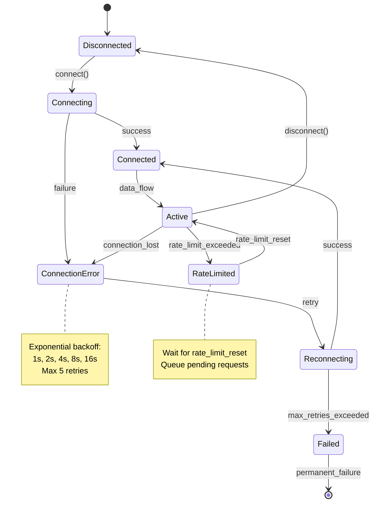

# REQ-NN: [Descriptive Requirement Title]

---

**📦 DEPRECATED - Template V2.0 Archived**

**Status**: This template is deprecated as of 2025-11-19
**Current Template**: Use [REQ-TEMPLATE.md](../REQ-TEMPLATE.md) for all new requirements
**Migration Guide**: See [README.md](../README.md#migration-guide) for V2→V3 migration steps
**Reason**: V3.0 includes Layer 7 correction, absolute paths, enhanced Document Control, and cumulative tagging

This file is maintained for historical reference only.

---

## Position in Document Workflow

**⚠️ CRITICAL**: Always reference [SPEC_DRIVEN_DEVELOPMENT_GUIDE.md](../SPEC_DRIVEN_DEVELOPMENT_GUIDE.md) as the single source of truth for workflow steps, artifact definitions, and quality gates.

**REQ (Atomic Requirements)** ← YOU ARE HERE (Layer 7 - Requirements Layer)

For the complete traceability workflow with visual diagram, see: [index.md - Traceability Flow](../index.md#traceability-flow)

**Quick Reference**:
```
... → SYS → **REQ** → IMPL → CTR/SPEC → TASKS → Code → ...
                ↑
        Requirements Layer
        (Granular, testable, SPEC-ready requirements)
```

**REQ Purpose**: Define atomic, implementable, SPEC-ready requirements
- **Input**: BRD, PRD, SYS, EARS (upstream business/system requirements)
- **Output**: Complete specifications including interfaces, schemas, error handling, and configuration
- **Consumer**: SPEC uses REQ for automated technical specification generation
- **SPEC-Ready Principle**: REQ must contain ALL information needed for SPEC generation without additional inputs

---

## Document Control

| Item | Details |
|------|---------|
| **Status** | Draft/Review/Approved/Implemented/Verified/Retired |
| **Version** | [Semantic version, e.g., 1.0.0] |
| **Date Created** | YYYY-MM-DD |
| **Last Updated** | YYYY-MM-DD |
| **Author** | [Author name and role] |
| **Priority** | Critical/High/Medium/Low |
| **Category** | Functional/Non-Functional/security/Performance/Reliability |
| **Source Document** | [PRD-NN, SYS-NN, or EARS-NN reference] |
| **Verification Method** | BDD/Spec/Unit Test/Integration Test/Contract Test |
| **Assigned Team** | [Team/Person responsible] |
| **SPEC-Ready Score** | [0-100%] (Target: ≥90%) |

---

## 1. Description

[The system/component] SHALL/SHOULD/MAY [precise, atomic requirement statement that defines exactly one specific behavior or constraint].

[Additional context explaining why this requirement exists and what problem it solves. Include business justification and importance.]

### Context

[What makes this requirement necessary and how it fits into the larger system capabilities]

### Use Case Scenario

**Primary Flow**:
1. User/System initiates [action/trigger event]
2. System validates [input/precondition]
3. System executes [core behavior]
4. System returns [expected outcome]

**Alternative Flows**:
- **Error Path**: When [error condition], system SHALL [error handling behavior]
- **Edge Case**: When [boundary condition], system SHALL [boundary handling]

---

## 2. Functional Requirements

### Primary Functionality

[Detailed description of the core functional behavior this requirement implements]

**Required Capabilities**:
- Capability 1: [Specific functional capability with measurable outcome]
- Capability 2: [Specific functional capability with measurable outcome]
- Capability 3: [Specific functional capability with measurable outcome]

### Business Rules

[Specific business logic that governs this requirement's behavior]

**Rules**:
1. **Rule Name**: [Condition] → [Action/Outcome]
2. **Rule Name**: [Condition] → [Action/Outcome]

---

## 3. Interface Specifications

**Purpose**: Define ALL interfaces, method signatures, and contracts required for implementation.

### 3.1 Protocol/Abstract Base Class Definition

```python
from typing import Protocol, TypeVar, Generic
from abc import ABC, abstractmethod
from dataclasses import dataclass

class ExternalAPIClient(Protocol):
    """Protocol defining the contract for external API integration.

    Implementations must provide these methods with exact signatures.
    """

    async def connect(
        self,
        credentials: APICredentials,
        timeout: float = 5.0
    ) -> ConnectionResult:
        """Establish connection to external API.

        Args:
            credentials: Authentication credentials (API key, OAuth token, etc.)
            timeout: Connection timeout in seconds

        Returns:
            ConnectionResult with status, session_id, and metadata

        Raises:
            ConnectionError: When connection fails after retries
            AuthenticationError: When credentials are invalid
            TimeoutError: When connection exceeds timeout
        """
        ...

    async def fetch_data(
        self,
        request: DataRequest,
        retry_config: RetryConfig | None = None
    ) -> DataResponse:
        """Fetch data from external API endpoint.

        Args:
            request: Request parameters with endpoint, query params, headers
            retry_config: Optional retry configuration (uses default if None)

        Returns:
            DataResponse with status_code, data payload, headers, metadata

        Raises:
            RateLimitExceeded: When API rate limit is hit
            ValidationError: When request parameters are invalid
            APIError: When API returns error response
        """
        ...

    async def disconnect(self) -> DisconnectionResult:
        """Gracefully disconnect from external API.

        Returns:
            DisconnectionResult with cleanup status
        """
        ...
```

### 3.2 Data Transfer Objects (DTOs)

```python
from dataclasses import dataclass
from datetime import datetime
from enum import Enum

@dataclass(frozen=True)
class APICredentials:
    """Credentials for API authentication."""
    api_key: str
    regulatoryret_key: str | None = None
    auth_type: str = "api_key"  # api_key, oauth2, certificate

@dataclass
class DataRequest:
    """Request structure for API data fetching."""
    endpoint: str
    method: str = "GET"  # GET, POST, PUT, DELETE
    query_params: dict[str, str | int | float] | None = None
    headers: dict[str, str] | None = None
    body: dict | None = None
    timeout: float = 30.0

@dataclass
class DataResponse:
    """Response structure from API."""
    status_code: int
    data: dict | list | None
    headers: dict[str, str]
    timestamp: datetime
    request_id: str
    rate_limit_remaining: int | None = None
```

### 3.3 REST API Endpoints (if applicable)

**Base URL**: `https://api.example.com/v1`

| Endpoint | Method | Request Schema | Response Schema | Rate Limit |
|----------|--------|----------------|-----------------|------------|
| `/data/quotes` | GET | `QuoteRequest` | `QuoteResponse` | 100/min |
| `/data/historical` | GET | `HistoricalRequest` | `HistoricalResponse` | 75/min |
| `/orders/create` | POST | `OrderRequest` | `OrderResponse` | 50/min |

---

## 4. Data Schemas

**Purpose**: Define ALL data structures, validation rules, and schemas using standard formats.

### 4.1 JSON Schema Definitions

```json
{
  "$schema": "http://json-schema.org/draft-07/schema#",
  "title": "QuoteResponse",
  "type": "object",
  "required": ["symbol", "price", "timestamp"],
  "properties": {
    "symbol": {
      "type": "string",
      "pattern": "^[A-Z]{1,5}$",
      "description": "item resource identifier (1-5 uppercase letters)"
    },
    "price": {
      "type": "number",
      "minimum": 0.01,
      "multipleOf": 0.01,
      "description": "Current price in USD"
    },
    "timestamp": {
      "type": "string",
      "format": "date-time",
      "description": "ISO 8601 timestamp of quote"
    },
    "bid": {
      "type": "number",
      "minimum": 0
    },
    "ask": {
      "type": "number",
      "minimum": 0
    },
    "volume": {
      "type": "integer",
      "minimum": 0
    }
  },
  "additionalProperties": false
}
```

### 4.2 Pydantic Models with Validators

```python
from pydantic import BaseModel, Field, field_validator, model_validator
from datetime import datetime
from typing import Literal

class QuoteResponse(BaseModel):
    """Quote response with field-level validation."""

    symbol: str = Field(
        ...,
        min_length=1,
        max_length=5,
        pattern=r"^[A-Z]{1,5}$",
        description="item resource identifier"
    )
    price: float = Field(
        ...,
        gt=0,
        decimal_places=2,
        description="Current price in USD"
    )
    timestamp: datetime
    bid: float | None = Field(None, ge=0)
    ask: float | None = Field(None, ge=0)
    volume: int | None = Field(None, ge=0)

    @field_validator('price', 'bid', 'ask')
    @classmethod
    def validate_price_precision(cls, v: float) -> float:
        """Ensure prices have maximum 2 decimal places."""
        if v is not None and round(v, 2) != v:
            raise ValueError(f"Price must have max 2 decimal places, got {v}")
        return v

    @model_validator(mode='after')
    def validate_bid_ask_spread(self) -> 'QuoteResponse':
        """Ensure bid <= price <= ask when all present."""
        if self.bid and self.ask and self.price:
            if not (self.bid <= self.price <= self.ask):
                raise ValueError(
                    f"Invalid spread: bid={self.bid}, price={self.price}, ask={self.ask}"
                )
        return self

    class Config:
        frozen = True  # Immutable after creation
        json_schema_extra = {
            "examples": [
                {
                    "symbol": "ITEM-001",
                    "price": 182.50,
                    "timestamp": "2025-01-15T14:30:00Z",
                    "bid": 182.45,
                    "ask": 182.55,
                    "volume": 1000000
                }
            ]
        }
```

### 4.3 Database Schema (if applicable)

```sql
-- SQLAlchemy Model
from sqlalchemy import Column, Integer, String, Float, DateTime, CheckConstraint
from sqlalchemy.ext.declarative import declarative_base

Base = declarative_base()

class Quote(Base):
    """Quote model with database constraints."""
    __tablename__ = 'quotes'

    id = Column(Integer, primary_key=True, autoincrement=True)
    symbol = Column(String(5), nullable=False, index=True)
    price = Column(Float, nullable=False)
    timestamp = Column(DateTime, nullable=False, index=True)
    bid = Column(Float, nullable=True)
    ask = Column(Float, nullable=True)
    volume = Column(Integer, nullable=True)
    created_at = Column(DateTime, default=datetime.utcnow, nullable=False)

    __table_args__ = (
        CheckConstraint('price > 0', name='check_price_positive'),
        CheckConstraint('bid >= 0', name='check_bid_non_negative'),
        CheckConstraint('ask >= 0', name='check_ask_non_negative'),
        CheckConstraint('volume >= 0', name='check_volume_non_negative'),
        Index('idx_symbol_timestamp', 'symbol', 'timestamp'),
    )
```

---

## 5. Error Handling Specifications

**Purpose**: Define ALL error types, recovery strategies, and state transitions.

### 5.1 Exception Catalog

| Exception Type | HTTP Code | Error Code | Retry? | Recovery Strategy |
|----------------|-----------|------------|--------|-------------------|
| `ConnectionError` | 503 | `CONN_001` | Yes | Exponential backoff, max 5 retries |
| `AuthenticationError` | 401 | `AUTH_001` | No | Refresh credentials, alert admin |
| `RateLimitExceeded` | 429 | `RATE_001` | Yes | Wait for rate limit reset, queue request |
| `ValidationError` | 400 | `VALID_001` | No | Log error, return to caller |
| `APIError` | 5xx | `API_001` | Yes | Retry with backoff, fallback to cache |
| `TimeoutError` | 504 | `TIMEOUT_001` | Yes | Retry with increased timeout |

### 5.2 Error Response Schema

```python
from typing import Literal
from pydantic import BaseModel
from datetime import datetime

class ErrorResponse(BaseModel):
    """Standardized error response structure."""

    error_code: str  # Format: {CATEGORY}_{NUMBER} (e.g., CONN_001)
    error_message: str
    error_type: Literal[
        "ConnectionError",
        "AuthenticationError",
        "RateLimitExceeded",
        "ValidationError",
        "APIError",
        "TimeoutError"
    ]
    timestamp: datetime
    request_id: str
    retry_after: int | None = None  # seconds until retry allowed
    details: dict | None = None  # Additional error context

    class Config:
        json_schema_extra = {
            "examples": [
                {
                    "error_code": "RATE_001",
                    "error_message": "Rate limit exceeded: 100 requests per minute",
                    "error_type": "RateLimitExceeded",
                    "timestamp": "2025-01-15T14:30:00Z",
                    "request_id": "req_abc123",
                    "retry_after": 45,
                    "details": {
                        "limit": 100,
                        "window": "1 minute",
                        "current_count": 105
                    }
                }
            ]
        }
```

### 5.3 State Machine Diagram

**Connection Lifecycle State Machine**:



> **Note on Diagram Labels**: The above flowchart shows the sequential workflow. For formal layer numbers used in cumulative tagging, always reference the 16-layer architecture (Layers 0-15) defined in README.md. Diagram groupings are for visual clarity only.

### 5.4 Circuit Breaker Configuration

```python
from dataclasses import dataclass

@dataclass
class CircuitBreakerConfig:
    """Circuit breaker thresholds and behavior."""

    failure_threshold: int = 5  # Open circuit after N failures
    success_threshold: int = 2  # Close circuit after N successes
    timeout: float = 30.0  # seconds circuit stays open
    half_open_max_calls: int = 1  # Calls allowed in half-open state
    excluded_exceptions: tuple = (ValidationError,)  # Don't count these
```

---

## 6. Configuration Specifications

**Purpose**: Define ALL configuration parameters with concrete examples and validation rules.

### 6.1 Configuration Schema (YAML)

```yaml
# config/api_client.yaml
api_client:
  # Connection settings
  connection:
    base_url: "https://api.example.com/v1"
    timeout_seconds: 30.0
    max_connections: 100
    keepalive_seconds: 60

  # Authentication
  authentication:
    type: "api_key"  # api_key | oauth2 | certificate
    credentials_source: "google_regulatoryret_manager"  # google_regulatoryret_manager | env_vars | file
    regulatoryret_name: "api_credentials_prod"
    refresh_interval_hours: 24

  # Rate limiting
  rate_limits:
    tier: "premium"  # free | premium | enterprise
    requests_per_minute: 75
    burst_allowance: 10  # Extra requests allowed in burst
    throttle_strategy: "queue"  # queue | reject | wait

  # Retry policy
  retry:
    enabled: true
    max_attempts: 5
    initial_delay_seconds: 1.0
    max_delay_seconds: 60.0
    backoff_multiplier: 2.0
    retryable_status_codes: [429, 500, 502, 503, 504]

  # Circuit breaker
  circuit_breaker:
    enabled: true
    failure_threshold: 5
    success_threshold: 2
    timeout_seconds: 30.0
    half_open_max_calls: 1

  # Caching
  cache:
    enabled: true
    backend: "redis"  # redis | memcached | memory
    ttl_seconds:
      quotes: 30
      historical: 3600
      metadata: 86400
    max_size_mb: 512

  # Monitoring
  monitoring:
    metrics_enabled: true
    logging_level: "INFO"  # DEBUG | INFO | WARNING | ERROR
    trace_sampling_rate: 0.1  # 10% of requests
    alert_on_errors: true
    error_threshold_percent: 5.0
```

### 6.2 Environment Variables

| Variable | Type | Required | Default | Description |
|----------|------|----------|---------|-------------|
| `API_BASE_URL` | string | Yes | - | Base URL for API |
| `API_TIMEOUT` | float | No | 30.0 | Request timeout in seconds |
| `API_RATE_LIMIT` | int | No | 75 | Requests per minute |
| `API_RETRY_ENABLED` | bool | No | true | Enable retry logic |
| `API_CACHE_TTL` | int | No | 3600 | Cache TTL in seconds |

### 6.3 Configuration Validation

```python
from pydantic import BaseModel, Field, field_validator

class APIClientConfig(BaseModel):
    """Validated configuration for API client."""

    base_url: str = Field(..., regex=r'^https?://[^\s]+$')
    timeout_seconds: float = Field(30.0, gt=0, le=300)
    max_connections: int = Field(100, ge=1, le=1000)
    requests_per_minute: int = Field(75, ge=1, le=10000)
    max_retry_attempts: int = Field(5, ge=0, le=10)

    @field_validator('base_url')
    @classmethod
    def validate_https_in_production(cls, v: str) -> str:
        """Ensure HTTPS in production environments."""
        import os
        if os.getenv('ENV') == 'production' and not v.startswith('https://'):
            raise ValueError("Production must use HTTPS")
        return v
```

---

## 7. Non-Functional Requirements (NFRs)

### Performance

| Metric | Target (p50) | Target (p95) | Target (p99) | Measurement Method |
|--------|--------------|--------------|--------------|-------------------|
| Response Time | <200ms | <500ms | <1000ms | APM traces |
| Throughput | 100 req/s | 75 req/s | 50 req/s | Load testing |
| Connection Time | <2s | <5s | <10s | Metrics |

### Reliability

- **Availability**: 99.9% uptime (SLA: max 43 minutes downtime/month)
- **Error Rate**: <0.1% of requests
- **Data Integrity**: 100% (checksums, validation)

### security

- **Authentication**: API key + TLS 1.3 minimum
- **Data Encryption**: AES-256 at rest, TLS in transit
- **regulatoryrets Management**: Google regulatoryret Manager (no plaintext)
- **Audit Logging**: All API calls logged with request_id

### Scalability

- **Horizontal Scaling**: Support 10-100 instances
- **Connection Pooling**: Max 100 connections per instance
- **Resource Limits**: CPU <20%, Memory <512MB per instance

---

## 8. Implementation Guidance

**Purpose**: Provide technical approaches, algorithms, and patterns for implementation.

### 8.1 Recommended Architecture Patterns

**Pattern**: Retry with Exponential Backoff + Circuit Breaker

```python
async def fetch_with_resilience(
    client: ExternalAPIClient,
    request: DataRequest,
    config: RetryConfig
) -> DataResponse:
    """Fetch data with retry logic and circuit breaker.

    Algorithm:
    1. Check circuit breaker state (open/closed/half-open)
    2. If open, fail fast with CircuitOpenError
    3. If closed/half-open, attempt request
    4. On failure, apply exponential backoff retry
    5. Update circuit breaker based on result
    """
    circuit_breaker = get_circuit_breaker('api_client')

    # Check circuit state
    if circuit_breaker.is_open():
        raise CircuitOpenError("Circuit breaker is open")

    # Retry loop with exponential backoff
    delay = config.initial_delay
    for attempt in range(1, config.max_attempts + 1):
        try:
            response = await client.fetch_data(request)
            circuit_breaker.record_success()
            return response

        except RetryableError as e:
            if attempt == config.max_attempts:
                circuit_breaker.record_failure()
                raise MaxRetriesExceeded(f"Failed after {attempt} attempts") from e

            await asyncio.sleep(delay)
            delay = min(delay * config.backoff_multiplier, config.max_delay)
            logger.warning(f"Retry {attempt}/{config.max_attempts} after {delay}s")

        except NonRetryableError as e:
            circuit_breaker.record_failure()
            raise
```

### 8.2 Concurrency and Async Patterns

```python
import asyncio
from typing import AsyncIterator

async def fetch_batch_concurrent(
    symbols: list[str],
    max_concurrent: int = 10
) -> AsyncIterator[QuoteResponse]:
    """Fetch quotes concurrently with rate limiting.

    Algorithm:
    1. Create semaphore to limit concurrency
    2. Launch async tasks for each symbol
    3. Yield results as they complete (preserving order optional)
    """
    semaphore = asyncio.Semaphore(max_concurrent)

    async def fetch_with_semaphore(symbol: str) -> QuoteResponse:
        async with semaphore:
            return await fetch_quote(symbol)

    tasks = [fetch_with_semaphore(symbol) for symbol in symbols]

    for coro in asyncio.as_completed(tasks):
        yield await coro
```

### 8.3 Dependency Injection

```python
from dependency_injector import containers, providers

class Container(containers.DeclarativeContainer):
    """Dependency injection container."""

    config = providers.Configuration()

    # Infrastructure
    http_client = providers.Singleton(
        HTTPClient,
        timeout=config.timeout_seconds,
        max_connections=config.max_connections
    )

    cache = providers.Singleton(
        RedisCache,
        url=config.cache.redis_url,
        ttl=config.cache.ttl_seconds
    )

    # Services
    api_client = providers.Factory(
        ExternalAPIClientImpl,
        http_client=http_client,
        cache=cache,
        config=config.api_client
    )
```

---

## 9. Acceptance Criteria

**Purpose**: Define measurable conditions that prove requirement satisfaction.

### Primary Functional Criteria

- ✅ **AC-001**: API connection established within 5 seconds using valid credentials
  - **Verification**: Integration test with test credentials
  - **Pass Criteria**: Connection succeeds in <5s for 100% of attempts

- ✅ **AC-002**: Data retrieval completes within SLA (p95 <500ms)
  - **Verification**: Load test with 1000 requests
  - **Pass Criteria**: p95 latency <500ms, p99 <1000ms

- ✅ **AC-003**: Rate limiting enforced at 75 requests/minute (premium tier)
  - **Verification**: Send 100 requests in 1 minute
  - **Pass Criteria**: 76th request returns 429, queues, or waits

### Error and Edge Case Criteria

- ✅ **AC-004**: Connection failures trigger exponential backoff retry
  - **Verification**: Chaos test with network failures
  - **Pass Criteria**: Retries at 1s, 2s, 4s, 8s, 16s intervals

- ✅ **AC-005**: Circuit breaker opens after 5 consecutive failures
  - **Verification**: Inject 5 consecutive errors
  - **Pass Criteria**: 6th request fails fast with CircuitOpenError

- ✅ **AC-006**: Invalid responses return ValidationError (not crash)
  - **Verification**: Send malformed JSON responses
  - **Pass Criteria**: ValidationError raised with error details

### Quality and Constraint Criteria

- ✅ **AC-007**: Response time <500ms at p95 under normal load
  - **Verification**: Performance test with APM
  - **Pass Criteria**: p95 <500ms across 10,000 requests

- ✅ **AC-008**: regulatoryrets never logged or exposed in errors
  - **Verification**: Log audit + error inspection
  - **Pass Criteria**: Zero plaintext API keys in logs/errors

### Data Validation Criteria

- ✅ **AC-009**: Response data validates against JSON Schema
  - **Verification**: Schema validation tests
  - **Pass Criteria**: 100% of responses pass schema validation

- ✅ **AC-010**: Pydantic models reject invalid data
  - **Verification**: Unit tests with invalid inputs
  - **Pass Criteria**: ValidationError raised for all invalid inputs

### Integration Criteria

- ✅ **AC-011**: Contract tests pass with API provider
  - **Verification**: Pact/Spring Cloud Contract tests
  - **Pass Criteria**: 100% contract compatibility

- ✅ **AC-012**: Observability metrics published (latency, errors, rate)
  - **Verification**: Metrics dashboard inspection
  - **Pass Criteria**: All metrics present with <1min lag

---

## 10. Verification Methods

### Automated Testing

- **BDD Scenarios**: [BDD-NN.feature](../../BDD/BDD-NN.feature#scenarios)
  - Scenario: Successful API connection
  - Scenario: Rate limiting enforcement
  - Scenario: Retry on transient failure
  - Scenario: Circuit breaker activation

- **Unit Tests**: `tests/unit/api/test_api_client.py`
  - Test: Credential validation
  - Test: Request building
  - Test: Response parsing
  - Test: Error handling

- **Integration Tests**: `tests/integration/api/test_api_integration.py`
  - Test: End-to-end data fetch
  - Test: Retry logic with real API
  - Test: Rate limit handling

- **Contract Tests**: `tests/contract/api/test_api_contract.py`
  - Test: Request/response schema compliance
  - Test: API version compatibility

- **Performance Tests**: `tests/performance/api/test_api_performance.py`
  - Test: Latency benchmarks (p50/p95/p99)
  - Test: Throughput under load
  - Test: Connection pooling efficiency

### Technical Validation

- **Specification Compliance**: [SPEC-NN](../../SPEC/.../SPEC-NN.yaml)
  - Interface implementation matches protocol
  - All methods have type annotations
  - Error handling follows specification

- **Schema Validation**:
  - JSON Schema validation passes
  - Pydantic models validate correctly
  - Database constraints enforced

### Manual Validation

- **Code Review Checklist**:
  - [ ] All interfaces implement Protocol/ABC
  - [ ] Error handling covers all exception types
  - [ ] Configuration validated with Pydantic
  - [ ] regulatoryrets never logged or hardcoded
  - [ ] Metrics and logging instrumented

- **security Assessment**:
  - [ ] TLS 1.3 enforced
  - [ ] API keys in regulatoryret Manager
  - [ ] Input validation prevents injection
  - [ ] Rate limiting prevents abuse

---

## 11. Traceability

### Upstream Sources

Document the business strategy, product requirements, system specifications, and engineering requirements that drive this atomic requirement.

| Source Type | Document ID | Document Title | Relevant sections | Relationship |
|-------------|-------------|----------------|-------------------|--------------|
| BRD | [BRD-NN](../../BRD/BRD-NN_...md) | [Business requirements title] | sections 2.4, 4.x | Business objectives justifying this requirement |
| PRD | [PRD-NN](../../PRD/PRD-NN_...md) | [Product requirements title] | Functional Requirements 4.x | Product features this requirement enables |
| SYS | [SYS-NN](../../SYS/SYS-NN_...md) | [System requirements title] | System Requirements 3.x | System-level specification this implements |
| EARS | [EARS-NN](../../EARS/EARS-NN_...md) | [Engineering requirements] | Event-driven/State-driven statements | Formal engineering requirement this satisfies |

### Downstream Artifacts

#### Architecture Decisions

| ADR ID | ADR Title | Requirement Aspects Addressed | Decision Impact |
|--------|-----------|------------------------------|-----------------|
| [ADR-NN](../ADR/ADR-NN_...md#ADR-NN) | [Architecture decision title] | Technology selection, patterns | Architectural implementation |

#### Technical Specifications

| SPEC ID | Specification Title | Requirement Aspects Implemented | Implementation Path |
|---------|-------------------|--------------------------------|---------------------|
| [SPEC-NN](../../SPEC/.../SPEC-NN.yaml) | [Technical spec title] | Interfaces, schemas, error handling, config | src/[module]/[component].py |

#### Behavioral Specifications

| BDD ID | Scenario Title | Acceptance Criteria Validated | Test Coverage |
|--------|----------------|-------------------------------|---------------|
| [BDD-NN](../../BDD/BDD-NN_....feature) | Feature: [Feature name] | AC-001, AC-002, AC-003 | Scenarios 1-5 |

#### API Contracts

| CTR ID | Contract Title | Interface Defined | Relationship |
|--------|----------------|-------------------|--------------|
| [CTR-NN](../../CTR/CTR-NN.md) | [API Contract Title] | REST API / Event Schema | Interface specification |

### Code Implementation Paths

**Primary Implementation**:
- `src/[module]/client.py`: API client implementation
- `src/[module]/models.py`: Pydantic models and schemas
- `src/[module]/errors.py`: Exception definitions
- `src/[module]/config.py`: Configuration classes

**Test Paths**:
- `tests/unit/[module]/test_client.py`: Unit tests
- `tests/integration/[module]/test_integration.py`: Integration tests
- `tests/contract/[module]/test_contract.py`: Contract tests
- `tests/performance/[module]/test_performance.py`: Performance tests

### Traceability Tags

**Required Tags** (Cumulative Tagging Hierarchy - Layer 7):
```markdown
@brd: BRD-NN:NN
@prd: PRD-NN:NN
@ears: EARS-NN:NN
@bdd: BDD-NN:NN
@adr: ADR-NN
@sys: SYS-NN:NN
```

**Format**: `@artifact-type: DOCUMENT-ID:NN`

**Layer 7 Requirements**: REQ must reference ALL upstream artifacts:
- `@brd`: Business Requirements Document(s)
- `@prd`: Product Requirements Document(s)
- `@ears`: EARS Requirements
- `@bdd`: BDD Scenarios
- `@adr`: Architecture Decision Records
- `@sys`: System Requirements

**Tag Placement**: Include tags in this section or at the top of the document (after Document Control).

**Example**:
```markdown
@brd: BRD-01:030
@prd: PRD-03:002
@ears: EARS-01:003
@bdd: BDD-03:001
@adr: ADR-033
@sys: SYS-008:001
```

**Validation**: Tags must reference existing documents and requirement IDs. Complete chain validation ensures all upstream artifacts (BRD through SYS) are properly linked.

**Purpose**: Cumulative tagging enables complete traceability chains from business requirements through atomic requirements. See [TRACEABILITY.md](../TRACEABILITY.md#cumulative-tagging-hierarchy) for complete hierarchy documentation.

---

## 12. Change History

| Date | Version | Change | Author |
|------|---------|--------|---------|
| YYYY-MM-DD | 2.0 | Created V2 template with interface/schema/error/config sections | [Author Name] |

**Template Version**: 2.0 (SPEC-Ready)
**Next Review**: YYYY-MM-DD (quarterly review recommended)
**Technical Contact**: [Name/Email for technical clarification]
**SPEC-Ready Checklist Passed**: ✅ Interfaces ✅ Schemas ✅ Errors ✅ Config
