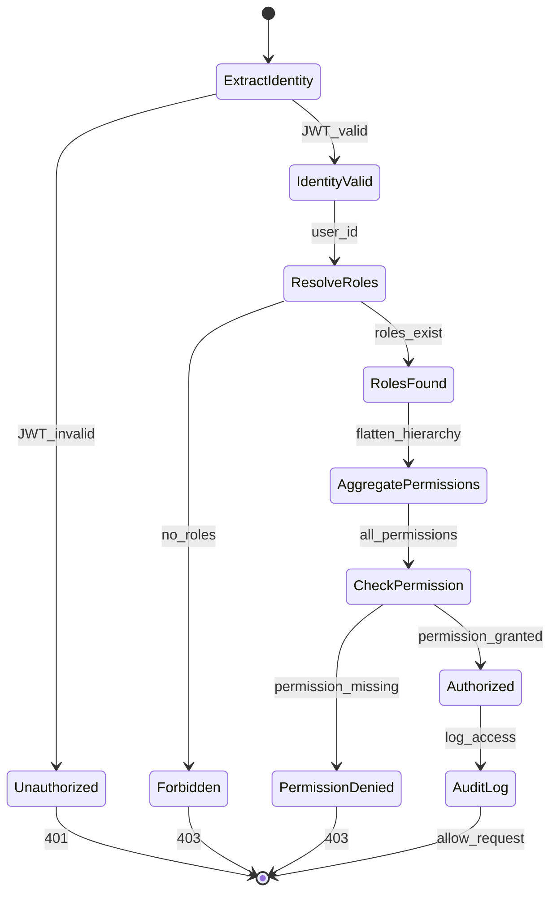

# REQ-003: Role-Based Access Control (RBAC) for Trading Platform

## Document Control

| Item | Details |
|------|---------|
| **Status** | Example/Approved |
| **Version** | 2.0.0 |
| **Date Created** | 2025-01-09 |
| **Priority** | Critical |
| **Category** | Security - Authorization |
| **SPEC-Ready Score** | 95% |

## 1. Description

The system SHALL enforce Role-Based Access Control (RBAC) to protect trading platform resources (APIs, data, operations) from unauthorized access, with role-permission mappings, hierarchical roles, and comprehensive audit logging.

### Context

Trading platform requires fine-grained authorization to: prevent unauthorized trades, protect sensitive financial data, enforce regulatory compliance (SOC2, SOX), enable role separation (trader vs compliance officer), and maintain audit trails for security reviews.

### Use Case Scenario

**Primary Flow**:
1. User authenticates and receives JWT with role claims
2. User requests protected resource (GET /api/orders/{id})
3. Authorization middleware extracts user ID and roles from JWT
4. Middleware queries permission service: does user have 'orders:read' permission?
5. Permission service checks user roles → role permissions mapping
6. If authorized: request proceeds, audit log created
7. If denied: 403 Forbidden returned with reason

**Error Flows**:
- No authentication token → 401 Unauthorized
- Insufficient permissions → 403 Forbidden with required permission
- Role not found → 403 Forbidden

## 3. Interface Specifications

```python
from typing import Protocol
from dataclasses import dataclass
from enum import Enum

class AuthorizationService(Protocol):
    """Protocol for RBAC authorization."""

    def authorize(
        self,
        user_id: str,
        resource: str,
        action: str
    ) -> AuthorizationResult:
        """Check if user authorized for action on resource.

        Args:
            user_id: Unique user identifier
            resource: Resource being accessed (e.g., "orders", "accounts")
            action: Action to perform (e.g., "read", "write", "delete")

        Returns:
            AuthorizationResult with decision and reason

        Raises:
            AuthorizationError: When authorization check fails
        """
        ...

    def check_permission(
        self,
        user_id: str,
        permission: str
    ) -> bool:
        """Check if user has specific permission.

        Args:
            user_id: Unique user identifier
            permission: Permission string (e.g., "orders:read")

        Returns:
            True if user has permission
        """
        ...

    def get_user_permissions(self, user_id: str) -> list[str]:
        """Get all permissions for user (via roles)."""
        ...

class Permission(str, Enum):
    """Predefined permission constants."""
    ORDERS_READ = "orders:read"
    ORDERS_CREATE = "orders:create"
    ORDERS_CANCEL = "orders:cancel"
    ORDERS_ADMIN = "orders:admin"
    ACCOUNTS_READ = "accounts:read"
    ACCOUNTS_WRITE = "accounts:write"
    REPORTS_VIEW = "reports:view"
    REPORTS_EXPORT = "reports:export"
    SYSTEM_ADMIN = "system:admin"

@dataclass
class AuthorizationResult:
    """Result of authorization check."""
    allowed: bool
    reason: str | None
    required_permission: str
    user_roles: list[str]
```

## 4. Data Schemas

### 4.1 RBAC Data Model

```python
from pydantic import BaseModel, Field
from datetime import datetime

class Role(BaseModel):
    """Role definition."""
    role_id: str = Field(..., pattern=r"^ROLE_[A-Z_]+$")
    role_name: str
    description: str
    permissions: list[str]
    parent_role: str | None = None  # For role hierarchy
    created_at: datetime
    active: bool = True

class UserRole(BaseModel):
    """User-role assignment."""
    user_id: str
    role_id: str
    assigned_by: str
    assigned_at: datetime
    expires_at: datetime | None = None

class PermissionCheck(BaseModel):
    """Permission check request."""
    user_id: str = Field(..., pattern=r"^USER_[0-9]+$")
    resource: str = Field(..., min_length=1, max_length=50)
    action: str = Field(..., pattern=r"^(read|write|delete|admin)$")
```

### 4.2 Role Configuration (YAML)

```yaml
# config/roles.yaml
roles:
  - role_id: "ROLE_TRADER"
    role_name: "Trader"
    description: "Standard trader with order execution rights"
    permissions:
      - "orders:read"
      - "orders:create"
      - "orders:cancel"
      - "accounts:read"
      - "reports:view"

  - role_id: "ROLE_SENIOR_TRADER"
    role_name: "Senior Trader"
    description: "Experienced trader with elevated limits"
    parent_role: "ROLE_TRADER"  # Inherits TRADER permissions
    permissions:
      - "orders:modify"  # Additional permission
      - "reports:export"

  - role_id: "ROLE_COMPLIANCE_OFFICER"
    role_name: "Compliance Officer"
    description: "Compliance oversight with read-only access"
    permissions:
      - "orders:read"
      - "accounts:read"
      - "reports:view"
      - "reports:export"
      - "audit:read"

  - role_id: "ROLE_ADMIN"
    role_name: "Administrator"
    description: "Full system access"
    permissions:
      - "system:admin"  # Grants all permissions

permission_inheritance:
  enabled: true  # Enable role hierarchy
  max_depth: 3  # Max inheritance depth
```

### 4.3 Database Schema

```python
from sqlalchemy import Column, String, Boolean, DateTime, ForeignKey, Table
from sqlalchemy.orm import relationship

# Many-to-many: users <-> roles
user_roles = Table(
    'user_roles',
    Base.metadata,
    Column('user_id', String(50), ForeignKey('users.id'), primary_key=True),
    Column('role_id', String(50), ForeignKey('roles.id'), primary_key=True),
    Column('assigned_at', DateTime, nullable=False),
    Column('assigned_by', String(50), nullable=False),
)

# Many-to-many: roles <-> permissions
role_permissions = Table(
    'role_permissions',
    Base.metadata,
    Column('role_id', String(50), ForeignKey('roles.id'), primary_key=True),
    Column('permission', String(100), primary_key=True),
)

class RoleModel(Base):
    """Role model with permissions."""
    __tablename__ = 'roles'

    id = Column(String(50), primary_key=True)
    name = Column(String(100), nullable=False, unique=True)
    description = Column(String(500))
    parent_role_id = Column(String(50), ForeignKey('roles.id'), nullable=True)
    active = Column(Boolean, default=True, nullable=False)
    created_at = Column(DateTime, nullable=False)

    # Relationships
    parent = relationship('RoleModel', remote_side=[id])
    users = relationship('UserModel', secondary=user_roles, back_populates='roles')
```

## 5. Error Handling Specifications

### 5.1 Exception Catalog

| Exception Type | HTTP Code | Error Code | Recovery |
|----------------|-----------|------------|----------|
| `Unauthorized` | 401 | `AUTH_001` | Provide valid credentials |
| `Forbidden` | 403 | `AUTH_002` | Request permission grant |
| `RoleNotFound` | 404 | `AUTH_003` | Check role configuration |
| `PermissionDenied` | 403 | `AUTH_004` | Insufficient privileges |

### 5.2 Authorization Error Response

```python
class AuthorizationError(BaseModel):
    """Authorization error with details."""
    error_code: str
    error_message: str
    required_permission: str
    user_roles: list[str]
    user_permissions: list[str]
    timestamp: datetime
    request_id: str

    class Config:
        json_schema_extra = {
            "examples": [
                {
                    "error_code": "AUTH_004",
                    "error_message": "Permission denied: requires orders:cancel",
                    "required_permission": "orders:cancel",
                    "user_roles": ["ROLE_TRADER"],
                    "user_permissions": ["orders:read", "orders:create"],
                    "timestamp": "2025-01-09T14:30:00Z",
                    "request_id": "req_abc123"
                }
            ]
        }
```

### 5.3 Authorization Decision Flow



## 6. Configuration Specifications

```yaml
# config/authorization.yaml
authorization:
  # RBAC configuration
  rbac:
    enabled: true
    role_hierarchy_enabled: true
    max_role_depth: 3
    cache_permissions: true
    cache_ttl_seconds: 300

  # Permission checks
  enforcement:
    strict_mode: true  # Deny by default
    allow_superuser: true
    superuser_permission: "system:admin"

  # Audit logging
  audit:
    log_all_checks: true
    log_denials: true
    log_grants: false  # Optional: reduce log volume
    retention_days: 90

  # Performance
  performance:
    use_cache: true
    cache_backend: "redis"
    preload_permissions: true
```

## 7. Non-Functional Requirements

| Metric | Target (p95) | Measurement |
|--------|--------------|-------------|
| Authorization Check | <10ms | APM traces |
| Permission Lookup (cached) | <1ms | Redis metrics |
| Permission Lookup (DB) | <50ms | DB query time |

### Security

- **Principle of Least Privilege**: Users granted minimum required permissions
- **Role Separation**: No single role has both trading and compliance admin
- **Audit Trail**: All authorization decisions logged with user/resource/action/result
- **Token Security**: JWT with HS256/RS256, 15-minute expiry, secure storage

## 8. Implementation Guidance

### 8.1 Authorization Middleware

```python
class AuthorizationMiddleware:
    """Middleware for RBAC enforcement."""

    def __init__(self, auth_service: AuthorizationService):
        self.auth_service = auth_service

    async def authorize_request(
        self,
        request: Request,
        required_permission: str
    ) -> None:
        """Authorize HTTP request."""

        # Extract user from JWT
        token = request.headers.get("Authorization", "").replace("Bearer ", "")
        try:
            payload = jwt.decode(token, secret_key, algorithms=["HS256"])
            user_id = payload.get("user_id")
        except jwt.InvalidTokenError:
            raise Unauthorized("Invalid or expired token")

        # Check permission
        result = self.auth_service.authorize(
            user_id=user_id,
            resource=self._extract_resource(request),
            action=self._extract_action(request)
        )

        if not result.allowed:
            self._audit_log_denial(user_id, result)
            raise Forbidden(
                f"Permission denied: requires {result.required_permission}"
            )

        # Audit successful authorization
        self._audit_log_grant(user_id, result)
```

### 8.2 Permission Inheritance Algorithm

```python
def get_all_permissions(role_id: str, visited: set = None) -> set[str]:
    """Get all permissions including inherited from parent roles."""
    if visited is None:
        visited = set()

    if role_id in visited:
        return set()  # Circular dependency guard

    visited.add(role_id)

    role = get_role(role_id)
    permissions = set(role.permissions)

    # Recursively get parent permissions
    if role.parent_role_id:
        parent_perms = get_all_permissions(role.parent_role_id, visited)
        permissions.update(parent_perms)

    return permissions
```

## 9. Acceptance Criteria

- ✅ **AC-001**: Authorized requests succeed (user has required permission)
- ✅ **AC-002**: Unauthorized requests denied (401 for missing token)
- ✅ **AC-003**: Forbidden requests denied (403 for insufficient permission)
- ✅ **AC-004**: Role hierarchy works (child inherits parent permissions)
- ✅ **AC-005**: Superuser bypass (system:admin grants all permissions)
- ✅ **AC-006**: Authorization checks cached (<1ms for repeated checks)
- ✅ **AC-007**: All authorization decisions logged to audit trail

## 10. Verification Methods

**BDD Scenarios**: `features/authorization.feature`
- Authorized user accesses protected resource
- Unauthorized user denied access (403)
- Role hierarchy inheritance
- Superuser access to all resources

**Unit Tests**: `tests/unit/auth/test_authorization_service.py`
- Permission check logic
- Role hierarchy resolution
- Permission aggregation algorithm

**Integration Tests**: `tests/integration/auth/`
- End-to-end authorization with JWT
- Database permission queries
- Cache performance

**Security Tests**: `tests/security/auth/`
- Privilege escalation attempts
- Token tampering detection
- Audit log completeness

## 11. Traceability

### Upstream Sources
- BRD-003: Trading Platform Security Requirements
- PRD-003: Authorization and Access Control
- SYS-003: RBAC System Architecture

### Downstream Artifacts
- SPEC-003: Authorization Service Specification
- BDD-003: Authorization Scenarios

### Code Paths
- `src/auth/authorization_service.py`
- `src/auth/models.py` (Role, Permission models)
- `src/auth/middleware.py` (Authorization middleware)
- `tests/unit/auth/test_authorization_service.py`

## 12. Change History

| Date | Version | Change | Author |
|------|---------|--------|---------|
| 2025-01-09 | 2.0.0 | V2 with comprehensive RBAC patterns | Platform Team |

**SPEC-Ready Checklist**: ✅ Interfaces ✅ Schemas ✅ Errors ✅ Config ✅ Hierarchy ✅ Audit
