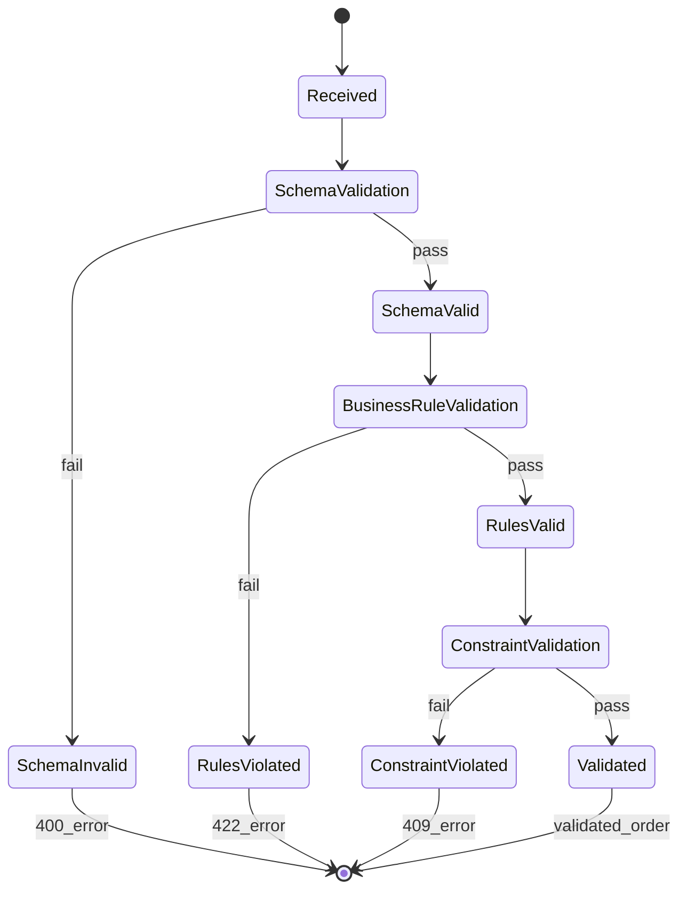

# REQ-002: Trading Order Data Validation

## Document Control

| Item | Details |
|------|---------|
| **Status** | Example/Approved |
| **Version** | 2.0.0 |
| **Date Created** | 2025-01-09 |
| **Priority** | Critical |
| **Category** | Functional - Data Integrity |
| **SPEC-Ready Score** | 95% |

## 1. Description

The system SHALL validate all incoming trading order data against comprehensive schemas, business rules, and constraints before persistence or processing, rejecting invalid data with detailed field-level error messages.

### Context

Trading orders must pass multi-layer validation to prevent: invalid trades execution, regulatory violations, system crashes from malformed data, and data corruption.

### Use Case Scenario

**Primary Flow**:
1. API receives order submission (POST /orders)
2. Validator deserializes JSON to Pydantic model
3. Validator executes field-level validation (type, format, range)
4. Validator executes cross-field validation (stop price logic)
5. Validator executes business rule validation (market hours, position limits)
6. Validator checks database constraints (symbol exists)
7. Valid order passed to processing engine

**Error Flows**:
- Schema violation → 400 with field errors
- Business rule violation → 422 with rule details
- Constraint violation → 409 with constraint info

## 3. Interface Specifications

```python
from typing import Protocol
from dataclasses import dataclass

class OrderValidator(Protocol):
    """Protocol for trading order validation."""

    def validate_schema(self, order_data: dict) -> ValidationResult:
        """Validate order against JSON Schema."""
        ...

    def validate_business_rules(self, order: Order) -> ValidationResult:
        """Validate order against business rules."""
        ...

    def validate_order(self, order_data: dict) -> ValidatedOrder:
        """Execute full validation pipeline."""
        ...

@dataclass
class ValidationError:
    field: str
    message: str
    code: str
    value: any = None

@dataclass
class ValidationResult:
    is_valid: bool
    errors: list[ValidationError]
```

## 4. Data Schemas

### 4.1 JSON Schema

```json
{
  "$schema": "http://json-schema.org/draft-07/schema#",
  "title": "TradingOrder",
  "type": "object",
  "required": ["symbol", "order_type", "side", "quantity"],
  "properties": {
    "symbol": {
      "type": "string",
      "pattern": "^[A-Z]{1,5}$"
    },
    "order_type": {
      "type": "string",
      "enum": ["market", "limit", "stop", "stop_limit"]
    },
    "side": {
      "type": "string",
      "enum": ["buy", "sell"]
    },
    "quantity": {
      "type": "integer",
      "minimum": 1,
      "maximum": 10000
    },
    "limit_price": {
      "type": "number",
      "minimum": 0.01,
      "multipleOf": 0.01
    },
    "stop_price": {
      "type": "number",
      "minimum": 0.01,
      "multipleOf": 0.01
    }
  }
}
```

### 4.2 Pydantic Model with Validators

```python
from pydantic import BaseModel, Field, field_validator, model_validator
from typing import Literal

class TradingOrderModel(BaseModel):
    """Trading order with comprehensive validation."""

    symbol: str = Field(..., pattern=r"^[A-Z]{1,5}$")
    order_type: Literal["market", "limit", "stop", "stop_limit"]
    side: Literal["buy", "sell"]
    quantity: int = Field(..., ge=1, le=10000)
    limit_price: float | None = Field(None, ge=0.01)
    stop_price: float | None = Field(None, ge=0.01)

    @field_validator('limit_price', 'stop_price')
    @classmethod
    def validate_price_precision(cls, v: float | None) -> float | None:
        """Ensure prices have max 2 decimal places."""
        if v is not None and round(v, 2) != v:
            raise ValueError(f"Price must have max 2 decimals: {v}")
        return v

    @model_validator(mode='after')
    def validate_order_type_requirements(self) -> 'TradingOrderModel':
        """Validate required fields based on order type."""
        if self.order_type == "limit" and not self.limit_price:
            raise ValueError("Limit orders require limit_price")
        if self.order_type == "stop" and not self.stop_price:
            raise ValueError("Stop orders require stop_price")
        if self.order_type == "stop_limit":
            if not self.limit_price or not self.stop_price:
                raise ValueError("Stop-limit requires both prices")
        return self

    @model_validator(mode='after')
    def validate_stop_limit_logic(self) -> 'TradingOrderModel':
        """Validate stop price vs limit price logic."""
        if self.order_type == "stop_limit":
            if self.side == "buy" and self.stop_price <= self.limit_price:
                raise ValueError(
                    f"Buy stop-limit: stop_price must be > limit_price"
                )
            if self.side == "sell" and self.stop_price >= self.limit_price:
                raise ValueError(
                    f"Sell stop-limit: stop_price must be < limit_price"
                )
        return self
```

### 4.3 Database Schema

```python
from sqlalchemy import Column, String, Float, Integer, CheckConstraint

class Order(Base):
    """Order model with database constraints."""
    __tablename__ = 'orders'

    id = Column(String(36), primary_key=True)
    symbol = Column(String(5), nullable=False)
    order_type = Column(Enum('market', 'limit', 'stop', 'stop_limit'), nullable=False)
    side = Column(Enum('buy', 'sell'), nullable=False)
    quantity = Column(Integer, nullable=False)
    limit_price = Column(Float, nullable=True)
    stop_price = Column(Float, nullable=True)

    __table_args__ = (
        CheckConstraint('quantity > 0 AND quantity <= 10000'),
        CheckConstraint('limit_price IS NULL OR limit_price > 0'),
        CheckConstraint('stop_price IS NULL OR stop_price > 0'),
    )
```

## 5. Error Handling Specifications

### 5.1 Exception Catalog

| Exception Type | HTTP Code | Error Code | Recovery |
|----------------|-----------|------------|----------|
| `SchemaValidationError` | 400 | `VAL_001` | Fix field errors |
| `BusinessRuleViolation` | 422 | `VAL_002` | Adjust to rules |
| `ConstraintViolation` | 409 | `VAL_003` | Fix constraints |
| `CrossFieldValidationError` | 422 | `VAL_004` | Fix logic error |

### 5.2 Error Response Schema

```python
class FieldError(BaseModel):
    field: str
    message: str
    code: str
    value: any | None = None

class ValidationErrorResponse(BaseModel):
    error_code: str
    error_message: str
    timestamp: datetime
    request_id: str
    field_errors: list[FieldError]
```

### 5.3 Validation State Machine



> **Note on Diagram Labels**: The above flowchart shows the sequential workflow. For formal layer numbers used in cumulative tagging, always reference the 16-layer architecture (Layers 0-15) defined in README.md. Diagram groupings are for visual clarity only.

## 6. Configuration Specifications

```yaml
# config/order_validation.yaml
order_validation:
  schema:
    strict_mode: true
    schema_version: "v1.0"

  business_rules:
    market_hours:
      start: "09:30"
      end: "16:00"
      timezone: "America/New_York"

    position_limits:
      max_shares_per_symbol: 10000
      max_total_exposure_usd: 1000000

  pipeline:
    fail_fast: false
    max_errors_reported: 10
```

## 7. Non-Functional Requirements

| Metric | Target (p95) | Measurement |
|--------|--------------|-------------|
| Single Order Validation | <50ms | APM traces |
| Batch (100 orders) | <2s | Load testing |

## 8. Implementation Guidance

```python
class OrderValidatorImpl:
    """Multi-layer validation pipeline."""

    def validate_order(self, order_data: dict) -> ValidatedOrder:
        # Layer 1: Schema validation
        try:
            order = TradingOrderModel.parse_obj(order_data)
        except ValidationError as e:
            raise SchemaValidationError(e.errors())

        # Layer 2: Business rules
        rule_errors = self._validate_business_rules(order)
        if rule_errors:
            raise BusinessRuleViolation(rule_errors)

        # Layer 3: Database constraints
        constraint_errors = self._validate_constraints(order)
        if constraint_errors:
            raise ConstraintViolation(constraint_errors)

        return ValidatedOrder(**order.dict())
```

## 9. Acceptance Criteria

- ✅ **AC-001**: Valid orders pass all layers (100% acceptance)
- ✅ **AC-002**: Invalid schema rejected with field errors (400 response)
- ✅ **AC-003**: Business rules enforced (422 with details)
- ✅ **AC-004**: Stop-limit logic validated (cross-field check)
- ✅ **AC-005**: Pydantic rejects invalid data (ValidationError)
- ✅ **AC-006**: Database constraints enforced (ConstraintViolation)

## 10. Verification Methods

**BDD Scenarios**: `features/order_validation.feature`
- Valid limit order accepted
- Invalid schema rejected
- Stop-limit logic validation

**Unit Tests**: `tests/unit/validation/test_order_validator.py`
- Schema validation
- Business rule checks
- Cross-field validation

**Integration Tests**: `tests/integration/validation/`
- End-to-end validation pipeline
- Database constraint enforcement

## 11. Traceability

### Upstream Sources
- BRD-002: Trading Platform Business Requirements
- PRD-002: Order Management Product Requirements
- SYS-002: Data Validation System Requirements

### Downstream Artifacts
- SPEC-002: Order Validation Service
- BDD-002: Order Validation Scenarios

### Code Paths
- `src/validation/order_validator.py`
- `src/validation/models.py`
- `tests/unit/validation/test_order_validator.py`

## 12. Change History

| Date | Version | Change | Author |
|------|---------|--------|---------|
| 2025-01-09 | 2.0.0 | V2 with comprehensive validation patterns | Platform Team |

**SPEC-Ready Checklist**: ✅ Interfaces ✅ Schemas ✅ Errors ✅ Config ✅ Rules
