# Traceability Matrix: REQ-001 through REQ-NNN

## Document Control

| Item | Details |
|------|---------|
| Document ID | TRACEABILITY_MATRIX_REQ |
| Title | Comprehensive Requirements Traceability Matrix |
| Status | Active |
| Version | 1.0.0 |
| Date Created | 2025-01-15 |
| Author | Auto-generated |
| Purpose | Track bidirectional traceability for all atomic requirements |
| Generator | generate_traceability_matrix.py |

## 1. Overview

### 1.1 Statistics

- **Total REQ Tracked**: 24 documents
- **Upstream Coverage**: 100.0% (24/24)
- **Downstream Coverage**: 75.0% (18/24)
- **Orphaned Documents**: 0
- **Last Generated**: 2025-01-15 14:45:00

### 1.2 Status Breakdown

- **Approved**: 18 documents (75.0%)
- **In Review**: 4 documents (16.7%)
- **Draft**: 2 documents (8.3%)

## 2. Complete REQ Inventory

| REQ ID | Title | Category | Status | Date | Upstream Sources | Downstream Artifacts |
|---|---|---|---|---|---|---|
| REQ-001 | Service registry MUST support automatic service discovery | service-discovery | Approved | 2024-11-16 | EARS-005, SYS-001, ADR-001 | IMPL-001, CTR-003, SPEC-008 |
| REQ-002 | API gateway MUST route requests based on service path | api-gateway | Approved | 2024-11-16 | EARS-006, SYS-002, ADR-001 | IMPL-001, CTR-004, SPEC-009 |
| REQ-003 | Load balancer MUST distribute traffic using round-robin algorithm | load-balancing | Approved | 2024-11-17 | EARS-007, SYS-001, ADR-001 | IMPL-002, SPEC-010 |
| REQ-004 | Circuit breaker MUST open after 5 conregulatoryutive failures | resilience | Approved | 2024-11-17 | EARS-008, SYS-002, ADR-001 | IMPL-002, SPEC-011 |
| REQ-005 | Database connection pool MUST maintain minimum 10 connections | database | Approved | 2024-11-19 | EARS-010, SYS-003, ADR-002 | IMPL-003, CTR-005, SPEC-012 |
| REQ-006 | Transaction isolation MUST use Read Committed level | database | Approved | 2024-11-19 | EARS-011, SYS-003, ADR-002 | IMPL-003, SPEC-013 |
| REQ-007 | Database backup MUST run daily at 2 AM UTC | database | Approved | 2024-11-19 | EARS-012, SYS-003, ADR-002 | IMPL-003 |
| REQ-008 | Kafka producer MUST use idempotent writes | messaging | Approved | 2024-11-21 | EARS-015, SYS-004, ADR-003 | IMPL-004, CTR-006, SPEC-014 |
| REQ-009 | Message consumer MUST handle duplicate messages | messaging | Approved | 2024-11-21 | EARS-016, SYS-004, ADR-003 | IMPL-004, SPEC-015 |
| REQ-010 | Event schema MUST be versioned using Avro | messaging | Approved | 2024-11-21 | EARS-017, SYS-004, ADR-003 | IMPL-004, CTR-007, SPEC-016 |
| REQ-011 | Kubernetes pod MUST have resource limits defined | deployment | Approved | 2024-11-23 | EARS-020, SYS-005, ADR-004 | IMPL-005, SPEC-017 |
| REQ-012 | Container health check MUST respond within 2 seconds | deployment | Approved | 2024-11-23 | EARS-021, SYS-005, ADR-004 | IMPL-005, SPEC-018 |
| REQ-013 | Rolling update MUST maintain 80% minimum availability | deployment | Approved | 2024-11-23 | EARS-022, SYS-005, ADR-004 | IMPL-005, SPEC-019 |
| REQ-014 | OAuth token MUST expire after 1 hour | authentication | Approved | 2024-11-26 | EARS-025, SYS-006, ADR-005 | IMPL-006, CTR-008, SPEC-020 |
| REQ-015 | Refresh token MUST be rotated on each use | authentication | Approved | 2024-11-26 | EARS-026, SYS-006, ADR-005 | IMPL-006, SPEC-021 |
| REQ-016 | Password MUST meet complexity requirements (12 char min) | authentication | Approved | 2024-11-26 | EARS-027, SYS-006, ADR-005 | IMPL-006, SPEC-022 |
| REQ-017 | GraphQL query MUST validate against schema | api | Approved | 2024-12-02 | EARS-030, SYS-007, ADR-006 | IMPL-007, CTR-009, SPEC-023 |
| REQ-018 | GraphQL query depth MUST not exceed 10 levels | api | Approved | 2024-12-02 | EARS-031, SYS-007, ADR-006 | IMPL-007, SPEC-024 |
| REQ-019 | Cache TTL SHOULD be configurable per data type | caching | In Review | 2024-12-11 | EARS-035, SYS-008, ADR-007 | None |
| REQ-020 | Cache invalidation SHOULD use pub-sub pattern | caching | In Review | 2024-12-11 | EARS-036, SYS-008, ADR-007 | None |
| REQ-021 | Cache hit ratio SHOULD exceed 80% for hot data | caching | In Review | 2024-12-11 | EARS-037, SYS-008, ADR-007 | None |
| REQ-022 | Monitoring dashboard SHOULD display P95 latency | observability | In Review | 2024-12-12 | EARS-040, SYS-009 | None |
| REQ-023 | Log aggregation MAY use structured JSON format | observability | Draft | 2024-12-13 | SYS-009 | None |
| REQ-024 | Distributed tracing MAY implement OpenTelemetry | observability | Draft | 2024-12-13 | SYS-009 | None |

## 3. Upstream Traceability

### 3.1 EARS → REQ Traceability

| EARS ID | EARS Pattern | REQ IDs | REQ Titles (Sample) | Relationship |
|---------|--------------|---------|---------------------|--------------|
| EARS-005 | Event-driven | REQ-001 | Service registry automatic discovery | Formal EARS requirement to atomic REQ |
| EARS-006 | Event-driven | REQ-002 | API gateway request routing | EARS provides testable criteria |
| EARS-007 | State-driven | REQ-003 | Load balancer traffic distribution | EARS defines the behavior state |
| EARS-008 | Unwanted behavior | REQ-004 | Circuit breaker failure threshold | EARS specifies unwanted condition |
| EARS-010 | State-driven | REQ-005 | Database connection pool minimum | EARS defines minimum state |
| EARS-011 | State-driven | REQ-006 | Transaction isolation level | EARS specifies state requirement |
| EARS-012 | Optional | REQ-007 | Database backup schedule | EARS temporal constraint |

### 3.2 SYS → REQ Traceability

| SYS ID | SYS Title | REQ IDs | Total REQs | Relationship |
|--------|-----------|---------|------------|--------------|
| SYS-001 | Service Decomposition | REQ-001, REQ-003 | 2 | System requirement decomposed into atomic requirements |
| SYS-002 | API Communication | REQ-002, REQ-004 | 2 | System requirement broken into specific REQs |
| SYS-003 | Data Persistence | REQ-005, REQ-006, REQ-007 | 3 | Database system requirements decomposed |
| SYS-004 | Asynchronous Messaging | REQ-008, REQ-009, REQ-010 | 3 | Messaging system split into atomic requirements |
| SYS-005 | Container Orchestration | REQ-011, REQ-012, REQ-013 | 3 | Infrastructure requirements decomposed |
| SYS-006 | Identity Management | REQ-014, REQ-015, REQ-016 | 3 | Auth system broken into specific requirements |
| SYS-007 | API Gateway | REQ-017, REQ-018 | 2 | GraphQL system requirements decomposed |
| SYS-008 | Caching Layer | REQ-019, REQ-020, REQ-021 | 3 | Caching requirements decomposed |
| SYS-009 | Observability | REQ-022, REQ-023, REQ-024 | 3 | Observability requirements decomposed |

### 3.3 ADR → REQ Traceability

| ADR ID | ADR Decision | REQ IDs | Relationship |
|--------|--------------|---------|--------------|
| ADR-001 | Microservices Architecture | REQ-001, REQ-002, REQ-003, REQ-004 | Architecture decision drives service requirements |
| ADR-002 | PostgreSQL Database | REQ-005, REQ-006, REQ-007 | Database choice drives data requirements |
| ADR-003 | Kafka Event-Driven | REQ-008, REQ-009, REQ-010 | Messaging technology drives message requirements |
| ADR-004 | Kubernetes Deployment | REQ-011, REQ-012, REQ-013 | Deployment platform drives infrastructure requirements |
| ADR-005 | OAuth 2.0 Authentication | REQ-014, REQ-015, REQ-016 | Auth mechanism drives security requirements |
| ADR-006 | GraphQL API | REQ-017, REQ-018 | API technology drives API requirements |
| ADR-007 | Redis Caching | REQ-019, REQ-020, REQ-021 | Caching technology drives cache requirements |

### 3.4 Upstream Source Summary

| Source Type | Total Sources | REQs Derived | Coverage % |
|-------------|---------------|--------------|------------|
| EARS | 15 | 18 REQs | 75.0% |
| SYS | 9 | 24 REQs | 100.0% |
| ADR | 7 | 21 REQs | 87.5% |

## 4. Downstream Traceability

### 4.1 REQ → IMPL Traceability

| REQ ID | REQ Title | IMPL IDs | IMPL Titles | Relationship |
|--------|-----------|----------|-------------|--------------|
| REQ-001, REQ-002 | Service discovery and routing | IMPL-001 | Microservices Core Infrastructure | Requirements drive implementation plan |
| REQ-003, REQ-004 | Load balancing and resilience | IMPL-002 | Service Mesh Implementation | Requirements define implementation scope |
| REQ-005, REQ-006, REQ-007 | Database requirements | IMPL-003 | PostgreSQL Setup and Configuration | Database requirements drive data implementation |
| REQ-008, REQ-009, REQ-010 | Messaging requirements | IMPL-004 | Kafka Event Bus Implementation | Messaging requirements drive event implementation |
| REQ-011, REQ-012, REQ-013 | Deployment requirements | IMPL-005 | Kubernetes Cluster Setup | Infrastructure requirements drive deployment plan |
| REQ-014, REQ-015, REQ-016 | Auth requirements | IMPL-006 | OAuth 2.0 Identity Server | security requirements drive auth implementation |
| REQ-017, REQ-018 | API requirements | IMPL-007 | GraphQL Gateway Implementation | API requirements drive gateway implementation |

### 4.2 REQ → CTR Traceability

| REQ ID | REQ Title | CTR IDs | CTR Titles | Relationship |
|--------|-----------|---------|------------|--------------|
| REQ-001 | Service discovery | CTR-003 | Service Registry API Contract | Requirement defines contract specification |
| REQ-002 | API routing | CTR-004 | API Gateway Routing Contract | Requirement drives contract definition |
| REQ-005 | Connection pooling | CTR-005 | Database Connection Contract | Requirement specifies contract behavior |
| REQ-008 | Idempotent writes | CTR-006 | Kafka Producer Contract | Requirement defines message contract |
| REQ-010 | Schema versioning | CTR-007 | Event Schema Contract | Requirement drives schema contract |
| REQ-014 | Token expiration | CTR-008 | OAuth Token Contract | Requirement specifies token contract |
| REQ-017 | Query validation | CTR-009 | GraphQL Query Contract | Requirement defines query contract |

### 4.3 REQ → SPEC Traceability

| REQ ID | REQ Title | SPEC IDs | SPEC Titles (Sample) | Relationship |
|--------|-----------|----------|---------------------|--------------|
| REQ-001 | Service discovery | SPEC-008 | Service Registry Technical Specification | Requirement drives technical specification |
| REQ-002 | API routing | SPEC-009 | Gateway Routing Specification | Requirement defines implementation details |
| REQ-003 | Load balancing | SPEC-010 | Load Balancer Configuration | Requirement specifies technical approach |
| REQ-004 | Circuit breaker | SPEC-011 | Circuit Breaker Pattern Implementation | Requirement drives resilience specification |
| REQ-005 | Connection pool | SPEC-012 | Connection Pool Management | Requirement defines pool configuration |
| REQ-006 | Transaction isolation | SPEC-013 | Transaction Management Specification | Requirement specifies isolation implementation |
| REQ-008 | Idempotent writes | SPEC-014 | Kafka Producer Configuration | Requirement drives producer specification |
| REQ-009 | Duplicate handling | SPEC-015 | Message Deduplication Specification | Requirement defines dedup logic |
| REQ-010 | Schema versioning | SPEC-016 | Avro Schema Evolution Specification | Requirement specifies schema management |

## 5. Requirements by Domain

### 5.1 REQ Organization by Domain

| Domain | REQ IDs | Total | Priority Distribution |
|--------|---------|-------|----------------------|
| Service Discovery | REQ-001, REQ-002 | 2 | MUST: 2 |
| Resilience | REQ-003, REQ-004 | 2 | MUST: 2 |
| Database | REQ-005, REQ-006, REQ-007 | 3 | MUST: 3 |
| Messaging | REQ-008, REQ-009, REQ-010 | 3 | MUST: 3 |
| Deployment | REQ-011, REQ-012, REQ-013 | 3 | MUST: 3 |
| Authentication | REQ-014, REQ-015, REQ-016 | 3 | MUST: 3 |
| API | REQ-017, REQ-018 | 2 | MUST: 2 |
| Caching | REQ-019, REQ-020, REQ-021 | 3 | SHOULD: 3 |
| Observability | REQ-022, REQ-023, REQ-024 | 3 | SHOULD: 1, MAY: 2 |

### 5.2 MoSCoW Priority Distribution

| Priority | Count | Percentage | REQ IDs (Sample) |
|----------|-------|------------|------------------|
| **MUST** | 18 | 75.0% | REQ-001 to REQ-018 |
| **SHOULD** | 4 | 16.7% | REQ-019, REQ-020, REQ-021, REQ-022 |
| **COULD** | 0 | 0.0% | None |
| **MAY** | 2 | 8.3% | REQ-023, REQ-024 |

## 6. Requirements Verification Status

### 6.1 REQ Verification Methods

| REQ ID | Verification Method | Test Type | Verification Status |
|--------|---------------------|-----------|---------------------|
| REQ-001 | Integration test | Automated | ✅ Verified |
| REQ-002 | Integration test | Automated | ✅ Verified |
| REQ-003 | Performance test | Automated | ✅ Verified |
| REQ-004 | Chaos test | Automated | ✅ Verified |
| REQ-005 | Unit test | Automated | ✅ Verified |
| REQ-006 | Integration test | Automated | ✅ Verified |
| REQ-007 | Manual test | Manual | ✅ Verified |
| REQ-008 | Integration test | Automated | ✅ Verified |
| REQ-009 | Integration test | Automated | ✅ Verified |
| REQ-010 | Unit test | Automated | ✅ Verified |
| REQ-011 | Integration test | Automated | ✅ Verified |
| REQ-012 | Health check | Automated | ✅ Verified |
| REQ-013 | Deployment test | Automated | ✅ Verified |
| REQ-014 | security test | Automated | ✅ Verified |
| REQ-015 | security test | Automated | ✅ Verified |
| REQ-016 | Unit test | Automated | ✅ Verified |
| REQ-017 | API test | Automated | ✅ Verified |
| REQ-018 | API test | Automated | ✅ Verified |
| REQ-019 | Performance test | Automated | 🟡 Pending |
| REQ-020 | Integration test | Automated | 🟡 Pending |
| REQ-021 | Performance test | Automated | 🟡 Pending |
| REQ-022 | Manual test | Manual | 🟡 Pending |
| REQ-023 | Manual test | Manual | ⏳ Not Started |
| REQ-024 | Integration test | Automated | ⏳ Not Started |

### 6.2 Verification Coverage

| Verification Method | Count | Percentage | Coverage |
|---------------------|-------|------------|----------|
| Automated Tests | 19 | 79.2% | High |
| Manual Tests | 3 | 12.5% | Medium |
| Inspection | 0 | 0.0% | N/A |
| Analysis | 0 | 0.0% | N/A |
| Demonstration | 2 | 8.3% | Low |

## 7. Cross-REQ Dependencies

```mermaid
graph TD
    EARS005[EARS-005] --> REQ001[REQ-001: Service Discovery]
    EARS006[EARS-006] --> REQ002[REQ-002: API Routing]
    EARS010[EARS-010] --> REQ005[REQ-005: Connection Pool]
    EARS015[EARS-015] --> REQ008[REQ-008: Idempotent Writes]

    SYS001[SYS-001: Services] --> REQ001
    SYS001 --> REQ003[REQ-003: Load Balancer]
    SYS002[SYS-002: API] --> REQ002
    SYS002 --> REQ004[REQ-004: Circuit Breaker]
    SYS003[SYS-003: Database] --> REQ005
    SYS003 --> REQ006[REQ-006: Isolation]
    SYS003 --> REQ007[REQ-007: Backup]
    SYS004[SYS-004: Messaging] --> REQ008
    SYS004 --> REQ009[REQ-009: Dedup]
    SYS004 --> REQ010[REQ-010: Schema]

    ADR001[ADR-001: Microservices] --> REQ001
    ADR001 --> REQ002
    ADR002[ADR-002: PostgreSQL] --> REQ005
    ADR003[ADR-003: Kafka] --> REQ008

    REQ001 --> IMPL001[IMPL-001]
    REQ001 --> CTR003[CTR-003]
    REQ001 --> SPEC008[SPEC-008]

    REQ002 --> IMPL001
    REQ005 --> IMPL003[IMPL-003]
    REQ008 --> IMPL004[IMPL-004]

    style REQ001 fill:#e8f5e9
    style REQ002 fill:#e8f5e9
    style REQ005 fill:#e8f5e9
    style REQ008 fill:#e8f5e9
    style REQ019 fill:#fff3e0
    style REQ023 fill:#f3e5f5
```



> **Note on Diagram Labels**: The above flowchart shows the sequential workflow. For formal layer numbers used in cumulative tagging, always reference the 16-layer architecture (Layers 0-15) defined in README.md. Diagram groupings are for visual clarity only.

*Legend: Green = Approved, Orange = In Review, Purple = Draft*

## 8. Gap Analysis

### 8.1 REQs Without Downstream Artifacts

| REQ ID | REQ Title | Status | Gap Type | Recommended Action |
|--------|-----------|--------|----------|-------------------|
| REQ-019 | Cache TTL configuration | In Review | No IMPL/SPEC | Complete review, then create IMPL-008 |
| REQ-020 | Cache invalidation pub-sub | In Review | No IMPL/SPEC | Complete review, then create IMPL-008 |
| REQ-021 | Cache hit ratio target | In Review | No IMPL/SPEC | Complete review, then create IMPL-008 |
| REQ-022 | P95 latency dashboard | In Review | No IMPL/SPEC | Complete review, then create IMPL-009 |
| REQ-023 | Structured JSON logging | Draft | No downstream | Approve draft, then create IMPL-009 |
| REQ-024 | OpenTelemetry tracing | Draft | No downstream | Approve draft, then create IMPL-009 |

### 8.2 Requirements Quality Issues

| Issue Type | REQ IDs | Count | Description |
|------------|---------|-------|-------------|
| Missing verification | None | 0 | All requirements have verification methods |
| Ambiguous phrasing | None | 0 | All requirements use EARS or clear SHALL statements |
| Incomplete traceability | REQ-023, REQ-024 | 2 | Missing ADR upstream source |

## 9. Coverage Metrics

| Metric | Value | Target | Status |
|--------|-------|--------|--------|
| Upstream Traceability | 100.0% | 100% | ✅ |
| Downstream Artifacts | 75.0% | 90% | 🟡 |
| Orphaned Documents | 0 | 0 | ✅ |
| Verification Defined | 100.0% | 100% | ✅ |
| Verification Complete | 75.0% | 90% | 🟡 |

## 10. Validation Commands

```bash
# Validate this matrix
python scripts/validate_traceability_matrix.py --matrix REQ/TRACEABILITY_MATRIX_REQ.md --input REQ/

# Update incrementally
python scripts/update_traceability_matrix.py --matrix REQ/TRACEABILITY_MATRIX_REQ.md --input REQ/

# Generate from scratch
python scripts/generate_traceability_matrix.py --type REQ --input REQ/ --output REQ/TRACEABILITY_MATRIX_REQ.md
```

## 11. Revision History

| Version | Date | Changes | Method |
|---------|------|---------|--------|
| 1.0.0 | 2025-01-15 | Initial auto-generated matrix | generate_traceability_matrix.py |

---

*This matrix was automatically generated. For template, see*
*`REQ-000_TRACEABILITY_MATRIX-TEMPLATE.md`*
