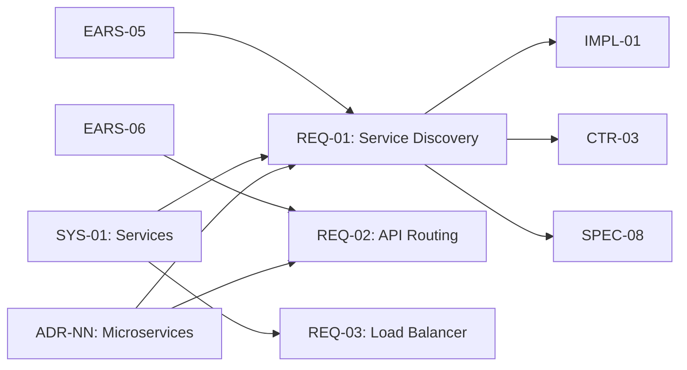

# Traceability Matrix: REQ-01 through REQ-NN

## Document Control

| Item | Details |
|------|---------|
| Document ID | TRACEABILITY_MATRIX_REQ |
| Title | Minimal Requirements Traceability Matrix |
| Status | Active |
| Version | 2.0.0 |
| Date Created | 2025-01-15 |
| Author | Auto-generated |
| Purpose | Demonstrate bidirectional traceability with a compact example |
| Generator | generate_traceability_matrix.py |

## 1. Overview

### 1.1 Statistics

- Total REQ Tracked: 9
- Upstream Coverage: 100% (9/9)
- Downstream Coverage: 78% (7/9)
- Orphaned Documents: 0

### 1.2 Status Breakdown

- Approved: 8
- In Review: 1
- Draft: 0

## 2. Complete REQ Inventory

| REQ ID | Title | Category | Status | Date | Upstream Sources | Downstream Artifacts |
|---|---|---|---|---|---|---|
| REQ-01 | Service registry MUST support automatic service discovery | service-discovery | Approved | 2024-11-16 | EARS-05, SYS-01, ADR-NN | IMPL-01, CTR-03, SPEC-08 |
| REQ-02 | API gateway MUST route requests based on service path | api-gateway | Approved | 2024-11-16 | EARS-06, SYS-02, ADR-NN | IMPL-01, CTR-04, SPEC-09 |
| REQ-03 | Load balancer MUST distribute traffic using round-robin algorithm | load-balancing | Approved | 2024-11-17 | EARS-07, SYS-01, ADR-NN | IMPL-02, SPEC-10 |
| REQ-05 | Database connection pool MUST maintain minimum 10 connections | database | Approved | 2024-11-19 | EARS-10, SYS-03, ADR-NN | IMPL-03, CTR-05, SPEC-12 |
| REQ-08 | Kafka producer MUST use idempotent writes | messaging | Approved | 2024-11-21 | EARS-15, SYS-04, ADR-NN | IMPL-04, CTR-06, SPEC-14 |
| REQ-11 | Kubernetes pod MUST have resource limits defined | deployment | Approved | 2024-11-23 | EARS-20, SYS-05, ADR-NN | IMPL-05, SPEC-17 |
| REQ-14 | OAuth token MUST expire after 1 hour | authentication | Approved | 2024-11-26 | EARS-25, SYS-06, ADR-NN | IMPL-06, CTR-08, SPEC-20 |
| REQ-17 | GraphQL query MUST validate against schema | api | Approved | 2024-12-02 | EARS-30, SYS-07, ADR-NN | IMPL-07, CTR-09, SPEC-23 |
| REQ-19 | Cache TTL SHOULD be configurable per data type | caching | In Review | 2024-12-11 | EARS-35, SYS-08, ADR-NN | None |

## 3. Upstream Traceability

### 3.1 EARS → REQ Traceability

| EARS ID | EARS Pattern | REQ IDs | REQ Titles (Sample) | Relationship |
|---------|--------------|---------|---------------------|--------------|
| EARS-05 | Event-driven | REQ-01 | Service registry automatic discovery | Formal EARS requirement to atomic REQ |
| EARS-06 | Event-driven | REQ-02 | API gateway request routing | EARS provides testable criteria |
| EARS-07 | State-driven | REQ-03 | Load balancer traffic distribution | EARS defines the behavior state |
| EARS-10 | State-driven | REQ-05 | Database connection pool minimum | EARS defines minimum state |

### 3.2 SYS → REQ Traceability

| SYS ID | SYS Title | REQ IDs | Total REQs | Relationship |
|--------|-----------|---------|------------|--------------|
| SYS-01 | Service Decomposition | REQ-01, REQ-03 | 2 | System requirement decomposed into atomic requirements |
| SYS-05 | Container Orchestration | REQ-11 | 1 | Infrastructure requirement decomposed |
| SYS-07 | API Gateway | REQ-17 | 1 | GraphQL system requirement decomposed |

### 3.3 ADR → REQ Traceability

| ADR ID | ADR Decision | REQ IDs | Relationship |
|--------|--------------|---------|--------------|
| ADR-NN | Microservices Architecture | REQ-01, REQ-02, REQ-03 | Architecture decision drives service requirements |
| ADR-NN | OAuth 2.0 Authentication | REQ-14 | Auth mechanism drives security requirements |
| ADR-NN | GraphQL API | REQ-17 | API technology drives API requirements |

## 4. Downstream Traceability

### 4.1 REQ → IMPL Traceability

| REQ ID | REQ Title | IMPL IDs | IMPL Titles | Relationship |
|--------|-----------|----------|-------------|--------------|
| REQ-01, REQ-02 | Service discovery and routing | IMPL-01 | Microservices Core Infrastructure | Requirements drive implementation plan |
| REQ-03 | Load balancing | IMPL-02 | Service Mesh Implementation | Requirement defines implementation scope |
| REQ-11 | Deployment requirements | IMPL-05 | Kubernetes Cluster Setup | Infrastructure requirements drive deployment plan |
| REQ-17 | API requirements | IMPL-07 | GraphQL Gateway Implementation | API requirements drive gateway implementation |

### 4.2 REQ → CTR Traceability

| REQ ID | REQ Title | CTR IDs | CTR Titles | Relationship |
|--------|-----------|---------|------------|--------------|
| REQ-01 | Service discovery | CTR-03 | Service Registry API Contract | Requirement defines contract specification |
| REQ-08 | Idempotent writes | CTR-06 | Kafka Producer Contract | Requirement defines message contract |
| REQ-14 | Token expiration | CTR-08 | OAuth Token Contract | Requirement specifies token contract |

### 4.3 REQ → SPEC Traceability

| REQ ID | REQ Title | SPEC IDs | SPEC Titles (Sample) | Relationship |
|--------|-----------|----------|---------------------|--------------|
| REQ-01 | Service discovery | SPEC-08 | Service Registry Technical Specification | Requirement drives technical specification |
| REQ-03 | Load balancing | SPEC-10 | Load Balancer Configuration | Requirement specifies technical approach |
| REQ-05 | Connection pool | SPEC-12 | Connection Pool Management | Requirement defines pool configuration |
| REQ-17 | Query validation | SPEC-23 | GraphQL Gateway Specification | Requirement defines validation logic |

## 5. Requirements by Domain

### 5.1 REQ Organization by Domain

| Domain | REQ IDs | Total | Priority Distribution |
|--------|---------|-------|----------------------|
| Service Discovery | REQ-01, REQ-02 | 2 | MUST: 2 |
| Resilience | REQ-03 | 1 | MUST: 1 |
| Database | REQ-05 | 1 | MUST: 1 |
| Messaging | REQ-08 | 1 | MUST: 1 |
| Deployment | REQ-11 | 1 | MUST: 1 |
| Authentication | REQ-14 | 1 | MUST: 1 |
| API | REQ-17 | 1 | MUST: 1 |
| Caching | REQ-19 | 1 | SHOULD: 1 |

### 5.2 MoSCoW Priority Distribution

| Priority | Count | Percentage | REQ IDs (Sample) |
|----------|-------|------------|------------------|
| **MUST** | 8 | 88.9% | REQ-01 to REQ-17 |
| **SHOULD** | 1 | 11.1% | REQ-19 |
| **COULD** | 0 | 0.0% | None |
| **MAY** | 0 | 0.0% | None |

## 6. Requirements Verification Status

### 6.1 REQ Verification Methods

| REQ ID | Verification Method | Test Type | Verification Status |
|--------|---------------------|-----------|---------------------|
| REQ-01 | Integration test | Automated | ✅ Verified |
| REQ-03 | Performance test | Automated | ✅ Verified |
| REQ-05 | Unit test | Automated | ✅ Verified |
| REQ-08 | Integration test | Automated | ✅ Verified |
| REQ-14 | Security test | Automated | ✅ Verified |
| REQ-19 | Performance test | Automated | 🟡 Pending |

## 7. Visualization (Mermaid)

## 8. Gap Analysis

### 8.1 REQs Without Downstream Artifacts

| REQ ID | REQ Title | Status | Gap Type | Recommended Action |
|--------|-----------|--------|----------|-------------------|
| REQ-19 | Cache TTL configuration | In Review | No IMPL/SPEC | Complete review, then create IMPL-08 |

