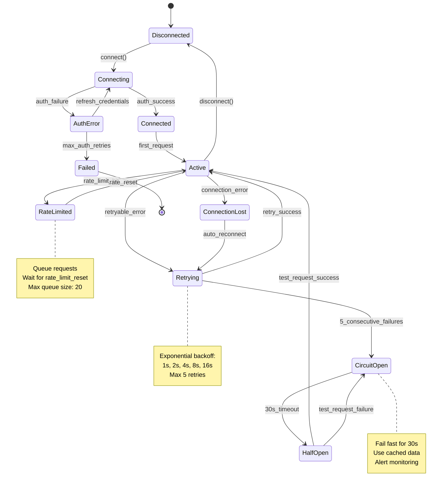

# REQ-001: External API Integration

## Requirements in Development Workflow

**REQ (Atomic Requirements)** ← YOU ARE HERE (Layer 7 - Requirements Layer)

**⚠️ CRITICAL**: Always reference [SPEC_DRIVEN_DEVELOPMENT_GUIDE.md](../../../SPEC_DRIVEN_DEVELOPMENT_GUIDE.md) as the single source of truth for workflow steps, artifact definitions, and quality gates.

For the complete traceability workflow with visual diagram, see: [index.md - Traceability Flow](../../../index.md#traceability-flow)

**Quick Reference**:
```
... → SYS → **REQ** → ADR → BDD → IMPL → CTR → SPEC → TASKS → Code → ...
               ↑
       Requirements Layer
       (Granular, testable, SPEC-ready requirements)
```

**REQ Purpose**: Define atomic, implementable, SPEC-ready requirements
- **Input**: BRD, PRD, SYS, EARS (upstream business/system requirements)
- **Output**: Complete specifications including interfaces, schemas, error handling, and configuration
- **Consumer**: SPEC uses REQ for automated technical specification generation
- **SPEC-Ready Principle**: REQ must contain ALL information needed for SPEC generation without additional inputs

---

## Document Control

| Item | Details |
|------|---------|
| **Status** | Example/Approved |
| **Version** | 2.0.0 |
| **Date Created** | 2025-01-09 |
| **Last Updated** | 2025-11-26 |
| **Author** | Platform Team |
| **Priority** | High |
| **Category** | Functional - External Integration |
| **Source Document** | PRD-001, SYS-001 |
| **Verification Method** | BDD/Integration Test/Contract Test |
| **Assigned Team** | Integration Team |
| **SPEC-Ready Score** | 95% (Target: ≥90%) |

---

## 1. Description

The system SHALL integrate with external API providers to fetch real-time data, historical records, and metadata with tier-appropriate rate limiting, authentication, caching, and circuit breaker protection.

This requirement enables the platform to consume third-party APIs with resilience patterns including exponential backoff retries, circuit breakers, request queueing, and automatic failover to alternative providers.

### Context

External APIs provide critical data required for application functionality. The integration must handle API rate limits (free tier: 5 req/min, premium tier: 75 req/min), transient network failures, API outages, and data format variations across providers.

### Use Case Scenario

**Primary Flow**:
1. Application requests data for identifier "ITEM-001"
2. API client validates request parameters (identifier format, request type)
3. Client checks circuit breaker state and rate limit budget
4. Client sends authenticated HTTP GET request to API endpoint
5. API returns JSON response with data (value, metadata, timestamp)
6. Client validates response against JSON schema
7. Client caches response with configurable TTL
8. Client returns parsed DataResponse to application

**Alternative Flows**:
- **Rate Limit Hit**: When 429 received, client queues request and waits for rate limit reset
- **Connection Timeout**: When request exceeds 30s, client retries with exponential backoff (1s, 2s, 4s, 8s, 16s)
- **Circuit Open**: When 5 consecutive failures detected, circuit opens for 30s, subsequent requests fail fast
- **Invalid Response**: When response fails schema validation, client logs error and raises ValidationError

---

## 2. Functional Requirements

### Primary Functionality

The API client provides asynchronous methods for fetching data with built-in resilience patterns (retry, circuit breaker, rate limiting).

**Required Capabilities**:
- **Data Fetching**: Retrieve real-time data for single identifier with <500ms p95 latency
- **Batch Retrieval**: Fetch data for multiple identifiers concurrently (max 10 concurrent) with result streaming
- **Historical Data**: Retrieve historical records for date ranges with pagination support
- **Connection Management**: Establish/maintain HTTP/2 connection pool with 100 max connections and 60s keepalive
- **Authentication**: Support API key authentication with automatic refresh from Secret Manager

### Business Rules

**Rate Limiting Rules**:
1. **Free Tier**: Limit to 5 requests/minute with request queueing (max queue size: 20)
2. **Premium Tier**: Limit to 75 requests/minute with 10-request burst allowance
3. **Throttle Strategy**: Queue requests when approaching limit, reject with 429 if queue full

**Retry Rules**:
1. **Retryable Errors**: 429 (rate limit), 500, 502, 503, 504 (server errors), connection timeout
2. **Non-Retryable Errors**: 400 (bad request), 401 (unauthorized), 403 (forbidden), 404 (not found)
3. **Retry Schedule**: Exponential backoff with jitter: 1s, 2s, 4s, 8s, 16s (max 5 attempts)

**Circuit Breaker Rules**:
1. **Open Trigger**: 5 consecutive failures within 1-minute window
2. **Cooldown Period**: Circuit stays open for 30 seconds
3. **Half-Open Test**: Allow 1 request to test recovery
4. **Close Trigger**: 2 consecutive successes in half-open state

---

## 3. Interface Specifications

**Purpose**: Define ALL interfaces, method signatures, and contracts required for implementation.

### 3.1 Protocol/Abstract Base Class Definition

```python
from typing import Protocol, AsyncIterator
from abc import ABC, abstractmethod
from dataclasses import dataclass
from datetime import date, datetime

class ExternalAPIClient(Protocol):
    """Protocol defining the contract for external API integration.

    Implementations must provide these methods with exact signatures.
    All methods are async and raise specific exceptions defined in section 5.
    """

    async def connect(
        self,
        credentials: APICredentials,
        timeout: float = 5.0
    ) -> ConnectionResult:
        """Establish connection to external API.

        Args:
            credentials: API authentication credentials
            timeout: Connection timeout in seconds

        Returns:
            ConnectionResult with status, session_id, rate_limit_tier

        Raises:
            ConnectionError: When connection fails after retries
            AuthenticationError: When credentials are invalid
            TimeoutError: When connection exceeds timeout
        """
        ...

    async def get_data(
        self,
        identifier: str,
        retry_config: RetryConfig | None = None
    ) -> DataResponse:
        """Fetch real-time data for single identifier.

        Args:
            identifier: Unique identifier (alphanumeric, 1-20 characters)
            retry_config: Optional retry configuration (uses default if None)

        Returns:
            DataResponse with value, metadata, timestamp

        Raises:
            RateLimitExceeded: When API rate limit is hit
            ValidationError: When identifier format is invalid
            APIError: When API returns error response
            CircuitOpenError: When circuit breaker is open
        """
        ...

    async def get_data_batch(
        self,
        identifiers: list[str],
        max_concurrent: int = 10
    ) -> AsyncIterator[DataResponse]:
        """Fetch data for multiple identifiers concurrently.

        Args:
            identifiers: List of identifiers
            max_concurrent: Maximum concurrent API requests

        Yields:
            DataResponse for each identifier as completed

        Raises:
            RateLimitExceeded: When rate limit exceeded during batch
            ValidationError: When any identifier is invalid
        """
        ...

    async def get_historical(
        self,
        identifier: str,
        start_date: date,
        end_date: date,
        interval: str = "daily"
    ) -> HistoricalDataResponse:
        """Fetch historical data for date range.

        Args:
            identifier: Unique identifier
            start_date: Start date (inclusive)
            end_date: End date (inclusive)
            interval: Data interval (daily, weekly, monthly)

        Returns:
            HistoricalDataResponse with data records

        Raises:
            RateLimitExceeded: When rate limit exceeded
            ValidationError: When dates or interval invalid
            APIError: When API returns error
        """
        ...

    async def disconnect(self) -> DisconnectionResult:
        """Gracefully disconnect from API and cleanup resources.

        Returns:
            DisconnectionResult with cleanup status
        """
        ...

    def get_rate_limit_status(self) -> RateLimitStatus:
        """Get current rate limit status (synchronous).

        Returns:
            RateLimitStatus with remaining requests, reset time
        """
        ...
```

### 3.2 Data Transfer Objects (DTOs)

```python
from dataclasses import dataclass
from datetime import datetime, date
from enum import Enum

class RateLimitTier(str, Enum):
    """API rate limit tiers."""
    FREE = "free"  # 5 req/min
    PREMIUM = "premium"  # 75 req/min
    ENTERPRISE = "enterprise"  # 1000 req/min

@dataclass(frozen=True)
class APICredentials:
    """Credentials for API authentication."""
    api_key: str
    secret_key: str | None = None
    tier: RateLimitTier = RateLimitTier.FREE

@dataclass
class ConnectionResult:
    """Result of API connection attempt."""
    success: bool
    session_id: str | None
    rate_limit_tier: RateLimitTier
    timestamp: datetime
    error_message: str | None = None

@dataclass
class DataResponse:
    """Real-time data response."""
    identifier: str
    value: float
    metadata: dict | None
    timestamp: datetime
    request_id: str

@dataclass
class HistoricalRecord:
    """Historical data for single time period."""
    date: date
    value: float
    metadata: dict | None

@dataclass
class HistoricalDataResponse:
    """Historical data response."""
    identifier: str
    interval: str
    records: list[HistoricalRecord]
    request_id: str

@dataclass
class DisconnectionResult:
    """Result of disconnection."""
    success: bool
    resources_released: bool
    timestamp: datetime

@dataclass
class RateLimitStatus:
    """Current rate limit status."""
    tier: RateLimitTier
    requests_remaining: int
    reset_time: datetime
    requests_made: int
    window_size_seconds: int = 60

@dataclass
class RetryConfig:
    """Retry behavior configuration."""
    max_attempts: int = 5
    initial_delay_seconds: float = 1.0
    max_delay_seconds: float = 60.0
    backoff_multiplier: float = 2.0
    add_jitter: bool = True
```

### 3.3 REST API Endpoints

**Base URL**: `https://api.example.com/v1`

**Authentication**: API Key in header `X-API-Key: {api_key}`

| Endpoint | Method | Request Params | Response Schema | Rate Limit (Free/Premium) |
|----------|--------|----------------|-----------------|---------------------------|
| `/data/{identifier}` | GET | `identifier` (path) | `DataResponse` | 5/min, 75/min |
| `/data/batch` | POST | `identifiers[]` (body) | `DataResponse[]` | 5/min, 75/min |
| `/historical/{identifier}` | GET | `identifier`, `start`, `end`, `interval` (query) | `HistoricalDataResponse` | 5/min, 75/min |

**Example Request**:
```http
GET /v1/data/ITEM-001 HTTP/2
Host: api.example.com
X-API-Key: sk_live_abc123xyz789
Accept: application/json
```

**Example Response**:
```json
{
  "identifier": "ITEM-001",
  "value": 182.50,
  "metadata": {"category": "A", "region": "US"},
  "timestamp": "2025-01-09T14:30:00Z",
  "request_id": "req_abc123"
}
```

---

## 4. Data Schemas

**Purpose**: Define ALL data structures, validation rules, and schemas using standard formats.

### 4.1 JSON Schema Definitions

```json
{
  "$schema": "http://json-schema.org/draft-07/schema#",
  "title": "DataResponse",
  "type": "object",
  "required": ["identifier", "value", "timestamp", "request_id"],
  "properties": {
    "identifier": {
      "type": "string",
      "pattern": "^[A-Z0-9-]{1,20}$",
      "description": "Unique identifier (alphanumeric with hyphens, 1-20 characters)",
      "examples": ["ITEM-001", "USER-123", "ORDER-456"]
    },
    "value": {
      "type": "number",
      "description": "Numeric value with decimal precision"
    },
    "metadata": {
      "type": ["object", "null"],
      "description": "Optional metadata object"
    },
    "timestamp": {
      "type": "string",
      "format": "date-time",
      "description": "ISO 8601 timestamp"
    },
    "request_id": {
      "type": "string",
      "pattern": "^req_[a-z0-9]{6,}$",
      "description": "Unique request identifier"
    }
  },
  "additionalProperties": false
}
```

### 4.2 Pydantic Models with Validators

```python
from pydantic import BaseModel, Field, field_validator, model_validator
from datetime import datetime
from typing import Literal
import re

class DataResponseModel(BaseModel):
    """Data response with comprehensive validation."""

    identifier: str = Field(
        ...,
        min_length=1,
        max_length=20,
        pattern=r"^[A-Z0-9-]{1,20}$",
        description="Unique identifier",
        examples=["ITEM-001", "USER-123"]
    )
    value: float = Field(
        ...,
        description="Numeric value"
    )
    metadata: dict | None = Field(None)
    timestamp: datetime
    request_id: str = Field(..., pattern=r"^req_[a-z0-9]{6,}$")

    @field_validator('identifier')
    @classmethod
    def validate_identifier_format(cls, v: str) -> str:
        """Ensure identifier matches expected format."""
        if not re.match(r'^[A-Z0-9-]{1,20}$', v):
            raise ValueError(
                f"Identifier must be 1-20 alphanumeric characters with hyphens, got: {v}"
            )
        return v

    @model_validator(mode='after')
    def validate_timestamp_not_future(self) -> 'DataResponseModel':
        """Ensure timestamp is not in future."""
        if self.timestamp > datetime.utcnow():
            raise ValueError(
                f"Timestamp cannot be in future: {self.timestamp}"
            )
        return self

    class Config:
        frozen = True  # Immutable after creation


class HistoricalDataRequestModel(BaseModel):
    """Historical data request validation."""

    identifier: str = Field(..., pattern=r"^[A-Z0-9-]{1,20}$")
    start_date: date
    end_date: date
    interval: Literal["daily", "weekly", "monthly"] = "daily"

    @model_validator(mode='after')
    def validate_date_range(self) -> 'HistoricalDataRequestModel':
        """Ensure start_date <= end_date."""
        if self.start_date > self.end_date:
            raise ValueError(
                f"start_date must be <= end_date: "
                f"{self.start_date} > {self.end_date}"
            )
        return self

    @model_validator(mode='after')
    def validate_max_range(self) -> 'HistoricalDataRequestModel':
        """Ensure date range does not exceed 2 years."""
        delta = (self.end_date - self.start_date).days
        if delta > 730:  # ~2 years
            raise ValueError(
                f"Date range exceeds maximum 2 years: {delta} days"
            )
        return self
```

### 4.3 Database Schema (Caching Layer)

```python
from sqlalchemy import Column, Integer, String, Float, DateTime, Index, JSON
from sqlalchemy.ext.declarative import declarative_base
from datetime import datetime

Base = declarative_base()

class CachedData(Base):
    """Cached data model with TTL enforcement."""
    __tablename__ = 'cached_data'

    id = Column(Integer, primary_key=True, autoincrement=True)
    identifier = Column(String(20), nullable=False, index=True)
    value = Column(Float, nullable=False)
    metadata = Column(JSON, nullable=True)
    data_timestamp = Column(DateTime, nullable=False)
    cached_at = Column(DateTime, default=datetime.utcnow, nullable=False)
    ttl_seconds = Column(Integer, default=30, nullable=False)
    request_id = Column(String(50), nullable=False)

    __table_args__ = (
        Index('idx_identifier_cached_at', 'identifier', 'cached_at'),
        Index('idx_cached_at_ttl', 'cached_at', 'ttl_seconds'),
    )

    @property
    def is_expired(self) -> bool:
        """Check if cache entry has exceeded TTL."""
        age_seconds = (datetime.utcnow() - self.cached_at).total_seconds()
        return age_seconds > self.ttl_seconds
```

---

## 5. Error Handling Specifications

**Purpose**: Define ALL error types, recovery strategies, and state transitions.

### 5.1 Exception Catalog

| Exception Type | HTTP Code | Error Code | Retry? | Recovery Strategy |
|----------------|-----------|------------|--------|-------------------|
| `ConnectionError` | 503 | `CONN_001` | Yes (5x) | Exponential backoff: 1s, 2s, 4s, 8s, 16s |
| `AuthenticationError` | 401 | `AUTH_001` | No | Refresh credentials from Secret Manager, alert admin |
| `RateLimitExceeded` | 429 | `RATE_001` | Yes | Queue request, wait for rate_limit_reset |
| `ValidationError` | 400 | `VALID_001` | No | Log detailed error, return to caller with field details |
| `APIError` | 5xx | `API_001` | Yes (5x) | Retry with backoff, fallback to cache if available |
| `TimeoutError` | 504 | `TIMEOUT_001` | Yes (3x) | Retry with increased timeout (30s → 45s → 60s) |
| `CircuitOpenError` | 503 | `CIRCUIT_001` | No | Fail fast, use cached data or alternative provider |
| `NotFoundError` | 404 | `NOTFOUND_001` | No | Return error to caller, log for investigation |

### 5.2 Error Response Schema

```python
from typing import Literal
from pydantic import BaseModel
from datetime import datetime

class ErrorDetail(BaseModel):
    """Detailed error information."""
    field: str | None = None
    message: str
    code: str

class ErrorResponse(BaseModel):
    """Standardized error response structure."""

    error_code: str  # Format: {CATEGORY}_{NUMBER}
    error_message: str
    error_type: Literal[
        "ConnectionError",
        "AuthenticationError",
        "RateLimitExceeded",
        "ValidationError",
        "APIError",
        "TimeoutError",
        "CircuitOpenError",
        "NotFoundError"
    ]
    timestamp: datetime
    request_id: str
    retry_after: int | None = None  # seconds until retry allowed
    details: list[ErrorDetail] | None = None
```

### 5.3 State Machine Diagram

**API Client Connection State Machine**:



### 5.4 Circuit Breaker Configuration

```python
from dataclasses import dataclass
from typing import Tuple

@dataclass
class CircuitBreakerConfig:
    """Circuit breaker thresholds and behavior."""

    # Threshold to open circuit
    failure_threshold: int = 5  # Open after 5 consecutive failures
    failure_window_seconds: int = 60  # Within 60-second window

    # Threshold to close circuit
    success_threshold: int = 2  # Close after 2 consecutive successes

    # Timing
    open_timeout_seconds: float = 30.0  # Circuit stays open for 30s
    half_open_max_calls: int = 1  # Allow 1 test call in half-open

    # Exception filtering
    counted_exceptions: Tuple[type, ...] = (
        ConnectionError,
        TimeoutError,
        APIError,
    )
    ignored_exceptions: Tuple[type, ...] = (
        ValidationError,
        NotFoundError,
    )

    # Monitoring
    alert_on_open: bool = True
    metrics_enabled: bool = True
```

---

## 6. Configuration Specifications

**Purpose**: Define ALL configuration parameters with concrete examples and validation rules.

### 6.1 Configuration Schema (YAML)

```yaml
# config/external_api_client.yaml
external_api:
  # Connection settings
  connection:
    base_url: "https://api.example.com/v1"
    timeout_seconds: 30.0
    max_connections: 100
    keepalive_seconds: 60
    http_version: "HTTP/2"

  # Authentication
  authentication:
    type: "api_key"  # api_key | oauth2
    credentials_source: "secret_manager"
    secret_name: "external_api_key_prod"
    secret_project: "my-project-prod"
    refresh_interval_hours: 24

  # Rate limiting
  rate_limits:
    tier: "premium"  # free | premium | enterprise
    requests_per_minute:
      free: 5
      premium: 75
      enterprise: 1000
    burst_allowance: 10  # Extra requests allowed in burst
    throttle_strategy: "queue"  # queue | reject | wait
    max_queue_size: 20

  # Retry policy
  retry:
    enabled: true
    max_attempts: 5
    initial_delay_seconds: 1.0
    max_delay_seconds: 60.0
    backoff_multiplier: 2.0
    add_jitter: true
    jitter_max_seconds: 0.5
    retryable_status_codes: [429, 500, 502, 503, 504]
    retryable_exceptions:
      - "ConnectionError"
      - "TimeoutError"
      - "RateLimitExceeded"

  # Circuit breaker
  circuit_breaker:
    enabled: true
    failure_threshold: 5
    failure_window_seconds: 60
    success_threshold: 2
    open_timeout_seconds: 30.0
    half_open_max_calls: 1
    alert_on_open: true

  # Caching
  cache:
    enabled: true
    backend: "redis"  # redis | memory
    redis_url: "redis://localhost:6379/0"
    ttl_seconds:
      data: 30
      historical_daily: 3600
      historical_weekly: 86400
      metadata: 86400
    max_size_mb: 512
    eviction_policy: "lru"  # lru | lfu | ttl

  # Monitoring
  monitoring:
    metrics_enabled: true
    logging_level: "INFO"  # DEBUG | INFO | WARNING | ERROR
    trace_sampling_rate: 0.1  # 10% of requests
    alert_on_errors: true
    error_threshold_percent: 5.0
    latency_p95_threshold_ms: 500
```

### 6.2 Environment Variables

| Variable | Type | Required | Default | Description | Example |
|----------|------|----------|---------|-------------|---------|
| `EXTERNAL_API_URL` | string | Yes | - | Base URL for API | `https://api.example.com/v1` |
| `EXTERNAL_API_TIMEOUT` | float | No | 30.0 | Request timeout (seconds) | `30.0` |
| `EXTERNAL_API_RATE_LIMIT` | int | No | 75 | Requests per minute | `75` |
| `EXTERNAL_API_RATE_TIER` | string | No | `premium` | Rate limit tier | `free`, `premium`, `enterprise` |
| `EXTERNAL_API_RETRY_ENABLED` | bool | No | `true` | Enable retry logic | `true`, `false` |
| `EXTERNAL_API_CACHE_TTL` | int | No | 30 | Cache TTL (seconds) | `30` |
| `EXTERNAL_API_CIRCUIT_ENABLED` | bool | No | `true` | Enable circuit breaker | `true`, `false` |
| `SECRET_PROJECT` | string | Yes | - | Project for Secrets | `my-project-prod` |
| `SECRET_NAME` | string | Yes | - | Secret name | `external_api_key_prod` |

---

## 7. Quality Attributes

### Performance

| Metric | Target (p50) | Target (p95) | Target (p99) | Measurement Method |
|--------|--------------|--------------|--------------|-------------------|
| Single Data Response Time | <150ms | <500ms | <1000ms | APM |
| Batch Data Response Time (10 items) | <800ms | <2000ms | <3000ms | Load testing |
| Historical Data Response Time | <1s | <3s | <5s | APM |
| Connection Establishment | <2s | <5s | <10s | Metrics |
| Throughput (Premium Tier) | 75 req/min sustained | 85 req/min burst | - | Load testing |

### Reliability

- **Availability**: 99.5% uptime (excluding API provider downtime)
- **Error Rate**: <0.5% of requests (excluding rate limit and circuit breaker)
- **Retry Success Rate**: >80% of retried requests succeed
- **Cache Hit Rate**: >70% for data requests (30s TTL)
- **Circuit Breaker Recovery**: <60s from open to closed state

### security

- **Authentication**: API key stored in Secret Manager, never logged
- **Transport security**: TLS 1.3 minimum
- **Secrets Rotation**: Automatic credential refresh every 24 hours
- **Input Validation**: All requests validated against Pydantic models
- **Audit Logging**: All API calls logged with request_id (no credentials)

### Scalability

- **Horizontal Scaling**: Support 10-100 instances without coordination
- **Connection Pooling**: Max 100 HTTP/2 connections per instance
- **Concurrent Requests**: Handle 10 concurrent requests per instance
- **Queue Capacity**: Handle 20 queued requests during rate limiting
- **Resource Limits**: CPU <20%, Memory <512MB per instance

---

## 8. Implementation Guidance

**Purpose**: Provide technical approaches, algorithms, and patterns for implementation.

### 8.1 Recommended Architecture Pattern

**Pattern**: Async API Client with Retry, Circuit Breaker, and Rate Limiting

```python
import asyncio
import httpx
from datetime import datetime, timedelta
from typing import AsyncIterator

class ExternalAPIClientImpl:
    """Production implementation with resilience patterns."""

    def __init__(
        self,
        config: ExternalAPIConfig,
        circuit_breaker: CircuitBreaker,
        rate_limiter: RateLimiter,
        cache: Cache
    ):
        self.config = config
        self.circuit_breaker = circuit_breaker
        self.rate_limiter = rate_limiter
        self.cache = cache
        self.http_client = httpx.AsyncClient(
            base_url=str(config.base_url),
            timeout=config.timeout_seconds,
            http2=True,
            limits=httpx.Limits(max_connections=config.max_connections)
        )

    async def get_data(
        self,
        identifier: str,
        retry_config: RetryConfig | None = None
    ) -> DataResponse:
        """Fetch data with caching, retry, and circuit breaker."""

        # 1. Validate input
        if not re.match(r'^[A-Z0-9-]{1,20}$', identifier):
            raise ValidationError(f"Invalid identifier format: {identifier}")

        # 2. Check cache
        if self.cache.enabled:
            cached = await self.cache.get(f"data:{identifier}")
            if cached:
                return DataResponseModel.parse_raw(cached)

        # 3. Check circuit breaker
        if self.circuit_breaker.is_open():
            raise CircuitOpenError("Circuit breaker is open, using cached data")

        # 4. Apply rate limiting
        await self.rate_limiter.acquire()

        # 5. Execute with retry
        retry_cfg = retry_config or self.default_retry_config
        response = await self._fetch_with_retry(
            endpoint=f"/data/{identifier}",
            retry_config=retry_cfg
        )

        # 6. Validate and parse response
        try:
            data = DataResponseModel.parse_obj(response.json())
            self.circuit_breaker.record_success()
        except ValidationError as e:
            self.circuit_breaker.record_failure()
            raise

        # 7. Cache response
        if self.cache.enabled:
            await self.cache.set(
                f"data:{identifier}",
                data.json(),
                ttl=self.config.cache_ttl_seconds
            )

        return data
```

### 8.2 Rate Limiting Algorithm (Token Bucket)

```python
import asyncio
from datetime import datetime, timedelta

class TokenBucketRateLimiter:
    """Token bucket algorithm for rate limiting."""

    def __init__(
        self,
        rate: int,  # tokens per minute
        burst: int = 0  # extra burst capacity
    ):
        self.rate = rate
        self.capacity = rate + burst
        self.tokens = self.capacity
        self.last_refill = datetime.utcnow()
        self.lock = asyncio.Lock()

    async def acquire(self, tokens: int = 1) -> None:
        """Acquire tokens, waiting if necessary."""
        async with self.lock:
            while True:
                now = datetime.utcnow()
                elapsed = (now - self.last_refill).total_seconds()

                # Refill tokens based on elapsed time
                tokens_to_add = int(elapsed * self.rate / 60)
                if tokens_to_add > 0:
                    self.tokens = min(self.capacity, self.tokens + tokens_to_add)
                    self.last_refill = now

                # Check if we have enough tokens
                if self.tokens >= tokens:
                    self.tokens -= tokens
                    return

                # Calculate wait time
                tokens_needed = tokens - self.tokens
                wait_seconds = (tokens_needed * 60) / self.rate

                await asyncio.sleep(wait_seconds)
```

---

## 9. Acceptance Criteria

**Purpose**: Define measurable conditions that prove requirement satisfaction.

### Primary Functional Criteria

- **AC-001**: API connection established within 5 seconds using valid API key
- **AC-002**: Single data retrieval completes within SLA (p95 <500ms)
- **AC-003**: Batch data retrieval (10 items) completes within 2s at p95
- **AC-004**: Rate limiting enforced at tier-specific limits

### Error and Edge Case Criteria

- **AC-005**: Connection failures trigger exponential backoff retry
- **AC-006**: Circuit breaker opens after 5 consecutive failures
- **AC-007**: Circuit breaker closes after 2 successes in half-open state
- **AC-008**: Invalid identifier format raises ValidationError immediately
- **AC-009**: API errors (5xx) retry up to 5 times before failing

### Quality and Constraint Criteria

- **AC-010**: Response time <500ms at p95 under sustained load
- **AC-011**: API keys never logged or exposed in error messages
- **AC-012**: Memory usage <512MB per instance under load

---

## 10. Verification Methods

### Automated Testing

- **BDD Scenarios**: `features/api_integration.feature`
- **Unit Tests**: `tests/unit/api/test_external_api_client.py`
- **Integration Tests**: `tests/integration/api/test_external_api_integration.py`
- **Contract Tests**: `tests/contract/api/test_external_api_contract.py`
- **Performance Tests**: `tests/performance/api/test_external_api_performance.py`

---

## 11. Traceability

### Upstream Sources

| Source Type | Document ID | Document Title | Relevant sections | Relationship |
|-------------|-------------|----------------|-------------------|--------------|
| BRD | BRD-001 | External Integration Business Requirements | section 3: External Data Integration | Business need for external data |
| PRD | PRD-001 | Platform Product Requirements | section 4.2: External APIs | Product feature enabling data consumption |
| SYS | SYS-001 | System Architecture Requirements | section 5: External Integration Layer | System-level API integration patterns |

### Downstream Artifacts

| Artifact Type | Document ID | Title | Relationship |
|---------------|-------------|-------|--------------|
| ADR | ADR-005 | External API Integration Architecture | Resilience pattern selection |
| SPEC | SPEC-001 | External API Client | Technical specification |
| BDD | BDD-001 | API Integration Scenarios | Test scenarios |

### Code Implementation Paths

**Primary Implementation**:
- `src/integrations/external_api_client.py`: Main client implementation
- `src/integrations/models.py`: Pydantic models and DTOs
- `src/integrations/errors.py`: Exception definitions
- `src/integrations/config.py`: Configuration validation
- `src/integrations/circuit_breaker.py`: Circuit breaker implementation
- `src/integrations/rate_limiter.py`: Token bucket rate limiter

**Test Paths**:
- `tests/unit/integrations/test_external_api_client.py`: Unit tests
- `tests/integration/integrations/test_external_api_integration.py`: Integration tests
- `features/api_integration.feature`: BDD scenarios

---

## 12. Change History

| Date | Version | Change | Author |
|------|---------|--------|---------|
| 2025-01-09 | 2.0.0 | Created comprehensive V2 example with interfaces, schemas, errors, config | Platform Team |
| 2025-11-26 | 2.1.0 | Generalized to domain-agnostic example | Platform Team |

**Template Version**: 2.0 (SPEC-Ready)
**SPEC-Ready Checklist Passed**: Interfaces / Schemas / Errors / Config / QAs / Implementation Guidance
