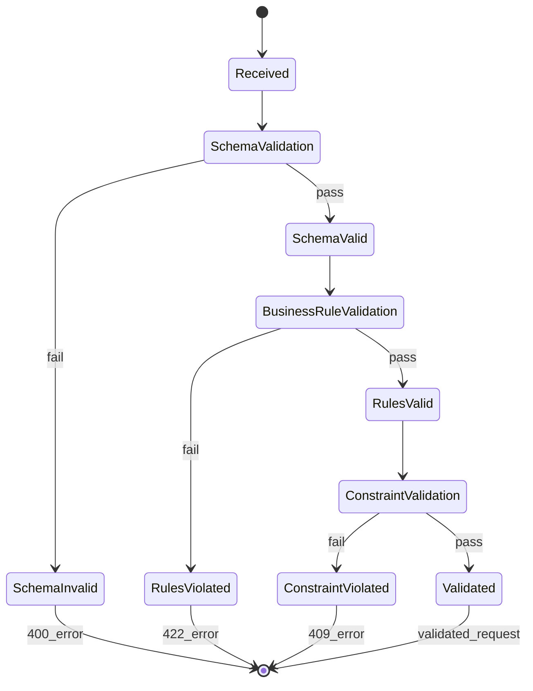

# REQ-002: Request Data Validation

## Document Control

| Item | Details |
|------|---------|
| **Status** | Example/Approved |
| **Version** | 2.0.0 |
| **Date Created** | 2025-01-09 |
| **Priority** | Critical |
| **Category** | Functional - Data Integrity |
| **SPEC-Ready Score** | 95% |

## 1. Description

The system SHALL validate all incoming request data against comprehensive schemas, business rules, and constraints before persistence or processing, rejecting invalid data with detailed field-level error messages.

### Context

Requests must pass multi-layer validation to prevent: invalid operation execution, rule violations, system crashes from malformed data, and data corruption.

### Use Case Scenario

**Primary Flow**:
1. API receives request submission (POST /requests)
2. Validator deserializes JSON to Pydantic model
3. Validator executes field-level validation (type, format, range)
4. Validator executes cross-field validation (conditional logic)
5. Validator executes business rule validation (operating hours, resource limits)
6. Validator checks database constraints (entity exists)
7. Valid request passed to processing engine

**Error Flows**:
- Schema violation → 400 with field errors
- Business rule violation → 422 with rule details
- Constraint violation → 409 with constraint info

## 3. Interface Specifications

```python
from typing import Protocol
from dataclasses import dataclass

class RequestValidator(Protocol):
    """Protocol for request data validation."""

    def validate_schema(self, request_data: dict) -> ValidationResult:
        """Validate request against JSON Schema."""
        ...

    def validate_business_rules(self, request: Request) -> ValidationResult:
        """Validate request against business rules."""
        ...

    def validate_request(self, request_data: dict) -> ValidatedRequest:
        """Execute full validation pipeline."""
        ...

@dataclass
class ValidationError:
    field: str
    message: str
    code: str
    value: any = None

@dataclass
class ValidationResult:
    is_valid: bool
    errors: list[ValidationError]
```

## 4. Data Schemas

### 4.1 JSON Schema

```json
{
  "$schema": "http://json-schema.org/draft-07/schema#",
  "title": "ServiceRequest",
  "type": "object",
  "required": ["identifier", "request_type", "action", "quantity"],
  "properties": {
    "identifier": {
      "type": "string",
      "pattern": "^[A-Z0-9]{1,10}$"
    },
    "request_type": {
      "type": "string",
      "enum": ["standard", "priority", "scheduled", "batch"]
    },
    "action": {
      "type": "string",
      "enum": ["create", "update"]
    },
    "quantity": {
      "type": "integer",
      "minimum": 1,
      "maximum": 10000
    },
    "threshold_value": {
      "type": "number",
      "minimum": 0.01,
      "multipleOf": 0.01
    },
    "trigger_value": {
      "type": "number",
      "minimum": 0.01,
      "multipleOf": 0.01
    }
  }
}
```

### 4.2 Pydantic Model with Validators

```python
from pydantic import BaseModel, Field, field_validator, model_validator
from typing import Literal

class ServiceRequestModel(BaseModel):
    """Service request with comprehensive validation."""

    identifier: str = Field(..., pattern=r"^[A-Z0-9]{1,10}$")
    request_type: Literal["standard", "priority", "scheduled", "batch"]
    action: Literal["create", "update"]
    quantity: int = Field(..., ge=1, le=10000)
    threshold_value: float | None = Field(None, ge=0.01)
    trigger_value: float | None = Field(None, ge=0.01)

    @field_validator('threshold_value', 'trigger_value')
    @classmethod
    def validate_value_precision(cls, v: float | None) -> float | None:
        """Ensure values have max 2 decimal places."""
        if v is not None and round(v, 2) != v:
            raise ValueError(f"Value must have max 2 decimals: {v}")
        return v

    @model_validator(mode='after')
    def validate_request_type_requirements(self) -> 'ServiceRequestModel':
        """Validate required fields based on request type."""
        if self.request_type == "priority" and not self.threshold_value:
            raise ValueError("Priority requests require threshold_value")
        if self.request_type == "scheduled" and not self.trigger_value:
            raise ValueError("Scheduled requests require trigger_value")
        if self.request_type == "batch":
            if not self.threshold_value or not self.trigger_value:
                raise ValueError("Batch requests require both values")
        return self

    @model_validator(mode='after')
    def validate_conditional_logic(self) -> 'ServiceRequestModel':
        """Validate trigger value vs threshold value logic."""
        if self.request_type == "batch":
            if self.action == "create" and self.trigger_value <= self.threshold_value:
                raise ValueError(
                    f"Create batch: trigger_value must be > threshold_value"
                )
            if self.action == "update" and self.trigger_value >= self.threshold_value:
                raise ValueError(
                    f"Update batch: trigger_value must be < threshold_value"
                )
        return self
```

### 4.3 Database Schema

```python
from sqlalchemy import Column, String, Float, Integer, CheckConstraint

class Request(Base):
    """Request model with database constraints."""
    __tablename__ = 'requests'

    id = Column(String(36), primary_key=True)
    identifier = Column(String(10), nullable=False)
    request_type = Column(Enum('standard', 'priority', 'scheduled', 'batch'), nullable=False)
    action = Column(Enum('create', 'update'), nullable=False)
    quantity = Column(Integer, nullable=False)
    threshold_value = Column(Float, nullable=True)
    trigger_value = Column(Float, nullable=True)

    __table_args__ = (
        CheckConstraint('quantity > 0 AND quantity <= 10000'),
        CheckConstraint('threshold_value IS NULL OR threshold_value > 0'),
        CheckConstraint('trigger_value IS NULL OR trigger_value > 0'),
    )
```

## 5. Error Handling Specifications

### 5.1 Exception Catalog

| Exception Type | HTTP Code | Error Code | Recovery |
|----------------|-----------|------------|----------|
| `SchemaValidationError` | 400 | `VAL_001` | Fix field errors |
| `BusinessRuleViolation` | 422 | `VAL_002` | Adjust to rules |
| `ConstraintViolation` | 409 | `VAL_003` | Fix constraints |
| `CrossFieldValidationError` | 422 | `VAL_004` | Fix logic error |

### 5.2 Error Response Schema

```python
class FieldError(BaseModel):
    field: str
    message: str
    code: str
    value: any | None = None

class ValidationErrorResponse(BaseModel):
    error_code: str
    error_message: str
    timestamp: datetime
    request_id: str
    field_errors: list[FieldError]
```

### 5.3 Validation State Machine



> **Note on Diagram Labels**: The above flowchart shows the sequential workflow. For formal layer numbers used in cumulative tagging, always reference the 16-layer architecture (Layers 0-15) defined in README.md. Diagram groupings are for visual clarity only.

## 6. Configuration Specifications

```yaml
# config/request_validation.yaml
request_validation:
  schema:
    strict_mode: true
    schema_version: "v1.0"

  business_rules:
    operating_hours:
      start: "09:00"
      end: "18:00"
      timezone: "America/New_York"

    resource_limits:
      max_quantity_per_request: 10000
      max_total_value: 1000000

  pipeline:
    fail_fast: false
    max_errors_reported: 10
```

## 7. Quality Attributes

| Metric | Target (p95) | Measurement |
|--------|--------------|-------------|
| Single Request Validation | <50ms | APM traces |
| Batch (100 requests) | <2s | Load testing |

## 8. Implementation Guidance

```python
class RequestValidatorImpl:
    """Multi-layer validation pipeline."""

    def validate_request(self, request_data: dict) -> ValidatedRequest:
        # Layer 1: Schema validation
        try:
            request = ServiceRequestModel.parse_obj(request_data)
        except ValidationError as e:
            raise SchemaValidationError(e.errors())

        # Layer 2: Business rules
        rule_errors = self._validate_business_rules(request)
        if rule_errors:
            raise BusinessRuleViolation(rule_errors)

        # Layer 3: Database constraints
        constraint_errors = self._validate_constraints(request)
        if constraint_errors:
            raise ConstraintViolation(constraint_errors)

        return ValidatedRequest(**request.dict())
```

## 9. Acceptance Criteria

- **REQ.02.06.01**: Valid requests pass all layers (100% acceptance)
- **REQ.02.06.02**: Invalid schema rejected with field errors (400 response)
- **REQ.02.06.03**: Business rules enforced (422 with details)
- **REQ.02.06.04**: Conditional logic validated (cross-field check)
- **REQ.02.06.05**: Pydantic rejects invalid data (ValidationError)
- **REQ.02.06.06**: Database constraints enforced (ConstraintViolation)

## 10. Verification Methods

**BDD Scenarios**: `features/request_validation.feature`
- Valid priority request accepted
- Invalid schema rejected
- Conditional logic validation

**Unit Tests**: `tests/unit/validation/test_request_validator.py`
- Schema validation
- Business rule checks
- Cross-field validation

**Integration Tests**: `tests/integration/validation/`
- End-to-end validation pipeline
- Database constraint enforcement

## 11. Traceability

### Upstream Sources
- BRD-002: Platform Business Requirements
- PRD-002: Request Management Product Requirements
- SYS-002: Data Validation System Requirements

### Downstream Artifacts
- SPEC-002: Request Validation Service
- BDD-002: Request Validation Scenarios

### Code Paths
- `src/validation/request_validator.py`
- `src/validation/models.py`
- `tests/unit/validation/test_request_validator.py`

## 12. Change History

| Date | Version | Change | Author |
|------|---------|--------|---------|
| 2025-01-09 | 2.0.0 | V2 with comprehensive validation patterns | Platform Team |

**SPEC-Ready Checklist**: Interfaces | Schemas | Errors | Config | Rules
