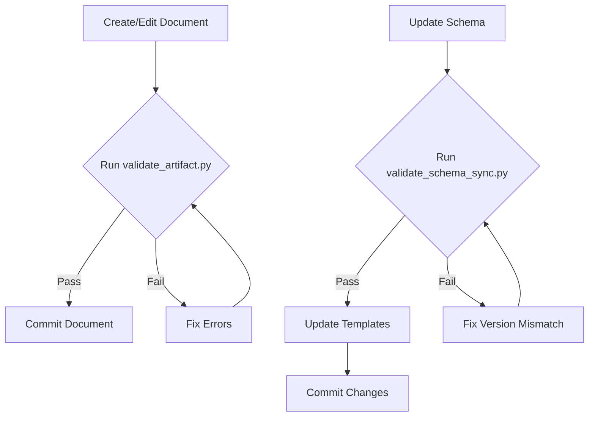

# Schema-Template Relationship Guide

**Version**: 1.0
**Last Updated**: 2025-11-30
**Status**: Active

## Overview

The SDD framework maintains two complementary file types for each artifact type:
- **Templates** (`{TYPE}-TEMPLATE.md/yaml/feature`): Human and AI-readable authoring guides
- **Schemas** (`{TYPE}_SCHEMA.yaml`): Machine-readable validation rules

This guide explains the relationship between these files, cross-reference conventions, and validation tooling.

## Purpose of Separation

### Templates (for Humans and AI)

Templates serve as the primary authoring guide:
- Section structure with placeholders
- Example content and guidance text
- Markdown formatting for readability
- Quick-reference instructions

**Use templates when**: Creating new documents, understanding section requirements, training AI assistants.

### Schemas (for Machines)

Schemas define validation rules:
- Required fields and allowed values
- Pattern matching for IDs and references
- Structural constraints
- Cross-reference requirements

**Use schemas when**: Validating documents, building validation tools, enforcing compliance.

## Cross-Reference Conventions

### Template to Schema Reference

Each template includes schema reference in its YAML frontmatter:

```yaml
custom_fields:
  # ... other fields ...
  schema_reference: "{TYPE}_SCHEMA.yaml"
  schema_version: "1.0"
```

The Document Authority block also references the schema:

```markdown
> **Document Authority**: This is the **PRIMARY STANDARD** for {TYPE} structure.
> - **Schema**: `{TYPE}_SCHEMA.yaml v1.0` - Validation rules
> - **Creation Rules**: `{TYPE}_CREATION_RULES.md` - Usage guidance
> - **Validation Rules**: `{TYPE}_VALIDATION_RULES.md` - Post-creation checks
```

### Schema to Template Reference

Each schema includes a references section at the top:

```yaml
schema_version: "1.0"
artifact_type: {TYPE}
layer: {N}
last_updated: "YYYY-MM-DD"

references:
  template: "{TYPE}-TEMPLATE.md"
  creation_rules: "{TYPE}_CREATION_RULES.md"
  validation_rules: "{TYPE}_VALIDATION_RULES.md"
```

### Special Cases

| Artifact | Template | Schema | Notes |
|----------|----------|--------|-------|
| **BRD** | `BRD-MVP-TEMPLATE.md` | None | Layer 1 entry point, human-authored, no schema required |
| **BDD** | `BDD-MVP-TEMPLATE.feature` | `BDD_SCHEMA.yaml` | Gherkin format, schema reference in comments |
| **SPEC** | `SPEC-MVP-TEMPLATE.yaml` | `SPEC_SCHEMA.yaml` | Both files are YAML, schema reference in comments |

## Version Synchronization

### Version Field Requirements

| File Type | Field | Location | Format |
|-----------|-------|----------|--------|
| Schema | `schema_version` | Top-level YAML | `"1.0"` |
| Template (MD) | `schema_version` | `custom_fields` in frontmatter | `"1.0"` |
| Template (feature) | `SCHEMA_VERSION` | Comment at top | `# SCHEMA_VERSION: 1.0` |
| Template (YAML) | `SCHEMA_VERSION` | Comment at top | `# SCHEMA_VERSION: 1.0` |

### Synchronization Rules

1. **Schema version is authoritative**: Schema files define the canonical version
2. **Templates must match**: Template `schema_version` must match schema `schema_version`
3. **Update both when changing**: When modifying validation rules, update both files
4. **Use validation script**: Run `validate_schema_sync.py` to check synchronization

### When to Update Versions

| Change Type | Version Impact | Action |
|-------------|----------------|--------|
| Add optional field | No version change | Update schema only |
| Add required field | Minor version bump | Update schema, templates, notify users |
| Change allowed values | Minor version bump | Update schema, may need template update |
| Restructure sections | Major version bump | Update both, migration guide needed |
| Bug fix | No version change | Update affected file only |

## Validation Tooling

### Schema-Template Sync Validator

Check that all templates and schemas have matching versions:

```bash
# Basic check
python3 scripts/validate_schema_sync.py

# Verbose output
python3 scripts/validate_schema_sync.py --verbose
```

**Output Example**:
```
Checking schema-template sync in: /path/to/ai_dev_flow
============================================================
  ADR: v1.0 (synced)
  BDD: v1.0 (synced)
  BRD: n/a (no schema - valid)
  CTR: v1.0 (synced)
  ...
============================================================
  All 12 artifact types are synchronized
```

### Unified Artifact Validator

Validate any document against its schema:

```bash
# Validate a single document
python3 scripts/validate_artifact.py 02_PRD/PRD-01_example.md

# Verbose output with details
python3 scripts/validate_artifact.py 02_PRD/PRD-01_example.md --verbose

# Strict mode (treat warnings as errors)
python3 scripts/validate_artifact.py 02_PRD/PRD-01_example.md --strict
```

**Output Example**:
```
  docs/02_PRD/PRD-01_example.md
   Artifact Type: PRD
   Schema: PRD_SCHEMA.yaml
   Layer: 2
   Schema Version: 1.0
   Summary: 0 errors, 2 warnings
```

### Validation Workflow



## Complete Artifact Map

| Layer | Type | Template | Schema | Creation Rules | Validation Rules |
|-------|------|----------|--------|----------------|------------------|
| 1 | BRD | `BRD-MVP-TEMPLATE.md` (default; full archived) | None | `BRD_CREATION_RULES.md` | `BRD_VALIDATION_RULES.md` |
| 2 | PRD | `PRD-MVP-TEMPLATE.md` (default; full archived) | `PRD_SCHEMA.yaml` | `PRD_CREATION_RULES.md` | `PRD_VALIDATION_RULES.md` |
| 3 | EARS | `EARS-MVP-TEMPLATE.md` (default; full archived) | `EARS_SCHEMA.yaml` | `EARS_CREATION_RULES.md` | `EARS_VALIDATION_RULES.md` |
| 4 | BDD | `BDD-MVP-TEMPLATE.feature` | `BDD_SCHEMA.yaml` | `BDD_CREATION_RULES.md` | `BDD_VALIDATION_RULES.md` |
| 5 | ADR | `ADR-MVP-TEMPLATE.md` (default; full archived) | `ADR_SCHEMA.yaml` | `ADR_CREATION_RULES.md` | `ADR_VALIDATION_RULES.md` |
| 6 | SYS | `SYS-MVP-TEMPLATE.md` (default; full archived) | `SYS_SCHEMA.yaml` | `SYS_CREATION_RULES.md` | `SYS_VALIDATION_RULES.md` |
| 7 | REQ | `REQ-MVP-TEMPLATE.md` (default; full archived) | `REQ_SCHEMA.yaml` | `REQ_CREATION_RULES.md` | `REQ_VALIDATION_RULES.md` |
| 8 | IMPL | `IMPL-TEMPLATE.md` | `IMPL_SCHEMA.yaml` | `IMPL_CREATION_RULES.md` | `IMPL_VALIDATION_RULES.md` |
| 9 | CTR | `CTR-MVP-TEMPLATE.md` | `CTR_SCHEMA.yaml` | `CTR_CREATION_RULES.md` | `CTR_VALIDATION_RULES.md` |
| 10 | SPEC | `SPEC-MVP-TEMPLATE.yaml` | `SPEC_SCHEMA.yaml` | `SPEC_CREATION_RULES.md` | `SPEC_VALIDATION_RULES.md` |
| 11 | TASKS | `TASKS-TEMPLATE.md` | `TASKS_SCHEMA.yaml` | `TASKS_CREATION_RULES.md` | `TASKS_VALIDATION_RULES.md` |

## Best Practices

### For Document Authors

1. **Start with template**: Copy the template as your starting point
2. **Preserve frontmatter**: Keep the YAML frontmatter intact, update values
3. **Validate before commit**: Run `validate_artifact.py` on your document
4. **Check references**: Ensure upstream/downstream references exist

### For Framework Maintainers

1. **Schema-first changes**: Update schema before template for validation rules
2. **Template-first changes**: Update template before schema for structural changes
3. **Sync check**: Always run `validate_schema_sync.py` after changes
4. **Version bump**: Update version numbers when making breaking changes
5. **Document changes**: Update this guide when adding new patterns

### For Tool Developers

1. **Schema is truth**: Use schemas as the source of truth for validation
2. **Templates for structure**: Use templates to understand expected document structure
3. **Handle special cases**: BRD has no schema, 04_BDD/SPEC have non-standard formats
4. **Version compatibility**: Check `schema_version` for compatibility

## Troubleshooting

### Common Issues

| Issue | Cause | Solution |
|-------|-------|----------|
| Version mismatch | Template updated without schema | Run `validate_schema_sync.py`, update versions |
| Missing schema_reference | Template missing custom_field | Add `schema_reference` and `schema_version` to frontmatter |
| Validation fails | Document doesn't match schema | Review error messages, update document structure |
| Unknown artifact type | Cannot detect from path/content | Add `artifact_type` to frontmatter custom_fields |

### Getting Help

- **Schema questions**: Check the specific `{TYPE}_SCHEMA.yaml` file
- **Template questions**: Check the specific `{TYPE}-TEMPLATE.md` file
- **Workflow questions**: See `SPEC_DRIVEN_DEVELOPMENT_GUIDE.md`
- **Traceability questions**: See `TRACEABILITY.md`

## References

- [SPEC_DRIVEN_DEVELOPMENT_GUIDE.md](SPEC_DRIVEN_DEVELOPMENT_GUIDE.md) - Complete workflow documentation
- [TRACEABILITY.md](TRACEABILITY.md) - Cross-reference conventions
- [METADATA_TAGGING_GUIDE.md](METADATA_TAGGING_GUIDE.md) - Metadata standards
- [ID_NAMING_STANDARDS.md](ID_NAMING_STANDARDS.md) - Document ID conventions
