# SDD Automation Workflow Plan (Extended)

## Summary

Design an end-to-end automation workflow for the 15-layer SDD framework that produces working source code and a deployable product. Includes human-in-the-loop checkpoints for critical documents (BRD, PRD, ADR, Code Review, Deployment) and automated generation for other layers through validation and deployment. This document complements `ai_dev_flow/MVP_WORKFLOW_GUIDE.md` and `ai_dev_flow/index.md` as an extended automation playbook.

**Plan Date**: 2026-01-17  
**Status**: FINAL REVIEW  
**Scope**: Full L1-L14 pipeline (Documentation → Code → Tests → Validation → Production)
**Automation Level**: 90%+ (14 of 15 layers automated)  
**Human Oversight**: 5 strategic checkpoints (optional if quality score ≥90%)  
**Target Cycle Time**: 1-2 weeks from business idea to production MVP

---

## Requirements

### Human Checkpoints (Optional if Quality Score ≥90%)

| Layer | Checkpoint | Description | Trigger |
|-------|------------|-------------|---------|
| L1 (BRD) | Business Owner | Reviews AI-generated BRD | Score <90% OR strategic decision |
| L2 (PRD) | Product Manager | Reviews AI-generated PRD | Score <90% OR product vision |
| L5 (ADR) | Architect | Reviews AI-generated ADR | Score <90% OR architecture decision |
| L11 (Code) | Developer | Code review before testing | Score <90% OR security concern |
| L13 (Deployment) | Ops | Production deployment approval | Score <90% OR compliance requirement |

> **Quality Gate Auto-Approval**: Artifacts scoring ≥90% can proceed automatically to the next layer without human review. Human checkpoints serve as strategic decision gates, not mandatory review bottlenecks.

### Automated Layers

| Layer | Input | Output |
|-------|-------|--------|
| L3 (EARS) | PRD | EARS requirements |
| L4 (BDD) | EARS | BDD feature files |
| L6 (SYS) | ADR | System requirements |
| L7 (REQ) | SYS | Atomic requirements |
| L8 (CTR) | REQ | Data contracts (OpenAPI) |
| L9 (SPEC) | CTR | Technical specifications (YAML) |
| L10 (TASKS) | SPEC | Task breakdown |
| L12 (Tests) | Code + BDD | Test execution |

---

## MVP Delivery Loop

This workflow enables **continuous product evolution** through rapid MVP cycles:

**The Cycle**:
```
MVP v1.0 → Fix Defects → Production Release
    ↓
MVP v2.0 (New Features) ← Market Feedback
    ↓
Fix Defects → Production
    ↓
MVP v3.0 → Iterate...
```

**How Automation Enables Speed**:
- **L1-L13 automation** reduces manual documentation time by 90%
- **Quality gates** enable auto-approval when score ≥90%
- **Auto-fix testing** (max 3 retries) reduces debugging cycles
- **Complete traceability** enables confident iteration

**Target Timeline**: 1-2 weeks per MVP cycle (idea → production)

---

## Architecture

### Main Workflow Overview


### Phase 2: Document Generation Pipeline (L1-L10)

```mermaid
flowchart LR
    subgraph Planning["Planning Layers"]
        direction TB
        L1[L1:BRD<br/>Gemini→Claude<br/>HUMAN] --> L2[L2:PRD<br/>Claude→Gemini<br/>HUMAN]
        L2 --> L3[L3:EARS<br/>Gemini→Codex<br/>AUTO]
        L3 --> L4[L4:BDD<br/>Claude→Codex<br/>AUTO]
        L4 --> L5[L5:ADR<br/>Gemini→Claude<br/>HUMAN]
    end

    subgraph Design["Design Layers"]
        direction TB
        L6[L6:SYS<br/>Claude→Gemini<br/>AUTO] --> L7[L7:REQ<br/>Gemini→Claude<br/>AUTO]
        L7 --> L8[L8:CTR<br/>Codex→Claude<br/>AUTO]
        L8 --> L9[L9:SPEC<br/>Claude→Gemini<br/>AUTO]
        L9 --> L10[L10:TASKS<br/>Claude→Gemini<br/>AUTO]
    end

    L5 --> L6

    style L1 fill:#ffcdd2
    style L2 fill:#ffcdd2
    style L5 fill:#ffcdd2
```



### Phase 3: Code Generation (L11)


### Phase 4: Test Execution (L12)


### Phase 5: Validation & Deployment (L13)


### Checkpoint Decision Flow

```mermaid
stateDiagram-v2
    [*] --> Generated: AI generates artifact
    Generated --> ScoreCheck: checkpoint layer
    
    ScoreCheck --> AutoApproved: score≥90% + auto_enabled
    ScoreCheck --> HumanReview: score<90% OR human_required
    
    HumanReview --> Approved: APPROVE
    HumanReview --> NeedsRevision: REVISE
    HumanReview --> Stopped: REJECT
    
    AutoApproved --> [*]: proceed to next layer
    NeedsRevision --> Generated: regenerate with feedback
    Approved --> [*]: proceed to next layer
    Stopped --> [*]: workflow terminated
```



---

## Implementation Design

### Plugin Structure (Extended)

**Location**: `.aidev/plugins/sdd-workflow-orchestrator/`

```
sdd-workflow-orchestrator/
├── workflow.sh                    # Main orchestrator script
├── config.yaml                    # Layer configuration & checkpoints
├── state/
│   └── state.yaml                 # Workflow state tracking
├── handlers/
│   ├── checkpoint.sh              # Human review handler
│   ├── auto-chain.sh              # Automated layer executor
│   ├── generate.sh                # Single layer generator
│   ├── validation.sh              # Readiness scorer
│   ├── code-generator.sh          # L11: Code generation handler
│   ├── test-executor.sh           # L12: Test execution handler
│   └── deploy.sh                  # L13: Validation & deployment handler
├── prompts/
│   ├── brd-generator.md
│   ├── prd-generator.md
│   ├── code-generator.md          # Code generation prompt
│   ├── test-generator.md          # Test generation prompt
│   └── ...
└── scripts/
    ├── extract_tags.py            # Tag extraction from code
    ├── validate_tags.py           # Tag validation
    ├── generate_traceability.py   # Traceability matrix generation
    ├── contract_checker.py        # CTR compliance validation
    ├── collect_upstream_tags.py   # Cumulative tag collection
    └── generate_tests_from_bdd.py # BDD to pytest conversion
```

### Configuration (`config.yaml`)

```yaml
layers:
  - id: L1_BRD
    name: "Business Requirements Document"
    checkpoint: human
    input: "business_requirements"
    output: "docs/BRD/"
    generator: "gemini"
    reviewer: "claude"
    min_readiness_score: 90

  - id: L2_PRD
    name: "Product Requirements Document"
    checkpoint: human
    input: "L1_BRD"
    output: "docs/PRD/"
    generator: "claude"
    reviewer: "gemini"
    min_readiness_score: 90

  - id: L3_EARS
    name: "EARS Requirements"
    checkpoint: auto
    input: "L2_PRD"
    output: "docs/EARS/"
    generator: "gemini"
    reviewer: "codex"
    min_readiness_score: 90

  - id: L4_BDD
    name: "BDD Features"
    checkpoint: auto
    input: "L3_EARS"
    output: "docs/BDD/"
    generator: "claude"
    reviewer: "codex"
    min_readiness_score: 90

  - id: L5_ADR
    name: "Architecture Decision Record"
    checkpoint: human
    input: "L4_BDD"
    output: "docs/ADR/"
    generator: "gemini"
    reviewer: "claude"
    min_readiness_score: 90

  - id: L6_SYS
    name: "System Requirements"
    checkpoint: auto
    input: "L5_ADR"
    output: "docs/SYS/"
    generator: "claude"
    reviewer: "gemini"
    min_readiness_score: 90

  - id: L7_REQ
    name: "Atomic Requirements"
    checkpoint: auto
    input: "L6_SYS"
    output: "docs/REQ/"
    generator: "gemini"
    reviewer: "claude"
    min_readiness_score: 90

  - id: L8_CTR
    name: "Data Contracts"
    checkpoint: auto
    input: "L7_REQ"
    output: "docs/CTR/"
    generator: "codex"
    reviewer: "claude"
    min_readiness_score: 90

  - id: L9_SPEC
    name: "Technical Specification"
    checkpoint: auto
    input: "L8_CTR"
    output: "docs/SPEC/"
    generator: "claude"
    reviewer: "gemini"
    min_readiness_score: 90

  - id: L11_TASKS
    name: "Task Breakdown"
    checkpoint: auto
    input: "L9_SPEC"
    output: "docs/TASKS/"
    generator: "claude"
    reviewer: "gemini"
    min_readiness_score: 90

  - id: L11_CODE
    name: "Source Code"
    checkpoint: human
    input: ["L11_TASKS", "L9_SPEC", "L8_CTR"]
    output: "src/"
    generator: "claude"
    reviewer: "codex"
    min_readiness_score: 90
    validation:
      - contract_compliance: true
      - traceability_tags: true
      - syntax_check: true

  - id: L12_TESTS
    name: "Test Execution"
    checkpoint: auto
    input: ["L11_CODE", "L4_BDD"]
    output: "tests/"
    test_frameworks:
      - pytest
      - behave
    min_coverage: 80
    min_pass_rate: 100
    max_retries: 3

  - id: L13_VALIDATION
    name: "Validation & Deployment"
    checkpoint: human
    input: ["L12_TESTS", "L11_CODE"]
    output: "dist/"
    validations:
      - tag_completeness
      - traceability_matrix
      - security_scan
      - build_artifact
    deployment_targets:
      - staging
      - production
```

### State Management (`state.yaml`)

```yaml
workflow:
  id: "SDD-2026-001"
  project: "project-name"
  started: "2026-01-17T10:00:00Z"
    current_layer: 11
    status: "awaiting_code_review"

layers:
  L1_BRD:
    status: "approved"
    file: "docs/BRD/BRD-001.md"
    approved_by: "human"
    approved_at: "2026-01-17T10:30:00Z"
    readiness_score: 95

  L2_PRD:
    status: "approved"
    file: "docs/PRD/PRD-001.md"
    approved_by: "human"
    approved_at: "2026-01-17T11:00:00Z"
    readiness_score: 92

  # ... L3-L10 states ...

  L11_CODE:
    status: "pending_review"
    files:
      - "src/services/auth_service.py"
      - "src/models/user.py"
      - "src/api/routes.py"
    generated_at: "2026-01-17T14:00:00Z"
    contract_compliance: 95
    traceability_score: 100

  L12_TESTS:
    status: "not_started"
    test_results:
      unit_tests: null
      integration_tests: null
      bdd_scenarios: null
    coverage: null

  L13_VALIDATION:
    status: "not_started"
    traceability_matrix: null
    security_scan: null
    build_status: null
    deployment_status: null

checkpoints:
  - layer: "L1_BRD"
    type: "human"
    action: "approved"
  - layer: "L2_PRD"
    type: "human"
    action: "approved"
  - layer: "L5_ADR"
    type: "human"
    action: "approved"
  - layer: "L11_CODE"
    type: "human"
    action: null
  - layer: "L13_VALIDATION"
    type: "human"
    action: null
```

---

## Handler Scripts

### Checkpoint Handler (`handlers/checkpoint.sh`)

```bash
#!/bin/bash
# Human review checkpoint handler

LAYER=$1
DOC_PATH=$2
STATE_FILE=".aidev/plugins/sdd-workflow-orchestrator/state/state.yaml"

# Check readiness score
SCORE=$(yq ".layers.$LAYER.readiness_score" "$STATE_FILE")
MIN_SCORE=$(yq ".layers.$LAYER.min_readiness_score" "$STATE_FILE" || echo "90")

echo "═══════════════════════════════════════════════════════════"
echo " CHECKPOINT: $LAYER"
echo "═══════════════════════════════════════════════════════════"
echo ""
echo "Document: $DOC_PATH"
echo "Readiness Score: $SCORE% (threshold: $MIN_SCORE%)"
echo ""

# Auto-approval if score meets threshold
if (( $(echo "$SCORE >= $MIN_SCORE" | bc -l) )); then
  echo "✅ Quality score ≥${MIN_SCORE}% - Auto-approved"
  yq -i ".layers.$LAYER.status = \"approved\"" "$STATE_FILE"
  yq -i ".layers.$LAYER.approved_by = \"auto\"" "$STATE_FILE"
  yq -i ".layers.$LAYER.approved_at = \"$(date -Iseconds)\"" "$STATE_FILE"
  echo ""
  read -p "Press ENTER to proceed (or type 'review' to manually review): " override
  
  if [ "$override" != "review" ]; then
    echo "Proceeding to next layer..."
    return 0
  fi
fi

# Manual review required
echo "Manual review required:"
echo "Options:"
echo "  [A] APPROVE - Document is satisfactory, proceed to next layer"
echo "  [R] REVISE  - Provide feedback for regeneration"
echo "  [X] REJECT  - Stop workflow, document needs major rework"
echo ""
read -p "Your decision (A/R/X): " decision

case $decision in
  [Aa])
    yq -i ".layers.$LAYER.status = \"approved\"" "$STATE_FILE"
    yq -i ".layers.$LAYER.approved_by = \"human\"" "$STATE_FILE"
    yq -i ".layers.$LAYER.approved_at = \"$(date -Iseconds)\"" "$STATE_FILE"
    echo "✅ $LAYER approved. Proceeding to next layer..."
    ;;
  [Rr])
    read -p "Revision feedback: " feedback
    yq -i ".layers.$LAYER.status = \"needs_revision\"" "$STATE_FILE"
    yq -i ".layers.$LAYER.revision_feedback = \"$feedback\"" "$STATE_FILE"
    echo "🔄 Regenerating $LAYER with feedback..."
    ;;
  [Xx])
    yq -i ".layers.$LAYER.status = \"rejected\"" "$STATE_FILE"
    yq -i ".workflow.status = \"stopped\"" "$STATE_FILE"
    echo "❌ Workflow stopped at $LAYER"
    exit 1
    ;;
esac
```

### Code Generator (`handlers/code-generator.sh`)

```bash
#!/bin/bash
# L11: Code generation handler

STATE=".aidev/plugins/sdd-workflow-orchestrator/state/state.yaml"
PROMPTS=".aidev/plugins/sdd-workflow-orchestrator/prompts"

 echo "═══════════════════════════════════════════════════════════"
 echo " L11: CODE GENERATION"
 echo "═══════════════════════════════════════════════════════════"

# Get input artifacts
TASKS_FILE=$(yq '.layers.L11_TASKS.file' "$STATE")
SPEC_FILE=$(yq '.layers.L9_SPEC.file' "$STATE")
CTR_FILE=$(yq '.layers.L8_CTR.file' "$STATE")
BDD_FILE=$(yq '.layers.L4_BDD.file' "$STATE")

# Collect all upstream traceability tags
echo "📋 Collecting traceability context..."
TRACE_CONTEXT=$(python scripts/collect_upstream_tags.py \
  --brd "$(yq '.layers.L1_BRD.file' "$STATE")" \
  --prd "$(yq '.layers.L2_PRD.file' "$STATE")" \
  --ears "$(yq '.layers.L3_EARS.file' "$STATE")" \
  --bdd "$BDD_FILE" \
  --adr "$(yq '.layers.L5_ADR.file' "$STATE")" \
  --sys "$(yq '.layers.L6_SYS.file' "$STATE")" \
  --req "$(yq '.layers.L7_REQ.file' "$STATE")" \
  --spec "$SPEC_FILE")

echo "🤖 Generating source code from SPEC + TASKS..."

# Generate code using claude with full context
claude --prompt "$(cat $PROMPTS/code-generator.md)

## SPEC (Technical Specification):
$(cat $SPEC_FILE)

## TASKS (Implementation Tasks):
$(cat $TASKS_FILE)

## CTR (Data Contracts):
$(cat $CTR_FILE)

## BDD Scenarios (Test Requirements):
$(cat $BDD_FILE)

## Traceability Tags (MUST include in all docstrings):
$TRACE_CONTEXT

Generate complete Python source code that:
1. Implements ALL SPEC interfaces exactly
2. Complies with CTR data contracts
3. Includes cumulative traceability tags in ALL module/class/function docstrings
4. Passes all BDD scenarios when tested
" --output-dir src/

# Validate generated code
echo "🔍 Validating contract compliance..."
python scripts/contract_checker.py --code src/ --contract "$CTR_FILE"
CONTRACT_SCORE=$?

echo "🔍 Validating traceability tags..."
python scripts/validate_tags.py --source src/ --strict
TAG_SCORE=$?

# Update state
yq -i ".layers.L11_CODE.status = \"pending_review\"" "$STATE"
yq -i ".layers.L11_CODE.contract_compliance = $CONTRACT_SCORE" "$STATE"
yq -i ".layers.L11_CODE.traceability_score = $TAG_SCORE" "$STATE"
yq -i ".layers.L11_CODE.generated_at = \"$(date -Iseconds)\"" "$STATE"

echo "✅ Code generated. Ready for human review."
```

### Test Executor (`handlers/test-executor.sh`)

```bash
#!/bin/bash
# L12: Test execution handler

STATE=".aidev/plugins/sdd-workflow-orchestrator/state/state.yaml"

 echo "═══════════════════════════════════════════════════════════"
 echo " L12: TEST EXECUTION"
 echo "═══════════════════════════════════════════════════════════"

# Generate test files if not exists
BDD_FILE=$(yq '.layers.L4_BDD.file' "$STATE")

echo "🧪 Generating test files from BDD scenarios..."
python scripts/generate_tests_from_bdd.py --bdd "$BDD_FILE" --output tests/

# Run unit tests
echo "🧪 Running unit tests..."
pytest tests/unit/ -v --cov=src --cov-report=html:reports/coverage \
  --cov-report=json:reports/coverage.json 2>&1 | tee reports/unit_tests.log
UNIT_RESULT=$?

# Run integration tests
echo "🧪 Running integration tests..."
pytest tests/integration/ -v 2>&1 | tee reports/integration_tests.log
INTEGRATION_RESULT=$?

# Run BDD scenarios
echo "🧪 Running BDD scenarios..."
behave tests/bdd/ --format json -o reports/bdd_results.json 2>&1 | tee reports/bdd_tests.log
BDD_RESULT=$?

# Check coverage threshold
COVERAGE=$(jq '.totals.percent_covered' reports/coverage.json)
MIN_COVERAGE=80

echo ""
echo "═══════════════════════════════════════════════════════════"
echo " TEST RESULTS SUMMARY"
echo "═══════════════════════════════════════════════════════════"
echo "Unit Tests:        $([ $UNIT_RESULT -eq 0 ] && echo '✅ PASS' || echo '❌ FAIL')"
echo "Integration Tests: $([ $INTEGRATION_RESULT -eq 0 ] && echo '✅ PASS' || echo '❌ FAIL')"
echo "BDD Scenarios:     $([ $BDD_RESULT -eq 0 ] && echo '✅ PASS' || echo '❌ FAIL')"
echo "Coverage:          ${COVERAGE}% (min: ${MIN_COVERAGE}%)"
echo "═══════════════════════════════════════════════════════════"

# Update state
    yq -i ".layers.L12_TESTS.test_results.unit_tests = $UNIT_RESULT" "$STATE"
    yq -i ".layers.L12_TESTS.test_results.integration_tests = $INTEGRATION_RESULT" "$STATE"
    yq -i ".layers.L12_TESTS.test_results.bdd_scenarios = $BDD_RESULT" "$STATE"
    yq -i ".layers.L12_TESTS.coverage = $COVERAGE" "$STATE"

# Check if all tests pass
if [ $UNIT_RESULT -eq 0 ] && [ $INTEGRATION_RESULT -eq 0 ] && [ $BDD_RESULT -eq 0 ]; then
  if (( $(echo "$COVERAGE >= $MIN_COVERAGE" | bc -l) )); then
    yq -i ".layers.L12_TESTS.status = \"completed\"" "$STATE"
    echo "✅ All tests passed. Proceeding to validation..."
    exit 0
  else
    echo "⚠️ Coverage below threshold. Generating additional tests..."
    yq -i ".layers.L12_TESTS.status = \"needs_more_coverage\"" "$STATE"
  fi
else
  echo "❌ Tests failed. Triggering code fix..."
  yq -i ".layers.L12_TESTS.status = \"failed\"" "$STATE"
  exit 1
fi
```

### Deployment Handler (`handlers/deploy.sh`)

```bash
#!/bin/bash
# L13: Validation and deployment handler

STATE=".aidev/plugins/sdd-workflow-orchestrator/state/state.yaml"

 echo "═══════════════════════════════════════════════════════════"
 echo " L13: VALIDATION & DEPLOYMENT"
 echo "═══════════════════════════════════════════════════════════"

# 1. Tag Validation
echo "📋 Validating traceability tags..."
python scripts/validate_tags.py --source src/ docs/ tests/ --strict
TAG_VALID=$?

# 2. Generate Traceability Matrix
echo "📊 Generating traceability matrix..."
python scripts/extract_tags.py --source src/ docs/ tests/ --output docs/generated/tags.json
python scripts/generate_traceability_matrix.py \
  --tags docs/generated/tags.json \
  --output docs/generated/traceability_matrix.md
MATRIX_GEN=$?

# 3. Security Scan
echo "🔒 Running security scan..."
bandit -r src/ -f json -o reports/security_scan.json
SECURITY_RESULT=$?
safety check --json > reports/dependency_scan.json
DEPS_RESULT=$?

# 4. Build Artifact
echo "📦 Building deployment artifact..."
python -m build
BUILD_RESULT=$?

# Summary
echo ""
echo "═══════════════════════════════════════════════════════════"
echo " VALIDATION SUMMARY"
echo "═══════════════════════════════════════════════════════════"
echo "Tag Validation:     $([ $TAG_VALID -eq 0 ] && echo '✅ PASS' || echo '❌ FAIL')"
echo "Traceability Matrix:$([ $MATRIX_GEN -eq 0 ] && echo '✅ GENERATED' || echo '❌ FAIL')"
echo "Security Scan:      $([ $SECURITY_RESULT -eq 0 ] && echo '✅ PASS' || echo '⚠️ WARNINGS')"
echo "Dependency Check:   $([ $DEPS_RESULT -eq 0 ] && echo '✅ PASS' || echo '⚠️ WARNINGS')"
echo "Build:              $([ $BUILD_RESULT -eq 0 ] && echo '✅ SUCCESS' || echo '❌ FAIL')"
echo "═══════════════════════════════════════════════════════════"

# Update state
yq -i ".layers.L13_VALIDATION.tag_validation = $TAG_VALID" "$STATE"
yq -i ".layers.L13_VALIDATION.traceability_matrix = \"docs/generated/traceability_matrix.md\"" "$STATE"
yq -i ".layers.L13_VALIDATION.security_scan = $SECURITY_RESULT" "$STATE"
yq -i ".layers.L13_VALIDATION.build_status = $BUILD_RESULT" "$STATE"

if [ $BUILD_RESULT -eq 0 ]; then
  yq -i ".layers.L13_VALIDATION.status = \"pending_deployment_approval\"" "$STATE"
  echo ""
  echo "🚀 Build successful. Awaiting human approval for deployment."
else
  yq -i ".layers.L13_VALIDATION.status = \"build_failed\"" "$STATE"
  exit 1
fi
```

---

## Main Workflow Script

```bash
#!/bin/bash
# .aidev/plugins/sdd-workflow-orchestrator/workflow.sh

set -e
SCRIPT_DIR="$(cd "$(dirname "${BASH_SOURCE[0]}")" && pwd)"
STATE_FILE="$SCRIPT_DIR/state/state.yaml"
CONFIG_FILE="$SCRIPT_DIR/config.yaml"

main() {
  echo "🚀 SDD Full Automation Workflow Starting..."
  echo "   Scope: L1 (BRD) → L13 (Production Deployment)"
  echo ""

  # ═══════════════════════════════════════════════════════════
  # PHASE 2: Document Generation (L1-L10)
  # ═══════════════════════════════════════════════════════════

  # Phase 2a: BRD (Human Checkpoint)
  echo "═══ Layer 1: BRD Generation ═══"
  ./handlers/generate.sh L1_BRD
  ./handlers/checkpoint.sh L1_BRD "docs/BRD/BRD-001.md"

  # Phase 2b: PRD (Human Checkpoint)
  echo "═══ Layer 2: PRD Generation ═══"
  ./handlers/generate.sh L2_PRD
  ./handlers/checkpoint.sh L2_PRD "docs/PRD/PRD-001.md"

  # Phase 2c: Auto-chain EARS → BDD
  echo "═══ Layers 3-4: Auto-generation ═══"
  ./handlers/auto-chain.sh L3 L4

  # Phase 2d: ADR (Human Checkpoint)
  echo "═══ Layer 5: ADR Generation ═══"
  ./handlers/generate.sh L5_ADR
  ./handlers/checkpoint.sh L5_ADR "docs/ADR/ADR-001.md"

  # Phase 2e: Auto-chain SYS → TASKS
  echo "═══ Layers 6-10: Auto-generation ═══"
  ./handlers/auto-chain.sh L6 L10

  # ═══════════════════════════════════════════════════════════
  # PHASE 3: Code Generation (L11)
  # ═══════════════════════════════════════════════════════════

  echo ""
  echo "═══ Layer 11: Code Generation ═══"
  ./handlers/code-generator.sh
  ./handlers/checkpoint.sh L11_CODE "src/"

  # ═══════════════════════════════════════════════════════════
  # PHASE 4: Test Execution (L12)
  # ═══════════════════════════════════════════════════════════

  echo ""
  echo "═══ Layer 12: Test Execution ═══"

  # Retry loop for failed tests
  MAX_RETRIES=3
  RETRY_COUNT=0

  while [ $RETRY_COUNT -lt $MAX_RETRIES ]; do
    ./handlers/test-executor.sh
    TEST_STATUS=$?

    if [ $TEST_STATUS -eq 0 ]; then
      break
    fi

    RETRY_COUNT=$((RETRY_COUNT + 1))
    echo "⚠️ Tests failed. Attempting fix (retry $RETRY_COUNT/$MAX_RETRIES)..."

    # Auto-fix code based on test failures
    ./handlers/auto-fix.sh
  done

  if [ $TEST_STATUS -ne 0 ]; then
    echo "❌ Tests failed after $MAX_RETRIES attempts. Stopping workflow."
    exit 1
  fi

  # ═══════════════════════════════════════════════════════════
  # PHASE 5: Validation & Deployment (L13)
  # ═══════════════════════════════════════════════════════════

  echo ""
  echo "═══ Layer 14: Validation & Deployment ═══"
  ./handlers/deploy.sh
  ./handlers/checkpoint.sh L13_VALIDATION "dist/"

  # ═══════════════════════════════════════════════════════════
  # COMPLETE
  # ═══════════════════════════════════════════════════════════

  echo ""
  echo "════════════════════════════════════════════════════════════"
  echo "🎉 SDD FULL WORKFLOW COMPLETE!"
  echo "════════════════════════════════════════════════════════════"
  echo ""
  echo "Generated Artifacts:"
  echo "  📄 Documents: docs/BRD/, docs/PRD/, docs/EARS/, docs/BDD/, docs/ADR/"
  echo "                docs/SYS/, docs/REQ/, docs/CTR/, docs/SPEC/, docs/TASKS/"
  echo "  💻 Source:    src/"
  echo "  🧪 Tests:     tests/"
  echo "  📊 Reports:   reports/"
  echo "  📦 Build:     dist/"
  echo ""
  echo "Traceability Matrix: docs/generated/traceability_matrix.md"
  echo ""
  yq '.layers | to_entries[] | "  " + .key + ": " + .value.status' "$STATE_FILE"
}

# Entry point
if [ "$1" == "init" ]; then
  init_workflow
elif [ "$1" == "resume" ]; then
  current=$(yq '.workflow.current_layer' "$STATE_FILE")
  echo "Resuming from layer $current..."
  main
else
  main
fi
```

---

## Code Generation Prompt Template

### `prompts/code-generator.md`

```markdown
# Code Generation Prompt

You are generating Python source code from SDD (Spec-Driven Development) artifacts.

## Requirements

1. **SPEC Compliance**: Implement ALL interfaces defined in the SPEC exactly as specified
2. **Contract Compliance**: All data structures MUST match the CTR (Data Contract) schemas
3. **BDD Validation**: Code MUST pass all BDD scenarios when tested
4. **Traceability Tags**: Include cumulative tags in ALL docstrings:
   - Module-level: All upstream tags (@brd, @prd, @ears, @bdd, @adr, @sys, @req, @ctr, @spec, @tasks)
   - Class-level: Relevant subset of tags
   - Function-level: Specific requirement tags (e.g., @req: REQ.03.26.01)

## Docstring Format

\`\`\`python
"""
Module/Class/Function description.

## Traceability Tags

@brd: BRD.01.01.30
@prd: PRD.03.01.02
@ears: EARS.01.24.03
@bdd: BDD.03.13.01
@adr: ADR-33
@sys: SYS.08.25.01
@req: REQ.03.26.01
@spec: SPEC-03
@tasks: TASKS.01.29.03

"""
\`\`\`

## Output Structure

\`\`\`
src/
├── __init__.py
├── models/
│   ├── __init__.py
│   └── {domain}_models.py
├── services/
│   ├── __init__.py
│   └── {domain}_service.py
├── api/
│   ├── __init__.py
│   └── routes.py
└── utils/
    ├── __init__.py
    └── helpers.py
\`\`\`

Generate complete, production-ready Python code.
```

---

## Integration with Existing Infrastructure

### Agent Mapping (Extended)

| Layer | Existing Plugin | Role |
|-------|-----------------|------|
| L1 BRD | `business-analyst` | Generator |
| L2 PRD | `product-manager` | Generator |
| L3 EARS | `requirements-eng` | Generator |
| L4 BDD | `qa-engineer` | Generator |
| L5 ADR | `architect` | Generator |
| L6 SYS | `sysadmin` | Generator |
| L7 REQ | `tech-analyst` | Generator |
| L8 CTR | `api-designer` | Generator |
| L9 SPEC | `tech-lead` | Generator |
| L10 TASKS | `eng-manager` | Generator |
| **L11 Code** | `senior-dev` | **Code Generator** |
| **L12 Tests** | `test-automation` | **Test Executor** |
| **L13 Validation** | `release-eng` | **Deployment** |

### Skills Usage (Extended)

| Skill | Purpose |
|-------|---------|
| `doc-flow` | Workflow orchestration guidance |
| `doc-validator` | Cross-document validation |
| `trace-check` | Traceability verification |
| `quality-advisor` | Real-time quality feedback |
| `test-automation` | Test generation and execution |
| `code-review` | Code quality review |
| `security-auditor` | Security scanning |

---

## Practical Example: Trading Bot MVP

Let's walk through generating a simple **trading bot** from idea to production using this automation workflow.

### Day 1 Morning: Business Input → Documents (L1-L10)

**Input**: "Build a crypto trading bot using moving average crossover strategy"

**Automated Steps**:
```bash
# Initialize workflow
./workflow.sh init --project "trading-bot" --intent "crypto trading bot MA crossover"

# L1 BRD Generation (AI + Human Review)
# Generated: docs/BRD/BRD-001.md
# Score: 92% → Auto-approved ✅

# L2 PRD Generation (AI + Human Review)
# Generated: docs/PRD/PRD-001.md  
# Score: 94% → Auto-approved ✅

# L3-L4 Auto-chain (EARS → BDD)
# Generated: docs/EARS/EARS-001.md (Score: 95%)
# Generated: docs/BDD/BDD-001.feature (Score: 91%)

# L5 ADR Generation (AI + Architect Review)
# Generated: docs/ADR/ADR-001.md
# Score: 88% → Human review required ⚠️
# Architect approves with minor revisions

# L6-L10 Auto-chain (SYS → TASKS)
# Generated: All layers automatically
# Time: ~2 hours for full documentation stack
```

### Day 1 Afternoon → Day 2: Code → Tests → Deploy (L11-L13)

**Automated Steps**:
```bash
# L11 Code Generation
# Input: SPEC-001.yaml, TASKS-001.md, CTR-001.yaml
# Output: src/trading_bot.py (342 lines)
# Contract compliance: 98% ✅
# Human review: Approved

# L12 Test Execution
# Unit tests: 47/47 passed ✅
# Integration tests: 12/12 passed ✅
# BDD scenarios: 8/8 passed ✅
# Coverage: 87% (threshold: 80%) ✅

# L13 Validation
# Tag validation: ✅
# Security scan: ✅ (0 high, 2 low)
# Build: ✅
# Deploy approval: Human approves → Production

# RESULT: Working trading bot deployed in <2 days
```

### Generated Artifacts

```
trading-bot/
├── docs/
│   ├── BRD/BRD-001.md               (Business requirements)
│   ├── PRD/PRD-001.md               (Product spec)
│   ├── EARS/EARS-001.md             (Engineering requirements)
│   ├── BDD/BDD-001.feature          (Test scenarios)
│   ├── ADR/ADR-001.md               (Tech stack decision)
│   ├── SYS/SYS-001.md               (System architecture)
│   ├── REQ/REQ-001.md ... REQ-015.md (15 atomic requirements)
│   ├── CTR/CTR-001.yaml             (API contracts)
│   ├── SPEC/SPEC-001.yaml           (Technical spec)
│   └── TASKS/TASKS-001.md           (Implementation plan)
├── src/trading_bot.py               (342 lines, 98% contract compliant)
├── tests/                            (87% coverage)
└── dist/trading_bot-1.0.0.whl       (Production artifact)
```

### Key Takeaways

- **Automation**: 14 of 15 layers automated (only L0 Strategy requires manual review)
- **Speed**: <2 days from idea to production
- **Quality**: 98% contract compliance, 87% test coverage
- **Traceability**: Complete tag chain from BRD to code
- **Human Time**: ~3 hours (reviews only), vs ~40 hours manual

---

## Files to Create

### New Files
```
.aidev/plugins/sdd-workflow-orchestrator/
├── workflow.sh                      # Extended main orchestrator
├── config.yaml                      # Extended configuration
├── handlers/
│   ├── checkpoint.sh
│   ├── auto-chain.sh
│   ├── generate.sh
│   ├── validation.sh
│   ├── code-generator.sh            # NEW: L11 handler
│   ├── test-executor.sh             # NEW: L12 handler
│   ├── deploy.sh                    # NEW: L13 handler
│   └── auto-fix.sh                  # NEW: Auto-fix failed tests
├── prompts/
│   ├── code-generator.md            # NEW: Code generation prompt
│   ├── test-generator.md            # NEW: Test generation prompt
│   └── ...
├── scripts/
│   ├── extract_tags.py              # Tag extraction
│   ├── validate_tags.py             # Tag validation
│   ├── generate_traceability.py     # Matrix generation
│   ├── contract_checker.py          # CTR compliance
│   ├── collect_upstream_tags.py     # NEW: Cumulative tag collection
│   └── generate_tests_from_bdd.py   # NEW: BDD to pytest conversion
└── state/
    └── .gitkeep
```

### Modifications to Existing Files
```
.aidev/scripts/scaffold_swarm.sh     # Add L11-L13 workflows
.aidev/docs/AGENT_SWARM.md           # Document extended workflow
work_plans/SDD_AUTOMATION_WORKFLOW.svg  # Update diagram
```

---

## Layer Generation Workflow (LGW)

### Overview

Each layer in the SDD framework follows a standardized 12-step generation workflow. This workflow ensures consistent, validated artifact generation with traceability compliance.

**Workflow ID**: LGW-{LAYER_ID}
**Applies to**: All layers L1-L13

---

### LGW State Machine


---

### LGW Step Definitions

#### Step 1: Upstream Document Review (S1_UPSTREAM_REVIEW)

**Purpose**: Establish context from all upstream dependencies.

**Process**:
1. Identify upstream layers from `config.yaml` input field
2. Read all upstream documents in dependency order
3. Extract traceability tags for cumulative propagation
4. Build context map with requirement IDs, decisions, constraints

**Inputs**:
| Upstream Layer | Required Artifacts |
|----------------|-------------------|
| L1 BRD | `docs/BRD/BRD-*.md` |
| L2 PRD | `docs/PRD/PRD-*.md` |
| L{n-1} | All preceding layer artifacts |

**Outputs**:
- `state/context/{LAYER_ID}_upstream_context.json`
- Cumulative tag list

**Exit Criteria**:
- All upstream documents readable
- Context map populated
- Tag inheritance chain complete

---

#### Step 2: Generation Plan Creation (S2_GENERATION_PLAN)

**Purpose**: Define file generation order and batch structure.

**Process**:
1. Analyze upstream context for artifact requirements
2. Determine output file count based on framework rules
3. Define creation order (dependencies first)
4. Group files into batches (max 5 files per batch)
5. Assign batch execution order

**Plan Structure**:
```yaml
generation_plan:
  layer: L{N}_{TYPE}
  total_files: N
  batches:
    - batch_id: 1
      order: 1
      files:
        - name: "{TYPE}-001_{slug}.md"
          template: "{TYPE}-TEMPLATE.md"
          upstream_refs: [REF-001, REF-002]
        - name: "{TYPE}-002_{slug}.md"
          template: "{TYPE}-TEMPLATE.md"
          upstream_refs: [REF-003]
    - batch_id: 2
      order: 2
      files:
        - name: "{TYPE}-003_{slug}.md"
          depends_on: ["{TYPE}-001", "{TYPE}-002"]
```

**Output**: `state/plans/{LAYER_ID}_generation_plan.yaml`

---

#### Step 3: Plan Review Pass 1 (S3_PLAN_REVIEW_1)

**Purpose**: Identify and fix structural errors in generation plan.

**Validation Checks**:
| Check | Criteria |
|-------|----------|
| File naming | Compliant with ID_NAMING_STANDARDS.md |
| Template reference | Template exists in `ai_dev_flow/{TYPE}/` |
| Upstream refs | All referenced IDs exist in upstream documents |
| Batch ordering | Dependencies resolved before dependents |
| Completeness | All required artifacts covered |

**Process**:
1. Parse generation plan YAML
2. Execute each validation check
3. Log errors to `state/errors/{LAYER_ID}_plan_errors_p1.log`
4. Apply fixes for identified errors
5. Regenerate plan if structural changes required

**Exit Criteria**: Zero errors in validation log

---

#### Step 4: Plan Review Pass 2 (S4_PLAN_REVIEW_2)

**Purpose**: Fresh review to catch errors missed in first pass.

**Process**:
1. Clear previous validation cache
2. Re-read generation plan from disk
3. Execute all validation checks from Step 3
4. Cross-reference with upstream document changes
5. Validate traceability tag coverage

**Additional Checks**:
- No orphaned references
- No circular dependencies
- Batch size limits enforced
- Execution order deterministic

**Output**: `state/errors/{LAYER_ID}_plan_errors_p2.log`

**Exit Criteria**: Zero errors, plan stable

---

#### Step 5: Index File Creation (S5_INDEX_CREATION)

**Purpose**: Create layer index for navigation and traceability.

**Index Structure**:
```markdown
# {TYPE} Index

## Layer: L{N} - {Layer Name}

### Artifacts

| ID | Title | Status | Upstream Refs |
|----|-------|--------|---------------|
| {TYPE}-001 | {Title} | pending | REF-001, REF-002 |
| {TYPE}-002 | {Title} | pending | REF-003 |

### Batch Summary

| Batch | Files | Status |
|-------|-------|--------|
| 1 | {TYPE}-001, {TYPE}-002 | pending |
| 2 | {TYPE}-003 | pending |

### Cross-References
- Upstream: L{N-1} {PREV_TYPE}
- Downstream: L{N+1} {NEXT_TYPE}
```

**Output**: `docs/{TYPE}/index.md`

**Review Process**:
1. Generate index from generation plan
2. Validate all IDs match plan
3. Verify status tracking fields
4. Check cross-reference accuracy

---

#### Step 6: Index-Plan Synchronization (S6_INDEX_PLAN_SYNC)

**Purpose**: Ensure consistency between generation plan and index.

**Synchronization Checks**:
| Element | Plan Field | Index Field |
|---------|------------|-------------|
| File count | `total_files` | Table row count |
| File IDs | `files[].name` | ID column |
| Batch assignment | `batches[].files` | Batch Summary |
| Upstream refs | `files[].upstream_refs` | Upstream Refs column |

**Process**:
1. Parse generation plan
2. Parse index file
3. Compare element by element
4. Log discrepancies to `state/errors/{LAYER_ID}_sync_errors.log`
5. Auto-fix index if plan is source of truth
6. Regenerate index if discrepancies exceed threshold (>3)

**Exit Criteria**: Zero discrepancies

---

#### Step 7: Dry-Run Validation (S7_DRY_RUN)

**Purpose**: Validate generation without creating files.

**Process**:
```bash
# Pseudo-code for dry-run
for batch in generation_plan.batches:
    for file in batch.files:
        # Validate template exists
        check_template_exists(file.template)

        # Validate output path writable
        check_path_writable(file.output_path)

        # Validate upstream refs accessible
        for ref in file.upstream_refs:
            check_ref_accessible(ref)

        # Simulate content generation (no write)
        content = generate_content_preview(file, dry_run=True)

        # Validate content structure
        validate_structure(content, file.template)

        # Log dry-run result
        log_dry_run_result(file, status)
```

**Output**: `state/dry_run/{LAYER_ID}_dry_run_results.yaml`

**Exit Criteria**:
- All templates accessible
- All paths writable
- All upstream refs valid
- Content structure validates

---

#### Step 8: First File Generation (S8_FIRST_FILE)

**Purpose**: Generate and validate single file before batch execution.

**Process**:
1. Select first file from batch 1
2. Generate content using template and context
3. Write to output path
4. Execute validation suite:
   - ID naming compliance
   - Template structure adherence
   - Traceability tag presence
   - Upstream reference validity
   - Markdown syntax validation
5. If errors, fix and regenerate
6. Log validation results

**Validation Suite**:
| Validator | Criteria |
|-----------|----------|
| `validate_id_naming.py` | ID format matches `{TYPE}-NNN` |
| `validate_template.py` | All required sections present |
| `validate_tags.py` | Traceability tags populated |
| `validate_refs.py` | All `@{type}: ID` refs exist |
| `validate_markdown.py` | Valid markdown syntax |

**Output**: First artifact file in `docs/{TYPE}/`

**Exit Criteria**: First file passes all validators

---

#### Step 9: Batch Generation with Sub-Agents (S9_BATCH_GENERATION)

**Purpose**: Parallel generation of remaining files using sub-agents.

**Sub-Agent Orchestration**:


**Process**:
1. Spawn sub-agents (1 per batch, max concurrent: 3)
2. Each sub-agent:
   - Reads assigned batch from generation plan
   - Generates each file in batch
   - Validates each file immediately after generation
   - Reports status to orchestrator
3. Orchestrator updates generation plan with progress:
   ```yaml
   progress:
     batch_1: complete
     batch_2: in_progress
     batch_3: pending
   ```
4. On batch completion, update index file status
5. Continue until all batches complete

**Error Handling**:
- If file generation fails: retry 2 times
- If validation fails: fix and retry
- If batch fails: log and continue with next batch
- Track failed files for manual review

**Output**: All artifact files in `docs/{TYPE}/`

---

#### Step 10: Final Review (S10_FINAL_REVIEW)

**Purpose**: Comprehensive review of all generated files.

**Sub-Agent Review Process**:
1. Spawn review sub-agents (parallel)
2. Distribution: Each sub-agent reviews 1 batch
3. Review checklist per file:
   - [ ] ID naming compliant
   - [ ] All required sections present
   - [ ] Traceability tags complete
   - [ ] Upstream references valid
   - [ ] No placeholder text remaining
   - [ ] Content coherent with context
   - [ ] Cross-references bidirectional

**Aggregated Report**:
```yaml
final_review:
  layer: L{N}_{TYPE}
  total_files: N
  passed: M
  failed: K
  issues:
    - file: "{TYPE}-003.md"
      severity: error
      message: "Missing @req tag"
    - file: "{TYPE}-007.md"
      severity: warning
      message: "Inconsistent terminology"
```

**Fix Process**:
1. Prioritize by severity (error > warning)
2. Fix errors automatically where possible
3. Flag warnings for manual review
4. Regenerate affected files
5. Re-validate fixed files

**Exit Criteria**: Zero errors, warnings documented

---

#### Step 11: Generation Summary (S11_SUMMARY)

**Purpose**: Produce concise generation report.

**Summary Format**:
```markdown
## LGW Completion Report: L{N}_{TYPE}

### Metrics
| Metric | Value |
|--------|-------|
| Total files | N |
| Batches | B |
| Generation time | T |
| First-pass success rate | P% |
| Final validation pass rate | 100% |

### Generated Artifacts
- {TYPE}-001_{slug}.md
- {TYPE}-002_{slug}.md
- ...

### Traceability Coverage
- Upstream refs: N unique IDs
- Tags propagated: [@brd, @prd, ...]

### Issues Resolved
- Errors fixed: E
- Warnings noted: W

### Next Layer
Proceed to L{N+1}_{NEXT_TYPE}
```

**Output**: `state/summaries/{LAYER_ID}_generation_summary.md`

---

### LGW Configuration per Layer

Each layer configures the workflow via `handlers/lgw_{type}.yaml`:

```yaml
layer_id: L{N}_{TYPE}
type: "{TYPE}"
upstream_layers: ["L{N-1}"]
template: "ai_dev_flow/{NN}_{TYPE}/{TYPE}-TEMPLATE.md"
mvp_template: "ai_dev_flow/{NN}_{TYPE}/{TYPE}-MVP-TEMPLATE.md"
output_dir: "docs/{TYPE}/"

generation:
  max_files_per_batch: 5
  max_concurrent_agents: 3
  retry_limit: 2

validation:
  id_naming: true
  template_structure: true
  traceability_tags: true
  upstream_refs: true
  markdown_syntax: true

review:
  sub_agent_count: 3
  severity_threshold: error
```

---

### LGW Handler Script

```bash
#!/bin/bash
# handlers/lgw_handler.sh - Layer Generation Workflow Handler

LAYER=$1
CONFIG="handlers/lgw_${LAYER}.yaml"
STATE_DIR="state"

execute_lgw() {
    local layer=$1

    echo "LGW: Starting Layer Generation Workflow for $layer"

    # S1: Upstream Review
    echo "S1: Reviewing upstream documents..."
    python scripts/lgw/upstream_review.py --layer "$layer" --output "$STATE_DIR/context/"

    # S2: Generation Plan
    echo "S2: Creating generation plan..."
    python scripts/lgw/create_generation_plan.py --layer "$layer" --config "$CONFIG"

    # S3: Plan Review Pass 1
    echo "S3: Plan review pass 1..."
    python scripts/lgw/validate_plan.py --plan "$STATE_DIR/plans/${layer}_generation_plan.yaml" --pass 1

    # S4: Plan Review Pass 2
    echo "S4: Plan review pass 2..."
    python scripts/lgw/validate_plan.py --plan "$STATE_DIR/plans/${layer}_generation_plan.yaml" --pass 2

    # S5: Index Creation
    echo "S5: Creating index file..."
    python scripts/lgw/create_index.py --layer "$layer" --plan "$STATE_DIR/plans/${layer}_generation_plan.yaml"

    # S6: Index-Plan Sync
    echo "S6: Synchronizing index with plan..."
    python scripts/lgw/sync_index_plan.py --layer "$layer"

    # S7: Dry-Run
    echo "S7: Executing dry-run..."
    python scripts/lgw/dry_run.py --layer "$layer" --plan "$STATE_DIR/plans/${layer}_generation_plan.yaml"

    # S8: First File Generation
    echo "S8: Generating first file..."
    python scripts/lgw/generate_first_file.py --layer "$layer"

    # S9: Batch Generation with Sub-Agents
    echo "S9: Batch generation with sub-agents..."
    python scripts/lgw/batch_generate.py --layer "$layer" --parallel --max-agents 3

    # S10: Final Review
    echo "S10: Final review with sub-agents..."
    python scripts/lgw/final_review.py --layer "$layer" --parallel

    # S11: Summary
    echo "S11: Generating summary..."
    python scripts/lgw/generate_summary.py --layer "$layer" --output "$STATE_DIR/summaries/"

    echo "LGW: Completed for $layer"
}

execute_lgw "$LAYER"
```

---

### Token Efficiency Guidelines

1. **Context Loading**: Load only required upstream sections, not full documents
2. **Batch Processing**: Process files in batches to reduce context switching overhead
3. **Incremental Validation**: Validate during generation, not as separate pass
4. **Sub-Agent Communication**: Minimal status updates, detailed logs to files
5. **Error Logging**: Structured logs, not verbose text
6. **Summary Generation**: Metrics only, no narrative descriptions

---

## Verification

### End-to-End Test

```bash
# Initialize new workflow
cd /opt/data/docs_flow_framework
./.aidev/plugins/sdd-workflow-orchestrator/workflow.sh init

# Start with sample business requirements
echo "Build a user authentication system with login, logout, and password reset" > docs/init/requirements.txt

# Run full workflow
./.aidev/plugins/sdd-workflow-orchestrator/workflow.sh

# Verify all artifacts
ls -la docs/BRD/ docs/PRD/ docs/EARS/ docs/BDD/ docs/ADR/
ls -la docs/SYS/ docs/REQ/ docs/CTR/ docs/SPEC/ docs/TASKS/
ls -la src/
ls -la tests/
ls -la reports/
ls -la dist/

# Verify traceability
cat docs/generated/traceability_matrix.md

# Run the generated code
python -m src.main
```

### Checkpoint Validation

1. **L1 BRD**: Verify human approval flow
2. **L2 PRD**: Verify human approval flow
3. **L5 ADR**: Verify human approval flow
4. **L11 Code**: Verify code review checkpoint
5. **L12 Tests**: Verify auto-retry on failure
6. **L13 Validation**: Verify deployment approval

---

## Summary

| Component | Action |
|-----------|--------|
| `workflow.sh` | EXTEND with L11-L13 phases |
| `config.yaml` | EXTEND with L11-L13 configuration |
| `handlers/code-generator.sh` | CREATE for L11 |
| `handlers/test-executor.sh` | CREATE for L12 |
| `handlers/deploy.sh` | CREATE for L13 |
| Existing plugins (`senior-dev`, `test-automation`, `release-eng`) | REUSE for L11-L13 |

| `SDD_AUTOMATION_WORKFLOW.svg` | UPDATE with extended diagram |

---

## Workflow Statistics

| Metric | Value |
|--------|-------|
| Total Layers | 13 |
| Human Checkpoints | 5 (BRD, PRD, ADR, Code, Deploy) |
| Automated Layers | 9 |
| Min Readiness Score | 90% |
| Min Test Coverage | 80% |
| Max Test Retries | 3 |
| AI Models | Claude, Gemini, Codex |
