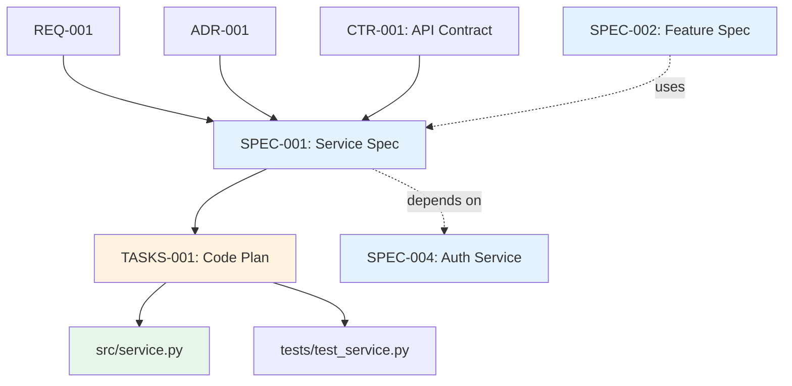

# Traceability Matrix: SPEC-001 through SPEC-NNN

## Document Control

| Item | Details |
|------|---------|
| Document ID | TRACEABILITY_MATRIX_SPEC |
| Title | Comprehensive Technical Specifications Traceability Matrix |
| Status | [Active/Draft] |
| Version | 1.0.0 |
| Date Created | YYYY-MM-DD |
| Author | [Team Name] |
| Purpose | Track bidirectional traceability for all Technical Specification Documents (YAML format) |


---

**⚠️ TAG-BASED AUTO-GENERATION AVAILABLE**

This traceability matrix can be automatically generated by scanning code files for @spec:, @spec:, @test: tags.

**Recommended Approach:** Use tag-based auto-discovery instead of manual maintenance.

**Generate automatically using:**
```bash
# Extract tags from all files
python scripts/extract_tags.py --source src/ docs/ tests/ --output docs/generated/tags.json

# Validate tags against documents
python scripts/validate_tags_against_docs.py --tags docs/generated/tags.json --strict

# Generate SPEC traceability matrix
python scripts/generate_traceability_matrices.py --type SPEC --output docs/SPEC/SPEC-000_TRACEABILITY_MATRIX.md
```

**Benefits:**
- ✅ Single source of truth: Tags embedded in code
- ✅ Always up-to-date: Generated from current codebase
- ✅ No manual sync: Automated validation prevents drift
- ✅ Coverage metrics: Automatically calculated

**Tag Format:** `@spec: SPEC-001:NNN` (for multi-requirement docs) or `@spec: SPEC-001` (for single-doc refs)

See: [TRACEABILITY.md](../TRACEABILITY.md#tag-based-auto-discovery-alternative) for complete tag-based workflow.

---

## 1. Overview

### 1.1 Document Type Description
Technical Specification Documents (SPEC) define HOW to implement requirements using YAML format. SPEC documents provide AI-optimized implementation blueprints including interfaces, algorithms, patterns, performance targets, and observability.

### 1.2 Coverage Scope
This matrix tracks all SPEC documents, mapping upstream requirements/contracts to downstream code generation tasks and implementations.

### 1.3 Statistics
- **Total SPEC Tracked**: [X] documents
- **Total Components**: [Y] services/agents/infrastructure
- **Coverage Period**: [Start Date] to [End Date]
- **Last Updated**: YYYY-MM-DD

---

## 2. Required Tags (Cumulative Tagging Hierarchy - Layer 10)

### 2.1 Tag Requirements for SPEC Artifacts

**Layer**: 10
**Artifact Type**: SPEC (Technical Specification - YAML format)
**Required Tags**: `@brd` through `@req` + optional `@impl`, `@ctr`
**Tag Count**: 7-9 (7 required, up to 2 optional)

### 2.2 Tag Format

SPEC documents use YAML format with a dedicated `cumulative_tags` section:

```yaml
cumulative_tags:
  brd: "BRD-009:015"
  prd: "PRD-016:003"
  ears: "EARS-012:002"
  bdd: "BDD-015:001"
  adr: "ADR-033"
  sys: "SYS-012:001"
  req: "REQ-045:001"
  impl: "IMPL-003:002"  # Optional - include if exists
  ctr: "CTR-005"  # Optional - include if exists
```

**Format Rules**:
- YAML mapping format (key: value pairs)
- Keys: lowercase artifact types
- Values: quoted strings in `DOC-ID:NNN` format
- Optional tags: IMPL and CTR - include only if they exist in traceability chain
- Multiple references: comma-separated within quoted string

### 2.3 Example: SPEC with Required Tags

```yaml
# SPEC-018: request submission Service Specification

spec_id: SPEC-018
title: "request submission Service Technical Specification"
version: "1.0.0"
status: active

# Cumulative Tagging Hierarchy (Layer 10)
# Required: 7 upstream tags (BRD through REQ)
# Optional: IMPL, CTR (include if they exist in chain)
cumulative_tags:
  brd: "BRD-009:015, BRD-009:006"
  prd: "PRD-016:003"
  ears: "EARS-012:002, EARS-012:001"
  bdd: "BDD-015:001, BDD-015:002"
  adr: "ADR-033"
  sys: "SYS-012:001, SYS-012:002"
  req: "REQ-045:001, REQ-045:002"
  impl: "IMPL-003:002"  # Optional
  ctr: "CTR-005"  # Optional

component:
  name: "OrderPlacementService"
  type: "service"
  layer: "business_logic"

# ... rest of YAML specification ...
```

### 2.4 Example: SPEC Without Optional Layers

When IMPL and CTR don't exist in the traceability chain:

```yaml
# SPEC-040: Simple Data Processor Specification

cumulative_tags:
  brd: "BRD-001:020"
  prd: "PRD-003:005"
  ears: "EARS-005:001"
  bdd: "BDD-008:001"
  adr: "ADR-015"
  sys: "SYS-020:003"
  req: "REQ-030:001"
  # No IMPL or CTR - not needed for this component

component:
  name: "DataProcessor"
  type: "service"
```

**Tag Count**: 7 (all required, no optional layers)

### 2.5 Validation Rules

1. **Required Tags**: Each SPEC MUST include tags from BRD through REQ (7 tags minimum)
2. **Optional Layers**: IMPL and CTR tags are optional - include only if they exist in chain
3. **YAML Format**: Tags must be in YAML `cumulative_tags` mapping format
4. **Valid References**: All referenced documents and requirements must exist
5. **No Gaps**: Cannot skip intermediate layers (e.g., must include all layers from BRD through REQ)
6. **Comma Separation**: Multiple values for same artifact type use comma-separated format

### 2.6 Tag Discovery and Validation

```bash
# Find all SPECs and validate cumulative tags
python scripts/extract_tags.py --type SPEC --validate-cumulative

# Check SPEC-018 has all required upstream tags
python scripts/validate_tags_against_docs.py \
  --artifact SPEC-018 \
  --expected-layers brd,prd,ears,bdd,adr,sys,req \
  --strict

# Generate SPEC traceability report with tag analysis
python scripts/generate_traceability_matrices.py \
  --type SPEC \
  --show-tags \
  --check-completeness
```

### 2.7 SPEC Traceability Pattern

SPEC sits at Layer 10, pulling together all upstream requirements:

```
BRD (Layer 1) → Business requirements
  ↓
PRD (Layer 2) → Product features
  ↓
EARS (Layer 3) → Engineering requirements
  ↓
BDD (Layer 4) → Test scenarios
  ↓
ADR (Layer 5) → Architecture decisions
  ↓
SYS (Layer 6) → System requirements
  ↓
REQ (Layer 7) → Atomic requirements
  ↓ (optional)
IMPL (Layer 8) → Implementation plan
  ↓ (optional)
CTR (Layer 9) → API contracts
  ↓
SPEC (Layer 10) → Technical specification (YAML)
  ↓
TASKS (Layer 11) → Implementation tasks
  ↓
Code (Layer 13) → Source code
```

**Key Insight**: SPEC aggregates ALL design decisions and requirements into a single AI-optimized YAML document, enabling automated code generation via TASKS.

---

## 3. Complete SPEC Inventory

| SPEC ID | Title | Spec Type | Status | Date | Upstream Sources | Downstream Artifacts |
|---------|-------|-----------|--------|------|------------------|---------------------|
| SPEC-001 | [Technical specification title] | Service | Active | YYYY-MM-DD | REQ-001, ADR-001, CTR-001 | TASKS-001, Code: src/service.py |
| SPEC-002 | [Technical specification title] | Agent | Active | YYYY-MM-DD | REQ-002, ADR-002 | TASKS-002, Code: src/agent.py |
| SPEC-NNN | ... | ... | ... | ... | ... | ... |

**Status Legend**:
- **Active**: Current specification
- **In Development**: Under construction
- **Validated**: Reviewed and approved
- **Superseded**: Replaced by newer version

---

## 4. Upstream Traceability (REQUIRED)

> **Traceability Rule**: Upstream traceability is REQUIRED for SPEC documents. All SPEC specifications MUST reference existing BRD through REQ documents (with optional IMPL and CTR if they exist).

### 9.1 REQ → SPEC Traceability

| REQ ID | REQ Title | SPEC IDs | SPEC Titles | Relationship |
|--------|-----------|----------|-------------|--------------|
| REQ-001 | [Atomic requirement] | SPEC-001 | [Technical specification] | Requirement implemented in specification |
| REQ-NNN | ... | ... | ... | ... |

### 9.2 ADR → SPEC Traceability

| ADR ID | ADR Title | SPEC IDs | SPEC Titles | Relationship |
|--------|-----------|----------|-------------|--------------|
| ADR-001 | [Architecture decision] | SPEC-001, SPEC-002 | [Technical specifications] | Architectural patterns implemented in SPEC |
| ADR-NNN | ... | ... | ... | ... |

### 6.3 CTR → SPEC Traceability

| CTR ID | CTR Title | SPEC IDs | SPEC Titles | Provider/Consumer |
|--------|-----------|----------|-------------|-------------------|
| CTR-001 | [API contract] | SPEC-001 | [Technical specification] | Provider |
| CTR-001 | [API contract] | SPEC-002, SPEC-003 | [Technical specifications] | Consumers |
| CTR-NNN | ... | ... | ... | ... |

---

## 6. Downstream Traceability (OPTIONAL)

> **Traceability Rule**: Downstream traceability is OPTIONAL. Only add links to documents that already exist. Do NOT use placeholder IDs (TBD, XXX, NNN).

### 9.1 SPEC → TASKS Traceability

| SPEC ID | SPEC Title | TASKS IDs | TASKS Titles | Relationship |
|---------|------------|-----------|--------------|--------------|
| SPEC-001 | [Technical specification] | TASKS-001 | [Code generation plan] | 1:1 mapping SPEC to TASKS |
| SPEC-NNN | ... | ... | ... | ... |

### 9.2 SPEC → Code Traceability

| SPEC ID | SPEC Title | Code Files | Functions/Classes | Relationship |
|---------|------------|------------|-------------------|--------------|
| SPEC-001 | [Technical specification] | src/service.py | ServiceClass, method1(), method2() | Direct implementation |
| SPEC-NNN | ... | ... | ... | ... |

### 6.3 SPEC → Tests Traceability

| SPEC ID | SPEC Title | Test Files | Test Functions | Coverage % |
|---------|------------|------------|----------------|------------|
| SPEC-001 | [Technical specification] | tests/test_service.py | test_method1(), test_method2() | 95% |
| SPEC-NNN | ... | ... | ... | ... |

---

## 6. Specification Organization

### 9.1 SPEC by Type

| Spec Type | SPEC IDs | Total | Description |
|-----------|---------|-------|-------------|
| Service | SPEC-001, SPEC-002, SPEC-003 | 3 | Backend services |
| Agent | SPEC-004, SPEC-005 | 2 | AI agents |
| Infrastructure | SPEC-006, SPEC-007 | 2 | Infrastructure components |
| Integration | SPEC-008 | 1 | External integrations |

### 9.2 SPEC Validation Evidence

| SPEC ID | Requirements Coverage | Test Coverage | Upstream Traceability | Validation Status |
|---------|----------------------|---------------|----------------------|-------------------|
| SPEC-001 | 100% (5/5 REQ) | 95% | 100% | ✅ Validated |
| SPEC-002 | 80% (4/5 REQ) | 85% | 100% | 🟡 Partial |
| SPEC-003 | 0% (0/3 REQ) | 0% | 0% | ⏳ Pending |
| SPEC-NNN | ... | ... | ... | ... |

---

## 7. Cross-SPEC Dependencies



> **Note on Diagram Labels**: The above flowchart shows the sequential workflow. For formal layer numbers used in cumulative tagging, always reference the 16-layer architecture (Layers 0-15) defined in README.md. Diagram groupings are for visual clarity only.

### 9.1 Inter-SPEC Dependencies

| Source SPEC | Target SPEC | Dependency Type | Description |
|-------------|-------------|-----------------|-------------|
| SPEC-001 | SPEC-004 | Prerequisite | Authentication service required |
| SPEC-002 | SPEC-001 | Uses | Feature uses core service |
| SPEC-NNN | ... | ... | ... |

---

## 8. Implementation Metrics

### 9.1 SPEC Implementation Status

| SPEC ID | YAML Valid | TASKS Status | Code Status | Tests Status | Overall | Completion % |
|---------|------------|--------------|-------------|--------------|---------|--------------|
| SPEC-001 | ✅ | ✅ Complete | ✅ Complete | ✅ Complete | Complete | 100% |
| SPEC-002 | ✅ | 🟡 In Progress | 🟡 Partial | 🟡 Partial | In Progress | 60% |
| SPEC-003 | ❌ | ⏳ Pending | ⏳ Pending | ⏳ Pending | Not Started | 0% |
| SPEC-NNN | ... | ... | ... | ... | ... | ... |

### 9.2 Code Generation Metrics

| SPEC ID | Spec Size (LOC in YAML) | Generated Code (LOC) | Generation Ratio | Quality Score |
|---------|------------------------|---------------------|------------------|---------------|
| SPEC-001 | 250 | 1200 | 4.8x | 9/10 |
| SPEC-002 | 180 | 850 | 4.7x | 8/10 |
| SPEC-003 | 200 | 0 | N/A | N/A |
| SPEC-NNN | ... | ... | ... | ... |

---

## 9. Performance and Quality Targets

### 9.1 Performance Targets from SPEC

| SPEC ID | Response Time Target | Throughput Target | Resource Limit | Achieved | Status |
|---------|---------------------|-------------------|----------------|----------|--------|
| SPEC-001 | < 100ms | 1000 req/s | 512MB RAM | 95ms, 950 req/s | ✅ Met |
| SPEC-002 | < 200ms | 500 req/s | 256MB RAM | 180ms, 480 req/s | ✅ Met |
| SPEC-003 | < 50ms | 2000 req/s | 1GB RAM | Not Tested | ⏳ Pending |
| SPEC-NNN | ... | ... | ... | ... | ... |

### 9.2 Observability Coverage

| SPEC ID | Metrics Defined | Logs Defined | Traces Defined | Alerts Defined | Coverage % |
|---------|-----------------|--------------|----------------|----------------|------------|
| SPEC-001 | ✅ (10) | ✅ (5) | ✅ (3) | ✅ (5) | 100% |
| SPEC-002 | ✅ (8) | ✅ (3) | ❌ (0) | 🟡 (2) | 65% |
| SPEC-003 | ❌ (0) | ❌ (0) | ❌ (0) | ❌ (0) | 0% |
| SPEC-NNN | ... | ... | ... | ... | ... |

---

## 10. Gap Analysis

### 10.1 Missing Downstream Artifacts
- SPEC-XXX: Missing TASKS (no code generation plan)
- SPEC-YYY: Missing Code (not implemented)
- SPEC-ZZZ: Missing Tests (no test coverage)

### 10.2 Orphaned Artifacts
- Code File: src/orphan.py (no SPEC traceability)
- TASKS-XXX: Code plan with no SPEC source

### 10.3 Quality Issues
- SPEC-002: Invalid YAML syntax
- SPEC-005: Missing performance targets
- SPEC-008: Incomplete observability definition

---

## 11. Immediate Next Steps

### 11.1 Priority Actions
1. **Fix YAML Validation Errors**: [X] SPEC documents have invalid syntax
2. **Create Missing TASKS**: [Y] SPEC documents need code generation plans
3. **Implement Pending Code**: [Z] SPEC documents need implementation
4. **Complete Observability**: [N] SPEC documents need full observability SPEC

### 11.2 Specification Review Schedule

| Review Type | Target Date | SPEC Scope | Status |
|-------------|-------------|------------|--------|
| Technical Review | YYYY-MM-DD | All active SPEC | Scheduled |
| Performance Review | YYYY-MM-DD | Service SPEC | Planning |
| security Review | YYYY-MM-DD | All SPEC | Scheduled |

---

## 12. Revision History

| Version | Date | Changes | Author |
|---------|------|---------|--------|
| 1.0.0 | YYYY-MM-DD | Initial creation | [Author Name] |

---

## 13. References

- **SPEC Index**: [SPEC-000_index.md](SPEC-000_index.md)
- **SPEC Template**: [SPEC-TEMPLATE.yaml](SPEC-TEMPLATE.yaml)
- **Complete Traceability Matrix**: [../TRACEABILITY_MATRIX_COMPLETE-TEMPLATE.md](../TRACEABILITY_MATRIX_COMPLETE-TEMPLATE.md)
- **Related Matrices**: [REQ](../REQ/REQ-000_TRACEABILITY_MATRIX-TEMPLATE.md), [CTR](../CTR/CTR-000_TRACEABILITY_MATRIX-TEMPLATE.md), [TASKS](../TASKS/TASKS-000_TRACEABILITY_MATRIX-TEMPLATE.md)

---

## 14. Appendix A: Matrix Maintenance

### 14.1 Automated Generation
```bash
python ../scripts/generate_traceability_matrix.py \
  --type SPEC \
  --input ../SPEC/ \
  --template SPEC-000_TRACEABILITY_MATRIX-TEMPLATE.md \
  --output TRACEABILITY_MATRIX_SPEC.md \
  --validate-yaml
```

### 14.2 Quality Checklist
- [ ] All SPEC documents are valid YAML
- [ ] Upstream sources documented (REQ, ADR, CTR)
- [ ] Downstream artifacts mapped (TASKS, Code, Tests)
- [ ] Performance targets defined
- [ ] Observability specifications complete
- [ ] Validation evidence tracked
- [ ] Inter-SPEC dependencies identified
- [ ] Code generation metrics calculated
