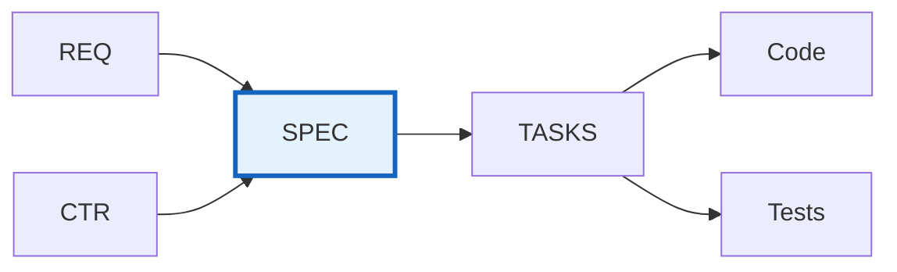

# SPEC-000: Technical Specifications Master Index

## Purpose

This document serves as the master index for all Technical Specification (SPEC) documents in the project. Use this index to:

- **Discover** existing technical specifications
- **Track** implementation specification status
- **Coordinate** development across components
- **Reference** implementation-ready technical details

## Position in Development Workflow



> **Note on Diagram Labels**: The above flowchart shows the sequential workflow. For formal layer numbers used in cumulative tagging, always reference the 16-layer architecture (Layers 0-15) defined in README.md. Diagram groupings are for visual clarity only.

**Layer**: 10 (Implementation Specification Layer)
**Upstream**: BRD→REQ, CTR (optional)
**Downstream**: TASKS, Code, Tests

## Technical Specifications Index

| SPEC ID | Title | Specification Type | Status | Related REQ | Related CTR | Priority | Last Updated |
|---------|-------|--------------------|--------|-------------|-------------|----------|--------------|
| [SPEC-TEMPLATE](./SPEC-TEMPLATE.yaml) | Template | Reference | Reference | - | - | - | 2025-11-13 |

## Status Definitions

| Status | Meaning | Description |
|--------|---------|-------------|
| **Draft** | In development | SPEC being written, technical design in progress |
| **Review** | Under review | Technical and architecture review in progress |
| **Approved** | Finalized | Specification approved, ready for implementation |
| **In Progress** | Active development | Code generation or development in progress |
| **Implemented** | Code complete | Implementation complete, testing in progress |
| **Verified** | Tested | Implementation tested and verified |
| **Deployed** | In production | Deployed to production environment |

## Specification Types

| Type | Format | Description | Examples |
|------|--------|-------------|----------|
| **Service** | YAML | Microservice or API specifications | REST APIs, gRPC services |
| **Agent** | YAML | AI agent specifications | LLM agents, autonomous agents |
| **Infrastructure** | YAML | Infrastructure as Code specs | Cloud resources, Terraform |
| **ML Model** | YAML | Machine learning model specs | Training, inference, deployment |
| **Database** | YAML | Data schema and migration specs | Tables, indexes, migrations |
| **Integration** | YAML | External integration specs | Third-party APIs, webhooks |

## Adding New Technical Specifications

When creating a new SPEC:

1. **Copy Template**:
   ```bash
   cp ai_dev_flow/SPEC/SPEC-TEMPLATE.yaml \
      docs/SPEC/{domain}/SPEC-NNN_component_name.yaml
   ```

2. **Assign SPEC ID**: Use next sequential number (SPEC-001, SPEC-002, ...)

3. **Update This Index**: Add new row to table above

4. **Create Cross-References**: Link to upstream REQ/CTR and plan downstream TASKS

## Allocation Rules

- **Numbering**: Allocate sequentially starting at `001`
- **One Component Per File**: Each `SPEC-NNN` covers a single component or service
- **Format**: YAML format for machine readability
- **Organization**: Store in appropriate domain subdirectory (services/, agents/, infrastructure/)
- **Slugs**: Short, descriptive, lower_snake_case
- **Index Updates**: Add entry for every new SPEC

## Index by Specification Type

### Service Specifications
- None

### Agent Specifications
- None

### Infrastructure Specifications
- None

### ML Model Specifications
- None

### Database Specifications
- None

### Integration Specifications
- None

## Index by Status

### Draft
- None

### Review
- None

### Approved
- None

### In Progress
- None

### Implemented
- None

### Verified
- None

### Deployed
- None

## Index by Domain

| Domain | SPEC Documents | Count |
|--------|----------------|-------|
| Services | - | 0 |
| Agents | - | 0 |
| Infrastructure | - | 0 |
| ML Models | - | 0 |
| Database | - | 0 |
| Integration | - | 0 |

## Implementation Status

| SPEC ID | Requirements Satisfied | Code Files | Test Coverage | Deployment Status |
|---------|------------------------|------------|---------------|-------------------|
| - | 0% | 0 | 0% | - |

## Metrics

| Metric | Value | Description |
|--------|-------|-------------|
| Total SPECs | 0 | Total technical specifications |
| Approved SPECs | 0 | Specifications ready for implementation |
| In Progress | 0 | Specifications being implemented |
| Implemented | 0 | Specifications with complete code |
| Deployed | 0 | Specifications deployed to production |
| Test Coverage | 0% | Average test coverage across SPECs |

## Related Documents

- **Template**: [SPEC-TEMPLATE.yaml](./SPEC-TEMPLATE.yaml) - Use this to create new SPECs
- **README**: [README.md](./README.md) - Learn about SPEC purpose, format, and structure
- **Traceability Matrix**: [SPEC-000_TRACEABILITY_MATRIX-TEMPLATE.md](./SPEC-000_TRACEABILITY_MATRIX-TEMPLATE.md)
- **Example**: [SPEC-001_api_client_example.yaml](./SPEC-001_api_client_example.yaml) - Reference specification

## Maintenance Guidelines

### Updating This Index

- Update whenever new SPEC is created
- Track status changes through implementation lifecycle
- Maintain domain classifications
- Monitor implementation and deployment progress

### Quality Checks

Before marking SPEC as "Approved":
- ✅ All required sections complete (ID, Summary, Interfaces, Traceability)
- ✅ Technical details implementation-ready
- ✅ API/interface definitions complete and unambiguous
- ✅ Quality attributes specified (performance, caching, security)
- ✅ Cross-references to upstream REQ/CTR complete
- ✅ Test strategy defined
- ✅ Deployment configuration specified
- ✅ YAML format valid and parseable

---

**Index Version**: 2.0
**Last Updated**: 2025-11-13
**Maintainer**: [Project Team]
