# Traceability Matrix: SPEC-001 through SPEC-NNN

## Document Control

| Item | Details |
|------|---------|
| Document ID | TRACEABILITY_MATRIX_SPEC |
| Title | Comprehensive Technical Specifications Traceability Matrix |
| Status | Active |
| Version | 1.0.0 |
| Date Created | 2025-01-15 |
| Author | Auto-generated |
| Purpose | Track bidirectional traceability for all YAML technical specifications |
| Generator | generate_traceability_matrix.py |

## 1. Overview

### 1.1 Statistics

- **Total SPEC Tracked**: 12 documents
- **Upstream Coverage**: 100.0% (12/12)
- **Downstream Coverage**: 83.3% (10/12)
- **Orphaned Documents**: 0
- **Last Generated**: 2025-01-15 15:00:00

### 1.2 Status Breakdown

- **Implemented**: 8 documents (66.7%)
- **In Development**: 3 documents (25.0%)
- **Planned**: 1 documents (8.3%)

## 2. Complete SPEC Inventory

| SPEC ID | Title | Category | Status | Date | Upstream Sources | Downstream Artifacts |
|---|---|---|---|---|---|---|
| SPEC-001 | User Service API Specification | microservices | Implemented | 2024-11-17 | REQ-001, REQ-002, ADR-001, CTR-001 | TASKS-001, Code: src/services/user_service.py |
| SPEC-002 | Order Processing Service Specification | microservices | Implemented | 2024-11-18 | REQ-003, REQ-004, ADR-001, CTR-002 | TASKS-002, Code: src/services/order_service.py |
| SPEC-003 | Kafka Event Bus Technical Specification | messaging | Implemented | 2024-11-22 | REQ-008, REQ-009, REQ-010, ADR-003, CTR-006 | TASKS-003, Code: src/messaging/kafka_client.py |
| SPEC-004 | Database Schema Management Specification | database | Implemented | 2024-11-20 | REQ-005, REQ-006, ADR-002, CTR-005 | TASKS-004, Code: migrations/ |
| SPEC-005 | GraphQL Gateway Implementation Specification | api | Implemented | 2024-12-03 | REQ-017, REQ-018, ADR-006, CTR-009 | TASKS-005, Code: src/gateway/graphql_server.py |
| SPEC-006 | OAuth 2.0 Token Service Specification | authentication | Implemented | 2024-11-27 | REQ-014, REQ-015, REQ-016, ADR-005, CTR-008 | TASKS-006, Code: src/auth/token_service.py |
| SPEC-007 | Kubernetes Deployment Configuration | infrastructure | Implemented | 2024-11-24 | REQ-011, REQ-012, REQ-013, ADR-004 | TASKS-007, Code: k8s/deployments/ |
| SPEC-008 | Service Registry Implementation Specification | service-discovery | Implemented | 2024-11-17 | REQ-001, ADR-001, CTR-003 | TASKS-008, Code: src/discovery/registry.py |
| SPEC-009 | Redis Caching Layer Specification | performance | In Development | 2024-12-12 | REQ-019, REQ-020, REQ-021, ADR-007 | TASKS-009 |
| SPEC-010 | Monitoring Dashboard Specification | observability | In Development | 2024-12-13 | REQ-022, CTR-010 | TASKS-010 |
| SPEC-011 | Distributed Tracing Specification | observability | In Development | 2024-12-14 | REQ-024 | None |
| SPEC-012 | API Rate Limiting Specification | security | Planned | 2024-12-15 | REQ-025, ADR-006 | None |

## 3. Upstream Traceability

### 3.1 REQ → SPEC Traceability

| REQ ID | REQ Title | SPEC IDs | SPEC Titles | Relationship |
|--------|-----------|----------|-------------|--------------|
| REQ-001 | Service discovery | SPEC-001, SPEC-008 | User Service, Service Registry | Requirements drive specifications |
| REQ-002 | API routing | SPEC-001 | User Service API | Requirement specifies API behavior |
| REQ-003 | Load balancing | SPEC-002 | Order Processing Service | Requirement drives service design |
| REQ-004 | Circuit breaker | SPEC-002 | Order Processing Service | Resilience requirement in spec |
| REQ-005 | Connection pooling | SPEC-004 | Database Schema | Database requirement in data spec |
| REQ-006 | Transaction isolation | SPEC-004 | Database Schema | Transaction requirement in data spec |
| REQ-008 | Idempotent writes | SPEC-003 | Kafka Event Bus | Messaging requirement in event spec |
| REQ-009 | Duplicate handling | SPEC-003 | Kafka Event Bus | Dedup requirement in event spec |
| REQ-010 | Schema versioning | SPEC-003 | Kafka Event Bus | Schema requirement in event spec |
| REQ-011 | Resource limits | SPEC-007 | Kubernetes Deployment | Infrastructure requirement in deployment spec |
| REQ-012 | Health checks | SPEC-007 | Kubernetes Deployment | Health requirement in deployment spec |
| REQ-013 | Rolling updates | SPEC-007 | Kubernetes Deployment | Deployment requirement in K8s spec |
| REQ-014 | Token expiration | SPEC-006 | OAuth Token Service | Auth requirement in security spec |
| REQ-015 | Token rotation | SPEC-006 | OAuth Token Service | security requirement in auth spec |
| REQ-016 | Password complexity | SPEC-006 | OAuth Token Service | Password requirement in auth spec |
| REQ-017 | Query validation | SPEC-005 | GraphQL Gateway | API requirement in gateway spec |
| REQ-018 | Query depth limit | SPEC-005 | GraphQL Gateway | API safety requirement in spec |
| REQ-019 | Cache TTL | SPEC-009 | Redis Caching | Cache requirement in performance spec |
| REQ-020 | Cache invalidation | SPEC-009 | Redis Caching | Invalidation requirement in cache spec |
| REQ-021 | Cache hit ratio | SPEC-009 | Redis Caching | Performance requirement in cache spec |
| REQ-022 | P95 latency dashboard | SPEC-010 | Monitoring Dashboard | Observability requirement in monitoring spec |
| REQ-024 | Distributed tracing | SPEC-011 | Distributed Tracing | Tracing requirement in observability spec |
| REQ-025 | Rate limiting | SPEC-012 | API Rate Limiting | security requirement in API spec |

### 3.2 ADR → SPEC Traceability

| ADR ID | ADR Decision | SPEC IDs | Relationship |
|--------|--------------|----------|--------------|
| ADR-001 | Microservices Architecture | SPEC-001, SPEC-002, SPEC-008 | Architecture decision drives service specifications |
| ADR-002 | PostgreSQL Database | SPEC-004 | Database choice drives data specification |
| ADR-003 | Kafka Event-Driven | SPEC-003 | Messaging technology drives event specification |
| ADR-004 | Kubernetes Deployment | SPEC-007 | Deployment platform drives infrastructure specification |
| ADR-005 | OAuth 2.0 Authentication | SPEC-006 | Auth mechanism drives security specification |
| ADR-006 | GraphQL API | SPEC-005, SPEC-012 | API technology drives gateway and API specifications |
| ADR-007 | Redis Caching | SPEC-009 | Caching technology drives performance specification |

### 3.3 CTR → SPEC Traceability

| CTR ID | CTR Title | SPEC IDs | SPEC Titles | Relationship |
|--------|-----------|----------|-------------|--------------|
| CTR-001 | User Service Contract | SPEC-001 | User Service API | Contract defines SPEC interfaces |
| CTR-002 | Order Service Contract | SPEC-002 | Order Processing Service | Contract specifies SPEC API behavior |
| CTR-003 | Service Registry Contract | SPEC-008 | Service Registry | Contract defines SPEC discovery API |
| CTR-005 | Database Connection Contract | SPEC-004 | Database Schema | Contract specifies SPEC data access |
| CTR-006 | Kafka Producer Contract | SPEC-003 | Kafka Event Bus | Contract defines SPEC message format |
| CTR-008 | OAuth Token Contract | SPEC-006 | OAuth Token Service | Contract specifies SPEC auth tokens |
| CTR-009 | GraphQL Query Contract | SPEC-005 | GraphQL Gateway | Contract defines SPEC query schema |
| CTR-010 | Monitoring API Contract | SPEC-010 | Monitoring Dashboard | Contract specifies SPEC observability API |

### 3.4 Upstream Source Summary

| Source Type | Total Sources | SPECs Derived | Coverage % |
|-------------|---------------|---------------|------------|
| REQ | 23 | 12 SPECs | 100.0% |
| ADR | 7 | 9 SPECs | 75.0% |
| CTR | 8 | 8 SPECs | 66.7% |

## 4. Downstream Traceability

### 4.1 SPEC → TASKS Traceability

| SPEC ID | SPEC Title | TASKS IDs | TASKS Titles | Relationship |
|---------|-----------|-----------|--------------|--------------|
| SPEC-001 | User Service API | TASKS-001 | User Service Implementation Plan | SPEC drives code generation tasks |
| SPEC-002 | Order Processing | TASKS-002 | Order Service Implementation Plan | SPEC provides step-by-step implementation |
| SPEC-003 | Kafka Event Bus | TASKS-003 | Kafka Integration Implementation Plan | SPEC broken into TODO tasks |
| SPEC-004 | Database Schema | TASKS-004 | Database Migration Implementation Plan | SPEC drives schema tasks |
| SPEC-005 | GraphQL Gateway | TASKS-005 | GraphQL Server Implementation Plan | SPEC defines gateway tasks |
| SPEC-006 | OAuth Token Service | TASKS-006 | Auth Service Implementation Plan | SPEC drives authentication tasks |
| SPEC-007 | K8s Deployment | TASKS-007 | Kubernetes Setup Implementation Plan | SPEC provides deployment tasks |
| SPEC-008 | Service Registry | TASKS-008 | Discovery Service Implementation Plan | SPEC drives discovery tasks |
| SPEC-009 | Redis Caching | TASKS-009 | Cache Layer Implementation Plan | SPEC defines caching tasks |
| SPEC-010 | Monitoring Dashboard | TASKS-010 | Observability Implementation Plan | SPEC drives monitoring tasks |

### 4.2 SPEC → Code Traceability

| SPEC ID | SPEC Title | Code Artifacts | LOC | Test Coverage | Relationship |
|---------|-----------|----------------|-----|---------------|--------------|
| SPEC-001 | User Service API | src/services/user_service.py | 450 | 95% | Direct implementation from SPEC |
| SPEC-002 | Order Processing | src/services/order_service.py | 520 | 92% | SPEC drives service logic |
| SPEC-003 | Kafka Event Bus | src/messaging/kafka_client.py | 380 | 90% | Event handling from SPEC |
| SPEC-004 | Database Schema | migrations/, src/models/ | 620 | 88% | Schema and models from SPEC |
| SPEC-005 | GraphQL Gateway | src/gateway/graphql_server.py | 710 | 85% | Gateway implementation from SPEC |
| SPEC-006 | OAuth Token Service | src/auth/token_service.py | 340 | 94% | Auth logic from SPEC |
| SPEC-007 | K8s Deployment | k8s/deployments/, helm/ | 850 | N/A | Infrastructure as code from SPEC |
| SPEC-008 | Service Registry | src/discovery/registry.py | 280 | 91% | Discovery logic from SPEC |

### 4.3 SPEC Implementation Status

| SPEC ID | Design Status | Implementation Status | Test Status | Doc Status | Overall |
|---------|---------------|----------------------|-------------|------------|---------|
| SPEC-001 | ✅ Complete | ✅ Complete | ✅ Complete | ✅ Complete | ✅ Done |
| SPEC-002 | ✅ Complete | ✅ Complete | ✅ Complete | ✅ Complete | ✅ Done |
| SPEC-003 | ✅ Complete | ✅ Complete | ✅ Complete | ✅ Complete | ✅ Done |
| SPEC-004 | ✅ Complete | ✅ Complete | ✅ Complete | 🟡 Partial | 🟡 90% |
| SPEC-005 | ✅ Complete | ✅ Complete | ✅ Complete | ✅ Complete | ✅ Done |
| SPEC-006 | ✅ Complete | ✅ Complete | ✅ Complete | ✅ Complete | ✅ Done |
| SPEC-007 | ✅ Complete | ✅ Complete | ✅ Complete | ✅ Complete | ✅ Done |
| SPEC-008 | ✅ Complete | ✅ Complete | ✅ Complete | ✅ Complete | ✅ Done |
| SPEC-009 | ✅ Complete | 🟡 In Progress | ⏳ Pending | ⏳ Pending | 🟡 40% |
| SPEC-010 | ✅ Complete | 🟡 In Progress | ⏳ Pending | ⏳ Pending | 🟡 35% |
| SPEC-011 | ✅ Complete | ⏳ Not Started | ⏳ Not Started | ⏳ Not Started | 🟡 25% |
| SPEC-012 | 🟡 Draft | ⏳ Not Started | ⏳ Not Started | ⏳ Not Started | 🟡 10% |

## 5. SPEC by Category

### 5.1 SPECs by Implementation Domain

| Domain | SPEC IDs | Total | Implementation % | Avg LOC |
|--------|----------|-------|------------------|---------|
| Microservices | SPEC-001, SPEC-002, SPEC-008 | 3 | 100% | 417 |
| Messaging | SPEC-003 | 1 | 100% | 380 |
| Database | SPEC-004 | 1 | 100% | 620 |
| API | SPEC-005, SPEC-012 | 2 | 50% | 710 |
| Authentication | SPEC-006 | 1 | 100% | 340 |
| Infrastructure | SPEC-007 | 1 | 100% | 850 |
| Performance | SPEC-009 | 1 | 40% | TBD |
| Observability | SPEC-010, SPEC-011 | 2 | 18% | TBD |

### 5.2 Technology Stack Specifications

| Technology | SPEC IDs | Purpose | Implementation Status |
|------------|----------|---------|----------------------|
| Python/FastAPI | SPEC-001, SPEC-002 | Microservices framework | ✅ Complete |
| PostgreSQL | SPEC-004 | Primary database | ✅ Complete |
| Apache Kafka | SPEC-003 | Event streaming | ✅ Complete |
| Kubernetes | SPEC-007 | Container orchestration | ✅ Complete |
| GraphQL | SPEC-005 | API gateway | ✅ Complete |
| OAuth 2.0 | SPEC-006 | Authentication | ✅ Complete |
| Redis | SPEC-009 | Caching layer | 🟡 In Progress |
| Prometheus/Grafana | SPEC-010 | Monitoring | 🟡 In Progress |
| OpenTelemetry | SPEC-011 | Distributed tracing | ⏳ Planned |

## 6. Code Generation Metrics

### 6.1 SPEC to Code Efficiency

| SPEC ID | TASKS Count | Dev Time (hours) | LOC Generated | SPEC Lines | Code/SPEC Ratio |
|---------|-------------|------------------|---------------|------------|-----------------|
| SPEC-001 | 18 | 60 | 450 | 320 | 1.41 |
| SPEC-002 | 22 | 80 | 520 | 380 | 1.37 |
| SPEC-003 | 16 | 50 | 380 | 290 | 1.31 |
| SPEC-004 | 25 | 90 | 620 | 410 | 1.51 |
| SPEC-005 | 30 | 120 | 710 | 450 | 1.58 |
| SPEC-006 | 14 | 45 | 340 | 280 | 1.21 |
| SPEC-007 | 20 | 70 | 850 | 520 | 1.63 |
| SPEC-008 | 12 | 35 | 280 | 240 | 1.17 |

**Average Code/SPEC Ratio**: 1.40 (for every line of SPEC, 1.40 lines of code generated)

### 6.2 Test Coverage from SPEC

| SPEC ID | Unit Tests | Integration Tests | E2E Tests | Overall Coverage | Target |
|---------|------------|-------------------|-----------|------------------|--------|
| SPEC-001 | 95% | 92% | 90% | 95% | 95% ✅ |
| SPEC-002 | 92% | 88% | 85% | 92% | 90% ✅ |
| SPEC-003 | 90% | 85% | N/A | 90% | 90% ✅ |
| SPEC-004 | 88% | 85% | 80% | 88% | 85% ✅ |
| SPEC-005 | 85% | 80% | 82% | 85% | 90% 🟡 |
| SPEC-006 | 94% | 92% | 90% | 94% | 95% 🟡 |
| SPEC-007 | N/A | 100% | 95% | 98% | 95% ✅ |
| SPEC-008 | 91% | 88% | N/A | 91% | 90% ✅ |

## 7. Performance Targets Tracking

### 7.1 Non-Functional Requirements from SPEC

| SPEC ID | Performance Target | Measured Value | Status | Notes |
|---------|-------------------|----------------|--------|-------|
| SPEC-001 | Response time < 100ms | 85ms (P95) | ✅ Met | User service latency |
| SPEC-002 | Response time < 200ms | 175ms (P95) | ✅ Met | Order service latency |
| SPEC-003 | Throughput > 10k msg/s | 12.5k msg/s | ✅ Met | Kafka event throughput |
| SPEC-004 | Query time < 50ms | 42ms (P95) | ✅ Met | Database query latency |
| SPEC-005 | Response time < 150ms | 140ms (P95) | ✅ Met | GraphQL query latency |
| SPEC-006 | Token validation < 10ms | 8ms (P95) | ✅ Met | Auth service latency |
| SPEC-007 | Pod startup < 30s | 25s | ✅ Met | K8s deployment time |
| SPEC-008 | Discovery time < 5ms | 4ms | ✅ Met | Service registry lookup |

### 7.2 Observability Coverage

| SPEC ID | Metrics | Logs | Traces | Alerts | Coverage % |
|---------|---------|------|--------|--------|------------|
| SPEC-001 | ✅ | ✅ | ✅ | ✅ | 100% |
| SPEC-002 | ✅ | ✅ | ✅ | ✅ | 100% |
| SPEC-003 | ✅ | ✅ | ✅ | ✅ | 100% |
| SPEC-004 | ✅ | ✅ | 🟡 | ✅ | 75% |
| SPEC-005 | ✅ | ✅ | ✅ | ✅ | 100% |
| SPEC-006 | ✅ | ✅ | ✅ | ✅ | 100% |
| SPEC-007 | ✅ | ✅ | ⏳ | ✅ | 75% |
| SPEC-008 | ✅ | ✅ | ✅ | ✅ | 100% |

## 8. Cross-SPEC Dependencies

```mermaid
graph TD
    REQ001[REQ-001: Discovery] --> SPEC001[SPEC-001: User Service]
    REQ002[REQ-002: Routing] --> SPEC001
    REQ003[REQ-003: Load Balance] --> SPEC002[SPEC-002: Order Service]
    REQ004[REQ-004: Circuit Breaker] --> SPEC002

    ADR001[ADR-001: Microservices] --> SPEC001
    ADR001 --> SPEC002
    ADR001 --> SPEC008[SPEC-008: Registry]
    ADR002[ADR-002: PostgreSQL] --> SPEC004[SPEC-004: Database]
    ADR003[ADR-003: Kafka] --> SPEC003[SPEC-003: Events]
    ADR004[ADR-004: K8s] --> SPEC007[SPEC-007: Deployment]
    ADR005[ADR-005: OAuth] --> SPEC006[SPEC-006: Auth]
    ADR006[ADR-006: GraphQL] --> SPEC005[SPEC-005: Gateway]
    ADR007[ADR-007: Redis] --> SPEC009[SPEC-009: Cache]

    CTR001[CTR-001: User Contract] --> SPEC001
    CTR002[CTR-002: Order Contract] --> SPEC002
    CTR006[CTR-006: Kafka Contract] --> SPEC003

    SPEC001 --> TASKS001[TASKS-001]
    SPEC002 --> TASKS002[TASKS-002]
    SPEC003 --> TASKS003[TASKS-003]
    SPEC004 --> TASKS004[TASKS-004]
    SPEC005 --> TASKS005[TASKS-005]
    SPEC006 --> TASKS006[TASKS-006]
    SPEC007 --> TASKS007[TASKS-007]
    SPEC008 --> TASKS008[TASKS-008]

    TASKS001 --> CODE001[src/services/user_service.py]
    TASKS002 --> CODE002[src/services/order_service.py]
    TASKS003 --> CODE003[src/messaging/kafka_client.py]

    style SPEC001 fill:#e8f5e9
    style SPEC002 fill:#e8f5e9
    style SPEC003 fill:#e8f5e9
    style SPEC004 fill:#e8f5e9
    style SPEC005 fill:#e8f5e9
    style SPEC006 fill:#e8f5e9
    style SPEC007 fill:#e8f5e9
    style SPEC008 fill:#e8f5e9
    style SPEC009 fill:#fff3e0
    style SPEC010 fill:#fff3e0
    style SPEC011 fill:#f3e5f5
    style SPEC012 fill:#f3e5f5
```



> **Note on Diagram Labels**: The above flowchart shows the sequential workflow. For formal layer numbers used in cumulative tagging, always reference the 16-layer architecture (Layers 0-15) defined in README.md. Diagram groupings are for visual clarity only.

*Legend: Green = Implemented, Orange = In Development, Purple = Planned*

## 9. Gap Analysis

### 9.1 SPECs Without Downstream Artifacts

| SPEC ID | SPEC Title | Status | Gap Type | Recommended Action |
|---------|-----------|--------|----------|-------------------|
| SPEC-011 | Distributed Tracing | In Development | No TASKS | Create TASKS-011 implementation plan |
| SPEC-012 | API Rate Limiting | Planned | No TASKS | Complete design, then create TASKS-012 |

### 9.2 Implementation Gaps

| SPEC ID | Gap Description | Impact | Priority | Estimated Effort |
|---------|----------------|--------|----------|------------------|
| SPEC-009 | Cache layer incomplete | Medium | High | 3 weeks |
| SPEC-010 | Monitoring dashboard partial | Low | Medium | 2 weeks |
| SPEC-011 | Tracing not started | Low | Low | 4 weeks |
| SPEC-012 | Rate limiting design incomplete | Medium | Medium | 2 weeks |

### 9.3 Quality Issues

| Issue Type | SPEC IDs | Count | Description |
|------------|---------|-------|-------------|
| Below test coverage target | SPEC-005, SPEC-006 | 2 | Need additional tests to reach 90%+ |
| Missing distributed tracing | SPEC-004, SPEC-007 | 2 | Tracing instrumentation incomplete |
| Incomplete documentation | SPEC-004 | 1 | API documentation needs update |

## 10. Coverage Metrics

| Metric | Value | Target | Status |
|--------|-------|--------|--------|
| Upstream Traceability | 100.0% | 100% | ✅ |
| Downstream Artifacts | 83.3% | 90% | 🟡 |
| Orphaned Documents | 0 | 0 | ✅ |
| Implementation Complete | 66.7% | 80% | 🟡 |
| Test Coverage Avg | 91.4% | 90% | ✅ |
| Observability Coverage | 93.8% | 90% | ✅ |

## 11. Validation Commands

```bash
# Validate this matrix
python scripts/validate_traceability_matrix.py --matrix SPEC/TRACEABILITY_MATRIX_SPEC.md --input SPEC/

# Update incrementally
python scripts/update_traceability_matrix.py --matrix SPEC/TRACEABILITY_MATRIX_SPEC.md --input SPEC/

# Generate from scratch
python scripts/generate_traceability_matrix.py --type SPEC --input SPEC/ --output SPEC/TRACEABILITY_MATRIX_SPEC.md
```

## 12. Revision History

| Version | Date | Changes | Method |
|---------|------|---------|--------|
| 1.0.0 | 2025-01-15 | Initial auto-generated matrix | generate_traceability_matrix.py |

---

*This matrix was automatically generated. For template, see*
*`SPEC-000_TRACEABILITY_MATRIX-TEMPLATE.md`*
