# Specification-Driven Development Principles Guide

**Framework Philosophy**: AI Dev Flow enables maximum velocity to production through 90%+ automation and strategic human oversight.

**MVP-to-Production Loop**: Continuous product evolution through rapid MVP cycles:
- Create MVP v1.0 → Fix Defects → Production Release
- Add Features (MVP v2.0) ← Market Feedback → Fix Defects → Production
- Iterate continuously with 1-2 week cycles
- Automation accelerates each cycle (12 of 13 production layers automated)
- Strategic human checkpoints preserve quality (5 critical decision points, optional if quality score ≥90%)

**Automation Capabilities**:
- Document Generation: 90% automated (L1-L14, human review optional if score ≥90%)
- Code Generation: Full automation from SPEC+TASKS to Python
- Test Execution: Auto-retry with 3 max attempts, 80% coverage minimum
- Quality Gates: AI-scored validation enables auto-approval
- Deployment Pipeline: Automated build, security scans, optional human approval

### Splitting Rules

- Core: [DOCUMENT_SPLITTING_RULES.md](./DOCUMENT_SPLITTING_RULES.md)
- Templates: Use `{TYPE}-SECTION-0-TEMPLATE.md` (index) and `{TYPE}-SECTION-TEMPLATE.md` (sections)
- **Universal Rule**: If ANY file > 20,000 tokens OR > 1 file per ID, you **MUST** use the Nested Directory Pattern (`TYPE-{ID}_{Slug}/`).

> MVP Mode: Follow the Universal Splitting Rule. Default to single files until the 20,000-token trigger is hit.

> ⚠️ **Token Limit Update (2025-11)**: This guide reflects the current **20,000 token** hard limit for corpus files.
> For tool-specific optimization strategies, see [AI_TOOL_OPTIMIZATION_GUIDE.md](./AI_TOOL_OPTIMIZATION_GUIDE.md).
>
> Script name canonicalization: matrix generation uses `scripts/generate_traceability_matrix.py`. Historical references to `generate_traceability_matrix.py` refer to the same tool; use the singular script.

## The AI-Driven Specification-Driven Development Workflow

**⚠️ For the complete authoritative workflow diagram, see [index.md](./index.md#traceability-flow).**

### Change Management (CHG) - Document Immutability

⚠️ **Important**: CHG is NOT a layer in the 15-layer architecture - it's a **change management archival procedure**.

**Purpose**: Ensure document immutability by archiving superseded documents when requirements change fundamentally

**When to Use CHG**:
- Architectural pivots requiring document restructuring
- Deprecating/replacing existing artifacts due to major scope changes
- Framework-wide changes affecting multiple layers

**CHG Workflow**:
1. **Archive old documents** in `CHG/CHG-XX_{slug}/archive/`
2. **Create CHG record** documenting reason for change
3. **Create NEW documents from scratch** (never edit in place)
4. **Regenerate entire downstream chain** and source code

**Why Immutability Matters**: LLMs are probabilistic - editing documents in place can introduce subtle inconsistencies. Creating fresh documents ensures coherent, bug-free artifacts aligned with new requirements.

**Files**: [CHG-TEMPLATE.md](./CHG/CHG-TEMPLATE.md) | [CHG_MVP_CREATION_RULES.md](./CHG/CHG_MVP_CREATION_RULES.md) | [CHG_MVP_SCHEMA.yaml](./CHG/CHG_MVP_SCHEMA.yaml)

**Note**: Most projects never use CHG - it's only for major pivots, not routine updates.

### Workflow Overview

The SDD workflow transforms business needs into production-ready code through traceable artifacts organized in 15 layers (Layer 0: Strategy through Layer 14: Validation). **The framework enables 90%+ automation** with strategic human oversight, achieving rapid 1-2 week MVP cycles from idea to production.

**Automation Architecture**:
- **13 of 14 Production Layers Automated**: L1-L14 (excluding strategic L0)
- **Quality-Gated Progression**: AI-scored validation at each layer (auto-approve if score ≥90%)
- **5 Strategic Checkpoints** (optional if quality score ≥90%):
  - L1 (BRD): Business owner approval - strategic business alignment
  - L2 (PRD): Product manager approval - product vision validation
  - L5 (ADR): Architect approval - technical architecture decisions
  - L12 (Code): Developer review - code quality and security
  - L14 (Deployment): Ops approval - production release gating
- **9 Fully Automated Layers**: L3 (EARS), L4 (BDD), L6 (SYS), L7 (REQ), L8 (CTR), L9 (SPEC), L10 (TSPEC), L11 (TASKS), L13 (Tests)

#### Quality Gates Integration

Quality gates prevent progression to downstream layers until artifacts meet specified maturity thresholds:

- **Ready Score Gates**: Each artifact includes a score field (e.g., `EARS-Ready Score: ✅ 95% ≥90%`) indicating readiness for next layer
- **Automated Approval**: Artifacts with scores ≥90% can proceed automatically without human review
- **Cumulative Tag Validation**: Each artifact must include ALL upstream traceability tags (e.g., `@brd @prd @ears @bdd`)
- **Pre-commit Blocking**: Git hooks enforce quality gates, preventing immature artifacts from being committed
- **Automated Recovery**: Validation scripts provide specific guidance for reaching quality thresholds

**Validation Commands:**
- Validation note: use the per-artifact validators and the pre-commit hook pattern defined in `TRACEABILITY_VALIDATION.md` instead of a monolithic `validate_quality_gates.sh` script.
- Pre-commit automation: Quality gates run on every commit to docs/ directory
- Refer to [TRACEABILITY_VALIDATION.md](./TRACEABILITY_VALIDATION.md) for complete quality gate specifications

The quality gates ensure smooth 15-layer transitions and prevent immature artifacts from affecting downstream development.

**Workflow Progression**:

**Strategy Layer** (Layer 0) → **Business Layer** (BRD → PRD → EARS) → **Testing Layer** (BDD) → **Architecture Layer** (ADR → SYS) → **Requirements Layer** (REQ) → **Interface Layer** (CTR - optional) → **Technical Specs (SPEC)** → **Test Specifications (TSPEC)** → **Code Generation Layer** (TASKS) → **Execution Layer** (Code → Tests) → **Validation Layer** (Validation → Review → Production)

**Key Decision Point**: After REQ, if the requirement involves an interface (API, event schema, data model), create CTR before SPEC. Otherwise, go directly to SPEC.

#### Visual Workflow Diagram

**Cumulative Tagging**: Each artifact includes tags from ALL upstream artifacts (see diagram annotations below)

> ⚠️ **IMPORTANT - Layer Numbering**: The Mermaid subgraph labels (L1-L10) below are visual groupings for diagram clarity ONLY. Always use formal layer numbers (0-14) when implementing cumulative tagging or referencing layers in code/documentation. See layer mapping table in README.md.

```mermaid
graph LR
    subgraph L1["Business Layer"]
        BRD["BRD<br/><small>(0 tags)</small>"] --> PRD["PRD<br/><small>(@brd)"] --> EARS["EARS<br/><small>(@brd, @prd)"]
    end

    subgraph L2["Testing Layer"]
        BDD["BDD<br/>Behavior Tests<br/><small>(@brd, @prd, @ears)"]
    end

    subgraph L3["Architecture Layer"]
        ADR["ADR<br/><small>(@brd through @bdd)"] --> SYS["SYS<br/><small>(@brd through @adr)"]
    end

    subgraph L4["Requirements Layer"]
        REQ["REQ<br/>Atomic Requirements<br/><small>(@brd through @sys)"]
    end

    subgraph L5["Interface Layer"]
        CTR["CTR<br/><i>optional</i><br/><small>(@brd through @req)"]
    end

    subgraph L6["Technical Specs (SPEC)"]
        SPEC["SPEC<br/><i>YAML</i><br/><small>(@brd through @req + opt)"]
    end

    subgraph L7["Test Specifications (TSPEC)"]
        TSPEC["TSPEC<br/>TDD Tests<br/><small>(@brd through @spec)"]
    end

    subgraph L8["Code Generation Layer"]
        TASKS["TASKS<br/>Generation Plans<br/><small>(@brd through @tspec)"]
    end

    subgraph L9["Execution Layer"]
        CODE["Code<br/><small>(@brd through @tasks)"] --> TESTS["Tests<br/><small>(@brd through @code)"]
    end

    subgraph L10["Validation Layer"]
        VAL["Validation<br/><small>(all upstream)"] --> REV[Review] --> PROD[Production]
    end

    EARS --> BDD
    BDD --> ADR
    SYS --> REQ
    REQ --> CTR
    CTR --> SPEC
    SPEC --> TSPEC
    TSPEC --> TASKS
    TASKS --> CODE
    TESTS --> VAL
    PROD -.-> BRD

    style BRD fill:#e1f5ff,stroke:#0277bd,stroke-width:2px
    style PRD fill:#e1f5ff,stroke:#0277bd,stroke-width:2px
    style EARS fill:#e1f5ff,stroke:#0277bd,stroke-width:2px
    style BDD fill:#fff3cd,stroke:#f9a825,stroke-width:2px
    style ADR fill:#d4edda,stroke:#388e3c,stroke-width:2px
    style SYS fill:#d4edda,stroke:#388e3c,stroke-width:2px
    style REQ fill:#f8d7da,stroke:#d32f2f,stroke-width:2px
    style CTR fill:#e2e3e5,stroke:#616161,stroke-width:2px
    style SPEC fill:#fff3e0,stroke:#f57c00,stroke-width:2px
    style TSPEC fill:#b2ebf2,stroke:#00838f,stroke-width:2px
    style TASKS fill:#fce4ec,stroke:#c2185b,stroke-width:2px
    style CODE fill:#f3e5f5,stroke:#7b1fa2,stroke-width:2px
    style TESTS fill:#e8f5e9,stroke:#388e3c,stroke-width:2px
    style VAL fill:#e0f2f1,stroke:#00897b,stroke-width:2px
    style REV fill:#e0f2f1,stroke:#00897b,stroke-width:2px
    style PROD fill:#e0f2f1,stroke:#00897b,stroke-width:2px
```



> **Note on Diagram Labels**: The above flowchart shows the sequential workflow. For formal layer numbers used in cumulative tagging, always reference the 15-layer architecture (Layers 0-14) defined in README.md. Diagram groupings are for visual clarity only.

**Layer Descriptions** (Formal Layer Numbers 0-14):
- **Layer 1 - Business Requirements** (Blue): BRD - Business objectives, stakeholder groups (business-level), high-level functional requirements and quality attributes, business constraints
- **Layer 2 - Product Requirements** (Blue): PRD - User personas, user stories, user roles, product features, detailed functional requirements derived from business objectives
- **Layer 3 - Engineering Requirements** (Blue): EARS - Event-Action-Response-State requirements bridging PRD to 04_BDD/05_ADR/SYS
- **Layer 4 - Testing** (Yellow): BDD - Acceptance criteria and test scenarios
- **Layers 5-6 - Architecture** (Green): ADR (L5) → SYS (L6) - Technical decisions and system design
- **Layer 7 - Requirements** (Red): REQ - Detailed atomic requirements
- **Layer 8 - Interface** (Gray): CTR - API contracts (created when needed) - optional
- **Layer 9 - Technical Specifications** (Orange): SPEC - Technical specifications (YAML)
- **Layer 10 - Test Specifications** (Cyan): TSPEC - TDD test specifications (UTEST, ITEST, STEST, FTEST)
- **Layer 11 - Code Generation** (Pink): TASKS - Detailed implementation tasks (includes execution commands)
- **Layer 12 - Code** (Purple): Source code implementation
- **Layer 13 - Tests** (Green): Test execution and verification
- **Layer 14 - Validation** (Teal): Validation → Review → Production (Quality gates and deployment)

**Note on Layer Numbering:**
- **Formal layer numbers**: 0-14 (used in cumulative tagging, templates, specifications)
- **Mermaid diagram groupings**: L1-L10 (visual organization for diagrams)
- When implementing cumulative tagging, always use formal layer numbers (0-14)
- The full 15-layer architecture includes optional CTR at layer 8 which may not always be present

**Template Optimization (Updated 2025-11-26):**
- BRD template optimized to ~21K tokens through modular appendices and content extraction
- Teaching materials (FR examples, content exclusion rules) moved to standalone reference guides
- User stories, user roles, and product appendices relocated to PRD for proper layer separation
- See [01_BRD/FR_EXAMPLES_GUIDE.md](./01_BRD/FR_EXAMPLES_GUIDE.md) for functional requirement examples

See [index.md](./index.md#traceability-flow) for additional workflow visualizations and [TRACEABILITY.md](./TRACEABILITY.md) for complete traceability guidelines.


# Important Traceability Condition
PRDs should reference the documentation in this directory, but the documentation itself should not reference PRDs. The documentation is the authoritative source for requirements and features.
# Spec-Driven Development (SDD) Guide — Examples

**Note**: File paths shown below are illustrative examples. Replace `{category}`, `{subcategory}`, `{NN}`, and `{slug}` with actual values for your project.

@requirement:[REQ-NN](./07_REQ/{category}/{subcategory}/REQ-NN_{slug}.md#REQ-NN)
@adr:[ADR-NN](./05_ADR/ADR-NN_{slug}.md#ADR-NN)
@spec:[{service_name}](./09_SPEC/SPEC-NN_{slug}/SPEC-NN_{slug}.yaml)

Status: Example-scoped standard for ai_dev_flow. Aligns with `.project_instructions/DOCUMENT_ID_CORE_RULES.md`, `docs/DOCUMENT_ID_CORE_RULES.md`, `TRACEABILITY.md`, and `ID_NAMING_STANDARDS.md`.

## Purpose
- Establish a clear, repeatable, and testable process to move from product intent to code using specifications as the source of truth.
- Ensure every behavior is traceable: PRD → EARS → BDD → ADR → SYS → REQ → CTR → SPEC → TSPEC → TASKS → Code.

## Concept
- Define behavior, interfaces, constraints, and verification in unambiguous specifications before coding.
- Complementary to TDD/BDD: the spec drives tests and code; BDD verifies acceptance; TDD covers units.

## Principles
- Single Source of Truth: The technical specification defines the implementation.
- One-Doc-Per-ID: Each 07_REQ/05_ADR/SPEC file holds one document; filenames include IDs.
- Specification-First: Technical specifications precede implementation.
- Complete Traceability: All cross-references use markdown link format with anchors. User story derivation flows: Business Objectives (BRD) → User Stories (PRD) → Functional Requirements (PRD) with full bidirectional traceability.
- Executable Examples: Provide concrete- Structured specs (YAML‑heavy / SPEC):
  - **Micro-SPEC Architecture**: Large components must be broken into granular "Micro-SPECs" (5-10 REQs) inside a component folder.
  - **Generation**: SPEC files should be treated as **Generated Artifacts** derived from REQs using framework tools.
  - **Traceability**: Independent validation per Micro-SPEC.
- Quality Attributes First-Class: Performance, reliability, observability, and security are explicit in SPEC.
- Minimal, Reviewable Diffs: Small steps; verify at each gate.
- Change via ADR: Architectural changes recorded and linked.
- **Document Structure Simplicity**: Keep documents as single comprehensive files with clear section headings. Only split into multiple files when file exceeds 20,000 tokens AND has multiple distinct audience needs OR complex dependency chains requiring separate documentation. Use table of contents for navigation within single documents.
- Document ID Independence: IDs are sequential within artifact type; consult index files (ID: 000) to discover documents by topic or content

## Metadata Management Approaches

AI Dev Flow uses **dual metadata approaches** to serve both human and machine readers:

### 1. YAML Frontmatter (Machine-Readable)

**Purpose**: Enables tooling integration, automated validation, and documentation site generation (e.g., Docusaurus)

**Location**: Top of markdown files, enclosed in `---` markers

**Required in**: All templates, index files, and published documentation artifacts

**Example**:
```yaml
---
title: "BRD-02: Partner Ecosystem Integration"
tags:
  - platform-brd
  - shared-architecture
  - required-both-approaches
custom_fields:
  architecture_approaches: [ai-agent-based, traditional-8layer]
  priority: shared
  layer: 1
  artifact_type: BRD
---
```

### 2. Document Control Tables (Human-Readable)

**Purpose**: Provides version history, ownership, and approval tracking for stakeholders

**Location**: Immediately after main heading in documents

**Required in**: All production documents (BRD, PRD, EARS, BDD, ADR, SYS, REQ, CTR, SPEC, TSPEC, TASKS)

**Example**:
```markdown
## Document Control

| Item | Details |
|------|---------|
| **Project Name** | Partner Ecosystem Integration |
| **Document Version** | 1.2.0 |
| **Date Created** | 2025-01-15 |
| **Last Updated** | 2025-02-20 |
| **Status** | Approved |
```

### 3. Metadata vs. Traceability Tags

**Critical Distinction**:

- **YAML Frontmatter (Metadata)**: Document classification, tooling integration, NOT for audit trail
- **Traceability Tags** (`@artifact: ID`): Bidirectional cross-document references in section 7, for audit trail and compliance

**Comparison Table**:

| Aspect | YAML Frontmatter | Traceability Tags |
|--------|------------------|-------------------|
| **Purpose** | Classification, tooling | Audit trail, compliance |
| **Location** | Document top | section 7 (Traceability) |
| **Format** | YAML key-value pairs | `@artifact: ID` inline |
| **Audience** | Tools, documentation systems | Auditors, reviewers, AI assistants |
| **Changeability** | Can be updated | Immutable after approval |
| **Validation** | Schema-based | Bidirectional link checking |

**Example - YAML Frontmatter (REQ document)**:
```yaml
custom_fields:
  layer: 7
  artifact_type: REQ
  upstream_artifacts: [BRD, PRD, EARS, BDD, ADR, SYS]
  downstream_artifacts: [CTR, SPEC]
```

**Example - Traceability Tags (same REQ document)**:
```markdown
## 7. Traceability

### Upstream References
- @brd: BRD.01.01.01 (Platform Architecture & Technology Stack)
- @prd: PRD.03.01.01 (Unified Quoteboard Product Definition)
- @ears: EARS.02.24.01 (Exchange Integration Requirements)
- @bdd: BDD.01.13.01 (Quote Display Acceptance Criteria)
- @adr: ADR-05 (WebSocket Connection Architecture)
- @sys: SYS.01.25.01 (Quoteboard System Requirements)

### Downstream References
- @ctr: CTR-01 (WebSocket Quote Ingestion Contract)
- @spec: SPEC-01 (WebSocket Quote Ingestion Technical Spec)
```

### 4. Cumulative Tagging Hierarchy

Each layer in the SDD workflow inherits ALL upstream traceability tags:

| Layer | Required Traceability Tags | Count |
|-------|----------------------------|-------|
| Layer 1 (BRD) | None (source document) | 0 |
| Layer 2 (PRD) | @brd | 1 |
| Layer 3 (EARS) | @brd, @prd | 2 |
| Layer 4 (BDD) | @brd, @prd, @ears | 3 |
| Layer 5 (ADR) | @brd, @prd, @ears, @bdd | 4 |
| Layer 6 (SYS) | @brd, @prd, @ears, @bdd, @adr | 5 |
| Layer 7 (REQ) | @brd, @prd, @ears, @bdd, @adr, @sys | 6 |
| Layer 8 (CTR) | @brd, @prd, @ears, @bdd, @adr, @sys, @req | 7 |
| Layer 9 (SPEC) | @brd, @prd, @ears, @bdd, @adr, @sys, @req, @ctr | 8 |
| Layer 10 (TSPEC) | @brd, @prd, @ears, @bdd, @adr, @sys, @req, @ctr, @spec | 9 |
| Layer 11-14 | Cumulative inheritance continues | 10-12 |

**Quick Reference**: See [METADATA_VS_TRACEABILITY.md](./METADATA_VS_TRACEABILITY.md) for detailed comparison

## Document Discovery and ID Independence

**⚠️ CRITICAL: Document IDs are independent of document content**

- **ID Numbers Do Not Match Content**: A document's ID number (e.g., PRD-09, REQ-15, BDD-03) does NOT necessarily correspond to related documents in other artifact types
- **Always Try to Find and Use Index Files**: To find documents by topic/content, consult the index file for each artifact type
  - Index files use ID `000` in their identifier (e.g., PRD-000, REQ-000, ADR-000)
  - Index filenames include "index" in the name
  - Index files contain descriptions and summaries of all documents of that artifact type
  - Organized by domain, category, or functional area depending on artifact type

**Example Scenario**:
- BRD-09 covers "[EXTERNAL_INTEGRATION - e.g., third-party API, service provider] Integration Pilot"
- PRD-09 might cover "[STRATEGY_NAME] Workflow" (completely unrelated topic)
- The corresponding PRD for [EXTERNAL_INTEGRATION - e.g., third-party API, service provider] integration might be PRD-16 or any other number
- **Solution**: Find and read the PRD index file (ID: 000, filename contains "index") to search descriptions for [EXTERNAL_INTEGRATION - e.g., third-party API, service provider] integration keywords

**Best Practice for AI Assistants**:
1. When searching for related documents, **find and read the index file first** (ID: 000, name contains "index")
2. Search index descriptions and summaries for keywords related to your topic
3. Do NOT assume document IDs match across artifact types
4. Use traceability tags within documents to find explicitly linked artifacts
5. Verify document content matches your topic before assuming relationship

## Required Artifacts (with ID standards)

### Business Requirements Documents (BRD)
- **Purpose**: Capture high-level business objectives and workflow requirements
- **File Format**: `BRD-NN_descriptive_title.md`
- **Categories**:
  - **Platform BRDs (001-005)**: Infrastructure foundation (sections 3.6/3.7 NOT required)
  - **Feature BRDs (006+)**: Workflow-specific requirements (sections 3.6/3.7 MANDATORY)
- **Key sections** (Feature BRDs):
  - section 1: Purpose & Scope
  - section 2: Stakeholders & Actors
  - section 3: Business Context
    - **3.1**: Problem Statement
    - **3.2**: Business Objectives
    - **3.6**: Technology Stack Prerequisites (references Platform BRDs 001-005)
    - **3.7**: Mandatory Technology Conditions (4 platform + 6-12 feature-specific)
  - section 4: Functional Requirements
  - section 5: Quality Attributes
  - section 6: Data Models & Schema
  - section 7: API Specifications (if applicable)
  - section 8: Success Metrics & KPIs
  - section 9: Architecture Decision Requirements (ADRs needed)
  - section 10: Glossary
- **Traceability**:
  - Platform BRDs are top-level (no upstream dependencies)
  - Feature BRDs reference Platform BRDs in sections 3.6/3.7
  - Feature BRDs may reference other Feature BRDs for workflow dependencies
- **Resource Instance**: Starting point of SDD workflow - defines business requirements

#### BRD Technology Prerequisites Framework

**Platform BRDs (001-005)**: Foundation infrastructure documents that DO NOT require sections 3.6/3.7

Platform BRDs define the technology stack and infrastructure that Feature BRDs depend on:
- **BRD-01**: Platform Architecture & Technology Stack (Node.js, PostgreSQL, Redis, Python, n8n)
- **BRD-02**: Partner Ecosystem Integration (external providers such as data, AI, and payment services)
- **BRD-03**: security, Compliance & Regulatory Framework (encryption, audit, SOC 2)
- **BRD-04**: Data Model, Ledger & Double-Entry Accounting (PostgreSQL schema, normalization)
- **BRD-05**: Multi-Agent AI System Architecture (Google ADK, A2A Protocol, shared context)

**Feature BRDs (006+)**: Workflow-specific documents that MUST include sections 3.6 and 3.7

**section 3.6: Technology Stack Prerequisites**

**Purpose**: Document which Platform BRDs provide required infrastructure for this Feature BRD

**Structure**:
1. List Platform BRD dependencies (which BRDs 001-005 are required)
2. Document relevance to current Feature BRD (why this dependency matters)
3. Reference specific Platform BRD sections (e.g., "See BRD-01 section 3.6 items 1-10")
4. Include Feature BRD cross-references when workflows depend on each other

**Example** (from BRD-22 Fraud Detection Agent):
```markdown
### 3.6 Technology Stack Prerequisites

This AI Agent BRD depends on the following Platform BRDs:

1. **Platform BRD-01: Platform Architecture & Technology Stack**
   - **Required Foundation**: Node.js 18+, PostgreSQL 14+, Redis 7+, Python 3.11+
   - **Relevance to BRD-22**: Fraud detection agent runs as Python microservice
   - **Specific Prerequisites**: See BRD-01 section 3.6 items 1-10

2. **Platform BRD-05: Multi-Agent AI System Architecture**
   - **Required AI Infrastructure**: Google ADK, A2A Protocol, shared context store
   - **Relevance to BRD-22**: Fraud Agent communicates with Compliance Agent via A2A
   - **Specific Prerequisites**: See BRD-05 section 3.6 items 1-8

3. **Feature BRD-16: Fraud Detection & Risk Screening** (Human Workflow)
   - **Required Integration**: Agent augments human fraud analyst workflows
   - **Relevance to BRD-22**: Agent provides automated first-pass screening
```

**section 3.7: Mandatory Technology Conditions**

**Purpose**: Define non-negotiable technology requirements for successful implementation

**Structure**:
- **Platform-Inherited Conditions** (4 core conditions from Platform BRDs):
  1. PostgreSQL High Availability (from BRD-01)
  2. Audit Trail Retention (from BRD-03)
  3. Google ADK Agent Framework OR n8n Workflow Engine (from BRD-05 or BRD-01)
  4. Field-Level PII Encryption (from BRD-03)

- **Feature-Specific Conditions** (6-12 conditions unique to this workflow):
  - **Condition**: Precise technical requirement
  - **Rationale**: Why this condition is mandatory
  - **Business Impact**: What happens if condition not met
  - **Exception Path**: Fallback or workaround if available

**Example** (from BRD-22 Fraud Detection Agent):
```markdown
### 3.7 Mandatory Technology Conditions

**Platform-Inherited Mandatory Conditions**:

1. **PostgreSQL High Availability** (from BRD-01)
   - **Condition**: Multi-AZ deployment with ≤60s failover
   - **Relevance**: Fraud cases stored in PostgreSQL
   - **Business Impact**: DB outage → fraud detection blocked → losses

**Feature-Specific Mandatory Conditions**:

5. **Risk Score Latency SLA**
   - **Condition**: Fraud agent MUST generate score within 200ms (p95)
   - **Rationale**: Sub-200ms ensures no UX degradation
   - **Business Impact**: Delays cause transaction abandonment
   - **Exception Path**: Batch fraud review allows 5s latency

6. **Model Performance Thresholds**
   - **Condition**: ≥95% fraud detection rate AND ≤5% false positive rate
   - **Rationale**: 95% minimizes fraud losses; 5% FP balances friction
   - **Business Impact**: Below thresholds → fraud losses OR customer churn
   - **Exception Path**: Performance drop triggers immediate retraining
```

**BRD Pattern Categories**

**AI Agent BRD Pattern** (BRD-22 through BRD-29):
- **Platform Dependencies**: BRD-01 (infra), BRD-05 (Google ADK/A2A)
- **Technology Stack**: Python 3.11+, Google ADK, A2A Protocol, Redis (shared context)
- **Mandatory Conditions**: Platform conditions + ML-specific (model performance, explainability, retraining)
- **Example**: BRD-22 (Fraud Detection Agent), BRD-23 (Compliance Agent)

**n8n Automation BRD Pattern** (BRD-30 through BRD-33):
- **Platform Dependencies**: BRD-01 (n8n self-hosted), BRD-02 (webhooks)
- **Technology Stack**: Node.js 18+, n8n self-hosted, PostgreSQL (workflow state)
- **Mandatory Conditions**: Platform conditions + workflow-specific (webhook reliability, state persistence)
- **Example**: BRD-30 (Webhook Processing Hub), BRD-31 (Notification Orchestration)

**Standard Feature BRD Pattern** (BRD-06 through BRD-21):
- **Platform Dependencies**: BRD-01 (infra), BRD-02 (partners), BRD-03 (compliance), BRD-04 (data model)
- **Technology Stack**: Node.js 18+, PostgreSQL 14+, Redis 7+, partner APIs
- **Mandatory Conditions**: Platform conditions + workflow-specific SLAs
- **Example**: BRD-09 (Remittance Transaction), BRD-13 (Settlement & Reconciliation)

**Abbreviated vs Full sections**

**Full sections (BRD-22, BRD-23, BRD-24)**:
- section 3.6: Complete list of 7 dependencies with detailed relevance explanations
- section 3.7: 4 platform + 8-12 feature-specific conditions with full impact analysis

**Abbreviated sections (All Other Feature BRDs)**:
- section 3.6: Concise bullet list referencing Platform BRDs (avoids duplication)
- section 3.7: 4 core platform conditions + pointer to functional requirements for feature-specific SLAs

**Rationale**: Token efficiency while maintaining doc-flow compliance and traceability

### Product Requirements Documents (PRD)
- **Purpose**: Capture business requirements and product strategy before technical implementation
- **File Format**: `PRD-NN_descriptive_title.md`
- **Contents**: Problem statement, goals, non-goals, KPIs, acceptance criteria
- **resource**: Starting point of development workflow - defines "what" needs to be built
- **Key sections**:
  - Problem: Current state issues and business impact
  - Goals: Measurable outcomes and success criteria
  - Non-Goals: Explicit scope boundaries
  - KPIs: Quantitative business metrics
  - Acceptance: Business-focused validation criteria

### System Requirements (SYS)
- **Purpose**: Technical interpretation of business requirements
- **File Format**: `SYS-NN_descriptive_title.md`
- **Contents**: Functional requirements, quality attributes, system flows
- **resource**: Bridge between business PRDs and technical EARS requirements

### EARS Requirements (EARS)
- **Purpose**: Precise, testable requirements using structured WHEN-THE-SHALL-WITHIN syntax
- **File Format**: `EARS-NN_descriptive_title.md`
- **Statement Types**:
  - Event-driven: `WHEN [condition] THE [system] SHALL [action] WITHIN [timeframe]`
  - State-driven: `WHILE [condition] THE [system] SHALL [behavior] WITHIN [constraint]`
  - Unwanted Behavior: `IF [condition] THE [system] SHALL [prevention] WITHIN [timeframe]`
  - Ubiquitous: `THE [system] SHALL [requirement] WITHIN [constraint]`
- **resource**: Transforms PRDs/SYS into formal, measurable requirements

### Atomic Requirements (REQ)
- **Purpose**: Break complex requirements into single, testable statements
- **File Format**: `07_REQ/{domain}/{subdomain}/REQ-NN_descriptive_title.md`
- **Structure**:
  - Description: Precise SHALL statement defining one behavior
  - Acceptance Criteria: Measurable validation conditions
  - Related ADRs: Architecture decisions implementing the requirement
  - Source Requirements: Links to upstream 02_PRD/EARS requirements
  - Verification: Method to prove requirement satisfaction
- **Hierarchical Organization**: Grouped by functional domains (api, risk, data, etc.)
- **Key Characteristics**: One atomic requirement per file, measurable criteria, BDD scenario linkage

### API Contracts (CTR)
- **Purpose**: Formal interface specifications for component-to-component communication
- **File Format (Dual)**: `08_CTR/CTR-NN_descriptive_slug.md` + `CTR-NN_descriptive_slug.yaml`
- **When to Create**: When REQ specifies interface requirements between components/services
- **Structure**:
  - Markdown (.md): Human-readable context, requirements satisfied, quality attributes, versioning, traceability
  - YAML (.yaml): Machine-readable request/response schemas, error codes, performance targets
- **Key sections**:
  - Contract Definition: Interface overview, parties (provider/consumer), communication pattern
  - Interface Specification: Request/response schemas using JSON Schema
  - Error Handling: Complete error taxonomy with codes and retry policies
  - Quality Attributes: Latency, idempotency, rate limiting, [SAFETY_MECHANISM - e.g., rate limiter, error threshold] settings
  - Versioning Strategy: Semantic versioning rules, deprecation policy
- **Organization**: Optional subdirectories by service type (`agents/`, `mcp/`, `infra/`, `shared/`)
- **resource**: After REQ, before SPEC - enables parallel development with contract-first approach
- **Benefits**: Parallel development, early validation, prevents implementation drift, testable interfaces

### Architecture Decision Records (ADR)
- **Purpose**: Document architectural decisions with rationale and consequences
- **File Format**: `ADR-NN_descriptive_title.md`
- **Template Structure**:
  - Context: Problem, background, driving forces, constraints
  - Decision: Chosen solution and implementation approach
  - Consequences: Positive/negative impacts, trade-offs, risks
  - Verification: BDD scenarios validating architectural approach
  - Alternatives: Rejected options with specific reasons
  - Relations: Dependencies, supersedes, impacts on other decisions
- **Lifecycle**: Proposed → Accepted → Superseded/Deprecated
- **resource**: Decision artifacts bridge requirements with implementation

### Behavior-Driven Development (BDD)
- **Purpose**: Executable specifications written in natural language
- **Location**: `04_BDD/BDD-NN_{suite_slug}/`
- **File Formats**:
  - Section: `BDD-NN.SS_{section_slug}.feature`
  - Subsection: `BDD-NN.SS.mm_{subsection_slug}.feature`
  - Aggregator (redirect): `BDD-NN.SS.00_{section_slug}.feature`
- **Scenario Types**: Success path, alternative path, error path, edge cases
- **Gherkin Syntax**: Given-When-Then structure for behavioral specifications
- **Key Features**:
  - Feature statements with business value
  - Gherkin-native traceability tags: `@brd:BRD.NN.EE.SS`, `@prd:PRD.NN.EE.SS`, `@ears:EARS.NN.EE.SS`
  - Background setup shared across scenarios
  - Example tables for data-driven scenarios
- **resource**: Operational requirements validating technical implementation

### Technical Specifications (SPEC)
- **Purpose**: Machine-readable technical blueprints for implementation
- **File Format**: `09_SPEC/{domain}/SPEC-NN_{component_name}.yaml`
- **Core sections**:
  - Interface definitions (functions, classes, schemas)
  - Behavioral specifications (states, error handling, circuit breakers)
  - Operational requirements (caching, rate limiting, observability)
  - Performance specifications (latency, throughput, resource limits)
  - Verification mapping (BDD scenarios, load tests, integration tests)
- **resource**: YAML implementation specifications translated into executable code

### AI Tasks (TASKS)
- **Purpose**: Structured implementation guidance for AI-assisted development
- **File Format**: `TASKS-NN_descriptive_component_tasks.md`
- **Structure**:
  - Scope: Clearly bounded implementation responsibility
  - Plan: Numbered sequence of development activities
  - Constraints: Technical boundaries and limitations
  - Acceptance: Verification requirements for completion
- **Reference**: See [`11_TASKS/TASKS_IMPLEMENTATION_GUIDE.md`](./11_TASKS/TASKS_IMPLEMENTATION_GUIDE.md) for detailed workflow.
- **resource**: Implementation roadmap connecting specifications to code

### Code Implementation
- **Purpose**: Executable realization of specifications
- **File Structure**: `src/{module_name}/` implementing SPEC-defined interfaces
- **Requirements**: Exact match to SPEC interfaces, contract compliance (if implementing CTR), BDD scenario validation
- **Traceability**: Docstring links to all artifacts (PRD, EARS, REQ, ADR, CTR if applicable, BDD, SPEC)

### Reference Documents (REF) - Supplementary

Reference documents provide supplementary context that supports workflow artifacts without participating in the formal traceability chain.

- **Purpose**: Capture supporting documentation (project overviews, glossaries, infrastructure guides, strategic vision documents) that doesn't fit the formal SDD workflow
- **Scope**: REF documents are LIMITED to **BRD and ADR artifact types only**
  - `BRD-REF-NN_{slug}.md` - Business context reference documents
  - `ADR-REF-NN_{slug}.md` - Architecture reference documents
- **File Format**: `{TYPE}-REF-NN_{slug}.md` where `{TYPE}` is BRD or ADR
- **Numbering**: Independent sequence per parent TYPE (BRD-REF-01, ADR-REF-01, etc.)
- **Template**: [`ai_dev_flow/REF-TEMPLATE.md`](./REF-TEMPLATE.md)
- **Skill**: Use `doc-ref` skill for creation
- **Required Sections**:
  - Document Control table
  - Document Revision History table
  - Introduction section
  - Optional: Related Documents section (encouraged but not required)

#### REF Document Ready-Score Exemptions

**REF documents use free format and are EXEMPT from ALL ready-scores and quality gates:**

| Exemption | Standard Document | REF Document |
|-----------|-------------------|--------------|
| Ready-Score | Required (≥90%) | **NOT APPLICABLE** |
| Cumulative Tags | Required per layer | **NOT REQUIRED** |
| Quality Gates | Full validation | **EXEMPT** |
| Format | Structured sections | **Free format** |

**Specific Exemptions by Type:**
- **BRD-REF**: No PRD-Ready Score required (reference: `BRD_MVP_VALIDATION_RULES.md`)
- **ADR-REF**: No SYS-Ready Score required (reference: `ADR_MVP_VALIDATION_RULES.md`)

**Validation**: Reduced (4 checks only):
1. Document Control fields (required)
2. Document Revision History (required)
3. Status/Context sections (required)
4. H1 ID match with filename (required)

- **Use Cases**:
  - Project overview documents (`BRD-REF-01_project_overview.md`)
  - Executive summaries (`BRD-REF-02_strategic_vision.md`)
  - Infrastructure guides (`ADR-REF-01_infrastructure_setup.md`)
  - Technology stack summaries (`ADR-REF-02_tech_overview.md`)

**Relationship to Workflow Artifacts**: REF documents are **reference targets** that other documents link to. They provide supporting information, context, or external references but do not define formal business requirements or architecture decisions. The parent TYPE prefix (BRD or ADR) indicates which workflow artifact the REF document supports.

### Reserved ID Convention (ID 000) - Framework Infrastructure

Documents with reserved ID `000` are framework infrastructure, not project artifacts.

- **Purpose**: Framework infrastructure (indexes, templates, glossaries, registries, checklists)
- **Pattern**: `{TYPE}-00_*.md` where `{TYPE}` is any artifact type
- **Validation**: **FULLY EXEMPT** from all validation checks

#### Document Types

| Pattern | Description | Examples |
|---------|-------------|----------|
| `{TYPE}-00_index.md` | Directory indexes (default) | `BRD-00_index.md`, `ADR-00_index.md` |
| `{TYPE}-00_TRACEABILITY_MATRIX-TEMPLATE.md` | Matrix templates | All 12 artifact types |
| `{TYPE}-00_GLOSSARY.md` | Term definitions | `BRD-00_GLOSSARY.md` |
| `{TYPE}-00_*_template.md` | Document templates | `BRD-00_TEMPLATE.md`, `PRD-00_TEMPLATE.md` |

#### Validation Exemption

**All `{TYPE}-00_*` documents are FULLY EXEMPT from validation:**

| Aspect | Standard Documents | Reserved ID 000 Documents |
|--------|-------------------|---------------------------|
| Validation | Full checks | **FULLY EXEMPT** |
| Ready-Scores | Required (≥90%) | **NOT APPLICABLE** |
| Traceability Tags | Cumulative per layer | **NOT REQUIRED** |
| Quality Gates | Full compliance | **EXEMPT** |

**Rationale**: Reserved ID 000 documents are framework infrastructure (indexes, templates, reference materials), not project artifacts requiring traceability or quality gates.

**Reference**: See `{TYPE}_VALIDATION_RULES.md` for type-specific exemption details.

## Universal Tag Header (Required)

All artifacts (Markdown/YAML/Feature/Code) must include lightweight traceability tags to declare upstream dependencies.

### Tag Format: Namespaced Auto-Discovery

**Structure:** `@tag-type: TYPE.DOC.FEATURE` (unified dot separator)

**Document Type Tags (Cross-Layer Traceability):**

| Tag | Layer | Document Type | Example |
|-----|-------|---------------|---------|
| `@brd:` | 1 | Business Requirements | `@brd: BRD.01.01.30` |
| `@prd:` | 2 | Product Requirements | `@prd: PRD.03.01.02` |
| `@ears:` | 3 | EARS Statements | `@ears: EARS.01.24.03` |
| `@bdd:` | 4 | BDD Scenarios | `@bdd: BDD.03.13.07` |
| `@adr:` | 5 | Architecture Decisions | `@adr: ADR-33` |
| `@sys:` | 6 | System Requirements | `@sys: SYS.08.25.01` |
| `@req:` | 7 | Atomic Requirements | `@req: REQ.03.26.01` |
| `@ctr:` | 8 | Data Contracts | `@ctr: CTR-01` |
| `@spec:` | 9 | Technical Specs | `@spec: SPEC-03` |
| `@tasks:` | 10 | Task Breakdowns | `@tasks: TASKS.01.29.03` |

**Note**: Quality attributes use unified sequential numbering (e.g., `@sys: SYS.08.25.15` for a performance quality attribute).

**Valid Non-Document Tags (Special Purpose):**

| Tag | Purpose | Example |
|-----|---------|---------|
| `@test:` | Test file reference | `@test: tests/test_service.py` |
| `@code:` | Source code reference | `@code: src/services/limit.py` |
| `@threshold:` | Threshold reference | `@threshold: PRD.001.kyc.l1.daily` |

| `@entity:` | Data entity reference | `@entity: PRD.004.UserProfile` |
| `@priority:` | Requirement priority | `@priority: critical` |
| `@component:` | Component reference | `@component: risk-engine` |
| `@supersedes:` | Superseded document | `@supersedes: REQ-01` |
| `@related-{type}:` | Related same-type doc | `@related-req: REQ-01` |
| `@depends-{type}:` | Prerequisite same-type | `@depends-req: REQ-02` |

> **Threshold Naming Standards**: For `@threshold:` tag format (`@threshold: DOC_TYPE.DOC_NUM.key`) and threshold key naming conventions, see [THRESHOLD_NAMING_RULES.md](./THRESHOLD_NAMING_RULES.md). Thresholds are defined in 01_BRD/02_PRD/ADR YAML blocks (BRD: business, PRD: product, ADR: technical) and referenced via `@threshold:` tags in downstream documents.

**Invalid Tags** (do NOT use): `@fr:`, `@contract:`, `@tests:`

**Format Rules:**
- **Unified format:** Use dot separator: `BRD.01.01.30` (TYPE.DOC.ELEM.SEQ)
- **Single-document references:** `SPEC-03` or `SPEC.03.10.01` for element-level
- **Multiple references:** Comma-separated: `BRD.01.01.30, BRD.01.01.06`
- **Multiple documents:** `BRD.01.01.20, BRD.02.01.05`

**Examples:**

Python docstring:
```python
"""Market data service implementation.

@brd: BRD.01.01.10, BRD.01.01.11, BRD.01.01.05
@prd: PRD.03.01.01
@req: REQ.03.26.01
@adr: ADR-33
@ctr: CTR-01
@spec: SPEC-02
@test: BDD.02.13.01, BDD.08.13.01
"""
```

Markdown document:
```markdown
@brd: BRD.01.01.30, BRD.01.01.06
@prd: PRD.03.01.01
@req: REQ.03.26.01
@adr: ADR-33
@ctr: CTR-01
@spec: SPEC-02
@test: BDD.01.13.01
```

YAML comment header:
```yaml
# @brd: BRD.01.01.10, BRD.01.01.05
# @req: REQ.03.26.02
# @spec: SPEC-02
```

Gherkin feature file:
```gherkin
# @brd: BRD.01.01.30
# @req: REQ.03.26.01
# @spec: SPEC-02

Feature: resource limit Enforcement
```

## Tagging Goals
- End-to-end traceability: Connect REQ → ADR → CTR → BDD → SPEC → Code in a verifiable chain.
- Machine-readability: Use consistent tag syntax so scripts can validate IDs/links and build indexes.
- Impact analysis: Reveal upstream sources and downstream dependents to assess change ripple effects.
- Quality gates: Enable automated checks (ID format, link existence, required references) before commit.
- Consistency and discoverability: Standardized, grep-friendly headers make related artifacts easy to find.
- Auditability and compliance: Provide clear linkage for decisions, verification, and implementation.

## Auto-Discovery Validation

Tags enable automated traceability validation. Code becomes the single source of truth, matrices are auto-generated.

**Validation Workflow:**
```bash
# Extract all tags from codebase
python scripts/extract_tags.py --source src/ docs/ tests/ --output docs/generated/tags.json

# Validate tags reference real documents
python scripts/validate_tags_against_docs.py --tags docs/generated/tags.json --strict

# Generate bidirectional matrices
python scripts/generate_traceability_matrix.py --tags docs/generated/tags.json --output docs/generated/matrices/

# CI/CD enforcement
pre-commit run validate-traceability-tags
```

**Benefits Over Manual section 7:**
- ✅ Single source of truth: Code contains tags
- ✅ Automated validation: Scripts check correctness
- ✅ No drift: Tags embedded in code cannot become stale
- ✅ Bidirectional: Forward/reverse matrices auto-generated
- ✅ CI/CD enforceable: Pre-commit hooks validate tags
- ✅ Namespace clarity: Explicit document identification (BRD.01.01.30)

**Tag Validation Rules:**
1. **Format Check:** All @brd/@prd/@req tags must use TYPE.DOC.FEATURE unified format
2. **Document Exists:** DOCUMENT-ID must reference existing file in docs/{TYPE}/
3. **Requirement Exists:** REQUIREMENT-ID must exist within the document
4. **No Orphans:** All tags must resolve to actual requirements

## Cumulative Tagging Hierarchy

### Overview

Cumulative tagging ensures complete traceability chains from business requirements through validation. Each artifact type must include tags from ALL upstream artifacts in the hierarchy, creating explicit dependency chains for impact analysis and compliance auditing.

### Mandatory Hierarchy

```
Strategy → BRD → PRD → EARS → BDD → ADR → SYS → REQ → [CTR] → SPEC → TSPEC → TASKS → Code → Tests → Validation

**Example**: A SPEC file includes tags from: BRD, PRD, EARS, BDD, ADR, SYS, REQ, and optionally CTR if they exist in the chain.


**Format**: `@artifact-type: TYPE.NN.TT.SS` (e.g., `@brd: BRD.01.01.30`)

**Usage**:
- Embed tags in document metadata sections (markdown documents)
- Embed tags in code docstrings (implementation files)
- Embed tags in test files (BDD scenarios already use tags, unit tests use docstrings)
- Use tags for automated traceability matrix generation

### Cumulative Tagging Table

| Layer | Artifact Type | Required Tags | Tracking Method | Notes |
|-------|---------------|---------------|-----------------|-------|
| 0 | **Strategy** | None | External | Business owner documents, no formal artifact |
| 1 | **BRD** | None | Formal Template | Top level, no upstream dependencies; Feature BRDs (006+) require sections 3.6/3.7 |
| 2 | **PRD** | `@brd` | Formal Template | References parent BRD |
| 3 | **EARS** | `@brd`, `@prd` | Formal Template | Cumulative: BRD + PRD |
| 4 | **BDD** | `@brd`, `@prd`, `@ears` | Formal Template + Gherkin Tags | Cumulative: BRD through EARS |
| 5 | **ADR** | `@brd`, `@prd`, `@ears`, `@bdd` | Formal Template | Cumulative: BRD through BDD |
| 6 | **SYS** | `@brd`, `@prd`, `@ears`, `@bdd`, `@adr` | Formal Template | Cumulative: BRD through ADR |
| 7 | **REQ** | `@brd`, `@prd`, `@ears`, `@bdd`, `@adr`, `@sys` | Formal Template | Cumulative: BRD through SYS |
| 8 | **CTR** | `@brd`, `@prd`, `@ears`, `@bdd`, `@adr`, `@sys`, `@req` | Formal Template | Cumulative: BRD through REQ |
| 9 | **SPEC** | `@brd`, `@prd`, `@ears`, `@bdd`, `@adr`, `@sys`, `@req`, `@ctr` | Formal Template | Cumulative: BRD through REQ + CTR if present |
| 10 | **TASKS** | All upstream through `@spec` | Formal Template | Include optional CTR if present; includes execution commands |
| 12 | **Code** | **ALL tags** through `@tasks` | Docstring Tags | Complete traceability chain |
| 13 | **Tests** | All upstream through `@code` | Docstring Tags + BDD | All upstream + code reference |
| 14 | **Validation** | **ALL tags from all documents** | Embedded Tags + CI/CD | Complete audit trail |

### Tag Format Specification

**Basic Format**:
```
@artifact-type: TYPE.NN.TT.SS
```

**Components**:
- **Artifact Type**: Lowercase artifact name (`@brd`, `@prd`, `@ears`, `@bdd`, `@adr`, `@sys`, `@req`, `@ctr`, `@spec`, `@tasks`)
- **Unified Format**: `TYPE.DOC.ELEM.SEQ` (e.g., `BRD.01.01.30`, `REQ.03.26.01`)
- **Separator**: Dot (`.`) between all components
- **Multiple Values**: Comma-separated
- **Quality Attributes**: Use unified sequential numbering (same as functional requirements)

**Examples**:
```markdown
## Traceability Tags

@brd: BRD.01.01.30, BRD.01.01.06
@prd: PRD.03.01.02
@ears: EARS.01.24.03
@bdd: BDD.03.13.01
@adr: ADR-33
@sys: SYS.08.25.01
@req: REQ.03.26.01, REQ.04.26.01
@ctr: CTR-01
@ctr: CTR-01
@spec: SPEC-03
@tasks: TASKS.01.29.03
```

**Code Docstring Example**:
```python
"""
resource limit Service

Implements real-time resource limit validation and enforcement.

## Traceability Tags

@brd: BRD.01.01.30
@prd: PRD.03.01.02
@ears: EARS.01.24.03
@bdd: BDD.03.13.01
@adr: ADR-33
@sys: SYS.08.25.01
@req: REQ.03.26.01
@ctr: CTR-01
@ctr: CTR-01
@spec: SPEC-03
@tasks: TASKS.01.29.03
"""
```

### Validation Rules

**Mandatory Checks**:
1. **Complete Chain**: Each artifact must include ALL upstream tags
2. **Format Compliance**: All tags follow `@type: TYPE.DOC.FEATURE` unified format
3. **Document Exists**: Referenced DOCUMENT-ID must exist in repository
4. **Requirement Exists**: REQUIREMENT-ID must exist within referenced document
5. **No Orphans**: All tags resolve to actual artifacts
6. **Layer Validation**: Artifact at layer N must have tags from layers 1 through N-1

**Validation Commands**:
```bash
# Validate tag format and completeness
python scripts/validate_tags_against_docs.py --strict

# Check cumulative tag chains
python scripts/validate_tags_against_docs.py --check-cumulative

# Generate traceability matrix from tags
python scripts/generate_traceability_matrix.py --tags docs/generated/tags.json
```

### Benefits of Cumulative Tagging

**Complete Traceability**:
- Single code file shows entire upstream dependency chain
- Impact analysis from any artifact to all affected downstream artifacts
- Compliance auditing with complete BRD-to-Code trace

**Automated Validation**:
- Scripts validate complete tag chains
- CI/CD enforces tag presence and correctness
- Automated traceability matrix generation

**Change Management**:
- Identify all affected artifacts when upstream document changes
- Verify downstream artifacts updated after requirement changes
- Maintain audit trail for regulatory compliance

**Developer Clarity**:
- Code clearly shows business requirements it implements
- Test files explicitly reference requirements under test
- Specifications document complete upstream context

## Artifact Tracking Methods

The SDD workflow employs different tracking methods for different artifact types based on their nature and usage patterns. Understanding these methods is essential for maintaining complete traceability.

### Tracking Method Categories

**1. External (Business Owner)**
- Artifact exists outside the framework
- No formal template or tagging required
- Referenced by downstream artifacts

**2. Formal Templates (No Tags)**
- Top-level artifacts with no upstream dependencies
- Use formal templates from framework
- No tags required as they are root documents

**3. Formal Templates (With Cumulative Tags)**
- Middle-tier artifacts with formal templates
- Must include ALL upstream tags (cumulative inheritance)
- Tags embedded in document Traceability section

**4. Project Files (With All Tags)**
- Implementation execution context
- Include complete upstream tag chain
- Support automation and CI/CD integration

**5. Code (Docstring Tags)**
- Implementation files
- ALL upstream tags in docstrings
- Enables automated traceability extraction

**6. Tests (BDD + Docstring Tags)**
- Test specifications and implementations
- BDD uses Gherkin tags
- Unit/integration tests use docstring tags

**7. Embedded Tags + CI/CD**
- Validation artifacts
- Tags embedded in validation documents
- Automated enforcement through CI/CD pipelines

### Artifact Type Tracking Matrix

| Layer | Artifact Type | Tracking Method | Formal Template | Tags Required | Tag Count | Notes |
|-------|---------------|-----------------|-----------------|---------------|-----------|-------|
| 0 | Strategy | External | No | No | 0 | Business owner documents |
| 1 | BRD | Formal Template | Yes | No | 0 | Top level, no upstream; Feature BRDs (006+) require sections 3.6/3.7 |
| 2 | PRD | Formal Template + Tags | Yes | Yes | 1 | @brd |
| 3 | EARS | Formal Template + Tags | Yes | Yes | 2 | @brd, @prd |
| 4 | BDD | Formal Template + Tags | Yes (Gherkin) | Yes | 3 | @brd, @prd, @ears |
| 5 | ADR | Formal Template + Tags | Yes | Yes | 4 | @brd through @bdd |
| 6 | SYS | Formal Template + Tags | Yes | Yes | 5 | @brd through @adr |
| 7 | REQ | Formal Template + Tags | Yes | Yes | 6 | @brd through @sys |
| 8 | CTR | Formal Template + Tags | Yes (Dual: .md + .yaml) | Yes | 7 | @brd through @req |
| 9 | SPEC | Formal Template + Tags | Yes (YAML) | Yes | 7-8 | @brd through @req + optional @ctr |
| 10 | TASKS | Formal Template + Tags | Yes | Yes | 8-9 | @brd through @spec; includes execution commands |
| 11 | Code | Docstring Tags | No (Implementation) | Yes | 9-10 | ALL upstream tags |
| 12 | Tests | BDD + Docstring Tags | Mixed | Yes | 10-11 | All upstream + code |
| 13 | Validation | Embedded Tags + CI/CD | Mixed | Yes | ALL | Complete audit trail |

### Example: Complete Tag Chain in Code

**Code Implementation with Full Traceability**:

```python
"""
resource limit Validation Service

Implements real-time resource limit enforcement with resource usage monitoring
and automated trade rejection for risk management compliance.

Business Context:
Satisfies regulatory requirements for resource limit monitoring and prevents
excessive collection concentration risk through automated validation.

## Traceability Tags

@brd: BRD.01.01.30, BRD.01.01.06
@prd: PRD.03.01.02
@ears: EARS.01.24.03, EARS.01.24.02
@bdd: BDD.03.13.01, BDD.03.13.02
@adr: ADR-33
@sys: SYS.08.25.01, SYS.08.25.02
@req: REQ.03.26.01, REQ.04.26.01
@ctr: CTR-01
@ctr: CTR-01
@spec: SPEC-03
@tasks: TASKS.01.29.03, TASKS.01.29.05

@test-coverage: 95%
@performance: p95=45ms
"""

class PositionLimitService:
    """
    Validates resource limits against resource usage thresholds.

    Implements CTR-01 position_risk_validation interface.
    """

    def validate_resource_limit(self, position: Position) -> ValidationResult:
        """
        Validate position against configured limits.

        Implements: REQ.03.26.01, EARS.01.24.03
        Tests: BDD.03.13.01
        Performance: p95 < 50ms (SYS.08.25.01)
        """
        # Implementation
        pass
```

**Test File with Complete Traceability**:

```python
"""
resource limit Validation Service Tests

Tests all scenarios from BDD-03 and validates REQ-03 acceptance criteria.

## Traceability Tags

@brd: BRD.01.01.30
@prd: PRD.03.01.02
@ears: EARS.01.24.03
@bdd: BDD.03.13.01
@adr: ADR-33
@sys: SYS.08.25.01
@req: REQ.03.26.01
@spec: SPEC-03
@tasks: TASKS.01.29.03
@code: src/services/resource_limit_service.py

@test-type: integration
@test-scope: position-limits
"""

def test_validate_resource_limit_within_threshold():
    """
    Test: Position within limit is approved

    BDD Scenario: BDD.03.13.01
    Requirement: REQ.03.26.01, EARS.01.24.03
    """
    # Test implementation
    pass
```

### Benefits of Mixed Tracking Methods

**Flexibility**:
- Formal templates for structured artifacts
- Tags for automation and validation
- External references for business context
- Code docstrings for implementation traceability

**Automation**:
- Scripts extract tags from all sources
- Automated validation of tag completeness
- Generated traceability matrices
- CI/CD enforcement of tag presence

**Clarity**:
- Each artifact type uses appropriate method
- Consistent tagging format across all types
- Clear documentation of tracking approach
- Complete audit trail from strategy to validation

## Workflow (Spec → Code)

### 1. Capture Business Intent (PRD)
- **Input**: Business needs, market requirements, stakeholder priorities
- **Output**: PRD document with problem/goals/non-goals/KPIs
- **Guidelines**: Focus on business value; avoid technical implementation details; set measurable success criteria

### 2. Formalize Requirements (EARS)
- **Input**: PRD objectives translated to precise behavioral statements
- **Output**: EARS statements using WHEN-THE-SHALL-WITHIN format
- **Types**:
  - Event-driven: `WHEN [condition] THE [system] SHALL [action] WITHIN [timeframe]`
  - State-driven: `WHILE [condition] THE [system] SHALL [behavior] WITHIN [constraint]`
  - Unwanted Behavior: `IF [condition] THE [system] SHALL [prevention] WITHIN [timeframe]`
  - Ubiquitous: `THE [system] SHALL [requirement] WITHIN [constraint]`
- **Guidelines**: One concept per statement; include quantitative constraints; enable testability

### 3. Define Atomic Requirements (REQ)
- **Input**: EARS statements decomposed into individual verifiable behaviors
- **Output**: REQ files with descriptions, acceptance criteria, verification methods
- **Structure (V2 Template)**:
  - Description: Precise SHALL statement defining one behavior
  - Context: Business rationale and use case scenario
  - **Interface Specifications**: Protocol/ABC definitions with type annotations
  - **Data Schemas**: JSON Schema + Pydantic models + Database schemas
  - **Error Handling**: Exception catalog with recovery strategies
  - **Configuration Specifications**: YAML configurations with validation
  - Quality Attributes: Performance, reliability, security targets
  - Implementation Guidance: Algorithms, patterns, architectural patterns
  - Acceptance Criteria: Measurable validation conditions with verification methods
  - Verification Methods: BDD scenarios, unit tests, integration tests, security tests
  - Traceability: Upstream sources (01_BRD/02_PRD/06_SYS/EARS) and downstream artifacts (05_ADR/09_SPEC/Code)
  - Related ADRs: Architecture decisions implementing the requirement
- **Organization**: Hierarchical by functional domains (`07_REQ/{domain}/{subdomain}/`)
- **Guidelines**:
  - Atomic principle (one requirement per file)
  - Include error and edge cases
  - **SPEC-Ready Criteria**: REQs should contain 90%+ of information needed for automated SPEC generation
  - Use concrete examples instead of placeholders
  - Target 400-500 lines per domain-focused REQ with complete technical specifications
  - Include Mermaid state machines for complex workflows

#### What Makes a REQ SPEC-Ready?

A SPEC-ready REQ contains ≥90% of the technical information required to generate a complete SPEC without additional research:

**Core Requirements**:
- ✅ **Interface Specifications**: Protocol/ABC definitions with complete type annotations, docstrings, and parameter descriptions
- ✅ **Data Schemas**: JSON Schema + Pydantic models with validators + SQLAlchemy database models
- ✅ **Error Handling**: Exception catalog with HTTP codes, error codes, recovery strategies, and state machines
- ✅ **Configuration Specifications**: YAML examples with realistic values, environment variables, validation schemas
- ✅ **Quality Attributes**: Quantified performance targets (p50/p95/p99), reliability requirements, security constraints
- ✅ **No Placeholders**: All examples use concrete values, realistic data, domain-specific patterns

**REQ → SPEC Data Flow**:
```
REQ (Requirement Layer)                    SPEC (Technical Specs)
├─ Interface Specifications          →    interfaces: (copy signatures)
│  └─ Protocol/ABC with type hints         └─ Add implementation notes
├─ Data Schemas                      →    schemas: (copy JSON Schema/Pydantic)
│  ├─ JSON Schema                          └─ Add validation rules
│  ├─ Pydantic models
│  └─ SQLAlchemy models              →    data_model: (copy DB schema)
├─ Error Handling                    →    errors: (copy exception catalog)
│  ├─ Exception catalog                    └─ Add retry policies
│  └─ State machines                  →    behavioral_specifications:
│                                          └─ Add circuit breaker config
├─ Configuration Specifications      →    configuration: (copy YAML)
│  └─ YAML + validation                    └─ Add deployment overrides
└─ QAs                               →    performance: (copy targets)
   └─ Performance targets                  └─ Add monitoring config
```

**Why SPEC-Ready REQs Matter**:
- **Automated SPEC Generation**: AI agents can translate REQ → SPEC with minimal human intervention
- **Consistency**: Standardized structure ensures complete technical specifications
- **Traceability**: Clear lineage from requirements to implementation specifications
- **Reduced Iteration**: Fewer clarification cycles between requirements and implementation phases

### 4. Record Architectural Decisions (ADR)
- **Input**: Technical alternatives evaluated for requirement satisfaction
- **Output**: ADR with selected solution, context, consequences, alternatives
- **Template Structure**:
  - Context: Problem, background, constraints
  - Decision: Chosen approach and implementation
  - Consequences: Benefits, trade-offs, risks, dependencies
  - Verification: BDD scenarios validating architectural approach
  - Alternatives: Rejected options with specific rejection reasons
  - Relations: Dependencies, supersedes, subsequent decisions
- **Lifecycle**: Proposed (draft) → Accepted (implemented) → Superseded/Deprecated
- **Guidelines**: Document due diligence; avoid straw-man alternatives; include rollback plans

### 5. Specify Behavior (BDD)
- **Input**: REQ acceptance criteria expressed as executable scenarios
- **Output**: Gherkin feature files with Given-When-Then scenarios
- **Scenario Types**: Success paths, alternative paths, error conditions, edge cases
- **Tagging**: Gherkin-native upstream tags: `@brd: BRD.NN.EE.SS`, `@prd: PRD.NN.EE.SS`, `@ears: EARS.NN.EE.SS`
- **Guidelines**: Business language; declarative over imperative; use section metadata and upstream tags

### 6. Author Technical Specifications (SPEC)
- **Input**: REQ acceptance criteria with interface/schema/error definitions, ADR constraints
- **Output**: YAML blueprints defining implementation specifications
- **Core sections**:
  - Interface definitions with function/class signatures and data schemas (from REQ section 3)
  - Behavioral specifications (states, error handling, circuit breakers) (from REQ section 5)
  - Operational requirements (caching, rate limiting, observability) (from REQ section 6)
  - Performance targets with quantitative metrics (from REQ section 7)
  - Verification mapping to BDD scenarios and load tests
- **REQ V2 → SPEC Translation**:
  - Copy interface signatures from REQ section 3 (Interface Specifications)
  - Copy data schemas from REQ section 4 (JSON Schema, Pydantic, SQLAlchemy)
  - Copy error catalog from REQ section 5 (exception types, HTTP codes, recovery strategies)
  - Copy configuration templates from REQ section 6 (YAML structures with validation)
  - Reference quality attributes from REQ section 7 (performance targets, security requirements)
  - Add implementation-specific details (retry policies, circuit breaker thresholds, caching strategies)
- **Guidelines**:
  - Machine-readable; complete specifications; feasibility of automated code generation
  - SPEC should be 95%+ derivable from REQ V2 content
  - Add operational details not present in REQ (deployment config, monitoring queries, runbook procedures)

### 6.5. Define API Contracts (CTR) [IF INTERFACE REQUIREMENT]
- **When**: Create CTR when REQ specifies interface requirements for component-to-component communication
- **Skip If**: REQ is purely internal logic with no external interfaces
- **Input**: Interface-focused REQ, ADR architecture decisions
- **Output**: Dual-file contract (CTR-NN_slug.md + CTR-NN_slug.yaml)
- **Process**:
  1. Identify upstream 07_REQ/ADR specifying interface needs
  2. Reserve next CTR-NN from CTR-00_index.md
  4. Complete markdown file:
     - Contract Definition: Interface overview, provider/consumer parties, communication pattern
     - Interface Specification: Detailed request/response structure
     - Error Handling: Complete error taxonomy with retry policies
     - Quality Attributes: Latency, idempotency, rate limiting
     - Versioning Strategy: Semantic versioning rules, deprecation policy
     - section 7 Traceability: Upstream 07_REQ/ADR links, downstream SPEC placeholders
  5. Complete YAML file:
     - contract_id (lowercase_snake_case matching slug)
     - endpoints with JSON Schema request/response definitions
     - error_codes with HTTP status and retry behavior
     - non_functional requirements (max_latency_ms, idempotent, circuit_breaker)
     - upstream_requirements, upstream_adrs
  6. Update CTR-00_index.md catalog
  7. Update upstream REQ to link to CTR
  8. Validate both files, verify slugs match
- **Benefits**:
  - Parallel Development: Provider and consumer teams work independently
  - Early Validation: Contract testing before full implementation
  - Drift Prevention: Schema validation ensures compliance
  - Clear Ownership: Explicit provider/consumer responsibilities
- **Guidelines**: Contract-first when multiple teams involved; versioning for breaking changes; include examples in markdown

### 7. Plan Implementation Scope (TASKS)
- **Input**: SPEC technical specifications, CTR contracts (if applicable), interface definitions
- **Output**: AI-structured implementation guidance with scope, plan, constraints, acceptance
- **Structure**:
  - Scope: Clearly bounded implementation responsibility
  - Plan: Numbered sequence of development activities
  - Constraints: Technical boundaries and limitations
  - Acceptance: Verification requirements for completion
- **Guidelines**: Task decomposition for parallel work; acceptanceCriteria for verification

### 8. Implement Code
- **Input**: SPEC specifications, CTR contracts (if applicable), TASKS implementation plans
- **Output**: Source code matching specifications and contracts exactly
- **Requirements**:
  - Exact match to SPEC interfaces
  - Contract compliance (if implementing CTR provider/consumer)
  - BDD scenario validation
  - Observability per SPEC requirements
  - Docstring traceability to all artifacts (including CTR if applicable)
- **Guidelines**: Test-driven implementation; contract testing; continuous compliance validation

### 9. Verify Implementation
- **Input**: Code, BDD tests, CTR contracts (if applicable), SPEC performance targets
- **Output**: Verification that implementation satisfies all requirements and contracts
- **Methods**:
  - BDD scenario execution with acceptance criteria
  - Contract testing (provider/consumer validation if CTR exists)
  - Performance benchmarking against SPEC targets (when measurable)
  - Integration testing with dependent components
  - Manual verification of error conditions and edge cases
- **Guidelines**: Automated verification preferred; contract tests validate interfaces; traceable test results

### 10. Validate Traceability
- **Input**: All artifacts in the development chain
- **Output**: Confirmed linkage and consistency across all documents
- **Checks**:
  - Cross-reference link resolution
  - ID format compliance
  - Tagging consistency (Gherkin tags, YAML comments, docstrings)
  - Requirement coverage completeness
  - Impact analysis accuracy
- **Guidelines**: Pre-commit validation using automated tools where available

## Quality Gates (Definition of Done)

**Pre-Commit Checklist:**
- [ ] IDs comply with ID_NAMING_STANDARDS.md
- [ ] All cross-references use markdown links
- [ ] **Traceability tags validated** ⚠️ **MANDATORY**
  - [ ] All code files must have @brd:/@req:/@spec: tags
  - [ ] Tag format validation passes: `python scripts/extract_tags.py --validate-only`
  - [ ] Tags reference existing documents: `python scripts/validate_tags_against_docs.py --strict`
  - [ ] Matrices auto-generated: `python scripts/generate_traceability_matrix.py --auto`
  - [ ] No orphaned tags
- [ ] BDD scenarios tagged with @requirement and @adr links
- [ ] Validation scripts pass

**Document-Specific Requirements:**
- **BRD**:
  - **Platform BRDs (001-005)**:
    - [ ] Infrastructure foundation documented
    - [ ] No sections 3.6/3.7 present (not required)
    - [ ] Technology stack specifications complete
  - **Feature BRDs (006+)**:
    - [ ] section 3.6: Technology Stack Prerequisites present
      - [ ] Platform BRD dependencies listed (which BRDs 001-005 required)
      - [ ] Relevance to current BRD documented
      - [ ] Specific Platform BRD section references included
    - [ ] section 3.7: Mandatory Technology Conditions present
      - [ ] 4 platform-inherited conditions documented
      - [ ] 6-12 feature-specific conditions defined
      - [ ] Each condition includes: requirement, rationale, business impact, exception path
    - [ ] All Platform BRD references resolve correctly
    - [ ] Pattern matches BRD category (AI Agent, n8n Automation, or Standard Feature)
    - [ ] Version updated to 1.1+ if sections 3.6/3.7 added post-creation
- **REQ V2**:
  - [ ] section 3: Interface Specifications present (Protocol/ABC with type annotations)
  - [ ] section 4: Data Schemas complete (JSON Schema + Pydantic + SQLAlchemy)
  - [ ] section 5: Error Handling Specifications defined (exception catalog + state machines)
  - [ ] section 6: Configuration Specifications provided (YAML + validation + env vars)
  - [ ] No placeholders (all examples use concrete values)
  - [ ] SPEC-Ready Score ≥90% (run `validate_req_spec_readiness.py`)
  - [ ] Mermaid state machines for complex workflows
  - [ ] Quality attributes quantified (performance targets with p50/p95/p99)
- CTR (if applicable):
  - Both .md and .yaml files exist with matching slugs
  - YAML contract_id uses lowercase_snake_case matching slug
  - Upstream 07_REQ/ADR links present in section 7 Traceability
  - Schema validation passes (valid JSON Schema in YAML)
  - Contract version follows semantic versioning
- SPEC: Interface definitions and data schemas are complete and unambiguous.
- BDD: Scenarios tagged with valid `@requirement`, `@adr`, and `@contract` (if applicable) links.
- Quality Attributes: Latency/timeouts, error taxonomy, logging/metrics defined in spec/contract.
- Observability: Key logs/metrics/traces named and fields enumerated.
- Code: Docstring lists 02_PRD/03_EARS/07_REQ/05_ADR/CTR(if applicable)/04_BDD/SPEC links; symbol names match spec; contract compliance validated.

## AI Assistant Best Practices
- Provide Inputs: Tech Spec excerpt, concrete examples, constraints, target file paths.
- Task List: 3–6 linear steps; minimal scope; name exact files/symbols; include "do not touch" constraints.
- Acceptance: State precise outputs and commands to validate (e.g., link check, BDD tests).
- Diffs: Prefer minimal, reviewable changes; justify deviations against spec if unavoidable.

## Change Management
- Upstream Changes (02_PRD/03_EARS/REQ): Update 05_ADR/04_BDD/Spec; re-run validations.
- Spec Changes: Update Code + BDD; maintain backward compatibility or bump versions.
- Always update Traceability sections and code docstrings to keep links current.

## References
- Core Rules: [ID_NAMING_STANDARDS.md](./ID_NAMING_STANDARDS.md) (project-wide compliance checklist: IDs numeric, links resolve, no promotional language)
- Example ID Standards: [ID_NAMING_STANDARDS.md](./ID_NAMING_STANDARDS.md)
- Traceability Style: [Traceability Format Standards](./TRACEABILITY.md#traceability-format-standards)
- Example Flow Index: [TRACEABILITY.md](./TRACEABILITY.md)
- Master Index: [index.md](./index.md)

## Example Mapping (Illustrative Workflow)

**Note**: File paths shown are generic examples. Replace with actual paths for your project.

- PRD: [PRD-NN](./02_PRD/PRD-NN_{slug}.md)
- SYS: [SYS-NN](./06_SYS/SYS-NN_{slug}.md)
- EARS: [EARS-NN](./03_EARS/EARS-NN_{slug}.md)
- BDD: `04_BDD/BDD-NN_{suite}/BDD-NN.SS_{section}.feature`
- ADR: [ADR-NN](./05_ADR/ADR-NN_{slug}.md#ADR-NN)
- **REQ V2**: [REQ-NN](./07_REQ/{category}/{subcategory}/REQ-NN_{slug}.md#REQ-NN) ← Contains complete interface/schema/error/config specifications
- CTR: [CTR-NN](./08_CTR/CTR-NN_{slug}.md#CTR-NN) + [CTR-NN.yaml](./08_CTR/CTR-NN_{slug}.yaml) ← Contract for service interface
- SPEC: [{service_name}.yaml](./09_SPEC/SPEC-NN_{slug}/SPEC-NN_{slug}.yaml) ← Derived from REQ content
- TASKS: [{service_name}_tasks.md](./11_TASKS/{service_name}_tasks.md)
- Code: `{project_root}/{module}/{service_name}.py`

### Example: REQ V2 → SPEC Workflow

**Scenario**: API Integration for Market Data

**Step 1: Create REQ V2** (REQ-01_api_integration_example.md)
- section 3: Define `MarketDataAPIClient` Protocol with 5 async methods (connect, get_quote, get_chain, disconnect, health_check)
- section 4: Provide JSON Schema + Pydantic models (QuoteRequest, QuoteResponse, OptionChainRequest) with validators
- section 5: Document 8 exception types (ConnectionError, AuthenticationError, RateLimitError, etc.) with HTTP codes
- section 6: Provide complete YAML configuration (endpoints, authentication, retry_policy, rate_limits, circuit_breaker)
- section 7: Specify quality attributes (p95 latency <100ms, 99.9% uptime, rate limit 60 req/min)

**Step 2: Generate SPEC** (SPEC-01_external_data_client.yaml)
```yaml
# @requirement:[REQ-01](../07_REQ/api/REQ-01_api_integration_example.md#REQ-01)

id: external_data_client
interfaces:
  - name: MarketDataAPIClient
    # Copy from REQ-01 section 3
    methods:
      - name: connect
        parameters:
          - credentials: APICredentials
          - timeout: float = 5.0
        returns: ConnectionResult
        raises: [ConnectionError, AuthenticationError]

schemas:
  # Copy from REQ-01 section 4
  QuoteRequest: {$ref: "../07_REQ/api/REQ-01_api_integration_example.md#json-schema"}
  QuoteResponse: {$ref: "../07_REQ/api/REQ-01_api_integration_example.md#pydantic-model"}

errors:
  # Copy from REQ-01 section 5
  - error_code: "API_001"
    exception: ConnectionError
    http_status: 503
    retry_strategy: exponential_backoff

configuration:
  # Copy from REQ-01 section 6
  endpoints:
    base_url: "${data_service_api_URL}"
  retry_policy:
    max_attempts: 3
    backoff_multiplier: 2
  # Add SPEC-specific operational details
  monitoring:
    - metric: api_request_duration_ms
      alert_threshold: 150
    - metric: api_error_rate
      alert_threshold: 0.05

performance:
  # Reference REQ-01 section 7 Quality Attributes
  max_latency_p95_ms: 100
  target_availability: 0.999
```

**Result**: SPEC is 95% complete from REQ V2 content, requiring only operational monitoring details

## Validation Commands

### Core Validation Scripts
- **REQ V2 Validation**: `python 07_REQ/scripts/validate_req_spec_readiness.py --req-file 07_REQ/api/REQ-01.md`
  - Checks for interface definitions with type signatures
  - Validates schema completeness (JSON Schema/Pydantic)
  - Verifies error catalog with recovery strategies
  - Confirms configuration examples present
  - Generates SPEC-Ready Score (0-100%)
- Validate requirement IDs: `python 07_REQ/scripts/validate_requirement_ids.py`
  - Enhanced to validate REQ V2 mandatory sections
- Check links (repo-level tools if available): `python scripts/validate_links.py`
- Generate matrices (if available): `python scripts/complete_traceability_matrix.py`

### Artifact-Specific Validation Scripts
```bash
# Document structure validation (available scripts)
bash 01_BRD/scripts/validate_brd.py docs/01_BRD/BRD-01_platform_overview/BRD-01.0_platform_overview_index.md    # BRD template compliance (nested folder)
bash 07_REQ/scripts/validate_req_template.sh docs/07_REQ/REQ-01.md    # REQ 12-section format
bash 08_CTR/scripts/validate_ctr.sh docs/08_CTR/CTR-01_*.md           # CTR dual-file format (.md + .yaml)
bash 11_TASKS/scripts/validate_tasks.sh docs/11_TASKS/TASKS-01_*.md     # TASKS format including Section 4 (execution commands) and Section 7-8 (contracts)
```

## Traceability Matrix Management (MANDATORY)

### Policy

**CRITICAL**: Traceability matrices are NOT optional. They are mandatory quality infrastructure for SDD workflow compliance.

**Enforcement Rule**: Every time you create or update ANY artifact document (BRD, PRD, EARS, BDD, ADR, SYS, REQ, CTR, SPEC, TSPEC, TASKS), you MUST create or update the corresponding traceability matrix in the SAME commit.

**Update Frequency**: Within same commit as artifact creation/update

**Quality Gate**: Pull requests rejected if matrix not updated

### Purpose
Traceability matrices provide comprehensive visibility into:
- **Coverage Metrics**: Document completion status across all artifact types
- **Upstream-Downstream Relationships**: Bidirectional linkage for impact analysis
- **Change Impact Analysis**: Identify all affected artifacts before making changes
- **Compliance and Audit Trails**: Complete documentation chain for regulatory requirements
- **Team Coordination**: Clear visibility of dependencies across teams and phases
- **Quality Assurance**: Identify orphaned documents and missing artifacts

### Matrix Types

Each document type has its own dedicated traceability matrix template:

| Document Type | Template Location | Matrix File | MANDATORY |
|---------------|------------------|-------------|-----------|
| **BRD** | `01_BRD/BRD-00_TRACEABILITY_MATRIX-TEMPLATE.md` | `01_BRD/BRD-00_TRACEABILITY_MATRIX.md` | ✅ YES |
| **PRD** | `02_PRD/PRD-00_TRACEABILITY_MATRIX-TEMPLATE.md` | `02_PRD/PRD-00_TRACEABILITY_MATRIX.md` | ✅ YES |
| **EARS** | `03_EARS/EARS-00_TRACEABILITY_MATRIX-TEMPLATE.md` | `03_EARS/EARS-00_TRACEABILITY_MATRIX.md` | ✅ YES |
| **BDD** | `04_BDD/BDD-00_TRACEABILITY_MATRIX-TEMPLATE.md` | `04_BDD/BDD-00_TRACEABILITY_MATRIX.md` | ✅ YES |
| **ADR** | `05_ADR/ADR-00_TRACEABILITY_MATRIX-TEMPLATE.md` | `05_ADR/ADR-00_TRACEABILITY_MATRIX.md` | ✅ YES |
| **SYS** | `06_SYS/SYS-00_TRACEABILITY_MATRIX-TEMPLATE.md` | `06_SYS/SYS-00_TRACEABILITY_MATRIX.md` | ✅ YES |
| **REQ** | `07_REQ/REQ-00_TRACEABILITY_MATRIX-TEMPLATE.md` | `07_REQ/REQ-00_TRACEABILITY_MATRIX.md` | ✅ YES |
| **CTR** | `08_CTR/CTR-00_TRACEABILITY_MATRIX-TEMPLATE.md` | `08_CTR/CTR-00_TRACEABILITY_MATRIX.md` | ✅ YES |
| **SPEC** | `09_SPEC/SPEC-00_TRACEABILITY_MATRIX-TEMPLATE.md` | `09_SPEC/SPEC-00_TRACEABILITY_MATRIX.md` | ✅ YES |
| **TASKS** | `11_TASKS/TASKS-00_TRACEABILITY_MATRIX-TEMPLATE.md` | `11_TASKS/TASKS-00_TRACEABILITY_MATRIX.md` | ✅ YES |
| **Complete** | `TRACEABILITY_MATRIX_COMPLETE-TEMPLATE.md` | `TRACEABILITY_MATRIX_COMPLETE.md` | ✅ YES |

### Mandatory Matrix Update Workflow

**Every time you create or update an artifact document, follow these steps:**

1. **Check for Matrix File**: Look for `[TYPE]-00_TRACEABILITY_MATRIX.md` in artifact folder
2. **Create if Missing**: Copy template from `ai_dev_flow/[TYPE]/[TYPE]-00_TRACEABILITY_MATRIX-TEMPLATE.md`
3. **Update Matrix sections**:
   - section 2: Add document to inventory with ID, title, status, date
   - section 3: Document upstream sources (which documents drove this artifact)
   - section 4: Document downstream artifacts (which documents/code derive from this - even if "To Be Created")
   - section 8: Update implementation status and completion percentage
4. **Validate Matrix**: Run `python scripts/validate_traceability_matrix.py --type [TYPE]`
5. **Commit Together**: Commit artifact + matrix + index in same commit

### Matrix sections to Update

When updating a traceability matrix, you MUST update these sections:

- **section 2 (Complete Inventory)**: Add new document entry with:
  - Document ID, title, status, date
  - Upstream sources (BRD, PRD, EARS, etc.)
  - Downstream artifacts (SPEC, Code, Tests, etc.)

- **section 3 (Upstream Traceability)**: Document which artifacts drove creation
  - BRD → PRD
  - PRD → EARS
  - EARS → BDD, ADR
  - REQ → CTR, SPEC

- **section 4 (Downstream Traceability)**: Document which artifacts derive from this
  - BRD → PRD, EARS
  - PRD → EARS, BDD
  - SPEC → Code, Tests
  - Only link to documents that already exist (no placeholders)

### Traceability Rules (REQUIRED vs OPTIONAL)

**Upstream Traceability**:
- **BRD**: OPTIONAL - BRDs are top-level documents; may reference other BRDs or external documents
- **All Other Documents**: REQUIRED - MUST reference upstream sources that drove creation

**Downstream Traceability**:
- **All Documents**: OPTIONAL - Only add links to documents that already exist
- **No-TBD Rule**: NEVER use placeholder IDs (TBD, XXX, NNN) - leave empty or omit section

| Document Type | Upstream Traceability | Downstream Traceability |
|---------------|----------------------|------------------------|
| BRD | OPTIONAL | OPTIONAL |
| PRD, EARS, BDD, ADR, SYS, REQ, CTR, SPEC, TSPEC, TASKS | REQUIRED | OPTIONAL |

- **section 8 (Implementation Status)**: Update completion percentage and validation status

### Validation Requirements

Before committing, verify:
- [ ] Matrix file exists for artifact type
- [ ] New document appears in matrix inventory (section 2)
- [ ] Upstream sources documented (section 3)
- [ ] Downstream artifacts documented (section 4)
- [ ] All references resolve correctly
- [ ] No orphaned artifacts (documents missing from matrix)
- [ ] Validation script passes: `python scripts/validate_traceability_matrix.py --type [TYPE] --strict`

### Why This Is Critical

**Impact Analysis**: When BRD-01 changes, matrix shows affected PRDs, EARS, BDD, REQ, SPEC, Code

**Regulatory Compliance**: regulatory, FDA, ISO audits require complete traceability

**Quality Assurance**: Automated validation prevents orphaned requirements and missing implementations

**Change Management**: Know exactly what breaks when upstream requirements change

**Automated Validation**: Enable pre-commit hooks and CI/CD quality gates

### Failure Modes If Matrix Missing

**Consequences**:
- ❌ Cannot determine impact of requirement changes
- ❌ Orphaned requirements (no implementation)
- ❌ Failed regulatory audits (incomplete audit trail)
- ❌ Manual validation required (expensive, error-prone)
- ❌ Pull requests rejected by automated checks
- ❌ Project delays due to quality gate failures
5. **Update Regularly**: Incremental updates as new documents are created

### Automated Matrix Generation

Use validation scripts for automated matrix management:

```bash
# Generate new matrix
python scripts/generate_traceability_matrix.py --type ADR --output docs/05_ADR/

# Validate existing matrix
python scripts/validate_traceability_matrix.py --matrix docs/05_ADR/TRACEABILITY_MATRIX_ADR.md

# Update matrix incrementally
python scripts/update_traceability_matrix.py --matrix docs/05_ADR/TRACEABILITY_MATRIX_ADR.md
```

## Documentation Standards (No Marketing, Code Separation)
- Objective tone only: exclude promotional language, subjective claims, and business benefits.
- Do not include Python code blocks in documentation; prefer Mermaid flowcharts or structured pseudocode.
- Use flowcharts for logic with decision points and error paths; keep diagrams concise.
- Reference code with explicit paths and optional symbol hints: `[See Code Example: src/domain/risk/resource_limit_service.py - validate_resource_limit()]`.

## Diagram Standards

> **📋 Authoritative Source**: [`ai_dev_flow/DIAGRAM_STANDARDS.md`](DIAGRAM_STANDARDS.md) is the single source of truth for all diagram requirements. This section provides a summary; defer to the core document for complete specifications.

**Mandatory Rule**: All diagrams, charts, workflows, and visual representations MUST use Mermaid syntax. Text-based diagrams (ASCII art, box drawings) are prohibited.

| Aspect | Specification |
|--------|---------------|
| **Format** | Mermaid syntax in fenced code blocks |
| **Prohibited** | ASCII art, Unicode box-drawing, text arrows outside Mermaid |
| **Exempted** | Directory trees (`├── └── │`), code blocks, ASCII tables |
| **Validation** | Pre-commit quality gates check for prohibited patterns |

**Diagram Types** (from core document):

| Content Type | Mermaid Diagram |
|--------------|-----------------|
| Process flows | `flowchart TD/LR` |
| Sequences | `sequenceDiagram` |
| State machines | `stateDiagram-v2` |
| Class relationships | `classDiagram` |
| Entity relationships | `erDiagram` |

**Related Skills**:
- `mermaid-gen`: Syntax generation and best practices
- `charts-flow`: File management and SVG conversion

**Full Reference**: See `ai_dev_flow/DIAGRAM_STANDARDS.md` for prohibited format examples, enforcement rules, and traceability requirements.

## Quality Attribute Templates
- **Performance**: Add to SPEC performance section, e.g., latency_p95_ms: 50, throughput: 1000 rps; to ADR impact analysis, e.g., "p95 latency < 50 ms, trade-off: reduced batch size".
- **Reliability**: 06_SYS/REQ: "System availability > 99.9%"; ADR: [SAFETY_MECHANISM - e.g., rate limiter, error threshold] on >5 failures/1min; SPEC: retry_policy with exponential backoff.
- **security**: ADR: "Input validation per OWASP; no Secrets in logs"; SPEC: errors for auth failures, observability: log correlation_id only (avoid PII).
- **Observability**: SPEC: logs with fields [correlation_id, error_code, timestamp]; ADR: "Alert on >10% reject rate, monitor via Cloud Monitoring".
- **Compliance Checklist**: 
  - [ ] Quality attributes quantified in 06_SYS/REQ (e.g., uptime, latency bounds).
  - [ ] security in 05_ADR/SPEC (validation, Secrets policy).
  - [ ] Observability in SPEC (log fields, metrics).
  - [ ] Trace to PROJECT_CORE_RULES: numeric IDs, absolute link validation.

## Token Efficiency and File Segmentation

### Token Limits by AI Coding Tool

**Claude Code (Recommended - Primary Tool):**
- Standard: Up to 50,000 tokens (200KB) per file
- Maximum: 100,000 tokens (400KB) for comprehensive guides
- Optimal: 20-40KB files use 20-30% of context window
- Can handle 30-50 files simultaneously
- Benefits: Single-file comprehensive documentation, no artificial splitting required

**Gemini CLI (Alternative - secondary Tool):**
- `@` Reference: Limited to 10,000 tokens (40KB) per file
- File Read Tool: No practical limit - use for files >10,000 tokens
- Method: Don't use `@large_file.md`, instead: "Read large_file.md and..."
- See: AI_TOOL_OPTIMIZATION_GUIDE.md for file handling strategies

**GitHub Copilot:**
- Recommended: Keep files <30KB (7,500 tokens)
- Strategy: Create companion summary files for large documents
- Working set: Maximum 10 files in Copilot Edits mode

### File Splitting Guidelines

- Split only when file exceeds 100,000 tokens (Claude Code practical limit)
- Split at logical boundaries (separate concerns, modules, functional areas)
- Do NOT split solely for tool compatibility - use appropriate tool features instead
- Each split file must be independently understandable (minimal context header and links back to index)
- Maintain an index page listing split files and their dependencies
<!-- VALIDATOR:IGNORE-LINKS-START -->
- Example: For complex SPEC exceeding 100K tokens, create SPEC-03_part1.yaml (interfaces/state), SPEC-03_part2.yaml (performance/verification); reference as [SPEC-03_part1.yaml](./09_SPEC/SPEC-03_part1.yaml), with [index.md](./index.md) enumerating splits and dependencies
<!-- VALIDATOR:IGNORE-LINKS-END -->
- Estimate tokens using tools like `wc -w` or AI token counters for maintenance
- External References: Paths to project files are placeholders; verify existence or update to local copies for standalone use

## Developer Checklist (Copyable)
- 02_PRD/03_EARS/04_BDD/05_ADR/06_SYS/REQ updated; H1 contains IDs and anchors.
- **REQ V2 Completeness**:
  - [ ] section 3: Interface Specifications (Protocol/ABC with type annotations)
  - [ ] section 4: Data Schemas (JSON Schema + Pydantic + SQLAlchemy)
  - [ ] section 5: Error Handling (exception catalog + state machines)
  - [ ] section 6: Configuration (YAML + validation + env vars)
  - [ ] No placeholders (concrete examples only)
  - [ ] SPEC-Ready Score ≥90% (`validate_req_spec_readiness.py`)
- ADR updated with Impact Analysis and Implementation Assessment sections.
- Tech Spec updated: `id` equals filename; includes upstream/downstream links, interfaces, data model, states, errors, performance, observability.
- BDD scenarios include Gherkin-native upstream tags: `@brd: BRD.NN.EE.SS`, `@prd: PRD.NN.EE.SS`, `@ears: EARS.NN.EE.SS`.
- AI tasks file includes scope, plan, constraints, acceptance criteria, and traceability links.
- security implications documented (input validation, Secrets policy references, correlation id handling).
- Run validators:
  - `python 07_REQ/scripts/validate_req_spec_readiness.py --req-file 07_REQ/{domain}/REQ-NN.md`
  - `python 07_REQ/scripts/validate_requirement_ids.py`
  - Manual link checks

## Appendix: Claude Instructions (Merged)

### General Instructions for Eliminating Marketing Language in Technical Documentation

This is an AI-Driven Specification-Driven Development approach.
This project implements **AI-Driven SDD (Specification-Driven Development)**, where AI assistants autonomously transform specifications into production code. 

**Primary Constraint:**
```
Generate technical documentation using objective, factual language only.
Exclude promotional content, subjective claims, and business benefits.
Focus exclusively on functional specifications and implementation details.
Use minimal tokens while maintaining technical accuracy.
Evaluate all suggestions with realistic assessment of implementation complexity and impact.
Maintain file size under 50,000 tokens (Claude Code) or 100,000 tokens maximum.
  - For Gemini CLI: Use file read tool (not @) for files >10,000 tokens
  - Create sequential files only when exceeding Claude Code limits or logical boundaries
Python code in documentation: Optional based on size (<50 lines inline, >50 lines separate .py files)
Use flowcharts for complex logic visualization.
```

**Explicit Prohibitions:**
- No time estimates or marketing performance claims
- No product benefits or advantages
- No comparative statements
- No subjective qualifiers (amazing, powerful, efficient, easy)
- No user experience predictions
- No business value propositions
- No redundant explanations or verbose descriptions
- No idealistic or oversimplified implementation scenarios
- No Python code blocks within documentation files

Quality attribute clarification (allowed)
- It is acceptable to specify quality attribute targets (e.g., latency, availability, resource limits) as engineering constraints.
- State targets quantitatively and contextually (e.g., "p95 latency < 50 ms during operating hours").
- Avoid promotional phrasing; present quality attributes as measurable constraints, not benefits.

### Code Separation Requirements

**Documentation Content Standards:**
- Replace Python code blocks with flowchart representations
- Use Mermaid diagram syntax for flowcharts and process flows
- Create algorithm descriptions using structured pseudocode notation
- Reference external code files using standardized linking format
- Maintain logical flow documentation without implementation details

**Code File Management:**
- Create separate `.py` files for all code examples
- Name code files: `[component]_example_[sequence].py`
- Include inline documentation within code files using docstrings
- Provide function-level explanations as comments
- Create code manifest file listing all example files with descriptions

**Reference System:**
- Use format: `[See Code Example: filename.py - function_name()]`
- Include brief functional description in reference
- Specify input/output parameters in documentation
- Map flowchart steps to corresponding code file sections
- Maintain bidirectional reference between docs and code

**Flowchart Requirements:**
- Use Mermaid syntax for all process diagrams
- Include decision points and error handling paths
- Specify data transformation steps clearly
- Document conditional logic branches
- Include validation and error handling flows

### File Management Requirements

**Document Structure Philosophy:**
- **Default: Single Comprehensive File** - Keep documents as single files with clear section headings and table of contents
- **Split Only When Necessary** - Multi-file structure justified ONLY when:
  - File exceeds 1,000 lines (approximately 50K) AND
  - Has multiple distinct audience needs (e.g., prerequisites doc for architects, phase gates for PMs, main spec for developers) OR
  - Complex dependency chains require separate documentation (e.g., critical prerequisite blocking multiple downstream components)
- **Navigation Strategy**: Use markdown table of contents and section anchors within single files rather than splitting prematurely
- **Maintenance Cost**: Multiple files increase cognitive load, synchronization risk, and cross-reference complexity

**Token Limitation Standards (Tool-Optimized):**
- **Claude Code**: Maximum 50,000 tokens (200KB) standard, 100,000 tokens (400KB) absolute maximum
- **Gemini CLI**: Use file read tool (not `@`) for files >10,000 tokens - no splitting needed
- **GitHub Copilot**: Keep <30KB or create companion summary files
- Create numbered sequential files only when exceeding 100,000 tokens (doc_001.md, doc_002.md, etc.)
- Include cross-reference index in first file when splitting
- Maintain logical content boundaries between files (functional modules, not arbitrary splits)
- Ensure each file remains functionally complete for AI assistant processing
- See [AI_TOOL_OPTIMIZATION_GUIDE.md](AI_TOOL_OPTIMIZATION_GUIDE.md) for detailed tool selection guidance

**File Segmentation Strategy (When Multi-File is Justified):**
- Segment by functional modules or API endpoints
- Maintain related functions within same file when possible
- Create manifest file listing all related documentation files
- Include file dependency mapping for multi-file documentation sets
- Use consistent naming convention: [component]_[sequence]_[type].md

**Example: BRD-09 Section File Structure (Justified Case):**
- BRD-09.1_prerequisites.md (20K) - Audience: Architects, PMs - Focus: Critical path dependencies
- BRD-09.2_provider_integration_pilot.md (51K) - Audience: Developers - Focus: Full technical requirements
- BRD-09.3_phase_gates_quick_reference.md (12K) - Audience: PMs, QA - Focus: Go/no-go checklists
- **Justification**: BRD-09 is Phase 1 critical prerequisite blocking 6 downstream BRDs, requires separate phase gate documentation, serves 3 distinct audiences with different information needs

**AI Assistant Compatibility:**
- Structure each file for independent processing by AI systems
- Include minimal context headers in each file for standalone comprehension
- Maintain consistent formatting across all sequential files
- Provide clear file relationship indicators
- Ensure token counting includes all formatting and structural elements

### Realistic Evaluation Requirements

**Implementation Assessment:**
- Document actual complexity level (low/medium/high/critical)
- Identify prerequisite dependencies and constraints
- Specify resource requirements (CPU, memory, network, storage)
- Document potential failure modes and error conditions
- Include rollback procedures for suggested changes
- Assess compatibility with existing system architecture

**Impact Analysis Standards:**
- Quantify measurable effects where possible (latency, throughput, resource usage)
- Document trade-offs and limitations explicitly
- Identify affected system components and downstream dependencies
- Specify testing requirements before implementation
- Document maintenance overhead and ongoing operational costs

**Practical Considerations:**
- Include deployment complexity assessment
- Document required skill level for implementation
- Specify monitoring and observability requirements
- Identify potential security implications
- Document scaling limitations and boundaries

### Token Efficiency Requirements

**Content Optimization:**
- Use concise technical terminology instead of explanatory phrases
- Employ abbreviated syntax documentation format
- Remove redundant sentences and filler content
- Consolidate related information into structured lists
- Use flowcharts instead of code descriptions where applicable

**Format Constraints:**
- Maximum one sentence per function description
- Use tabular format for parameter specifications
- Employ bullet points for configuration options
- Implement reference-style linking for repeated concepts
- Use abbreviated notation systems (HTTP status codes, RFC references)

### Language Requirements

**Use Technical Precision:**
- Replace "improves performance" with "reduces execution time by X milliseconds"
- Replace "easy to use" with "requires N configuration parameters"
- Replace "powerful features" with "implements X, Y, Z functionality"
- Replace "saves time" with "automates process X"

**Realistic Assessment Language:**
- Replace "will solve" with "may address under conditions X, Y, Z"
- Replace "optimizes" with "modifies behavior with trade-off A for benefit B"
- Replace "enhances" with "changes functionality from X to Y"
- Replace "streamlines" with "reduces steps from N to M with complexity increase in area Z"

### Content Filtering Rules

**Eliminate These Patterns:**
- Benefit statements ("This will help you...")
- Efficiency claims ("Faster than...")
- Ease-of-use assertions ("Simply..." "Just...")
- Future-oriented promises ("You'll be able to...")
- Superlative adjectives ("best," "optimal," "superior")
- Verbose introductory paragraphs
- Repetitive explanatory text
- Marketing-oriented section headers
- Oversimplified implementation descriptions
- Unrealistic success assumptions
- Inline Python code blocks

**Enforce These Standards:**
- Imperative verb forms for procedures
- Passive voice for system behaviors
- Conditional statements for error handling
- Precise data type specifications
- Explicit scope limitations
- Minimal character count per information unit
- Realistic complexity assessments
- Measurable impact criteria
- Practical implementation constraints
- Flowchart-based logic representation

### Implementation Template

```
INSTRUCTION: Generate API documentation for [function]
CONSTRAINTS: 
- Use RFC specification format
- Include only verifiable technical properties
- Omit subjective assessments
- Provide measurable parameters only
- Document error codes and conditions
- Specify exact input/output formats
- Minimize token usage while preserving technical accuracy
- Use structured formats over prose descriptions
- Employ reference notation for standard protocols
- Limit explanatory text to essential technical details only
- Include realistic complexity assessment (1-5 scale)
- Document implementation prerequisites and dependencies
- Specify resource requirements and constraints
- Include failure scenarios and mitigation strategies
- Provide quantifiable impact metrics where measurable
- Maintain file size under 50,000 tokens (Claude Code) or 100,000 tokens maximum
- For Gemini CLI: Use file read tool (not `@`) for files >10,000 tokens
- Create sequential files only when exceeding 100,000 tokens or logical boundaries
- Structure for AI assistant compatibility across tools (Claude Code, Gemini CLI, GitHub Copilot)
- Code blocks: Optional (<50 lines inline, >50 lines in separate .py files)
- Use Mermaid flowcharts for complex logic visualization
- Reference external code files using standardized format: `[See Code Example: filename.py - function_name()]`
- Create separate Python files for all code examples
```

**Code Reference Format:**
```
[Code Reference: authentication_example_001.py]
Function: validate_token()
Purpose: JWT token validation with [DEADLINE - e.g., session timeout, cache expiry] check
Input: token_string, Secret_key
Output: validation_result, user_payload
Flowchart: See section 3.2.1
```

**File Structure Requirements:**
- Documentation files: [component]_[sequence_number]_[content_type].md
- Code files: [component]_example_[sequence].py
- Flowchart integration: Use Mermaid syntax within documentation
- Token counting: Include all markdown formatting in token calculation
- Cross-reference format: "See file [filename] section [section_id]"
- Manifest structure: List all files with content summary and token count
- Index format: Functional mapping to specific files and sections

**Evaluation Framework:**
- Implementation complexity: Scale 1-5 with specific criteria
- Resource impact: Quantified CPU/memory/network/storage requirements
- Risk assessment: High/medium/low with specific failure modes
- Dependencies: Explicit list of required components and versions
- Testing scope: Required validation procedures before deployment
- Maintenance burden: Ongoing operational requirements

**Token Budget Guidelines:**
- Function descriptions: Maximum 10 tokens
- Parameter definitions: Maximum 5 tokens per parameter
- Error documentation: Use standardized error code references
- Flowchart elements: Mermaid syntax only, no explanatory prose
- Complexity assessment: Maximum 15 tokens
- Impact analysis: Maximum 20 tokens per major system component
- File overhead (headers, formatting): Maximum 200 tokens per file
- Cross-reference elements: Maximum 5 tokens per reference
- Code references: Maximum 25 tokens per reference block


**Traceability Validation:**
- Every requirement traces to product strategy section
- Every ADR satisfies at least one requirement
- Every BDD scenario tagged with requirement ID
- Every specification references requirements and ADRs
- Traceability matrix shows complete chain for all components
- Zero orphaned requirements, ADRs, or specifications
- All cross-references validated and functional

** Documentation Standards:**
- All files comply with 10K token limit
- No Python code blocks in markdown (use Mermaid flowcharts)
- Objective language throughout (no promotional content)
- Complexity ratings on all implementation guides
- Resource requirements documented for all components

Apply these constraints consistently across all Claude Code documentation generation tasks.
