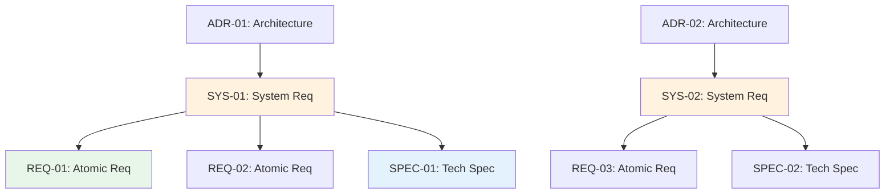

# Traceability Matrix: SYS-01 through SYS-NN

## Document Control

| Item | Details |
|------|---------|
| Document ID | TRACEABILITY_MATRIX_SYS |
| Title | Comprehensive System Requirements Traceability Matrix |
| Status | [Active/Draft] |
| Version | 1.0.0 |
| Date Created | YYYY-MM-DD |
| Author | [Team Name] |
| Purpose | Track bidirectional traceability for all System Requirements Documents |


---

**⚠️ TAG-BASED AUTO-GENERATION AVAILABLE**

This traceability matrix can be automatically generated by scanning code files for @sys:, @spec:, @test: tags.

**Recommended Approach:** Use tag-based auto-discovery instead of manual maintenance.

**Generate automatically using:**
```bash
# Extract tags from all files
python scripts/extract_tags.py --source src/ docs/ tests/ --output docs/generated/tags.json

# Validate tags against documents
python scripts/validate_tags_against_docs.py --tags docs/generated/tags.json --strict

# Generate SYS traceability matrix
python scripts/generate_traceability_matrices.py --type SYS --output docs/SYS/SYS-000_TRACEABILITY_MATRIX.md
```

**Benefits:**
- ✅ Single source of truth: Tags embedded in code
- ✅ Always up-to-date: Generated from current codebase
- ✅ No manual sync: Automated validation prevents drift
- ✅ Coverage metrics: Automatically calculated

**Tag Format:** `@sys: SYS.NN.EE.SS` (unified 4-segment format, e.g., `SYS.08.25.01`)

See: [TRACEABILITY.md](../TRACEABILITY.md#tag-based-auto-discovery-alternative) for complete tag-based workflow.

---

## 1. Overview

### 1.1 Document Type Description
System Requirements Documents (SYS) define system-level functional requirements and quality attributes derived from architecture decisions. SYS documents bridge architectural decisions (ADR) and atomic implementation requirements (REQ).

### 1.2 Coverage Scope
This matrix tracks all SYS documents, mapping upstream architecture decisions to downstream atomic requirements and technical specifications.

### 1.3 Statistics
- **Total SYS Tracked**: [X] documents
- **Total Requirements**: [Y] system requirements
- **Coverage Period**: [Start Date] to [End Date]
- **Last Updated**: YYYY-MM-DD

---

---

## 2. Required Tags (Cumulative Tagging Hierarchy - Layer 6)

### 2.1 Tag Requirements for SYS Artifacts

**Layer**: 6
**Artifact Type**: SYS (System Requirements)
**Required Tags**: `@brd`, `@prd`, `@ears`, `@bdd`, `@adr`
**Tag Count**: 5

### 2.2 Tag Format

```markdown
@brd: BRD.09.01.15, BRD.09.01.06
@prd: PRD.16.01.03
@ears: EARS.12.24.02, EARS.12.24.01
@bdd: BDD.15.13.01
@adr: ADR-033
```

**Format Rules**:
- Prefix: `@` symbol
- Artifact Type: lowercase (`brd`, `prd`, `ears`, `bdd`, `adr`)
- Separator: colon `:` after artifact type, `:` between document ID and requirement ID
- Document ID: Standard format (e.g., `SYS-NN`)
- Requirement ID: Specific requirement/section identifier
- Multiple Values: comma-separated for same artifact type

### 2.3 Example: SYS with Required Tags

```markdown
# SYS-012: Order Service System Requirements

## 8. Traceability

### 8.1 Upstream Sources

**Required Tags** (Cumulative Tagging Hierarchy - Layer 6):
```markdown
@brd: BRD.09.01.15, BRD.09.01.06
@prd: PRD.16.01.03
@ears: EARS.12.24.02, EARS.12.24.01
@bdd: BDD.15.13.01
@adr: ADR-033
```

### 8.2 Downstream Artifacts
[Links to SPEC, TASKS, Code that reference this SYS]
```

### 2.4 Validation Rules

1. **Required**: Each SYS artifact MUST include at least one tag for each required layer
2. **Format Compliance**: All tags must follow `@artifact-type: DOC-ID:NN` format
3. **Valid References**: All referenced documents and requirements must exist
4. **No Gaps**: Cannot skip any required upstream layer in the chain
5. **Tag Count**: Must have exactly 5 tags for Layer 6

### 2.5 Tag Discovery

SYS tags can be discovered automatically:
```bash
# Find all SYSs and their upstream tags
python scripts/extract_tags.py --type SYS --show-all-upstream

# Validate SYS-012 has required tags
python scripts/validate_tags_against_docs.py \
  --artifact SYS-012 \
  --expected-layers brd,prd,ears,bdd,adr \
  --strict

# Generate SYS traceability report
python scripts/generate_traceability_matrices.py \
  --type SYS \
  --show-coverage
```

### 2.6 SYS Traceability Pattern

**Key Role**: SYS translates architecture decisions into concrete system-level requirements that can be decomposed into atomic specifications.

---

## 4. Complete SYS Inventory

| SYS ID | Title | System Category | Total Requirements | Status | Date | Upstream Sources | Downstream Artifacts |
|--------|-------|-----------------|-------------------|--------|------|------------------|---------------------|
| SYS-01 | [System requirement title] | [Category] | [X] | Active | YYYY-MM-DD | ADR-01, EARS-01 | REQ-01, REQ-02, SPEC-01 |
| SYS-02 | [System requirement title] | [Category] | [X] | Active | YYYY-MM-DD | ADR-02 | REQ-03, SPEC-02 |
| SYS-NN | ... | ... | ... | ... | ... | ... | ... |

---

## 5. Upstream Traceability (REQUIRED)

> **Traceability Rule**: Upstream traceability is REQUIRED for SYS documents. All SYS requirements MUST reference existing BRD, PRD, EARS, BDD, and ADR documents.

### 5.1 ADR → SYS Traceability

| ADR ID | ADR Title | SYS IDs | SYS Titles | Relationship |
|--------|-----------|---------|------------|--------------|
| ADR-01 | [Architecture decision] | SYS-01, SYS-02 | [System requirements] | Architectural decisions translated to system requirements |
| ADR-NN | ... | ... | ... | ... |

### 5.2 EARS → SYS Traceability

| EARS ID | EARS Title | SYS IDs | SYS Titles | Relationship |
|---------|------------|---------|------------|--------------|
| EARS-01 | [Formal requirement] | SYS-01 | [System requirement] | Formal requirements inform system-level SPEC |
| EARS-NN | ... | ... | ... | ... |

---

## 6. Downstream Traceability (OPTIONAL)

> **Traceability Rule**: Downstream traceability is OPTIONAL. Only add links to documents that already exist. Do NOT use placeholder IDs (TBD, XXX, NN).

### 6.1 SYS → REQ Traceability

| SYS ID | SYS Title | REQ IDs | REQ Titles | Relationship |
|--------|-----------|---------|------------|--------------|
| SYS-01 | [System requirement] | REQ-01, REQ-02, REQ-03 | [Atomic requirements] | System requirements decomposed into atomic requirements |
| SYS-NN | ... | ... | ... | ... |

### 6.2 SYS → SPEC Traceability

| SYS ID | SYS Title | SPEC IDs | SPEC Titles | Relationship |
|--------|-----------|----------|-------------|--------------|
| SYS-01 | [System requirement] | SPEC-01, SPEC-02 | [Technical specifications] | System requirements implemented in specifications |
| SYS-NN | ... | ... | ... | ... |

---

## 7. System Requirements Categories

### 7.1 SYS by Category

| Category | SYS IDs | Total | Functional | Quality Attributes |
|----------|---------|-------|------------|-------------------|
| [Infrastructure] | SYS-01, SYS-02 | 2 | 1 | 1 |
| [security] | SYS-03, SYS-004 | 2 | 2 | 0 |
| [Performance] | SYS-005 | 1 | 0 | 1 |
| [Integration] | SYS-006, SYS-007 | 2 | 2 | 0 |

### 7.2 Quality Attributes Summary

| QA Category | SYS IDs | Requirements | Status |
|--------------|---------|--------------|--------|
| Performance | SYS-005 | [X] | [Status] |
| Scalability | SYS-02 | [X] | [Status] |
| security | SYS-03, SYS-004 | [X] | [Status] |
| Reliability | SYS-008 | [X] | [Status] |
| Maintainability | SYS-009 | [X] | [Status] |

---

## 8. Cross-SYS Dependencies



> **Note on Diagram Labels**: The above flowchart shows the sequential workflow. For formal layer numbers used in cumulative tagging, always reference the 16-layer architecture (Layers 0-15) defined in README.md. Diagram groupings are for visual clarity only.

---

## 9. Implementation Status

### 9.1 SYS Implementation Progress

| SYS ID | Total Requirements | REQ Created | SPEC Created | Completion % |
|--------|-------------------|-------------|--------------|--------------|
| SYS-01 | 10 | 10 | 5 | 75% |
| SYS-02 | 5 | 5 | 5 | 100% |
| SYS-03 | 8 | 4 | 0 | 25% |
| SYS-NN | ... | ... | ... | ... |

---

## 10. Immediate Next Steps

### 10.1 Priority Actions
1. **Complete Missing REQ Decomposition**: [X] SYS documents need atomic requirements
2. **Create SPEC Documents**: [Y] SYS documents need technical specifications
3. **Validate QA Coverage**: [Z] quality attributes need verification

---

## 11. Revision History

| Version | Date | Changes | Author |
|---------|------|---------|--------|
| 1.0.0 | YYYY-MM-DD | Initial creation | [Author Name] |

---

## 12. References

- **SYS Index**: [SYS-000_index.md](SYS-000_index.md)
- **SYS Template**: [SYS-TEMPLATE.md](SYS-TEMPLATE.md)
- **Complete Traceability Matrix**: [../TRACEABILITY_MATRIX_COMPLETE-TEMPLATE.md](../TRACEABILITY_MATRIX_COMPLETE-TEMPLATE.md)
- **Related Matrices**: [ADR](../ADR/ADR-000_TRACEABILITY_MATRIX-TEMPLATE.md), [REQ](../REQ/REQ-000_TRACEABILITY_MATRIX-TEMPLATE.md), [SPEC](../SPEC/SPEC-000_TRACEABILITY_MATRIX-TEMPLATE.md)
