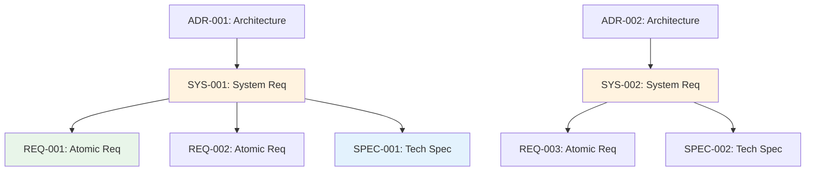

# Traceability Matrix: SYS-001 through SYS-NNN

## Document Control

| Item | Details |
|------|---------|
| Document ID | TRACEABILITY_MATRIX_SYS |
| Title | Comprehensive System Requirements Traceability Matrix |
| Status | [Active/Draft] |
| Version | 1.0.0 |
| Date Created | YYYY-MM-DD |
| Author | [Team Name] |
| Purpose | Track bidirectional traceability for all System Requirements Documents |

## 1. Overview

### 1.1 Document Type Description
System Requirements Documents (SYS) define system-level functional and non-functional requirements derived from architecture decisions. SYS documents bridge architectural decisions (ADR) and atomic implementation requirements (REQ).

### 1.2 Coverage Scope
This matrix tracks all SYS documents, mapping upstream architecture decisions to downstream atomic requirements and technical specifications.

### 1.3 Statistics
- **Total SYS Tracked**: [X] documents
- **Total Requirements**: [Y] system requirements
- **Coverage Period**: [Start Date] to [End Date]
- **Last Updated**: YYYY-MM-DD

---

## 2. Complete SYS Inventory

| SYS ID | Title | System Category | Total Requirements | Status | Date | Upstream Sources | Downstream Artifacts |
|--------|-------|-----------------|-------------------|--------|------|------------------|---------------------|
| SYS-001 | [System requirement title] | [Category] | [X] | Active | YYYY-MM-DD | ADR-001, EARS-001 | REQ-001, REQ-002, SPEC-001 |
| SYS-002 | [System requirement title] | [Category] | [X] | Active | YYYY-MM-DD | ADR-002 | REQ-003, SPEC-002 |
| SYS-NNN | ... | ... | ... | ... | ... | ... | ... |

---

## 3. Upstream Traceability

### 3.1 ADR → SYS Traceability

| ADR ID | ADR Title | SYS IDs | SYS Titles | Relationship |
|--------|-----------|---------|------------|--------------|
| ADR-001 | [Architecture decision] | SYS-001, SYS-002 | [System requirements] | Architectural decisions translated to system requirements |
| ADR-NNN | ... | ... | ... | ... |

### 3.2 EARS → SYS Traceability

| EARS ID | EARS Title | SYS IDs | SYS Titles | Relationship |
|---------|------------|---------|------------|--------------|
| EARS-001 | [Formal requirement] | SYS-001 | [System requirement] | Formal requirements inform system-level SPEC |
| EARS-NNN | ... | ... | ... | ... |

---

## 4. Downstream Traceability

### 4.1 SYS → REQ Traceability

| SYS ID | SYS Title | REQ IDs | REQ Titles | Relationship |
|--------|-----------|---------|------------|--------------|
| SYS-001 | [System requirement] | REQ-001, REQ-002, REQ-003 | [Atomic requirements] | System requirements decomposed into atomic requirements |
| SYS-NNN | ... | ... | ... | ... |

### 4.2 SYS → SPEC Traceability

| SYS ID | SYS Title | SPEC IDs | SPEC Titles | Relationship |
|--------|-----------|----------|-------------|--------------|
| SYS-001 | [System requirement] | SPEC-001, SPEC-002 | [Technical specifications] | System requirements implemented in specifications |
| SYS-NNN | ... | ... | ... | ... |

---

## 5. System Requirements Categories

### 5.1 SYS by Category

| Category | SYS IDs | Total | Functional | Non-Functional |
|----------|---------|-------|------------|----------------|
| [Infrastructure] | SYS-001, SYS-002 | 2 | 1 | 1 |
| [Security] | SYS-003, SYS-004 | 2 | 2 | 0 |
| [Performance] | SYS-005 | 1 | 0 | 1 |
| [Integration] | SYS-006, SYS-007 | 2 | 2 | 0 |

### 5.2 Non-Functional Requirements Summary

| NFR Category | SYS IDs | Requirements | Status |
|--------------|---------|--------------|--------|
| Performance | SYS-005 | [X] | [Status] |
| Scalability | SYS-002 | [X] | [Status] |
| Security | SYS-003, SYS-004 | [X] | [Status] |
| Reliability | SYS-008 | [X] | [Status] |
| Maintainability | SYS-009 | [X] | [Status] |

---

## 6. Cross-SYS Dependencies

---

## 7. Implementation Status

### 7.1 SYS Implementation Progress

| SYS ID | Total Requirements | REQ Created | SPEC Created | Completion % |
|--------|-------------------|-------------|--------------|--------------|
| SYS-001 | 10 | 10 | 5 | 75% |
| SYS-002 | 5 | 5 | 5 | 100% |
| SYS-003 | 8 | 4 | 0 | 25% |
| SYS-NNN | ... | ... | ... | ... |

---

## 8. Immediate Next Steps

### 8.1 Priority Actions
1. **Complete Missing REQ Decomposition**: [X] SYS documents need atomic requirements
2. **Create SPEC Documents**: [Y] SYS documents need technical specifications
3. **Validate NFR Coverage**: [Z] non-functional requirements need verification

---

## 9. Revision History

| Version | Date | Changes | Author |
|---------|------|---------|--------|
| 1.0.0 | YYYY-MM-DD | Initial creation | [Author Name] |

---

## 10. References

- **SYS Index**: [SYS-000_index.md](SYS-000_index.md)
- **SYS Template**: [SYS-TEMPLATE.md](SYS-TEMPLATE.md)
- **Complete Traceability Matrix**: [../TRACEABILITY_MATRIX_COMPLETE-TEMPLATE.md](../TRACEABILITY_MATRIX_COMPLETE-TEMPLATE.md)
- **Related Matrices**: [ADR](../ADR/ADR-000_TRACEABILITY_MATRIX-TEMPLATE.md), [REQ](../REQ/REQ-000_TRACEABILITY_MATRIX-TEMPLATE.md), [SPEC](../SPEC/SPEC-000_TRACEABILITY_MATRIX-TEMPLATE.md)
