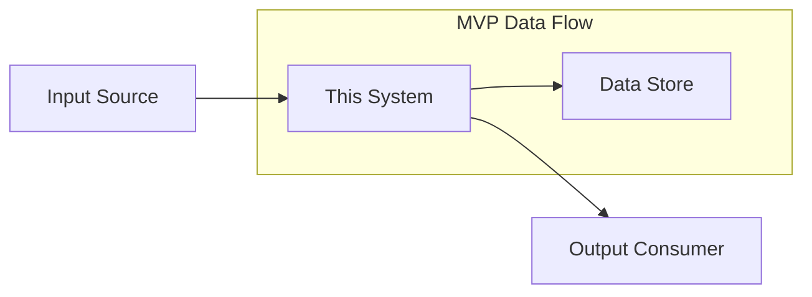

<!--
AI_CONTEXT_START
Role: AI Systems Engineer
Objective: Create a streamlined MVP System Requirements Document.
Constraints:
- Focus on 5-10 core system capabilities.
- Define clear interfaces and data flows.
- Omit exhaustive non-functional requirements not critical for MVP.
- Maintain single-file structure.
AI_CONTEXT_END
-->
> **MVP Template** — Single-file, streamlined SYS for rapid MVP development.
> Use this template for MVPs with focused system scope (5-10 core capabilities).
> For comprehensive system specs (20+ capabilities, enterprise), use `SYS-TEMPLATE.md`.

> **Validation Note**: MVP templates are intentionally streamlined and will show validation errors when run against full template validators (e.g., `validate_sys.py`). This is expected behavior. See `scripts/README.md` → "MVP Template Validation" for guidance.

# SYS-01: Trading Bot

**⚠️ MVP Scope**: This system specification focuses on core MVP capabilities. Extended system requirements deferred to full SYS document upon MVP success.

## 1. Document Control

| Item | Details |
|------|---------|
| **Status** | Draft / Under Review / Approved |
| **Version** | 0.1.0 |
| **Date Created** | YYYY-MM-DD |
| **Last Updated** | YYYY-MM-DD |
| **Author** | [Technical Lead/Architect] |
| **Owner** | [Team responsible] |
| **Priority** | High |
| **REQ-Ready Score** | [Score]/100 (Target: ≥85 for MVP) |

---

## 2. Executive Summary

[2-3 sentences: What this system component does and its architectural role]

### 2.1 System Context

**Architecture Layer**: [Frontend/Backend/Data/Infrastructure]

**Interacts With**:
- Upstream: [Systems that send data/requests to this system]
- Downstream: [Systems that consume from this system]

**Business Value**: [1-2 sentences on what business outcome this enables]

---

## 3. Scope

### 3.1 System Boundaries

**Included Capabilities (MVP)**:
- [Primary capability 1]
- [Primary capability 2]
- [Primary capability 3]

**Excluded Capabilities (Post-MVP)**:
- [Deferred capability 1] - Reason: [why deferred]
- [Deferred capability 2] - Reason: [why deferred]

### 3.2 External Dependencies

| Dependency | Type | Status | Impact if Unavailable |
|------------|------|--------|----------------------|
| [System/Service 1] | [API/Database/Queue] | [Available] | [Fallback behavior] |
| [System/Service 2] | [API/Database/Queue] | [Available] | [Fallback behavior] |

---

## 4. Functional Requirements

**ID Format**: `SYS-01.01.SS` (Functional Requirement)

### 4.1 Core System Behaviors

#### SYS-01.01.01: [Capability Name]

**Description**: [What the system does for this capability]

| Aspect | Specification |
|--------|---------------|
| **Inputs** | [Data/parameters required] |
| **Processing** | [How inputs are transformed] |
| **Outputs** | [Results produced] |
| **Success Criteria** | [How to verify it works] |

---

#### SYS-01.01.02: [Capability Name]

**Description**: [What the system does]

| Aspect | Specification |
|--------|---------------|
| **Inputs** | [Data/parameters required] |
| **Processing** | [How inputs are transformed] |
| **Outputs** | [Results produced] |
| **Success Criteria** | [How to verify] |

---

#### SYS-01.01.03: [Capability Name]

**Description**: [What the system does]

| Aspect | Specification |
|--------|---------------|
| **Inputs** | [Data/parameters required] |
| **Processing** | [How inputs are transformed] |
| **Outputs** | [Results produced] |
| **Success Criteria** | [How to verify] |

---

### 4.2 Data Processing (MVP Baseline)

**Input Handling**:
- Validation: [Schema validation, type checking]
- Error handling: [What happens with invalid data]

**Data Storage** (if applicable):
- Storage type: [Database/Cache/File/None]
- Retention: [How long data is kept]

**Output Format**:
- Schema: [Reference to data schema or brief description]
- Validation: [Output validation approach]

### 4.3 Error Handling (MVP)

| Error Type | System Behavior | User Experience |
|------------|-----------------|-----------------|
| Invalid input | [Reject with error] | [Error message shown] |
| External service down | [Retry/Queue/Fail] | [User notification] |
| Processing error | [Log and alert] | [Graceful error message] |

---

## 5. Quality Attributes (Baseline)

**ID Format**: `SYS-01.02.SS` (Quality Attribute)

### 5.1 Performance (SYS-01.02.01)

| Metric | MVP Target | Measurement |
|--------|------------|-------------|
| Response time (p50) | < [X]ms | APM traces |
| Response time (p95) | < [X]ms | APM traces |
| Throughput | [X] req/sec | Load testing |

### 5.2 Reliability (SYS-01.02.02)

| Metric | MVP Target | Notes |
|--------|------------|-------|
| Availability | [95-99]% | Excluding maintenance |
| Error rate | < [X]% | Of total requests |
| Recovery time | < [X] minutes | From failure detection |

### 5.3 Security (SYS-01.02.03)

- [ ] **Authentication**: [JWT/OAuth2/API Key]
- [ ] **Authorization**: [Role-based/Attribute-based]
- [ ] **Encryption in transit**: TLS 1.2+
- [ ] **Encryption at rest**: [AES-256/None for MVP]
- [ ] **Input validation**: All user inputs validated

### 5.4 Observability (SYS-01.02.04)

**Logging**:
- Format: [Structured JSON]
- Levels: [DEBUG, INFO, WARN, ERROR]
- Correlation: [Request ID propagation]

**Metrics** (MVP baseline):
- Request count, error rate, latency (p50/p95)
- [Domain-specific metrics]

**Alerting**:
- Error rate > [X]% for [Y] minutes
- Latency (p95) > [X]ms for [Y] minutes

---

## 6. Interface Specifications

### 6.1 API Interfaces (High-Level)

> **Note**: Detailed API contracts (endpoints, schemas) created as CTR documents during IMPL phase.

**Interface Style**: [REST/gRPC/GraphQL]

| Endpoint Pattern | Method | Purpose | Auth |
|------------------|--------|---------|------|
| `/api/v1/[resource]` | GET | [What it retrieves] | [Required/Optional] |
| `/api/v1/[resource]` | POST | [What it creates] | [Required] |
| `/api/v1/[resource]/{id}` | PUT | [What it updates] | [Required] |

### 6.2 Data Formats

**Request Format**: JSON
**Response Format**: JSON

**Standard Response Structure**:
```json
{
  "success": true,
  "data": { ... },
  "error": null,
  "request_id": "uuid"
}
```

**Error Response Structure**:
```json
{
  "success": false,
  "data": null,
  "error": {
    "code": "ERROR_CODE",
    "message": "Human readable message",
    "details": { ... }
  },
  "request_id": "uuid"
}
```

---

## 7. Data Management

### 7.1 Data Model (MVP)

| Entity | Key Fields | Storage | Retention |
|--------|------------|---------|-----------|
| [Entity 1] | [id, field1, field2] | [PostgreSQL/Redis] | [X days] |
| [Entity 2] | [id, field1, field2] | [PostgreSQL/Redis] | [X days] |

### 7.2 Data Flow



---

## 8. Deployment & Operations

### 8.1 Deployment (MVP)

**Environment**: [Cloud Run/GKE/Cloud Functions]
**Regions**: [Single region for MVP]
**Scaling**: [Min/Max instances]

### 8.2 Configuration

| Config Parameter | Type | Default | Description |
|------------------|------|---------|-------------|
| [PARAM_NAME] | [string/int/bool] | [default] | [What it controls] |
| [PARAM_NAME] | [string/int/bool] | [default] | [What it controls] |

### 8.3 Maintenance

**Backup** (if applicable):
- Frequency: [Daily/Weekly]
- Retention: [X days]
- Recovery test: [Monthly]

---

## 9. Testing Requirements

### 9.1 Test Coverage (MVP Targets)

| Test Type | Target Coverage | Scope |
|-----------|-----------------|-------|
| Unit tests | ≥ [70]% | Core business logic |
| Integration tests | Critical paths | API endpoints, external calls |
| Load tests | Baseline metrics | Performance targets |

### 9.2 BDD Scenario Coverage

| Capability | BDD Feature | Scenario Count |
|------------|-------------|----------------|
| [Capability 1] | `BDD-NN_{suite}.feature` | [X] scenarios |
| [Capability 2] | `BDD-NN_{suite}.feature` | [X] scenarios |

---

## 10. Acceptance Criteria

### 10.1 Functional Validation

- [ ] [Capability 1] works end-to-end
- [ ] [Capability 2] works end-to-end
- [ ] [Capability 3] works end-to-end
- [ ] Error handling returns appropriate messages
- [ ] All API endpoints respond correctly

### 10.2 Quality Validation

- [ ] Performance targets met in staging
- [ ] Security controls verified
- [ ] Logging and monitoring in place
- [ ] Documentation complete

---

## 11. Risk Assessment (Top 5)

**ID Format**: `SYS-01.07.SS` (Risk)

| Risk ID | Risk | Likelihood | Impact | Mitigation |
|---------|------|------------|--------|------------|
| SYS-01.07.01 | [Risk description] | [H/M/L] | [H/M/L] | [Strategy] |
| SYS-01.07.02 | [Risk description] | [H/M/L] | [H/M/L] | [Strategy] |
| SYS-01.07.03 | [Risk description] | [H/M/L] | [H/M/L] | [Strategy] |

---

## 12. Traceability

### 12.1 Upstream References

| Source | Document | Relevant Section |
|--------|----------|------------------|
| BRD | BRD.NN | [Business requirements] |
| PRD | PRD.NN | [Product features] |
| EARS | EARS.NN | [Engineering requirements] |
| ADR | ADR.NN | [Architecture decisions] |

### 12.2 Downstream Artifacts

| Artifact | Status | Relationship |
|----------|--------|--------------|
| REQ-NN | TBD | Atomic requirements from this SYS |
| SPEC-NN | TBD | Technical specifications |
| CTR-NN | TBD | API contracts |

### 12.3 Traceability Tags

```markdown
@brd: BRD.NN.EE.SS
@prd: PRD.NN.EE.SS
@ears: EARS.NN.24.SS
@adr: ADR.NN.EE.SS
```

---

## Appendix A: Future Roadmap (Post-MVP)

### Deferred Capabilities

| Capability | Priority | Effort | Dependency |
|------------|----------|--------|------------|
| [Capability] | P1 | [X] weeks | MVP complete |
| [Capability] | P2 | [X] weeks | [Dependency] |

### Scaling Considerations

- **Horizontal scaling**: [Approach for scaling out]
- **Performance optimization**: [Areas to optimize post-MVP]
- **Additional quality targets**: [99.9% availability, etc.]

---

## Migration to Full SYS Template

### When to Migrate

Migrate from MVP SYS to full `SYS-TEMPLATE.md` when:
- [ ] Capabilities exceed 10 for this system
- [ ] Need detailed interface specifications
- [ ] Compliance requirements demand comprehensive testing
- [ ] Multi-region or high-availability needed
- [ ] Full 15-section format required for audits

### Migration Steps

1. **Create new document**: Copy `SYS-TEMPLATE.md` to `SYS-01_{slug}.md`
2. **Transfer core content**: Map MVP sections to full template
3. **Expand detailed sections**:
   - Full interface specifications with schemas
   - Extended quality attributes (all 6 categories)
   - Comprehensive testing requirements
   - Detailed deployment & operations
4. **Add missing sections**: Compliance, detailed risk assessment
5. **Update traceability**: Ensure REQ documents reference new SYS
6. **Archive MVP version**: Move to archive with "superseded" note
7. **Run validation**: Execute `python3 scripts/validate_sys.py` on new document

### Section Mapping (MVP → Full)

| MVP Section | Full Template Section |
|-------------|-----------------------|
| 1. Document Control | 1. Document Control |
| 2. Executive Summary | 2. Executive Summary |
| 3. Scope | 3. Scope (expand) |
| 4. Functional Requirements | 4. Functional Requirements (expand) |
| 5. Quality Attributes | 5. Quality Attributes (expand all 6) |
| 6. Interface Specifications | 6. Interface Specifications (expand) |
| 7. Data Management | 7. Data Management (expand) |
| 8. Deployment & Operations | 8-9. Deployment + Testing (expand) |
| 9. Testing Requirements | 10. Compliance Requirements (add) |
| 10. Acceptance Criteria | 11. Acceptance Criteria |
| 11. Risk Assessment | 12. Risk Assessment (expand) |
| 12. Traceability | 13-15. Traceability + History |

---

**Document Version**: 0.1.0
**Template Version**: 1.0 (MVP)
**Last Updated**: YYYY-MM-DD

---

> **MVP Template Notes**:
> - This template is ~350 lines (vs 1,024 lines for full SYS)
> - Single file - no sectioning
> - Focus on 5-10 core capabilities
> - Maintains ai_dev_flow framework compliance
> - Expands to full SYS-TEMPLATE.md structure upon MVP success

<!-- Autopilot traceability tags -->
@brd: BRD-01
@prd: PRD-01
@ears: EARS-01
@bdd: BDD-01
@adr: ADR-01

## 5. Quality Attributes
Performance: target latency 200ms
Security: baseline

## 8. Testing Requirements
Coverage: 80%

## 9. Deployment Requirements
[Deploy]

## 10. Compliance Requirements
[Compliance]

## 11. Acceptance Criteria
[Criteria]

## 12. Risk Assessment
[Risks]

## 13. Traceability
@brd: BRD.01
@prd: PRD.01
@ears: EARS.01
@bdd: BDD.01
@adr: ADR.01

## 14. Implementation Notes
[Notes]

## 15. Change History
| Date | Version | Notes |
|------|---------|-------|
| 2025-01-04 | 0.1.0 | Initial |
