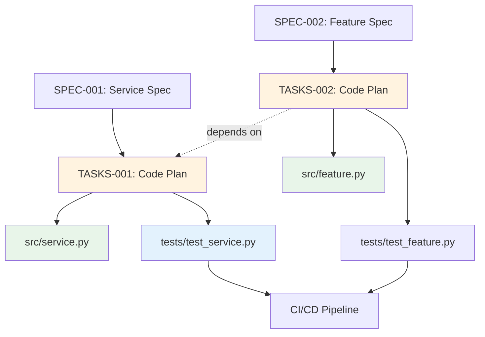

# Traceability Matrix: TASKS-001 through TASKS-NNN

## Document Control

| Item | Details |
|------|---------|
| Document ID | TRACEABILITY_MATRIX_TASKS |
| Title | Comprehensive Code Generation Tasks Traceability Matrix |
| Status | [Active/Draft] |
| Version | 1.0.0 |
| Date Created | YYYY-MM-DD |
| Author | [Team Name] |
| Purpose | Track bidirectional traceability for all AI Code Generation Task Documents |


---

**⚠️ TAG-BASED AUTO-GENERATION AVAILABLE**

This traceability matrix can be automatically generated by scanning code files for @tasks:, @spec:, @test: tags.

**Recommended Approach:** Use tag-based auto-discovery instead of manual maintenance.

**Generate automatically using:**
```bash
# Extract tags from all files
python scripts/extract_tags.py --source src/ docs/ tests/ --output docs/generated/tags.json

# Validate tags against documents
python scripts/validate_tags_against_docs.py --tags docs/generated/tags.json --strict

# Generate TASKS traceability matrix
python scripts/generate_traceability_matrices.py --type TASKS --output docs/TASKS/TASKS-000_TRACEABILITY_MATRIX.md
```

**Benefits:**
- ✅ Single source of truth: Tags embedded in code
- ✅ Always up-to-date: Generated from current codebase
- ✅ No manual sync: Automated validation prevents drift
- ✅ Coverage metrics: Automatically calculated

**Tag Format:** `@tasks: TASKS-001:REQ-ID` (for multi-requirement docs) or `@tasks: TASKS-001` (for single-doc refs)

See: [TRACEABILITY.md](../TRACEABILITY.md#tag-based-auto-discovery-alternative) for complete tag-based workflow.

---

## 1. Overview

### 1.1 Document Type Description
Code Generation Task Documents (TASKS) provide step-by-step implementation instructions for AI assistants. TASKS documents translate technical specifications (SPEC) into concrete TODOs for code generation.

### 1.2 Coverage Scope
This matrix tracks all TASKS documents, mapping upstream specifications to downstream code implementations and test suites.

### 1.3 Statistics
- **Total TASKS Tracked**: [X] documents
- **Total Tasks**: [Y] implementation tasks
- **Coverage Period**: [Start Date] to [End Date]
- **Last Updated**: YYYY-MM-DD

---

---

## 2. Required Tags (Cumulative Tagging Hierarchy - Layer 11)

### 2.1 Tag Requirements for TASKS Artifacts

**Layer**: 11
**Artifact Type**: TASKS (Implementation Tasks)
**Required Tags**: `@brd`, `@prd`, `@ears`, `@bdd`, `@adr`, `@sys`, `@req`, `@spec`
**Tag Count**: 8-10 (includes @spec, optional @impl, @ctr)

### 2.2 Tag Format

```markdown
@brd: BRD-009:FR-015
@prd: PRD-016:FEATURE-003
@ears: EARS-012:EVENT-002
@bdd: BDD-015:scenario-place-order
@adr: ADR-033
@sys: SYS-012:FUNC-001
@req: REQ-045:interface-spec
@impl: IMPL-003:phase2
@ctr: CTR-005
@spec: SPEC-018
```

**Format Rules**:
- Prefix: `@` symbol
- Artifact Type: lowercase (`brd`, `prd`, `ears`, `bdd`, `adr`, `sys`, `req`, `spec`)
- Separator: colon `:` after artifact type, `:` between document ID and requirement ID
- Document ID: Standard format (e.g., `TASKS-NNN`)
- Requirement ID: Specific requirement/section identifier
- Multiple Values: comma-separated for same artifact type

### 2.3 Example: TASKS with Required Tags

```markdown
# TASKS-015: Order Service Implementation Tasks

## 7. Traceability

### 7.1 Upstream Sources

**Required Tags** (Cumulative Tagging Hierarchy - Layer 11):
```markdown
@brd: BRD-009:FR-015
@prd: PRD-016:FEATURE-003
@ears: EARS-012:EVENT-002
@bdd: BDD-015:scenario-place-order
@adr: ADR-033
@sys: SYS-012:FUNC-001
@req: REQ-045:interface-spec
@impl: IMPL-003:phase2
@ctr: CTR-005
@spec: SPEC-018
```

### 7.2 Downstream Artifacts
[Links to SPEC, TASKS, Code that reference this TASKS]
```

### 2.4 Validation Rules

1. **Required**: Each TASKS artifact MUST include at least one tag for each required layer
2. **Format Compliance**: All tags must follow `@artifact-type:DOC-ID:REQ-ID` format
3. **Valid References**: All referenced documents and requirements must exist
4. **No Gaps**: Cannot skip any required upstream layer in the chain
5. **Tag Count**: Must have exactly 8-10 (includes @spec, optional @impl, @ctr) tags for Layer 11

### 2.5 Tag Discovery

TASKS tags can be discovered automatically:
```bash
# Find all TASKSs and their upstream tags
python scripts/extract_tags.py --type TASKS --show-all-upstream

# Validate TASKS-015 has required tags
python scripts/validate_tags_against_docs.py \
  --artifact TASKS-015 \
  --expected-layers brd,prd,ears,bdd,adr,sys,req,spec \
  --strict

# Generate TASKS traceability report
python scripts/generate_traceability_matrices.py \
  --type TASKS \
  --show-coverage
```

### 2.6 TASKS Traceability Pattern

**Key Role**: TASKS breaks down technical specifications into atomic, session-scoped implementation units with complete upstream traceability.

---

## 4. Complete TASKS Inventory

| TASKS ID | Title | Related SPEC | Total Tasks | Status | Date | Upstream Sources | Downstream Artifacts |
|----------|-------|--------------|-------------|--------|------|------------------|---------------------|
| TASKS-001 | [Code generation plan title] | SPEC-001 | 15 | Complete | YYYY-MM-DD | SPEC-001 | Code: src/service.py, Tests: tests/test_service.py |
| TASKS-002 | [Code generation plan title] | SPEC-002 | 10 | In Progress | YYYY-MM-DD | SPEC-002 | Code: src/feature.py |
| TASKS-NNN | ... | ... | ... | ... | ... | ... | ... |

**Status Legend**:
- **Complete**: All tasks implemented and tested
- **In Progress**: Implementation underway
- **Pending**: Not yet started
- **Blocked**: Waiting on dependencies

---

## 5. Upstream Traceability

### 4.1 SPEC → TASKS Traceability

| SPEC ID | SPEC Title | TASKS IDs | TASKS Titles | Relationship |
|---------|------------|-----------|--------------|--------------|
| SPEC-001 | [Technical specification] | TASKS-001 | [Code generation plan] | 1:1 mapping: each SPEC has corresponding TASKS |
| SPEC-002 | [Technical specification] | TASKS-002 | [Code generation plan] | SPEC provides HOW, TASKS provides step-by-step |
| SPEC-NNN | ... | ... | ... | ... |

### 4.2 Upstream Source Summary

| Source Type | Total Sources | TASKS Derived | Coverage % |
|-------------|---------------|---------------|------------|
| SPEC | [X] | [Y] TASKS | XX% |
| Direct REQ | [X] | [Y] TASKS | XX% |

---

## 6. Downstream Traceability

### 5.1 TASKS → Code Traceability

| TASKS ID | TASKS Title | Code Files | Functions/Classes | LOC | Relationship |
|----------|------------|------------|-------------------|-----|--------------|
| TASKS-001 | [Code generation plan] | src/service.py | ServiceClass, init(), run() | 350 | Direct implementation from tasks |
| TASKS-002 | [Code generation plan] | src/feature.py, src/utils.py | FeatureHandler, helper_func() | 280 | Partial implementation |
| TASKS-NNN | ... | ... | ... | ... | ... |

### 5.2 TASKS → Tests Traceability

| TASKS ID | TASKS Title | Test Files | Test Functions | Coverage % | Relationship |
|----------|------------|------------|----------------|------------|--------------|
| TASKS-001 | [Code generation plan] | tests/test_service.py | test_init(), test_run(), ... | 95% | Tests generated from TASKS |
| TASKS-002 | [Code generation plan] | tests/test_feature.py | test_handler(), ... | 80% | Tests in progress |
| TASKS-NNN | ... | ... | ... | ... | ... |

---

## 7. Task Organization

### 6.1 TASKS by Implementation Type

| Implementation Type | TASKS IDs | Total | Tasks Count | Status |
|---------------------|-----------|-------|-------------|--------|
| Service | TASKS-001, TASKS-002 | 2 | 25 tasks | On Track |
| Agent | TASKS-003, TASKS-004 | 2 | 30 tasks | In Progress |
| Infrastructure | TASKS-005 | 1 | 12 tasks | Pending |
| Integration | TASKS-006 | 1 | 18 tasks | Blocked |

### 6.2 Task Completion Distribution

| TASKS ID | Total Tasks | Completed | In Progress | Pending | Completion % |
|----------|-------------|-----------|-------------|---------|--------------|
| TASKS-001 | 15 | 15 | 0 | 0 | 100% |
| TASKS-002 | 10 | 6 | 3 | 1 | 60% |
| TASKS-003 | 12 | 0 | 2 | 10 | 17% |
| TASKS-NNN | ... | ... | ... | ... | ... |

---

## 8. Cross-TASKS Dependencies



### 7.1 Inter-TASKS Dependencies

| Source TASKS | Target TASKS | Dependency Type | Description |
|--------------|--------------|-----------------|-------------|
| TASKS-001 | TASKS-002 | Prerequisite | Core service must be implemented before features |
| TASKS-003 | TASKS-001 | Uses | Agent uses core service components |
| TASKS-NNN | ... | ... | ... |

---

## 9. Implementation Metrics

### 8.1 Code Generation Efficiency

| TASKS ID | Tasks Count | Dev Time (hours) | LOC Generated | Time/Task (hours) | Quality Score |
|----------|-------------|------------------|---------------|-------------------|---------------|
| TASKS-001 | 15 | 40 | 350 | 2.7 | 9/10 |
| TASKS-002 | 10 | 25 | 280 | 2.5 | 8/10 |
| TASKS-003 | 12 | 8 (partial) | 120 | N/A | N/A |
| TASKS-NNN | ... | ... | ... | ... | ... |

### 8.2 Test Coverage from TASKS

| TASKS ID | Unit Tests | Integration Tests | E2E Tests | Total Coverage % | Target % |
|----------|------------|-------------------|-----------|------------------|----------|
| TASKS-001 | 95% | 90% | 85% | 95% | 95% ✅ |
| TASKS-002 | 80% | 70% | N/A | 80% | 85% 🟡 |
| TASKS-003 | 0% | 0% | 0% | 0% | 85% ⏳ |
| TASKS-NNN | ... | ... | ... | ... | ... |

---

## 10. Implementation Status

### 9.1 TASKS Execution Progress

| TASKS ID | Code Status | Tests Status | Documentation Status | Overall | Completion % |
|----------|-------------|--------------|---------------------|---------|--------------|
| TASKS-001 | ✅ Complete | ✅ Complete | ✅ Complete | Complete | 100% |
| TASKS-002 | 🟡 In Progress | 🟡 Partial | 🟡 Partial | In Progress | 60% |
| TASKS-003 | ⏳ Pending | ⏳ Pending | ⏳ Pending | Not Started | 0% |
| TASKS-NNN | ... | ... | ... | ... | ... |

### 9.2 AI Assistant Usage Tracking

| TASKS ID | AI Sessions | Manual Edits | AI-Generated % | Manual % | Efficiency Rating |
|----------|-------------|--------------|----------------|----------|-------------------|
| TASKS-001 | 3 sessions | 10 edits | 90% | 10% | High |
| TASKS-002 | 2 sessions | 25 edits | 75% | 25% | Medium |
| TASKS-003 | 0 sessions | 0 edits | 0% | 0% | N/A |
| TASKS-NNN | ... | ... | ... | ... | ... |

---

## 11. Gap Analysis

### 10.1 Missing Downstream Artifacts
- TASKS-XXX: Missing code implementation (tasks not executed)
- TASKS-YYY: Missing tests (code generated but not tested)
- TASKS-ZZZ: Missing documentation (implementation without docs)

### 10.2 Orphaned Artifacts
- Code File: src/orphan.py (no TASKS traceability)
- Test File: tests/test_unknown.py (no TASKS linkage)

### 10.3 Quality Issues
- TASKS-002: Test coverage below target (80% vs 85%)
- TASKS-005: Blocked by missing dependency
- TASKS-007: High manual edit percentage (poor task quality)

---

## 12. Immediate Next Steps

### 11.1 Priority Actions
1. **Execute Pending TASKS**: [X] code generation plans need implementation
2. **Complete Partial Implementations**: [Y] TASKS have incomplete code
3. **Improve Test Coverage**: [Z] TASKS below target coverage
4. **Unblock Blocked TASKS**: [N] TASKS waiting on dependencies

### 11.2 Code Generation Schedule

| Sprint | TASKS IDs | Focus Area | Target Date | Status |
|--------|-----------|------------|-------------|--------|
| Sprint 5 | TASKS-002 | Complete in-progress features | YYYY-MM-DD | Active |
| Sprint 6 | TASKS-003, TASKS-004 | Start agent implementation | YYYY-MM-DD | Planning |
| Sprint 7 | TASKS-005, TASKS-006 | Infrastructure & integration | YYYY-MM-DD | Not Started |

---

## 13. Revision History

| Version | Date | Changes | Author |
|---------|------|---------|--------|
| 1.0.0 | YYYY-MM-DD | Initial creation | [Author Name] |

---

## 14. References

- **TASKS Index**: [TASKS-000_index.md](TASKS-000_index.md)
- **TASKS Template**: [TASKS-TEMPLATE.md](TASKS-TEMPLATE.md)
- **Complete Traceability Matrix**: [../TRACEABILITY_MATRIX_COMPLETE-TEMPLATE.md](../TRACEABILITY_MATRIX_COMPLETE-TEMPLATE.md)
- **Related Matrices**: [SPEC](../SPEC/SPEC-000_TRACEABILITY_MATRIX-TEMPLATE.md), Code Repository

---

## Appendix A: Matrix Maintenance

### Automated Generation
```bash
python ../scripts/generate_traceability_matrix.py \
  --type TASKS \
  --input ../TASKS/ \
  --template TASKS-000_TRACEABILITY_MATRIX-TEMPLATE.md \
  --output TRACEABILITY_MATRIX_TASKS.md \
  --scan-code-repo
```

### Quality Checklist
- [ ] All TASKS documents included in inventory
- [ ] Upstream SPEC sources documented
- [ ] Downstream code/tests mapped
- [ ] Task completion status current
- [ ] Code generation metrics calculated
- [ ] Test coverage tracked
- [ ] AI assistant usage tracked
- [ ] Inter-TASKS dependencies identified
- [ ] Gap analysis identifies missing implementations
- [ ] Orphaned code files identified
