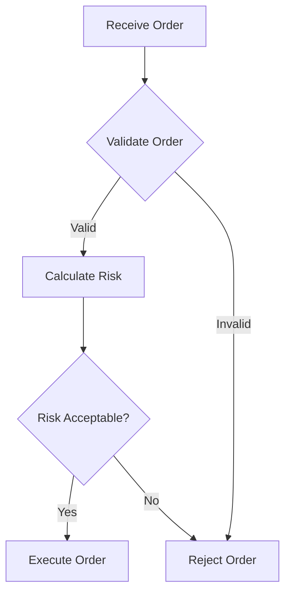

# AI Coding Tool Optimization Guide

**Version**: 1.0
**Last Updated**: 2025-11-07
**Purpose**: Guide for selecting and optimizing AI coding tools for docs_flow_framework

---

## Executive Summary

This framework optimizes for **Claude Code** as the primary tool (200K token context window) while maintaining compatibility with **Gemini CLI** and **GitHub Copilot**. Token limits have been adjusted from the legacy 10K limit (Gemini CLI `@` reference constraint) to 50K tokens standard, 100K tokens maximum.

**Key Changes from Previous Standards:**
- **Old Limit**: 10,000 tokens per file (designed for Gemini CLI `@` references)
- **New Limit**: 50,000 tokens standard, 100,000 tokens maximum (Claude Code optimized)
- **Impact**: 5-10x larger documentation files without artificial splitting
- **Migration**: Progressive adoption (new files and updates only)

---

## Token Limit Standards by Tool

### Claude Code (Primary Tool - RECOMMENDED)

**Context Window**: 200,000 tokens (~600KB text)

**Optimal File Sizes:**
- **Standard Documents** (REQ, ADR, BDD, SPEC, CTR): 5,000-15,000 tokens (20-60KB)
- **Template Files** (BRD-TEMPLATE, SPEC-TEMPLATE): 10,000-25,000 tokens (40-100KB)
- **Comprehensive Guides** (README, SPEC_DRIVEN_DEVELOPMENT_GUIDE): 15,000-50,000 tokens (60-200KB)
- **Master References** (complete traceability matrices): Up to 100,000 tokens (400KB) maximum

**Token Limits:**
- **Standard**: 50,000 tokens (200KB) per file
- **Maximum**: 100,000 tokens (400KB) absolute limit
- **Simultaneous Files**: Can handle 30-50 files at once
- **Total Context**: Aim for <150KB total across all files

**When to Use Claude Code:**
- Complex refactoring across multiple files
- Comprehensive documentation review
- Large file analysis (20-100KB files)
- Multi-file coordination tasks
- Primary development workflow

**Advantages:**
- Optimal for 20-40KB files (uses 20-30% of context)
- Single-file comprehensive documentation
- No artificial splitting required
- Superior reasoning and code quality
- MCP server support for extended capabilities

**Cost**: ~$3/hour of active usage

Reference: [AI_Coding_Tools_Comparison.md](../AI_Coding_Tools_Comparison.md)

---

### Gemini CLI (Secondary Tool - Alternative)

**Context Window**: 1,000,000 tokens (conversation total)

**CRITICAL LIMITATION**: The `@` file reference syntax is limited to ~13,000 tokens (~10-13KB) per file, NOT the full 1M context.

**File Handling Methods:**

#### Method 1: File Read Tool (RECOMMENDED for files >10K tokens)
```bash
gemini

# Gemini automatically uses file read tool
> "Read LARGE_FILE.md and summarize key requirements"
> "Analyze section 5 of LARGE_FILE.md"
> "Find all security requirements in LARGE_FILE.md"
```

**No token limit** - file read tool handles any size in chunks.

#### Method 2: @ Reference (for files ≤10K tokens only)
```bash
gemini @SMALL_FILE.md "Analyze this document"
```

**Limited to 10,000 tokens** - files larger than this will be truncated or error.

**Optimal File Sizes:**
- **@ Reference**: Up to 10,000 tokens (40KB) maximum
- **File Read Tool**: Any size (no practical limit)
- **Recommendation**: Design files for Claude Code (50K tokens), use file read tool for Gemini CLI

**When to Use Gemini CLI:**
- Large codebase exploration (1M token conversation context)
- Iterative development with conversation memory
- Free tier usage (60 requests/min, 1K requests/day)
- Google Search integration needed
- Multi-turn conversations requiring extensive history

**Workarounds for Large Files:**
- Use file read tool instead of `@` reference
- Create 10KB companion summary for quick `@` access (optional)
- Use `/compress` command for long conversations
- Leverage GEMINI.md for project context

**Cost**: Free tier available, paid tiers for higher limits

**Detailed Guidance**: See [Gemini_CLI_Large_File_Workarounds.md](../Gemini_CLI_Large_File_Workarounds.md)

---

### GitHub Copilot (Tertiary Tool - Inline Assistance)

**Context Window**: 64,000-128,000 tokens (varies by model)

**Optimal File Sizes:**
- **Single File**: 10-30KB (2,500-7,500 tokens)
- **Code File**: Up to 40KB (800-1,500 lines)
- **Multiple Files**: 10-20 files maximum
- **Total Context**: Aim for <50KB total

**Token Limits:**
- **Comfortable**: <30KB per file
- **Maximum**: ~60KB (will truncate beyond this)
- **Working Set**: Max 10 files in Copilot Edits mode

**When to Use GitHub Copilot:**
- Inline code completion
- Quick fixes and small refactors
- Native IDE integration
- Line-by-line assistance
- Real-time coding suggestions

**Strategy for Large Files (>30KB):**
- Create companion summary files (20-30KB executive summaries)
- Use external references with summaries in Copilot
- Chunk interactions (ask about one section at a time)
- Export TL;DR versions for Copilot context

**Cost**: $10-$19/month (Individual/Pro), $39/user/month (Business)

---

## File Splitting Guidelines

### When to Split Files

**Split ONLY when:**
1. File exceeds 100,000 tokens (Claude Code practical limit)
2. Logical module boundaries exist (separate functional concerns)
3. Team collaboration benefits from smaller, focused files
4. Independent maintenance is advantageous

**Do NOT split for:**
- Tool compatibility (use appropriate tool features instead)
- Arbitrary token limits below 100K
- Single cohesive documentation units
- Files between 10K-100K tokens (optimal for Claude Code)

### How to Split Files

**When splitting is necessary (>100K tokens):**

1. **Identify Logical Boundaries:**
   - Functional modules (auth, data access, API endpoints)
   - Major sections (overview, requirements, technical SPEC)
   - Independent concerns that can stand alone

2. **Create Sequential Files:**
   ```
   SPEC-003_part1.md  (interfaces, data models)
   SPEC-003_part2.md  (business logic, state management)
   SPEC-003_part3.md  (performance, observability)
   ```

3. **Create Index File:**
   ```markdown
   # SPEC-003: Complete Specification Index

   ## File Structure
   - [Part 1: Interfaces & Data Models](SPEC-003_part1.md)
   - [Part 2: Business Logic](SPEC-003_part2.md)
   - [Part 3: Performance & Observability](SPEC-003_part3.md)

   ## Dependencies
   - Part 2 depends on Part 1 (data models)
   - Part 3 references all parts
   ```

4. **Maintain Cross-References:**
   - Each file includes header with link back to index
   - Cross-references use relative paths
   - Traceability links remain functional across files

---

## Tool Selection Decision Tree

```
Is file >100K tokens?
├─ YES → Must split at logical boundaries
└─ NO → Continue to tool selection

Primary tool: Claude Code?
├─ YES → Keep as single file (optimal up to 50K tokens)
└─ NO → Which tool?
    ├─ Gemini CLI → Use file read tool (no split needed)
    ├─ GitHub Copilot → Consider companion summary if >30KB
    └─ Multiple tools → Optimize for Claude Code, provide notes for others
```

### Decision Matrix

| File Size | Claude Code | Gemini CLI | GitHub Copilot |
|-----------|-------------|------------|----------------|
| <10KB | ✅ Excellent | ✅ @ reference works | ✅ Excellent |
| 10-30KB | ✅ Optimal | ✅ Use file read tool | ✅ Good |
| 30-50KB | ✅ Optimal | ✅ Use file read tool | ⚠️ Create summary |
| 50-100KB | ✅ Good | ✅ Use file read tool | ❌ Too large |
| >100KB | ⚠️ Consider split | ✅ Use file read tool | ❌ Must split |

---

## Migration Strategy

### For Existing Documentation

**No migration required** - existing files remain unchanged until naturally updated.

**When updating existing files:**
1. Check current token count
2. If <50K tokens: Keep as single file
3. If 50-100K tokens: Evaluate logical split points (usually keep as-is)
4. If >100K tokens: Split at logical boundaries
5. Update references and cross-links

### For New Documentation

**Apply new limits from day one:**
- Target 20-40KB for standard documents (optimal for Claude Code)
- Up to 50KB for comprehensive documents (standard limit)
- Up to 100KB for master references (maximum limit)
- No artificial splitting below 100KB

### Validation Updates

**Token counting:**
```bash
# Estimate tokens
wc -w document.md | awk '{print $1 * 1.33}'  # Approximate tokens

# Accurate count (if tiktoken available)
python -c "import tiktoken; enc = tiktoken.get_encoding('cl100k_base'); print(len(enc.encode(open('document.md').read())))"
```

**Validation rules:**
- Critical: File >100,000 tokens
- Warning: File >50,000 tokens (consider logical split)
- Info: File >30,000 tokens (monitor growth)

---

## Practical Examples

### Example 1: Standard Requirement Document (20KB)

**File**: REQ-AUTH-001.md (20KB, ~5,000 tokens)

**Tool Usage:**
- **Claude Code**: ✅ Optimal (uses 2.5% of context)
- **Gemini CLI**: ✅ Excellent (use file read tool or @ reference)
- **GitHub Copilot**: ✅ Perfect size

**Recommendation**: Keep as single file, no special handling needed.

---

### Example 2: Comprehensive BRD (60KB)

**File**: BRD-TEMPLATE.md (60KB, ~15,000 tokens)

**Tool Usage:**
- **Claude Code**: ✅ Optimal (uses 7.5% of context, can load 10+ files simultaneously)
- **Gemini CLI**: ✅ Use file read tool (not @ reference)
- **GitHub Copilot**: ⚠️ Consider creating 20KB summary for quick reference

**Gemini CLI Commands:**
```bash
gemini

# Let Gemini use file read tool
> "Read BRD-TEMPLATE.md and identify key requirements"
> "Analyze section 5 of BRD-TEMPLATE.md for functional SPEC"
> "What are the security requirements in BRD-TEMPLATE.md?"
```

**Recommendation**: Keep as single file, provide tool-specific usage notes.

---

### Example 3: Large Specification (120KB)

**File**: SPEC-COMPLETE-SYSTEM.md (120KB, ~30,000 tokens)

**Tool Usage:**
- **Claude Code**: ⚠️ Exceeds 100K token limit → Must split
- **Gemini CLI**: ✅ Use file read tool (no issue)
- **GitHub Copilot**: ❌ Far too large

**Recommended Split:**
```
SPEC-SYSTEM-001_overview.md      (20KB) - Architecture, interfaces
SPEC-SYSTEM-002_core.md          (40KB) - Core business logic
SPEC-SYSTEM-003_integration.md   (30KB) - External integrations
SPEC-SYSTEM-004_nfr.md           (30KB) - Performance, observability
SPEC-SYSTEM-000_index.md         (5KB)  - Complete index with cross-refs
```

---

## Code Block Policy (Optional)

**Updated policy** (previously prohibited, now optional):

### Small Code Examples (<50 lines)
**Acceptable inline** in documentation:
```python
def calculate_risk(position, volatility):
    """Calculate position risk using volatility."""
    return position * volatility * 0.01
```

### Large Implementations (>50 lines)
**Create separate `.py` files:**
- File: `examples/risk_calculator.py`
- Reference: `[See Code Example: risk_calculator.py - calculate_portfolio_risk()]`

### Complex Logic
**Use Mermaid flowcharts** for visualization:


---

## Summary

### Token Limits Quick Reference

| Tool | Optimal Range | Maximum | Notes |
|------|--------------|---------|-------|
| **Claude Code** | 20-50KB | 100KB | Primary tool, no splitting needed |
| **Gemini CLI** | Any size | N/A | Use file read tool for >10K tokens |
| **GitHub Copilot** | 10-30KB | 60KB | Consider summaries for >30KB |

### Key Principles

1. **Optimize for Claude Code** (primary tool)
2. **Single-file documentation** preferred (no artificial splitting)
3. **Split only when >100K tokens** or logical boundaries exist
4. **Provide tool-specific guidance** for Gemini CLI and GitHub Copilot
5. **Progressive adoption** (new files and updates, no forced migration)

### Best Practices

- Target 20-40KB for standard documents
- Up to 50KB for comprehensive documentation
- Maximum 100KB before considering split
- Use file read tool for Gemini CLI (not @ reference)
- Create companion summaries for GitHub Copilot if needed
- Code blocks: <50 lines inline, >50 lines in separate files
- Mermaid flowcharts for complex logic visualization

---

## References

- [AI_Coding_Tools_Comparison.md](../AI_Coding_Tools_Comparison.md) - Detailed comparison of all tools
- [Gemini_CLI_Large_File_Workarounds.md](../Gemini_CLI_Large_File_Workarounds.md) - Gemini CLI file handling strategies
- [SPEC_DRIVEN_DEVELOPMENT_GUIDE.md](SPEC_DRIVEN_DEVELOPMENT_GUIDE.md) - Complete framework documentation standards
