# Traceability Guidelines for AI Dev Flow

## Purpose

This document defines the standard traceability practices for the AI-Driven Specification-Driven Development (SDD) workflow. Traceability ensures complete linkage from business requirements through to production code, enabling impact analysis, change management, and validation.

## Core Principle

**Every document must include a `## Traceability` section** (typically Section 7) that documents:
- **Upstream Sources**: Documents that drive this artifact
- **Downstream Artifacts**: Documents/code that derive from this artifact
- **Anchors/IDs**: Primary identifiers within this document
- **Code Path(s)**: Implementation locations (where applicable)

**16-Layer Workflow**: This traceability system implements the 16-layer SDD workflow (Layer 0: Strategy through Layer 15: Validation):
```
Strategy (Layer 0) → Business (BRD/PRD/EARS) → Testing (BDD) → Architecture (ADR/SYS) →
Requirements (REQ) → Project Management (IMPL) → Interface (CTR) → Implementation (SPEC) →
Code Generation (TASKS) → Implementation Plans (IPLAN) → Execution (Code/Tests) → Validation
```

## Standard Traceability Section Structure

### Traceability Flow Visualization

**Note**: Layers group related artifacts by function. The arrows show the actual sequential workflow. Follow the connections (arrows) for the correct document order, not the layer positioning.

**Sequential Flow**: BRD → PRD → EARS → BDD → ADR → SYS → REQ → IMPL → CTR → SPEC → TASKS → IPLAN → Code → Tests → Validation

**Cumulative Tagging**: Each artifact includes tags from ALL upstream artifacts (see diagram annotations below)

> ⚠️ **IMPORTANT - Layer Numbering**: The Mermaid subgraph labels (L1-L11) below are visual groupings for diagram clarity ONLY. Always use formal layer numbers (0-15) when implementing cumulative tagging or referencing layers in code/documentation. See layer mapping table in README.md.

```mermaid
graph LR
    subgraph L1["Business Layer"]
        BRD["BRD<br/><small>(0 tags)</small>"] --> PRD["PRD<br/><small>(@brd)</small>"] --> EARS["EARS<br/><small>(@brd, @prd)</small>"]
    end

    subgraph L2["Testing Layer"]
        BDD["BDD<br/>Behavior Tests<br/><small>(@brd, @prd, @ears)</small>"]
    end

    subgraph L3["Architecture Layer"]
        ADR["ADR<br/><small>(@brd through @bdd)</small>"] --> SYS["SYS<br/><small>(@brd through @adr)</small>"]
    end

    subgraph L4["Requirements Layer"]
        REQ["REQ<br/>Atomic Requirements<br/><small>(@brd through @sys)</small>"]
    end

    subgraph L5["Project Management Layer"]
        IMPL["IMPL<br/><i>WHO/WHEN</i><br/><small>(@brd through @req)</small>"]
    end

    subgraph L6["Interface Layer"]
        CTR["CTR<br/><i>optional</i><br/><small>(@brd through @impl)</small>"]
    end

    subgraph L7["Implementation Layer"]
        SPEC["SPEC<br/><i>YAML</i><br/><small>(@brd through @req + opt)</small>"]
    end

    subgraph L8["Code Generation Layer"]
        TASKS["TASKS<br/>Generation Plans<br/><small>(@brd through @spec)</small>"]
    end

    subgraph L9["Implementation Plans Layer"]
        TP["IPLAN<br/>Session Context<br/><small>(@brd through @tasks)</small>"]
    end

    subgraph L10["Execution Layer"]
        CODE["Code<br/><small>(@brd through @tasks)</small>"] --> TESTS["Tests<br/><small>(@brd through @code)</small>"]
    end

    subgraph L11["Validation Layer"]
        VAL["Validation<br/><small>(all upstream)</small>"] --> REV[Review] --> PROD[Production]
    end

    EARS --> BDD
    BDD --> ADR
    SYS --> REQ
    REQ --> IMPL
    IMPL --> CTR
    CTR --> SPEC
    SPEC --> TASKS
    TASKS --> TP
    TP --> CODE
    TESTS --> VAL
    PROD -.-> BRD

    style BRD fill:#e1f5ff,stroke:#0277bd,stroke-width:2px
    style PRD fill:#e1f5ff,stroke:#0277bd,stroke-width:2px
    style EARS fill:#e1f5ff,stroke:#0277bd,stroke-width:2px
    style BDD fill:#fff3cd,stroke:#f9a825,stroke-width:2px
    style ADR fill:#d4edda,stroke:#388e3c,stroke-width:2px
    style SYS fill:#d4edda,stroke:#388e3c,stroke-width:2px
    style REQ fill:#f8d7da,stroke:#d32f2f,stroke-width:2px
    style IMPL fill:#d1ecf1,stroke:#0097a7,stroke-width:2px
    style CTR fill:#e2e3e5,stroke:#616161,stroke-width:2px
    style SPEC fill:#fff3e0,stroke:#f57c00,stroke-width:2px
    style TASKS fill:#fce4ec,stroke:#c2185b,stroke-width:2px
    style TP fill:#e1f5fe,stroke:#01579b,stroke-width:2px
    style CODE fill:#f3e5f5,stroke:#7b1fa2,stroke-width:2px
    style TESTS fill:#e8f5e9,stroke:#388e3c,stroke-width:2px
    style VAL fill:#e0f2f1,stroke:#00897b,stroke-width:2px
    style REV fill:#e0f2f1,stroke:#00897b,stroke-width:2px
    style PROD fill:#e0f2f1,stroke:#00897b,stroke-width:2px
```



> **Note on Diagram Labels**: Mermaid subgraph labels (L1-L11) are visual groupings for diagram clarity, not formal layer numbers. Always use formal layer numbers (0-15) when implementing cumulative tagging or referencing layers in code/documentation.

**16-Layer Workflow Flow:**
```
Business (BRD → PRD → EARS) → Testing (BDD) → Architecture (ADR → SYS) →
Requirements (REQ) → Project Management (IMPL) → Interface (CTR - optional) →
Implementation (SPEC) → Code Generation (TASKS) → Implementation Plans (IPLAN) →
Execution (Code → Tests) → Validation (Validation → Review → Production)
```

### Layer Numbering Reference

#### Formal Layer Numbers (Use in Code/Tags/Documentation)

| Layer | Artifact Type | Purpose |
|-------|---------------|---------|
| 0 | Strategy (STRAT) | Strategic business direction |
| 1 | Business Requirements (BRD) | Business needs and goals |
| 2 | Product Requirements (PRD) | Product features and specifications |
| 3 | EARS | Structured requirement statements |
| 4 | BDD | Behavior-driven test scenarios |
| 5 | Architecture Decisions (ADR) | Technical architecture choices |
| 6 | System Requirements (SYS) | System-level specifications |
| 7 | Requirements (REQ) | Atomic requirements |
| 8 | Implementation Specifications (IMPL) | Project management plans |
| 9 | Contracts (CTR) | Interface contracts (dual-file format) |
| 10 | Specifications (SPEC) | Detailed technical specs |
| 11 | Tasks (TASKS) | Development task breakdown |
| 12 | Implementation Work Plans (IPLAN) | Session execution plans |
| 13 | Code | Actual implementation |
| 14 | Tests | Unit/integration tests |
| 15 | Validation | End-to-end validation |

#### Mermaid Diagram Visual Groupings (L1-L11)

Diagrams use simplified labels for visual clarity:

- **L1**: Business Layer (contains Layers 1-3: BRD, PRD, EARS)
- **L2**: Testing Layer (contains Layer 4: BDD)
- **L3**: Architecture Layer (contains Layers 5-6: ADR, SYS)
- **L4**: Requirements Layer (contains Layer 7: REQ)
- **L5**: Project Management (contains Layer 8: IMPL)
- **L6**: Interface Layer (contains Layer 9: CTR)
- **L7**: Technical Specs (contains Layer 10: SPEC)
- **L8**: Code Generation (contains Layer 11: TASKS)
- **L9**: Session Planning (contains Layer 12: IPLAN)
- **L10**: Code Layer (contains Layer 13: Code)
- **L11**: Validation Layer (contains Layers 14-15: Tests, Validation)

**Important**: Always use formal layer numbers (0-15) in:
- Cumulative tagging implementations
- Documentation references
- Code comments
- Traceability matrices

**Legend** (Formal Layer Numbers 0-15):
- **Layers 1-3 - Business** (Blue): BRD (L1) → PRD (L2) → EARS (L3) - Strategic direction and product vision
- **Layer 4 - Testing** (Yellow): BDD - Acceptance criteria and test scenarios
- **Layers 5-6 - Architecture** (Green): ADR (L5) → SYS (L6) - Technical decisions and system design
- **Layer 7 - Requirements** (Red): REQ - Detailed atomic requirements
- **Layer 8 - Project Management** (Cyan): IMPL - Implementation planning (WHO/WHEN) - optional
- **Layer 9 - Interface** (Gray): CTR - API contracts (created when needed) - optional
- **Layer 10 - Technical Specifications** (Orange): SPEC - Technical specifications (YAML)
- **Layer 11 - Code Generation** (Pink): TASKS - Detailed implementation tasks
- **Layer 12 - Implementation Plans** (Light Blue): IPLAN - Session context with bash commands
- **Layer 13 - Code** (Purple): Source code implementation
- **Layer 14 - Tests** (Green): Test execution and verification
- **Layer 15 - Validation** (Teal): Validation → Review → Production (Quality gates and deployment)

### For Markdown Documents (PRD, SYS, EARS, REQ, ADR, CTR, IMPL, TASKS)

```markdown
## 7. Traceability

### Upstream Sources
Document the business and product requirements that drive this specification.

| Source Type | Document ID | Document Title | Relevant Sections | Relationship |
|-------------|-------------|----------------|-------------------|--------------|
| BRD | [BRD-NNN](../BRD/BRD-NNN_...md) | [Business requirement title] | Sections X.Y | Business objectives driving these requirements |
| PRD | [PRD-NNN](../PRD/PRD-NNN_...md) | [Product requirement title] | Functional Requirements X | Product features and user needs |
| SYS | [SYS-NNN](../SYS/SYS-NNN_...md) | [System requirement title] | System architecture section X | Technical system constraints |
| EARS | [EARS-NNN](../EARS/EARS-NNN_...md) | [EARS requirement title] | Statement IDs X-Y | Formal requirements driving this specification |

### Downstream Artifacts
Document the technical specifications and designs derived from this document.

| Artifact Type | Document ID | Document Title | Relationship |
|---------------|-------------|----------------|--------------|
| ADR | [ADR-NNN](../ADR/ADR-NNN_...md#ADR-NNN) | [Architecture decision title] | Architectural approach implementing these requirements |
| REQ | [REQ-NNN](../REQ/.../REQ-NNN_...md#REQ-NNN) | [Detailed requirement] | Detailed atomic requirement |
| IMPL | [IMPL-NNN](../IMPL/IMPL-NNN_...md#IMPL-NNN) | [Implementation plan] | Project management plan (WHO/WHEN) |
| CTR | [CTR-NNN](../CTR/CTR-NNN_...md#CTR-NNN) | [API contract] | Interface contract (if interface requirement) |
| BDD | [BDD-NNN](../BDD/BDD-NNN_...feature#scenarios) | [Test scenarios] | Acceptance test scenarios |
| SPEC | [SPEC-NNN](../SPEC/.../SPEC-NNN_...yaml) | [Technical specification] | Implementation blueprint (HOW to build) |
| TASKS | [TASKS-NNN](../TASKS/TASKS-NNN_...md) | [Code generation plan] | Exact TODOs to implement SPEC in code |
| IPLAN | [IPLAN-NNN](../IPLAN/IPLAN-NNN_...md) | [Implementation work plan] | Session context with bash commands to execute TASKS |

### Document Links
- **Anchors/IDs**: `#PRIMARY-ID` (e.g., `#REQ-003`, `#ADR-033`, `#IMPL-001`)
- **Code Path(s)**: `path/to/implementation.py` (if applicable)
- **Cross-references**: [Related documents and their relationship]
```

## Tag-Based Auto-Discovery Alternative

**Principle:** Single source of truth (code) → Automated matrix generation

Instead of manually maintaining Section 7, embed lightweight tags in code docstrings and documentation files. Scripts extract tags and auto-generate traceability matrices.

### Tag Format

```python
"""Module description.

@brd: BRD-001:FR-030, BRD-001:NFR-006, BRD-002:FR-015
@prd: PRD-003
@sys: SYS-008:PERF-001
@req: REQ-003:interface-spec
@adr: ADR-033
@spec: SPEC-003
@contract: CTR-001
@test: BDD-003:scenario-1, BDD-003:scenario-5
@impl-status: complete
"""
```

### Tag Structure

**Format:** `@tag-type: DOCUMENT-ID:REQUIREMENT-ID`

**Components:**
- **Tag Type:** @brd, @prd, @ears, @sys, @adr, @req, @spec, @contract, @test, @impl-status
- **Document ID:** BRD-001, SYS-008, SPEC-003, CTR-001
- **Requirement ID:** FR-030, NFR-006, PERF-001
- **Separator:** Colon (:) separates document from requirement
- **Multiple:** Comma-separated list

**Examples:**
```python
# Multi-requirement document reference
@brd: BRD-001:FR-030, BRD-001:NFR-006

# Multiple documents
@brd: BRD-001:FR-020, BRD-002:FR-105

# System requirement with sub-ID
@sys: SYS-008:PERF-001

# Single document reference (no sub-ID needed)
@spec: SPEC-003
@contract: CTR-001
@test: BDD-003:scenario-realtime-quote
@iplan: IPLAN-001
```

### Validation

**Extract tags from all files:**
```bash
python scripts/extract_tags.py --source src/ docs/ --output docs/generated/tags.json
```

**Validate tags against document existence:**
```bash
python scripts/validate_tags_against_docs.py --tags docs/generated/tags.json --docs docs/ --strict
```

**Generate bidirectional matrices:**
```bash
python scripts/generate_traceability_matrices.py --tags docs/generated/tags.json --output docs/generated/matrices/
```

**Validation Rules:**
1. **Format Check:** All @brd/@prd/@req tags must use DOCUMENT-ID:REQUIREMENT-ID format
2. **Document Exists:** DOCUMENT-ID must reference existing file in docs/{TYPE}/
3. **Requirement Exists:** REQUIREMENT-ID must exist within the document
4. **No Orphans:** All tags must resolve to actual requirements
5. **Implementation Status:** @impl-status must be one of: pending|in-progress|complete|deprecated

### Benefits

- ✅ Code is single source of truth
- ✅ No manual Section 7 maintenance
- ✅ Automated validation prevents drift
- ✅ Bidirectional matrices auto-generated
- ✅ CI/CD can enforce tag presence
- ✅ Explicit document namespacing prevents ambiguity (BRD-001:FR-030 vs BRD-002:FR-030)

### Example: Complete Traceability Section

From EARS-TEMPLATE.md:

```markdown
## 7. Traceability

### 7.1 Upstream Sources

| Source Type | Document ID | Document Title | Relevant Sections | Relationship |
|-------------|-------------|----------------|-------------------|--------------|
| BRD | [BRD-001](../BRD/BRD-001_trading_platform.md) | [APPLICATION_TYPE - e.g., e-commerce platform, SaaS application] Requirements | Sections 2.4, 4.x | Business objectives driving these requirements |
| PRD | [PRD-001](../PRD/PRD-001_risk_management.md) | [RESOURCE_MANAGEMENT - e.g., capacity planning, quota management] Product Requirements | Functional Requirements 4.x | Product features and user needs |
| SYS | [SYS-001](../SYS/SYS-001_position_limits.md) | [RESOURCE_LIMIT - e.g., request quota, concurrent sessions] System Requirements | System architecture section 3 | Technical system constraints |

**Key Business Objectives Satisfied**:
- BO-001: Prevent excessive [RESOURCE_COLLECTION - e.g., user accounts, active sessions] heat → Satisfied by EARS statements EVENT-001, EVENT-002
- BO-002: Ensure regulatory compliance → Satisfied by EARS statements STATE-001, UB-001

**Product Features Enabled**:
- Feature: Real-time risk limit validation → Specified by EARS statements EVENT-001 through EVENT-005
- Capability: Automated trade rejection → Specified by EARS statements UB-001, UB-002

### 7.2 Downstream Artifacts

#### 7.2.1 Architecture Decisions

| ADR ID | ADR Title | Decisions Driven by EARS | Relationship |
|--------|-----------|-------------------------|--------------|
| [ADR-033](../ADR/ADR-033_risk_limit_enforcement.md#ADR-033) | Risk Limit Enforcement Architecture | EARS statements EVENT-001, STATE-001 | This EARS requirement necessitates the architectural approach |
| [ADR-034](../ADR/ADR-034_circuit_breaker.md#ADR-034) | [SAFETY_MECHANISM - e.g., rate limiter, error threshold] Pattern | EARS NFR-PERF-001 | Performance requirement drives architectural pattern |

#### 7.2.2 Atomic Requirements

| REQ ID | Requirement Title | Source EARS Statements | Relationship |
|--------|------------------|----------------------|--------------|
| [REQ-003](../REQ/risk/lim/REQ-003_position_limit.md#REQ-003) | [RESOURCE_LIMIT - e.g., request quota, concurrent sessions] Validation | Derived from EARS EVENT-001, EVENT-002 | Detailed implementation requirement |
| [REQ-004](../REQ/risk/lim/REQ-004_portfolio_heat.md#REQ-004) | [RESOURCE_COLLECTION - e.g., user accounts, active sessions] Heat Calculation | Derived from EARS STATE-001 | Detailed implementation requirement |

#### 7.2.3 BDD Scenarios

| BDD Feature | Scenario | Source EARS Statements | Relationship |
|-------------|----------|----------------------|--------------|
| [BDD-003](../BDD/BDD-003_risk_limits.feature#scenario-1) | Validate [RESOURCE_LIMIT - e.g., request quota, concurrent sessions] rejection | Tests EARS EVENT-001 | Acceptance test for requirement |
| [BDD-003](../BDD/BDD-003_risk_limits.feature#scenario-2) | Validate [RESOURCE_COLLECTION - e.g., user accounts, active sessions] heat threshold | Tests EARS STATE-001 | Acceptance test for requirement |

### Document Links
- **Anchors/IDs**: `#EARS-001`
- **Code Path(s)**: N/A (Requirements document)
- **Cross-references**: See sections 7.1 and 7.2 above
```

## Cumulative Tagging Hierarchy

### Overview

Cumulative tagging ensures complete traceability chains from business requirements through validation. Each artifact type must include tags from ALL upstream artifacts in the hierarchy, creating explicit dependency chains for impact analysis and compliance auditing.

### Mandatory Hierarchy

```
Strategy → BRD → PRD → EARS → BDD → ADR → SYS → REQ → [IMPL] → [CTR] → SPEC → TASKS → IPLAN → Code → Tests → Validation
```

### Cumulative Inheritance Rules

**Principle**: Each layer inherits ALL tags from upstream layers and adds its own.

**Example**: A SPEC file includes tags from: BRD, PRD, EARS, BDD, ADR, SYS, REQ, and optionally IMPL/CTR if they exist in the chain.

**Format**: `@artifact-type: DOCUMENT-ID:REQUIREMENT-ID`

**Usage**:
- Embed tags in document metadata sections (markdown documents)
- Embed tags in code docstrings (implementation files)
- Embed tags in test files (BDD scenarios already use tags, unit tests use docstrings)
- Use tags for automated traceability matrix generation

### Cumulative Tagging Table

| Layer | Artifact Type | Required Tags | Tracking Method | Notes |
|-------|---------------|---------------|-----------------|-------|
| 0 | **Strategy** | None | External | Business owner documents, no formal artifact |
| 1 | **BRD** | None | Formal Template | Top level, no upstream dependencies |
| 2 | **PRD** | `@brd` | Formal Template | References parent BRD |
| 3 | **EARS** | `@brd`, `@prd` | Formal Template | Cumulative: BRD + PRD |
| 4 | **BDD** | `@brd`, `@prd`, `@ears` | Formal Template + Gherkin Tags | Cumulative: BRD through EARS |
| 5 | **ADR** | `@brd`, `@prd`, `@ears`, `@bdd` | Formal Template | Cumulative: BRD through BDD |
| 6 | **SYS** | `@brd`, `@prd`, `@ears`, `@bdd`, `@adr` | Formal Template | Cumulative: BRD through ADR |
| 7 | **REQ** | `@brd`, `@prd`, `@ears`, `@bdd`, `@adr`, `@sys` | Formal Template | Cumulative: BRD through SYS |
| 8 | **IMPL** | `@brd`, `@prd`, `@ears`, `@bdd`, `@adr`, `@sys`, `@req` | Formal Template | Cumulative: BRD through REQ |
| 9 | **CTR** | `@brd`, `@prd`, `@ears`, `@bdd`, `@adr`, `@sys`, `@req`, `@impl` | Formal Template | Cumulative: BRD through IMPL (optional layer) |
| 10 | **SPEC** | All upstream through `@req` + optional `@impl`, `@ctr` | Formal Template (YAML) | Full upstream chain |
| 11 | **TASKS** | All upstream through `@spec` | Formal Template | Include optional IMPL/CTR if present |
| 12 | **IPLAN** | All upstream through `@tasks` | Project Files | All formal artifact tags |
| 13 | **Code** | **ALL tags** including `@iplan` | Docstring Tags | Complete traceability chain |
| 14 | **Tests** | All upstream through `@code` | Docstring Tags + BDD | All upstream + code reference |
| 15 | **Validation** | **ALL tags from all documents** | Embedded Tags + CI/CD | Complete audit trail |

### Tag Format Specification

**Basic Format**:
```
@artifact-type: DOCUMENT-ID:REQUIREMENT-ID
```

**Components**:
- **Artifact Type**: Lowercase artifact name (`@brd`, `@prd`, `@ears`, `@bdd`, `@adr`, `@sys`, `@req`, `@impl`, `@ctr`, `@spec`, `@tasks`, `@iplan`)
- **Document ID**: Standard ID format (e.g., `BRD-001`, `REQ-003`, `SPEC-005`)
- **Requirement ID**: Specific requirement within document (e.g., `FR-030`, `NFR-006`, `PERF-001`)
- **Separator**: Colon (`:`) between document and requirement
- **Multiple Values**: Comma-separated

**Examples**:
```markdown
## Traceability Tags

@brd: BRD-001:FR-030, BRD-001:NFR-006
@prd: PRD-003:FEATURE-002
@ears: EARS-001:EVENT-003
@bdd: BDD-003:scenario-realtime-quote
@adr: ADR-033
@sys: SYS-008:PERF-001
@req: REQ-003:interface-spec, REQ-004:validation-logic
@impl: IMPL-001:phase1
@ctr: CTR-001
@spec: SPEC-003
@tasks: TASKS-001:task-3
```

**Code Docstring Example**:
```python
"""
Position Limit Service

Implements real-time position limit validation and enforcement.

## Traceability Tags

@brd: BRD-001:FR-030
@prd: PRD-003:FEATURE-002
@ears: EARS-001:EVENT-003
@bdd: BDD-003:scenario-realtime-quote
@adr: ADR-033
@sys: SYS-008:PERF-001
@req: REQ-003:interface-spec
@impl: IMPL-001:phase1
@ctr: CTR-001
@spec: SPEC-003
@tasks: TASKS-001:task-3
@iplan: IPLAN-001
"""
```

### Validation Rules

**Mandatory Checks**:
1. **Complete Chain**: Each artifact must include ALL upstream tags
2. **Format Compliance**: All tags follow `@type: ID:REQ-ID` format
3. **Document Exists**: Referenced DOCUMENT-ID must exist in repository
4. **Requirement Exists**: REQUIREMENT-ID must exist within referenced document
5. **No Orphans**: All tags resolve to actual artifacts
6. **Layer Validation**: Artifact at layer N must have tags from layers 1 through N-1

**Validation Commands**:
```bash
# Validate tag format and completeness
python scripts/validate_tags_against_docs.py --strict

# Check cumulative tag chains
python scripts/validate_tags_against_docs.py --check-cumulative

# Generate traceability matrix from tags
python scripts/generate_traceability_matrices.py --tags docs/generated/tags.json
```

### Benefits of Cumulative Tagging

**Complete Traceability**:
- Single code file shows entire upstream dependency chain
- Impact analysis from any artifact to all affected downstream artifacts
- Compliance auditing with complete BRD-to-Code trace

**Automated Validation**:
- Scripts validate complete tag chains
- CI/CD enforces tag presence and correctness
- Automated traceability matrix generation

**Change Management**:
- Identify all affected artifacts when upstream document changes
- Verify downstream artifacts updated after requirement changes
- Maintain audit trail for regulatory compliance

**Developer Clarity**:
- Code clearly shows business requirements it implements
- Test files explicitly reference requirements under test
- Specifications document complete upstream context

## Artifact Tracking Methods

The SDD workflow employs different tracking methods for different artifact types based on their nature and usage patterns. Understanding these methods is essential for maintaining complete traceability.

### Tracking Method Categories

**1. External (Business Owner)**
- Artifact exists outside the framework
- No formal template or tagging required
- Referenced by downstream artifacts

**2. Formal Templates (No Tags)**
- Top-level artifacts with no upstream dependencies
- Use formal templates from framework
- No tags required as they are root documents

**3. Formal Templates (With Cumulative Tags)**
- Middle-tier artifacts with formal templates
- Must include ALL upstream tags (cumulative inheritance)
- Tags embedded in document Traceability section

**4. Project Files (With All Tags)**
- Implementation execution context
- Include complete upstream tag chain
- Support automation and CI/CD integration

**5. Code (Docstring Tags)**
- Implementation files
- ALL upstream tags in docstrings
- Enables automated traceability extraction

**6. Tests (BDD + Docstring Tags)**
- Test specifications and implementations
- BDD uses Gherkin tags
- Unit/integration tests use docstring tags

**7. Embedded Tags + CI/CD**
- Validation artifacts
- Tags embedded in validation documents
- Automated enforcement through CI/CD pipelines

### Artifact Type Tracking Matrix

| Layer | Artifact Type | Tracking Method | Formal Template | Tags Required | Tag Count | Notes |
|-------|---------------|-----------------|-----------------|---------------|-----------|-------|
| 0 | Strategy | External | No | No | 0 | Business owner documents |
| 1 | BRD | Formal Template | Yes | No | 0 | Top level, no upstream |
| 2 | PRD | Formal Template + Tags | Yes | Yes | 1 | @brd |
| 3 | EARS | Formal Template + Tags | Yes | Yes | 2 | @brd, @prd |
| 4 | BDD | Formal Template + Tags | Yes (Gherkin) | Yes | 3 | @brd, @prd, @ears |
| 5 | ADR | Formal Template + Tags | Yes | Yes | 4 | @brd through @bdd |
| 6 | SYS | Formal Template + Tags | Yes | Yes | 5 | @brd through @adr |
| 7 | REQ | Formal Template + Tags | Yes | Yes | 6 | @brd through @sys |
| 8 | IMPL | Formal Template + Tags | Yes | Yes | 7 | @brd through @req |
| 9 | CTR | Formal Template + Tags | Yes (Dual: .md + .yaml) | Yes | 8 | @brd through @impl (optional) |
| 10 | SPEC | Formal Template + Tags | Yes (YAML) | Yes | 7-9 | @brd through @req + optional |
| 11 | TASKS | Formal Template + Tags | Yes | Yes | 8-10 | @brd through @spec |
| 12 | IPLAN | Project Files + Tags | No (Project-specific) | Yes | 9-11 | All formal artifact tags |
| 13 | Code | Docstring Tags | No (Implementation) | Yes | 10-12 | ALL upstream tags |
| 14 | Tests | BDD + Docstring Tags | Mixed | Yes | 11-13 | All upstream + code |
| 15 | Validation | Embedded Tags + CI/CD | Mixed | Yes | ALL | Complete audit trail |

### Example: Complete Tag Chain in Code

**Code Implementation with Full Traceability**:

```python
"""
Position Limit Validation Service

Implements real-time position limit enforcement with portfolio heat monitoring
and automated trade rejection for risk management compliance.

Business Context:
Satisfies regulatory requirements for position limit monitoring and prevents
excessive portfolio concentration risk through automated validation.

## Traceability Tags

@brd: BRD-001:FR-030, BRD-001:NFR-006
@prd: PRD-003:FEATURE-002
@ears: EARS-001:EVENT-003, EARS-001:STATE-002
@bdd: BDD-003:scenario-realtime-quote, BDD-003:scenario-reject-trade
@adr: ADR-033
@sys: SYS-008:PERF-001, SYS-008:RELIABILITY-002
@req: REQ-003:interface-spec, REQ-004:validation-logic
@impl: IMPL-001:phase1
@ctr: CTR-001
@spec: SPEC-003
@tasks: TASKS-001:task-3, TASKS-001:task-5
@iplan: IPLAN-001

@impl-status: complete
@test-coverage: 95%
@performance: p95=45ms
"""

class PositionLimitService:
    """
    Validates position limits against portfolio heat thresholds.

    Implements CTR-001 position_risk_validation interface.
    """

    def validate_position_limit(self, position: Position) -> ValidationResult:
        """
        Validate position against configured limits.

        Implements: REQ-003:interface-spec, EARS-001:EVENT-003
        Tests: BDD-003:scenario-realtime-quote
        Performance: p95 < 50ms (SYS-008:PERF-001)
        """
        # Implementation
        pass
```

**Test File with Complete Traceability**:

```python
"""
Position Limit Validation Service Tests

Tests all scenarios from BDD-003 and validates REQ-003 acceptance criteria.

## Traceability Tags

@brd: BRD-001:FR-030
@prd: PRD-003:FEATURE-002
@ears: EARS-001:EVENT-003
@bdd: BDD-003:scenario-realtime-quote
@adr: ADR-033
@sys: SYS-008:PERF-001
@req: REQ-003:interface-spec
@spec: SPEC-003
@tasks: TASKS-001:task-3
@code: src/services/position_limit_service.py

@test-type: integration
@test-scope: position-limits
"""

def test_validate_position_limit_within_threshold():
    """
    Test: Position within limit is approved

    BDD Scenario: BDD-003:scenario-realtime-quote
    Requirement: REQ-003:interface-spec, EARS-001:EVENT-003
    """
    # Test implementation
    pass
```

### Benefits of Mixed Tracking Methods

**Flexibility**:
- Formal templates for structured artifacts
- Tags for automation and validation
- External references for business context
- Code docstrings for implementation traceability

**Automation**:
- Scripts extract tags from all sources
- Automated validation of tag completeness
- Generated traceability matrices
- CI/CD enforcement of tag presence

**Clarity**:
- Each artifact type uses appropriate method
- Consistent tagging format across all types
- Clear documentation of tracking approach
- Complete audit trail from strategy to validation

## Traceability by Document Type

### BRD (Business Requirements Document)
- **Upstream**: Market research, stakeholder needs, strategic goals
- **Downstream**: PRD (product features)
- **Section**: Business case and strategic alignment

### PRD (Product Requirements Document)
- **Upstream**: BRD (business objectives), product strategy
- **Downstream**: EARS (formal requirements)
- **Section**: Feature traceability to business objectives

### EARS (Engineering Requirements)
- **Upstream**: PRD (product requirements)
- **Downstream**: BDD (acceptance tests), ADR (architecture), REQ (atomic requirements)
- **Section**: Formal WHEN-THE-SHALL-WITHIN statements with traceability tables

### BDD (Behavior-Driven Development)
- **Upstream**: EARS (requirements being tested)
- **Downstream**: ADR (architecture decisions), Code (implementation), Test results
- **Format**: Gherkin tags at scenario level (not Section 7)

### ADR (Architecture Decision Record)
- **Upstream**: BRD/PRD (Architecture Decision Requirements identified in business/product docs), BDD (test scenarios), EARS (requirements)
- **Downstream**: SYS (system requirements), REQ (atomic requirements), CTR (contracts implementing architecture), SPEC (implementation)
- **Section**: Context, decision, consequences with full traceability

### SYS (System Requirements Specification)
- **Upstream**: ADR (architecture decisions), PRD (product features)
- **Downstream**: REQ (atomic requirements)
- **Section**: System-level functional/non-functional requirements within architectural framework

### REQ (Atomic Requirements)
- **Upstream**: EARS (formal requirements), SYS (system requirements), ADR (architectural constraints)
- **Downstream**: IMPL (implementation plans), CTR (interface contracts if interface requirement), BDD (test scenarios), SPEC (implementation), Code
- **Section**: Detailed requirement with acceptance criteria

### IMPL (Implementation Plans)
- **Upstream**: REQ (requirements to implement), ADR (architectural constraints)
- **Downstream**: CTR (interface contracts), SPEC (technical specifications), TASKS (implementation tasks)
- **Purpose**: Project management artifacts defining WHO implements and WHEN (schedule/phases)
- **Section**: Scope, stakeholders, milestones, dependencies, traceability to requirements
- **[RESOURCE_INSTANCE - e.g., database connection, workflow instance]**: Project management layer between requirements (WHAT) and implementation (HOW)

### CTR (API Contracts)
- **Upstream**: REQ (interface requirements), ADR (architecture decisions), IMPL (implementation schedules)
- **Downstream**: SPEC (technical implementation), TASKS (implementation plans), Code (provider/consumer implementations)
- **Format**: Dual-file format (.md + .yaml), Section 7 Traceability in markdown
- **Note**: Both .md and .yaml files must exist for each CTR-NNN

### SPEC (Technical Specifications)
- **Upstream**: REQ, ADR (requirements and architecture), CTR (interface contracts), IMPL (implementation plans)
- **Downstream**: TASKS (implementation plans), Code
- **Format**: YAML with `traceability` mapping and `contract_ref` field (if implementing contract)

### TASKS (Implementation Plans)
- **Upstream**: SPEC, REQ (requirements)
- **Downstream**: Code (implementation), Tests
- **Section**: Implementation scope with requirement links

## Cross-Reference Link Format

### Mandatory Markdown Link Format

All traceability references MUST use markdown links with anchors:

```markdown
[REQ-003](../REQ/risk/lim/REQ-003_position_limit_enforcement.md#REQ-003)
[ADR-033](../ADR/ADR-033_risk_limit_enforcement_architecture.md#ADR-033)
[CTR-001](../CTR/CTR-001_position_risk_validation.md#CTR-001)
[CTR-001 Schema](../CTR/CTR-001_position_risk_validation.yaml)
[PRD-001](../PRD/PRD-001_risk_management.md)
[BDD-003](../BDD/BDD-003_risk_limits.feature#scenarios)
```

### Anchor Types

1. **ID Anchors** (Preferred): `#REQ-003`, `#ADR-033`, `#CTR-001`
   - Stable across document changes
   - Used in H1 headers: `# REQ-003: [RESOURCE_LIMIT - e.g., request quota, concurrent sessions] Enforcement`, `# CTR-001: [RESOURCE_INSTANCE - e.g., database connection, workflow instance] Risk Validation Contract`

2. **Named Anchors**: `#scenarios`, `#acceptance-criteria`
   - For specific sections within documents
   - Use for BDD feature sections

3. **Line Anchors**: `#L28` (Use with caution)
   - Can break when document is edited
   - Revalidate after any edits

4. **Schema References** (CTR-specific): Link to `.yaml` files
   - Format: `[CTR-001 Schema](../CTR/CTR-001_position_risk_validation.yaml)`
   - Used for referencing machine-readable contract schemas

### Relative Path Rules

- Use relative paths from current file location
- Examples:
  - From `REQ/risk/lim/` to `ADR/`: `../../../ADR/ADR-033_...md`
  - From `REQ/risk/lim/` to `CTR/`: `../../../CTR/CTR-001_...md`
  - From `PRD/` to `EARS/`: `../EARS/EARS-001_...md`
  - From `SPEC/services/` to `REQ/`: `../../REQ/.../REQ-003_...md`
  - From `SPEC/services/` to `CTR/`: `../../CTR/CTR-001_...md`

## Validation Requirements

### Pre-Commit Checklist

Before committing any document:

- [ ] `## Traceability` section exists (Section 7 for most documents)
- [ ] All upstream sources documented with valid links
- [ ] All downstream artifacts documented with valid links
- [ ] Markdown links include anchors where applicable
- [ ] Relative paths are correct from current file location
- [ ] All links resolve (no broken references)
- [ ] Cross-reference tables are complete
- [ ] Code paths are documented (if applicable)

**CTR-Specific Validation** (when creating/updating contracts):
- [ ] Both `.md` and `.yaml` files exist for the contract
- [ ] Slugs match exactly between `.md` and `.yaml` files
- [ ] YAML `contract_id:` field uses lowercase_snake_case matching slug
- [ ] Contract markdown file includes Section 7 Traceability with upstream REQ/ADR links
- [ ] Contract markdown file includes downstream SPEC/Code links
- [ ] YAML schema is valid (passes JSON Schema validation)
- [ ] Both files are referenced correctly from SPEC (if implemented)

**IMPL-Specific Validation** (when creating/updating implementation plans):
- [ ] IMPL file references upstream REQ/ADR that drive the implementation
- [ ] Stakeholders (WHO) are clearly defined
- [ ] Schedule/phases (WHEN) are documented with dependencies
- [ ] Section 7 Traceability links to upstream REQ/ADR
- [ ] Downstream artifacts (CTR/SPEC/TASKS) are identified
- [ ] Milestone dates are realistic and dependency-aware

### Validation Commands

```bash
# Validate requirement IDs and format
python scripts/validate_requirement_ids.py

# Check broken references (if available)
python scripts/check_broken_references.py

# Generate traceability matrix (if available)
python scripts/complete_traceability_matrix.py
```

## Change Management

### Upstream Changes (BRD, PRD, SYS, EARS, REQ)

When upstream documents change:

1. Identify all downstream artifacts using traceability links
2. Update ADR/BDD/CTR/SPEC accordingly
3. Re-run validation scripts
4. Update code docstrings if requirements changed
5. Verify all links still resolve

### Contract Changes (CTR)

When contracts change:

1. **Update both files**: Modify both .md and .yaml files together
2. **Version bump**: Follow semantic versioning (MAJOR.MINOR.PATCH)
3. **Breaking changes**: Require new major version and deprecation period
4. **Update downstream**: Update all SPEC files referencing this contract
5. **Contract tests**: Update BDD scenarios validating this contract
6. **Provider/Consumer**: Notify all implementing services of changes
7. **Verify compatibility**: Run contract testing framework

### Specification Changes (SPEC)

When specifications change (including contract implementations):

1. Update Code implementation
2. Update BDD scenarios
3. Maintain backward compatibility or bump versions
4. Update related TASKS documents
5. Verify contract compliance (if implementing CTR)

### Always Update Traceability

- Update both Upstream and Downstream sections when altering any artifact
- Keep code path references current when files/symbols move
- Validate that all links resolve in the repository
- Update traceability tables to reflect new relationships
- Document rationale for changes in Change History section

## Best Practices

### Complete Traceability Chain

Every requirement should have:
```
BRD → PRD → EARS → BDD → ADR → SYS → REQ → IMPL → CTR → SPEC → TASKS → Code → Tests
```

**Note**:
- **IMPL** (Implementation Plans) defines WHO implements and WHEN (project management layer - WHO/WHEN)
- **CTR** (API Contracts) is created when REQ specifies interface requirements
- Not all REQs require CTR - only those defining component-to-component communication

### Bidirectional Links

- Documents link to their sources (upstream)
- Documents link to their derivatives (downstream)
- Enables impact analysis in both directions

### Granular Relationships

- Don't just link documents - specify sections
- Example: "PRD-001 Section 4.2 drives EARS-001 Statement EVENT-003"
- Enables precise change impact assessment

### Table Format for Complex Traceability

Use tables for multiple relationships:

| Source | Target | Relationship Type | Notes |
|--------|--------|------------------|-------|
| BRD-001 Section 2.4 | PRD-001 Feature-003 | Business objective → Product feature | [RESOURCE_MANAGEMENT - e.g., capacity planning, quota management] capability |
| PRD-001 Feature-003 | EARS-001 EVENT-001 | Product feature → Formal requirement | Real-time validation |

### Code Traceability

In code docstrings, include:

```python
"""
[RESOURCE_LIMIT - e.g., request quota, concurrent sessions] Service

## Traceability
- Requirements: REQ-003, REQ-004
- Architecture: ADR-033
- Implementation Plan: IMPL-001_phase1_risk_services
- Contract: CTR-001_position_risk_validation (if implementing contract)
- Specification: SPEC-003_position_limit_service.yaml
- BDD: BDD-003_risk_limits.feature
"""
```

**For Contract Implementations** (providers or consumers):
```python
"""
Risk Validator Service - Contract Provider

## Traceability
- Requirements: REQ-005
- Architecture: ADR-033
- Contract: CTR-001_position_risk_validation.md + .yaml (IMPLEMENTS)
- Specification: SPEC-005_risk_validator_service.yaml
- BDD: BDD-004_contract_validation.feature
- Role: Provider (implements contract interface)
"""
```

## Example Workflows

### Creating a New Requirement

1. Identify upstream PRD/EARS sources
2. Create REQ file with `## Traceability` section
3. Link to upstream PRD/EARS in table format
4. Create placeholder downstream entries (ADR, BDD, CTR if interface, SPEC)
5. Update upstream documents to link to this REQ
6. Validate all links resolve

### Creating a New Contract (CTR)

1. Identify upstream REQ/ADR that specify interface needs
2. Reserve next CTR-NNN number from CTR-000_index.md
3. Copy CTR-TEMPLATE.md and CTR-TEMPLATE.yaml
4. Create both files: `CTR-NNN_slug.md` + `CTR-NNN_slug.yaml`
5. Complete markdown file:
   - Status, Context, Contract Definition
   - Interface specification with request/response schemas
   - Error handling, NFRs, versioning strategy
   - Section 7 Traceability with upstream REQ/ADR links
6. Complete YAML file:
   - contract_id (lowercase_snake_case)
   - endpoints with JSON Schema definitions
   - error_codes, non_functional requirements
   - upstream_requirements, upstream_adrs
7. Update CTR-000_index.md with new contract entry
8. Update upstream REQ to link to CTR
9. Validate both files, verify slugs match
10. Run contract schema validation

### Creating a New Implementation Plan (IMPL)

1. Identify upstream REQ that need implementation coordination
2. Reserve next IMPL-NNN number from IMPL-000_index.md
3. Copy IMPL-TEMPLATE.md from ai_dev_flow/IMPL/
4. Complete implementation plan:
   - Scope: What REQs are being implemented
   - Stakeholders: WHO (teams/roles responsible)
   - Schedule: WHEN (phases, milestones, dependencies)
   - Section 7 Traceability with upstream REQ/ADR links
5. Identify if any REQ requires interfaces (CTR)
6. Create placeholder downstream entries (CTR if needed, SPEC, TASKS)
7. Update IMPL-000_index.md with new plan entry
8. Update upstream REQ to link to IMPL
9. Validate all links resolve

### Implementing from Specification

1. Read SPEC traceability section
2. Follow links to REQ, ADR, CTR (if contract implementation)
3. Review CTR schema (if applicable) for interface requirements
4. Review BDD scenarios for acceptance criteria
5. Implement code with docstring traceability (include CTR reference)
6. Update SPEC downstream to link to code path
7. Verify BDD tests pass
8. Run contract tests (if implementing CTR)

### Analyzing Change Impact

1. Identify document being changed
2. Check Downstream Artifacts section
3. **If REQ changed**: Check if IMPL exists (project scheduling impact)
4. Follow all downstream links
5. Assess impact on each downstream artifact (including IMPL schedules)
6. Plan updates to affected documents
7. Execute updates maintaining traceability chain

## Related Resources

- [ID Naming Standards](./ID_NAMING_STANDARDS.md) - Document identification rules
- [SPEC_DRIVEN_DEVELOPMENT_GUIDE.md](./SPEC_DRIVEN_DEVELOPMENT_GUIDE.md) - Complete SDD methodology
- [index.md](./index.md) - Detailed directory structure reference
- [README.md](./README.md) - AI Dev Flow overview

---

**Document Version**: 2.0
**Replaces**: Previous TRACEABILITY.md and TRACEABILITY_STYLE.md (legacy)
**Last Updated**: 2025-10-31
**Maintained By**: AI Dev Flow Standards Team
